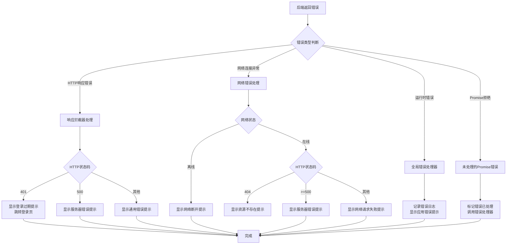

# 响应处理

<cite>
**本文档引用的文件**
- [errorCode.js](file://bear-jia-vue3\src\utils\errorCode.js)
- [request.js](file://bear-jia-vue3\src\utils\request.js)
- [errorHandler.js](file://bear-jia-vue3\src\plugins\errorHandler.js)
</cite>

## 目录
1. [简介](#简介)
2. [全局错误码体系](#全局错误码体系)
3. [请求处理与错误映射](#请求处理与错误映射)
4. [错误处理策略](#错误处理策略)
5. [错误处理流程图](#错误处理流程图)
6. [业务代码中的错误处理](#业务代码中的错误处理)
7. [总结](#总结)

## 简介
本文档详细解析了Vue项目中的API响应处理机制，重点分析了全局错误码体系、请求处理流程以及错误处理策略。文档涵盖了从后端返回错误到前端展示提示的完整过程，以及如何在业务代码中优雅地捕获和处理特定错误。

## 全局错误码体系

本文档分析了`errorCode.js`文件中定义的全局错误码体系，该体系为系统中的各种错误提供了统一的用户友好提示信息。错误码体系通过简单的键值对映射，将HTTP状态码或业务错误码转换为中文提示信息，确保用户能够理解错误原因。

错误码体系包含以下关键错误码：
- '401': 认证失败，无法访问系统资源！
- '403': 当前操作没有权限！
- '404': 访问资源不存在！
- 'default': 系统未知错误，请反馈给管理员！

该错误码体系被`request.js`和`errorHandler.js`等文件引用，作为错误信息映射的基础，确保了整个系统中错误提示的一致性。

**节来源**
- [errorCode.js](file://bear-jia-vue3\src\utils\errorCode.js#L1-L7)

## 请求处理与错误映射

`request.js`文件实现了基于axios的请求封装，包含了请求和响应拦截器，负责处理所有API请求的错误映射和用户提示。该文件通过导入`errorCode.js`中的错误码体系，将后端返回的错误码映射为用户友好的提示信息。

关键处理逻辑包括：
1. **请求拦截器**：在请求发送前，自动添加认证令牌（Authorization header），并处理GET请求的参数映射。
2. **响应拦截器**：处理后端返回的各种错误情况，根据错误码显示相应的用户提示。
3. **特殊错误处理**：针对401未授权错误，自动跳转到登录页；针对500服务器错误，显示服务器错误提示。

对于401错误的处理尤为关键，当系统检测到认证失败时，会显示"登录状态已过期，请重新登录"的提示，并自动跳转到登录页面，确保用户体验的流畅性。

**节来源**
- [request.js](file://bear-jia-vue3\src\utils\request.js#L1-L165)

## 错误处理策略

`errorHandler.js`文件定义了针对不同错误类型的差异化处理策略，通过错误类型枚举（ErrorType）区分网络错误、API错误、运行时错误和验证错误，并为每种错误类型提供专门的处理函数。

### 错误类型分类
- **NETWORK**：网络连接异常、请求超时等
- **API**：业务逻辑错误，如权限不足、数据验证失败等
- **RUNTIME**：JavaScript运行时错误
- **VALIDATION**：表单验证失败

### 差异化处理策略
1. **网络错误处理**：根据网络状态和HTTP状态码提供不同的提示，如"网络连接已断开"、"服务器暂时无法响应请求"等。
2. **API错误处理**：根据API响应中的错误码显示相应的业务提示，如401错误显示"登录已过期"，403错误显示"权限不足"。
3. **表单验证错误处理**：将验证错误对象中的所有错误信息合并，以简洁的方式展示给用户。

该错误处理策略通过Vue插件的形式安装，设置了全局的错误处理器（errorHandler），并捕获未处理的Promise拒绝，确保所有错误都能被妥善处理。

**节来源**
- [errorHandler.js](file://bear-jia-vue3\src\plugins\errorHandler.js#L1-L194)

## 错误处理流程图

以下流程图展示了从后端返回错误到前端展示提示的完整过程：

**图来源**
- [request.js](file://bear-jia-vue3\src\utils\request.js#L69-L123)
- [errorHandler.js](file://bear-jia-vue3\src\plugins\errorHandler.js#L28-L159)

## 业务代码中的错误处理

在业务代码中，可以通过多种方式优雅地捕获和处理特定错误：

1. **使用try-catch**：在async函数中使用try-catch捕获Promise拒绝。
2. **使用.catch()**：在Promise链中使用.catch()方法处理错误。
3. **调用全局错误处理器**：通过`$errorHandler`调用全局错误处理函数，指定错误类型和上下文。

对于特定业务场景的错误处理，建议在捕获错误后，根据错误类型和业务需求进行适当的处理，如显示自定义提示、记录日志或执行恢复操作。

## 总结
本文档详细解析了系统的API响应处理机制，包括全局错误码体系、请求处理与错误映射、错误处理策略以及业务代码中的错误处理方法。通过这些机制，系统能够为用户提供清晰、友好的错误提示，同时确保错误能够被妥善处理，提升应用的稳定性和用户体验。