# 模块化API组织

<cite>
**本文档中引用的文件**  
- [login.js](file://bear-jia-vue3/src/api/login.js)
- [user.js](file://bear-jia-vue3/src/api/system/user.js)
- [server.js](file://bear-jia-vue3/src/api/monitor/server.js)
- [gen.js](file://bear-jia-vue3/src/api/tool/gen.js)
- [request.js](file://bear-jia-vue3/src/utils/request.js)
- [auth.js](file://bear-jia-vue3/src/utils/auth.js)
- [dept.js](file://bear-jia-vue3/src/api/system/dept.js)
- [dict/data.js](file://bear-jia-vue3/src/api/system/dict/data.js)
- [menu.js](file://bear-jia-vue3/src/api/system/menu.js)
- [config.js](file://bear-jia-vue3/src/api/system/config.js)
- [file.js](file://bear-jia-vue3/src/api/system/file.js)
- [oss.js](file://bear-jia-vue3/src/api/system/oss.js)
- [ossConfig.js](file://bear-jia-vue3/src/api/system/ossConfig.js)
- [post.js](file://bear-jia-vue3/src/api/system/post.js)
- [online.js](file://bear-jia-vue3/src/api/monitor/online.js)
</cite>

## 目录
1. [项目结构概览](#项目结构概览)
2. [模块化API组织原则](#模块化api组织原则)
3. [系统模块API设计](#系统模块api设计)
4. [监控模块API设计](#监控模块api设计)
5. [工具模块API设计](#工具模块api设计)
6. [API命名规范与参数约定](#api命名规范与参数约定)
7. [登录认证流程解析](#登录认证流程解析)
8. [常见API模式实现](#常见api模式实现)
9. [API调用示例](#api调用示例)

## 项目结构概览

本项目采用模块化API组织方式，将不同功能领域的API接口按业务模块进行分类管理。src/api目录下主要包含system（系统管理）、monitor（系统监控）、tool（系统工具）等核心模块，以及独立的login.js用于处理认证相关接口。

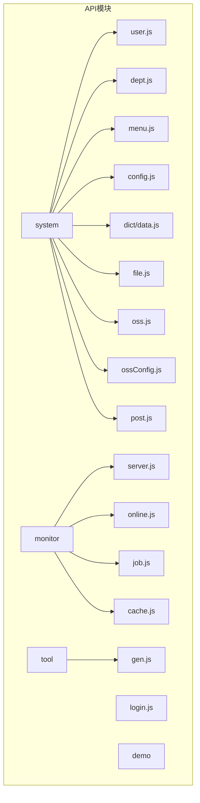

**图示来源**
- [项目结构](file://bear-jia-vue3/src/api)

## 模块化API组织原则

项目中的API组织遵循清晰的模块划分原则，每个模块负责特定的业务功能领域：

- **system模块**：集中管理系统核心功能，包括用户、部门、菜单、配置、字典等基础数据管理
- **monitor模块**：负责系统运行状态监控，包括服务器信息、在线用户、定时任务等
- **tool模块**：提供系统工具功能，如代码生成器等
- **独立login.js**：专门处理用户认证相关接口，确保安全相关逻辑的集中管理

这种组织方式实现了高内聚低耦合的设计目标，便于维护和扩展。

**模块来源**
- [system](file://bear-jia-vue3/src/api/system)
- [monitor](file://bear-jia-vue3/src/api/monitor)
- [tool](file://bear-jia-vue3/src/api/tool)
- [login.js](file://bear-jia-vue3/src/api/login.js)

## 系统模块API设计

系统模块包含多个子模块，每个子模块对应一个特定的业务实体，采用统一的设计模式。

### 用户管理API
user.js文件集中管理所有用户相关接口，包括用户查询、增删改查、密码重置、状态修改等功能。

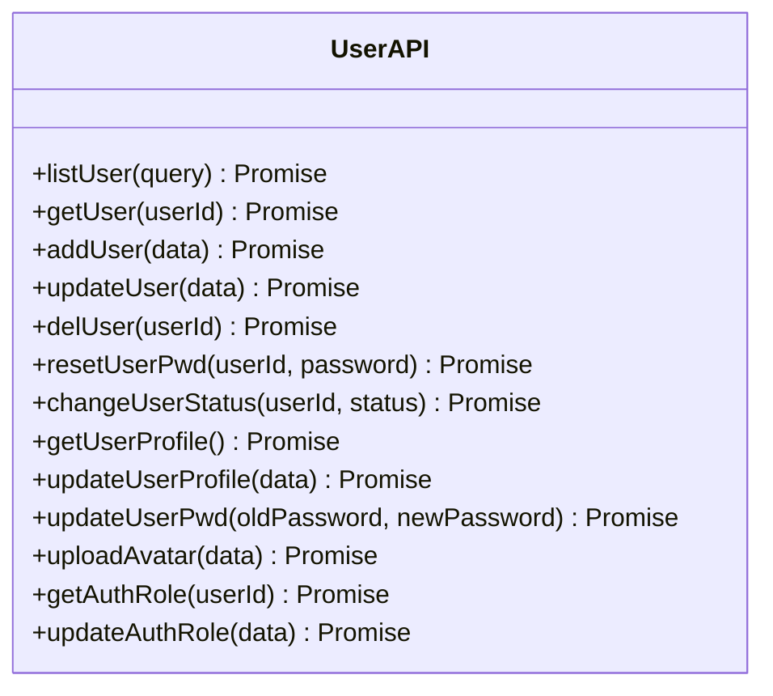

**图示来源**
- [user.js](file://bear-jia-vue3/src/api/system/user.js)

### 部门管理API
dept.js文件负责部门相关的所有操作，支持树形结构数据的处理。

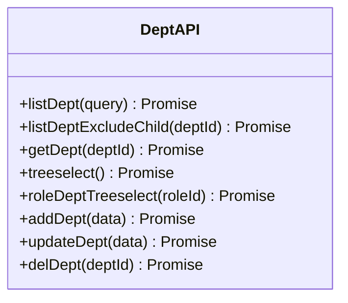

**图示来源**
- [dept.js](file://bear-jia-vue3/src/api/system/dept.js)

### 菜单管理API
menu.js文件处理菜单相关的所有操作，同样支持树形结构。

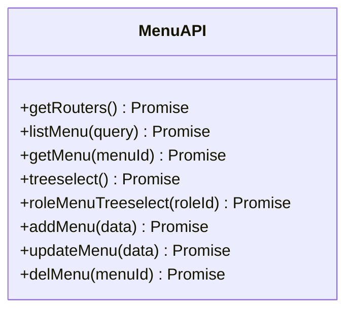

**图示来源**
- [menu.js](file://bear-jia-vue3/src/api/system/menu.js)

### 配置管理API
config.js文件管理系统的参数配置。

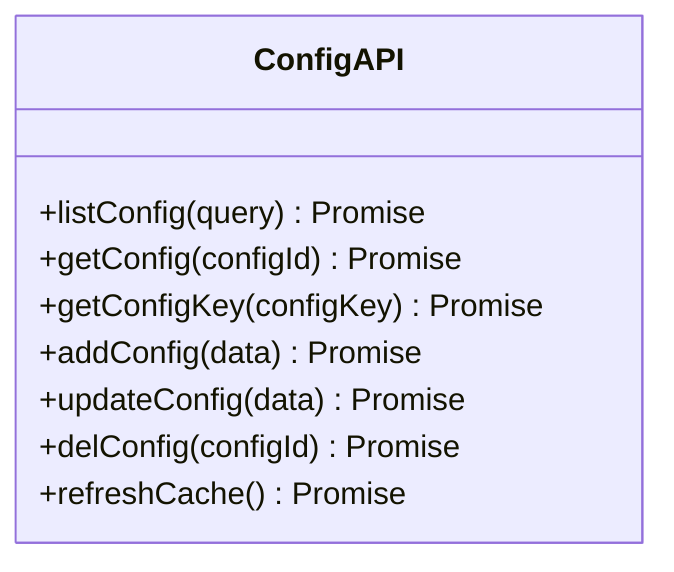

**图示来源**
- [config.js](file://bear-jia-vue3/src/api/system/config.js)

### 字典管理API
dict/data.js文件处理字典数据的操作。

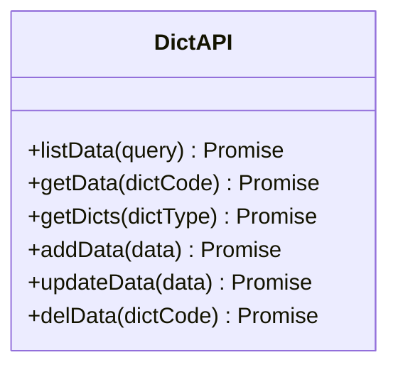

**图示来源**
- [data.js](file://bear-jia-vue3/src/api/system/dict/data.js)

## 监控模块API设计

监控模块提供系统运行状态的监控功能。

### 服务器监控API
server.js文件提供服务器详细信息查询接口。

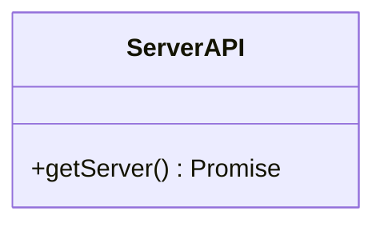

**图示来源**
- [server.js](file://bear-jia-vue3/src/api/monitor/server.js)

### 在线用户监控API
online.js文件管理在线用户的相关操作。

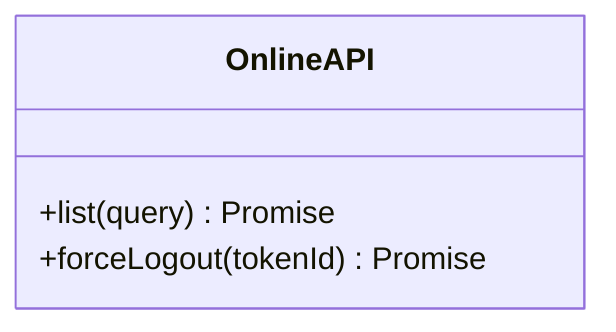

**图示来源**
- [online.js](file://bear-jia-vue3/src/api/monitor/online.js)

## 工具模块API设计

工具模块提供系统工具功能。

### 代码生成器API
gen.js文件提供代码生成器的所有功能。

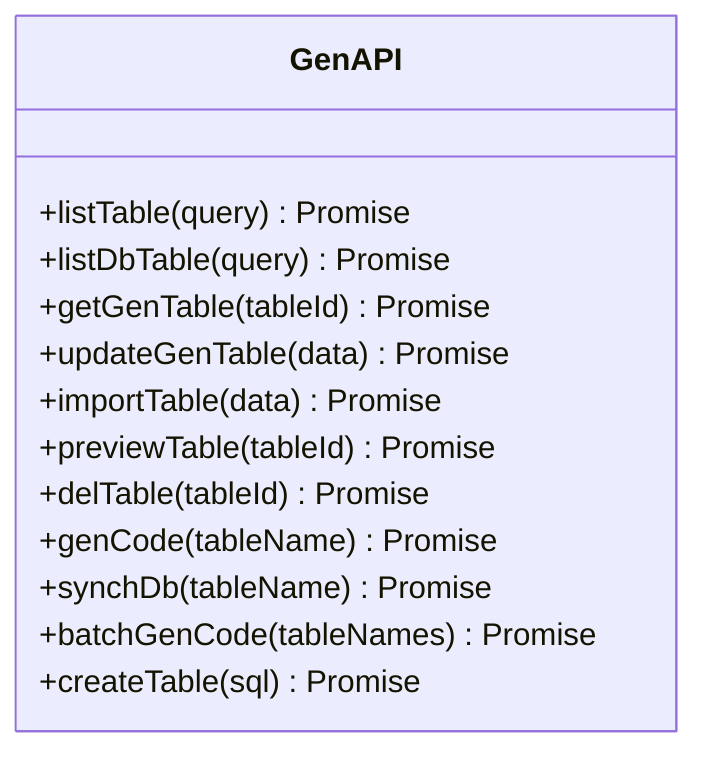

**图示来源**
- [gen.js](file://bear-jia-vue3/src/api/tool/gen.js)

## API命名规范与参数约定

项目中的API方法遵循统一的命名规范和参数约定：

### 命名规范
- **查询列表**：`listXxx(query)` - 如`listUser(query)`
- **查询详情**：`getXxx(id)` - 如`getUser(userId)`
- **新增**：`addXxx(data)` - 如`addUser(data)`
- **修改**：`updateXxx(data)` - 如`updateUser(data)`
- **删除**：`delXxx(id)` - 如`delUser(userId)`
- **特殊操作**：使用动词+名词形式，如`resetUserPwd`、`changeUserStatus`

### 参数约定
- **查询参数**：使用`query`对象传递分页和过滤条件
- **数据操作**：使用`data`对象传递操作数据
- **路径参数**：直接作为函数参数传递，如`userId`、`deptId`
- **文件上传**：使用`FormData`对象传递

**规范来源**
- [user.js](file://bear-jia-vue3/src/api/system/user.js#L5-L131)
- [dept.js](file://bear-jia-vue3/src/api/system/dept.js#L4-L69)
- [menu.js](file://bear-jia-vue3/src/api/system/menu.js#L12-L68)

## 登录认证流程解析

登录认证流程涉及多个组件的协同工作，从用户登录到token存储的完整链路如下：

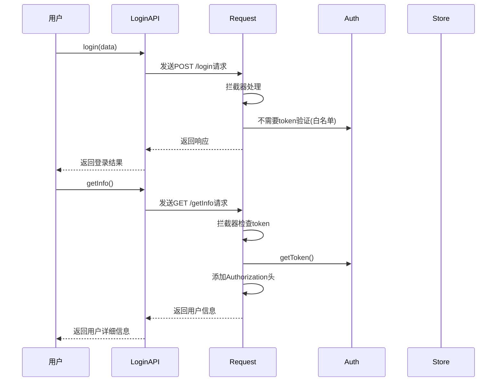

**流程来源**
- [login.js](file://bear-jia-vue3/src/api/login.js)
- [request.js](file://bear-jia-vue3/src/utils/request.js)
- [auth.js](file://bear-jia-vue3/src/utils/auth.js)

关键组件说明：
- **login.js**：提供`login`方法处理用户登录
- **request.js**：请求拦截器自动处理token添加
- **auth.js**：提供`getToken`、`setToken`等token管理方法

## 常见API模式实现

### 文件上传模式
文件上传采用FormData方式，设置特定的Content-Type。

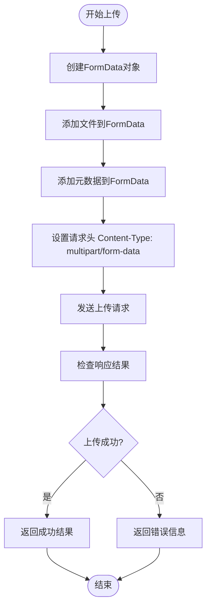

**实现来源**
- [file.js](file://bear-jia-vue3/src/api/system/file.js#L130-L163)
- [user.js](file://bear-jia-vue3/src/api/system/user.js#L104-L112)

### 分页查询模式
分页查询通过query参数传递分页信息。

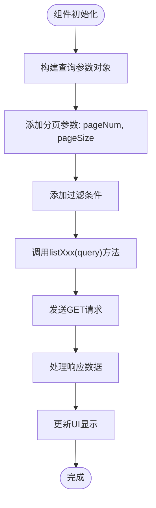

**实现来源**
- [user.js](file://bear-jia-vue3/src/api/system/user.js#L5-L10)
- [dept.js](file://bear-jia-vue3/src/api/system/dept.js#L4-L9)

### 树形数据加载模式
树形数据通过特定接口获取层级结构。

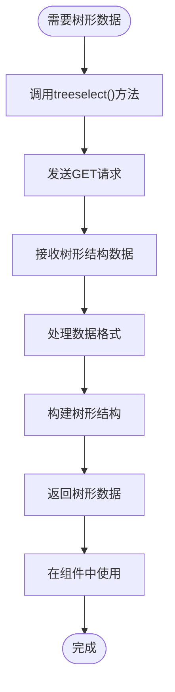

**实现来源**
- [dept.js](file://bear-jia-vue3/src/api/system/dept.js#L29-L33)
- [menu.js](file://bear-jia-vue3/src/api/system/menu.js#L29-L33)

## API调用示例

### 用户管理调用示例
```javascript
import { listUser, getUser, addUser } from '@/api/system/user'

// 获取用户列表
const getUserList = async () => {
  const query = {
    pageNum: 1,
    pageSize: 10,
    userName: '张三'
  }
  const response = await listUser(query)
  return response.rows
}

// 获取用户详情
const fetchUserDetail = async (userId) => {
  const response = await getUser(userId)
  return response.data
}

// 新增用户
const createUser = async (userData) => {
  const response = await addUser(userData)
  return response
}
```

**示例来源**
- [user.js](file://bear-jia-vue3/src/api/system/user.js)

### 文件上传调用示例
```javascript
import { uploadFile, uploadUserAvatar } from '@/api/system/file'

// 通用文件上传
const uploadGenericFile = async (file, businessType, businessId) => {
  const formData = new FormData()
  formData.append('file', file)
  formData.append('businessType', businessType)
  if (businessId) {
    formData.append('businessId', businessId)
  }
  
  const response = await uploadFile(formData)
  return response
}

// 用户头像上传
const uploadAvatar = async (file, userId) => {
  const formData = new FormData()
  formData.append('file', file)
  formData.append('userId', userId)
  
  const response = await uploadUserAvatar(formData)
  return response
}
```

**示例来源**
- [file.js](file://bear-jia-vue3/src/api/system/file.js)

### 登录认证调用示例
```javascript
import { login, getInfo, logout } from '@/api/login'
import { setToken, removeToken } from '@/utils/auth'

// 用户登录
const handleLogin = async (loginData) => {
  try {
    const response = await login(loginData)
    const { token } = response
    setToken(token)
    return response
  } catch (error) {
    throw error
  }
}

// 获取用户信息
const fetchUserInfo = async () => {
  const response = await getInfo()
  return response
}

// 用户登出
const handleLogout = async () => {
  await logout()
  removeToken()
}
```

**示例来源**
- [login.js](file://bear-jia-vue3/src/api/login.js)
- [auth.js](file://bear-jia-vue3/src/utils/auth.js)