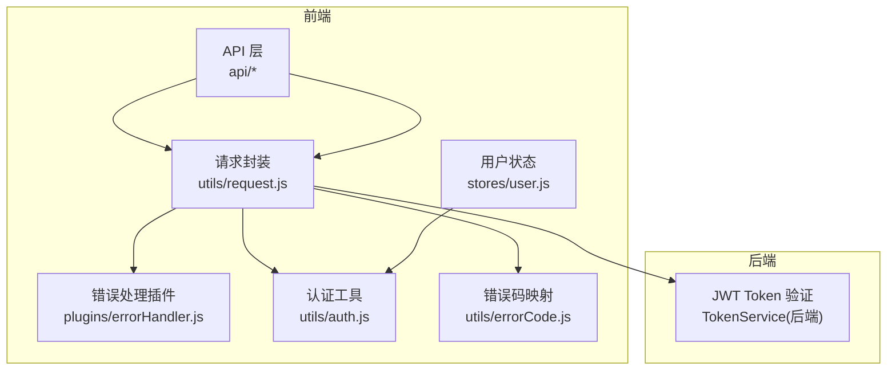
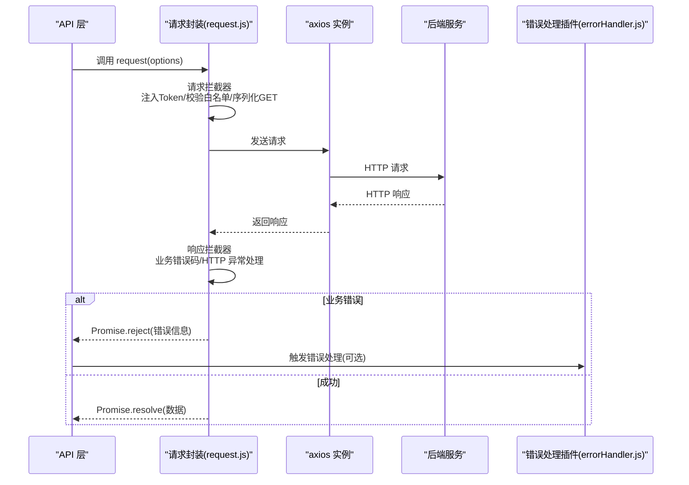
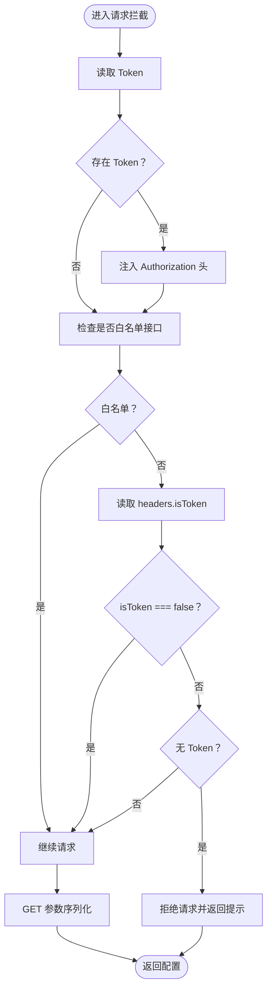
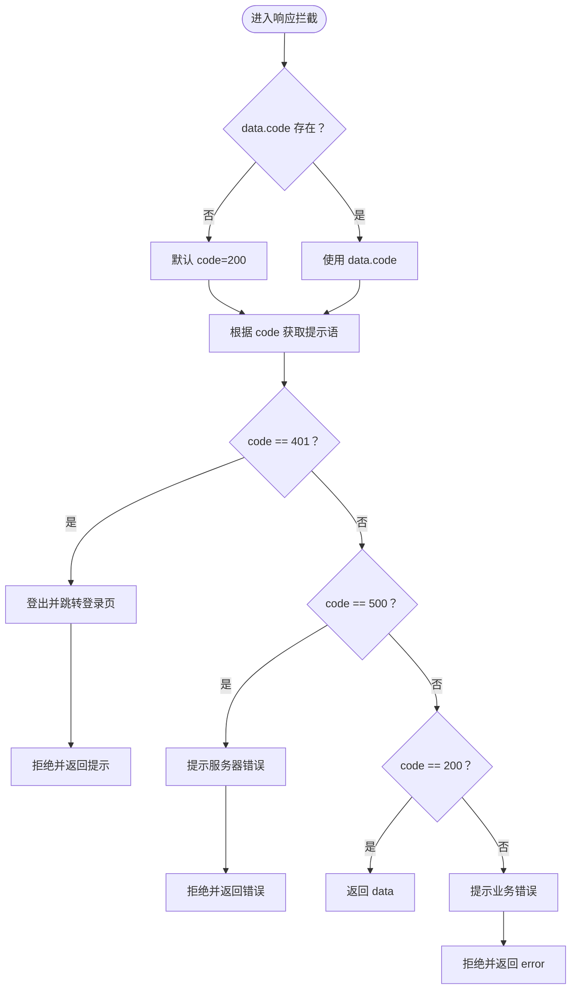
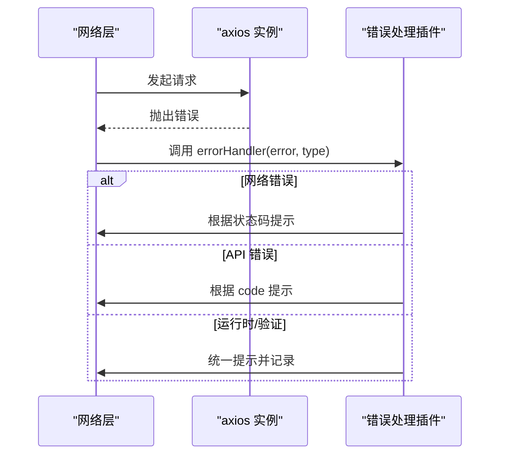
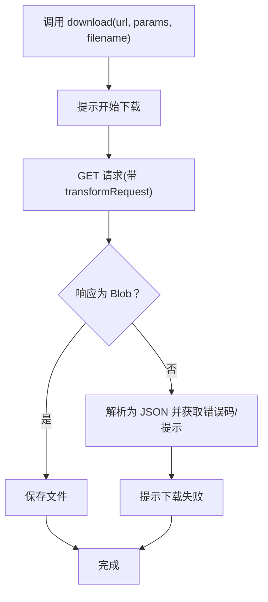
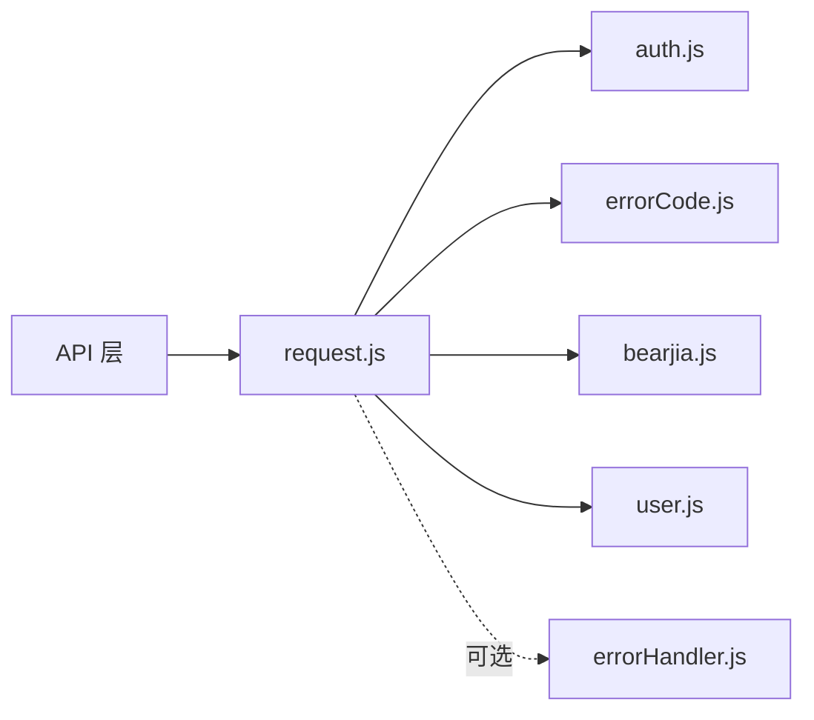
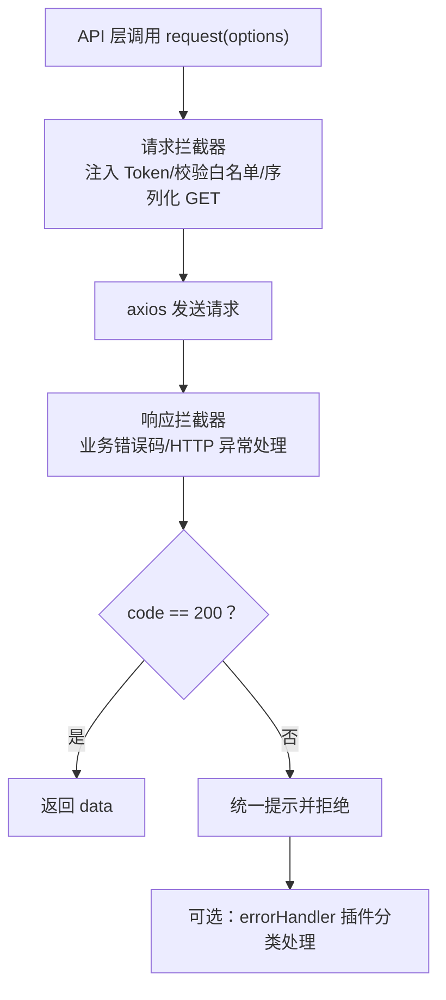

# 请求封装

<cite>
**本文引用的文件**
- [request.js](file://bear-jia-vue3/src/utils/request.js)
- [errorHandler.js](file://bear-jia-vue3/src/plugins/errorHandler.js)
- [auth.js](file://bear-jia-vue3/src/utils/auth.js)
- [errorCode.js](file://bear-jia-vue3/src/utils/errorCode.js)
- [user.js](file://bear-jia-vue3/src/stores/user.js)
- [login.js](file://bear-jia-vue3/src/api/login.js)
- [user.js](file://bear-jia-vue3/src/api/system/user.js)
- [bearjia.js](file://bear-jia-vue3/src/utils/bearjia.js)
</cite>

## 目录
1. [简介](#简介)
2. [项目结构](#项目结构)
3. [核心组件](#核心组件)
4. [架构总览](#架构总览)
5. [详细组件分析](#详细组件分析)
6. [依赖关系分析](#依赖关系分析)
7. [性能考量](#性能考量)
8. [故障排查指南](#故障排查指南)
9. [结论](#结论)
10. [附录](#附录)

## 简介
本文件聚焦于基于 axios 的请求封装，系统性说明：
- 请求拦截器如何统一注入 JWT Token、处理加载状态占位、对 GET 参数进行序列化
- 响应拦截器如何进行全局错误码处理、HTTP 状态码映射、异常捕获
- 与 errorHandler 插件的集成方式：网络异常、API 业务异常的分类处理策略
- 请求配置选项说明：超时设置、免 Token 请求控制（isToken=false）等
- 结合代码示例展示 GET/POST 请求的调用模式与自定义配置方法
- 提供请求生命周期流程图，覆盖从发起请求到响应处理的完整链路

## 项目结构
围绕请求封装的相关文件分布如下：
- 请求封装与拦截器：utils/request.js
- 错误处理插件：plugins/errorHandler.js
- 认证工具：utils/auth.js
- 错误码映射：utils/errorCode.js
- 用户状态与 Token 生命周期：stores/user.js
- API 使用示例：api/login.js、api/system/user.js
- 工具方法：utils/bearjia.js（含 tansParams、blobValidate）

图表来源
- [request.js](file://bear-jia-vue3/src/utils/request.js#L1-L165)
- [errorHandler.js](file://bear-jia-vue3/src/plugins/errorHandler.js#L1-L194)
- [auth.js](file://bear-jia-vue3/src/utils/auth.js#L1-L16)
- [errorCode.js](file://bear-jia-vue3/src/utils/errorCode.js#L1-L7)
- [user.js](file://bear-jia-vue3/src/stores/user.js#L1-L83)

章节来源
- [request.js](file://bear-jia-vue3/src/utils/request.js#L1-L165)
- [login.js](file://bear-jia-vue3/src/api/login.js#L1-L57)
- [user.js](file://bear-jia-vue3/src/api/system/user.js#L1-L131)

## 核心组件
- axios 实例与默认配置：设置 Content-Type、baseURL、timeout
- 白名单接口：无需 Token 即可访问
- 请求拦截器：注入 Authorization、校验 Token、GET 参数序列化
- 响应拦截器：业务错误码映射、HTTP 异常分类、统一提示
- 下载方法：transformRequest、Content-Type、Blob 校验与保存
- 错误处理插件：网络、API、运行时、验证类错误的分类处理

章节来源
- [request.js](file://bear-jia-vue3/src/utils/request.js#L1-L165)
- [errorHandler.js](file://bear-jia-vue3/src/plugins/errorHandler.js#L1-L194)

## 架构总览
请求封装的整体交互如下：
- API 层通过 request(options) 发起请求
- 请求拦截器统一注入 Token、校验白名单/isToken、序列化 GET 参数
- axios 发送请求至后端，响应返回后由响应拦截器统一处理
- 若发生网络异常或业务错误，统一通过通知组件提示
- 错误处理插件可进一步对网络、API、运行时错误进行分类处理

图表来源
- [request.js](file://bear-jia-vue3/src/utils/request.js#L1-L165)
- [errorHandler.js](file://bear-jia-vue3/src/plugins/errorHandler.js#L1-L194)

## 详细组件分析

### 请求拦截器（统一注入 Token、参数序列化、白名单校验）
- 注入 Authorization：从 Cookie 中读取 Token 并拼接 Bearer 前缀
- 白名单校验：对特定接口（如登录、验证码）放行
- isToken 控制：当 headers.isToken 显式设为 false 时，不强制要求 Token
- GET 参数序列化：将 params 对象转换为 URL 查询串，支持嵌套对象
- 异常分支：若非白名单且未设置 isToken 且无 Token，则拒绝请求并返回提示

图表来源
- [request.js](file://bear-jia-vue3/src/utils/request.js#L24-L67)
- [auth.js](file://bear-jia-vue3/src/utils/auth.js#L1-L16)

章节来源
- [request.js](file://bear-jia-vue3/src/utils/request.js#L24-L67)
- [auth.js](file://bear-jia-vue3/src/utils/auth.js#L1-L16)

### 响应拦截器（业务错误码、HTTP 异常、统一提示）
- 默认状态码：若 data.code 不存在，默认按 200 成功处理
- 错误码映射：根据 data.code 从 errorCode.js 获取提示语
- 特殊分支：
  - 401：登出并跳转登录页
  - 500：提示服务器内部错误
  - 非 200：统一提示业务错误
  - 其他：透传 data
- 网络异常：对 Network Error、timeout、状态码异常进行统一提示

图表来源
- [request.js](file://bear-jia-vue3/src/utils/request.js#L70-L123)
- [errorCode.js](file://bear-jia-vue3/src/utils/errorCode.js#L1-L7)
- [user.js](file://bear-jia-vue3/src/stores/user.js#L64-L83)

章节来源
- [request.js](file://bear-jia-vue3/src/utils/request.js#L70-L123)
- [errorCode.js](file://bear-jia-vue3/src/utils/errorCode.js#L1-L7)
- [user.js](file://bear-jia-vue3/src/stores/user.js#L64-L83)

### 与 errorHandler 插件的集成
- errorHandler 插件提供网络、API、运行时、验证四类错误的分类处理
- 在网络异常场景，插件根据 HTTP 状态区分 404、5xx 等并给出相应提示
- 在 API 业务错误场景，依据 code 进行权限、登录过期等提示
- 插件还支持全局 Vue 错误捕获与未处理 Promise 错误捕获

图表来源
- [errorHandler.js](file://bear-jia-vue3/src/plugins/errorHandler.js#L1-L194)

章节来源
- [errorHandler.js](file://bear-jia-vue3/src/plugins/errorHandler.js#L1-L194)

### 下载方法（download）
- transformRequest：将 params 序列化为 application/x-www-form-urlencoded
- Content-Type：设置为 application/x-www-form-urlencoded
- responseType：设置为 blob
- Blob 校验：通过 blobValidate 判断响应是否为业务错误（JSON）或文件流
- 保存文件：使用浏览器下载能力保存文件

图表来源
- [request.js](file://bear-jia-vue3/src/utils/request.js#L126-L162)
- [bearjia.js](file://bear-jia-vue3/src/utils/bearjia.js#L201-L238)

章节来源
- [request.js](file://bear-jia-vue3/src/utils/request.js#L126-L162)
- [bearjia.js](file://bear-jia-vue3/src/utils/bearjia.js#L201-L238)

### 请求配置选项说明
- 超时设置：默认 10000ms；可在调用时覆盖（如验证码接口设置为 20000ms）
- 免 Token 请求控制：headers.isToken=false 时，即使未登录也允许请求
- Content-Type：默认 application/json；下载时改为 application/x-www-form-urlencoded
- baseURL：从环境变量读取 VITE_APP_BASE_API
- GET 参数序列化：自动将 params 转为查询串，支持嵌套对象

章节来源
- [request.js](file://bear-jia-vue3/src/utils/request.js#L9-L21)
- [login.js](file://bear-jia-vue3/src/api/login.js#L47-L57)

### GET/POST 请求调用模式与自定义配置
- GET 请求：通过 params 传递查询参数，拦截器会将其序列化到 URL
- POST/PUT/DELETE：通过 data 传递请求体
- 自定义配置：可在 headers 中设置 isToken=false，或在调用时设置 timeout
- 文件上传：设置 headers.Content-Type 为 multipart/form-data

章节来源
- [user.js](file://bear-jia-vue3/src/api/system/user.js#L1-L131)
- [login.js](file://bear-jia-vue3/src/api/login.js#L1-L57)

## 依赖关系分析
- request.js 依赖：
  - utils/auth.js：读取/设置 Token
  - utils/errorCode.js：业务错误码提示映射
  - utils/bearjia.js：tansParams、blobValidate
  - stores/user.js：登出逻辑（401 场景）
  - plugins/errorHandler.js：可选的全局错误处理
- API 层依赖 request.js，间接依赖上述工具模块

图表来源
- [request.js](file://bear-jia-vue3/src/utils/request.js#L1-L165)
- [auth.js](file://bear-jia-vue3/src/utils/auth.js#L1-L16)
- [errorCode.js](file://bear-jia-vue3/src/utils/errorCode.js#L1-L7)
- [bearjia.js](file://bear-jia-vue3/src/utils/bearjia.js#L1-L238)
- [user.js](file://bear-jia-vue3/src/stores/user.js#L1-L83)
- [errorHandler.js](file://bear-jia-vue3/src/plugins/errorHandler.js#L1-L194)

章节来源
- [request.js](file://bear-jia-vue3/src/utils/request.js#L1-L165)
- [user.js](file://bear-jia-vue3/src/stores/user.js#L1-L83)

## 性能考量
- 超时设置：默认 10000ms，针对耗时接口可适当提高（如验证码接口）
- GET 参数序列化：避免深层嵌套导致 URL 过长，必要时改用 POST 或分页
- 下载大文件：注意内存占用，建议后端分片或流式传输
- Token 缓存：避免频繁读取 Cookie，可在拦截器内复用

## 故障排查指南
- 未登录或登录过期
  - 现象：401 错误并触发登出与跳转
  - 排查：确认 Token 是否存在、是否过期、是否被清除
  - 参考路径：[request.js](file://bear-jia-vue3/src/utils/request.js#L77-L88)，[user.js](file://bear-jia-vue3/src/stores/user.js#L64-L83)
- 业务错误提示
  - 现象：非 200 时统一提示
  - 排查：核对后端返回 code 与 errorCode.js 映射
  - 参考路径：[request.js](file://bear-jia-vue3/src/utils/request.js#L95-L101)，[errorCode.js](file://bear-jia-vue3/src/utils/errorCode.js#L1-L7)
- 网络异常
  - 现象：Network Error、timeout、状态码异常
  - 排查：检查网络连通性、后端服务状态、代理配置
  - 参考路径：[request.js](file://bear-jia-vue3/src/utils/request.js#L106-L121)
- 下载失败
  - 现象：blobValidate 判定为业务错误
  - 排查：确认后端返回是否为 JSON 错误体
  - 参考路径：[request.js](file://bear-jia-vue3/src/utils/request.js#L126-L162)，[bearjia.js](file://bear-jia-vue3/src/utils/bearjia.js#L227-L238)

章节来源
- [request.js](file://bear-jia-vue3/src/utils/request.js#L70-L123)
- [errorCode.js](file://bear-jia-vue3/src/utils/errorCode.js#L1-L7)
- [user.js](file://bear-jia-vue3/src/stores/user.js#L64-L83)
- [bearjia.js](file://bear-jia-vue3/src/utils/bearjia.js#L227-L238)

## 结论
该请求封装通过拦截器实现了 Token 注入、参数序列化与白名单控制，响应拦截器统一处理业务错误与网络异常，并与 errorHandler 插件形成互补。配合 API 层的清晰调用方式，能够快速构建稳定可靠的前后端交互链路。建议在实际项目中：
- 明确区分免 Token 与需要 Token 的接口，合理设置 isToken
- 针对长耗时接口调整超时时间
- 对下载与大文件传输优化后端实现
- 将 errorCode.js 与后端保持一致，确保提示语准确

## 附录
- 请求生命周期流程图（代码级映射）

图表来源
- [request.js](file://bear-jia-vue3/src/utils/request.js#L24-L123)
- [errorHandler.js](file://bear-jia-vue3/src/plugins/errorHandler.js#L1-L194)