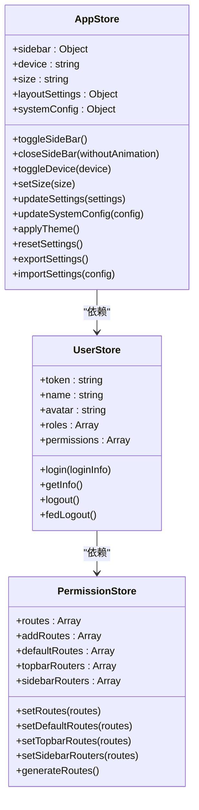
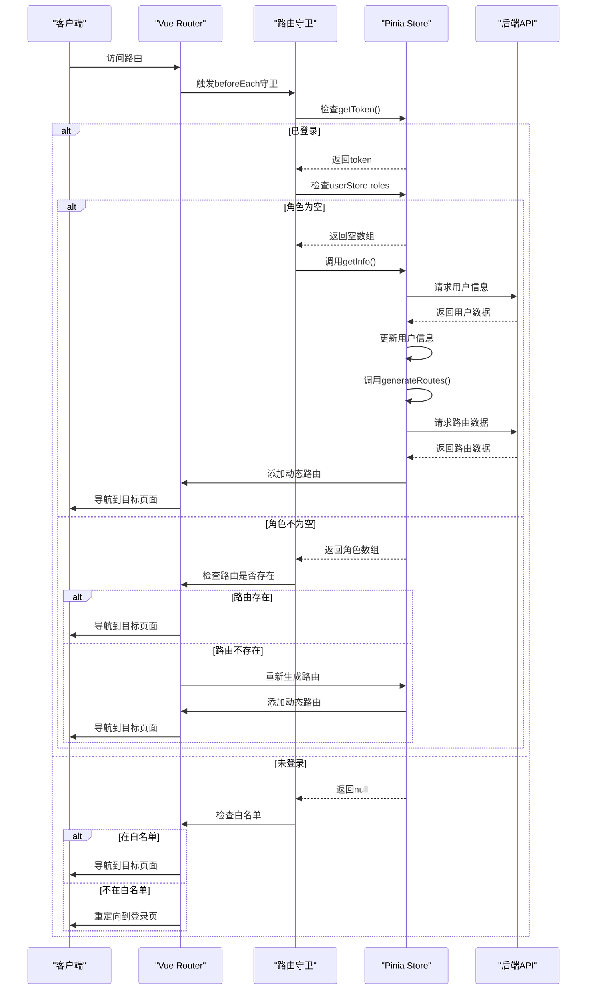
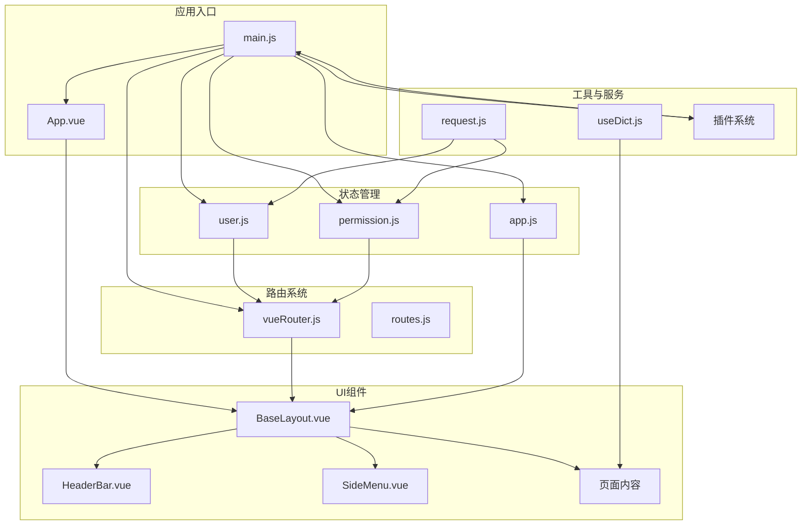

# 前端架构

<cite>
**本文档引用的文件**   
- [main.js](file://bear-jia-vue3/src/main.js)
- [App.vue](file://bear-jia-vue3/src/App.vue)
- [vueRouter.js](file://bear-jia-vue3/src/router/vueRouter.js)
- [routes.js](file://bear-jia-vue3/src/router/routes.js)
- [user.js](file://bear-jia-vue3/src/stores/user.js)
- [permission.js](file://bear-jia-vue3/src/stores/permission.js)
- [app.js](file://bear-jia-vue3/src/stores/app.js)
- [useDict.js](file://bear-jia-vue3/src/composables/useDict.js)
- [request.js](file://bear-jia-vue3/src/utils/request.js)
- [BaseLayout.vue](file://bear-jia-vue3/src/layout/BaseLayout.vue)
- [HeaderBar.vue](file://bear-jia-vue3/src/components/layout/HeaderBar.vue)
- [index.vue](file://bear-jia-vue3/src/views/system/user/index.vue)
</cite>

## 目录

1. [项目结构](#项目结构)
2. [Vue3组合式API应用](#vue3组合式api应用)
3. [状态管理方案](#状态管理方案)
4. [路由系统设计](#路由系统设计)
5. [应用入口初始化流程](#应用入口初始化流程)
6. [组件通信模式](#组件通信模式)
7. [架构图](#架构图)

## 项目结构

该项目采用模块化设计，src目录下包含多个功能子目录，每个目录都有明确的职责划分。api目录存放所有与后端交互的接口定义，按功能模块组织，如system、monitor等。components目录包含可复用的UI组件，分为通用组件和布局组件。views目录存放页面级组件，按业务模块组织。stores目录使用Pinia进行状态管理，包含user、permission、app等模块。router目录负责路由配置和导航守卫。composables目录存放组合式函数，如useDict用于字典数据管理。utils目录包含各种工具函数和配置。layout目录定义了应用的整体布局结构。

**Section sources**
- [main.js](file://bear-jia-vue3/src/main.js#L1-L62)
- [App.vue](file://bear-jia-vue3/src/App.vue#L1-L5)

## Vue3组合式API应用

项目广泛使用Vue3的组合式API，通过setup函数组织组件逻辑。ref用于创建响应式的基本类型数据，reactive用于创建响应式的对象。在BaseLayout.vue中，使用ref定义collapsed、loading等状态变量，使用reactive定义menuState等复杂状态对象。computed用于创建计算属性，如layoutClasses根据布局设置动态生成CSS类名。watch用于监听路由变化，onMounted用于在组件挂载后执行初始化逻辑。项目还使用了getCurrentInstance获取组件实例，用于访问全局属性。

**Section sources**
- [BaseLayout.vue](file://bear-jia-vue3/src/layout/BaseLayout.vue#L261-L800)

## 状态管理方案

项目采用Pinia进行状态管理，定义了多个store模块。user.js store管理用户认证状态，包括token、用户信息、角色权限等，提供登录、获取用户信息、退出登录等actions。permission.js store管理路由权限，通过constantRoutes定义静态路由，通过getRouters API获取动态路由，使用filterAsyncRouter过滤用户可访问的路由。app.js store管理应用级状态，如侧边栏展开状态、设备类型、布局设置等。stores通过defineStore定义，使用state、getters、actions组织逻辑，通过useStore函数在组件中使用。

**Diagram sources**
- [user.js](file://bear-jia-vue3/src/stores/user.js#L1-L83)
- [permission.js](file://bear-jia-vue3/src/stores/permission.js#L1-L264)
- [app.js](file://bear-jia-vue3/src/stores/app.js#L1-L180)

## 路由系统设计

路由系统采用动态路由和权限路由结合的方式。vueRouter.js定义了路由实例和全局守卫，routes.js定义了静态路由。路由守卫在router.beforeEach中实现，检查用户登录状态，未登录用户重定向到登录页。已登录用户通过permissionStore.generateRoutes()生成可访问的路由表，并动态添加到路由实例中。权限控制通过meta.role实现，hasPermission函数检查用户角色是否匹配路由要求。项目支持多种布局模式，通过layoutSettings.navMode配置，包括侧边栏、顶部菜单、混合、分栏和抽屉模式。

**Diagram sources**
- [vueRouter.js](file://bear-jia-vue3/src/router/vueRouter.js#L1-L130)
- [routes.js](file://bear-jia-vue3/src/router/routes.js#L1-L100)

## 应用入口初始化流程

main.js是应用的入口文件，负责初始化Vue应用和各种插件。首先导入Vue、Pinia、Vue Router等核心库，然后创建应用实例和Pinia实例。接着注册各种插件，包括Ant Design Vue组件库、自定义指令、错误处理、表格插件等。应用挂载后，通过setTimeout异步初始化主题服务和系统配置。initAllConfigs初始化所有配置，watchConfigChanges监听配置变化。themeService.init初始化主题服务，支持跟随系统主题。全局组件如GlobalLoading、DictTag通过app.component注册。全局属性useDict通过app.config.globalProperties添加。

**Section sources**
- [main.js](file://bear-jia-vue3/src/main.js#L1-L62)

## 组件通信模式

项目采用多种组件通信模式。props用于父组件向子组件传递数据，如HeaderBar组件通过props接收collapsed、layoutSettings等属性。emit用于子组件向父组件发送事件，如SideMenu组件通过@menu-select向父组件传递菜单选择事件。provide/inject用于跨层级组件通信，如布局组件向子组件提供布局设置。全局状态通过Pinia store共享，如用户信息在userStore中管理，多个组件可以访问。全局属性通过app.config.globalProperties添加，如useDict可在任何组件中使用。事件总线模式通过$tab、$auth等全局对象实现，如$modal用于显示模态框。

**Section sources**
- [BaseLayout.vue](file://bear-jia-vue3/src/layout/BaseLayout.vue#L261-L800)
- [HeaderBar.vue](file://bear-jia-vue3/src/components/layout/HeaderBar.vue#L166-L533)
- [index.vue](file://bear-jia-vue3/src/views/system/user/index.vue#L94-L177)

## 架构图

**Diagram sources**
- [main.js](file://bear-jia-vue3/src/main.js#L1-L62)
- [App.vue](file://bear-jia-vue3/src/App.vue#L1-L5)
- [BaseLayout.vue](file://bear-jia-vue3/src/layout/BaseLayout.vue#L261-L800)
- [vueRouter.js](file://bear-jia-vue3/src/router/vueRouter.js#L1-L130)
- [user.js](file://bear-jia-vue3/src/stores/user.js#L1-L83)
- [permission.js](file://bear-jia-vue3/src/stores/permission.js#L1-L264)
- [app.js](file://bear-jia-vue3/src/stores/app.js#L1-L180)
- [request.js](file://bear-jia-vue3/src/utils/request.js#L1-L165)
- [useDict.js](file://bear-jia-vue3/src/composables/useDict.js#L1-L185)