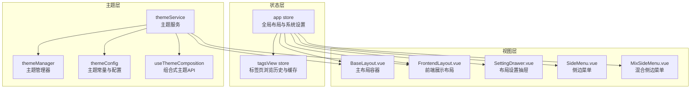
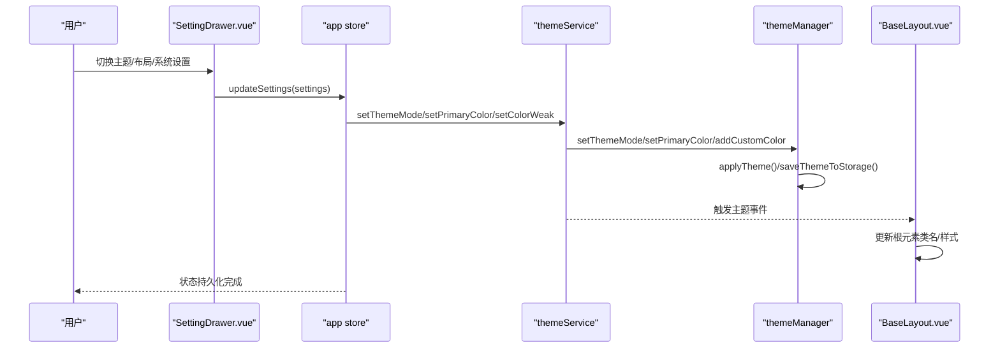
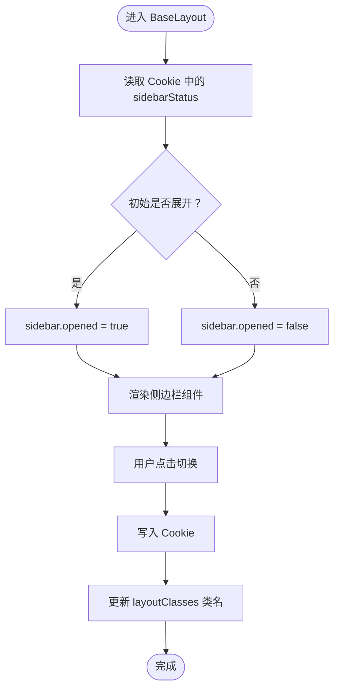
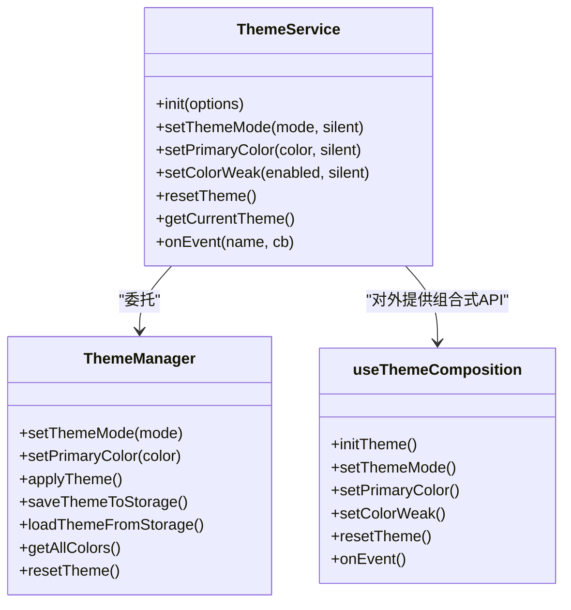
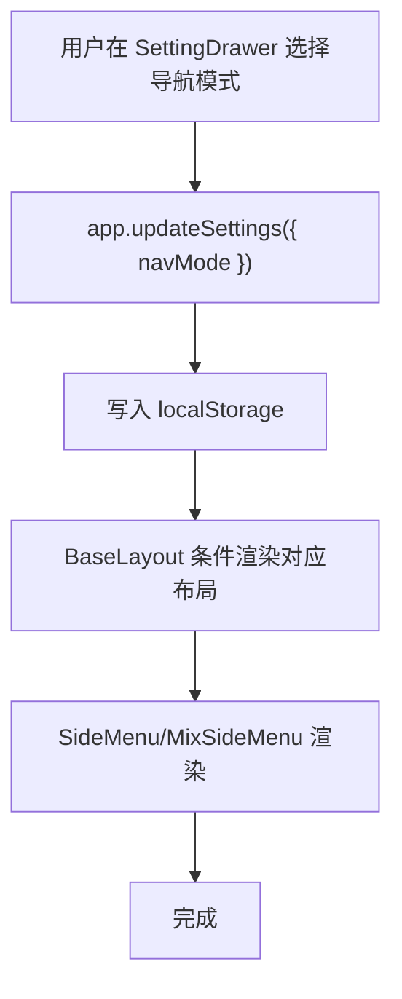
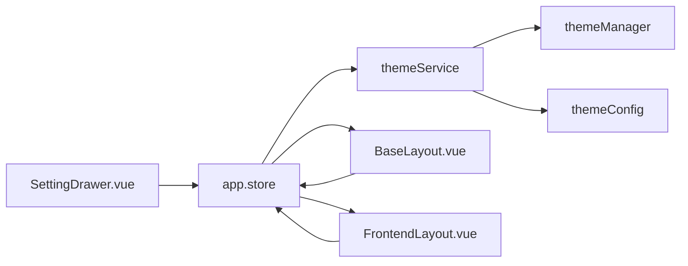

# 应用状态管理

<cite>
**本文引用的文件**
- [app.js](file://bear-jia-vue3/src/stores/app.js)
- [tagsView.js](file://bear-jia-vue3/src/stores/tagsView.js)
- [themeService.js](file://bear-jia-vue3/src/utils/theme/themeService.js)
- [themeManager.js](file://bear-jia-vue3/src/utils/theme/themeManager.js)
- [themeConfig.js](file://bear-jia-vue3/src/utils/theme/themeConfig.js)
- [useThemeComposition.js](file://bear-jia-vue3/src/utils/theme/composables/useThemeComposition.js)
- [BaseLayout.vue](file://bear-jia-vue3/src/layout/BaseLayout.vue)
- [FrontendLayout.vue](file://bear-jia-vue3/src/layout/FrontendLayout.vue)
- [SettingDrawer.vue](file://bear-jia-vue3/src/components/layout/SettingDrawer.vue)
- [SideMenu.vue](file://bear-jia-vue3/src/components/layout/SideMenu.vue)
- [MixSideMenu.vue](file://bear-jia-vue3/src/components/layout/MixSideMenu.vue)
- [main.js](file://bear-jia-vue3/src/main.js)
- [performance.js](file://bear-jia-vue3/src/utils/performance.js)
</cite>

## 目录
1. [简介](#简介)
2. [项目结构](#项目结构)
3. [核心组件](#核心组件)
4. [架构总览](#架构总览)
5. [详细组件分析](#详细组件分析)
6. [依赖关系分析](#依赖关系分析)
7. [性能考量](#性能考量)
8. [故障排查指南](#故障排查指南)
9. [结论](#结论)
10. [附录](#附录)

## 简介
本文件聚焦于应用状态管理，围绕全局 app store 的状态与行为进行系统化梳理，重点覆盖：
- 侧边栏展开/折叠状态的响应式切换与持久化存储
- 主题模式（亮色/暗色）切换逻辑、CSS 变量动态更新与组件样式联动
- 多布局模式（侧边栏、顶部菜单、混合、分栏、抽屉）的状态管理与切换实现
- 系统设置（固定 Header、显示标签页等）的配置存储与应用
- app store 与其他 store（如 tagsView）的交互关系
- API 接口清单（getter/action/mutation）
- 状态变更的性能优化策略，避免不必要的组件重渲染

## 项目结构
本项目的全局状态主要由 Pinia store 管理，主题系统由独立的主题服务与主题管理器负责，布局组件根据 app store 的布局设置进行条件渲染与样式绑定。

图表来源
- [app.js](file://bear-jia-vue3/src/stores/app.js#L1-L180)
- [tagsView.js](file://bear-jia-vue3/src/stores/tagsView.js#L1-L106)
- [themeService.js](file://bear-jia-vue3/src/utils/theme/themeService.js#L1-L558)
- [themeManager.js](file://bear-jia-vue3/src/utils/theme/themeManager.js#L1-L372)
- [themeConfig.js](file://bear-jia-vue3/src/utils/theme/themeConfig.js#L1-L234)
- [useThemeComposition.js](file://bear-jia-vue3/src/utils/theme/composables/useThemeComposition.js#L1-L280)
- [BaseLayout.vue](file://bear-jia-vue3/src/layout/BaseLayout.vue#L1-L260)
- [FrontendLayout.vue](file://bear-jia-vue3/src/layout/FrontendLayout.vue#L1-L238)
- [SettingDrawer.vue](file://bear-jia-vue3/src/components/layout/SettingDrawer.vue#L1-L200)
- [SideMenu.vue](file://bear-jia-vue3/src/components/layout/SideMenu.vue#L1-L37)
- [MixSideMenu.vue](file://bear-jia-vue3/src/components/layout/MixSideMenu.vue#L1-L36)

章节来源
- [app.js](file://bear-jia-vue3/src/stores/app.js#L1-L180)
- [BaseLayout.vue](file://bear-jia-vue3/src/layout/BaseLayout.vue#L1-L260)

## 核心组件
- app store：集中管理侧边栏状态、设备类型、尺寸、布局设置、系统配置，并提供主题应用、设置更新、系统配置更新、重置与导入导出等动作。
- tagsView store：维护已访问视图与缓存视图集合，支持增删改查与清空等操作，用于标签页导航与缓存控制。
- 主题服务与管理器：统一主题模式、主题色、色弱模式的设置与持久化，动态生成并应用 CSS 变量，触发主题事件。
- 布局组件：根据 app store 的布局设置动态渲染不同布局模式，并将主题类名与开关状态传递给菜单组件。

章节来源
- [app.js](file://bear-jia-vue3/src/stores/app.js#L1-L180)
- [tagsView.js](file://bear-jia-vue3/src/stores/tagsView.js#L1-L106)
- [themeService.js](file://bear-jia-vue3/src/utils/theme/themeService.js#L1-L558)
- [themeManager.js](file://bear-jia-vue3/src/utils/theme/themeManager.js#L1-L372)
- [BaseLayout.vue](file://bear-jia-vue3/src/layout/BaseLayout.vue#L1-L260)

## 架构总览
应用状态管理采用“store + 主题服务 + 布局组件”的分层架构：
- store 层：app store 负责布局与系统配置；tagsView store 负责标签页浏览与缓存。
- 主题层：themeService 作为统一入口，委托 themeManager 实现主题持久化与 CSS 变量应用；themeConfig 定义常量与事件。
- 视图层：BaseLayout 根据 layoutSettings 渲染多种布局；SettingDrawer 提供可视化设置入口；SideMenu/MixSideMenu 根据 darkMode 与 layoutSettings 渲染主题态。

图表来源
- [SettingDrawer.vue](file://bear-jia-vue3/src/components/layout/SettingDrawer.vue#L1-L200)
- [app.js](file://bear-jia-vue3/src/stores/app.js#L66-L118)
- [themeService.js](file://bear-jia-vue3/src/utils/theme/themeService.js#L189-L273)
- [themeManager.js](file://bear-jia-vue3/src/utils/theme/themeManager.js#L103-L142)
- [BaseLayout.vue](file://bear-jia-vue3/src/layout/BaseLayout.vue#L758-L776)

## 详细组件分析

### 侧边栏展开/折叠状态管理
- 状态来源：app.store.sidebar.opened 从 Cookie 读取初始值，默认展开；device 与 size 也作为全局状态的一部分。
- 切换逻辑：
  - toggleSideBar：翻转 opened 状态，并写入 Cookie。
  - closeSideBar：显式关闭并写入 Cookie。
- 响应式与持久化：
  - Cookie 用于跨会话记住侧边栏状态。
  - BaseLayout 通过 layoutClasses 将 opened 状态映射为类名，影响菜单与布局样式。
- 与布局的关系：
  - 不同布局模式下，侧边栏组件（SideMenu、MixSideMenu）根据 collapsed 状态与 layoutSettings.darkMode 渲染主题态。

图表来源
- [app.js](file://bear-jia-vue3/src/stores/app.js#L7-L10)
- [app.js](file://bear-jia-vue3/src/stores/app.js#L41-L49)
- [app.js](file://bear-jia-vue3/src/stores/app.js#L51-L55)
- [BaseLayout.vue](file://bear-jia-vue3/src/layout/BaseLayout.vue#L378-L390)
- [SideMenu.vue](file://bear-jia-vue3/src/components/layout/SideMenu.vue#L1-L37)
- [MixSideMenu.vue](file://bear-jia-vue3/src/components/layout/MixSideMenu.vue#L1-L36)

章节来源
- [app.js](file://bear-jia-vue3/src/stores/app.js#L7-L10)
- [app.js](file://bear-jia-vue3/src/stores/app.js#L41-L55)
- [BaseLayout.vue](file://bear-jia-vue3/src/layout/BaseLayout.vue#L378-L390)
- [SideMenu.vue](file://bear-jia-vue3/src/components/layout/SideMenu.vue#L1-L37)
- [MixSideMenu.vue](file://bear-jia-vue3/src/components/layout/MixSideMenu.vue#L1-L36)

### 主题模式与主题色切换
- 主题服务：
  - themeService 提供 setThemeMode、setPrimaryColor、setColorWeak、resetTheme 等方法，并持久化到 localStorage。
  - 支持跟随系统主题（prefers-color-scheme），并在切换时触发主题事件。
- 主题管理器：
  - themeManager 负责应用主题到 DOM（添加/移除 dark-theme 类）、设置 CSS 变量、生成颜色变体、保存/加载主题配置。
- 组合式 API：
  - useThemeComposition 提供响应式主题状态与事件监听，便于组件内直接使用。
- 应用方式：
  - BaseLayout 在挂载时调用 appStore.applyTheme，确保主题立即生效；同时通过 layoutClasses 将 darkMode 映射为类名。
  - FrontendLayout 通过按钮切换 darkMode 并调用 appStore.updateSettings，实现前端展示页的主题切换。

图表来源
- [themeService.js](file://bear-jia-vue3/src/utils/theme/themeService.js#L1-L558)
- [themeManager.js](file://bear-jia-vue3/src/utils/theme/themeManager.js#L1-L372)
- [useThemeComposition.js](file://bear-jia-vue3/src/utils/theme/composables/useThemeComposition.js#L1-L280)

章节来源
- [themeService.js](file://bear-jia-vue3/src/utils/theme/themeService.js#L189-L273)
- [themeManager.js](file://bear-jia-vue3/src/utils/theme/themeManager.js#L103-L142)
- [BaseLayout.vue](file://bear-jia-vue3/src/layout/BaseLayout.vue#L758-L776)
- [FrontendLayout.vue](file://bear-jia-vue3/src/layout/FrontendLayout.vue#L209-L213)

### 多布局模式（侧边栏/顶部菜单/混合/分栏/抽屉）
- 模式来源：app.store.layoutSettings.navMode 控制布局模式，支持 side、top、mix、column、drawer。
- 渲染逻辑：
  - BaseLayout 根据 navMode 条件渲染不同布局容器，并注入菜单组件与内容区域。
  - MixSideMenu 仅在 mix 模式下显示，且根据当前一级菜单渲染二级/三级菜单。
- 设置入口：
  - SettingDrawer 提供导航模式选择，点击后通过 updateSettings 更新 navMode 并持久化。
- 样式联动：
  - layoutClasses 将 navMode 映射为布局类名，配合 CSS 实现不同布局的差异化样式。

图表来源
- [SettingDrawer.vue](file://bear-jia-vue3/src/components/layout/SettingDrawer.vue#L49-L97)
- [app.js](file://bear-jia-vue3/src/stores/app.js#L66-L88)
- [BaseLayout.vue](file://bear-jia-vue3/src/layout/BaseLayout.vue#L1-L86)
- [MixSideMenu.vue](file://bear-jia-vue3/src/components/layout/MixSideMenu.vue#L1-L36)

章节来源
- [SettingDrawer.vue](file://bear-jia-vue3/src/components/layout/SettingDrawer.vue#L49-L97)
- [BaseLayout.vue](file://bear-jia-vue3/src/layout/BaseLayout.vue#L1-L86)
- [MixSideMenu.vue](file://bear-jia-vue3/src/components/layout/MixSideMenu.vue#L1-L36)

### 系统设置（固定 Header、显示标签页等）的配置存储与应用
- 存储位置：
  - app.store.layoutSettings 中的多项设置（如 fixedHeader、fixedSidebar、multiTab、hideFooter、tableStriped、tableShowHeader 等）分别持久化到 localStorage。
  - app.store.systemConfig 中的标题、Logo、版权、版本等信息持久化到 localStorage。
- 应用方式：
  - BaseLayout 通过 layoutClasses 将 fixedHeader、fixedSidebar、colorWeak 等映射为类名，直接影响样式。
  - SettingDrawer 提供可视化开关，修改后通过 updateSettings 持久化并即时生效。
  - FrontendLayout 读取 app.store.layoutSettings.darkMode 并在切换时调用 updateSettings。

章节来源
- [app.js](file://bear-jia-vue3/src/stores/app.js#L13-L28)
- [app.js](file://bear-jia-vue3/src/stores/app.js#L66-L88)
- [BaseLayout.vue](file://bear-jia-vue3/src/layout/BaseLayout.vue#L378-L390)
- [SettingDrawer.vue](file://bear-jia-vue3/src/components/layout/SettingDrawer.vue#L100-L158)
- [FrontendLayout.vue](file://bear-jia-vue3/src/layout/FrontendLayout.vue#L209-L213)

### app store 与其他 store 的交互（与 tagsView 的协同）
- 交互点：
  - BaseLayout 同时依赖 app.store 与 tagsView.store，用于菜单渲染与标签页缓存。
  - tagsView.store 维护 visitedViews 与 cachedViews，支持新增、删除、清空等操作。
- 协同意义：
  - app.store 提供布局与主题状态；tagsView.store 提供标签页浏览历史与缓存控制，二者共同决定页面导航与缓存策略。

章节来源
- [BaseLayout.vue](file://bear-jia-vue3/src/layout/BaseLayout.vue#L260-L339)
- [tagsView.js](file://bear-jia-vue3/src/stores/tagsView.js#L1-L106)

## 依赖关系分析
- app.store 依赖 themeService 获取当前主题色与模式，并在 updateSettings 中调用 themeService 的 set* 方法以持久化与应用主题。
- BaseLayout 与 FrontendLayout 通过 layoutSettings 与 darkMode 控制布局与主题类名。
- SettingDrawer 作为 UI 入口，直接调用 app.store.updateSettings，间接驱动主题与布局变更。
- themeService 依赖 themeManager 与 themeConfig，统一主题持久化与事件分发。

图表来源
- [app.js](file://bear-jia-vue3/src/stores/app.js#L66-L118)
- [themeService.js](file://bear-jia-vue3/src/utils/theme/themeService.js#L1-L558)
- [themeManager.js](file://bear-jia-vue3/src/utils/theme/themeManager.js#L1-L372)
- [themeConfig.js](file://bear-jia-vue3/src/utils/theme/themeConfig.js#L1-L234)
- [BaseLayout.vue](file://bear-jia-vue3/src/layout/BaseLayout.vue#L1-L260)
- [FrontendLayout.vue](file://bear-jia-vue3/src/layout/FrontendLayout.vue#L1-L238)
- [SettingDrawer.vue](file://bear-jia-vue3/src/components/layout/SettingDrawer.vue#L1-L200)

## 性能考量
- 避免不必要的重渲染：
  - BaseLayout 中对 layoutSettings 与 themeVars 的计算采用 computed，减少 DOM 操作频率。
  - themeService 的 setColorWeak 与 setThemeMode 通过类名切换与 CSS 变量应用，避免全量重绘。
- 主题变量计算优化：
  - BaseLayout 中 themeVars 计算仅返回值，不直接设置 DOM，由 applyTheme 统一处理，降低重复设置。
- 组合式主题 API：
  - useThemeComposition 在组件挂载时订阅主题事件，卸载时取消订阅，避免内存泄漏。
- 其他性能工具：
  - utils/performance.js 提供防抖、节流、虚拟滚动等工具，可在需要时用于复杂列表或高频事件场景。

章节来源
- [BaseLayout.vue](file://bear-jia-vue3/src/layout/BaseLayout.vue#L358-L372)
- [BaseLayout.vue](file://bear-jia-vue3/src/layout/BaseLayout.vue#L758-L776)
- [useThemeComposition.js](file://bear-jia-vue3/src/utils/theme/composables/useThemeComposition.js#L118-L139)
- [performance.js](file://bear-jia-vue3/src/utils/performance.js#L1-L84)

## 故障排查指南
- 主题未生效：
  - 检查 appStore.applyTheme 是否被调用（BaseLayout 挂载时已调用）。
  - 确认 themeService.init 是否在应用启动后执行（main.js 中已延迟初始化）。
  - 查看 localStorage 中主题键值是否正确（theme-config、darkMode、primaryColor）。
- 侧边栏状态异常：
  - 检查 Cookie 中 sidebarStatus 是否被正确写入与读取。
  - 确认 layoutClasses 是否包含正确的侧边栏类名。
- 布局切换无效：
  - 检查 SettingDrawer 是否调用了 app.updateSettings 并持久化到 localStorage。
  - 确认 BaseLayout 的条件渲染逻辑是否匹配 navMode。
- 标签页缓存问题：
  - 检查 tagsView.store 的 visitedViews/cachedViews 是否按预期增删。
  - 确认路由 meta.noCache 与 affix 标记是否正确。

章节来源
- [main.js](file://bear-jia-vue3/src/main.js#L46-L55)
- [BaseLayout.vue](file://bear-jia-vue3/src/layout/BaseLayout.vue#L758-L776)
- [SettingDrawer.vue](file://bear-jia-vue3/src/components/layout/SettingDrawer.vue#L1-L200)
- [app.js](file://bear-jia-vue3/src/stores/app.js#L66-L118)
- [tagsView.js](file://bear-jia-vue3/src/stores/tagsView.js#L1-L106)

## 结论
本项目通过 app store 统一管理布局与系统配置，借助主题服务与管理器实现主题模式与主题色的动态切换与持久化；布局组件根据 app.store 的布局设置进行条件渲染，形成清晰的分层架构。通过 computed 与组合式主题 API，系统在保证功能完整性的同时兼顾了性能与可维护性。建议在后续迭代中进一步完善主题事件的统一处理与标签页缓存策略的可视化配置。

## 附录

### API 接口文档（app store）
- 状态
  - sidebar.opened: boolean
  - sidebar.withoutAnimation: boolean
  - device: string
  - size: string
  - layoutSettings: object（包含 primaryColor、darkMode、navMode、layout、contentWidth、fixedHeader、fixedSidebar、splitMenus、colorWeak、multiTab、hideFooter、tableStriped、tableShowHeader 等）
  - systemConfig: object（包含 title、logo、copyright、version、description、keywords 等）

- Actions
  - toggleSideBar(): 切换侧边栏展开/折叠，并持久化到 Cookie
  - closeSideBar(withoutAnimation): 关闭侧边栏并持久化
  - toggleDevice(device): 切换设备类型
  - setSize(size): 设置尺寸并持久化到 Cookie
  - updateSettings(settings): 合并并持久化布局设置；当涉及主题色/模式/色弱时委托 themeService 应用
  - updateSystemConfig(config): 合并并持久化系统配置；更新页面标题
  - applyTheme(): 应用主题（委托 themeService）
  - resetSettings(): 重置为默认设置并清理 localStorage（非主题相关）
  - exportSettings(): 导出当前配置为 JSON 文件
  - importSettings(config): 导入配置并应用

章节来源
- [app.js](file://bear-jia-vue3/src/stores/app.js#L1-L180)

### API 接口文档（tagsView store）
- 状态
  - visitedViews: 数组
  - cachedViews: 数组

- Actions
  - addView(view): 同时添加已访问视图与缓存视图
  - addVisitedView(view): 添加已访问视图（去重）
  - addCachedView(view): 添加缓存视图（受 noCache 影响）
  - delView(view): 删除指定视图并返回剩余集合
  - delVisitedView(view): 删除已访问视图
  - delCachedView(view): 删除缓存视图
  - delOthersViews(view): 保留当前视图与固定标签，删除其他
  - delAllViews(): 清空所有视图并保留固定标签
  - updateVisitedView(view): 更新已访问视图元信息

章节来源
- [tagsView.js](file://bear-jia-vue3/src/stores/tagsView.js#L1-L106)

### API 接口文档（主题服务 themeService）
- Methods
  - init(options): 初始化主题服务，加载用户偏好并应用当前主题
  - setThemeMode(mode, silent): 设置主题模式（亮/暗），持久化并触发事件
  - setPrimaryColor(color, silent): 设置主题色，持久化并触发事件
  - setColorWeak(enabled, silent): 设置色弱模式，持久化并触发事件
  - toggleTheme(): 切换主题模式
  - resetTheme(): 重置为主题默认值
  - getCurrentTheme(): 获取当前主题信息
  - onEvent(name, callback): 监听主题事件
  - exportThemeConfig()/downloadThemeConfig()/importThemeConfig()/importThemeFromFile()

章节来源
- [themeService.js](file://bear-jia-vue3/src/utils/theme/themeService.js#L1-L558)

### API 接口文档（主题管理器 themeManager）
- Methods
  - setThemeMode(mode)/toggleTheme()/setPrimaryColor(color)/addCustomColor/removeCustomColor/resetTheme()
  - applyTheme(): 应用主题到 DOM（类名/CSS 变量）
  - loadThemeFromStorage()/saveThemeToStorage()
  - getAllColors()/exportTheme()/importTheme()
  - onThemeChange(callback)/emitThemeChange()

章节来源
- [themeManager.js](file://bear-jia-vue3/src/utils/theme/themeManager.js#L1-L372)

### API 接口文档（组合式主题 useThemeComposition）
- Exposed
  - 响应式状态：themeMode、primaryColor、isDarkMode、isLightMode、colorWeak、presetColors、allColors、currentTheme
  - 方法：initTheme、setThemeMode、toggleTheme、setPrimaryColor、setColorWeak、addCustomColor、removeCustomColor、resetTheme、exportThemeConfig、importThemeConfig、downloadThemeConfig、importThemeFromFile
  - 事件：onMounted/onUnmounted 订阅主题事件

章节来源
- [useThemeComposition.js](file://bear-jia-vue3/src/utils/theme/composables/useThemeComposition.js#L1-L280)