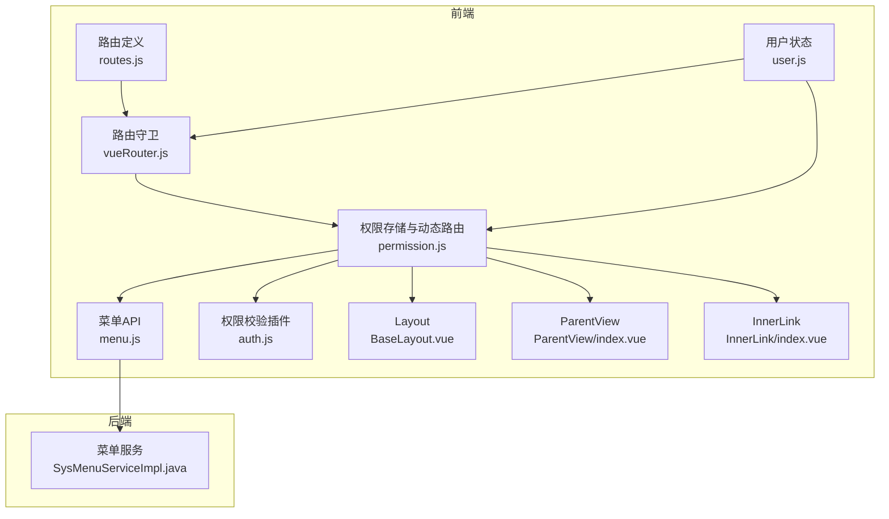
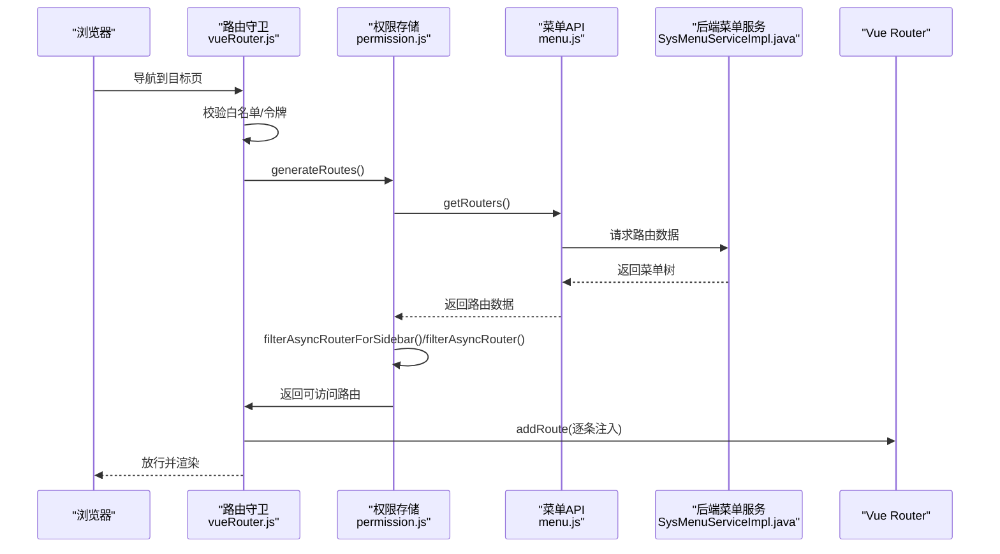
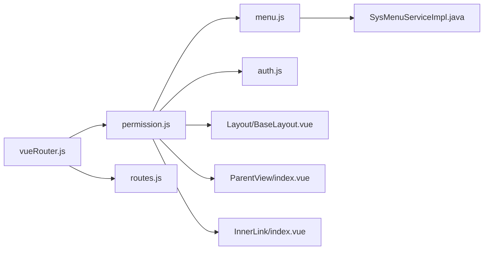

# 动态路由生成

<cite>
**本文引用的文件**
- [permission.js](file://bear-jia-vue3/src/stores/permission.js)
- [vueRouter.js](file://bear-jia-vue3/src/router/vueRouter.js)
- [routes.js](file://bear-jia-vue3/src/router/routes.js)
- [menu.js](file://bear-jia-vue3/src/api/system/menu.js)
- [auth.js](file://bear-jia-vue3/src/plugins/auth.js)
- [user.js](file://bear-jia-vue3/src/stores/user.js)
- [BaseLayout.vue](file://bear-jia-vue3/src/layout/BaseLayout.vue)
- [ParentView/index.vue](file://bear-jia-vue3/src/layout/ParentView/index.vue)
- [InnerLink/index.vue](file://bear-jia-vue3/src/layout/InnerLink/index.vue)
- [SysMenuServiceImpl.java](file://bearjia-admin-backend/src/main/java/com/javaxiaobear/module/system/service/impl/SysMenuServiceImpl.java)
</cite>

## 目录
1. [简介](#简介)
2. [项目结构](#项目结构)
3. [核心组件](#核心组件)
4. [架构总览](#架构总览)
5. [详细组件分析](#详细组件分析)
6. [依赖关系分析](#依赖关系分析)
7. [性能考量](#性能考量)
8. [故障排查指南](#故障排查指南)
9. [结论](#结论)

## 简介
本文件围绕“基于用户权限的动态路由生成”展开，系统性说明：
- generateRoutes 如何从后端获取菜单数据并生成可访问的路由表
- filterAsyncRouter 与 filterAsyncRouterForSidebar 的区别与用途
- 外链路由与嵌套路由的处理策略
- 路由懒加载的实现方式
- Layout、ParentView、InnerLink 等特殊组件的处理逻辑
- 路由数据转换过程的示例路径
- 性能优化策略（如路径拼接时的斜杠处理）
- 当用户无权限访问某路由时的处理机制

## 项目结构
动态路由相关的核心位置集中在前端路由与权限存储模块，以及后端菜单服务：
- 前端
  - 路由定义与常量路由：[routes.js](file://bear-jia-vue3/src/router/routes.js)
  - 路由守卫与动态注入：[vueRouter.js](file://bear-jia-vue3/src/router/vueRouter.js)
  - 动态路由生成与过滤：[permission.js](file://bear-jia-vue3/src/stores/permission.js)
  - 菜单 API 请求封装：[menu.js](file://bear-jia-vue3/src/api/system/menu.js)
  - 权限校验插件：[auth.js](file://bear-jia-vue3/src/plugins/auth.js)
  - 用户信息与权限状态：[user.js](file://bear-jia-vue3/src/stores/user.js)
  - 特殊布局组件：[BaseLayout.vue](file://bear-jia-vue3/src/layout/BaseLayout.vue)、[ParentView/index.vue](file://bear-jia-vue3/src/layout/ParentView/index.vue)、[InnerLink/index.vue](file://bear-jia-vue3/src/layout/InnerLink/index.vue)
- 后端
  - 菜单服务：[SysMenuServiceImpl.java](file://bearjia-admin-backend/src/main/java/com/javaxiaobear/module/system/service/impl/SysMenuServiceImpl.java)

图表来源
- [routes.js](file://bear-jia-vue3/src/router/routes.js#L1-L100)
- [vueRouter.js](file://bear-jia-vue3/src/router/vueRouter.js#L1-L130)
- [permission.js](file://bear-jia-vue3/src/stores/permission.js#L1-L264)
- [menu.js](file://bear-jia-vue3/src/api/system/menu.js#L1-L68)
- [auth.js](file://bear-jia-vue3/src/plugins/auth.js#L1-L60)
- [user.js](file://bear-jia-vue3/src/stores/user.js#L1-L83)
- [BaseLayout.vue](file://bear-jia-vue3/src/layout/BaseLayout.vue#L24-L60)
- [ParentView/index.vue](file://bear-jia-vue3/src/layout/ParentView/index.vue#L1-L4)
- [InnerLink/index.vue](file://bear-jia-vue3/src/layout/InnerLink/index.vue#L1-L25)
- [SysMenuServiceImpl.java](file://bearjia-admin-backend/src/main/java/com/javaxiaobear/module/system/service/impl/SysMenuServiceImpl.java#L412-L461)

章节来源
- [routes.js](file://bear-jia-vue3/src/router/routes.js#L1-L100)
- [vueRouter.js](file://bear-jia-vue3/src/router/vueRouter.js#L1-L130)
- [permission.js](file://bear-jia-vue3/src/stores/permission.js#L1-L264)
- [menu.js](file://bear-jia-vue3/src/api/system/menu.js#L1-L68)
- [auth.js](file://bear-jia-vue3/src/plugins/auth.js#L1-L60)
- [user.js](file://bear-jia-vue3/src/stores/user.js#L1-L83)
- [BaseLayout.vue](file://bear-jia-vue3/src/layout/BaseLayout.vue#L24-L60)
- [ParentView/index.vue](file://bear-jia-vue3/src/layout/ParentView/index.vue#L1-L4)
- [InnerLink/index.vue](file://bear-jia-vue3/src/layout/InnerLink/index.vue#L1-L25)
- [SysMenuServiceImpl.java](file://bearjia-admin-backend/src/main/java/com/javaxiaobear/module/system/service/impl/SysMenuServiceImpl.java#L412-L461)

## 核心组件
- 动态路由生成与过滤
  - generateRoutes：从后端获取路由数据，分别生成“用于菜单显示”的侧边栏路由与“用于路由注册”的Vue路由，并设置到权限存储中。
  - filterAsyncRouter：过滤异步路由，移除外链；将组件名映射为懒加载函数或特定布局组件；处理嵌套路径拼接与斜杠规范化；清理无用字段。
  - filterAsyncRouterForSidebar：与上述类似，但保留外链，用于菜单渲染。
  - filterChildren/filterChildrenForSidebar：处理 ParentView 嵌套场景下的子路由路径拼接与外链跳过。
  - loadView：Vite 预加载 + import.meta.glob 实现的路由懒加载。
  - filterDynamicRoutes：基于权限数组进行二次过滤（权限插件 hasPermiOr/hasRoleOr）。
- 路由守卫与注入
  - vueRouter.beforeEach：鉴权、白名单、首次进入拉取动态路由并 addRoute 注入。
  - 路由刷新后检测：若目标路由不在已注册表中，则重新生成并注入。
- 特殊组件处理
  - Layout -> BaseLayout.vue
  - ParentView -> ParentView/index.vue（用于嵌套路由容器）
  - InnerLink -> InnerLink/index.vue（内嵌外链 iframe）
- 后端菜单服务
  - SysMenuServiceImpl：根据菜单类型判断是否为 ParentView、内链组件等，决定前端组件映射与路径处理。

章节来源
- [permission.js](file://bear-jia-vue3/src/stores/permission.js#L42-L263)
- [vueRouter.js](file://bear-jia-vue3/src/router/vueRouter.js#L37-L99)
- [SysMenuServiceImpl.java](file://bearjia-admin-backend/src/main/java/com/javaxiaobear/module/system/service/impl/SysMenuServiceImpl.java#L412-L461)

## 架构总览
动态路由生成的整体流程如下：

图表来源
- [vueRouter.js](file://bear-jia-vue3/src/router/vueRouter.js#L37-L99)
- [permission.js](file://bear-jia-vue3/src/stores/permission.js#L234-L263)
- [menu.js](file://bear-jia-vue3/src/api/system/menu.js#L1-L10)
- [SysMenuServiceImpl.java](file://bearjia-admin-backend/src/main/java/com/javaxiaobear/module/system/service/impl/SysMenuServiceImpl.java#L412-L461)

## 详细组件分析

### generateRoutes 方法与后端数据获取
- 数据来源：通过 getRouters() 从后端接口获取菜单树数据。
- 数据副本：为侧边栏、Vue 路由与默认路由分别创建副本，避免互相污染。
- 两套过滤：
  - 侧边栏路由：保留外链，用于菜单显示；调用 filterAsyncRouterForSidebar。
  - Vue 路由：移除外链，避免注册无效路由；调用 filterAsyncRouter。
- 设置状态：将生成的路由写入权限存储的状态，供布局与菜单使用。

章节来源
- [permission.js](file://bear-jia-vue3/src/stores/permission.js#L234-L263)
- [menu.js](file://bear-jia-vue3/src/api/system/menu.js#L1-L10)

### filterAsyncRouter 与 filterAsyncRouterForSidebar 的区别与用途
- 共同点
  - 都会将组件名映射为懒加载函数或特定布局组件：
    - Layout -> BaseLayout.vue
    - ParentView -> ParentView/index.vue
    - InnerLink -> InnerLink/index.vue
  - 都会递归处理 children，并在必要时进行路径拼接与斜杠规范化。
- 不同点
  - filterAsyncRouter：遇到外链（以 http/https/mailto/tel 开头）直接返回 false，不加入 Vue 路由表，仅用于菜单显示。
  - filterAsyncRouterForSidebar：保留外链，用于菜单渲染。
- 嵌套路由处理
  - 当父级组件为 ParentView 且非顶层时，其子路由路径会基于父路径进行拼接，并去除多余斜杠。
  - 子路由中若再次出现 ParentView，会继续按层级拼接，直到叶子节点。

章节来源
- [permission.js](file://bear-jia-vue3/src/stores/permission.js#L42-L175)
- [permission.js](file://bear-jia-vue3/src/stores/permission.js#L176-L208)

### 外链路由与嵌套路由处理
- 外链识别：以 https?://、mailto:、tel: 开头的 path 视为外链。
- 外链去向：
  - Vue 路由：filterAsyncRouter 中直接丢弃，不注册到路由表。
  - 菜单渲染：filterAsyncRouterForSidebar 保留外链，确保菜单可点击。
- 嵌套路由：
  - ParentView 作为容器时，其子路由路径会基于父路径拼接，避免重复前缀与多余斜杠。
  - 若子路由仍为 ParentView，继续按层级拼接，直至叶子节点。

章节来源
- [permission.js](file://bear-jia-vue3/src/stores/permission.js#L75-L101)
- [permission.js](file://bear-jia-vue3/src/stores/permission.js#L105-L175)

### 路由懒加载实现
- 预加载：通过 import.meta.glob 预加载所有视图组件，形成模块映射。
- 动态加载：loadView 根据组件名匹配对应模块，返回一个返回 Promise 的函数，实现按需加载。
- 回退机制：若未找到对应组件，回退到 404 页面组件。

章节来源
- [permission.js](file://bear-jia-vue3/src/stores/permission.js#L38-L41)
- [permission.js](file://bear-jia-vue3/src/stores/permission.js#L177-L191)

### 特殊组件处理逻辑
- Layout -> BaseLayout.vue：作为顶层布局组件，承载头部、侧边栏与内容区。
- ParentView -> ParentView/index.vue：作为嵌套路由容器，内部通过 router-view 渲染子路由。
- InnerLink -> InnerLink/index.vue：用于内嵌外链，通过 iframe 展示外部站点。

章节来源
- [BaseLayout.vue](file://bear-jia-vue3/src/layout/BaseLayout.vue#L24-L60)
- [ParentView/index.vue](file://bear-jia-vue3/src/layout/ParentView/index.vue#L1-L4)
- [InnerLink/index.vue](file://bear-jia-vue3/src/layout/InnerLink/index.vue#L1-L25)

### 路由数据转换过程示例（路径指引）
以下为关键步骤的代码路径参考，便于定位实现细节：
- 生成路由入口：[generateRoutes](file://bear-jia-vue3/src/stores/permission.js#L234-L263)
- 过滤外链与组件映射：[filterAsyncRouter](file://bear-jia-vue3/src/stores/permission.js#L42-L73)
- 侧边栏保留外链：[filterAsyncRouterForSidebar](file://bear-jia-vue3/src/stores/permission.js#L80-L103)
- 嵌套路径拼接与斜杠处理：[filterChildren](file://bear-jia-vue3/src/stores/permission.js#L105-L142)、[filterChildrenForSidebar](file://bear-jia-vue3/src/stores/permission.js#L144-L175)
- 懒加载实现：[loadView](file://bear-jia-vue3/src/stores/permission.js#L177-L191)
- 权限过滤（权限数组）：[filterDynamicRoutes](file://bear-jia-vue3/src/stores/permission.js#L194-L208)
- 路由守卫注入：[beforeEach](file://bear-jia-vue3/src/router/vueRouter.js#L37-L99)
- 常量路由定义：[constantRoutes](file://bear-jia-vue3/src/router/routes.js#L1-L100)
- 后端菜单类型判断：[SysMenuServiceImpl](file://bearjia-admin-backend/src/main/java/com/javaxiaobear/module/system/service/impl/SysMenuServiceImpl.java#L412-L461)

章节来源
- [permission.js](file://bear-jia-vue3/src/stores/permission.js#L42-L208)
- [vueRouter.js](file://bear-jia-vue3/src/router/vueRouter.js#L37-L99)
- [routes.js](file://bear-jia-vue3/src/router/routes.js#L1-L100)
- [SysMenuServiceImpl.java](file://bearjia-admin-backend/src/main/java/com/javaxiaobear/module/system/service/impl/SysMenuServiceImpl.java#L412-L461)

### 路由生成过程中的性能优化策略
- 路径拼接斜杠处理：统一使用正则替换去除多余斜杠，避免路径异常与重复请求。
- 预加载与懒加载结合：通过 import.meta.glob 预加载视图，减少首次渲染等待；loadView 按需加载，降低初始包体积。
- 递归过滤时的浅拷贝与深拷贝：对原始数据进行 JSON 深拷贝，避免修改原始数据导致的副作用。
- 外链过滤：在生成阶段就排除外链，避免无效路由注册带来的运行时开销。

章节来源
- [permission.js](file://bear-jia-vue3/src/stores/permission.js#L177-L191)
- [permission.js](file://bear-jia-vue3/src/stores/permission.js#L234-L263)

### 无权限访问路由的处理机制
- 权限来源：用户信息中包含 roles 与 permissions，用于判断路由是否可访问。
- 权限校验：
  - hasPermiOr：只要满足任一权限即放行
  - hasRoleOr：只要满足任一角色即放行
- 过滤策略：
  - filterDynamicRoutes：对后端返回的动态路由集合进行权限过滤
  - filterAsyncRouter：在前端生成阶段移除外链，保证路由表有效性
- 路由守卫兜底：
  - 若刷新后路由丢失，路由守卫会重新生成并注入
  - 若获取用户信息失败，会提示错误并引导重新登录

章节来源
- [auth.js](file://bear-jia-vue3/src/plugins/auth.js#L1-L60)
- [permission.js](file://bear-jia-vue3/src/stores/permission.js#L194-L208)
- [vueRouter.js](file://bear-jia-vue3/src/router/vueRouter.js#L37-L99)
- [user.js](file://bear-jia-vue3/src/stores/user.js#L1-L83)

## 依赖关系分析

图表来源
- [vueRouter.js](file://bear-jia-vue3/src/router/vueRouter.js#L1-L130)
- [permission.js](file://bear-jia-vue3/src/stores/permission.js#L1-L264)
- [menu.js](file://bear-jia-vue3/src/api/system/menu.js#L1-L68)
- [auth.js](file://bear-jia-vue3/src/plugins/auth.js#L1-L60)
- [routes.js](file://bear-jia-vue3/src/router/routes.js#L1-L100)
- [SysMenuServiceImpl.java](file://bearjia-admin-backend/src/main/java/com/javaxiaobear/module/system/service/impl/SysMenuServiceImpl.java#L412-L461)

## 性能考量
- 路由懒加载：通过 import.meta.glob 预加载 + loadView 按需加载，减少首屏体积。
- 路由过滤：在生成阶段完成外链剔除与路径规范化，避免运行时额外处理。
- 递归深度：嵌套层级较深时，建议限制菜单层级或采用分层加载策略，避免一次性生成过多节点。
- 缓存与复用：权限状态与路由表在会话期间复用，避免重复请求与重复注入。

## 故障排查指南
- 路由无法访问
  - 检查路由守卫是否成功注入动态路由：[beforeEach](file://bear-jia-vue3/src/router/vueRouter.js#L37-L99)
  - 检查 generateRoutes 是否返回有效路由：[generateRoutes](file://bear-jia-vue3/src/stores/permission.js#L234-L263)
- 外链无法打开
  - 确认 filterAsyncRouter 是否正确移除外链：[filterAsyncRouter](file://bear-jia-vue3/src/stores/permission.js#L42-L73)
  - 确认菜单类型是否被正确识别为外链：[SysMenuServiceImpl](file://bearjia-admin-backend/src/main/java/com/javaxiaobear/module/system/service/impl/SysMenuServiceImpl.java#L441-L451)
- 嵌套路由路径异常
  - 检查 ParentView 嵌套路径拼接逻辑：[filterChildren](file://bear-jia-vue3/src/stores/permission.js#L105-L142)、[filterChildrenForSidebar](file://bear-jia-vue3/src/stores/permission.js#L144-L175)
- 组件未找到
  - 检查 loadView 是否命中对应模块：[loadView](file://bear-jia-vue3/src/stores/permission.js#L177-L191)
  - 确认组件名与实际目录一致，避免大小写或路径差异

章节来源
- [vueRouter.js](file://bear-jia-vue3/src/router/vueRouter.js#L37-L99)
- [permission.js](file://bear-jia-vue3/src/stores/permission.js#L42-L191)
- [SysMenuServiceImpl.java](file://bearjia-admin-backend/src/main/java/com/javaxiaobear/module/system/service/impl/SysMenuServiceImpl.java#L441-L451)

## 结论
该动态路由体系通过“后端菜单树 + 前端过滤 + 懒加载 + 特殊组件映射”的组合，实现了灵活、安全、高性能的权限驱动路由生成。其关键优势包括：
- 明确区分“菜单显示”与“路由注册”，避免外链干扰路由表
- 嵌套路由路径自动规范化，提升可维护性
- 懒加载与预加载结合，兼顾首屏性能与交互体验
- 权限校验贯穿前后端，保障访问安全