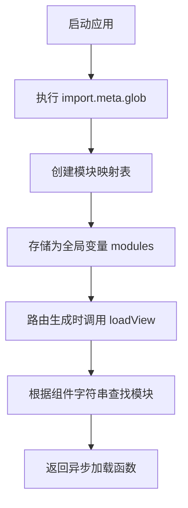
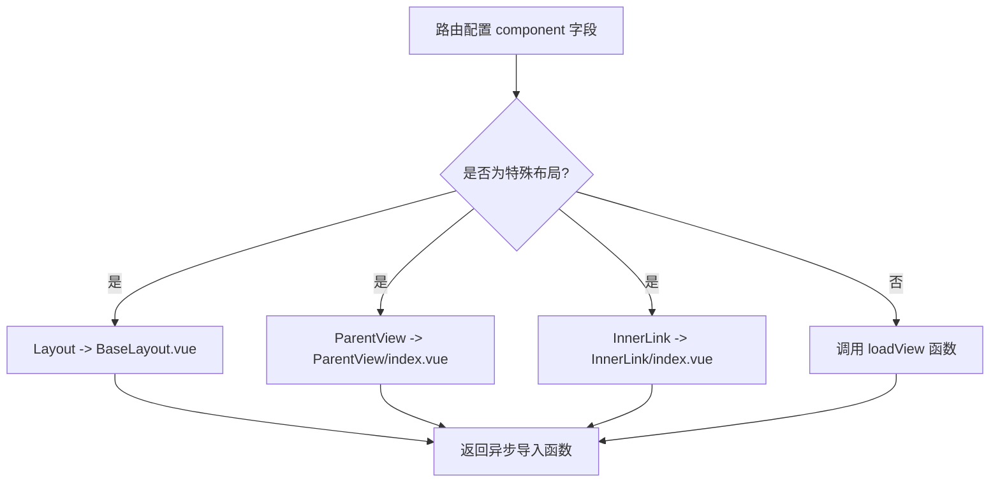
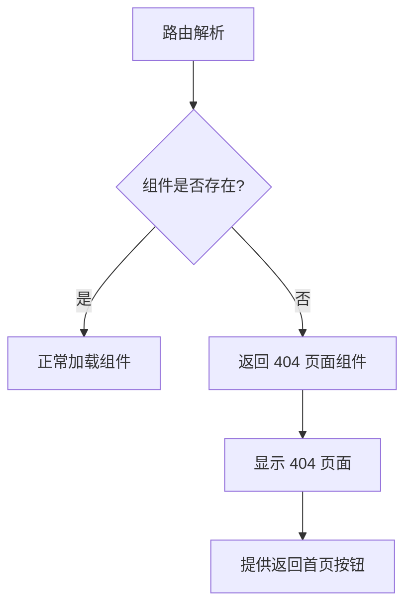

# 组件解析与懒加载

<cite>
**本文档引用文件**   
- [permission.js](file://src/stores/permission.js#L38-L191)
- [BaseLayout.vue](file://src/layout/BaseLayout.vue)
- [ParentView/index.vue](file://src/layout/ParentView/index.vue)
- [InnerLink/index.vue](file://src/layout/InnerLink/index.vue)
- [404.vue](file://src/views/404.vue)
- [routes.js](file://src/router/routes.js)
- [vueRouter.js](file://src/router/vueRouter.js)
- [build.js](file://config/vite/build.js)
</cite>

## 目录
1. [视图组件解析与模块映射](#视图组件解析与模块映射)
2. [特殊布局组件的硬编码处理](#特殊布局组件的硬编码处理)
3. [路由懒加载与性能优化](#路由懒加载与性能优化)
4. [开发环境兼容性与容错机制](#开发环境兼容性与容错机制)

## 视图组件解析与模块映射

在Vue应用中，动态路由的视图组件解析与懒加载机制通过`import.meta.glob`实现。该机制在`permission.js`文件中初始化，通过预加载`views`目录下所有`.vue`文件，形成一个模块映射表。此映射表作为全局变量`modules`存在，用于后续的异步组件加载。

**Diagram sources**
- [permission.js](file://src/stores/permission.js#L39)

`loadView`函数是组件解析的核心，它接收路由配置中的`component`字符串（如'system/user/index'），在模块映射表中查找对应的异步加载函数。该函数通过遍历`modules`对象，将路径与组件字符串进行匹配，成功匹配则返回相应的动态导入函数。此机制实现了按需加载，避免了应用启动时一次性加载所有视图组件。

**Section sources**
- [permission.js](file://src/stores/permission.js#L178-L191)

## 特殊布局组件的硬编码处理

对于特殊布局组件（如`Layout`、`ParentView`、`InnerLink`），系统采用硬编码方式处理。当路由配置中的`component`字段为特定字符串时，直接映射到具体的布局组件导入路径，而非通过`loadView`函数查找。

**Diagram sources**
- [permission.js](file://src/stores/permission.js#L54-L63)
- [BaseLayout.vue](file://src/layout/BaseLayout.vue)
- [ParentView/index.vue](file://src/layout/ParentView/index.vue)
- [InnerLink/index.vue](file://src/layout/InnerLink/index.vue)

`Layout`组件映射到`BaseLayout.vue`，作为应用的主要布局容器，包含侧边栏、头部和内容区域。`ParentView`组件是一个简单的路由视图容器，仅包含`<router-view/>`，用于实现多级菜单的嵌套路由。`InnerLink`组件则用于内嵌外部链接，通过iframe方式展示外部内容，其高度根据视口动态计算。

**Section sources**
- [permission.js](file://src/stores/permission.js#L54-L63)

## 路由懒加载与性能优化

路由懒加载机制显著提升了应用的性能。通过`import.meta.glob`预加载所有视图组件，结合Vite的代码分割策略，实现了高效的模块化加载。在生产环境中，Vite配置将不同类型的代码分割到独立的chunk中，如`views-system`、`views-monitor`等，优化了资源加载顺序和缓存策略。

**Diagram sources**
- [build.js](file://config/vite/build.js#L212-L225)
- [routes.js](file://src/router/routes.js)

此机制减少了初始加载时间，提高了首屏渲染速度。同时，通过合理的chunk分割，提升了浏览器缓存效率，用户在访问不同模块时只需加载必要的代码，降低了网络传输开销。

**Section sources**
- [build.js](file://config/vite/build.js)

## 开发环境兼容性与容错机制

在开发环境下，系统兼容HMR（热模块替换）机制，确保组件修改后能够快速更新，提升开发效率。当指定的组件不存在时，系统具备完善的容错机制，默认重定向到404页面。

**Diagram sources**
- [permission.js](file://src/stores/permission.js#L187-L188)
- [404.vue](file://src/views/404.vue)

`loadView`函数在未找到匹配组件时，会返回`404.vue`组件的异步导入函数，确保用户不会遇到空白页面或错误。404页面提供清晰的错误信息和返回首页的按钮，改善了用户体验。

**Section sources**
- [permission.js](file://src/stores/permission.js#L187-L188)
- [404.vue](file://src/views/404.vue)