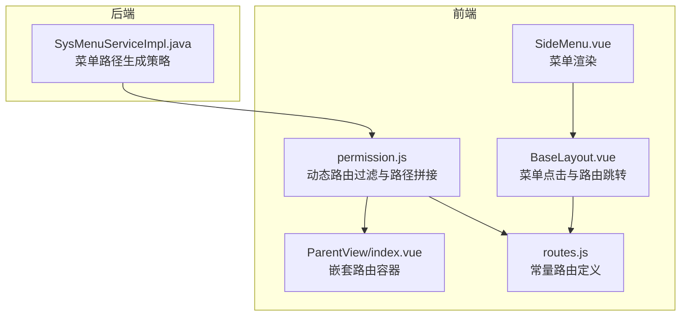
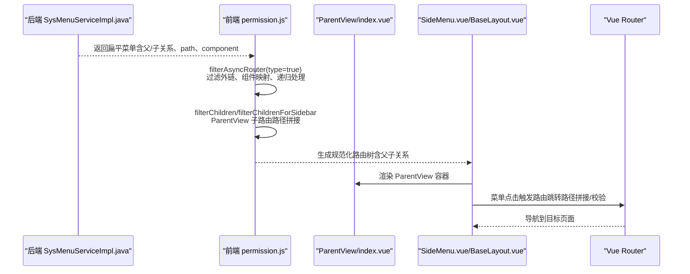
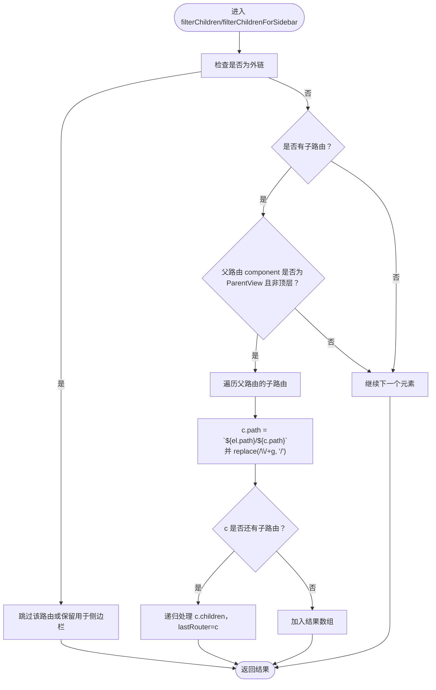
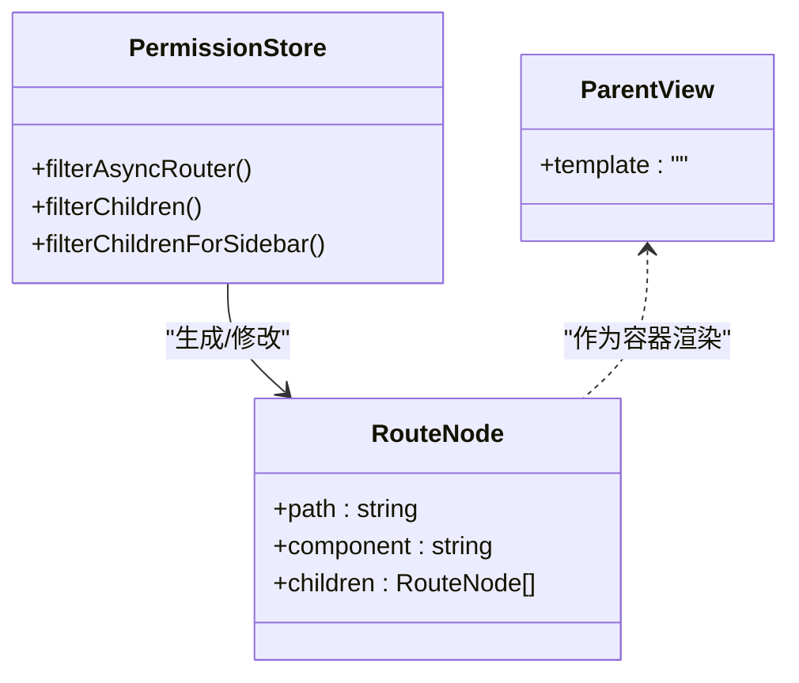
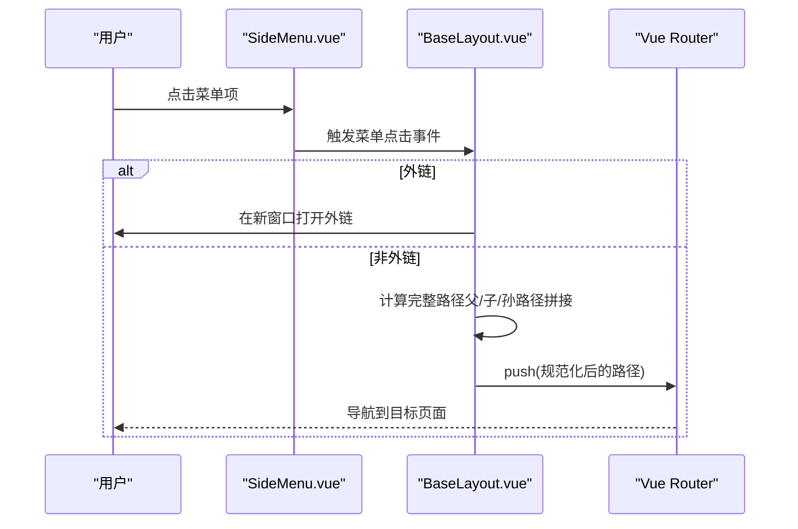
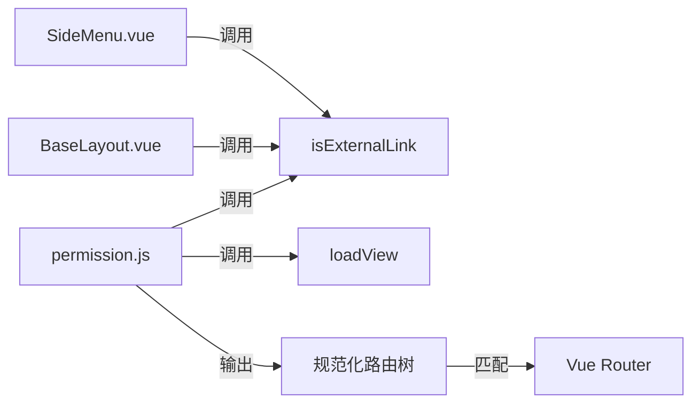

# 路径拼接规则

<cite>
**本文引用的文件**
- [permission.js](file://bear-jia-vue3/src/stores/permission.js)
- [index.vue](file://bear-jia-vue3/src/layout/ParentView/index.vue)
- [routes.js](file://bear-jia-vue3/src/router/routes.js)
- [SideMenu.vue](file://bear-jia-vue3/src/components/layout/SideMenu.vue)
- [BaseLayout.vue](file://bear-jia-vue3/src/layout/BaseLayout.vue)
- [SysMenuServiceImpl.java](file://bear-jia-vue3/bear-jia-admin-backend/src/main/java/com/avaxiaobear/module/system/service/impl/SysMenuServiceImpl.java)
</cite>

## 目录
1. [引言](#引言)
2. [项目结构](#项目结构)
3. [核心组件](#核心组件)
4. [架构总览](#架构总览)
5. [详细组件分析](#详细组件分析)
6. [依赖关系分析](#依赖关系分析)
7. [性能考量](#性能考量)
8. [故障排查指南](#故障排查指南)
9. [结论](#结论)

## 引言
本文件聚焦动态路由中“路径拼接”的规则与实现，重点解析以下问题：
- 当父路由 component 为 ParentView 时，filterChildren 与 filterChildrenForSidebar 如何处理嵌套子路由；
- 在父路由 path 为 “/system”，子路由 path 为 “user” 的场景下，系统如何通过模板字符串 `${el.path}/${c.path}` 进行拼接，并用正则 replace(/\/+/g, '/') 消除可能产生的连续斜杠；
- lastRouter 参数在递归过程中的作用，如何确保子路由路径的正确性；
- 该路径拼接机制如何支持灵活的菜单层级结构，同时保证最终路由路径的规范性。

## 项目结构
围绕动态路由与路径拼接的相关模块分布如下：
- 权限与路由过滤：permission.js 中提供 filterChildren、filterChildrenForSidebar、filterAsyncRouter 等函数，负责将后端返回的扁平路由转换为带父子关系的树形结构，并对 ParentView 类型的父路由执行路径拼接。
- 路由定义：routes.js 定义了常量路由，其中包含多处以 BaseLayout 为容器、内部含 children 的布局示例，体现父子路由的组织方式。
- 菜单渲染：SideMenu.vue 与 BaseLayout.vue 的菜单点击逻辑，展示了菜单路径与最终路由路径之间的关系。
- 后端服务：SysMenuServiceImpl.java 提供后端菜单路径生成策略，与前端的路径拼接形成闭环。

图表来源
- [permission.js](file://bear-jia-vue3/src/stores/permission.js#L42-L103)
- [index.vue](file://bear-jia-vue3/src/layout/ParentView/index.vue#L1-L4)
- [routes.js](file://bear-jia-vue3/src/router/routes.js#L45-L67)
- [SideMenu.vue](file://bear-jia-vue3/src/components/layout/SideMenu.vue#L37-L107)
- [BaseLayout.vue](file://bear-jia-vue3/src/layout/BaseLayout.vue#L617-L712)
- [SysMenuServiceImpl.java](file://bear-jia-vue3/bear-jia-admin-backend/src/main/java/com/avaxiaobear/module/system/service/impl/SysMenuServiceImpl.java#L375-L415)

章节来源
- [permission.js](file://bear-jia-vue3/src/stores/permission.js#L42-L103)
- [routes.js](file://bear-jia-vue3/src/router/routes.js#L45-L67)

## 核心组件
- 动态路由过滤与路径拼接
  - filterAsyncRouter：对外暴露的主过滤入口，根据 type 参数决定是否对 children 进行扁平化拼接；同时处理外链与组件映射。
  - filterChildren：针对 ParentView 类型父路由的子路由执行路径拼接，消除多余斜杠；并支持 lastRouter 作为父路径前缀。
  - filterChildrenForSidebar：与 filterChildren 类似，但保留外链，用于侧边栏菜单展示。
- 路由容器组件
  - ParentView：作为嵌套路由的容器，内部通过 router-view 渲染子路由。
- 路由定义
  - routes.js：定义常量路由，包含多处以 BaseLayout 为父容器、内部 children 为子路由的结构，体现父子关系的组织方式。
- 菜单与跳转
  - SideMenu.vue：菜单渲染逻辑，支持二级/三级菜单，识别外链并在点击时处理跳转。
  - BaseLayout.vue：菜单点击事件中对路径进行拼接与校验，确保最终路由路径规范。

章节来源
- [permission.js](file://bear-jia-vue3/src/stores/permission.js#L42-L103)
- [index.vue](file://bear-jia-vue3/src/layout/ParentView/index.vue#L1-L4)
- [routes.js](file://bear-jia-vue3/src/router/routes.js#L45-L67)
- [SideMenu.vue](file://bear-jia-vue3/src/components/layout/SideMenu.vue#L37-L107)
- [BaseLayout.vue](file://bear-jia-vue3/src/layout/BaseLayout.vue#L617-L712)

## 架构总览
动态路由从后端返回的扁平菜单开始，经过前端权限过滤与路径拼接，最终生成规范化的路由树。ParentView 作为中间容器，承载其子路由的嵌套渲染。菜单层面对应的路径与最终路由路径保持一致或可推导一致。

图表来源
- [SysMenuServiceImpl.java](file://bear-jia-vue3/bear-jia-admin-backend/src/main/java/com/avaxiaobear/module/system/service/impl/SysMenuServiceImpl.java#L375-L415)
- [permission.js](file://bear-jia-vue3/src/stores/permission.js#L42-L103)
- [index.vue](file://bear-jia-vue3/src/layout/ParentView/index.vue#L1-L4)
- [SideMenu.vue](file://bear-jia-vue3/src/components/layout/SideMenu.vue#L37-L107)
- [BaseLayout.vue](file://bear-jia-vue3/src/layout/BaseLayout.vue#L617-L712)

## 详细组件分析

### 路径拼接规则与实现
- 模板字符串拼接
  - 当父路由 component 为 ParentView 且非顶层 lastRouter 时，子路由 c 的 path 通过 `${el.path}/${c.path}` 进行拼接，确保父路径前缀生效。
- 正则消除连续斜杠
  - 拼接后使用 replace(/\/+/g, '/') 将可能出现的 “//” 规范化为 “/”，保证最终路由路径的规范性。
- lastRouter 参数的作用
  - lastRouter 作为父路由对象，在递归过程中为子路由提供父路径前缀。当 lastRouter 存在且子路由非外链时，同样采用相同拼接规则，确保深层嵌套也能正确拼接。
- 外链处理
  - 对于外链（以 http/https/mailto/tel 开头）的路由，过滤阶段会跳过或保留（侧边栏），不参与路径拼接，避免破坏外链的完整性。

图表来源
- [permission.js](file://bear-jia-vue3/src/stores/permission.js#L105-L175)

章节来源
- [permission.js](file://bear-jia-vue3/src/stores/permission.js#L105-L175)

### ParentView 类型的嵌套路由处理
- ParentView 作为容器组件，内部通过 router-view 渲染子路由，实现嵌套视图的逐层渲染。
- 在路径拼接阶段，ParentView 的子路由会被提升为扁平化后的子路由，同时保留其父路径前缀，从而在最终路由树中形成正确的父子关系。

图表来源
- [index.vue](file://bear-jia-vue3/src/layout/ParentView/index.vue#L1-L4)
- [permission.js](file://bear-jia-vue3/src/stores/permission.js#L42-L103)

章节来源
- [index.vue](file://bear-jia-vue3/src/layout/ParentView/index.vue#L1-L4)
- [permission.js](file://bear-jia-vue3/src/stores/permission.js#L42-L103)

### 菜单层级与最终路由路径的关系
- 二级菜单：点击菜单项时，若路径为外链则新开窗口；否则将父路径与子路径拼接后跳转。
- 三级菜单：点击时优先判断是否已是完整路径，否则按 “/greatFather/father/child” 形式拼接，并再次规范化斜杠。
- 该机制确保菜单层级与最终路由路径一一对应，避免重复斜杠导致的路径异常。

图表来源
- [SideMenu.vue](file://bear-jia-vue3/src/components/layout/SideMenu.vue#L160-L187)
- [BaseLayout.vue](file://bear-jia-vue3/src/layout/BaseLayout.vue#L617-L712)

章节来源
- [SideMenu.vue](file://bear-jia-vue3/src/components/layout/SideMenu.vue#L160-L187)
- [BaseLayout.vue](file://bear-jia-vue3/src/layout/BaseLayout.vue#L617-L712)

### 后端路径生成策略
- 后端根据菜单类型与是否内链，生成不同的 routerPath：
  - 一级目录（类型为目录）且非框架：在路径前加 “/”
  - 一级目录（类型为菜单）：返回根路径 “/”
  - 内链打开外网方式：对特定路径进行替换
- 该策略与前端的路径拼接形成互补，确保前后端对路径的理解一致。

章节来源
- [SysMenuServiceImpl.java](file://bear-jia-vue3/bear-jia-admin-backend/src/main/java/com/avaxiaobear/module/system/service/impl/SysMenuServiceImpl.java#L375-L415)

## 依赖关系分析
- permission.js 依赖：
  - isExternalLink：用于识别外链，决定是否跳过或保留。
  - loadView：用于动态导入组件，支持 ParentView/InnerLink/Layout 的特殊映射。
- 菜单渲染依赖：
  - SideMenu.vue 与 BaseLayout.vue 的菜单点击逻辑共同决定最终路由路径的拼接与校验。
- 路由定义依赖：
  - routes.js 中的常量路由体现了父子关系的组织方式，为动态路由的扁平化与拼接提供参考。

图表来源
- [permission.js](file://bear-jia-vue3/src/stores/permission.js#L42-L103)
- [SideMenu.vue](file://bear-jia-vue3/src/components/layout/SideMenu.vue#L160-L187)
- [BaseLayout.vue](file://bear-jia-vue3/src/layout/BaseLayout.vue#L617-L712)

章节来源
- [permission.js](file://bear-jia-vue3/src/stores/permission.js#L42-L103)
- [SideMenu.vue](file://bear-jia-vue3/src/components/layout/SideMenu.vue#L160-L187)
- [BaseLayout.vue](file://bear-jia-vue3/src/layout/BaseLayout.vue#L617-L712)

## 性能考量
- 路由扁平化与递归处理：
  - filterChildren 与 filterChildrenForSidebar 会对每层子路由进行遍历与递归，建议后端返回的菜单层级不宜过深，避免不必要的递归开销。
- 正则替换 replace(/\/+/g, '/')：
  - 单次替换复杂度近似 O(n)，在大量路由时仍属轻量操作，但应避免在高频渲染场景重复执行。
- 外链过滤：
  - 外链在过滤阶段即被剔除或保留，减少后续处理负担。

[本节为一般性指导，无需具体文件分析]

## 故障排查指南
- 路由路径出现重复斜杠
  - 检查是否在父/子路由 path 中存在尾随或起始斜杠；确认拼接后是否执行 replace(/\/+/g, '/')。
- 路由无法匹配
  - 核对菜单点击时的路径拼接逻辑，确保三级菜单场景下的完整路径计算与规范化。
- 外链未按预期处理
  - 确认 isExternalLink 的判断是否覆盖 http/https/mailto/tel 场景；检查 filterAsyncRouter 与 filterChildrenForSidebar 的外链处理分支。

章节来源
- [permission.js](file://bear-jia-vue3/src/stores/permission.js#L75-L103)
- [BaseLayout.vue](file://bear-jia-vue3/src/layout/BaseLayout.vue#L681-L712)

## 结论
- ParentView 类型的父路由在动态路由过滤阶段被识别并对其子路由执行路径拼接，确保子路由继承父路径前缀；
- 模板字符串 `${el.path}/${c.path}` 与 replace(/\/+/g, '/') 的组合，有效消除了重复斜杠，保证最终路由路径的规范性；
- lastRouter 参数贯穿递归过程，为每一层子路由提供正确的父路径前缀，使深层嵌套也能正确拼接；
- 菜单层级与最终路由路径保持一致，配合外链识别与规范化处理，实现了灵活而稳定的菜单与路由体系。