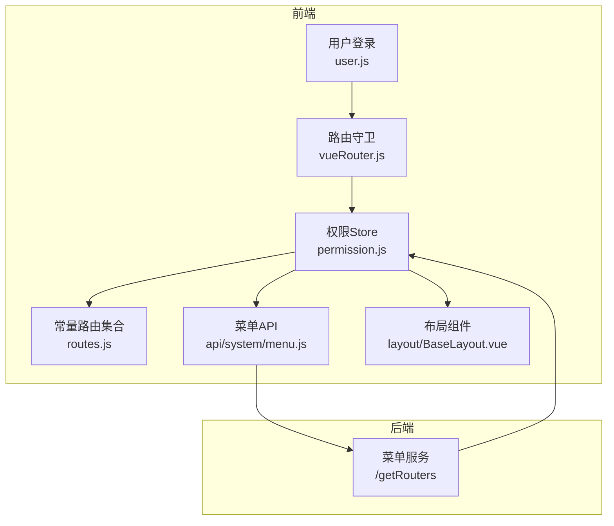
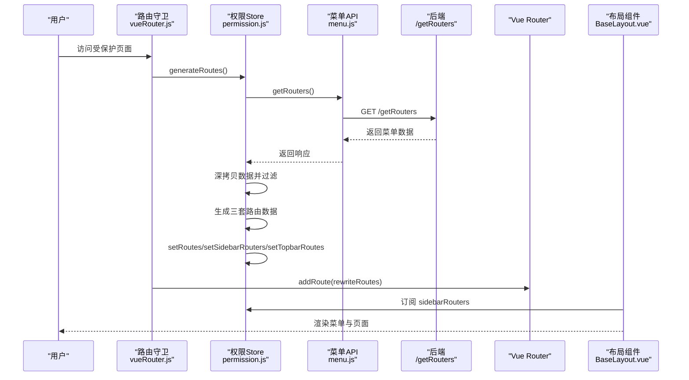
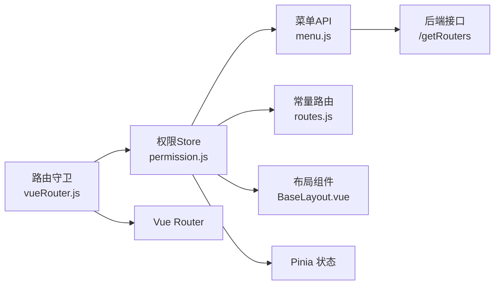

# 路由生成流程

<cite>
**本文引用的文件**
- [permission.js](file://bear-jia-vue3/src/stores/permission.js)
- [vueRouter.js](file://bear-jia-vue3/src/router/vueRouter.js)
- [menu.js](file://bear-jia-vue3/src/api/system/menu.js)
- [routes.js](file://bear-jia-vue3/src/router/routes.js)
- [router.d.ts](file://bear-jia-vue3/src/types/router.d.ts)
- [BaseLayout.vue](file://bear-jia-vue3/src/layout/BaseLayout.vue)
- [frontend.js](file://bear-jia-vue3/src/router/frontend.js)
- [user.js](file://bear-jia-vue3/src/stores/user.js)
</cite>

## 目录
1. [引言](#引言)
2. [项目结构](#项目结构)
3. [核心组件](#核心组件)
4. [架构总览](#架构总览)
5. [详细组件分析](#详细组件分析)
6. [依赖关系分析](#依赖关系分析)
7. [性能考量](#性能考量)
8. [故障排查指南](#故障排查指南)
9. [结论](#结论)

## 引言
本文件围绕“动态路由生成”的完整流程进行深入解析，重点覆盖以下方面：
- 用户登录成功后触发 generateRoutes 的时机与流程
- 通过 getRouters API 从后端获取菜单数据，并说明返回数据结构
- 在 Promise 中对路由数据进行深拷贝的目的与必要性
- 三套不同路由数据（rewriteRoutes、sidebarRoutes、defaultRoutes）的生成与用途
- 如何通过 Pinia store 的 setRoutes 等 action 更新状态，并最终实现动态路由的添加
- 完整的时序图，展示从登录到路由生效的关键步骤

## 项目结构
该工程采用前后端分离的多页应用架构，前端基于 Vue 3 + Vite，使用 Vue Router 管理路由，Pinia 管理状态，菜单数据来自后端接口。动态路由生成的核心逻辑集中在权限 Store 与路由守卫中。

图表来源
- [vueRouter.js](file://bear-jia-vue3/src/router/vueRouter.js#L37-L99)
- [permission.js](file://bear-jia-vue3/src/stores/permission.js#L1-L263)
- [routes.js](file://bear-jia-vue3/src/router/routes.js#L1-L100)
- [menu.js](file://bear-jia-vue3/src/api/system/menu.js#L1-L10)
- [BaseLayout.vue](file://bear-jia-vue3/src/layout/BaseLayout.vue#L1-L120)

章节来源
- [vueRouter.js](file://bear-jia-vue3/src/router/vueRouter.js#L1-L129)
- [permission.js](file://bear-jia-vue3/src/stores/permission.js#L1-L263)
- [routes.js](file://bear-jia-vue3/src/router/routes.js#L1-L100)
- [menu.js](file://bear-jia-vue3/src/api/system/menu.js#L1-L10)
- [BaseLayout.vue](file://bear-jia-vue3/src/layout/BaseLayout.vue#L1-L120)

## 核心组件
- 权限 Store（permission.js）：负责动态路由生成、过滤、状态管理与对外暴露
- 路由守卫（vueRouter.js）：在导航前触发用户信息获取与动态路由生成，并将生成的路由注入到路由器
- 菜单 API（api/system/menu.js）：封装后端 /getRouters 接口
- 常量路由（routes.js）：包含登录页、404、首页等基础路由
- 布局组件（BaseLayout.vue）：消费权限 Store 中的 sidebarRouters，渲染侧边栏/顶部菜单等

章节来源
- [permission.js](file://bear-jia-vue3/src/stores/permission.js#L210-L263)
- [vueRouter.js](file://bear-jia-vue3/src/router/vueRouter.js#L37-L99)
- [menu.js](file://bear-jia-vue3/src/api/system/menu.js#L1-L10)
- [routes.js](file://bear-jia-vue3/src/router/routes.js#L1-L100)
- [BaseLayout.vue](file://bear-jia-vue3/src/layout/BaseLayout.vue#L1-L120)

## 架构总览
动态路由生成的总体流程如下：
- 用户登录成功后，进入路由守卫
- 路由守卫调用用户信息获取与权限 Store 的 generateRoutes
- generateRoutes 发起 getRouters 请求，拿到后端菜单数据
- 对数据进行深拷贝，避免污染原始响应
- 通过两套过滤器生成三套路由数据：rewriteRoutes（用于注册）、sidebarRoutes（用于侧边栏）、defaultRoutes（用于顶部菜单）
- 将三套路由写入 Pinia 状态，并将 rewriteRoutes 注册到 Vue Router
- 布局组件订阅 sidebarRouters，实现菜单渲染

图表来源
- [vueRouter.js](file://bear-jia-vue3/src/router/vueRouter.js#L37-L99)
- [permission.js](file://bear-jia-vue3/src/stores/permission.js#L234-L261)
- [menu.js](file://bear-jia-vue3/src/api/system/menu.js#L1-L10)
- [BaseLayout.vue](file://bear-jia-vue3/src/layout/BaseLayout.vue#L1-L120)

## 详细组件分析

### 动态路由生成入口：generateRoutes
- 触发时机：路由守卫在首次进入受保护页面或刷新后检测到路由缺失时，会调用用户信息获取与 generateRoutes
- 关键步骤：
  - 调用 getRouters 获取菜单数据
  - 对 res.data 进行深拷贝，确保后续过滤不会影响原始数据
  - 生成三套路由数据：
    - rewriteRoutes：用于 Vue Router 注册，过滤掉外链，组件懒加载
    - sidebarRoutes：用于侧边栏菜单展示，保留外链
    - defaultRoutes：用于顶部菜单展示，保留外链
  - 通过 setRoutes、setSidebarRouters、setTopbarRoutes 更新 Pinia 状态
  - resolve 返回 rewriteRoutes，供路由守卫 addRoute 使用

章节来源
- [permission.js](file://bear-jia-vue3/src/stores/permission.js#L234-L261)
- [vueRouter.js](file://bear-jia-vue3/src/router/vueRouter.js#L52-L58)

### 路由过滤与组件懒加载
- 外链识别：通过 isExternalLink 判断是否为 http/https/mailto/tel 开头的外链
- 两套过滤器：
  - filterAsyncRouter：用于 rewriteRoutes，过滤掉外链，组件按约定名称懒加载
  - filterAsyncRouterForSidebar：用于 sidebar/default Routes，保留外链，组件同样懒加载
- 子路由扁平化：
  - filterChildren/filterChildrenForSidebar 会在 ParentView 场景下将子路由扁平化，同时处理路径拼接与外链跳过
- 组件懒加载：loadView 通过 import.meta.glob 预加载所有 views 下的组件，按组件名映射到对应视图

章节来源
- [permission.js](file://bear-jia-vue3/src/stores/permission.js#L42-L175)
- [permission.js](file://bear-jia-vue3/src/stores/permission.js#L177-L191)

### Pinia 状态与路由注册
- setRoutes：合并常量路由与动态路由，形成完整路由集
- setSidebarRouters/setTopbarRoutes：分别维护侧边栏与顶部菜单的数据源
- 路由守卫在 generateRoutes 成功后，遍历 rewriteRoutes 并逐条 addRoute 注册

章节来源
- [permission.js](file://bear-jia-vue3/src/stores/permission.js#L220-L233)
- [vueRouter.js](file://bear-jia-vue3/src/router/vueRouter.js#L52-L58)

### 布局组件消费菜单数据
- BaseLayout.vue 订阅 permissionStore.sidebarRouters，并将其作为菜单数据源
- 支持多种布局模式（侧边、顶部、混合、分栏、抽屉），均以 sidebarRouters 为依据渲染菜单

章节来源
- [BaseLayout.vue](file://bear-jia-vue3/src/layout/BaseLayout.vue#L1-L120)

### 常量路由与前台路由
- constantRoutes：包含登录页、404、首页等基础路由
- frontendRoutes：前台路由集合，随常量路由一起挂载

章节来源
- [routes.js](file://bear-jia-vue3/src/router/routes.js#L1-L100)
- [frontend.js](file://bear-jia-vue3/src/router/frontend.js#L1-L80)

### 数据模型与类型约束
- RouteMeta：定义路由元信息（标题、图标、权限、隐藏等）
- AppRouteRecordRaw：路由记录的类型定义
- RouteState：Pinia 中路由状态的类型定义

章节来源
- [router.d.ts](file://bear-jia-vue3/src/types/router.d.ts#L1-L34)

## 依赖关系分析

图表来源
- [vueRouter.js](file://bear-jia-vue3/src/router/vueRouter.js#L37-L99)
- [permission.js](file://bear-jia-vue3/src/stores/permission.js#L1-L263)
- [menu.js](file://bear-jia-vue3/src/api/system/menu.js#L1-L10)
- [routes.js](file://bear-jia-vue3/src/router/routes.js#L1-L100)
- [BaseLayout.vue](file://bear-jia-vue3/src/layout/BaseLayout.vue#L1-L120)

章节来源
- [vueRouter.js](file://bear-jia-vue3/src/router/vueRouter.js#L37-L99)
- [permission.js](file://bear-jia-vue3/src/stores/permission.js#L1-L263)
- [menu.js](file://bear-jia-vue3/src/api/system/menu.js#L1-L10)
- [routes.js](file://bear-jia-vue3/src/router/routes.js#L1-L100)
- [BaseLayout.vue](file://bear-jia-vue3/src/layout/BaseLayout.vue#L1-L120)

## 性能考量
- 组件懒加载：通过 import.meta.glob 预加载视图组件，减少首屏体积与按需加载成本
- 子路由扁平化：在 ParentView 模式下将嵌套路由扁平化，降低路由层级复杂度
- 外链过滤：仅在菜单中展示外链，避免在 Vue Router 中注册导致的路径冲突
- 深拷贝：对后端返回数据进行深拷贝，避免副作用，保证后续多次过滤的正确性

章节来源
- [permission.js](file://bear-jia-vue3/src/stores/permission.js#L42-L175)
- [permission.js](file://bear-jia-vue3/src/stores/permission.js#L234-L261)

## 故障排查指南
- 登录后无法进入受保护页面
  - 检查路由守卫是否成功调用 generateRoutes
  - 查看 generateRoutes 是否抛出异常并被路由守卫捕获
- 动态路由未生效
  - 确认 rewriteRoutes 是否被 addRoute 注册
  - 检查路由是否在刷新后丢失，路由守卫是否触发了二次生成
- 菜单不显示或外链无法打开
  - 检查 filterAsyncRouterForSidebar 是否保留外链
  - 检查 isExternalLink 判断逻辑与路径拼接规则
- 侧边栏/顶部菜单不一致
  - 确认 setSidebarRouters 与 setTopbarRoutes 是否正确赋值
  - 检查布局组件是否订阅了正确的状态字段

章节来源
- [vueRouter.js](file://bear-jia-vue3/src/router/vueRouter.js#L37-L99)
- [permission.js](file://bear-jia-vue3/src/stores/permission.js#L234-L261)
- [BaseLayout.vue](file://bear-jia-vue3/src/layout/BaseLayout.vue#L1-L120)

## 结论
动态路由生成流程以“登录成功 -> 路由守卫 -> 权限 Store -> API -> 过滤与懒加载 -> Pinia 状态 -> 注册路由 -> 布局渲染”为主线，通过深拷贝与两套过滤器确保数据安全与渲染一致性。三套路由数据分别服务于路由注册、侧边栏菜单与顶部菜单，满足多布局场景下的菜单展示需求。整体设计清晰、职责明确，具备良好的扩展性与可维护性。