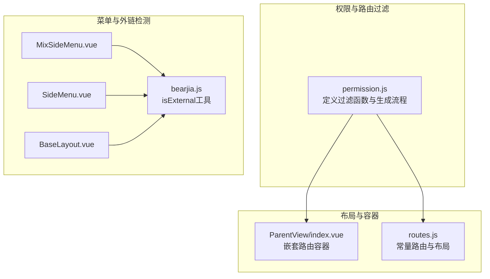
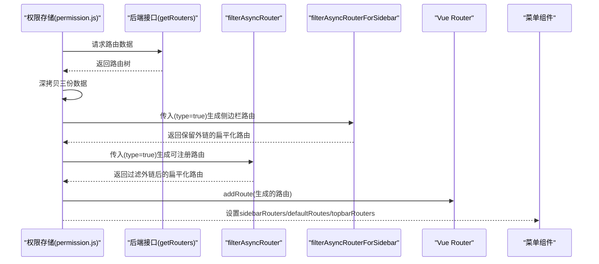
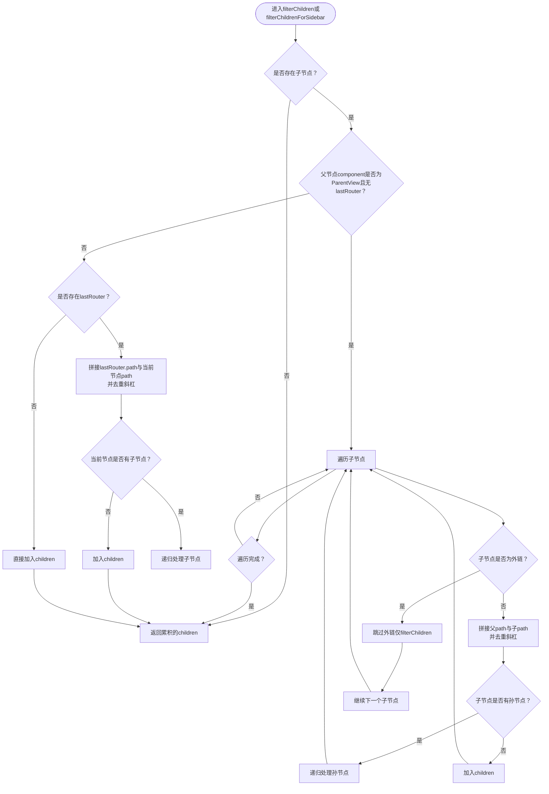
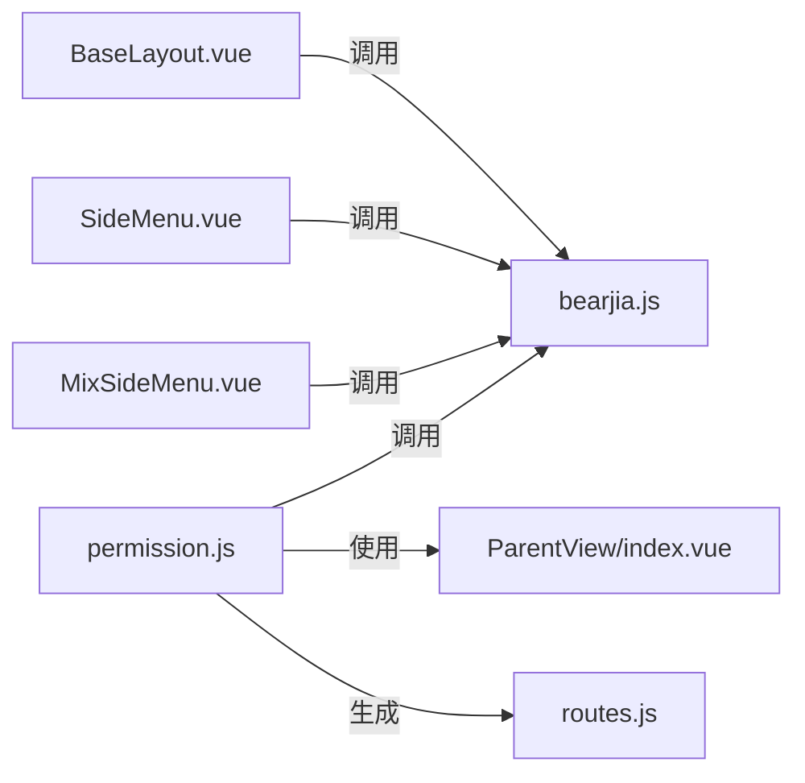

# 路由过滤机制

<cite>
**本文引用的文件**
- [permission.js](file://bear-jia-vue3/src/stores/permission.js)
- [index.vue](file://bear-jia-vue3/src/layout/ParentView/index.vue)
- [routes.js](file://bear-jia-vue3/src/router/routes.js)
- [MixSideMenu.vue](file://bear-jia-vue3/src/components/layout/MixSideMenu.vue)
- [SideMenu.vue](file://bear-jia-vue3/src/components/layout/SideMenu.vue)
- [BaseLayout.vue](file://bear-jia-vue3/src/layout/BaseLayout.vue)
- [bearjia.js](file://bear-jia-vue3/src/utils/bearjia.js)
</cite>

## 目录
1. [引言](#引言)
2. [项目结构](#项目结构)
3. [核心组件](#核心组件)
4. [架构总览](#架构总览)
5. [详细组件分析](#详细组件分析)
6. [依赖关系分析](#依赖关系分析)
7. [性能考量](#性能考量)
8. [故障排查指南](#故障排查指南)
9. [结论](#结论)

## 引言
本文件聚焦于前端路由过滤机制，深入解析两个核心过滤函数：
- filterAsyncRouter：用于生成可注册到Vue Router的路由集合，会过滤掉以http(s)、mailto、tel等外链前缀开头的路由，避免将外链误注册为内部路由导致匹配错误。
- filterAsyncRouterForSidebar：用于侧边栏菜单展示，保留外链路由，仅作为菜单项显示，不注册到Vue Router。

同时，本文将对比两者在处理ParentView嵌套路由时的逻辑差异，重点说明路径拼接时使用replace(/\/+/g, '/')去除多余斜杠的细节，并解释type参数的作用及其在递归调用中的传递方式。

## 项目结构
与路由过滤相关的关键位置如下：
- 权限与路由过滤：bear-jia-vue3/src/stores/permission.js
- 嵌套路由容器：bear-jia-vue3/src/layout/ParentView/index.vue
- 常量路由与布局：bear-jia-vue3/src/router/routes.js
- 菜单组件与外链检测：bear-jia-vue3/src/components/layout/MixSideMenu.vue、bear-jia-vue3/src/components/layout/SideMenu.vue、bear-jia-vue3/src/layout/BaseLayout.vue、bear-jia-vue3/src/utils/bearjia.js

图表来源
- [permission.js](file://bear-jia-vue3/src/stores/permission.js#L42-L175)
- [index.vue](file://bear-jia-vue3/src/layout/ParentView/index.vue#L1-L4)
- [routes.js](file://bear-jia-vue3/src/router/routes.js#L1-L100)
- [MixSideMenu.vue](file://bear-jia-vue3/src/components/layout/MixSideMenu.vue#L164-L217)
- [SideMenu.vue](file://bear-jia-vue3/src/components/layout/SideMenu.vue#L37-L110)
- [BaseLayout.vue](file://bear-jia-vue3/src/layout/BaseLayout.vue#L596-L712)
- [bearjia.js](file://bear-jia-vue3/src/utils/bearjia.js#L1-L10)

章节来源
- [permission.js](file://bear-jia-vue3/src/stores/permission.js#L42-L175)
- [routes.js](file://bear-jia-vue3/src/router/routes.js#L1-L100)

## 核心组件
- filterAsyncRouter：过滤外链并处理嵌套路由，最终得到可用于router.addRoute的路由数组。
- filterAsyncRouterForSidebar：保留外链，用于菜单展示，不参与路由注册。
- isExternalLink/isExternal：统一的外链判定正则，支持http(s)、mailto、tel等。
- filterChildren/filterChildrenForSidebar：处理ParentView嵌套路由时的路径拼接与过滤逻辑。
- type参数：控制是否启用children扁平化与路径拼接逻辑，贯穿递归调用。

章节来源
- [permission.js](file://bear-jia-vue3/src/stores/permission.js#L42-L175)
- [bearjia.js](file://bear-jia-vue3/src/utils/bearjia.js#L1-L10)

## 架构总览
下图展示了从后端获取路由数据到生成最终路由与侧边栏菜单的整体流程，以及两个过滤函数在其中的角色。

图表来源
- [permission.js](file://bear-jia-vue3/src/stores/permission.js#L234-L261)

## 详细组件分析

### 两个过滤函数的核心差异
- 外链处理策略
  - filterAsyncRouter：遇到外链路由时直接返回false，使其不进入最终路由数组，从而避免注册到Vue Router。
  - filterAsyncRouterForSidebar：遇到外链路由时仍返回true，将其纳入最终结果，仅用于菜单展示。
- 适用场景
  - filterAsyncRouter：用于generateRoutes后，作为addRoute的输入，确保只有内链能被路由系统识别。
  - filterAsyncRouterForSidebar：用于侧边栏与顶部菜单的数据源，保证外链也能出现在菜单中供用户点击。

章节来源
- [permission.js](file://bear-jia-vue3/src/stores/permission.js#L42-L103)

### 外链判定与正则
- isExternalLink/isExternal：均使用正则^(https?:|mailto:|tel:)检测外链前缀，确保http(s)、mailto、tel开头的路径被视为外链。
- 在菜单点击与跳转逻辑中，同样使用isExternal进行外链判断，外链直接window.open新开窗口，不触发路由跳转。

章节来源
- [permission.js](file://bear-jia-vue3/src/stores/permission.js#L75-L78)
- [bearjia.js](file://bear-jia-vue3/src/utils/bearjia.js#L1-L10)
- [MixSideMenu.vue](file://bear-jia-vue3/src/components/layout/MixSideMenu.vue#L164-L217)
- [SideMenu.vue](file://bear-jia-vue3/src/components/layout/SideMenu.vue#L160-L192)
- [BaseLayout.vue](file://bear-jia-vue3/src/layout/BaseLayout.vue#L627-L631)

### ParentView嵌套路由处理逻辑对比
两者在处理ParentView嵌套路由时存在关键差异：
- filterChildren（用于filterAsyncRouter）
  - 遇到外链子路由时直接跳过，不将其加入最终children列表。
  - 对非外链子路由执行路径拼接：将父path与子path合并，并通过replace(/\/+/g, '/')去除多余斜杠，确保路径规范。
  - 若lastRouter存在且当前节点非外链，也会对当前节点执行同样的路径拼接。
- filterChildrenForSidebar（用于filterAsyncRouterForSidebar）
  - 对外链子路由不做路径拼接，保持其原始path。
  - 对非外链子路由同样执行路径拼接，确保路径规范。
  - 若lastRouter存在且当前节点非外链，也会对当前节点执行路径拼接。

图表来源
- [permission.js](file://bear-jia-vue3/src/stores/permission.js#L105-L175)

章节来源
- [permission.js](file://bear-jia-vue3/src/stores/permission.js#L105-L175)

### type参数的作用与传递
- 触发条件：当type为true且当前节点存在children时，才会调用filterChildren或filterChildrenForSidebar对子节点进行扁平化与路径拼接处理。
- 传递方式：在filterAsyncRouter与filterAsyncRouterForSidebar内部，对子节点递归调用时，均以(type)作为第三个参数传入，确保层级一致的处理逻辑。
- 作用范围：type=true时，父子路径会被拼接并规范化；type=false时，不进行children扁平化与路径拼接，保持原有结构。

章节来源
- [permission.js](file://bear-jia-vue3/src/stores/permission.js#L42-L103)

### 嵌套路由容器ParentView
- ParentView是一个简单的router-view容器，用于承载多级嵌套路由的渲染。
- 在filterChildren与filterChildrenForSidebar中，当父节点component为'ParentView'且无lastRouter时，会对子节点执行路径拼接与扁平化，使后续路由注册更稳定。

章节来源
- [index.vue](file://bear-jia-vue3/src/layout/ParentView/index.vue#L1-L4)
- [permission.js](file://bear-jia-vue3/src/stores/permission.js#L105-L175)

### 路由注册与菜单展示的协同
- generateRoutes中，分别调用filterAsyncRouterForSidebar与filterAsyncRouter，前者用于侧边栏与默认菜单，后者用于实际注册到Vue Router。
- 菜单组件在点击时再次使用isExternal判断外链，外链直接新开窗口，避免误触发路由跳转。

章节来源
- [permission.js](file://bear-jia-vue3/src/stores/permission.js#L234-L261)
- [MixSideMenu.vue](file://bear-jia-vue3/src/components/layout/MixSideMenu.vue#L164-L217)
- [SideMenu.vue](file://bear-jia-vue3/src/components/layout/SideMenu.vue#L160-L192)
- [BaseLayout.vue](file://bear-jia-vue3/src/layout/BaseLayout.vue#L627-L631)

## 依赖关系分析
- permission.js对外链判定依赖bearjia.js的isExternal工具。
- 菜单组件依赖isExternal进行外链识别与行为控制。
- ParentView作为容器，被filterChildren与filterChildrenForSidebar在特定条件下用于路径拼接与扁平化。

图表来源
- [permission.js](file://bear-jia-vue3/src/stores/permission.js#L42-L175)
- [bearjia.js](file://bear-jia-vue3/src/utils/bearjia.js#L1-L10)
- [index.vue](file://bear-jia-vue3/src/layout/ParentView/index.vue#L1-L4)
- [routes.js](file://bear-jia-vue3/src/router/routes.js#L1-L100)
- [MixSideMenu.vue](file://bear-jia-vue3/src/components/layout/MixSideMenu.vue#L164-L217)
- [SideMenu.vue](file://bear-jia-vue3/src/components/layout/SideMenu.vue#L160-L192)
- [BaseLayout.vue](file://bear-jia-vue3/src/layout/BaseLayout.vue#L627-L631)

## 性能考量
- 过滤函数采用递归与扁平化策略，时间复杂度近似O(N)，N为路由节点总数。
- replace(/\/+/g, '/')在路径拼接阶段执行一次，开销较小。
- 外链判定使用正则测试，性能稳定。
- 通过type参数控制扁平化范围，避免不必要的处理，有助于减少冗余计算。

## 故障排查指南
- 症状：外链被注册到Vue Router导致路由匹配异常
  - 排查：确认generateRoutes中使用filterAsyncRouter而非filterAsyncRouterForSidebar作为addRoute输入。
  - 参考：[permission.js](file://bear-jia-vue3/src/stores/permission.js#L234-L261)
- 症状：侧边栏菜单缺少外链
  - 排查：确认generateRoutes中使用filterAsyncRouterForSidebar生成sidebarRouters。
  - 参考：[permission.js](file://bear-jia-vue3/src/stores/permission.js#L234-L261)
- 症状：嵌套路由路径出现重复斜杠或不规范
  - 排查：检查filterChildren与filterChildrenForSidebar中路径拼接与replace逻辑是否生效。
  - 参考：[permission.js](file://bear-jia-vue3/src/stores/permission.js#L105-L175)
- 症状：ParentView嵌套下子路由未正确扁平化
  - 排查：确认type参数在递归调用中传递为true，且父节点component为'ParentView'。
  - 参考：[permission.js](file://bear-jia-vue3/src/stores/permission.js#L42-L103)

## 结论
- filterAsyncRouter与filterAsyncRouterForSidebar分别服务于“路由注册”和“菜单展示”的不同需求，外链处理策略截然不同。
- ParentView嵌套路由的路径拼接与扁平化逻辑在两函数中存在细微差异：filterChildren会跳过外链子节点，而filterChildrenForSidebar保留外链但不拼接其路径。
- type参数贯穿递归调用，决定是否启用children扁平化与路径拼接，是实现父子路径规范化与避免外链误注册的关键开关。
- 结合菜单组件的外链检测，整体实现了“外链只展示不注册”的稳健设计，既满足菜单导航需求，又避免了路由系统的误用。