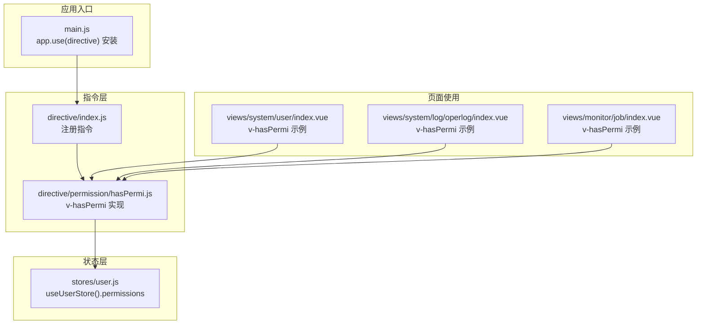
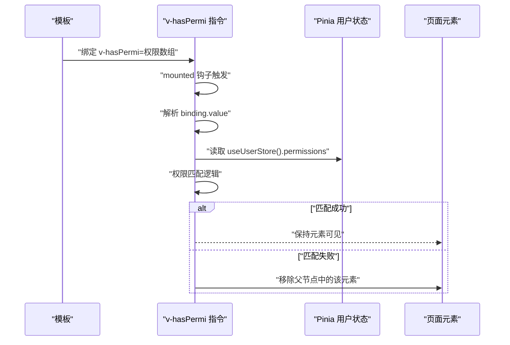
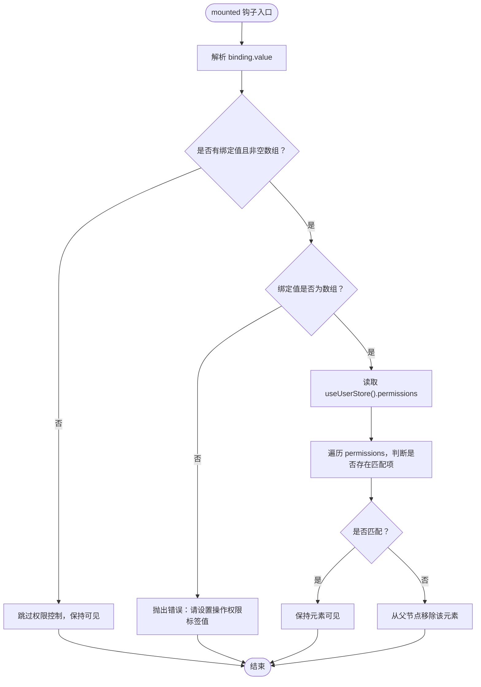
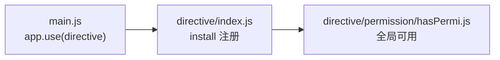
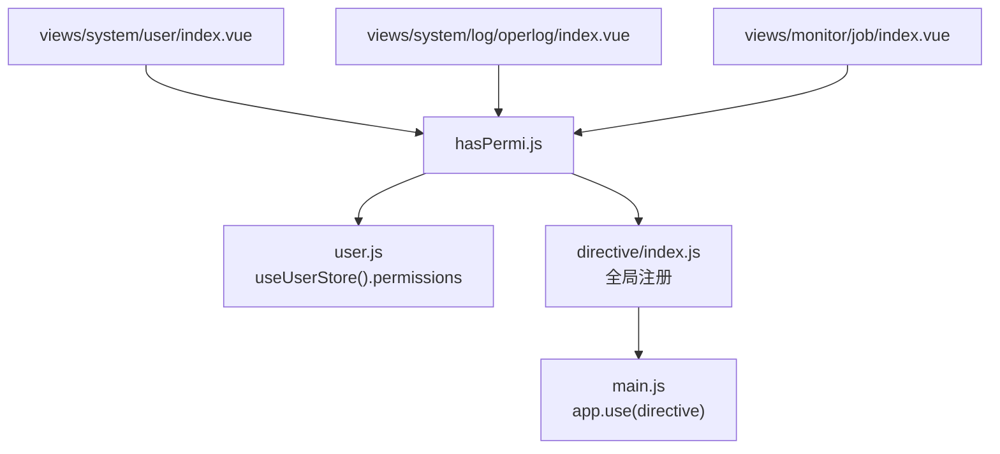

# hasPermi指令实现

<cite>
**本文引用的文件**
- [hasPermi.js](file://bear-jia-vue3/src/directive/permission/hasPermi.js)
- [index.js](file://bear-jia-vue3/src/directive/index.js)
- [main.js](file://bear-jia-vue3/src/main.js)
- [user.js](file://bear-jia-vue3/src/stores/user.js)
- [index.vue](file://bear-jia-vue3/src/views/system/user/index.vue)
- [index.vue](file://bear-jia-vue3/src/views/system/log/operlog/index.vue)
- [index.vue](file://bear-jia-vue3/src/views/monitor/job/index.vue)
</cite>

## 目录
1. [简介](#简介)
2. [项目结构](#项目结构)
3. [核心组件](#核心组件)
4. [架构总览](#架构总览)
5. [详细组件分析](#详细组件分析)
6. [依赖关系分析](#依赖关系分析)
7. [性能考量](#性能考量)
8. [故障排查指南](#故障排查指南)
9. [结论](#结论)
10. [附录](#附录)

## 简介
本文档围绕 v-hasPermi 自定义指令展开，系统性解析其工作机制与最佳实践。重点说明：
- 指令如何从 Pinia 的 user store 中读取当前用户的权限列表（permissions）
- 如何将指令传入的权限值与用户权限进行精确比对验证
- mounted 钩子中的执行流程：参数解析、权限校验逻辑、DOM 处理
- 权限校验失败时移除 DOM 元素以隐藏内容的策略
- 在 Vue 模板中使用 v-hasPermi 的示例与注意事项
- 对空值、字符串、数组等参数类型的处理方式
- 与系统权限控制体系的集成方式

## 项目结构
v-hasPermi 属于前端指令层，位于 directive/permission 目录；通过 directive/index.js 注册到全局；在 main.js 中统一安装；业务页面通过 v-hasPermi 控制按钮、链接等元素的可见性。

图表来源
- [index.js](file://bear-jia-vue3/src/directive/index.js#L1-L24)
- [hasPermi.js](file://bear-jia-vue3/src/directive/permission/hasPermi.js#L1-L34)
- [main.js](file://bear-jia-vue3/src/main.js#L1-L62)
- [user.js](file://bear-jia-vue3/src/stores/user.js#L1-L83)
- [index.vue](file://bear-jia-vue3/src/views/system/user/index.vue#L1-L92)
- [index.vue](file://bear-jia-vue3/src/views/system/log/operlog/index.vue#L30-L41)
- [index.vue](file://bear-jia-vue3/src/views/monitor/job/index.vue#L1-L25)

章节来源
- [index.js](file://bear-jia-vue3/src/directive/index.js#L1-L24)
- [main.js](file://bear-jia-vue3/src/main.js#L1-L62)

## 核心组件
- v-hasPermi 指令：在 mounted 钩子中读取绑定值，从 Pinia user store 获取 permissions，进行权限匹配，若未通过则移除对应 DOM 节点。
- 指令注册：在 directive/index.js 中注册为全局指令，供任意模板使用。
- 应用安装：在 main.js 中调用 app.use(directive) 完成全局安装。
- 用户状态：useUserStore 提供 permissions 字段，通常由后端登录接口返回并填充。

章节来源
- [hasPermi.js](file://bear-jia-vue3/src/directive/permission/hasPermi.js#L1-L34)
- [index.js](file://bear-jia-vue3/src/directive/index.js#L1-L24)
- [main.js](file://bear-jia-vue3/src/main.js#L1-L62)
- [user.js](file://bear-jia-vue3/src/stores/user.js#L1-L83)

## 架构总览
v-hasPermi 的工作流可概括为：模板编译 -> 指令 mounted 钩子 -> 读取绑定值 -> 读取用户权限 -> 权限匹配 -> DOM 处理。

图表来源
- [hasPermi.js](file://bear-jia-vue3/src/directive/permission/hasPermi.js#L1-L34)
- [user.js](file://bear-jia-vue3/src/stores/user.js#L1-L83)

## 详细组件分析

### v-hasPermi 指令实现
- 参数解析
  - 若未传入绑定值或绑定值为空数组，则默认不进行权限控制，元素保持可见。
  - 若绑定值为非空数组，则进入权限校验流程。
  - 若绑定值为非数组类型（例如字符串），将直接抛出错误，阻止继续执行。
- 权限校验
  - 指令内部维护一个“通配权限”标识，当用户权限包含该通配符时，视为拥有全部权限。
  - 否则，仅当用户权限集合中存在与绑定数组中的任一权限相匹配时，才认为通过。
- DOM 处理
  - 若权限校验失败，指令会尝试从其父节点移除该元素，从而达到隐藏的目的。

图表来源
- [hasPermi.js](file://bear-jia-vue3/src/directive/permission/hasPermi.js#L1-L34)

章节来源
- [hasPermi.js](file://bear-jia-vue3/src/directive/permission/hasPermi.js#L1-L34)

### 指令注册与应用安装
- 在 directive/index.js 中注册 v-hasPermi 指令，并导出 install 方法。
- 在 main.js 中通过 app.use(directive) 完成全局安装，使所有模板均可使用该指令。

图表来源
- [main.js](file://bear-jia-vue3/src/main.js#L1-L62)
- [index.js](file://bear-jia-vue3/src/directive/index.js#L1-L24)

章节来源
- [main.js](file://bear-jia-vue3/src/main.js#L1-L62)
- [index.js](file://bear-jia-vue3/src/directive/index.js#L1-L24)

### 用户权限状态与加载
- useUserStore 提供 permissions 字段，通常在登录后由后端返回并填充。
- 页面可通过调用用户信息接口获取权限列表，随后 v-hasPermi 即可基于该列表进行校验。

章节来源
- [user.js](file://bear-jia-vue3/src/stores/user.js#L1-L83)

### 在模板中的使用示例
- 常见用法：v-hasPermi="['system:user:add']"
- 多个权限：v-hasPermi="['system:user:add','system:user:remove']"
- 与 Ant Design Vue 组件结合：在按钮、链接等元素上使用，根据权限决定是否显示。

参考示例（路径）
- [views/system/user/index.vue](file://bear-jia-vue3/src/views/system/user/index.vue#L24-L36)
- [views/system/log/operlog/index.vue](file://bear-jia-vue3/src/views/system/log/operlog/index.vue#L30-L41)
- [views/monitor/job/index.vue](file://bear-jia-vue3/src/views/monitor/job/index.vue#L10-L20)

章节来源
- [index.vue](file://bear-jia-vue3/src/views/system/user/index.vue#L24-L36)
- [index.vue](file://bear-jia-vue3/src/views/system/log/operlog/index.vue#L30-L41)
- [index.vue](file://bear-jia-vue3/src/views/monitor/job/index.vue#L10-L20)

### 参数类型与行为说明
- 空值/空数组：不进行权限控制，元素保持可见。
- 数组：作为权限集合进行匹配，满足任一即可通过。
- 非数组：直接抛出错误，阻止继续执行。

章节来源
- [hasPermi.js](file://bear-jia-vue3/src/directive/permission/hasPermi.js#L1-L34)

### 与系统权限控制体系的集成
- 前端：v-hasPermi 基于 useUserStore().permissions 进行本地校验，用于界面级的可见性控制。
- 后端：权限集合通常来源于登录接口返回，后端在接口层与业务层进行严格校验，确保安全边界。
- 建议：前端可见性控制与后端访问控制共同构成完整的权限体系，避免仅依赖前端控制导致的安全风险。

章节来源
- [user.js](file://bear-jia-vue3/src/stores/user.js#L1-L83)
- [hasPermi.js](file://bear-jia-vue3/src/directive/permission/hasPermi.js#L1-L34)

## 依赖关系分析
- 指令依赖
  - 依赖 Pinia 的 useUserStore，读取 permissions
  - 依赖 Vue 指令生命周期（mounted）
- 应用依赖
  - main.js 中安装 directive，使指令全局可用
  - 页面模板直接使用 v-hasPermi 指令

图表来源
- [hasPermi.js](file://bear-jia-vue3/src/directive/permission/hasPermi.js#L1-L34)
- [user.js](file://bear-jia-vue3/src/stores/user.js#L1-L83)
- [index.js](file://bear-jia-vue3/src/directive/index.js#L1-L24)
- [main.js](file://bear-jia-vue3/src/main.js#L1-L62)
- [index.vue](file://bear-jia-vue3/src/views/system/user/index.vue#L1-L92)
- [index.vue](file://bear-jia-vue3/src/views/system/log/operlog/index.vue#L30-L41)
- [index.vue](file://bear-jia-vue3/src/views/monitor/job/index.vue#L1-L25)

章节来源
- [hasPermi.js](file://bear-jia-vue3/src/directive/permission/hasPermi.js#L1-L34)
- [index.js](file://bear-jia-vue3/src/directive/index.js#L1-L24)
- [main.js](file://bear-jia-vue3/src/main.js#L1-L62)
- [user.js](file://bear-jia-vue3/src/stores/user.js#L1-L83)
- [index.vue](file://bear-jia-vue3/src/views/system/user/index.vue#L1-L92)
- [index.vue](file://bear-jia-vue3/src/views/system/log/operlog/index.vue#L30-L41)
- [index.vue](file://bear-jia-vue3/src/views/monitor/job/index.vue#L1-L25)

## 性能考量
- 权限匹配为线性扫描，时间复杂度 O(n)，其中 n 为用户权限数量。通常权限集合规模较小，性能开销可忽略。
- 指令仅在 mounted 钩子执行一次，后续不会重复计算，避免频繁重绘。
- 若权限集合较大，建议在业务层对权限进行预处理或缓存，减少指令层的匹配成本。

## 故障排查指南
- 报错：请设置操作权限标签值
  - 现象：当绑定值不是数组时抛出错误
  - 排查：确认 v-hasPermi 绑定的是数组，例如 v-hasPermi="['system:user:add']"
  - 参考路径：[hasPermi.js](file://bear-jia-vue3/src/directive/permission/hasPermi.js#L30-L32)
- 元素未显示
  - 现象：按钮或链接未出现
  - 排查：
    - 确认 useUserStore().permissions 已正确填充
    - 确认绑定数组中的权限字符串与后端一致
    - 确认未传入空值或空数组导致跳过校验
  - 参考路径：
    - [hasPermi.js](file://bear-jia-vue3/src/directive/permission/hasPermi.js#L14-L17)
    - [user.js](file://bear-jia-vue3/src/stores/user.js#L1-L83)
- 指令未生效
  - 现象：全局未注册指令
  - 排查：确认 main.js 中已 app.use(directive)
  - 参考路径：[main.js](file://bear-jia-vue3/src/main.js#L1-L62)

章节来源
- [hasPermi.js](file://bear-jia-vue3/src/directive/permission/hasPermi.js#L14-L32)
- [user.js](file://bear-jia-vue3/src/stores/user.js#L1-L83)
- [main.js](file://bear-jia-vue3/src/main.js#L1-L62)

## 结论
v-hasPermi 指令通过在 mounted 钩子中读取绑定值与 useUserStore().permissions 进行精确匹配，实现了界面级的权限控制。其设计简洁、职责明确：参数校验、权限匹配、DOM 处理。配合后端严格的访问控制，可有效提升用户体验与系统安全性。建议在模板中规范使用数组形式的权限值，并确保用户权限在登录后正确加载。

## 附录
- 使用建议
  - 统一使用数组形式传参，避免字符串导致的错误
  - 将权限字符串与后端保持一致，便于前后端协同
  - 对关键操作（新增、删除、导出）均应加上 v-hasPermi 控制
- 参考示例（路径）
  - [views/system/user/index.vue](file://bear-jia-vue3/src/views/system/user/index.vue#L24-L36)
  - [views/system/log/operlog/index.vue](file://bear-jia-vue3/src/views/system/log/operlog/index.vue#L30-L41)
  - [views/monitor/job/index.vue](file://bear-jia-vue3/src/views/monitor/job/index.vue#L10-L20)