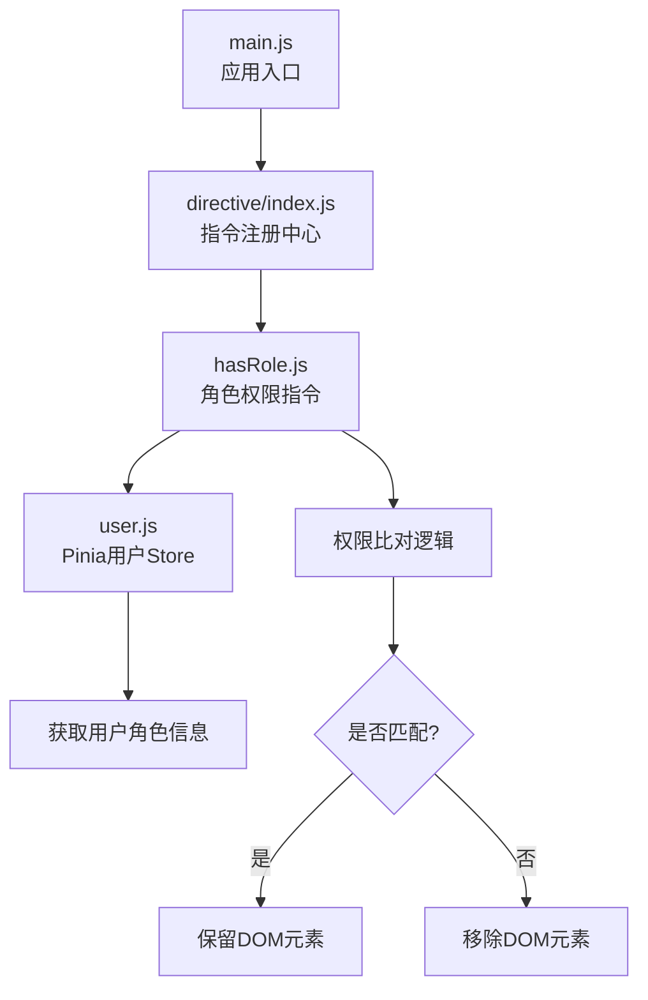
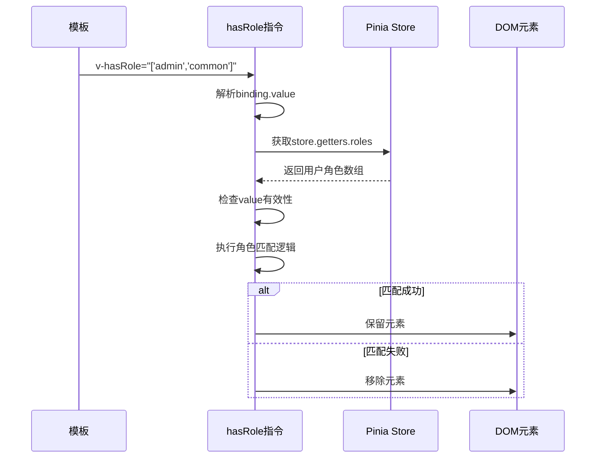
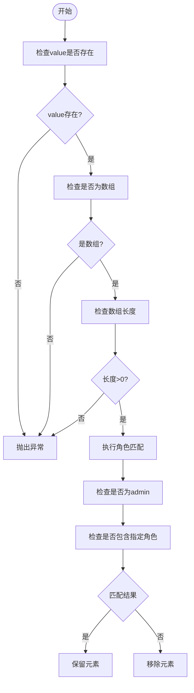
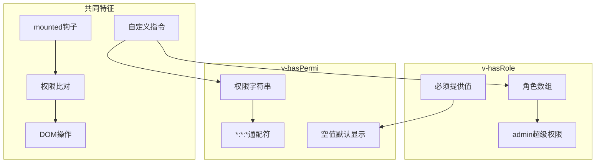
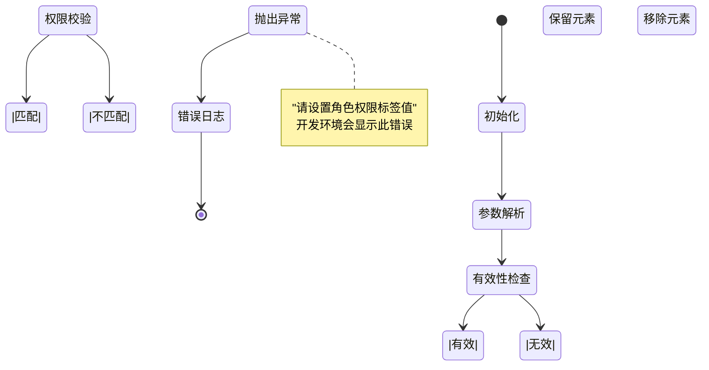
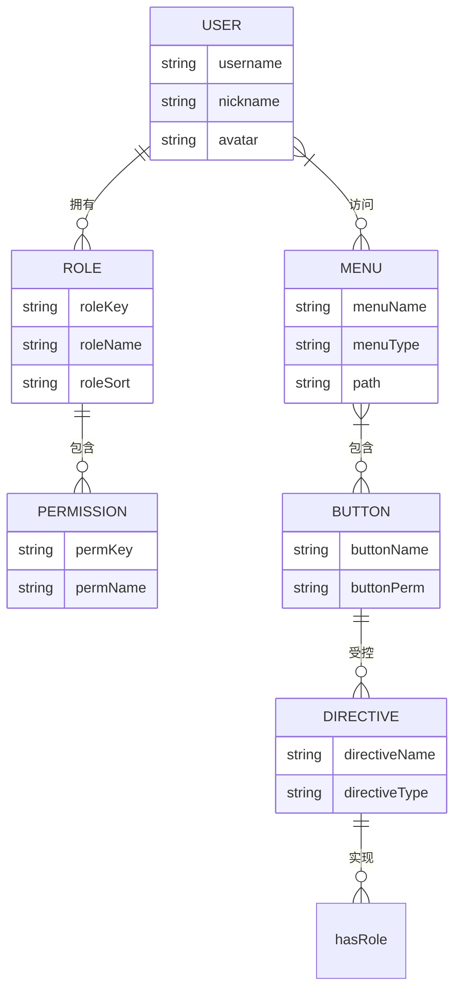

# hasRole指令实现

<cite>
**本文档引用文件**  
- [hasRole.js](file://bear-jia-vue3/src/directive/permission/hasRole.js)
- [user.js](file://bear-jia-vue3/src/stores/user.js)
- [main.js](file://bear-jia-vue3/src/main.js)
- [hasPermi.js](file://bear-jia-vue3/src/directive/permission/hasPermi.js)
- [index.js](file://bear-jia-vue3/src/directive/index.js)
</cite>

## 目录
1. [简介](#简介)
2. [核心组件](#核心组件)
3. [执行流程分析](#执行流程分析)
4. [参数处理逻辑](#参数处理逻辑)
5. [超级管理员特殊处理](#超级管理员特殊处理)
6. [与hasPermi指令对比](#与haspermi指令对比)
7. [使用示例](#使用示例)
8. [错误处理机制](#错误处理机制)
9. [在RBAC中的作用](#在rbac中的作用)

## 简介
`v-hasRole` 是一个Vue自定义指令，用于实现基于角色的访问控制（RBAC）。该指令通过读取Pinia状态管理中的用户角色信息，并与传入的角色权限进行比对，决定是否显示或移除对应的DOM元素。特别地，拥有`admin`角色的用户将自动通过所有权限校验。

## 核心组件

**指令注册与初始化流程：**
1. 在 `main.js` 中通过 `app.use(directive)` 注册所有自定义指令
2. `directive/index.js` 负责集中管理所有指令的注册
3. `hasRole.js` 定义了具体的指令逻辑
4. 通过Pinia的 `user.js` store 获取当前用户的角色信息



**Diagram sources**  
- [main.js](file://bear-jia-vue3/src/main.js#L35)
- [index.js](file://bear-jia-vue3/src/directive/index.js#L8-L10)
- [hasRole.js](file://bear-jia-vue3/src/directive/permission/hasRole.js#L8-L28)
- [user.js](file://bear-jia-vue3/src/stores/user.js#L5-L10)

**Section sources**  
- [main.js](file://bear-jia-vue3/src/main.js#L1-L62)
- [index.js](file://bear-jia-vue3/src/directive/index.js#L1-L24)

## 执行流程分析
`v-hasRole` 指令在 `mounted` 钩子中执行完整的权限校验流程：



**Diagram sources**  
- [hasRole.js](file://bear-jia-vue3/src/directive/permission/hasRole.js#L9-L28)

**Section sources**  
- [hasRole.js](file://bear-jia-vue3/src/directive/permission/hasRole.js#L9-L28)

## 参数处理逻辑
指令对传入参数进行严格的类型检查和处理：



**Diagram sources**  
- [hasRole.js](file://bear-jia-vue3/src/directive/permission/hasRole.js#L14-L23)

**Section sources**  
- [hasRole.js](file://bear-jia-vue3/src/directive/permission/hasRole.js#L14-L26)

## 超级管理员特殊处理
系统对超级管理员角色（admin）进行了特殊处理，确保其拥有最高权限：

```mermaid
classDiagram
class RoleChecker {
+value : Array
+roles : Array
+super_admin : String
+hasRole : Boolean
+mounted(el, binding)
-validateParams()
-checkRoleMatch()
}
RoleChecker --> "1" RoleValidator : uses
RoleValidator --> "1" AdminBypass : uses
class AdminBypass {
+check(role) : Boolean
+bypassAll() : Boolean
}
class RoleValidator {
+validate(value) : Boolean
+match(roles, value) : Boolean
}
note right of AdminBypass
当用户角色包含"admin"时，
自动通过所有权限校验
end note
```

**Diagram sources**  
- [hasRole.js](file://bear-jia-vue3/src/directive/permission/hasRole.js#L11-L19)

**Section sources**  
- [hasRole.js](file://bear-jia-vue3/src/directive/permission/hasRole.js#L11-L19)

## 与hasPermi指令对比
`v-hasRole` 与 `v-hasPermi` 指令在设计上具有相似性，但应用场景不同：

| 对比维度 | v-hasRole | v-hasPermi |
|---------|---------|----------|
| **权限类型** | 角色权限 | 操作权限 |
| **数据来源** | userStore.roles | userStore.permissions |
| **通配符** | "admin"角色 | "*:*:*"权限 |
| **空值处理** | 必须提供非空数组 | 空值时默认显示 |
| **导入方式** | 通过store.getters | 通过useUserStore() |



**Diagram sources**  
- [hasRole.js](file://bear-jia-vue3/src/directive/permission/hasRole.js)
- [hasPermi.js](file://bear-jia-vue3/src/directive/permission/hasPermi.js)

**Section sources**  
- [hasRole.js](file://bear-jia-vue3/src/directive/permission/hasRole.js)
- [hasPermi.js](file://bear-jia-vue3/src/directive/permission/hasPermi.js)

## 使用示例
在Vue模板中使用 `v-hasRole` 指令的典型示例：

```vue
<template>
  <!-- 只有admin或common角色的用户可见 -->
  <a-button v-hasRole="['admin','common']">
    普通操作
  </a-button>
  
  <!-- 只有admin角色的用户可见 -->
  <a-button v-hasRole="['admin']">
    管理操作
  </a-button>
  
  <!-- 多个角色条件 -->
  <div v-hasRole="['admin','editor','reviewer']">
    内容编辑区域
  </div>
</template>
```

**Section sources**  
- [hasRole.js](file://bear-jia-vue3/src/directive/permission/hasRole.js)

## 错误处理机制
指令实现了严格的参数验证和错误处理：



**Diagram sources**  
- [hasRole.js](file://bear-jia-vue3/src/directive/permission/hasRole.js#L25)

**Section sources**  
- [hasRole.js](file://bear-jia-vue3/src/directive/permission/hasRole.js#L24-L26)

## 在RBAC中的作用
`v-hasRole` 指令在基于角色的访问控制体系中扮演关键角色：



**Diagram sources**  
- [hasRole.js](file://bear-jia-vue3/src/directive/permission/hasRole.js)
- [user.js](file://bear-jia-vue3/src/stores/user.js)

**Section sources**  
- [hasRole.js](file://bear-jia-vue3/src/directive/permission/hasRole.js)
- [user.js](file://bear-jia-vue3/src/stores/user.js)