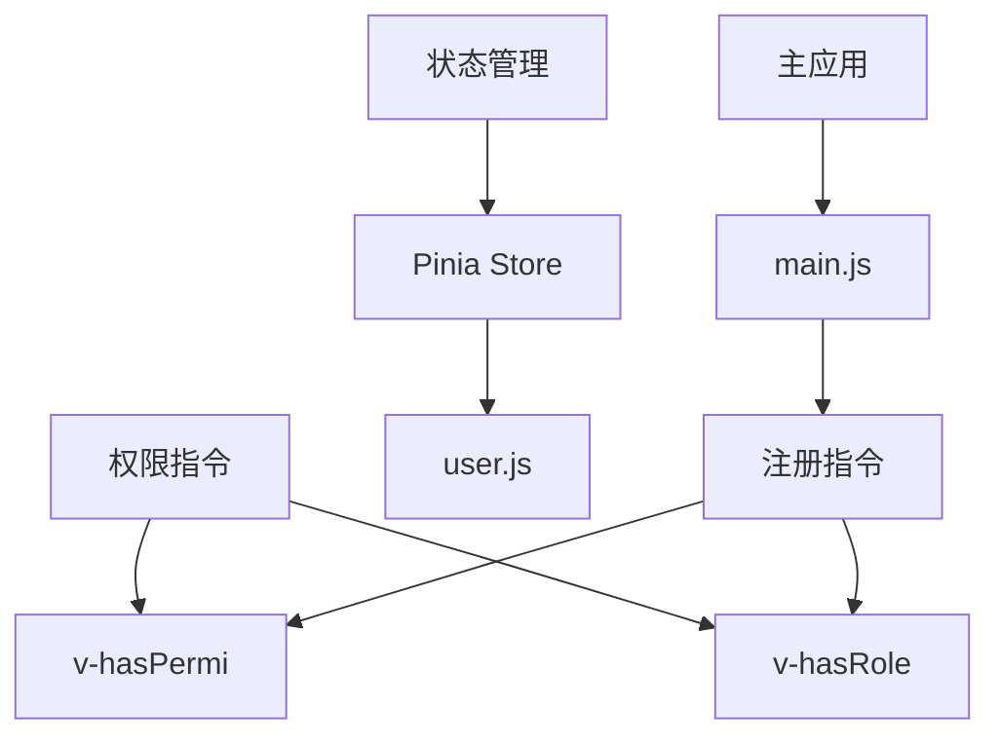
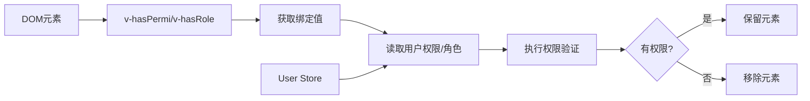
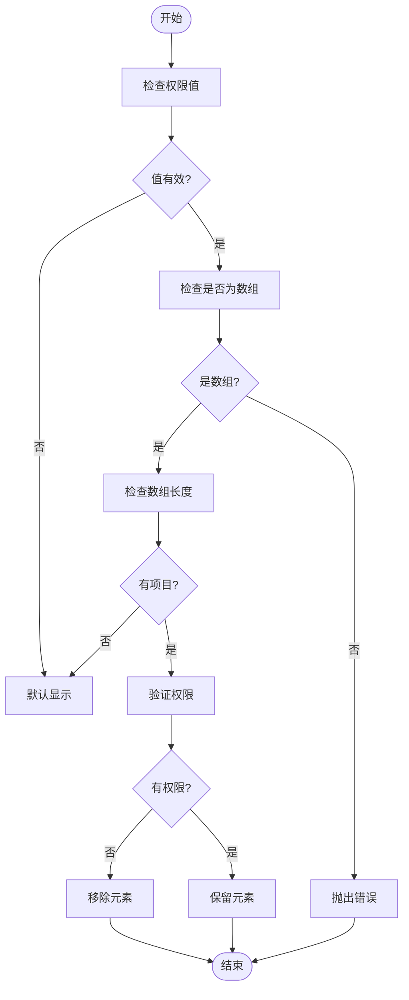
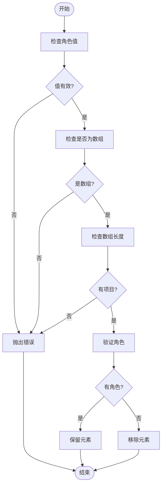
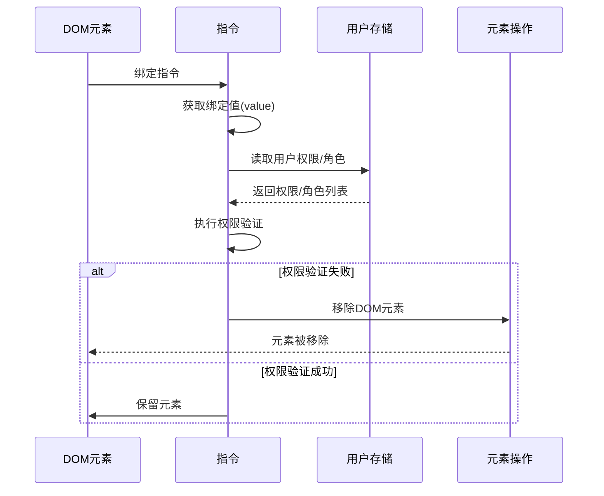
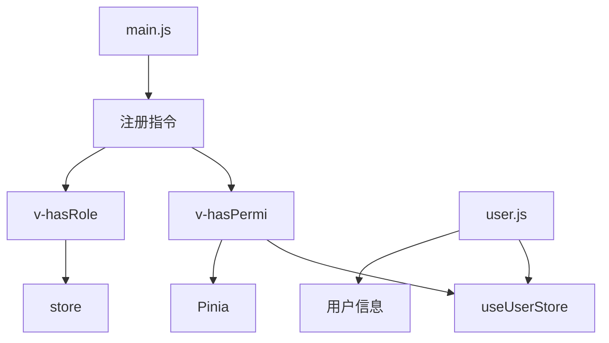

# 权限指令实现

<cite>
**本文档引用的文件**
- [hasPermi.js](file://bear-jia-vue3\src\directive\permission\hasPermi.js)
- [hasRole.js](file://bear-jia-vue3\src\directive\permission\hasRole.js)
- [index.js](file://bear-jia-vue3\src\directive\index.js)
- [user.js](file://bear-jia-vue3\src\stores\user.js)
- [main.js](file://bear-jia-vue3\src\main.js)
- [index.vue](file://bear-jia-vue3\src\views\system\config\index.vue)
- [TableActionBar/index.vue](file://bear-jia-vue3\src\components\TableActionBar\index.vue)
</cite>

## 目录
1. [简介](#简介)
2. [项目结构](#项目结构)
3. [核心组件](#核心组件)
4. [架构概述](#架构概述)
5. [详细组件分析](#详细组件分析)
6. [依赖分析](#依赖分析)
7. [性能考虑](#性能考虑)
8. [故障排除指南](#故障排除指南)
9. [结论](#结论)

## 简介
本文档深入解析了Vue项目中`v-hasPermi`和`v-hasRole`两个自定义指令的实现原理。这两个指令用于实现前端操作权限和角色权限的控制，通过与用户状态存储集成，动态控制DOM元素的显示与隐藏。文档将详细说明权限验证逻辑、指令执行流程以及实际使用示例。

## 项目结构
项目采用典型的Vue 3架构，使用Pinia进行状态管理，Ant Design Vue作为UI组件库。权限相关功能主要集中在`src/directive/permission/`目录下，用户状态存储在`src/stores/user.js`中。

**Diagram sources**
- [hasPermi.js](file://bear-jia-vue3\src\directive\permission\hasPermi.js)
- [hasRole.js](file://bear-jia-vue3\src\directive\permission\hasRole.js)
- [user.js](file://bear-jia-vue3\src\stores\user.js)

**Section sources**
- [hasPermi.js](file://bear-jia-vue3\src\directive\permission\hasPermi.js)
- [hasRole.js](file://bear-jia-vue3\src\directive\permission\hasRole.js)
- [user.js](file://bear-jia-vue3\src\stores\user.js)

## 核心组件
核心权限指令组件包括`v-hasPermi`和`v-hasRole`，分别用于操作权限和角色权限的验证。这些指令通过读取用户存储中的权限列表和角色列表，与传入的权限值进行比对，决定是否显示相关DOM元素。

**Section sources**
- [hasPermi.js](file://bear-jia-vue3\src\directive\permission\hasPermi.js)
- [hasRole.js](file://bear-jia-vue3\src\directive\permission\hasRole.js)

## 架构概述
权限指令架构基于Vue的自定义指令系统，结合Pinia状态管理。当指令绑定到DOM元素时，在`mounted`钩子中执行权限验证逻辑。系统通过模块化设计将权限验证逻辑与用户状态存储分离，提高了代码的可维护性和可测试性。

**Diagram sources**
- [hasPermi.js](file://bear-jia-vue3\src\directive\permission\hasPermi.js)
- [hasRole.js](file://bear-jia-vue3\src\directive\permission\hasRole.js)
- [user.js](file://bear-jia-vue3\src\stores\user.js)

## 详细组件分析

### v-hasPermi 指令分析
`v-hasPermi`指令用于操作权限的验证，从用户存储中获取权限列表并与传入的权限值进行比对。

#### 权限验证逻辑

**Diagram sources**
- [hasPermi.js](file://bear-jia-vue3\src\directive\permission\hasPermi.js)

#### 空值和数组处理
指令对空值和数组类型参数有特定的处理方式：
- 当权限值为空（null、undefined）或空数组时，不进行权限控制，默认显示元素
- 当权限值为非空数组时，执行权限验证
- 当权限值不是数组时，抛出错误

**Section sources**
- [hasPermi.js](file://bear-jia-vue3\src\directive\permission\hasPermi.js)

### v-hasRole 指令分析
`v-hasRole`指令用于角色权限的验证，处理角色匹配逻辑。

#### 角色匹配逻辑

**Diagram sources**
- [hasRole.js](file://bear-jia-vue3\src\directive\permission\hasRole.js)

#### 超级管理员特殊处理
指令包含对超级管理员的特殊处理逻辑：当用户角色为"admin"时，无论传入的角色权限是什么，都视为有权限。

**Section sources**
- [hasRole.js](file://bear-jia-vue3\src\directive\permission\hasRole.js)

### 指令执行流程
#### mounted 钩子函数执行流程

**Diagram sources**
- [hasPermi.js](file://bear-jia-vue3\src\directive\permission\hasPermi.js)
- [hasRole.js](file://bear-jia-vue3\src\directive\permission\hasRole.js)

#### 权限验证失败处理
当权限验证失败时，指令会通过`el.parentNode && el.parentNode.removeChild(el)`的方式移除DOM元素，确保无权限的用户无法看到相关操作按钮。

**Section sources**
- [hasPermi.js](file://bear-jia-vue3\src\directive\permission\hasPermi.js#L27-L29)
- [hasRole.js](file://bear-jia-vue3\src\directive\permission\hasRole.js#L21-L23)

## 依赖分析
权限指令依赖于用户状态存储来获取权限和角色信息，同时需要在应用启动时注册到Vue实例中。

**Diagram sources**
- [hasPermi.js](file://bear-jia-vue3\src\directive\permission\hasPermi.js)
- [hasRole.js](file://bear-jia-vue3\src\directive\permission\hasRole.js)
- [index.js](file://bear-jia-vue3\src\directive\index.js)
- [main.js](file://bear-jia-vue3\src\main.js)
- [user.js](file://bear-jia-vue3\src\stores\user.js)

**Section sources**
- [hasPermi.js](file://bear-jia-vue3\src\directive\permission\hasPermi.js)
- [hasRole.js](file://bear-jia-vue3\src\directive\permission\hasRole.js)
- [index.js](file://bear-jia-vue3\src\directive\index.js)
- [main.js](file://bear-jia-vue3\src\main.js)
- [user.js](file://bear-jia-vue3\src\stores\user.js)

## 性能考虑
权限指令在`mounted`钩子中执行，避免了在每次渲染时重复验证。由于权限信息通常在用户登录后确定且不会频繁变化，这种设计具有良好的性能表现。指令的验证逻辑简单高效，主要开销在于数组的`some`方法调用，时间复杂度为O(n)，在实际应用中性能影响很小。

## 故障排除指南
### 常见问题及解决方案
1. **指令不生效**：检查是否在`main.js`中正确注册了指令
2. **权限验证错误抛出**：确保传入的权限值为数组类型
3. **元素未正确移除**：检查DOM结构，确保元素有父节点
4. **超级管理员权限未生效**：确认用户角色中包含"admin"

### 错误抛出场景
指令在以下场景会抛出错误：
- `v-hasPermi`：当权限值不是数组时
- `v-hasRole`：当角色值不是数组或为空数组时

**Section sources**
- [hasPermi.js](file://bear-jia-vue3\src\directive\permission\hasPermi.js#L31)
- [hasRole.js](file://bear-jia-vue3\src\directive\permission\hasRole.js#L25)

## 结论
`v-hasPermi`和`v-hasRole`指令实现了灵活的前端权限控制机制。通过与Pinia状态管理集成，指令能够动态响应用户权限变化。设计上考虑了空值处理、错误处理和特殊角色（超级管理员）的处理，具有良好的健壮性。在实际使用中，开发者可以通过简单的模板语法实现细粒度的操作权限控制，提高了开发效率和系统安全性。