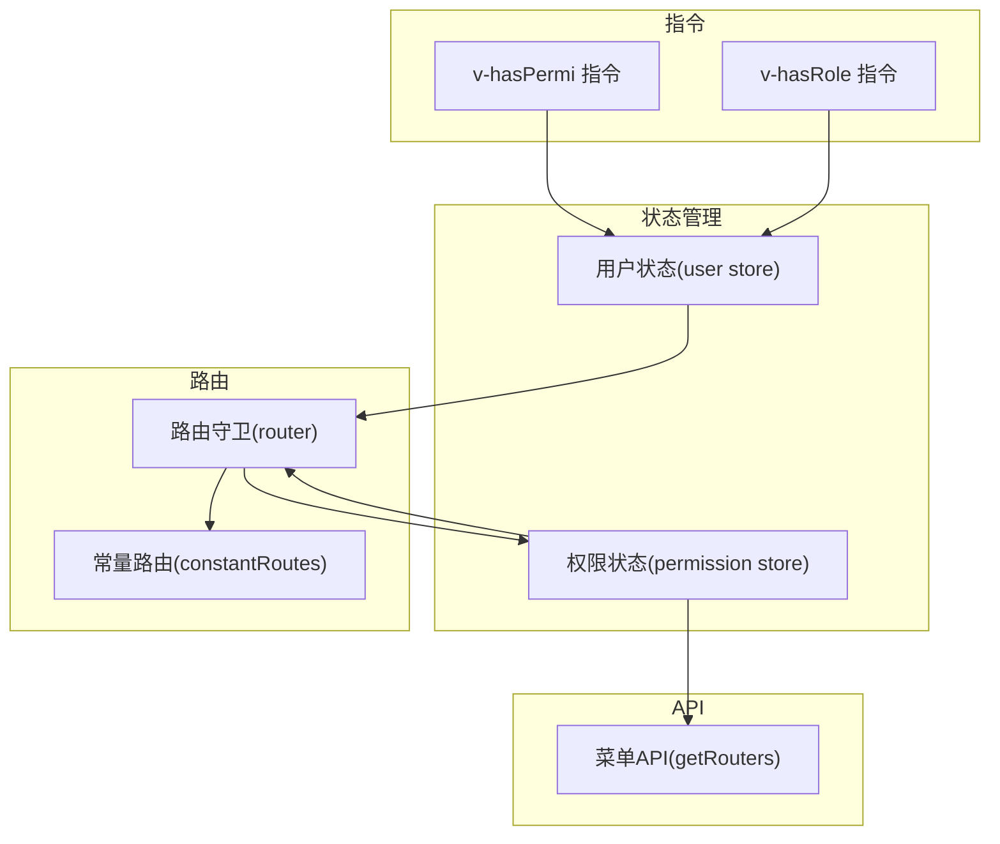
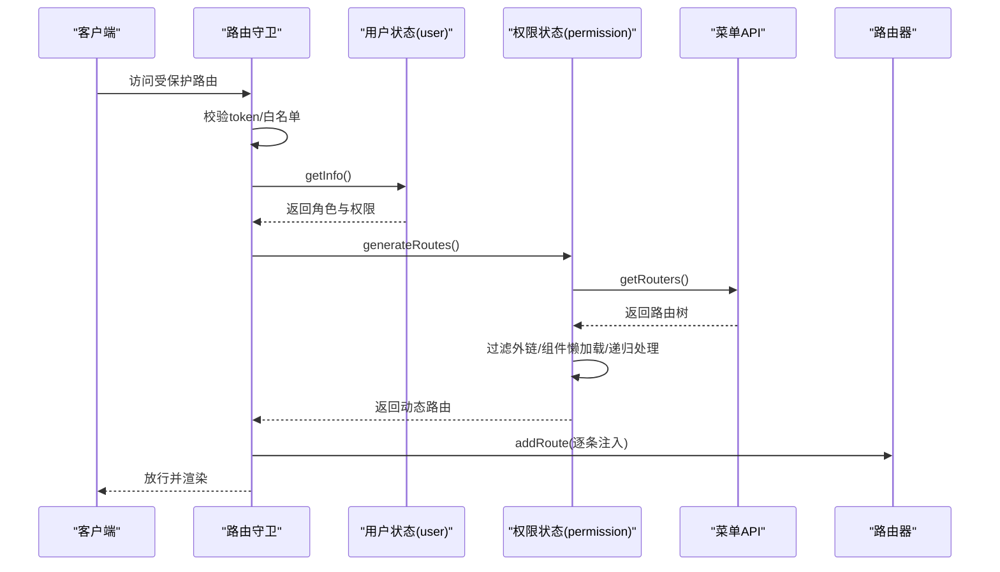
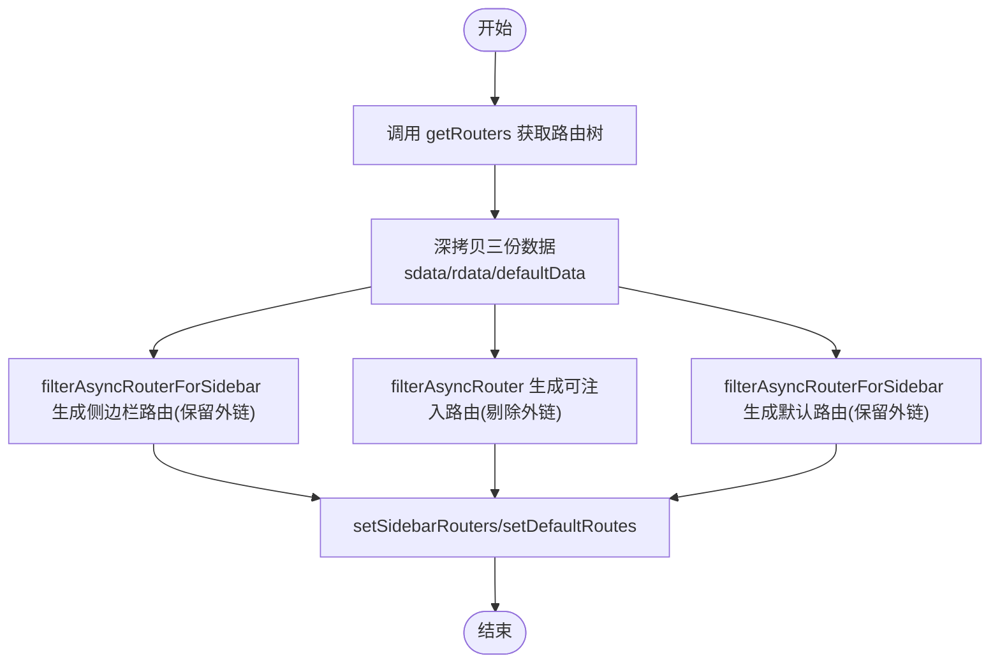
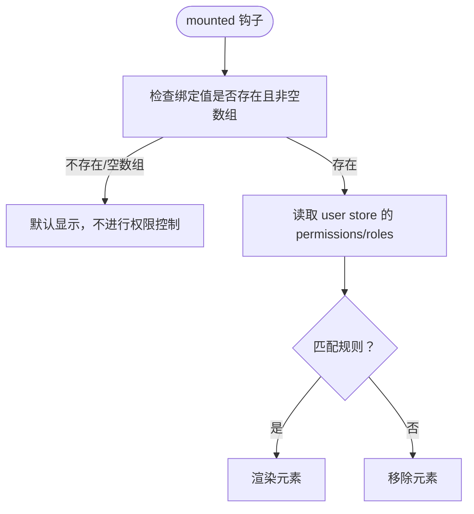
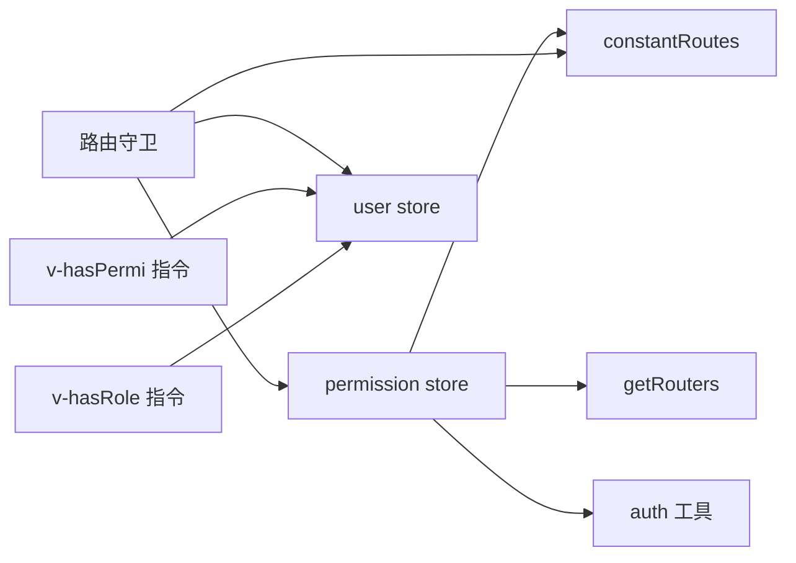

# 权限状态管理

<cite>
**本文引用的文件**
- [permission.js](file://bear-jia-vue3/src/stores/permission.js)
- [user.js](file://bear-jia-vue3/src/stores/user.js)
- [vueRouter.js](file://bear-jia-vue3/src/router/vueRouter.js)
- [routes.js](file://bear-jia-vue3/src/router/routes.js)
- [menu.js](file://bear-jia-vue3/src/api/system/menu.js)
- [hasPermi.js](file://bear-jia-vue3/src/directive/permission/hasPermi.js)
- [hasRole.js](file://bear-jia-vue3/src/directive/permission/hasRole.js)
- [auth.js](file://bear-jia-vue3/src/plugins/auth.js)
- [security.js](file://bear-jia-vue3/src/utils/security.js)
- [index.js](file://bear-jia-vue3/src/directive/index.js)
- [index.vue](file://bear-jia-vue3/src/views/system/user/index.vue)
- [index.vue](file://bear-jia-vue3/src/views/system/menu/index.vue)
</cite>

## 目录
1. [简介](#简介)
2. [项目结构](#项目结构)
3. [核心组件](#核心组件)
4. [架构总览](#架构总览)
5. [详细组件分析](#详细组件分析)
6. [依赖关系分析](#依赖关系分析)
7. [性能考量](#性能考量)
8. [故障排查指南](#故障排查指南)
9. [结论](#结论)
10. [附录](#附录)

## 简介
本文件围绕前端权限状态管理展开，系统性解析 permission store 的权限控制体系，涵盖：
- 角色权限数据的获取与存储机制（从后端 API 获取权限码）
- 动态路由生成算法（基于用户权限过滤与生成可访问路由表）
- 指令层 hasPermi 与 hasRole 的实现原理及其与 permission store 的交互
- 菜单权限控制逻辑（菜单项显示/隐藏、按钮级权限控制）
- 权限缓存策略与更新机制（用户权限变更后的状态同步）
- 复杂嵌套路由中的权限验证处理方式
- 提供多场景的权限检查使用示例与最佳实践

## 项目结构
权限相关的核心模块分布如下：
- 状态管理：permission store（动态路由与路由集合）、user store（用户信息与权限集合）
- 路由：路由守卫在导航时生成动态路由；常量路由作为基础路由
- API：系统菜单 API 提供后端路由数据
- 指令：v-hasPermi、v-hasRole 在模板层面进行按钮/元素级权限控制
- 工具：auth 插件与 security 工具提供权限校验与安全能力

图表来源
- [permission.js](file://bear-jia-vue3/src/stores/permission.js#L210-L263)
- [user.js](file://bear-jia-vue3/src/stores/user.js#L1-L83)
- [vueRouter.js](file://bear-jia-vue3/src/router/vueRouter.js#L1-L129)
- [routes.js](file://bear-jia-vue3/src/router/routes.js#L1-L100)
- [menu.js](file://bear-jia-vue3/src/api/system/menu.js#L1-L10)
- [hasPermi.js](file://bear-jia-vue3/src/directive/permission/hasPermi.js#L1-L35)
- [hasRole.js](file://bear-jia-vue3/src/directive/permission/hasRole.js#L1-L29)

章节来源
- [permission.js](file://bear-jia-vue3/src/stores/permission.js#L210-L263)
- [user.js](file://bear-jia-vue3/src/stores/user.js#L1-L83)
- [vueRouter.js](file://bear-jia-vue3/src/router/vueRouter.js#L1-L129)
- [routes.js](file://bear-jia-vue3/src/router/routes.js#L1-L100)
- [menu.js](file://bear-jia-vue3/src/api/system/menu.js#L1-L10)
- [hasPermi.js](file://bear-jia-vue3/src/directive/permission/hasPermi.js#L1-L35)
- [hasRole.js](file://bear-jia-vue3/src/directive/permission/hasRole.js#L1-L29)

## 核心组件
- permission store：负责动态路由生成、侧边栏/顶部路由集合维护、默认路由集合维护
- user store：负责登录、获取用户信息（含角色与权限）、登出清理
- 路由守卫：在首次进入受保护路由或刷新后丢失动态路由时，触发 permission store 生成路由，并将动态路由注入到路由器
- 指令层：v-hasPermi 与 v-hasRole 在 DOM 渲染阶段进行权限判定，决定元素是否渲染
- API 层：getRouters 从后端获取路由树，permission store 解析并过滤生成最终可用路由

章节来源
- [permission.js](file://bear-jia-vue3/src/stores/permission.js#L210-L263)
- [user.js](file://bear-jia-vue3/src/stores/user.js#L1-L83)
- [vueRouter.js](file://bear-jia-vue3/src/router/vueRouter.js#L37-L99)
- [menu.js](file://bear-jia-vue3/src/api/system/menu.js#L1-L10)
- [hasPermi.js](file://bear-jia-vue3/src/directive/permission/hasPermi.js#L1-L35)
- [hasRole.js](file://bear-jia-vue3/src/directive/permission/hasRole.js#L1-L29)

## 架构总览
权限控制的总体流程：
- 登录成功后，路由守卫读取 token 并调用用户信息接口
- 用户信息接口返回角色与权限集合，写入 user store
- 调用 permission store 的 generateRoutes，向后端请求路由树
- permission store 解析路由树，过滤外链、组件懒加载、递归处理子路由
- 将生成的动态路由注入到路由器，并更新侧边栏/顶部/默认路由集合
- 模板层通过 v-hasPermi/v-hasRole 指令进行按钮/元素级权限控制

图表来源
- [vueRouter.js](file://bear-jia-vue3/src/router/vueRouter.js#L37-L99)
- [user.js](file://bear-jia-vue3/src/stores/user.js#L48-L62)
- [permission.js](file://bear-jia-vue3/src/stores/permission.js#L234-L261)
- [menu.js](file://bear-jia-vue3/src/api/system/menu.js#L1-L10)

## 详细组件分析

### permission store：动态路由生成与过滤
- 角色权限过滤：hasPermission 依据 route.meta.roles 判断是否允许访问
- 异步路由过滤：filterAsyncRoutes 递归过滤，保留可访问子树
- 动态路由过滤：filterDynamicRoutes 依据 route.permissions 或 route.roles 进行权限过滤
- 路由树预处理：
  - filterAsyncRouter/filterAsyncRouterForSidebar：处理外链、Layout/ParentView/InnerLink 特殊组件、组件懒加载、子路由扁平化与路径拼接
  - isExternalLink：识别外链，外链仅用于菜单显示，不注入到路由器
  - filterChildren/filterChildrenForSidebar：处理 ParentView 场景下的子路由拼接与过滤
- 路由注入与集合维护：generateRoutes 成功后设置 routes/addRoutes/defaultRoutes/topbarRouters/sidebarRouters

图表来源
- [permission.js](file://bear-jia-vue3/src/stores/permission.js#L234-L261)

章节来源
- [permission.js](file://bear-jia-vue3/src/stores/permission.js#L10-L36)
- [permission.js](file://bear-jia-vue3/src/stores/permission.js#L41-L103)
- [permission.js](file://bear-jia-vue3/src/stores/permission.js#L105-L175)
- [permission.js](file://bear-jia-vue3/src/stores/permission.js#L177-L209)
- [permission.js](file://bear-jia-vue3/src/stores/permission.js#L210-L263)

### user store：角色与权限数据的获取与存储
- 登录：写入 token 到 Cookie，保存至 store
- 获取用户信息：roles、permissions、昵称、头像、登录时间/IP 等
- 退出：清空 token、roles、permissions，移除 Cookie

章节来源
- [user.js](file://bear-jia-vue3/src/stores/user.js#L1-L83)

### 路由守卫：动态路由注入与刷新恢复
- 白名单放行
- 无 token 重定向登录
- 首次进入或刷新后丢失动态路由时，重新生成并注入
- 页面状态保存/恢复（滚动位置）

章节来源
- [vueRouter.js](file://bear-jia-vue3/src/router/vueRouter.js#L1-L129)
- [routes.js](file://bear-jia-vue3/src/router/routes.js#L1-L100)

### 指令层：v-hasPermi 与 v-hasRole
- v-hasPermi：在 mounted 阶段读取 user store 中的 permissions，若未传值或为空数组则默认显示；否则要求至少包含一个权限或拥有通配权限才渲染
- v-hasRole：在 mounted 阶段读取 roles，若未传值或为空数组则抛错；否则要求至少包含一个角色或拥有 admin 角色才渲染
- 指令注册：在 directive/index.js 中注册 v-hasPermi

图表来源
- [hasPermi.js](file://bear-jia-vue3/src/directive/permission/hasPermi.js#L1-L35)
- [hasRole.js](file://bear-jia-vue3/src/directive/permission/hasRole.js#L1-L29)
- [index.js](file://bear-jia-vue3/src/directive/index.js#L1-L23)

章节来源
- [hasPermi.js](file://bear-jia-vue3/src/directive/permission/hasPermi.js#L1-L35)
- [hasRole.js](file://bear-jia-vue3/src/directive/permission/hasRole.js#L1-L29)
- [index.js](file://bear-jia-vue3/src/directive/index.js#L1-L23)

### 菜单权限控制逻辑
- 菜单项显示/隐藏：通过 v-hasPermi 控制按钮与操作列渲染，从而间接影响菜单项的操作能力
- 按钮级权限控制：在表格操作列中直接使用 v-hasPermi 指令，仅当用户具备相应权限时才渲染对应按钮
- 示例：用户管理页在“新增/删除/导出”等操作按钮上使用 v-hasPermi

章节来源
- [index.vue](file://bear-jia-vue3/src/views/system/user/index.vue#L24-L35)
- [index.vue](file://bear-jia-vue3/src/views/system/menu/index.vue#L33-L54)

### 权限工具与插件
- auth 插件：提供 hasPermi/hasRole 及其 OR/AND 变体，便于在业务逻辑中进行权限判断
- security 工具：提供 hasPermission/hasRole 方法，支持通配符与管理员角色

章节来源
- [auth.js](file://bear-jia-vue3/src/plugins/auth.js#L1-L61)
- [security.js](file://bear-jia-vue3/src/utils/security.js#L80-L92)

## 依赖关系分析
- permission store 依赖：
  - constantRoutes（常量路由）
  - getRouters（后端路由树）
  - auth 工具（权限判断）
- 路由守卫依赖：
  - user store（获取用户信息）
  - permission store（生成动态路由）
  - constantRoutes（初始路由）
- 指令依赖：
  - user store（permissions/roles）
  - auth 插件（权限判断）

图表来源
- [permission.js](file://bear-jia-vue3/src/stores/permission.js#L210-L263)
- [vueRouter.js](file://bear-jia-vue3/src/router/vueRouter.js#L37-L99)
- [routes.js](file://bear-jia-vue3/src/router/routes.js#L1-L100)
- [menu.js](file://bear-jia-vue3/src/api/system/menu.js#L1-L10)
- [hasPermi.js](file://bear-jia-vue3/src/directive/permission/hasPermi.js#L1-L35)
- [hasRole.js](file://bear-jia-vue3/src/directive/permission/hasRole.js#L1-L29)

## 性能考量
- 组件懒加载：通过 import.meta.glob 预加载视图组件，减少首屏体积与按需加载延迟
- 递归过滤：filterAsyncRoutes/filterAsyncRouter 采用深度优先遍历，时间复杂度 O(N)，其中 N 为路由节点总数
- 外链处理：isExternalLink 与 filterAsyncRouterForSidebar 区分外链与内链，避免无效路由注入
- 路由注入：一次性 addRoute 注入，避免多次重复注入导致的性能损耗
- 缓存策略：当前实现未见显式持久化缓存，建议在用户信息变更或权限变更时触发重新生成路由，以保证一致性

章节来源
- [permission.js](file://bear-jia-vue3/src/stores/permission.js#L38-L40)
- [permission.js](file://bear-jia-vue3/src/stores/permission.js#L177-L191)
- [permission.js](file://bear-jia-vue3/src/stores/permission.js#L234-L261)

## 故障排查指南
- 登录后仍提示无权限
  - 检查 token 是否正确写入 Cookie
  - 确认 user store 的 roles/permissions 是否已填充
  - 查看路由守卫是否成功调用 generateRoutes 并注入动态路由
- 刷新页面后路由丢失
  - 路由守卫会在导航时自动重新生成并注入
  - 若失败，会触发登出并提示重新登录
- 指令不生效
  - v-hasPermi/v-hasRole 必须传入非空数组
  - 确认 user store 的 permissions/roles 已正确更新
- 外链无法跳转
  - 外链不会注入到路由器，仅用于菜单显示
  - 如需外链跳转，请在菜单中使用外链地址

章节来源
- [vueRouter.js](file://bear-jia-vue3/src/router/vueRouter.js#L37-L99)
- [hasPermi.js](file://bear-jia-vue3/src/directive/permission/hasPermi.js#L1-L35)
- [hasRole.js](file://bear-jia-vue3/src/directive/permission/hasRole.js#L1-L29)

## 结论
该权限体系以 Pinia 状态管理为核心，结合路由守卫与指令层控制，实现了从后端到前端的完整权限闭环：
- 后端提供路由树与权限集合，前端通过 permission store 进行解析与过滤
- 路由守卫在首次进入与刷新后自动注入动态路由，确保页面可访问性
- 指令层在模板层面提供细粒度的按钮/元素级权限控制
- 菜单权限通过 v-hasPermi 实现按钮级控制，间接影响菜单项的操作能力
- 建议在用户权限变更时主动触发重新生成路由，以保证状态同步

## 附录

### 权限检查使用场景示例（路径指引）
- 按钮级权限控制（新增/删除/导出）：参考用户管理页操作列
  - [用户管理页](file://bear-jia-vue3/src/views/system/user/index.vue#L24-L35)
- 菜单项显示/隐藏（通过按钮权限间接控制）：参考菜单管理页
  - [菜单管理页](file://bear-jia-vue3/src/views/system/menu/index.vue#L33-L54)
- 指令注册与使用：参考指令注册入口
  - [指令注册](file://bear-jia-vue3/src/directive/index.js#L1-L23)
- 权限工具调用：参考 auth 插件与 security 工具
  - [auth 插件](file://bear-jia-vue3/src/plugins/auth.js#L1-L61)
  - [security 工具](file://bear-jia-vue3/src/utils/security.js#L80-L92)