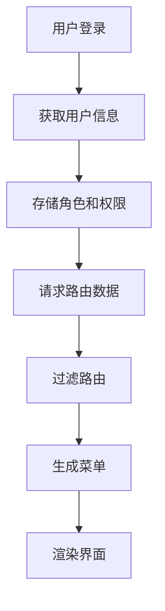
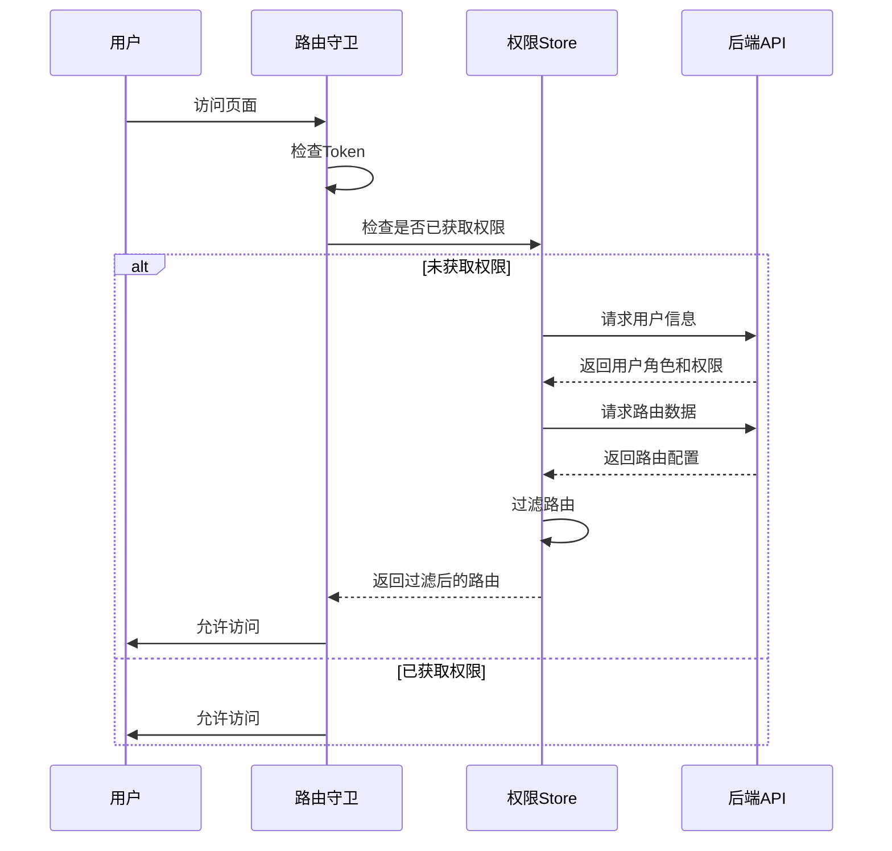
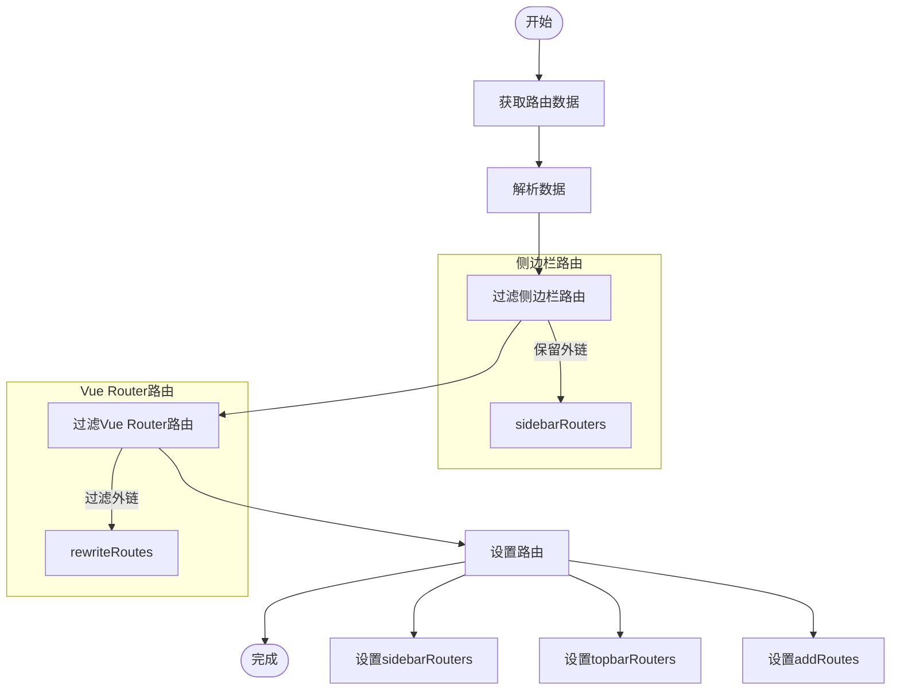
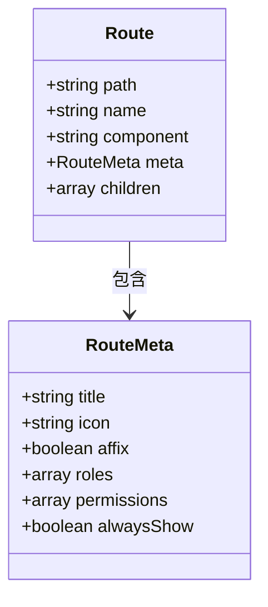
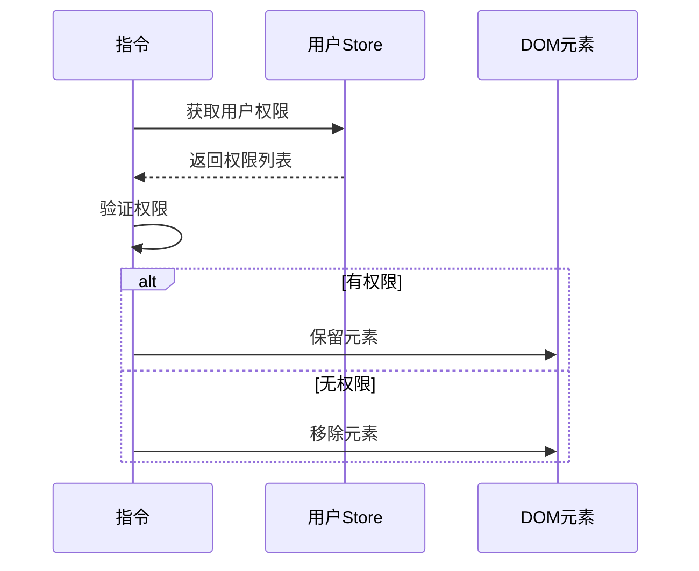
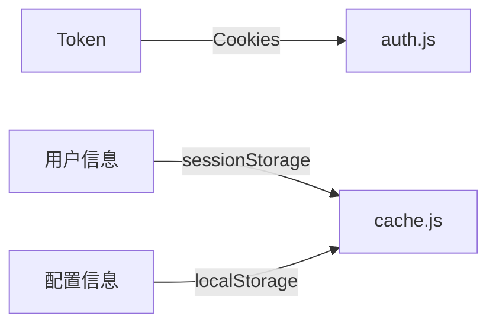
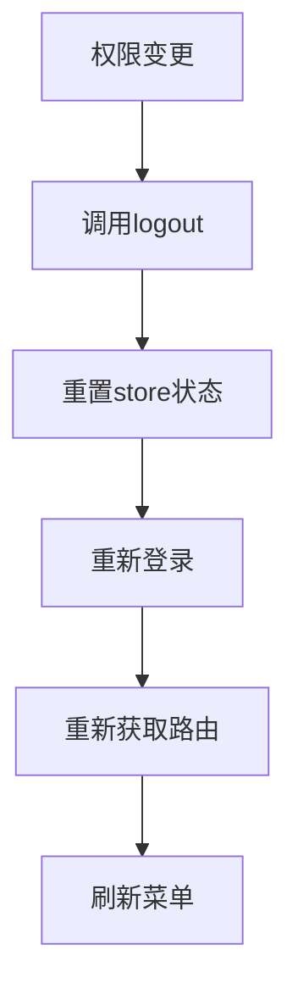

# 菜单权限控制

<cite>
**本文档引用的文件**
- [permission.js](file://bear-jia-vue3\src\stores\permission.js)
- [hasPermi.js](file://bear-jia-vue3\src\directive\permission\hasPermi.js)
- [hasRole.js](file://bear-jia-vue3\src\directive\permission\hasRole.js)
- [auth.js](file://bear-jia-vue3\src\plugins\auth.js)
- [SideMenu.vue](file://bear-jia-vue3\src\components\layout\SideMenu.vue)
- [TopMenu.vue](file://bear-jia-vue3\src\components\layout\TopMenu.vue)
- [vueRouter.js](file://bear-jia-vue3\src\router\vueRouter.js)
- [user.js](file://bear-jia-vue3\src\stores\user.js)
- [menu.js](file://bear-jia-vue3\src\api\system\menu.js)
- [cache.js](file://bear-jia-vue3\src\plugins\cache.js)
</cite>

## 目录
1. [简介](#简介)
2. [核心权限控制机制](#核心权限控制机制)
3. [菜单路由生成过程](#菜单路由生成过程)
4. [sidebarRouters和topbarRouters生成机制](#sidebarrouters和topbarrouters生成机制)
5. [菜单元信息处理](#菜单元信息处理)
6. [UI元素权限控制](#ui元素权限控制)
7. [权限缓存与清理机制](#权限缓存与清理机制)
8. [复杂业务场景最佳实践](#复杂业务场景最佳实践)

## 简介
本系统实现了基于角色和权限的菜单控制机制，通过后端返回的路由数据和用户权限信息，动态生成侧边栏和顶部菜单。系统采用Vue 3和Pinia状态管理，结合Ant Design Vue组件库，实现了灵活的权限控制方案。

## 核心权限控制机制

系统权限控制基于角色（Role）和操作权限（Permission）两个维度，通过前端存储的用户权限信息与路由配置中的权限要求进行匹配，决定菜单项的显示与隐藏。

权限控制主要通过以下组件实现：
- **权限存储**：使用Pinia store存储用户角色和权限
- **权限验证**：通过插件和指令进行权限验证
- **路由过滤**：根据用户权限动态生成路由



**本节来源**
- [user.js](file://bear-jia-vue3\src\stores\user.js#L1-L83)
- [permission.js](file://bear-jia-vue3\src\stores\permission.js#L1-L264)

## 菜单路由生成过程

菜单路由的生成是一个多步骤的过程，从用户登录开始，经过权限验证、路由请求、路由过滤等环节，最终生成可显示的菜单。

### 路由生成流程


### 路由生成关键步骤
1. **Token验证**：检查用户是否已登录
2. **用户信息获取**：从后端获取用户角色和权限
3. **路由数据请求**：获取系统路由配置
4. **路由过滤**：根据用户权限过滤路由
5. **路由注册**：将过滤后的路由添加到Vue Router

**本节来源**
- [vueRouter.js](file://bear-jia-vue3\src\router\vueRouter.js#L1-L130)
- [permission.js](file://bear-jia-vue3\src\stores\permission.js#L234-L263)

## sidebarRouters和topbarRouters生成机制

系统通过`generateRoutes`方法生成`sidebarRouters`和`topbarRouters`，这两个路由集合分别用于侧边栏和顶部菜单的显示。

### 生成过程分析


### 关键函数说明
- `filterAsyncRouterForSidebar`: 过滤侧边栏路由，保留外链
- `filterAsyncRouter`: 过滤Vue Router路由，过滤掉外链
- `filterChildrenForSidebar`: 处理子菜单的路径拼接
- `isExternalLink`: 判断是否为外链

**本节来源**
- [permission.js](file://bear-jia-vue3\src\stores\permission.js#L80-L258)
- [SideMenu.vue](file://bear-jia-vue3\src\components\layout\SideMenu.vue#L1-L386)
- [TopMenu.vue](file://bear-jia-vue3\src\components\layout\TopMenu.vue#L1-L250)

## 菜单元信息处理

菜单的元信息包括图标、标题、路径等，这些信息在路由配置中定义，并在菜单组件中进行处理和显示。

### 元信息结构


### 图标处理
系统使用`BearJiaIcon`组件处理图标显示，支持Ant Design Vue图标库。图标信息从路由的`meta.icon`字段获取。

### 标题处理
菜单标题从路由的`meta.title`字段获取，支持国际化。系统在菜单组件中直接使用该字段进行显示。

**本节来源**
- [SideMenu.vue](file://bear-jia-vue3\src\components\layout\SideMenu.vue#L42-L45)
- [TopMenu.vue](file://bear-jia-vue3\src\components\layout\TopMenu.vue#L27-L29)
- [permission.js](file://bear-jia-vue3\src\stores\permission.js#L10-L15)

## UI元素权限控制

除了菜单级别的权限控制，系统还实现了UI元素级别的权限控制，特别是表格组件中的按钮显示控制。

### 权限指令
系统提供了两个权限指令：
- `v-hasPermi`: 基于操作权限的控制
- `v-hasRole`: 基于角色的控制



### 指令实现
```javascript
// hasPermi.js 核心逻辑
mounted(el, binding) {
    const { value } = binding;
    const all_permission = "*:*:*";
    const permissions = useUserStore().permissions;
    
    if (!value || (value instanceof Array && value.length === 0)) {
        return; // 无权限值，显示
    }
    
    const hasPermissions = permissions.some(permission => {
        return all_permission === permission || permissionFlag.includes(permission);
    });
    
    if (!hasPermissions) {
        el.parentNode && el.parentNode.removeChild(el); // 移除无权限的元素
    }
}
```

**本节来源**
- [hasPermi.js](file://bear-jia-vue3\src\directive\permission\hasPermi.js#L1-L35)
- [hasRole.js](file://bear-jia-vue3\src\directive\permission\hasRole.js#L1-L29)
- [auth.js](file://bear-jia-vue3\src\plugins\auth.js#L1-L61)

## 权限缓存与清理机制

系统实现了完整的权限缓存和清理机制，确保用户权限信息的安全性和一致性。

### 缓存机制
系统使用多种方式缓存权限信息：
- **Token缓存**：使用Cookies存储认证Token
- **会话缓存**：使用sessionStorage存储临时数据
- **本地缓存**：使用localStorage存储持久化数据



### 清理策略
当用户登出或权限变更时，系统会执行以下清理操作：
1. **清除Token**：从Cookies中移除认证Token
2. **重置状态**：将Pinia store中的用户信息重置为空
3. **清除缓存**：清理sessionStorage和localStorage中的相关数据

```javascript
// user.js 中的登出逻辑
async logout() {
    try {
        await logout(); // 调用后端登出接口
        this.token = '';
        this.roles = [];
        this.permissions = [];
        removeToken(); // 清除Token
    } catch (error) {
        throw error;
    }
}
```

**本节来源**
- [auth.js](file://bear-jia-vue3\src\utils\auth.js#L1-L16)
- [user.js](file://bear-jia-vue3\src\stores\user.js#L65-L74)
- [cache.js](file://bear-jia-vue3\src\plugins\cache.js#L1-L78)

## 复杂业务场景最佳实践

在复杂业务场景下，菜单权限控制需要考虑更多因素，以下是一些最佳实践建议。

### 动态权限更新
当用户权限在会话期间发生变化时，应重新获取路由数据并刷新菜单。



### 外链处理
对于外链菜单项，系统需要特殊处理：
- 在侧边栏中显示外链图标
- 点击外链时在新窗口打开
- 不将外链添加到Vue Router中

### 性能优化
- **路由懒加载**：使用`import()`语法实现路由组件的懒加载
- **权限缓存**：缓存用户权限信息，避免重复请求
- **批量操作**：批量添加路由，减少Vue Router的更新次数

### 错误处理
- **路由丢失处理**：当访问的路由不存在时，重新生成路由
- **权限验证失败**：提供友好的错误提示
- **网络异常处理**：在网络异常时提供降级方案

**本节来源**
- [permission.js](file://bear-jia-vue3\src\stores\permission.js#L68-L86)
- [vueRouter.js](file://bear-jia-vue3\src\router\vueRouter.js#L69-L86)
- [SideMenu.vue](file://bear-jia-vue3\src\components\layout\SideMenu.vue#L163-L166)