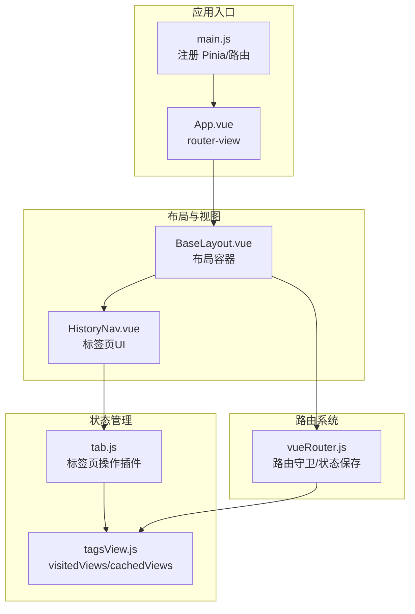
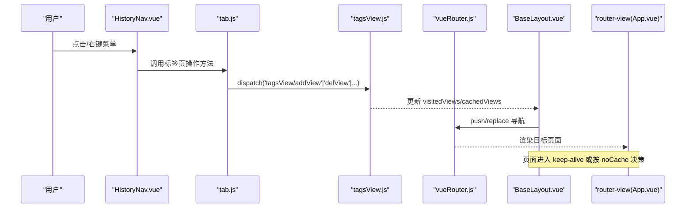
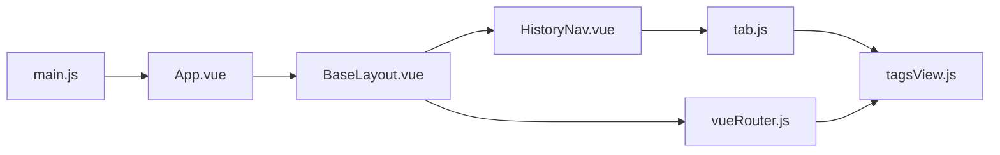

# 标签页状态管理

<cite>
**本文引用的文件**
- [tagsView.js](file://bear-jia-vue3/src/stores/tabsView.js)
- [tab.js](file://bear-jia-vue3/src/plugins/tab.js)
- [BaseLayout.vue](file://bear-jia-vue3/src/layout/BaseLayout.vue)
- [HistoryNav.vue](file://bear-jia-vue3/src/components/layout/HistoryNav.vue)
- [vueRouter.js](file://bear-jia-vue3/src/router/vueRouter.js)
- [main.js](file://bear-jia-vue3/src/main.js)
- [HeaderBar.vue](file://bear-jia-vue3/src/components/layout/HeaderBar.vue)
- [App.vue](file://bear-jia-vue3/src/App.vue)
</cite>

## 目录
1. [简介](#简介)
2. [项目结构](#项目结构)
3. [核心组件](#核心组件)
4. [架构总览](#架构总览)
5. [详细组件分析](#详细组件分析)
6. [依赖关系分析](#依赖关系分析)
7. [性能考量](#性能考量)
8. [故障排查指南](#故障排查指南)
9. [结论](#结论)
10. [附录](#附录)

## 简介
本文件围绕标签页状态管理展开，重点解析基于 Pinia 的 tagsView store 如何实现多标签页的添加、关闭（单个、其他、全部）、定位与缓存策略，并说明其与 keep-alive 的协同机制、持久化方案、特殊标签（首页、固定标签）处理规则，以及与路由系统的集成方式。同时提供 API 使用示例的代码片段路径指引，帮助读者快速上手。

## 项目结构
标签页状态管理涉及以下关键模块：
- store 层：tagsView store 负责维护已访问标签与缓存标签集合
- 插件层：tab 插件封装常用标签页操作（刷新、关闭、打开等）
- 视图层：HistoryNav 组件负责标签页 UI 与交互；BaseLayout 作为布局容器承载标签页与路由视图
- 路由层：vueRouter.js 提供路由守卫与页面状态保存/恢复能力
- 应用入口：main.js 注册 Pinia 与路由，App.vue 渲染 router-view

图表来源
- [main.js](file://bear-jia-vue3/src/main.js#L1-L62)
- [App.vue](file://bear-jia-vue3/src/App.vue#L1-L5)
- [BaseLayout.vue](file://bear-jia-vue3/src/layout/BaseLayout.vue#L1-L120)
- [HistoryNav.vue](file://bear-jia-vue3/src/components/layout/HistoryNav.vue#L1-L120)
- [tagsView.js](file://bear-jia-vue3/src/stores/tabsView.js#L1-L106)
- [tab.js](file://bear-jia-vue3/src/plugins/tab.js#L1-L69)
- [vueRouter.js](file://bear-jia-vue3/src/router/vueRouter.js#L1-L130)

章节来源
- [main.js](file://bear-jia-vue3/src/main.js#L1-L62)
- [App.vue](file://bear-jia-vue3/src/App.vue#L1-L5)

## 核心组件
- tagsView store：维护 visitedViews 与 cachedViews，提供增删改查与批量清理操作
- tab 插件：封装刷新、关闭、打开、更新等常用标签页操作
- HistoryNav 组件：渲染标签页 UI、处理点击/关闭、上下文菜单、滚动与定位
- BaseLayout：布局容器，承载 HistoryNav 与 router-view
- vueRouter：路由守卫与页面状态保存/恢复

章节来源
- [tagsView.js](file://bear-jia-vue3/src/stores/tabsView.js#L1-L106)
- [tab.js](file://bear-jia-vue3/src/plugins/tab.js#L1-L69)
- [HistoryNav.vue](file://bear-jia-vue3/src/components/layout/HistoryNav.vue#L1-L120)
- [BaseLayout.vue](file://bear-jia-vue3/src/layout/BaseLayout.vue#L1-L120)
- [vueRouter.js](file://bear-jia-vue3/src/router/vueRouter.js#L1-L130)

## 架构总览
标签页状态管理的关键流程如下：
- 路由跳转触发标签页添加与缓存策略决策
- 用户在 HistoryNav 中进行标签页操作（打开、关闭、刷新、定位）
- tab 插件将操作映射为对 tagsView store 的动作分发
- 页面状态通过路由守卫与 sessionStorage 保存/恢复
- keep-alive 与 noCache 控制页面缓存行为

图表来源
- [HistoryNav.vue](file://bear-jia-vue3/src/components/layout/HistoryNav.vue#L1-L120)
- [tab.js](file://bear-jia-vue3/src/plugins/tab.js#L1-L69)
- [tagsView.js](file://bear-jia-vue3/src/stores/tabsView.js#L1-L106)
- [vueRouter.js](file://bear-jia-vue3/src/router/vueRouter.js#L1-L130)
- [BaseLayout.vue](file://bear-jia-vue3/src/layout/BaseLayout.vue#L1-L120)
- [App.vue](file://bear-jia-vue3/src/App.vue#L1-L5)

## 详细组件分析

### tagsView store：多标签页状态
- 数据结构
  - visitedViews：记录已访问的路由元信息（含标题、路径等）
  - cachedViews：记录需要被 keep-alive 缓存的组件名称
- 关键动作
  - addView：同时添加到 visitedViews 与 cachedViews
  - addVisitedView：去重后加入 visitedViews，标题取自 meta.title
  - addCachedView：若未设置 noCache，则加入 cachedViews
  - delView：删除 visited 与 cached，并返回最新状态
  - delVisitedView/delCachedView：按路径/名称删除对应项
  - delOthersViews：仅保留固定标签与当前标签
  - delAllViews：清空 visited 并保留固定标签；清空 cached
  - updateVisitedView：按路径更新 visited 标签元信息
- 特殊标签处理
  - 通过 meta.affix 标记固定标签，清理时保留
  - 首页工作台路径为 '/home/workbench'，在 HistoryNav 中作为特殊处理

章节来源
- [tagsView.js](file://bear-jia-vue3/src/stores/tabsView.js#L1-L106)

### tab 插件：标签页操作 API
- 常用操作
  - 刷新当前页：删除缓存并以 redirect 方式强制刷新
  - 关闭当前/指定页：删除对应标签并回退或跳转
  - 关闭其他/全部：批量清理 visited 与 cached
  - 打开新页：添加标签并导航
  - 更新标题：更新 visited 标签的标题
- 注意事项
  - 插件内部通过 store.dispatch 调用 tagsView 动作
  - 路由跳转使用 router.push/replace

章节来源
- [tab.js](file://bear-jia-vue3/src/plugins/tab.js#L1-L69)

### HistoryNav：标签页 UI 与交互
- 标签渲染
  - 基于 historyList 渲染，支持左右滚动与定位
  - 右键菜单提供刷新、关闭、关闭其他、关闭全部
- 关闭规则
  - 不允许关闭首页工作台标签
  - 删除当前标签时自动跳转到相邻标签
- 持久化
  - 使用 localStorage 保存历史列表，限制最大长度
- 滚动与定位
  - 监听滚动与窗口尺寸变化，动态显示左右按钮
  - 激活标签滚动至可视区域中央

章节来源
- [HistoryNav.vue](file://bear-jia-vue3/src/components/layout/HistoryNav.vue#L1-L200)
- [HistoryNav.vue](file://bear-jia-vue3/src/components/layout/HistoryNav.vue#L200-L400)
- [HistoryNav.vue](file://bear-jia-vue3/src/components/layout/HistoryNav.vue#L400-L548)

### BaseLayout：布局容器与页面刷新
- 与 HistoryNav 协同
  - 在 HeaderBar 触发刷新时，根据页面是否配置 keepAlive=false 决定重新加载数据或通过查询参数刷新
- 页面状态恢复
  - 结合 vueRouter.js 的页面状态保存/恢复逻辑，恢复滚动位置

章节来源
- [BaseLayout.vue](file://bear-jia-vue3/src/layout/BaseLayout.vue#L1000-L1040)
- [HeaderBar.vue](file://bear-jia-vue3/src/components/layout/HeaderBar.vue#L90-L110)

### 路由系统：导航与页面状态
- 路由守卫
  - 白名单放行；鉴权失败重定向登录
  - 动态路由生成后再次尝试导航
- 页面状态保存/恢复
  - before/afterEach 中保存/恢复滚动位置
  - 通过 sessionStorage 存储每个页面的滚动位置

章节来源
- [vueRouter.js](file://bear-jia-vue3/src/router/vueRouter.js#L1-L130)

## 依赖关系分析
- 组件耦合
  - HistoryNav 依赖 tagsView store 的 visited/cached 状态
  - tab 插件依赖 tagsView store 的动作分发
  - BaseLayout 与 HeaderBar 通过事件与路由联动
- 外部依赖
  - Pinia：状态管理
  - Vue Router：路由与导航
  - Ant Design Vue：UI 组件库

图表来源
- [HistoryNav.vue](file://bear-jia-vue3/src/components/layout/HistoryNav.vue#L1-L120)
- [tab.js](file://bear-jia-vue3/src/plugins/tab.js#L1-L69)
- [tagsView.js](file://bear-jia-vue3/src/stores/tabsView.js#L1-L106)
- [BaseLayout.vue](file://bear-jia-vue3/src/layout/BaseLayout.vue#L1-L120)
- [vueRouter.js](file://bear-jia-vue3/src/router/vueRouter.js#L1-L130)
- [main.js](file://bear-jia-vue3/src/main.js#L1-L62)
- [App.vue](file://bear-jia-vue3/src/App.vue#L1-L5)

## 性能考量
- 标签页数量控制
  - HistoryNav 对历史列表进行上限控制，避免无限增长
- 滚动优化
  - 使用平滑滚动与可视区域定位，减少重排
- 页面状态保存
  - 通过 sessionStorage 保存滚动位置，避免频繁重算
- keep-alive 与 noCache
  - cachedViews 与 noCache 决定页面是否缓存，避免不必要的重建
- 大量标签页场景建议
  - 可采用虚拟滚动或分页显示（当前实现为线性列表+左右滚动，可扩展）
  - 限制最大标签数并提供“关闭其他”快捷清理

章节来源
- [HistoryNav.vue](file://bear-jia-vue3/src/components/layout/HistoryNav.vue#L1-L200)
- [tagsView.js](file://bear-jia-vue3/src/stores/tabsView.js#L1-L106)
- [vueRouter.js](file://bear-jia-vue3/src/router/vueRouter.js#L1-L130)

## 故障排查指南
- 标签页无法关闭
  - 首页工作台标签不可关闭，这是预期行为
  - 检查 HistoryNav 的关闭逻辑与条件判断
- 标签页标题异常
  - 标题来源于 meta.title 或菜单树查找，若菜单未加载完成会显示“加载中...”
- 刷新无效
  - 若页面配置 keepAlive=false，需通过重新加载数据而非刷新缓存
- 路由跳转后标签页未更新
  - 确认路由守卫是否正确生成动态路由并再次尝试导航
- 页面滚动位置未恢复
  - 检查 sessionStorage 中是否存在对应页面的状态记录

章节来源
- [HistoryNav.vue](file://bear-jia-vue3/src/components/layout/HistoryNav.vue#L1-L200)
- [BaseLayout.vue](file://bear-jia-vue3/src/layout/BaseLayout.vue#L1000-L1040)
- [vueRouter.js](file://bear-jia-vue3/src/router/vueRouter.js#L1-L130)

## 结论
该标签页状态管理方案以 Pinia store 为核心，结合插件化的操作封装、UI 层的交互与路由层的状态保存，实现了稳定的多标签页体验。通过 affix 固定标签、noCache 缓存策略与 keep-alive 协同，兼顾了性能与用户体验。对于大量标签页场景，建议进一步引入虚拟滚动或分页显示以提升交互流畅度。

## 附录

### 标签页操作 API 使用示例（代码片段路径）
- 刷新当前标签页
  - [tab.js](file://bear-jia-vue3/src/plugins/tab.js#L1-L30)
- 关闭当前标签页
  - [tab.js](file://bear-jia-vue3/src/plugins/tab.js#L30-L45)
- 关闭其他标签页
  - [tab.js](file://bear-jia-vue3/src/plugins/tab.js#L50-L60)
- 关闭全部标签页
  - [tab.js](file://bear-jia-vue3/src/plugins/tab.js#L42-L45)
- 打开新标签页
  - [tab.js](file://bear-jia-vue3/src/plugins/tab.js#L58-L63)
- 更新标签标题
  - [tab.js](file://bear-jia-vue3/src/plugins/tab.js#L64-L69)

### 标签页缓存策略与 keep-alive 协同
- cachedViews 与 noCache
  - cachedViews 记录需要缓存的组件名；若路由元信息设置 noCache，则不缓存
- 页面刷新策略
  - 若页面配置 keepAlive=false，则通过重新加载数据的方式刷新
  - 否则通过修改查询参数触发页面刷新
- 页面状态恢复
  - 路由守卫在 afterEach 中恢复滚动位置

章节来源
- [tagsView.js](file://bear-jia-vue3/src/stores/tabsView.js#L1-L106)
- [BaseLayout.vue](file://bear-jia-vue3/src/layout/BaseLayout.vue#L1000-L1040)
- [vueRouter.js](file://bear-jia-vue3/src/router/vueRouter.js#L1-L130)

### 特殊标签处理规则
- 固定标签（affix）
  - 在清理 visited 与 cached 时保留
- 首页工作台
  - 路径为 '/home/workbench'，在 HistoryNav 中作为特殊处理，不可关闭
  - 初始化时默认存在，后续页面按顺序插入

章节来源
- [tagsView.js](file://bear-jia-vue3/src/stores/tabsView.js#L1-L106)
- [HistoryNav.vue](file://bear-jia-vue3/src/components/layout/HistoryNav.vue#L1-L200)

### 标签页与路由系统的集成
- 路由守卫
  - 登录态校验、动态路由生成、导航失败重定向
- 页面状态保存/恢复
  - beforeEach 保存 from 页面状态，afterEach 恢复 to 页面状态
- 标签页联动
  - HistoryNav 监听路由变化，自动更新激活标签与历史列表

章节来源
- [vueRouter.js](file://bear-jia-vue3/src/router/vueRouter.js#L1-L130)
- [HistoryNav.vue](file://bear-jia-vue3/src/components/layout/HistoryNav.vue#L200-L400)