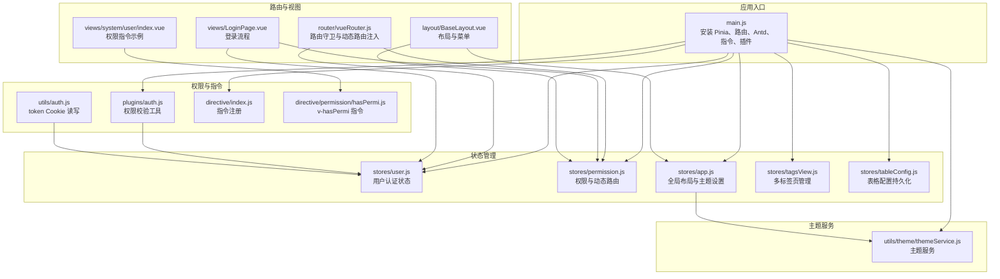
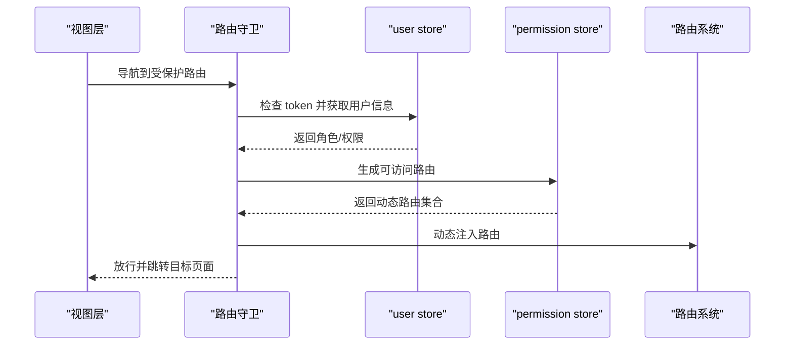
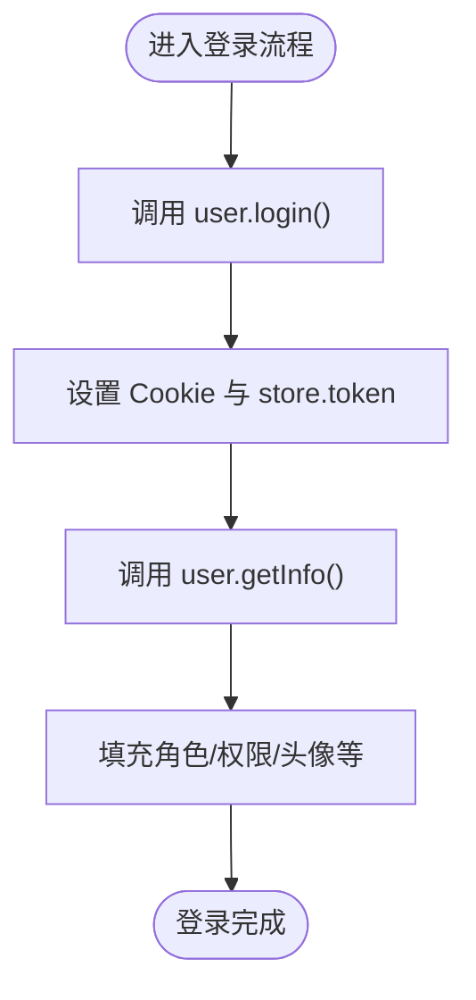
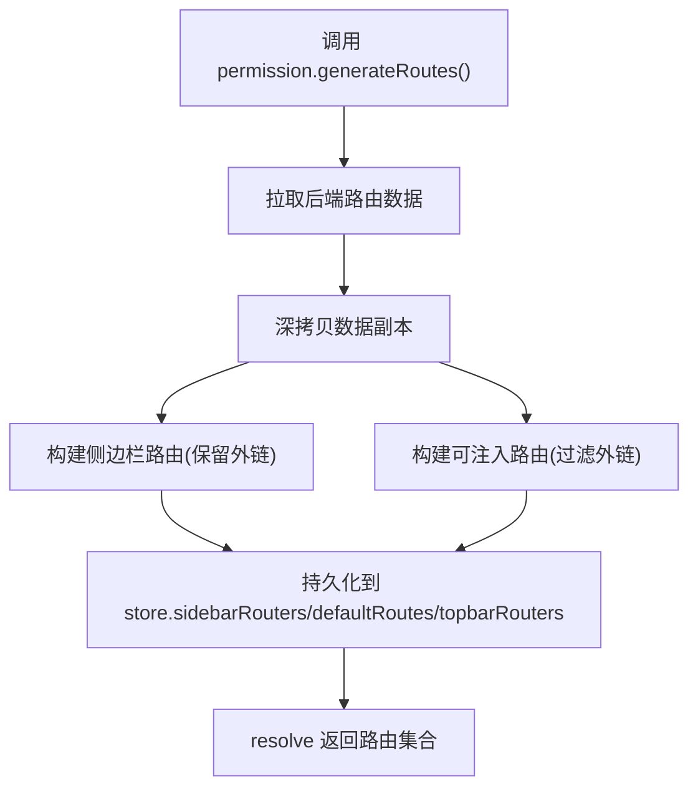
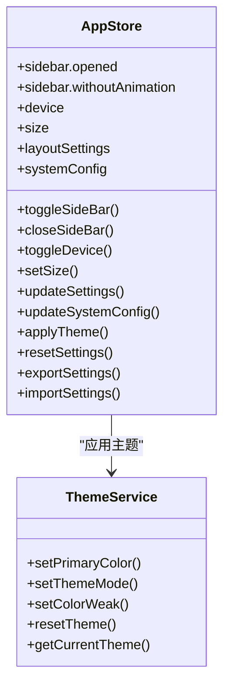
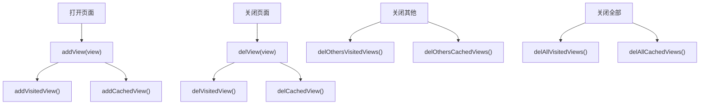
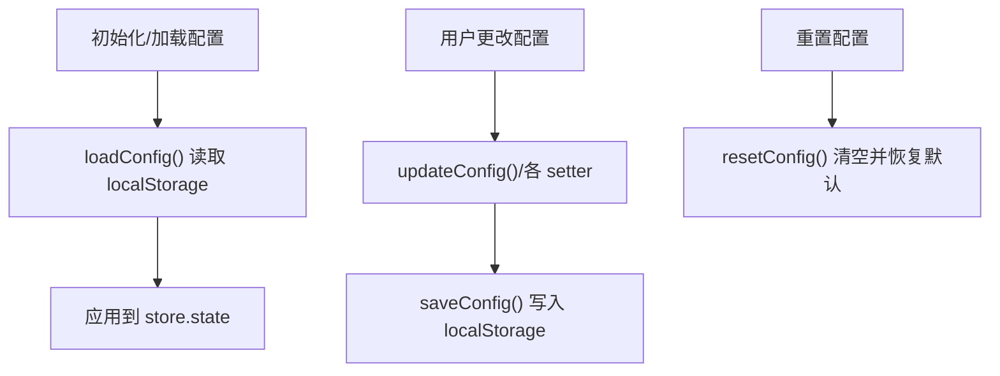
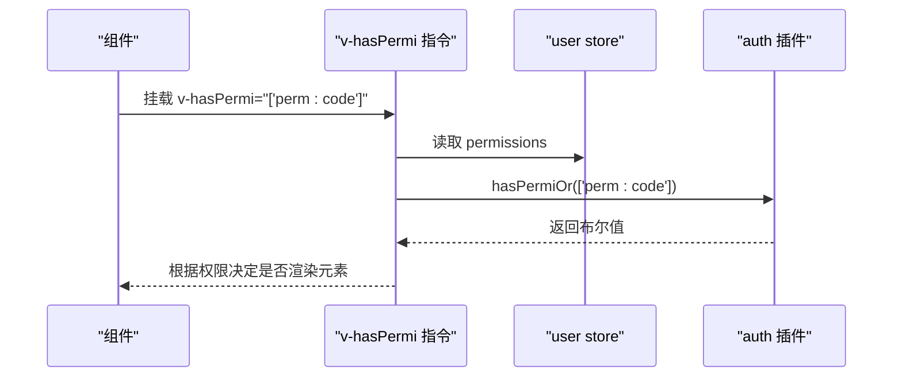
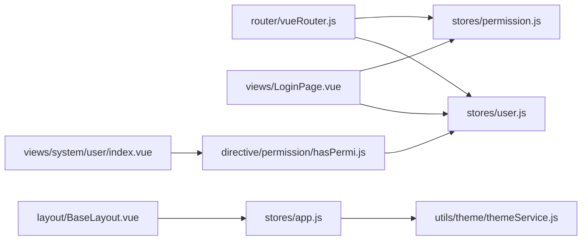

# 状态管理

<cite>
**本文引用的文件**
- [main.js](file://bear-jia-vue3/src/main.js)
- [user.js](file://bear-jia-vue3/src/stores/user.js)
- [permission.js](file://bear-jia-vue3/src/stores/permission.js)
- [app.js](file://bear-jia-vue3/src/stores/app.js)
- [tagsView.js](file://bear-jia-vue3/src/stores/tagsView.js)
- [tableConfig.js](file://bear-jia-vue3/src/stores/tableConfig.js)
- [auth.js](file://bear-jia-vue3/src/plugins/auth.js)
- [hasPermi.js](file://bear-jia-vue3/src/directive/permission/hasPermi.js)
- [auth.js](file://bear-jia-vue3/src/utils/auth.js)
- [vueRouter.js](file://bear-jia-vue3/src/router/vueRouter.js)
- [index.js](file://bear-jia-vue3/src/directive/index.js)
- [themeService.js](file://bear-jia-vue3/src/utils/theme/themeService.js)
- [LoginPage.vue](file://bear-jia-vue3/src/views/LoginPage.vue)
- [BaseLayout.vue](file://bear-jia-vue3/src/layout/BaseLayout.vue)
- [index.vue](file://bear-jia-vue3/src/views/system/user/index.vue)
</cite>

## 目录
1. [引言](#引言)
2. [项目结构](#项目结构)
3. [核心组件](#核心组件)
4. [架构总览](#架构总览)
5. [详细组件分析](#详细组件分析)
6. [依赖关系分析](#依赖关系分析)
7. [性能考量](#性能考量)
8. [故障排查指南](#故障排查指南)
9. [结论](#结论)
10. [附录](#附录)

## 引言
本文件聚焦于项目中基于 Pinia 的状态管理实践，系统性解析以下 Store 的职责与实现：
- user store：用户认证状态管理（token 存储、用户信息持久化、登出机制）
- permission store：权限控制与动态路由生成（角色权限验证、菜单动态生成）
- app store：全局应用状态（侧边栏展开状态、主题模式、布局设置等）
- tagsView store：多标签页管理（标签添加、关闭、缓存策略）
- tableConfig store：表格配置持久化（表格样式、分页、本地存储）

同时结合 auth 插件与 hasPermi 指令，说明状态管理与权限控制的集成方式，并提供状态流图以展示状态变更的触发与响应过程。

## 项目结构
Pinia Store 位于 src/stores 目录下，配合路由守卫、指令与插件共同完成认证、权限与界面状态的统一管理。应用入口通过 main.js 安装 Pinia 并挂载全局插件与指令。

图表来源
- [main.js](file://bear-jia-vue3/src/main.js#L1-L62)
- [user.js](file://bear-jia-vue3/src/stores/user.js#L1-L83)
- [permission.js](file://bear-jia-vue3/src/stores/permission.js#L1-L264)
- [app.js](file://bear-jia-vue3/src/stores/app.js#L1-L180)
- [tagsView.js](file://bear-jia-vue3/src/stores/tabsView.js#L1-L106)
- [tableConfig.js](file://bear-jia-vue3/src/stores/tableConfig.js#L1-L154)
- [auth.js](file://bear-jia-vue3/src/plugins/auth.js#L1-L61)
- [hasPermi.js](file://bear-jia-vue3/src/directive/permission/hasPermi.js#L1-L35)
- [auth.js](file://bear-jia-vue3/src/utils/auth.js#L1-L16)
- [vueRouter.js](file://bear-jia-vue3/src/router/vueRouter.js#L1-L130)
- [LoginPage.vue](file://bear-jia-vue3/src/views/LoginPage.vue#L1-L200)
- [BaseLayout.vue](file://bear-jia-vue3/src/layout/BaseLayout.vue#L1-L200)
- [index.vue](file://bear-jia-vue3/src/views/system/user/index.vue#L1-L200)
- [themeService.js](file://bear-jia-vue3/src/utils/theme/themeService.js#L1-L558)

章节来源
- [main.js](file://bear-jia-vue3/src/main.js#L1-L62)

## 核心组件
- user store：负责 token、用户角色与权限集合的读取与清理；提供登录、获取用户信息、退出系统与前端登出动作。
- permission store：负责从后端拉取路由数据，过滤生成可访问路由，维护默认路由、顶部与侧边栏路由集合。
- app store：负责侧边栏开关、设备类型、尺寸、布局设置与系统配置的持久化与应用。
- tagsView store：负责记录已访问路由与缓存组件名，支持关闭当前、关闭其他、关闭全部、更新访问记录等。
- tableConfig store：负责表格与分页配置的默认值、更新、重置、本地持久化与导出/导入。

章节来源
- [user.js](file://bear-jia-vue3/src/stores/user.js#L1-L83)
- [permission.js](file://bear-jia-vue3/src/stores/permission.js#L1-L264)
- [app.js](file://bear-jia-vue3/src/stores/app.js#L1-L180)
- [tagsView.js](file://bear-jia-vue3/src/stores/tabsView.js#L1-L106)
- [tableConfig.js](file://bear-jia-vue3/src/stores/tableConfig.js#L1-L154)

## 架构总览
Pinia 在应用启动时被安装，随后在路由守卫中按需加载用户信息与动态路由；权限校验通过 auth 插件与指令完成；UI 层通过 app store 控制布局与主题，通过 tagsView 与 tableConfig 提升用户体验与一致性。

图表来源
- [vueRouter.js](file://bear-jia-vue3/src/router/vueRouter.js#L37-L99)
- [user.js](file://bear-jia-vue3/src/stores/user.js#L48-L82)
- [permission.js](file://bear-jia-vue3/src/stores/permission.js#L234-L261)

## 详细组件分析

### user store：认证与用户信息
- 状态字段：token、用户名、头像、角色、权限、昵称、登录时间与IP等。
- getters：提供 userInfo 兼容对象，便于下游组件使用。
- actions：
  - login：调用后端登录接口，设置 token 到 Cookie 并同步到 store。
  - getInfo：拉取用户信息并填充 store 字段。
  - logout：调用后端登出接口，清空 store 中的角色与权限，移除 token。
  - fedLogout：仅前端登出，清空 store 与 token，不调用后端。

图表来源
- [user.js](file://bear-jia-vue3/src/stores/user.js#L32-L82)
- [auth.js](file://bear-jia-vue3/src/utils/auth.js#L1-L16)

章节来源
- [user.js](file://bear-jia-vue3/src/stores/user.js#L1-L83)
- [auth.js](file://bear-jia-vue3/src/utils/auth.js#L1-L16)

### permission store：权限控制与动态路由
- 角色权限验证：hasPermission 与 filterAsyncRoutes 递归过滤异步路由。
- 动态路由生成：filterAsyncRouter/filterAsyncRouterForSidebar 负责组件懒加载与外链处理；filterChildren/filterChildrenForSidebar 处理父子路径拼接与外链跳过。
- 权限过滤：filterDynamicRoutes 支持按 permissions 或 roles 进行校验。
- 生成流程：generateRoutes 拉取后端路由数据，分别生成 rewriteRoutes、sidebarRoutes、defaultRoutes、topbarRouters，并持久化到 store。

图表来源
- [permission.js](file://bear-jia-vue3/src/stores/permission.js#L193-L261)

章节来源
- [permission.js](file://bear-jia-vue3/src/stores/permission.js#L1-L264)

### app store：全局应用状态
- 侧边栏：opened 与 withoutAnimation，通过 Cookie 持久化 opened 状态。
- 设备与尺寸：device 与 size，size 通过 Cookie 持久化。
- 布局设置：layoutSettings 包含主题色、暗色模式、导航模式、布局、内容宽度、固定头/侧栏、分割菜单、色弱模式、多标签、隐藏页脚、表格条纹、表格表头显示等，均通过 localStorage 持久化。
- 系统配置：systemConfig 包含标题、Logo、版权、版本、描述、关键词等，支持持久化与页面标题更新。
- 主题应用：通过 themeService 统一管理主题色、模式与色弱模式，并在更新设置时应用主题。

图表来源
- [app.js](file://bear-jia-vue3/src/stores/app.js#L1-L180)
- [themeService.js](file://bear-jia-vue3/src/utils/theme/themeService.js#L1-L558)

章节来源
- [app.js](file://bear-jia-vue3/src/stores/app.js#L1-L180)
- [themeService.js](file://bear-jia-vue3/src/utils/theme/themeService.js#L1-L558)

### tagsView store：多标签页管理
- visitedViews：记录已访问路由，标题来自 meta.title 或默认值。
- cachedViews：记录需要缓存的组件名，受 noCache 控制。
- 支持的操作：addView/addVisitedView/addCachedView、delView/delVisitedView/delCachedView、delOthersViews、delAllViews、updateVisitedView。

图表来源
- [tagsView.js](file://bear-jia-vue3/src/stores/tabsView.js#L1-L106)

章节来源
- [tagsView.js](file://bear-jia-vue3/src/stores/tabsView.js#L1-L106)

### tableConfig store：表格配置持久化
- 默认配置：size、bordered、loading、tableHeight、showHeader、headerBold、stripe、headerBgColor、fixHeader、resizable、rowSelection、pageSize、pageSizeOptions、pagination 等。
- 操作：updateConfig、setSize、setBordered、setTableHeight、setShowHeader、setRowSelection、updatePagination、resetConfig、loadConfig、saveConfig、getTableProps、getPaginationProps。
- 持久化：saveConfig/loadConfig 通过 localStorage 存取 $state。

图表来源
- [tableConfig.js](file://bear-jia-vue3/src/stores/tableConfig.js#L1-L154)

章节来源
- [tableConfig.js](file://bear-jia-vue3/src/stores/tableConfig.js#L1-L154)

### 权限控制集成：auth 插件与 hasPermi 指令
- auth 插件：封装 hasPermi/hasRole 等权限校验方法，基于 store.getters.permissions/roles 进行匹配。
- hasPermi 指令：在 mounted 钩子中读取当前用户权限，若指令值为空或不合法则抛错；否则根据权限数组决定是否移除元素。
- 在视图中使用：例如系统用户列表页对“新增/删除/导出”按钮使用 v-hasPermi 指令，实现细粒度可见性控制。

图表来源
- [hasPermi.js](file://bear-jia-vue3/src/directive/permission/hasPermi.js#L1-L35)
- [auth.js](file://bear-jia-vue3/src/plugins/auth.js#L1-L61)
- [user.js](file://bear-jia-vue3/src/stores/user.js#L1-L83)

章节来源
- [hasPermi.js](file://bear-jia-vue3/src/directive/permission/hasPermi.js#L1-L35)
- [auth.js](file://bear-jia-vue3/src/plugins/auth.js#L1-L61)
- [index.vue](file://bear-jia-vue3/src/views/system/user/index.vue#L1-L200)

## 依赖关系分析
- 路由守卫依赖 user 与 permission store：在首次进入受保护路由时，先获取用户信息并生成动态路由，再放行。
- 登录页依赖 user 与 permission store：提交登录后获取用户信息并生成路由，然后跳转工作台。
- 布局组件依赖 app store：根据 layoutSettings 决定侧边栏、顶部菜单、混合布局等。
- 指令依赖 user store：读取 permissions 进行权限判定。
- 主题服务依赖 app store 的 layoutSettings：在更新设置时应用主题。

图表来源
- [vueRouter.js](file://bear-jia-vue3/src/router/vueRouter.js#L1-L130)
- [LoginPage.vue](file://bear-jia-vue3/src/views/LoginPage.vue#L1-L200)
- [BaseLayout.vue](file://bear-jia-vue3/src/layout/BaseLayout.vue#L1-L200)
- [index.vue](file://bear-jia-vue3/src/views/system/user/index.vue#L1-L200)
- [hasPermi.js](file://bear-jia-vue3/src/directive/permission/hasPermi.js#L1-L35)
- [app.js](file://bear-jia-vue3/src/stores/app.js#L1-L180)
- [themeService.js](file://bear-jia-vue3/src/utils/theme/themeService.js#L1-L558)

章节来源
- [vueRouter.js](file://bear-jia-vue3/src/router/vueRouter.js#L1-L130)
- [LoginPage.vue](file://bear-jia-vue3/src/views/LoginPage.vue#L1-L200)
- [BaseLayout.vue](file://bear-jia-vue3/src/layout/BaseLayout.vue#L1-L200)
- [index.vue](file://bear-jia-vue3/src/views/system/user/index.vue#L1-L200)
- [hasPermi.js](file://bear-jia-vue3/src/directive/permission/hasPermi.js#L1-L35)
- [app.js](file://bear-jia-vue3/src/stores/app.js#L1-L180)
- [themeService.js](file://bear-jia-vue3/src/utils/theme/themeService.js#L1-L558)

## 性能考量
- 动态路由懒加载：通过 import.meta.glob 预加载视图组件，减少首屏路由注入时的等待。
- 外链路由处理：在生成侧边栏与注入路由时分别过滤外链，避免无效路由注入导致的错误。
- 本地持久化：侧边栏状态、尺寸、布局设置、表格配置均使用 Cookie/localStorage，减少后端请求与初始化开销。
- 主题服务：集中管理主题色、模式与色弱模式，避免重复计算与样式冲突。

## 故障排查指南
- 登录后无法进入受保护页面
  - 检查路由守卫是否正确获取用户信息与生成动态路由。
  - 确认 token 是否写入 Cookie 且未过期。
  - 参考路径：[vueRouter.js](file://bear-jia-vue3/src/router/vueRouter.js#L37-L99)、[auth.js](file://bear-jia-vue3/src/utils/auth.js#L1-L16)
- 权限按钮不显示
  - 检查 v-hasPermi 指令绑定值是否正确，确认 user.store.permissions 是否包含对应权限。
  - 参考路径：[hasPermi.js](file://bear-jia-vue3/src/directive/permission/hasPermi.js#L1-L35)、[auth.js](file://bear-jia-vue3/src/plugins/auth.js#L1-L61)
- 主题切换无效
  - 确认 app.store.updateSettings 是否正确调用 themeService.applyTheme。
  - 参考路径：[app.js](file://bear-jia-vue3/src/stores/app.js#L66-L118)、[themeService.js](file://bear-jia-vue3/src/utils/theme/themeService.js#L131-L160)
- 表格配置未持久化
  - 确认 saveConfig/loadConfig 是否被调用，localStorage 中是否存在 table-config。
  - 参考路径：[tableConfig.js](file://bear-jia-vue3/src/stores/tableConfig.js#L108-L123)

章节来源
- [vueRouter.js](file://bear-jia-vue3/src/router/vueRouter.js#L37-L99)
- [auth.js](file://bear-jia-vue3/src/utils/auth.js#L1-L16)
- [hasPermi.js](file://bear-jia-vue3/src/directive/permission/hasPermi.js#L1-L35)
- [auth.js](file://bear-jia-vue3/src/plugins/auth.js#L1-L61)
- [app.js](file://bear-jia-vue3/src/stores/app.js#L66-L118)
- [themeService.js](file://bear-jia-vue3/src/utils/theme/themeService.js#L131-L160)
- [tableConfig.js](file://bear-jia-vue3/src/stores/tableConfig.js#L108-L123)

## 结论
本项目通过 Pinia 将认证、权限、布局、标签与表格配置等状态进行模块化管理，配合路由守卫与指令实现“按需加载、按权渲染”的用户体验。user 与 permission store 实现了完整的登录认证与动态路由体系；app store 与主题服务统一管理界面风格；tagsView 与 tableConfig 提升多页签与表格交互体验。整体设计清晰、职责明确、扩展性强。

## 附录
- 登录流程与路由注入的关键路径参考：
  - [LoginPage.vue](file://bear-jia-vue3/src/views/LoginPage.vue#L126-L149)
  - [vueRouter.js](file://bear-jia-vue3/src/router/vueRouter.js#L37-L99)
- 布局与菜单的关键路径参考：
  - [BaseLayout.vue](file://bear-jia-vue3/src/layout/BaseLayout.vue#L1-L200)
- 权限指令使用示例：
  - [index.vue](file://bear-jia-vue3/src/views/system/user/index.vue#L24-L36)