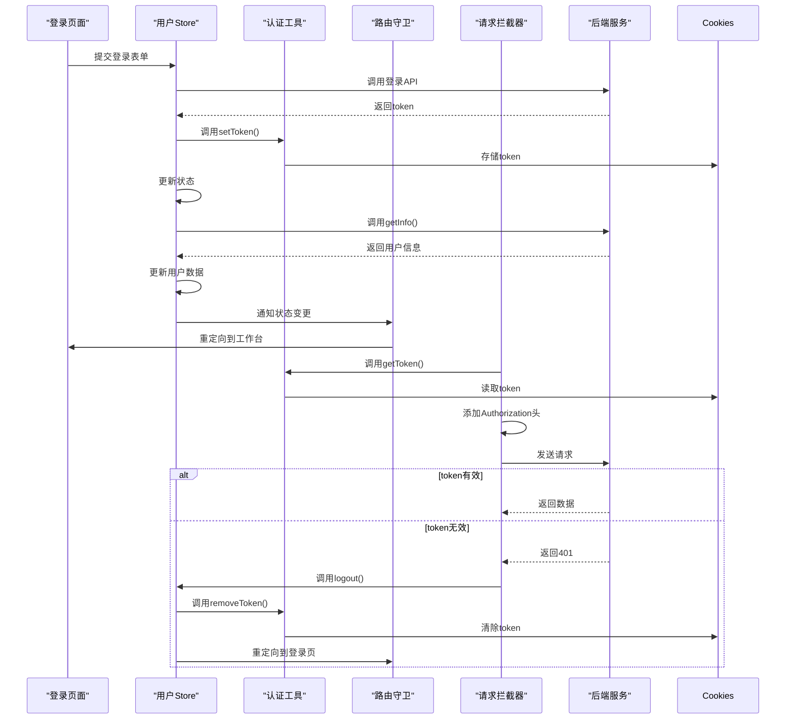
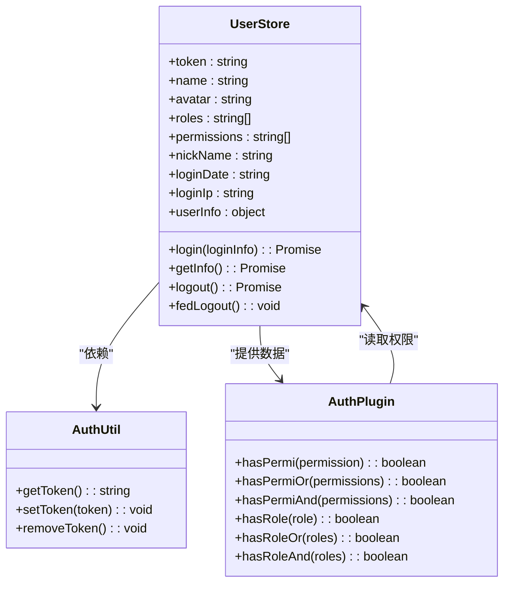
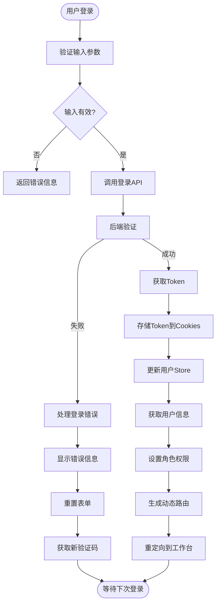
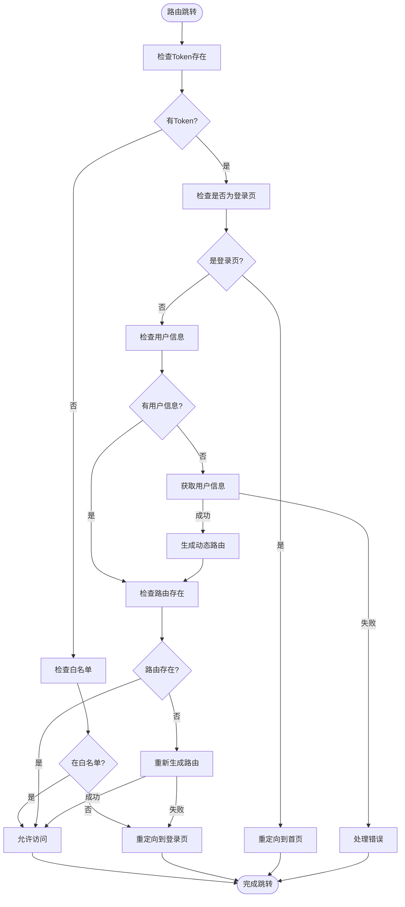
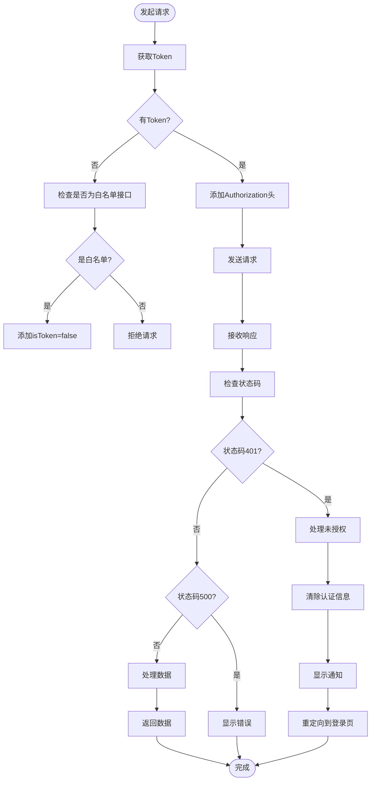
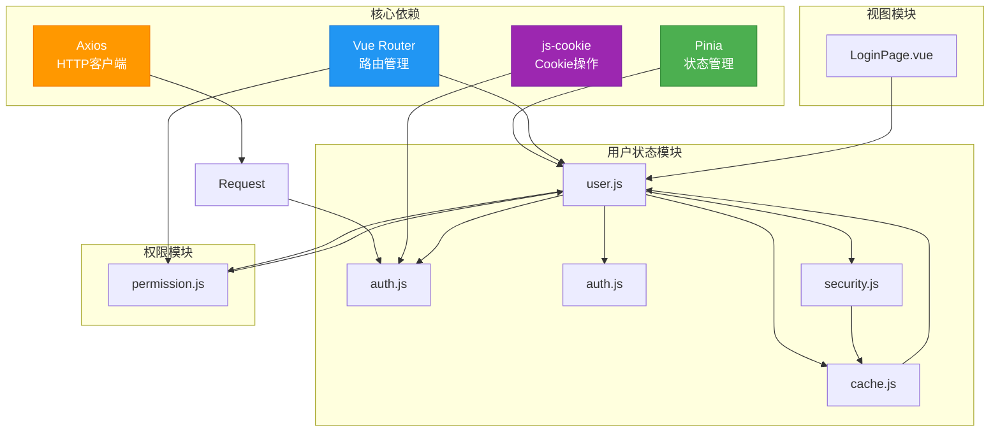
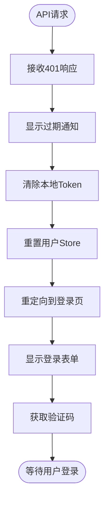
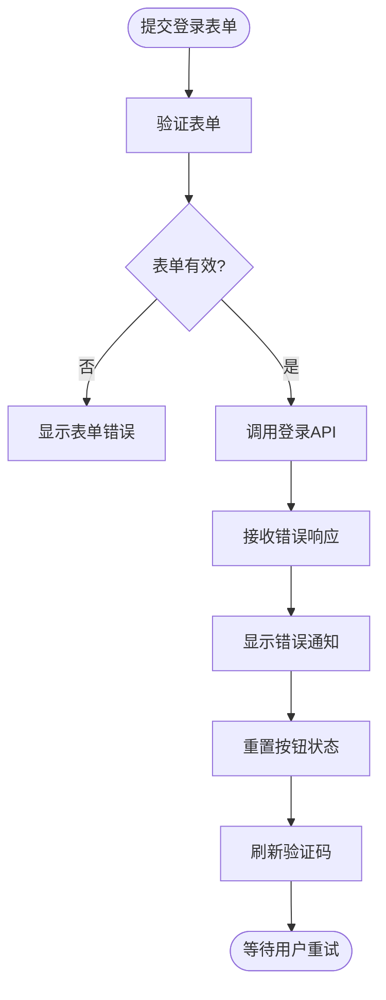
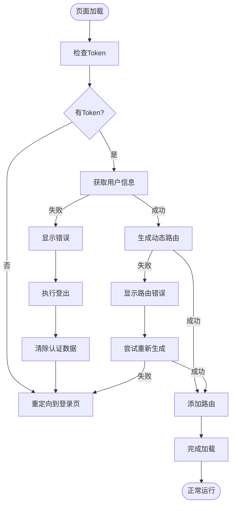

# 用户状态管理

<cite>
**本文档引用的文件**
- [user.js](file://bear-jia-vue3\src\stores\user.js)
- [auth.js](file://bear-jia-vue3\src\plugins\auth.js)
- [auth.js](file://bear-jia-vue3\src\utils\auth.js)
- [vueRouter.js](file://bear-jia-vue3\src\router\vueRouter.js)
- [request.js](file://bear-jia-vue3\src\utils\request.js)
- [cache.js](file://bear-jia-vue3\src\plugins\cache.js)
- [security.js](file://bear-jia-vue3\src\utils\security.js)
- [permission.js](file://bear-jia-vue3\src\stores\permission.js)
- [LoginPage.vue](file://bear-jia-vue3\src\views\LoginPage.vue)
</cite>

## 目录
1. [项目结构](#项目结构)
2. [核心组件](#核心组件)
3. [架构概述](#架构概述)
4. [详细组件分析](#详细组件分析)
5. [依赖分析](#依赖分析)
6. [性能考虑](#性能考虑)
7. [故障排除指南](#故障排除指南)
8. [结论](#结论)

## 项目结构

```mermaid
graph TD
subgraph "核心模块"
UserStore[user.js<br/>用户状态管理]
AuthPlugin[auth.js<br/>权限验证插件]
AuthUtil[auth.js<br/>认证工具]
Router[vueRouter.js<br/>路由守卫]
Request[request.js<br/>请求拦截]
Cache[cache.js<br/>缓存管理]
Security[security.js<br/>安全工具]
Permission[permission.js<br/>权限路由]
end
subgraph "视图层"
LoginView[LoginPage.vue<br/>登录页面]
end
UserStore --> AuthUtil : "获取/设置token"
UserStore --> Router : "状态同步"
AuthPlugin --> UserStore : "读取权限"
Router --> UserStore : "状态验证"
Request --> AuthUtil : "添加认证头"
Request --> UserStore : "token失效处理"
Cache --> UserStore : "状态持久化"
Security --> Cache : "安全存储"
Permission --> UserStore : "权限验证"
LoginView --> UserStore : "登录操作"
```

**图表来源**
- [user.js](file://bear-jia-vue3\src\stores\user.js)
- [auth.js](file://bear-jia-vue3\src\plugins\auth.js)
- [auth.js](file://bear-jia-vue3\src\utils\auth.js)
- [vueRouter.js](file://bear-jia-vue3\src\router\vueRouter.js)
- [request.js](file://bear-jia-vue3\src\utils\request.js)
- [cache.js](file://bear-jia-vue3\src\plugins\cache.js)

**章节来源**
- [user.js](file://bear-jia-vue3\src\stores\user.js)
- [auth.js](file://bear-jia-vue3\src\plugins\auth.js)
- [auth.js](file://bear-jia-vue3\src\utils\auth.js)

## 核心组件

用户状态管理是本系统的核心功能，主要通过Pinia状态管理库实现。系统采用模块化的store设计，将用户状态、权限路由和应用配置分离管理。用户状态存储在`user.js`中，包含token、用户基本信息、角色和权限等关键数据。认证机制通过`auth.js`工具函数实现，使用Cookies存储token，确保跨页面会话保持。路由守卫在`vueRouter.js`中实现，负责拦截未认证访问并重定向到登录页面。请求拦截器在`request.js`中配置，自动为每个请求添加认证头信息。

**章节来源**
- [user.js](file://bear-jia-vue3\src\stores\user.js)
- [auth.js](file://bear-jia-vue3\src\utils\auth.js)
- [vueRouter.js](file://bear-jia-vue3\src\router\vueRouter.js)
- [request.js](file://bear-jia-vue3\src\utils\request.js)

## 架构概述



**图表来源**
- [user.js](file://bear-jia-vue3\src\stores\user.js)
- [auth.js](file://bear-jia-vue3\src\utils\auth.js)
- [vueRouter.js](file://bear-jia-vue3\src\router\vueRouter.js)
- [request.js](file://bear-jia-vue3\src\utils\request.js)
- [LoginPage.vue](file://bear-jia-vue3\src\views\LoginPage.vue)

## 详细组件分析

### 用户Store分析

用户状态管理通过Pinia的`defineStore`实现，采用模块化设计。Store包含state、getters和actions三个部分，分别管理状态、计算属性和业务逻辑。



**图表来源**
- [user.js](file://bear-jia-vue3\src\stores\user.js)
- [auth.js](file://bear-jia-vue3\src\utils\auth.js)
- [auth.js](file://bear-jia-vue3\src\plugins\auth.js)

**章节来源**
- [user.js](file://bear-jia-vue3\src\stores\user.js)

### 认证流程分析

系统采用基于Token的认证机制，通过多层拦截确保安全性。登录流程从用户输入凭证开始，经过API调用、token存储、用户信息获取等多个步骤。



**图表来源**
- [user.js](file://bear-jia-vue3\src\stores\user.js)
- [LoginPage.vue](file://bear-jia-vue3\src\views\LoginPage.vue)
- [permission.js](file://bear-jia-vue3\src\stores\permission.js)

**章节来源**
- [user.js](file://bear-jia-vue3\src\stores\user.js)
- [LoginPage.vue](file://bear-jia-vue3\src\views\LoginPage.vue)

### 路由守卫分析

路由守卫是保护系统安全的关键组件，通过`beforeEach`守卫实现访问控制。守卫逻辑根据用户认证状态和权限决定是否允许访问。



**图表来源**
- [vueRouter.js](file://bear-jia-vue3\src\router\vueRouter.js)
- [user.js](file://bear-jia-vue3\src\stores\user.js)
- [permission.js](file://bear-jia-vue3\src\stores\permission.js)

**章节来源**
- [vueRouter.js](file://bear-jia-vue3\src\router\vueRouter.js)

### 请求拦截分析

请求拦截器确保每个API请求都携带有效的认证信息，同时处理认证失败的情况。拦截器分为请求和响应两个阶段。



**图表来源**
- [request.js](file://bear-jia-vue3\src\utils\request.js)
- [auth.js](file://bear-jia-vue3\src\utils\auth.js)
- [user.js](file://bear-jia-vue3\src\stores\user.js)

**章节来源**
- [request.js](file://bear-jia-vue3\src\utils\request.js)

## 依赖分析



**图表来源**
- [user.js](file://bear-jia-vue3\src\stores\user.js)
- [auth.js](file://bear-jia-vue3\src\utils\auth.js)
- [auth.js](file://bear-jia-vue3\src\plugins\auth.js)
- [vueRouter.js](file://bear-jia-vue3\src\router\vueRouter.js)
- [request.js](file://bear-jia-vue3\src\utils\request.js)
- [cache.js](file://bear-jia-vue3\src\plugins\cache.js)
- [security.js](file://bear-jia-vue3\src\utils\security.js)
- [permission.js](file://bear-jia-vue3\src\stores\permission.js)

**章节来源**
- [user.js](file://bear-jia-vue3\src\stores\user.js)
- [auth.js](file://bear-jia-vue3\src\utils\auth.js)
- [vueRouter.js](file://bear-jia-vue3\src\router\vueRouter.js)
- [request.js](file://bear-jia-vue3\src\utils\request.js)

## 性能考虑

用户状态管理系统的性能主要体现在响应速度、内存使用和网络效率三个方面。系统通过合理的状态管理和缓存策略优化性能表现。

1. **状态管理优化**：使用Pinia作为状态管理库，相比Vuex具有更小的体积和更好的TypeScript支持。Pinia的模块化设计允许按需加载store，减少初始加载时间。

2. **缓存策略**：系统采用多层缓存机制。Token存储在Cookies中，确保跨会话持久化。用户信息和权限数据存储在Pinia store中，避免重复请求。页面状态通过sessionStorage保存，提升用户体验。

3. **路由懒加载**：动态路由采用懒加载机制，只有在用户访问时才加载对应组件，减少初始包大小。通过`import.meta.glob`预加载视图组件，提高路由切换速度。

4. **请求优化**：请求拦截器统一处理认证头添加，避免重复代码。响应拦截器集中处理错误，提供一致的用户体验。并发请求使用`Promise.allSettled`，确保部分失败不影响整体流程。

5. **内存管理**：在用户登出时，及时清除store中的敏感数据和Cookies中的token，防止内存泄漏。路由守卫在页面跳转时保存和恢复滚动位置，提升用户体验。

**章节来源**
- [user.js](file://bear-jia-vue3\src\stores\user.js)
- [cache.js](file://bear-jia-vue3\src\plugins\cache.js)
- [vueRouter.js](file://bear-jia-vue3\src\router\vueRouter.js)
- [request.js](file://bear-jia-vue3\src\utils\request.js)

## 故障排除指南

### Token失效处理

当用户长时间未操作导致token过期时，系统会自动处理并引导用户重新登录。



**图表来源**
- [request.js](file://bear-jia-vue3\src\utils\request.js)
- [user.js](file://bear-jia-vue3\src\stores\user.js)
- [vueRouter.js](file://bear-jia-vue3\src\router\vueRouter.js)

**章节来源**
- [request.js](file://bear-jia-vue3\src\utils\request.js)

### 登录失败处理

当用户输入错误的登录信息时，系统提供详细的错误反馈和恢复机制。



**图表来源**
- [LoginPage.vue](file://bear-jia-vue3\src\views\LoginPage.vue)
- [user.js](file://bear-jia-vue3\src\stores\user.js)

**章节来源**
- [LoginPage.vue](file://bear-jia-vue3\src\views\LoginPage.vue)

### 路由生成失败

当动态路由生成失败时，系统提供降级处理方案，确保用户能够继续使用。



**图表来源**
- [vueRouter.js](file://bear-jia-vue3\src\router\vueRouter.js)
- [user.js](file://bear-jia-vue3\src\stores\user.js)
- [permission.js](file://bear-jia-vue3\src\stores\permission.js)

**章节来源**
- [vueRouter.js](file://bear-jia-vue3\src\router\vueRouter.js)

## 结论

本系统通过Pinia实现用户状态管理，采用模块化设计将认证、权限、路由等功能分离。Token存储在Cookies中，确保跨会话持久化。路由守卫和请求拦截器共同构建了安全的访问控制体系。系统提供了完善的错误处理机制，能够优雅地处理token过期、登录失败等异常情况。通过合理的缓存策略和性能优化，确保了良好的用户体验。整体架构清晰，易于维护和扩展，为系统的稳定运行提供了可靠保障。