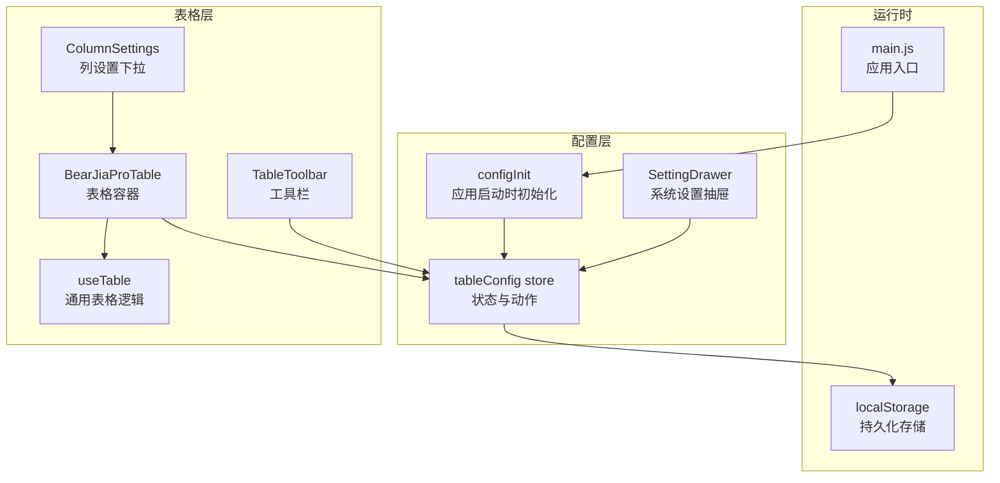
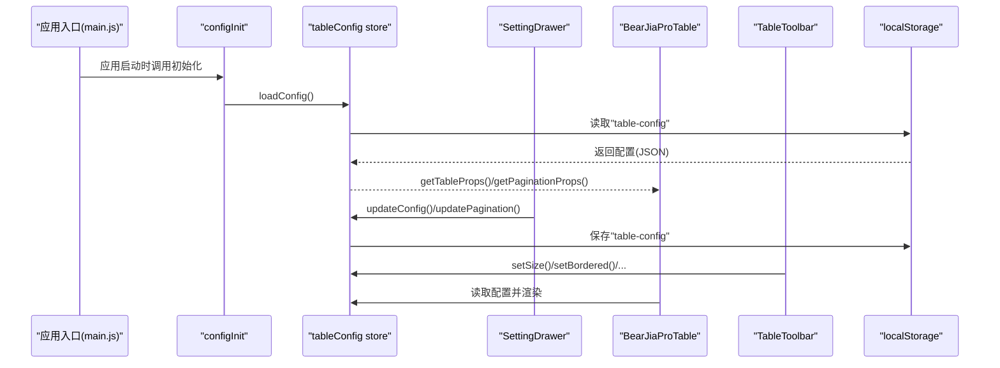
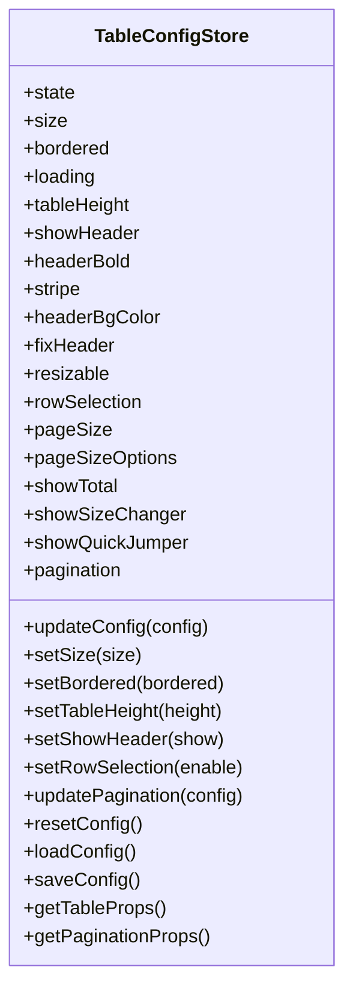
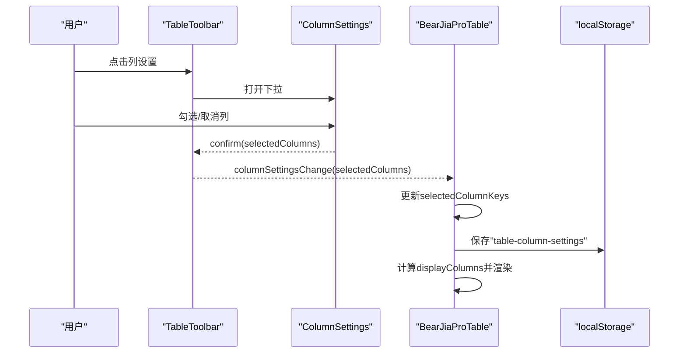
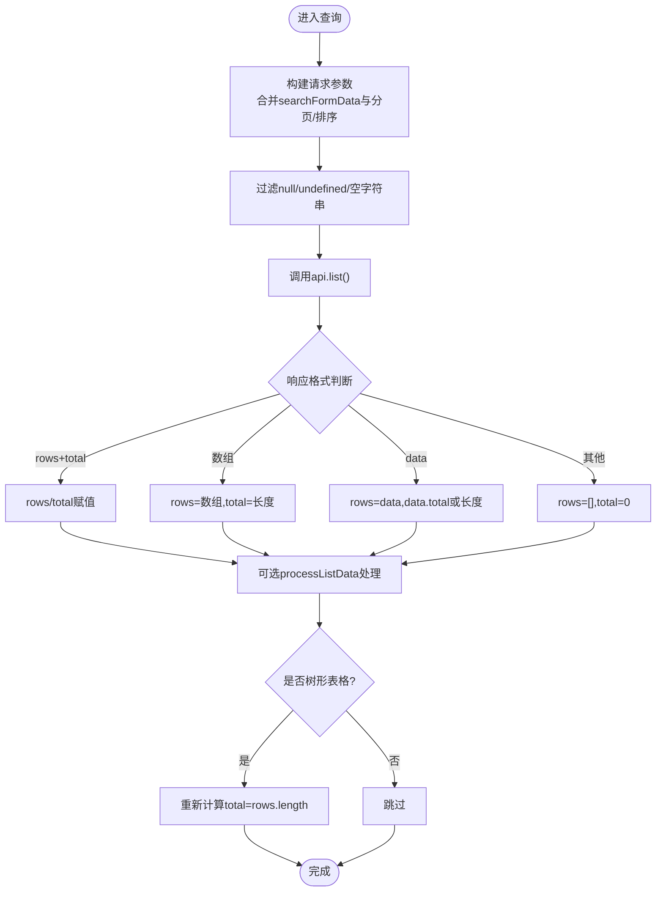
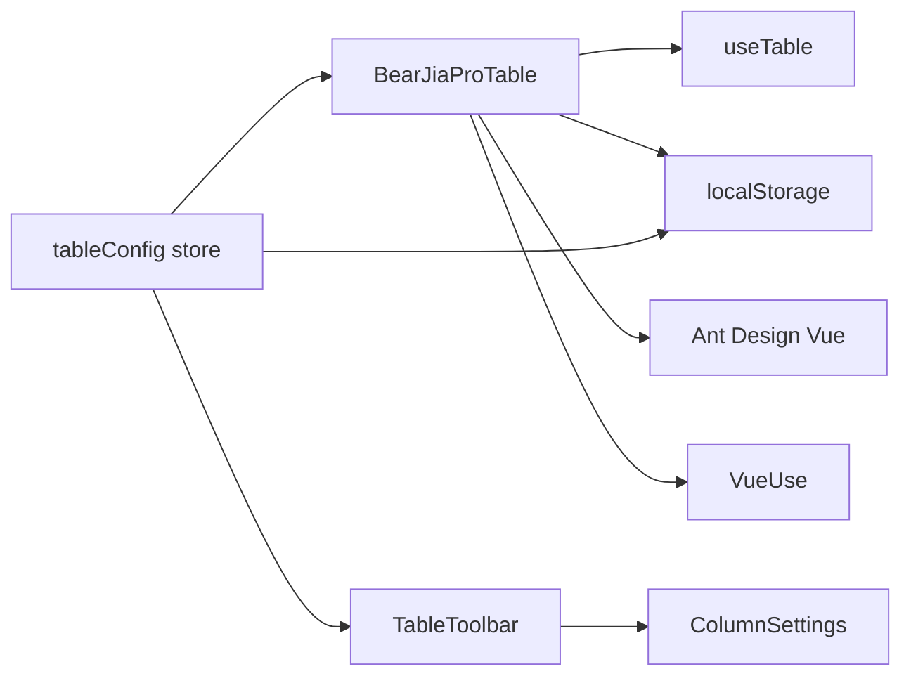

# 表格配置管理

<cite>
**本文引用的文件**
- [tableConfig.js](file://bear-jia-vue3/src/stores/tableConfig.js)
- [index.vue](file://bear-jia-vue3/src/components/BearJiaProTable/index.vue)
- [TableToolbar.vue](file://bear-jia-vue3/src/components/BearJiaProTable/TableToolbar.vue)
- [ColumnSettings.vue](file://bear-jia-vue3/src/components/BearJiaProTable/ColumnSettings.vue)
- [useTable.js](file://bear-jia-vue3/src/composables/useTable.js)
- [configInit.js](file://bear-jia-vue3/src/utils/configInit.js)
- [SettingDrawer.vue](file://bear-jia-vue3/src/components/layout/SettingDrawer.vue)
- [VirtualScrollExample.md](file://bear-jia-vue3/src/components/BearJiaProTable/VirtualScrollExample.md)
- [ruoyi-usage.md](file://bear-jia-vue3/docs/ruoyi-usage.md)
- [main.js](file://bear-jia-vue3/src/main.js)
</cite>

## 目录
1. [简介](#简介)
2. [项目结构](#项目结构)
3. [核心组件](#核心组件)
4. [架构总览](#架构总览)
5. [详细组件分析](#详细组件分析)
6. [依赖关系分析](#依赖关系分析)
7. [性能考量](#性能考量)
8. [故障排查指南](#故障排查指南)
9. [结论](#结论)
10. [附录](#附录)

## 简介
本文件围绕 BearJiaVue3 项目中的表格配置管理能力，系统梳理 tableConfig store 的表格个性化设置功能，包括：
- 表格列配置的存储与应用（显示/隐藏、顺序、宽度等）
- 配置持久化与跨会话恢复
- 多表格配置的隔离策略
- 与 BearJiaProTable 组件的集成方式
- API 文档：读取、保存、重置方法
- 配置版本管理与兼容性处理
- 复杂表格（树形、分页）场景下的配置管理要点

## 项目结构
表格配置管理涉及以下关键模块：
- Pinia store：统一管理表格个性化设置
- BearJiaProTable 组件：承载表格渲染、列设置、工具栏、虚拟滚动等
- useTable 组合式函数：封装通用表格逻辑（分页、排序、搜索、导出）
- SettingDrawer：系统设置抽屉，负责将用户设置同步到 store 并持久化
- configInit：应用启动时初始化表格配置
- VirtualScrollExample：虚拟滚动使用指南，体现配置对性能的影响

图表来源
- [tableConfig.js](file://bear-jia-vue3/src/stores/tableConfig.js#L1-L154)
- [configInit.js](file://bear-jia-vue3/src/utils/configInit.js#L46-L68)
- [SettingDrawer.vue](file://bear-jia-vue3/src/components/layout/SettingDrawer.vue#L388-L452)
- [index.vue](file://bear-jia-vue3/src/components/BearJiaProTable/index.vue#L102-L175)
- [TableToolbar.vue](file://bear-jia-vue3/src/components/BearJiaProTable/TableToolbar.vue#L94-L170)
- [ColumnSettings.vue](file://bear-jia-vue3/src/components/BearJiaProTable/ColumnSettings.vue#L1-L92)
- [useTable.js](file://bear-jia-vue3/src/composables/useTable.js#L1-L238)
- [main.js](file://bear-jia-vue3/src/main.js#L1-L62)

章节来源
- [tableConfig.js](file://bear-jia-vue3/src/stores/tableConfig.js#L1-L154)
- [index.vue](file://bear-jia-vue3/src/components/BearJiaProTable/index.vue#L102-L175)
- [TableToolbar.vue](file://bear-jia-vue3/src/components/BearJiaProTable/TableToolbar.vue#L94-L170)
- [useTable.js](file://bear-jia-vue3/src/composables/useTable.js#L1-L238)
- [configInit.js](file://bear-jia-vue3/src/utils/configInit.js#L46-L68)
- [SettingDrawer.vue](file://bear-jia-vue3/src/components/layout/SettingDrawer.vue#L388-L452)
- [main.js](file://bear-jia-vue3/src/main.js#L1-L62)

## 核心组件
- tableConfig store：集中管理表格外观、行为与分页配置，并提供读取、保存、重置与计算属性输出。
- BearJiaProTable：将 store 中的配置应用到表格渲染，支持列设置、工具栏、虚拟滚动、树形表格等。
- TableToolbar：密度切换、列设置、更多设置、刷新等交互入口。
- ColumnSettings：列显示/隐藏的下拉选择器。
- useTable：封装分页、排序、搜索、导出、选择等通用逻辑。
- configInit：应用启动时从 localStorage 加载表格配置。
- SettingDrawer：系统设置抽屉，负责将用户设置同步到 store 并持久化。

章节来源
- [tableConfig.js](file://bear-jia-vue3/src/stores/tableConfig.js#L1-L154)
- [index.vue](file://bear-jia-vue3/src/components/BearJiaProTable/index.vue#L102-L175)
- [TableToolbar.vue](file://bear-jia-vue3/src/components/BearJiaProTable/TableToolbar.vue#L94-L170)
- [ColumnSettings.vue](file://bear-jia-vue3/src/components/BearJiaProTable/ColumnSettings.vue#L1-L92)
- [useTable.js](file://bear-jia-vue3/src/composables/useTable.js#L1-L238)
- [configInit.js](file://bear-jia-vue3/src/utils/configInit.js#L46-L68)
- [SettingDrawer.vue](file://bear-jia-vue3/src/components/layout/SettingDrawer.vue#L388-L452)

## 架构总览
表格配置管理采用“store 驱动 UI”的架构模式：
- store 负责状态与持久化
- 组件通过响应式读取 store 并触发动作
- useTable 与 BearJiaProTable 解耦通用逻辑与渲染细节
- SettingDrawer 作为用户界面入口，直接写入 store 并持久化

图表来源
- [main.js](file://bear-jia-vue3/src/main.js#L42-L56)
- [configInit.js](file://bear-jia-vue3/src/utils/configInit.js#L46-L68)
- [tableConfig.js](file://bear-jia-vue3/src/stores/tableConfig.js#L108-L152)
- [SettingDrawer.vue](file://bear-jia-vue3/src/components/layout/SettingDrawer.vue#L388-L452)
- [index.vue](file://bear-jia-vue3/src/components/BearJiaProTable/index.vue#L102-L175)
- [TableToolbar.vue](file://bear-jia-vue3/src/components/BearJiaProTable/TableToolbar.vue#L94-L170)

## 详细组件分析

### tableConfig store：表格个性化设置中心
- 存储结构
  - 表格外观：size、bordered、loading、tableHeight、showHeader、headerBold、stripe、headerBgColor、fixHeader、resizable、rowSelection
  - 分页配置：current、pageSize、total、showSizeChanger、showQuickJumper、showTotal、pageSizeOptions
- 动作与方法
  - updateConfig(config)：整体覆盖配置
  - setSize(size)/setBordered(bordered)/setTableHeight(height)/setShowHeader(show)/setRowSelection(enable)：单项更新
  - updatePagination(config)：合并分页配置
  - resetConfig()：重置为默认配置并清除持久化
  - loadConfig()：从 localStorage 恢复配置
  - saveConfig()：保存当前 store 状态到 localStorage
  - getTableProps()：生成表格渲染所需的 props
  - getPaginationProps()：生成分页渲染所需的 props

图表来源
- [tableConfig.js](file://bear-jia-vue3/src/stores/tableConfig.js#L1-L154)

章节来源
- [tableConfig.js](file://bear-jia-vue3/src/stores/tableConfig.js#L1-L154)

### BearJiaProTable：表格渲染与列设置
- 列设置
  - 通过 TableToolbar 的 ColumnSettings 触发列选择变更
  - 本地持久化“列键集合”到 localStorage，支持跨会话恢复
  - 渲染时根据 selectedColumnKeys 过滤 columns，实现列显示/隐藏与顺序控制
- 工具栏
  - 密度切换：调用 store.setSize
  - 更多设置：导出、导入、重置
  - 刷新：触发数据重新查询
- 虚拟滚动
  - 根据 store.size 与 tableHeight 计算容器高度
  - 当开启虚拟滚动且固定表头时，启用 scrollToFirstRowOnChange
- 树形表格
  - isTreeTable 场景下默认展开全部行，支持 expandable 插槽
- 分页与排序
  - 通过 useTable 提供的分页与排序参数，结合 store 的分页配置

图表来源
- [TableToolbar.vue](file://bear-jia-vue3/src/components/BearJiaProTable/TableToolbar.vue#L54-L90)
- [ColumnSettings.vue](file://bear-jia-vue3/src/components/BearJiaProTable/ColumnSettings.vue#L1-L92)
- [index.vue](file://bear-jia-vue3/src/components/BearJiaProTable/index.vue#L262-L307)

章节来源
- [index.vue](file://bear-jia-vue3/src/components/BearJiaProTable/index.vue#L102-L175)
- [TableToolbar.vue](file://bear-jia-vue3/src/components/BearJiaProTable/TableToolbar.vue#L94-L170)
- [ColumnSettings.vue](file://bear-jia-vue3/src/components/BearJiaProTable/ColumnSettings.vue#L1-L92)

### useTable：通用表格逻辑
- 分页与排序
  - 维护 pageNum、pageSize、orderByColumn、isAsc
  - handleTableChange 合并分页与排序参数并触发查询
- 数据查询
  - queryTableData 支持多种响应格式（rows+total、数组、data+total），并可执行 processListData 自定义处理
- 行选择
  - 提供 rowSelection 计算属性与 onChange 回调
- 导出
  - 依据 exportConfig.url 与当前查询参数发起下载

图表来源
- [useTable.js](file://bear-jia-vue3/src/composables/useTable.js#L69-L124)

章节来源
- [useTable.js](file://bear-jia-vue3/src/composables/useTable.js#L1-L238)

### SettingDrawer：系统设置与持久化
- 从 localStorage 恢复“table-config”，若不存在则使用 store 默认值
- 在用户修改设置时，仅在内存中更新，点击保存后：
  - 调用 store.updateConfig 同步到 store
  - 保存到 localStorage
- 重置时调用 store.resetConfig 清除持久化并恢复默认

章节来源
- [SettingDrawer.vue](file://bear-jia-vue3/src/components/layout/SettingDrawer.vue#L388-L452)
- [SettingDrawer.vue](file://bear-jia-vue3/src/components/layout/SettingDrawer.vue#L599-L626)

### configInit：应用启动时初始化
- 应用启动后，调用 initTableConfig，从 localStorage 加载“table-config”并同步到 store
- 若加载失败，回退到默认配置

章节来源
- [configInit.js](file://bear-jia-vue3/src/utils/configInit.js#L46-L68)
- [main.js](file://bear-jia-vue3/src/main.js#L42-L56)

## 依赖关系分析
- 组件依赖
  - BearJiaProTable 依赖 tableConfig store、useTable、ColumnSettings、TableToolbar
  - TableToolbar 依赖 tableConfig store、ColumnSettings
  - ColumnSettings 依赖外部 columns 与 selectedColumns
  - useTable 依赖 tableConfig store
- 外部依赖
  - localStorage：用于配置持久化
  - Ant Design Vue：表格与工具栏组件
  - VueUse：ResizeObserver、虚拟滚动组合式函数

图表来源
- [index.vue](file://bear-jia-vue3/src/components/BearJiaProTable/index.vue#L102-L175)
- [TableToolbar.vue](file://bear-jia-vue3/src/components/BearJiaProTable/TableToolbar.vue#L94-L170)
- [ColumnSettings.vue](file://bear-jia-vue3/src/components/BearJiaProTable/ColumnSettings.vue#L1-L92)
- [useTable.js](file://bear-jia-vue3/src/composables/useTable.js#L1-L238)
- [tableConfig.js](file://bear-jia-vue3/src/stores/tableConfig.js#L1-L154)

## 性能考量
- 虚拟滚动
  - 通过 VirtualScrollExample.md 可知，虚拟滚动在大数据量场景下显著降低 DOM 节点数量，提升滚动性能
  - BearJiaProTable 在启用虚拟滚动时，会根据 tableHeight 与 size 自动计算容器高度，并在固定表头时启用 scrollToFirstRowOnChange
- 列宽度与水平滚动
  - 当开启 autoHorizontalScroll 时，组件会根据列宽与容器宽度动态决定是否启用横向滚动，避免列被截断
- 行高与渲染
  - 虚拟滚动会根据表格 size 自动调整行高，建议为列设置固定宽度以获得最佳性能

章节来源
- [VirtualScrollExample.md](file://bear-jia-vue3/src/components/BearJiaProTable/VirtualScrollExample.md#L1-L313)
- [index.vue](file://bear-jia-vue3/src/components/BearJiaProTable/index.vue#L273-L307)

## 故障排查指南
- 配置无法持久化
  - 检查 localStorage 是否可用；store.saveConfig 与 SettingDrawer.saveTableConfig 均会写入“table-config”
  - 若解析失败，store.loadConfig 与 SettingDrawer 会捕获异常并给出警告
- 列设置未生效
  - 确认 ColumnSettings 的 selectedColumns 与 BearJiaProTable 的 selectedColumnKeys 同步
  - BearJiaProTable 会在 columns 变更时重新初始化 selectedColumnKeys，并尝试从 localStorage 恢复
- 分页与排序异常
  - useTable.handleTableChange 会更新 pageNum、pageSize、orderByColumn、isAsc；确保 API 返回格式符合预期
- 树形表格问题
  - isTreeTable 场景下不带分页参数；processListData 可将扁平数据转换为树形结构

章节来源
- [tableConfig.js](file://bear-jia-vue3/src/stores/tableConfig.js#L108-L152)
- [SettingDrawer.vue](file://bear-jia-vue3/src/components/layout/SettingDrawer.vue#L599-L626)
- [index.vue](file://bear-jia-vue3/src/components/BearJiaProTable/index.vue#L326-L373)
- [useTable.js](file://bear-jia-vue3/src/composables/useTable.js#L143-L161)

## 结论
- tableConfig store 提供了统一、可扩展的表格个性化配置中心，涵盖外观、行为与分页等维度
- BearJiaProTable 通过 store 驱动渲染，配合 ColumnSettings 与 TableToolbar 实现灵活的列管理与工具栏操作
- SettingDrawer 与 configInit 保障了配置的跨会话持久化与应用启动时的自动恢复
- 在复杂表格场景（树形、分页、虚拟滚动）中，store 与 useTable 的协作提供了清晰的边界与良好的扩展性

## 附录

### API 文档（tableConfig store）
- 读取配置
  - getTableProps(): 返回表格渲染所需 props（size、bordered、loading、showHeader、scroll、rowSelection）
  - getPaginationProps(): 返回分页渲染所需 props（current、pageSize、total、showSizeChanger、showQuickJumper、showTotal、pageSizeOptions）
- 保存与重置
  - saveConfig(): 将当前 store 状态保存到 localStorage（键："table-config"）
  - resetConfig(): 重置为默认配置并清除 localStorage 中的持久化配置
  - loadConfig(): 从 localStorage 恢复配置
- 更新配置
  - updateConfig(config): 整体覆盖 store 配置
  - updatePagination(config): 合并分页配置
  - setSize(size)/setBordered(bordered)/setTableHeight(height)/setShowHeader(show)/setRowSelection(enable): 单项更新

章节来源
- [tableConfig.js](file://bear-jia-vue3/src/stores/tableConfig.js#L108-L152)

### 多表格配置隔离策略
- 列设置隔离
  - BearJiaProTable 使用 localStorage 键："table-column-settings" 存储列键集合，按表格实例恢复
  - 当 columns 发生变化时，组件会重新初始化 selectedColumnKeys，并尝试从 localStorage 恢复
- 表格配置隔离
  - tableConfig store 为全局单一 store，但 BearJiaProTable 通过 props 与 store 的组合使用，可在同一页面内为不同实例提供差异化行为
  - SettingDrawer 与 store 的交互仅影响内存状态，保存时写入 localStorage 键："table-config"

章节来源
- [index.vue](file://bear-jia-vue3/src/components/BearJiaProTable/index.vue#L326-L373)
- [SettingDrawer.vue](file://bear-jia-vue3/src/components/layout/SettingDrawer.vue#L388-L452)
- [tableConfig.js](file://bear-jia-vue3/src/stores/tableConfig.js#L108-L152)

### 配置版本管理与兼容性
- 启动初始化
  - 应用启动时调用 initTableConfig，从 localStorage 恢复配置；若解析失败，回退到默认配置
- SettingDrawer 保存
  - 保存时将当前内存中的配置写入 localStorage，覆盖旧值
- 兼容性建议
  - 新增字段时，store 默认值应向后兼容；组件在读取配置时应做健壮性处理（如空值回退）

章节来源
- [configInit.js](file://bear-jia-vue3/src/utils/configInit.js#L46-L68)
- [SettingDrawer.vue](file://bear-jia-vue3/src/components/layout/SettingDrawer.vue#L599-L626)

### 复杂表格场景下的配置管理
- 树形表格
  - isTreeTable 为 true 时，默认展开全部行，分页参数不参与查询
  - 可通过 processListData 将扁平数据转换为树形结构
- 分页表格
  - useTable 根据 total 与 pageSize 决定是否显示分页
  - store 的分页配置影响分页控件的显示与选项
- 虚拟滚动
  - 通过 VirtualScrollExample.md 的参数（threshold、buffer）与 BearJiaProTable 的 scroll 配置，平衡性能与体验

章节来源
- [useTable.js](file://bear-jia-vue3/src/composables/useTable.js#L203-L218)
- [index.vue](file://bear-jia-vue3/src/components/BearJiaProTable/index.vue#L273-L307)
- [VirtualScrollExample.md](file://bear-jia-vue3/src/components/BearJiaProTable/VirtualScrollExample.md#L1-L313)

### 使用示例参考
- BearJiaProTable 在文档中的使用示例展示了列配置、搜索、导出、操作按钮等典型用法

章节来源
- [ruoyi-usage.md](file://bear-jia-vue3/docs/ruoyi-usage.md#L383-L583)