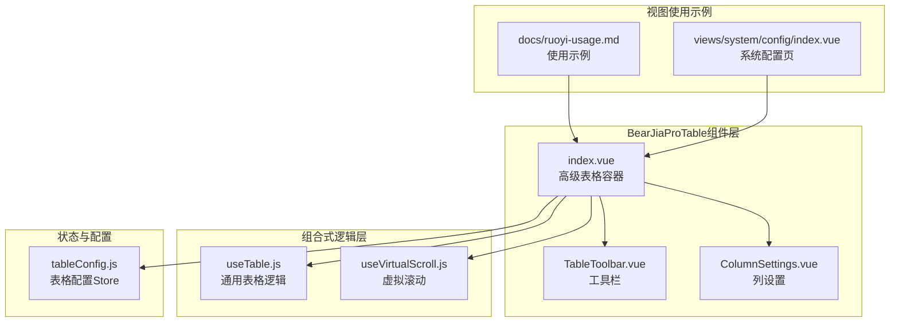
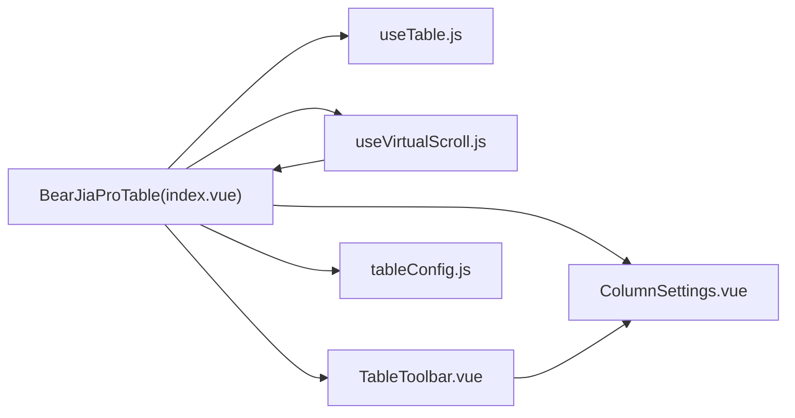

# BearJiaProTable高级表格组件

<cite>
**本文引用的文件**
- [index.vue](file://bear-jia-vue3/src/components/BearJiaProTable/index.vue)
- [useTable.js](file://bear-jia-vue3/src/composables/useTable.js)
- [TableToolbar.vue](file://bear-jia-vue3/src/components/BearJiaProTable/TableToolbar.vue)
- [ColumnSettings.vue](file://bear-jia-vue3/src/components/BearJiaProTable/ColumnSettings.vue)
- [useVirtualScroll.js](file://bear-jia-vue3/src/composables/useVirtualScroll.js)
- [VirtualScrollExample.md](file://bear-jia-vue3/src/components/BearJiaProTable/VirtualScrollExample.md)
- [tableConfig.js](file://bear-jia-vue3/src/stores/tableConfig.js)
- [index.vue](file://bear-jia-vue3/src/views/system/config/index.vue)
- [ruoyi-usage.md](file://bear-jia-vue3/docs/ruoyi-usage.md)
</cite>

## 目录
1. [简介](#简介)
2. [项目结构](#项目结构)
3. [核心组件](#核心组件)
4. [架构总览](#架构总览)
5. [组件详解](#组件详解)
6. [依赖关系分析](#依赖关系分析)
7. [性能考量](#性能考量)
8. [故障排查指南](#故障排查指南)
9. [结论](#结论)
10. [附录：API参考](#附录api参考)

## 简介
本文件面向BearJiaProTable高级表格组件的设计与实现进行系统性解析，重点覆盖以下方面：
- 基于Vue3组合式API的封装思路与useTable.js的集成逻辑
- TableToolbar工具栏的批量操作、刷新、导出、导入、重置等插槽与事件机制
- ColumnSettings列设置的显隐控制、顺序调整与本地持久化
- 虚拟滚动在大数据量场景下的性能优化策略与最佳实践
- 分页、排序、筛选等核心功能的配置与自定义渲染、作用域插槽的使用
- 组件props、events、slots的完整API说明

## 项目结构
BearJiaProTable位于组件目录下，围绕“表格容器 + 通用逻辑Hook + 工具栏 + 列设置 + 虚拟滚动”构建，配合Pinia表格配置Store与工具函数，形成完整的表格解决方案。



图表来源
- [index.vue](file://bear-jia-vue3/src/components/BearJiaProTable/index.vue#L1-L120)
- [useTable.js](file://bear-jia-vue3/src/composables/useTable.js#L1-L60)
- [useVirtualScroll.js](file://bear-jia-vue3/src/composables/useVirtualScroll.js#L1-L60)
- [TableToolbar.vue](file://bear-jia-vue3/src/components/BearJiaProTable/TableToolbar.vue#L1-L60)
- [ColumnSettings.vue](file://bear-jia-vue3/src/components/BearJiaProTable/ColumnSettings.vue#L1-L60)
- [tableConfig.js](file://bear-jia-vue3/src/stores/tableConfig.js#L1-L40)
- [index.vue](file://bear-jia-vue3/src/views/system/config/index.vue#L1-L60)
- [ruoyi-usage.md](file://bear-jia-vue3/docs/ruoyi-usage.md#L383-L446)

章节来源
- [index.vue](file://bear-jia-vue3/src/components/BearJiaProTable/index.vue#L1-L120)
- [useTable.js](file://bear-jia-vue3/src/composables/useTable.js#L1-L60)
- [useVirtualScroll.js](file://bear-jia-vue3/src/composables/useVirtualScroll.js#L1-L60)
- [TableToolbar.vue](file://bear-jia-vue3/src/components/BearJiaProTable/TableToolbar.vue#L1-L60)
- [ColumnSettings.vue](file://bear-jia-vue3/src/components/BearJiaProTable/ColumnSettings.vue#L1-L60)
- [tableConfig.js](file://bear-jia-vue3/src/stores/tableConfig.js#L1-L40)
- [index.vue](file://bear-jia-vue3/src/views/system/config/index.vue#L1-L60)
- [ruoyi-usage.md](file://bear-jia-vue3/docs/ruoyi-usage.md#L383-L446)

## 核心组件
- BearJiaProTable容器组件：负责布局、查询表单、操作区、表格主体、空态与错误态、分页与排序、行选择、树形/展开行、列设置、虚拟滚动集成与对外暴露方法。
- useTable组合式函数：统一处理分页、排序、筛选、查询参数、删除、导出、行选择等通用逻辑。
- TableToolbar工具栏：提供刷新、密度切换、全屏、列设置、更多设置（导出/导入/重置）等能力。
- ColumnSettings列设置：提供列勾选、重置、确认等交互，并与容器组件联动持久化。
- useVirtualScroll组合式函数：提供大数据量虚拟滚动的可见区间计算、滚动事件处理、滚动API与性能统计。

章节来源
- [index.vue](file://bear-jia-vue3/src/components/BearJiaProTable/index.vue#L1-L120)
- [useTable.js](file://bear-jia-vue3/src/composables/useTable.js#L1-L60)
- [TableToolbar.vue](file://bear-jia-vue3/src/components/BearJiaProTable/TableToolbar.vue#L1-L60)
- [ColumnSettings.vue](file://bear-jia-vue3/src/components/BearJiaProTable/ColumnSettings.vue#L1-L60)
- [useVirtualScroll.js](file://bear-jia-vue3/src/composables/useVirtualScroll.js#L1-L60)

## 架构总览
下面的类图展示了组件与组合式函数之间的关系与依赖：

```mermaid
classDiagram
class BearJiaProTable {
+props : api, columns, rowKey, searchFields, initialSearchParams
+props : exportConfig, importConfig, toolbarConfig, showSelection, isTreeTable
+props : expandable, sortable, autoHorizontalScroll, virtualScroll
+props : virtualScrollConfig, showColumnSettings, rowSelection
+expose : refresh(), delete(), export(), searchFormData, tableState
+expose : showColumnSettings, retry(), handleFullscreen(), handleImport(), handleTableReset()
+expose : virtualScroll{ scrollToIndex, scrollToTop, scrollToBottom, stats }
}
class UseTable {
+searchFormData
+tableState{ dataSource, total, loading, selectedRowKeys, columns }
+pagination
+rowSelection
+queryTableData()
+handleSearch()
+handleReset()
+handleTableChange(pagination, filters, sorter)
+handleDelete(ids?)
+handleExport()
}
class UseVirtualScroll {
+containerRef
+scrollTop
+isVirtualScrollEnabled
+visibleData
+visibleCount
+startIndex
+endIndex
+totalHeight
+offsetY
+performanceStats
+scrollToIndex(index)
+scrollToTop()
+scrollToBottom()
}
class TableToolbar {
+props : columns, selectedColumns, loading, toolbarConfig, exportConfig, importConfig
+emits : update : selectedColumns, columnSettingsChange, refresh, fullscreen, export, import, reset
}
class ColumnSettings {
+props : columns, selectedColumns
+emits : update : selectedColumns, confirm
}
BearJiaProTable --> UseTable : "使用"
BearJiaProTable --> UseVirtualScroll : "使用"
BearJiaProTable --> TableToolbar : "组合"
BearJiaProTable --> ColumnSettings : "组合"
```

图表来源
- [index.vue](file://bear-jia-vue3/src/components/BearJiaProTable/index.vue#L102-L200)
- [useTable.js](file://bear-jia-vue3/src/composables/useTable.js#L1-L120)
- [useVirtualScroll.js](file://bear-jia-vue3/src/composables/useVirtualScroll.js#L1-L120)
- [TableToolbar.vue](file://bear-jia-vue3/src/components/BearJiaProTable/TableToolbar.vue#L94-L156)
- [ColumnSettings.vue](file://bear-jia-vue3/src/components/BearJiaProTable/ColumnSettings.vue#L45-L92)

## 组件详解

### 1) BearJiaProTable容器组件
- 布局与区域划分
  - 查询表单区：通过SearchForm与searchFields联动，支持重置与搜索事件。
  - 操作按钮区：支持自定义插槽actions，向子作用域暴露selectedRowKeys、selectedRows、delete、refresh、export、loading、error等。
  - 工具栏区：TableToolbar负责刷新、密度、全屏、列设置、更多设置（导出/导入/重置）。
  - 表格主体：基于Ant Design Vue的a-table，支持分页、行选择、树形/展开行、滚动配置、空态与错误态。
- 与useTable.js的集成
  - 通过useTable(options)注入：searchFormData、tableState、pagination、rowSelection、queryTableData、handleSearch、handleReset、handleTableChange、handleDelete、handleExport。
  - 将表格变更事件@change映射到handleTableChange，从而自动维护pageNum、pageSize、orderByColumn、isAsc等查询参数。
- 列设置与显示控制
  - 通过selectedColumnKeys与props.columns联动，过滤显示列；支持从localStorage恢复列设置并在重置时清除。
- 虚拟滚动集成
  - 当开启virtualScroll且数据量超过threshold时，使用useVirtualScroll计算visibleData并替换dataSource，同时修正scroll.y与固定容器高度。
- 错误处理与重试
  - enhancedQueryTableData包裹queryTableData，捕获异常并展示错误态与重试按钮。
- 对外暴露方法
  - refresh、delete、export、searchFormData、tableState、retry、handleFullscreen、handleImport、handleTableReset、virtualScroll（滚动API与stats）。

章节来源
- [index.vue](file://bear-jia-vue3/src/components/BearJiaProTable/index.vue#L1-L120)
- [index.vue](file://bear-jia-vue3/src/components/BearJiaProTable/index.vue#L201-L399)

### 2) useTable.js组合式函数
- 关键职责
  - 统一分页参数（pageNum、pageSize）、排序参数（orderByColumn、isAsc）与查询参数合并。
  - 自动为非特殊列添加sorter与sortDirections，支持排序变更驱动查询。
  - 处理不同响应格式（rows+total、数组、data+total），并支持processListData自定义处理。
  - 统一行选择onChange与selectedRowKeys管理。
  - 删除确认与批量删除、导出下载（基于BearJiaUtil.download）。
  - 分页计算：根据total与pageSize决定是否显示分页；支持从tableConfigStore读取分页配置。
- 与API约定
  - api对象需包含list、delete（可选）、exportUrl（可选），processListData（可选）。

章节来源
- [useTable.js](file://bear-jia-vue3/src/composables/useTable.js#L1-L238)

### 3) TableToolbar工具栏
- 功能点
  - 刷新：触发父组件refresh事件。
  - 密度设置：通过下拉菜单切换表格size，写入tableConfigStore。
  - 全屏：切换isFullscreen并通过fullscreen事件向上抛出。
  - 列设置：集成ColumnSettings，confirm后通过columnSettingsChange事件通知父组件。
  - 更多设置：导出、导入、重置，分别通过export、import、reset事件通知父组件。
- 插槽与事件
  - 插槽left/right用于扩展工具栏左右侧内容。
  - 事件：refresh、fullscreen、columnSettingsChange、export、import、reset。

章节来源
- [TableToolbar.vue](file://bear-jia-vue3/src/components/BearJiaProTable/TableToolbar.vue#L1-L156)

### 4) ColumnSettings列设置
- 功能点
  - 下拉面板内提供列勾选与重置；支持本地持久化selectedColumns。
  - confirm事件向父组件传递最新选中列；update:selectedColumns用于双向绑定。
- 与父组件联动
  - 父组件在收到columnSettingsChange后更新selectedColumnKeys并写入localStorage。

章节来源
- [ColumnSettings.vue](file://bear-jia-vue3/src/components/BearJiaProTable/ColumnSettings.vue#L1-L92)

### 5) 虚拟滚动useVirtualScroll.js
- 核心算法
  - 根据containerHeight与itemHeight计算可见行数visibleCount。
  - 根据scrollTop与itemHeight计算startIndex与endIndex，并考虑buffer缓冲区。
  - visibleData为dataSource.slice(startIndex, endIndex)，totalHeight为dataSource.length*itemHeight，offsetY为startIndex*itemHeight。
- 滚动与API
  - 监听Ant Design Vue表格body滚动，被动事件监听，支持scrollToIndex、scrollToTop、scrollToBottom。
  - performanceStats提供total/rendered/savedNodes/reductionPercent/enabled等指标。
- 与BearJiaProTable集成
  - 在index.vue中，当virtualScroll启用且数据量超过threshold时，将table的dataSource替换为visibleData，并固定容器高度以适配虚拟滚动。

章节来源
- [useVirtualScroll.js](file://bear-jia-vue3/src/composables/useVirtualScroll.js#L1-L174)
- [index.vue](file://bear-jia-vue3/src/components/BearJiaProTable/index.vue#L228-L307)

### 6) 虚拟滚动最佳实践（VirtualScrollExample.md）
- 适用场景：数据量>100条、需要流畅滚动、单页展示大量数据、实时监控/日志查看。
- 配置参数：virtualScroll（布尔）、virtualScrollConfig（threshold、buffer）。
- 最佳实践：固定列宽、合理buffer、避免复杂单元格内容、根据数据量调整threshold。
- 高级用法：访问virtualScroll API（scrollToTop/Bottom/Index、stats）、结合固定表头、响应式行高（size映射）。
- 注意事项：行高一致性、展开行限制、树形表格不建议使用、不影响导出。

章节来源
- [VirtualScrollExample.md](file://bear-jia-vue3/src/components/BearJiaProTable/VirtualScrollExample.md#L1-L120)
- [VirtualScrollExample.md](file://bear-jia-vue3/src/components/BearJiaProTable/VirtualScrollExample.md#L120-L220)
- [VirtualScrollExample.md](file://bear-jia-vue3/src/components/BearJiaProTable/VirtualScrollExample.md#L220-L313)

### 7) 视图使用示例
- 系统配置页：通过ref调用refresh、deleteRows、export等方法；自定义actions插槽与bodyCell作用域插槽。
- RuoYi使用文档：展示ProTable（别名为BearJiaProTable）的actions与bodyCell插槽用法。

章节来源
- [index.vue](file://bear-jia-vue3/src/views/system/config/index.vue#L1-L60)
- [ruoyi-usage.md](file://bear-jia-vue3/docs/ruoyi-usage.md#L383-L446)

## 依赖关系分析



图表来源
- [index.vue](file://bear-jia-vue3/src/components/BearJiaProTable/index.vue#L102-L200)
- [useTable.js](file://bear-jia-vue3/src/composables/useTable.js#L1-L60)
- [useVirtualScroll.js](file://bear-jia-vue3/src/composables/useVirtualScroll.js#L1-L60)
- [TableToolbar.vue](file://bear-jia-vue3/src/components/BearJiaProTable/TableToolbar.vue#L94-L156)
- [ColumnSettings.vue](file://bear-jia-vue3/src/components/BearJiaProTable/ColumnSettings.vue#L45-L92)
- [tableConfig.js](file://bear-jia-vue3/src/stores/tableConfig.js#L1-L40)

章节来源
- [index.vue](file://bear-jia-vue3/src/components/BearJiaProTable/index.vue#L102-L200)
- [useTable.js](file://bear-jia-vue3/src/composables/useTable.js#L1-L60)
- [useVirtualScroll.js](file://bear-jia-vue3/src/composables/useVirtualScroll.js#L1-L60)
- [TableToolbar.vue](file://bear-jia-vue3/src/components/BearJiaProTable/TableToolbar.vue#L94-L156)
- [ColumnSettings.vue](file://bear-jia-vue3/src/components/BearJiaProTable/ColumnSettings.vue#L45-L92)
- [tableConfig.js](file://bear-jia-vue3/src/stores/tableConfig.js#L1-L40)

## 性能考量
- 虚拟滚动
  - 仅在数据量超过threshold时启用，避免小数据量的额外开销。
  - 通过buffer平衡流畅度与内存占用；推荐根据滚动速度调整。
  - 固定列宽与一致行高是虚拟滚动的关键前提。
- 分页与排序
  - useTable.js自动维护排序字段与方向，避免前端排序导致的性能问题。
  - 树形数据不使用分页参数，减少无效请求。
- 滚动与空态
  - 固定容器高度与y滚动配置，确保虚拟滚动稳定工作。
  - 错误态与重试机制提升用户体验。

章节来源
- [useVirtualScroll.js](file://bear-jia-vue3/src/composables/useVirtualScroll.js#L1-L120)
- [index.vue](file://bear-jia-vue3/src/components/BearJiaProTable/index.vue#L228-L307)
- [useTable.js](file://bear-jia-vue3/src/composables/useTable.js#L68-L124)
- [VirtualScrollExample.md](file://bear-jia-vue3/src/components/BearJiaProTable/VirtualScrollExample.md#L220-L313)

## 故障排查指南
- 表格空白或报错
  - 检查api.list返回格式是否符合useTable.js预期（rows+total、数组、data+total）。
  - 确认enhancedQueryTableData是否捕获异常并展示错误态。
- 虚拟滚动卡顿或位置错乱
  - 增大buffer或固定列宽；避免复杂单元格内容。
  - 数据更新后可调用virtualScroll.scrollToTop()重置。
- 列设置不生效
  - 确认ColumnSettings的confirm事件是否传递至父组件；父组件是否写入localStorage并更新selectedColumnKeys。
- 导出/导入不可用
  - 确认exportConfig/importConfig.enabled与url配置；工具栏更多设置菜单项状态由配置控制。

章节来源
- [index.vue](file://bear-jia-vue3/src/components/BearJiaProTable/index.vue#L246-L307)
- [useTable.js](file://bear-jia-vue3/src/composables/useTable.js#L192-L200)
- [TableToolbar.vue](file://bear-jia-vue3/src/components/BearJiaProTable/TableToolbar.vue#L148-L189)
- [ColumnSettings.vue](file://bear-jia-vue3/src/components/BearJiaProTable/ColumnSettings.vue#L60-L92)
- [VirtualScrollExample.md](file://bear-jia-vue3/src/components/BearJiaProTable/VirtualScrollExample.md#L274-L296)

## 结论
BearJiaProTable通过“容器组件 + 组合式函数 + 工具栏 + 列设置 + 虚拟滚动”的模块化设计，实现了高内聚、低耦合的表格解决方案。useTable.js统一处理分页、排序、筛选与导出等通用逻辑；TableToolbar与ColumnSettings提供灵活的工具与列控制；useVirtualScroll在大数据量场景下显著提升性能。配合Pinia表格配置Store与文档化的最佳实践，组件具备良好的可扩展性与易用性。

## 附录：API参考

### BearJiaProTable 组件 API
- Props
  - api: Object，必填。包含list、delete（可选）、exportUrl（可选）、processListData（可选）。
  - columns: Array，必填。列定义数组。
  - rowKey: String，必填。行键字段名。
  - searchFields: Array，默认[]。搜索表单字段配置。
  - initialSearchParams: Object，默认{}。初始查询参数。
  - exportConfig: Object|null，默认null。{ url, fileName }。
  - importConfig: Object，默认{ enabled: false, url: '', accept: '.xlsx,.xls,.csv' }。
  - toolbarConfig: Object，默认{ refresh: true, density: true, fullscreen: true, columnSettings: true, settings: true }。
  - showSelection: Boolean，默认true。是否显示行选择。
  - showActions: Boolean，默认true。是否显示操作区域。
  - isTreeTable: Boolean，默认false。是否树形表格。
  - expandable: Object|null，默认null。可展开行配置。
  - rowSelection: Object|null，默认null。自定义行选择配置。
  - sortable: Boolean，默认true。是否自动为列添加排序。
  - autoHorizontalScroll: Boolean，默认false。是否自动横向滚动。
  - virtualScroll: Boolean，默认false。是否启用虚拟滚动。
  - virtualScrollConfig: Object，默认{ threshold: 100, buffer: 5 }。虚拟滚动阈值与缓冲区。
  - showColumnSettings: Boolean，默认true。是否显示列设置。
  - 其他：v-bind透传至a-table，如size、bordered、scroll等。
- Slots
  - actions: 作用域插槽，提供selectedRowKeys、selectedRows、delete、refresh、export、loading、error。
  - bodyCell: 作用域插槽，提供column、index、record，支持自定义渲染。
  - expandedRowRender: 当expandable存在且提供expandedRowRender时可用。
  - emptyText: 自定义空态内容。
- Events
  - change(pagination, filters, sorter)：表格变更事件，内部映射到useTable.handleTableChange。
- Exposed Methods（通过defineExpose）
  - refresh()：重新查询数据（带错误处理）。
  - delete(ids?)：删除选中或指定ID数据。
  - export()：触发导出。
  - searchFormData：当前搜索表单数据。
  - tableState：{ dataSource, total, loading, selectedRowKeys, columns }。
  - retry()：重试加载。
  - handleFullscreen(isFullscreen)：全屏状态切换。
  - handleImport()：导入数据。
  - handleTableReset()：重置列设置与查询。
  - virtualScroll{ scrollToIndex, scrollToTop, scrollToBottom, stats }：虚拟滚动API与性能统计。

章节来源
- [index.vue](file://bear-jia-vue3/src/components/BearJiaProTable/index.vue#L114-L173)
- [index.vue](file://bear-jia-vue3/src/components/BearJiaProTable/index.vue#L199-L399)

### useTable.js API
- Options
  - api: Object，必填。包含list、delete（可选）、exportUrl（可选）、processListData（可选）。
  - columns: Array，必填。列定义。
  - initialSearchParams: Object，默认{}。
  - rowKey: String，默认'id'。
  - exportFileName: String，默认'导出数据'。
  - isTreeTable: Boolean，默认false。
  - sortable: Boolean，默认true。
- 返回值
  - searchFormData: 响应式搜索表单数据。
  - tableState: 响应式表格状态（dataSource、total、loading、selectedRowKeys、columns）。
  - pagination: 计算属性，分页配置。
  - rowSelection: 计算属性，行选择配置。
  - queryTableData(): 异步查询数据。
  - handleSearch(): 重置页码并查询。
  - handleReset(): 重置搜索表单并查询。
  - handleTableChange(pagination, filters, sorter): 维护排序与分页参数并查询。
  - handleDelete(ids?): 删除确认与批量删除。
  - handleExport(): 导出数据。

章节来源
- [useTable.js](file://bear-jia-vue3/src/composables/useTable.js#L1-L238)

### TableToolbar.vue API
- Props
  - columns: Array，默认[]。
  - selectedColumns: Array，默认[]。
  - loading: Boolean，默认false。
  - toolbarConfig: Object，默认{ refresh: true, density: true, fullscreen: true, columnSettings: true, settings: true }。
  - exportConfig: Object，默认{ enabled: false }。
  - importConfig: Object，默认{ enabled: false }。
- Slots
  - left: 左侧扩展插槽。
  - right: 右侧扩展插槽。
- Emits
  - update:selectedColumns
  - columnSettingsChange
  - refresh
  - fullscreen
  - export
  - import
  - reset

章节来源
- [TableToolbar.vue](file://bear-jia-vue3/src/components/BearJiaProTable/TableToolbar.vue#L94-L156)

### ColumnSettings.vue API
- Props
  - columns: Array，必填。
  - selectedColumns: Array，必填。
- Emits
  - update:selectedColumns
  - confirm

章节来源
- [ColumnSettings.vue](file://bear-jia-vue3/src/components/BearJiaProTable/ColumnSettings.vue#L45-L92)

### useVirtualScroll.js API
- Options
  - dataSource: Array，默认[]。
  - itemHeight: Number，默认54（对应Ant Design默认size）。
  - buffer: Number，默认5。
  - containerHeight: Number，默认600。
  - enabled: Boolean，默认true。
  - threshold: Number，默认100。
- 返回值
  - containerRef: Ref<HTMLDivElement|null>。
  - scrollTop: Ref<number>。
  - isVirtualScrollEnabled: Computed。
  - visibleData: Computed。
  - visibleCount: Computed。
  - startIndex: Computed。
  - endIndex: Computed。
  - totalHeight: Computed。
  - offsetY: Computed。
  - performanceStats: Computed。
  - scrollToIndex(index): Function。
  - scrollToTop(): Function。
  - scrollToBottom(): Function。
  - getItemHeightBySize(size): Function（静态）。

章节来源
- [useVirtualScroll.js](file://bear-jia-vue3/src/composables/useVirtualScroll.js#L1-L174)

### 虚拟滚动最佳实践要点
- 适用场景：数据量>100条、需要流畅滚动、单页展示大量数据。
- 配置建议：threshold、buffer按滚动速度与数据量调整；固定列宽；避免复杂单元格内容。
- 高级用法：结合固定表头、响应式行高、滚动API与性能统计。

章节来源
- [VirtualScrollExample.md](file://bear-jia-vue3/src/components/BearJiaProTable/VirtualScrollExample.md#L1-L120)
- [VirtualScrollExample.md](file://bear-jia-vue3/src/components/BearJiaProTable/VirtualScrollExample.md#L120-L220)
- [VirtualScrollExample.md](file://bear-jia-vue3/src/components/BearJiaProTable/VirtualScrollExample.md#L220-L313)