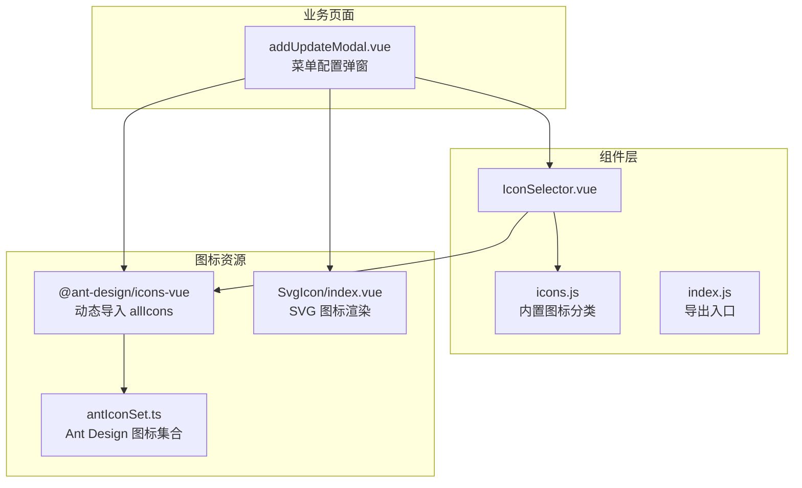
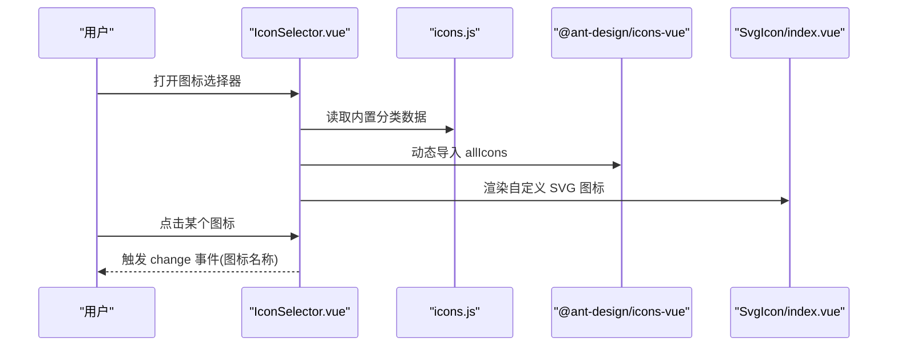
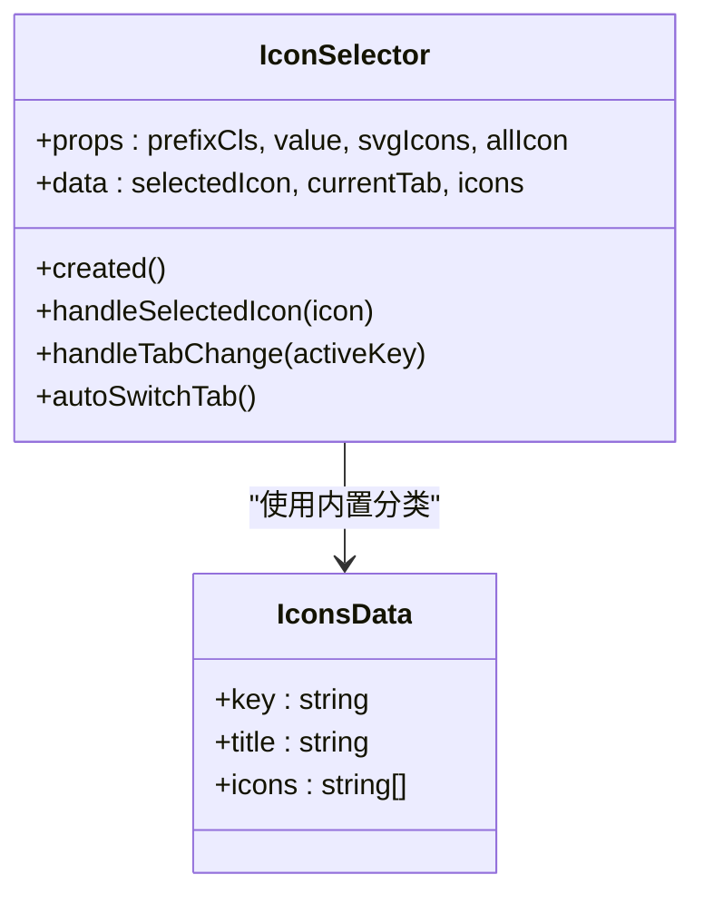
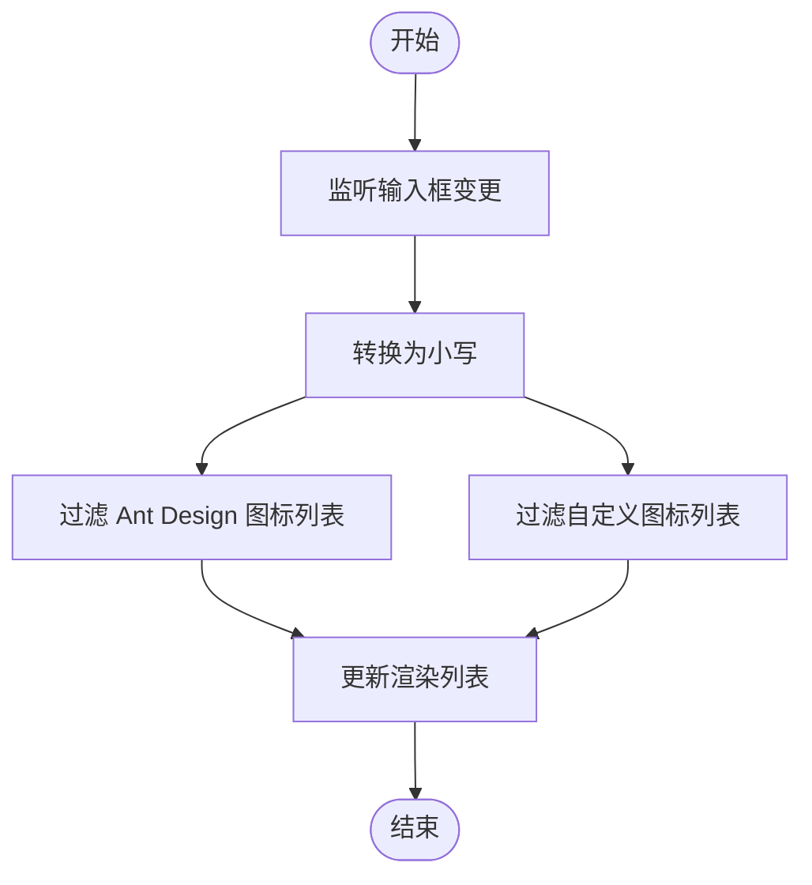
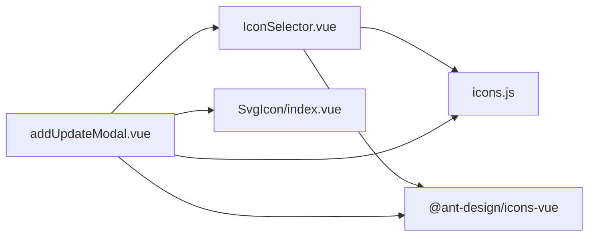

# IconSelector图标选择器

<cite>
**本文引用的文件**
- [IconSelector.vue](file://bear-jia-vue3/src/components/IconSelector/IconSelector.vue)
- [icons.js](file://bear-jia-vue3/src/components/IconSelector/icons.js)
- [index.js](file://bear-jia-vue3/src/components/IconSelector/index.js)
- [README.md](file://bear-jia-vue3/src/components/IconSelector/README.md)
- [addUpdateModal.vue](file://bear-jia-vue3/src/views/system/menu/addUpdateModal.vue)
- [antIconSet.ts](file://bear-jia-vue3/src/assets/antIconSet.ts)
- [SvgIcon/index.vue](file://bear-jia-vue3/src/components/SvgIcon/index.vue)
- [SvgIcon/README.md](file://bear-jia-vue3/src/components/SvgIcon/README.md)
- [themeManager.js](file://bear-jia-vue3/src/utils/theme/themeManager.js)
</cite>

## 目录
1. [引言](#引言)
2. [项目结构](#项目结构)
3. [核心组件](#核心组件)
4. [架构总览](#架构总览)
5. [详细组件分析](#详细组件分析)
6. [依赖关系分析](#依赖关系分析)
7. [性能考量](#性能考量)
8. [故障排查指南](#故障排查指南)
9. [结论](#结论)
10. [附录](#附录)

## 引言
本文件系统化文档化 IconSelector 图标选择器的完整功能，涵盖：
- 图标库管理机制与 icons.js 数据结构
- 搜索过滤功能的实现原理与性能优化策略
- 选中回调机制与与表单组件的集成方式
- 分页加载、图标预览、多选模式等高级功能的使用示例
- API 接口说明、事件回调参数详解及自定义主题配置方法
- 结合实际代码展示在表单和配置面板中的应用

## 项目结构
IconSelector 位于 bear-jia-vue3 工程的组件目录下，配合 Ant Design Vue 图标集与自定义 SVG 图标使用。其典型使用场景出现在系统菜单配置弹窗中，用户通过图标选择器为菜单项选择合适的图标。

图表来源
- [IconSelector.vue](file://bear-jia-vue3/src/components/IconSelector/IconSelector.vue#L1-L110)
- [icons.js](file://bear-jia-vue3/src/components/IconSelector/icons.js#L1-L37)
- [index.js](file://bear-jia-vue3/src/components/IconSelector/index.js#L1-L3)
- [addUpdateModal.vue](file://bear-jia-vue3/src/views/system/menu/addUpdateModal.vue#L280-L479)
- [antIconSet.ts](file://bear-jia-vue3/src/assets/antIconSet.ts#L1-L800)
- [SvgIcon/index.vue](file://bear-jia-vue3/src/components/SvgIcon/index.vue#L1-L106)

章节来源
- [IconSelector.vue](file://bear-jia-vue3/src/components/IconSelector/IconSelector.vue#L1-L110)
- [icons.js](file://bear-jia-vue3/src/components/IconSelector/icons.js#L1-L37)
- [index.js](file://bear-jia-vue3/src/components/IconSelector/index.js#L1-L3)
- [addUpdateModal.vue](file://bear-jia-vue3/src/views/system/menu/addUpdateModal.vue#L280-L479)
- [antIconSet.ts](file://bear-jia-vue3/src/assets/antIconSet.ts#L1-L800)
- [SvgIcon/index.vue](file://bear-jia-vue3/src/components/SvgIcon/index.vue#L1-L106)

## 核心组件
- IconSelector.vue：提供图标选择界面，支持内置分类与自定义 SVG 图标两类来源；通过 change 事件向外抛出选中图标名称。
- icons.js：内置图标分类数据，定义了方向性、提示建议性、编辑类、数据类、网站通用、品牌和标识等分类及其图标清单。
- index.js：统一导出 IconSelector 组件，便于按需引入。
- addUpdateModal.vue：系统菜单配置弹窗，演示 IconSelector 与表单的集成方式，包含搜索过滤、图标预览、选中状态高亮等高级用法。
- antIconSet.ts：Ant Design 图标集合导出，供业务侧动态渲染 Ant Design 图标。
- SvgIcon/index.vue：SVG 图标渲染组件，支持本地 SVG、Sprite、外部链接三种加载方式，用于自定义图标展示。

章节来源
- [IconSelector.vue](file://bear-jia-vue3/src/components/IconSelector/IconSelector.vue#L1-L110)
- [icons.js](file://bear-jia-vue3/src/components/IconSelector/icons.js#L1-L37)
- [index.js](file://bear-jia-vue3/src/components/IconSelector/index.js#L1-L3)
- [addUpdateModal.vue](file://bear-jia-vue3/src/views/system/menu/addUpdateModal.vue#L280-L479)
- [antIconSet.ts](file://bear-jia-vue3/src/assets/antIconSet.ts#L1-L800)
- [SvgIcon/index.vue](file://bear-jia-vue3/src/components/SvgIcon/index.vue#L1-L106)

## 架构总览
IconSelector 的工作流分为“图标数据源”和“UI交互层”两部分：
- 图标数据源
  - 内置分类：icons.js 提供分类与图标清单，IconSelector 在创建时将自定义分类合并到内置分类之前，确保自定义图标优先可见。
  - Ant Design 图标：通过动态导入 allIcons，将 Ant Design 图标以组件形式渲染。
  - 自定义 SVG 图标：通过 allIcon 对象映射 PascalCase 组件名，渲染自定义 SVG 图标。
- UI交互层
  - 标签页：内置分类与自定义分类分别作为标签页展示。
  - 选中回调：点击图标后触发 change 事件，携带选中图标名称。
  - 选中态高亮：根据当前选中图标名称进行高亮显示。

图表来源
- [IconSelector.vue](file://bear-jia-vue3/src/components/IconSelector/IconSelector.vue#L1-L110)
- [icons.js](file://bear-jia-vue3/src/components/IconSelector/icons.js#L1-L37)
- [addUpdateModal.vue](file://bear-jia-vue3/src/views/system/menu/addUpdateModal.vue#L280-L479)
- [SvgIcon/index.vue](file://bear-jia-vue3/src/components/SvgIcon/index.vue#L1-L106)

## 详细组件分析

### IconSelector 组件分析
- 组件职责
  - 提供图标选择界面，支持内置分类与自定义 SVG 图标两类来源。
  - 通过 change 事件向外抛出选中图标名称，供上层表单接收。
- 关键属性
  - prefixCls：容器样式前缀，默认值为 ant-pro-icon-selector。
  - value：当前选中图标名称，双向绑定。
  - svgIcons：自定义 SVG 图标名称数组。
  - allIcon：自定义 SVG 图标组件映射对象。
- 关键行为
  - created 生命周期：将自定义分类插入到内置分类列表首位，自动切换标签页至包含当前选中图标的分类。
  - handleSelectedIcon：更新内部选中状态并触发 change 事件。
  - handleTabChange：记录当前激活标签页。
- UI 与样式
  - 使用 Ant Design Tabs 展示分类。
  - 列表项 hover 与 active 状态高亮，点击切换选中态。

图表来源
- [IconSelector.vue](file://bear-jia-vue3/src/components/IconSelector/IconSelector.vue#L1-L110)
- [icons.js](file://bear-jia-vue3/src/components/IconSelector/icons.js#L1-L37)

章节来源
- [IconSelector.vue](file://bear-jia-vue3/src/components/IconSelector/IconSelector.vue#L1-L110)
- [icons.js](file://bear-jia-vue3/src/components/IconSelector/icons.js#L1-L37)

### 图标库管理机制与 icons.js
- 数据结构
  - 每个分类包含 key、title、icons 三个字段，其中 icons 为图标名称数组。
  - 分类顺序即 UI 展示顺序，自定义分类会优先显示。
- 扩展方法
  - 在 icons.js 中新增分类对象，即可在 IconSelector 中自动出现新分类。
  - 若需添加新图标，只需在对应分类的 icons 数组中追加图标名称。
- 与 Ant Design 图标的衔接
  - 业务侧通过动态导入 allIcons，将 Ant Design 图标名称转换为组件名后渲染。
  - IconSelector 内部对自定义图标与 Ant Design 图标采用不同渲染方式，避免冲突。

章节来源
- [icons.js](file://bear-jia-vue3/src/components/IconSelector/icons.js#L1-L37)
- [addUpdateModal.vue](file://bear-jia-vue3/src/views/system/menu/addUpdateModal.vue#L280-L479)

### 搜索过滤功能实现与性能优化
- 实现原理
  - 在 addUpdateModal.vue 中维护两个过滤后的图标列表：filteredAntIcons 与 filteredCustomIcons。
  - 输入框实时监听用户输入，将输入值转换为小写后对两个列表进行 includes 匹配过滤。
  - 过滤结果直接驱动模板渲染，实现即时预览。
- 性能优化策略
  - 预过滤：在打开弹窗时重置过滤列表为完整列表，避免重复拼接导致的性能问题。
  - 小写缓存：统一转换为小写进行比较，减少大小写差异带来的重复计算。
  - 列表拆分：将 Ant Design 图标与自定义图标分离过滤，降低单次过滤成本。
  - 模板层面：使用 v-for 渲染，避免不必要的 DOM 重建。

图表来源
- [addUpdateModal.vue](file://bear-jia-vue3/src/views/system/menu/addUpdateModal.vue#L362-L372)

章节来源
- [addUpdateModal.vue](file://bear-jia-vue3/src/views/system/menu/addUpdateModal.vue#L362-L372)

### 选中回调机制与表单集成
- 选中回调
  - IconSelector 在 handleSelectedIcon 中更新内部选中状态并触发 change 事件，事件参数为选中图标名称。
- 表单集成
  - 在 addUpdateModal.vue 中，用户点击图标后将选中图标赋值给表单字段，并关闭弹窗。
  - 表单字段与 SvgIcon 组件结合，实现图标预览与选中态高亮。
- 多选模式
  - 当前 IconSelector 未提供多选能力；如需多选，可在上层业务中将图标名称存储为数组并在模板中循环渲染多个图标预览。

章节来源
- [IconSelector.vue](file://bear-jia-vue3/src/components/IconSelector/IconSelector.vue#L71-L82)
- [addUpdateModal.vue](file://bear-jia-vue3/src/views/system/menu/addUpdateModal.vue#L374-L378)
- [SvgIcon/index.vue](file://bear-jia-vue3/src/components/SvgIcon/index.vue#L1-L106)

### 高级功能使用示例
- 分页加载
  - 当前实现未内置分页加载。若图标数量庞大，可考虑在业务侧对图标列表进行分页切片渲染，或在 IconSelector 内部增加虚拟滚动与懒加载策略。
- 图标预览
  - 通过 SvgIcon 组件在表单中预览当前选中图标，支持尺寸与颜色控制。
- 多选模式
  - 通过在业务侧维护图标数组并在模板中循环渲染多个图标预览，实现多选效果。

章节来源
- [addUpdateModal.vue](file://bear-jia-vue3/src/views/system/menu/addUpdateModal.vue#L212-L252)
- [SvgIcon/index.vue](file://bear-jia-vue3/src/components/SvgIcon/index.vue#L1-L106)

### API 接口说明与事件回调
- 组件属性
  - prefixCls：容器样式前缀
  - value：当前选中图标名称
  - svgIcons：自定义 SVG 图标名称数组
  - allIcon：自定义 SVG 图标组件映射对象
- 事件
  - change：当图标选中项发生变化时触发，事件参数为选中图标名称

章节来源
- [IconSelector.vue](file://bear-jia-vue3/src/components/IconSelector/IconSelector.vue#L28-L45)
- [IconSelector.vue](file://bear-jia-vue3/src/components/IconSelector/IconSelector.vue#L71-L82)
- [README.md](file://bear-jia-vue3/src/components/IconSelector/README.md#L43-L49)

### 自定义主题配置方法
- 主题变量
  - 通过 themeManager.js 应用主题色与模式，设置 CSS 变量 --primary-color、--ant-primary-color 等，影响图标高亮与选中态的颜色表现。
- 集成方式
  - 在业务侧初始化主题管理器，应用主题后，IconSelector 的 hover 与 active 高亮颜色会随主题变化而变化。
- 注意事项
  - 若需要更精细的图标颜色控制，可在 SvgIcon 组件中显式指定 color 属性，或通过 CSS 变量覆盖。

章节来源
- [themeManager.js](file://bear-jia-vue3/src/utils/theme/themeManager.js#L1-L372)
- [IconSelector.vue](file://bear-jia-vue3/src/components/IconSelector/IconSelector.vue#L86-L109)

## 依赖关系分析
- IconSelector 依赖
  - icons.js：内置图标分类数据
  - @ant-design/icons-vue：动态导入 allIcons，渲染 Ant Design 图标
  - SvgIcon/index.vue：渲染自定义 SVG 图标
- 业务页面依赖
  - addUpdateModal.vue：引入 IconSelector、SvgIcon、icons.js、antIconSet.ts，实现图标选择、搜索过滤与表单集成

图表来源
- [IconSelector.vue](file://bear-jia-vue3/src/components/IconSelector/IconSelector.vue#L1-L110)
- [icons.js](file://bear-jia-vue3/src/components/IconSelector/icons.js#L1-L37)
- [addUpdateModal.vue](file://bear-jia-vue3/src/views/system/menu/addUpdateModal.vue#L280-L479)
- [SvgIcon/index.vue](file://bear-jia-vue3/src/components/SvgIcon/index.vue#L1-L106)

章节来源
- [IconSelector.vue](file://bear-jia-vue3/src/components/IconSelector/IconSelector.vue#L1-L110)
- [icons.js](file://bear-jia-vue3/src/components/IconSelector/icons.js#L1-L37)
- [addUpdateModal.vue](file://bear-jia-vue3/src/views/system/menu/addUpdateModal.vue#L280-L479)
- [SvgIcon/index.vue](file://bear-jia-vue3/src/components/SvgIcon/index.vue#L1-L106)

## 性能考量
- 列表渲染
  - 使用 v-for 渲染图标，避免不必要的 key 不一致导致的重排。
- 过滤策略
  - 小写缓存与拆分过滤，降低每次输入的计算成本。
- 懒加载与分页
  - 当图标数量较大时，建议在业务侧进行分页或虚拟滚动，减少一次性渲染的节点数量。
- 图标组件复用
  - Ant Design 图标通过动态导入 allIcons，避免静态导入全部图标造成的包体积增大。

[本节为通用性能建议，不直接分析具体文件]

## 故障排查指南
- 图标不显示
  - 检查 allIcon 映射是否正确，确保自定义图标名称与组件名一致。
  - 检查 svgIcons 是否为空或名称格式不匹配。
- 选中态不生效
  - 确认 value 与当前选中图标名称一致，且 IconSelector 内部已执行 autoSwitchTab。
- 搜索无效
  - 确认过滤逻辑是否被调用，输入框是否绑定到正确的响应式变量。
- 颜色异常
  - 检查主题配置是否正确应用，CSS 变量是否被覆盖。

章节来源
- [IconSelector.vue](file://bear-jia-vue3/src/components/IconSelector/IconSelector.vue#L46-L82)
- [addUpdateModal.vue](file://bear-jia-vue3/src/views/system/menu/addUpdateModal.vue#L362-L378)
- [themeManager.js](file://bear-jia-vue3/src/utils/theme/themeManager.js#L1-L372)

## 结论
IconSelector 提供了简洁高效的图标选择能力，结合内置分类与自定义 SVG 图标，满足大多数业务场景需求。通过与表单组件的紧密集成、搜索过滤与主题配置，能够快速构建美观易用的图标选择体验。对于大规模图标库，建议在业务侧引入分页或虚拟滚动策略以进一步提升性能。

[本节为总结性内容，不直接分析具体文件]

## 附录
- 快速上手
  - 在业务页面中引入 IconSelector 并绑定 value，监听 change 事件获取选中图标名称。
  - 通过 svgIcons 与 allIcon 注入自定义图标，确保名称与组件映射一致。
- 最佳实践
  - 将自定义图标名称规范化（如 PascalCase），便于与 Ant Design 图标统一处理。
  - 在表单中结合 SvgIcon 进行图标预览，提升用户体验。

[本节为通用指导，不直接分析具体文件]