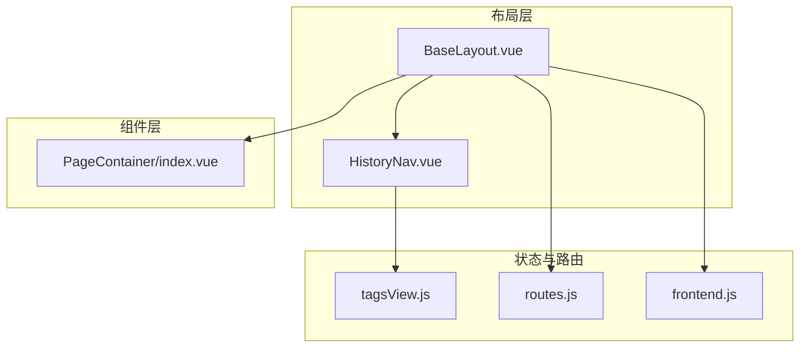
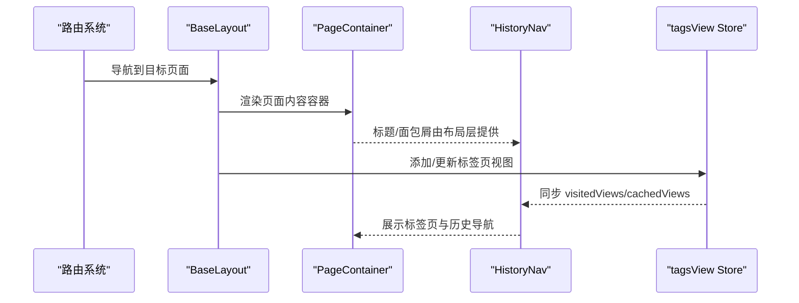
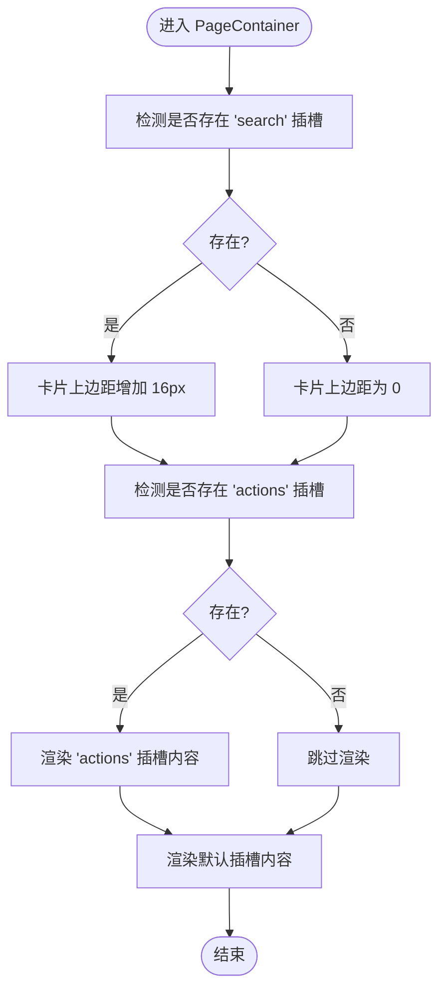
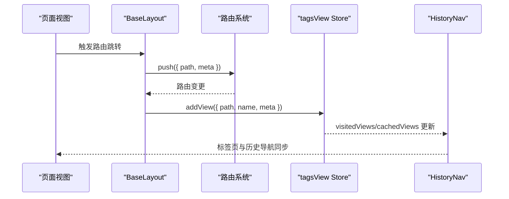
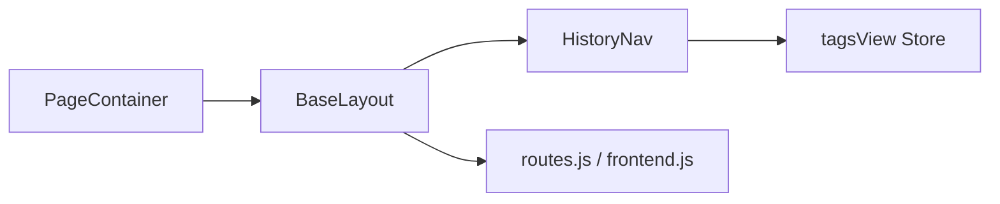

# PageContainer页面容器

<cite>
**本文引用的文件**
- [index.vue](file://bear-jia-vue3/src/components/PageContainer/index.vue)
- [BaseLayout.vue](file://bear-jia-vue3/src/layout/BaseLayout.vue)
- [HistoryNav.vue](file://bear-jia-vue3/src/components/layout/HistoryNav.vue)
- [tagsView.js](file://bear-jia-vue3/src/stores/tabsView.js)
- [routes.js](file://bear-jia-vue3/src/router/routes.js)
- [frontend.js](file://bear-jia-vue3/src/router/frontend.js)
- [index.vue](file://bear-jia-vue3/src/views/tool/build/index.vue)
- [README.md](file://bear-jia-vue3/README.md)
</cite>

## 目录
1. [引言](#引言)
2. [项目结构](#项目结构)
3. [核心组件](#核心组件)
4. [架构总览](#架构总览)
5. [详细组件分析](#详细组件分析)
6. [依赖关系分析](#依赖关系分析)
7. [性能考量](#性能考量)
8. [故障排查指南](#故障排查指南)
9. [结论](#结论)
10. [附录](#附录)

## 引言
PageContainer 是一个轻量级的页面容器组件，用于在页面布局中承载内容主体，提供统一的卡片式内容区域、滚动条美化以及插槽化的标题/操作区布局能力。它不直接渲染标题或面包屑，而是通过插槽机制与布局层组件协作，实现“标题/面包屑/操作区”的灵活组合。该组件强调响应式与主题一致性，适合在多布局模式（侧边、顶部、混合、分栏、抽屉）下统一页面内容区域的视觉与交互体验。

## 项目结构
PageContainer 位于公共组件目录，配合布局层组件（如 BaseLayout、HistoryNav）与路由系统共同构成页面容器与导航体系：
- 组件层：PageContainer 提供内容容器与滚动条样式
- 布局层：BaseLayout 统一承载头部、历史导航与内容区域
- 导航层：HistoryNav 与 tagsView 状态管理协同，提供标签页与历史导航
- 路由层：routes.js 与 frontend.js 定义页面元信息（如标题）

图示来源
- [BaseLayout.vue](file://bear-jia-vue3/src/layout/BaseLayout.vue#L1-L120)
- [HistoryNav.vue](file://bear-jia-vue3/src/components/layout/HistoryNav.vue#L1-L60)
- [index.vue](file://bear-jia-vue3/src/components/PageContainer/index.vue#L1-L40)
- [tagsView.js](file://bear-jia-vue3/src/stores/tabsView.js#L1-L55)
- [routes.js](file://bear-jia-vue3/src/router/routes.js#L1-L40)
- [frontend.js](file://bear-jia-vue3/src/router/frontend.js#L49-L79)

章节来源
- [README.md](file://bear-jia-vue3/README.md#L196-L210)

## 核心组件
- PageContainer：提供页面内容容器、卡片布局、滚动条美化与插槽扩展点
- BaseLayout：统一布局容器，承载头部、历史导航与内容区域
- HistoryNav：历史导航与标签页展示，与 tagsView 协同
- tagsView：标签页状态管理（visitedViews/cachedViews）
- 路由系统：routes.js 与 frontend.js 定义页面元信息（title 等）

章节来源
- [index.vue](file://bear-jia-vue3/src/components/PageContainer/index.vue#L1-L40)
- [BaseLayout.vue](file://bear-jia-vue3/src/layout/BaseLayout.vue#L1-L120)
- [HistoryNav.vue](file://bear-jia-vue3/src/components/layout/HistoryNav.vue#L1-L60)
- [tagsView.js](file://bear-jia-vue3/src/stores/tabsView.js#L1-L55)
- [routes.js](file://bear-jia-vue3/src/router/routes.js#L1-L40)
- [frontend.js](file://bear-jia-vue3/src/router/frontend.js#L49-L79)

## 架构总览
PageContainer 作为内容容器，通常被包裹在 BaseLayout 的内容区域中；HistoryNav 与 tagsView 提供标签页与历史导航能力；路由系统通过 meta.title 等元信息驱动标题与标签页标题。

图示来源
- [BaseLayout.vue](file://bear-jia-vue3/src/layout/BaseLayout.vue#L1-L120)
- [HistoryNav.vue](file://bear-jia-vue3/src/components/layout/HistoryNav.vue#L1-L60)
- [tagsView.js](file://bear-jia-vue3/src/stores/tabsView.js#L1-L55)
- [routes.js](file://bear-jia-vue3/src/router/routes.js#L1-L40)

## 详细组件分析

### PageContainer 组件结构与职责
- 结构组成
  - 外层容器：用于统一高度与滚动条样式
  - 卡片容器：承载页面主体内容，支持内嵌插槽
- 插槽扩展
  - search：用于放置搜索区域，当存在该插槽时自动调整卡片上边距
  - actions：用于放置操作按钮区，当存在该插槽时显示
  - 默认插槽：页面主要内容
- 样式特性
  - 统一高度：基于视口高度减去头部与历史导航高度
  - 滚动条美化：自定义滚动条宽度与暗色主题适配
  - 卡片背景与间距：与主题变量保持一致

图示来源
- [index.vue](file://bear-jia-vue3/src/components/PageContainer/index.vue#L1-L40)

章节来源
- [index.vue](file://bear-jia-vue3/src/components/PageContainer/index.vue#L1-L144)

### 标题区域、面包屑导航与操作按钮区的设计
- 标题区域
  - PageContainer 不直接渲染标题，标题通常由布局层（如 BaseLayout）或页面级组件提供
  - 路由元信息（meta.title）用于驱动标签页与标题显示
- 面包屑导航
  - PageContainer 不直接渲染面包屑，面包屑通常由布局层或页面级组件提供
  - HistoryNav 与 tagsView 协同，依据 visitedViews/cachedViews 生成标签页与导航
- 操作按钮区
  - PageContainer 提供 actions 插槽，用于放置批量操作、刷新、导出等按钮
  - 通过插槽与 ProTable/TableActionBar 等组件配合，形成统一的操作区布局

章节来源
- [BaseLayout.vue](file://bear-jia-vue3/src/layout/BaseLayout.vue#L1-L120)
- [HistoryNav.vue](file://bear-jia-vue3/src/components/layout/HistoryNav.vue#L1-L120)
- [tagsView.js](file://bear-jia-vue3/src/stores/tabsView.js#L1-L55)
- [routes.js](file://bear-jia-vue3/src/router/routes.js#L1-L40)

### 动态标题绑定与自定义面包屑路径
- 动态标题绑定
  - 路由元信息（meta.title）用于设置页面标题与标签页标题
  - 示例：在路由配置中设置 meta.title，HistoryNav 会读取该标题用于标签页显示
- 自定义面包屑路径
  - PageContainer 不直接渲染面包屑，面包屑通常由页面级组件或布局层提供
  - 可通过页面级插槽或自定义组件实现面包屑逻辑

章节来源
- [routes.js](file://bear-jia-vue3/src/router/routes.js#L1-L40)
- [frontend.js](file://bear-jia-vue3/src/router/frontend.js#L49-L79)
- [HistoryNav.vue](file://bear-jia-vue3/src/components/layout/HistoryNav.vue#L1-L120)

### 操作区按钮布局配置
- 使用 actions 插槽在 PageContainer 中放置操作按钮
- 与 ProTable/TableActionBar 等组件配合，实现批量操作、刷新、导出等按钮的统一布局
- 示例：在页面中使用 PageContainer 包裹内容，并在 actions 插槽中放置按钮

章节来源
- [index.vue](file://bear-jia-vue3/src/components/PageContainer/index.vue#L1-L40)
- [index.vue](file://bear-jia-vue3/src/views/tool/build/index.vue#L1-L20)

### 与路由系统和标签页（tagsView）的集成逻辑
- 路由系统
  - routes.js 与 frontend.js 定义页面元信息（如 title、icon、keepAlive 等）
  - BaseLayout 在导航时通过路由元信息更新标题与标签页
- 标签页（tagsView）
  - tagsView 管理 visitedViews 与 cachedViews，用于标签页的增删改查
  - HistoryNav 读取 tagsView 状态，渲染标签页列表与右键菜单

图示来源
- [BaseLayout.vue](file://bear-jia-vue3/src/layout/BaseLayout.vue#L592-L730)
- [tagsView.js](file://bear-jia-vue3/src/stores/tabsView.js#L1-L55)
- [HistoryNav.vue](file://bear-jia-vue3/src/components/layout/HistoryNav.vue#L1-L120)
- [routes.js](file://bear-jia-vue3/src/router/routes.js#L1-L40)

章节来源
- [BaseLayout.vue](file://bear-jia-vue3/src/layout/BaseLayout.vue#L592-L730)
- [tagsView.js](file://bear-jia-vue3/src/stores/tabsView.js#L1-L55)
- [HistoryNav.vue](file://bear-jia-vue3/src/components/layout/HistoryNav.vue#L1-L120)

### Props 参数说明与插槽使用
- 插槽
  - search：搜索区域插槽，存在时卡片上边距自动增加
  - actions：操作按钮区插槽，存在时渲染
  - 默认插槽：页面主要内容
- 无显式 props，通过插槽与内部计算属性实现行为差异

章节来源
- [index.vue](file://bear-jia-vue3/src/components/PageContainer/index.vue#L1-L40)

### 响应式设计特性
- 高度自适应：基于视口高度减去头部与历史导航高度，保证内容区域占满剩余空间
- 滚动条美化：统一滚动条宽度与暗色主题适配，提升视觉一致性
- 卡片布局：卡片背景与间距与主题变量保持一致，适配亮/暗主题

章节来源
- [index.vue](file://bear-jia-vue3/src/components/PageContainer/index.vue#L20-L144)

## 依赖关系分析
- PageContainer 依赖
  - 布局层：BaseLayout 提供内容区域与头部/导航
  - 导航层：HistoryNav 与 tagsView 协同提供标签页与历史导航
  - 路由系统：routes.js 与 frontend.js 提供页面元信息
- 组件耦合
  - PageContainer 与布局层松耦合，通过插槽扩展实现标题/面包屑/操作区的灵活组合
  - 与 tagsView 的耦合体现在标签页状态管理，非直接渲染

图示来源
- [index.vue](file://bear-jia-vue3/src/components/PageContainer/index.vue#L1-L40)
- [BaseLayout.vue](file://bear-jia-vue3/src/layout/BaseLayout.vue#L1-L120)
- [HistoryNav.vue](file://bear-jia-vue3/src/components/layout/HistoryNav.vue#L1-L60)
- [tagsView.js](file://bear-jia-vue3/src/stores/tabsView.js#L1-L55)
- [routes.js](file://bear-jia-vue3/src/router/routes.js#L1-L40)
- [frontend.js](file://bear-jia-vue3/src/router/frontend.js#L49-L79)

## 性能考量
- 滚动条样式仅影响视觉，不引入额外计算开销
- 通过插槽判断（hasSearchSlot/hasActionsSlot）仅在组件挂载时计算一次，性能开销极低
- 内容区域滚动由容器自身控制，避免全局滚动冲突

## 故障排查指南
- 标题未显示
  - 检查路由 meta.title 是否设置
  - 确认 BaseLayout 与 HistoryNav 正常渲染
- 标签页不更新
  - 检查 tagsView 是否正确 addView
  - 确认 HistoryNav 读取到 visitedViews/cachedViews
- 操作按钮不显示
  - 确认 actions 插槽是否正确传入
  - 确认 PageContainer 是否包裹在 BaseLayout 内

章节来源
- [routes.js](file://bear-jia-vue3/src/router/routes.js#L1-L40)
- [tagsView.js](file://bear-jia-vue3/src/stores/tabsView.js#L1-L55)
- [HistoryNav.vue](file://bear-jia-vue3/src/components/layout/HistoryNav.vue#L1-L120)
- [BaseLayout.vue](file://bear-jia-vue3/src/layout/BaseLayout.vue#L1-L120)

## 结论
PageContainer 通过插槽化设计与布局层组件协作，实现了标题/面包屑/操作区的灵活组合与统一的页面内容容器体验。其简洁的 props 与强大的插槽扩展能力，使其在多布局模式下保持一致的视觉与交互表现。结合路由系统与标签页状态管理，PageContainer 成为页面布局中的关键基础设施。

## 附录
- 典型应用场景
  - 列表页：使用 PageContainer 包裹 ProTable，通过 actions 插槽放置批量操作按钮
  - 表单页：使用 PageContainer 包裹表单内容，通过 search 插槽放置筛选条件
  - 设计器/画布页：PageContainer 作为画布容器，内部通过深度样式控制子元素高度与滚动

章节来源
- [index.vue](file://bear-jia-vue3/src/views/tool/build/index.vue#L1-L20)
- [index.vue](file://bear-jia-vue3/src/components/PageContainer/index.vue#L1-L40)