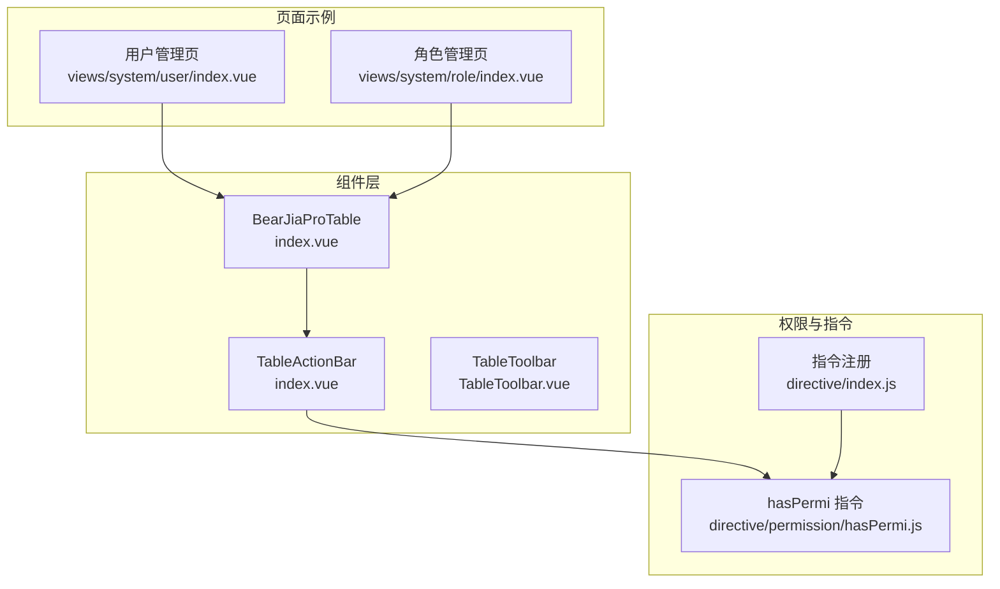
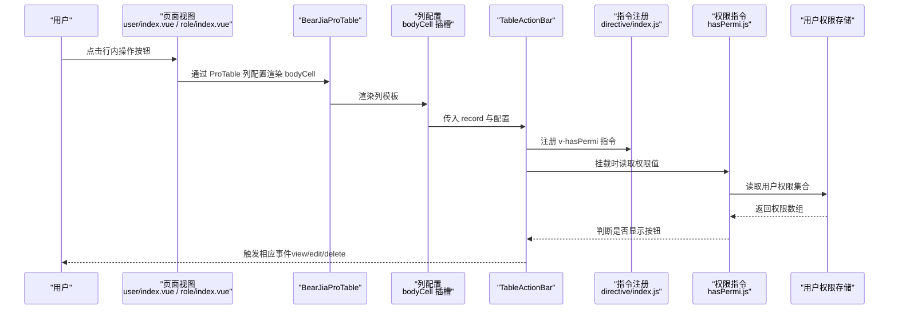
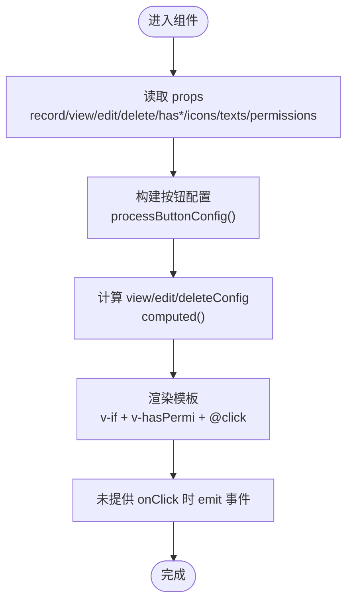
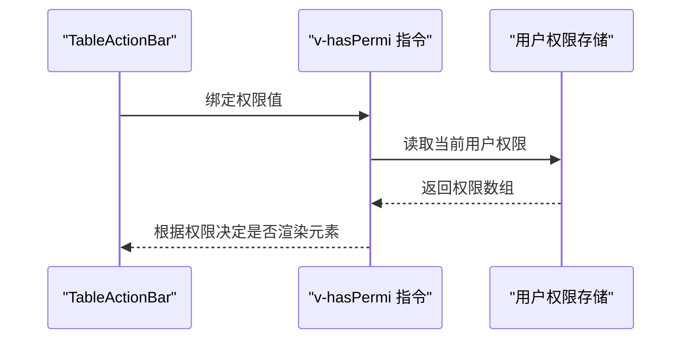
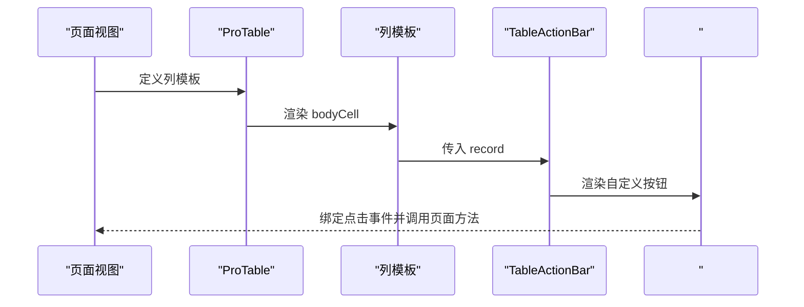
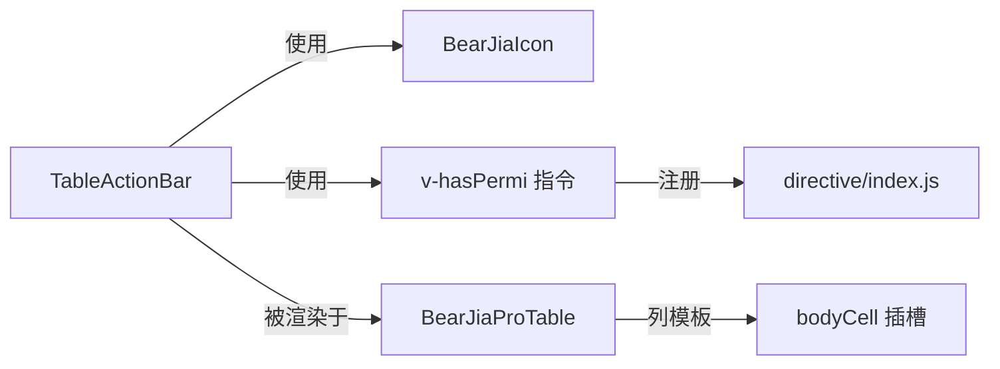

# TableActionBar表格操作栏

<cite>
**本文引用的文件列表**
- [index.vue](file://bear-jia-vue3/src/components/TableActionBar/index.vue)
- [hasPermi.js](file://bear-jia-vue3/src/directive/permission/hasPermi.js)
- [index.js](file://bear-jia-vue3/src/directive/index.js)
- [index.vue](file://bear-jia-vue3/src/views/system/user/index.vue)
- [index.vue](file://bear-jia-vue3/src/views/system/role/index.vue)
- [index.vue](file://bear-jia-vue3/src/components/BearJiaProTable/index.vue)
- [TableToolbar.vue](file://bear-jia-vue3/src/components/BearJiaProTable/TableToolbar.vue)
- [README.md](file://bear-jia-vue3/src/style/README.md)
</cite>

## 目录
1. [简介](#简介)
2. [项目结构](#项目结构)
3. [核心组件](#核心组件)
4. [架构总览](#架构总览)
5. [详细组件分析](#详细组件分析)
6. [依赖分析](#依赖分析)
7. [性能考量](#性能考量)
8. [故障排查指南](#故障排查指南)
9. [结论](#结论)
10. [附录](#附录)

## 简介
TableActionBar 是一个为表格行内提供“查看、修改、删除”等标准操作按钮的轻量级组件，并通过插槽扩展支持自定义操作按钮。它内置了按钮级权限控制能力，结合全局权限指令 v-hasPermi 实现对按钮的显示隐藏与交互安全控制；同时提供统一的样式规范，便于在不同主题下保持一致的视觉体验。

该组件广泛应用于 BearJiaProTable 表格中，作为行内操作列的渲染单元，配合 ProTable 的列配置与插槽机制，实现灵活的业务操作按钮布局。

## 项目结构
TableActionBar 所在位置与相关依赖如下：
- 组件文件：bear-jia-vue3/src/components/TableActionBar/index.vue
- 权限指令：bear-jia-vue3/src/directive/permission/hasPermi.js
- 指令注册：bear-jia-vue3/src/directive/index.js
- 使用示例（用户管理页）：bear-jia-vue3/src/views/system/user/index.vue
- 使用示例（角色管理页）：bear-jia-vue3/src/views/system/role/index.vue
- 表格容器：bear-jia-vue3/src/components/BearJiaProTable/index.vue
- 表格工具栏：bear-jia-vue3/src/components/BearJiaProTable/TableToolbar.vue
- 样式规范：bear-jia-vue3/src/style/README.md

图表来源
- [index.vue](file://bear-jia-vue3/src/components/TableActionBar/index.vue#L1-L60)
- [hasPermi.js](file://bear-jia-vue3/src/directive/permission/hasPermi.js#L1-L35)
- [index.js](file://bear-jia-vue3/src/directive/index.js#L1-L24)
- [index.vue](file://bear-jia-vue3/src/views/system/user/index.vue#L1-L120)
- [index.vue](file://bear-jia-vue3/src/views/system/role/index.vue#L1-L120)
- [index.vue](file://bear-jia-vue3/src/components/BearJiaProTable/index.vue#L1-L120)
- [TableToolbar.vue](file://bear-jia-vue3/src/components/BearJiaProTable/TableToolbar.vue#L1-L60)

章节来源
- [index.vue](file://bear-jia-vue3/src/components/TableActionBar/index.vue#L1-L120)
- [hasPermi.js](file://bear-jia-vue3/src/directive/permission/hasPermi.js#L1-L35)
- [index.js](file://bear-jia-vue3/src/directive/index.js#L1-L24)
- [index.vue](file://bear-jia-vue3/src/views/system/user/index.vue#L1-L120)
- [index.vue](file://bear-jia-vue3/src/views/system/role/index.vue#L1-L120)
- [index.vue](file://bear-jia-vue3/src/components/BearJiaProTable/index.vue#L1-L120)
- [TableToolbar.vue](file://bear-jia-vue3/src/components/BearJiaProTable/TableToolbar.vue#L1-L60)

## 核心组件
- 组件职责
  - 提供“查看、修改、删除”三类标准按钮的统一渲染与事件发射。
  - 支持通过对象配置与布尔配置两种方式控制按钮显示、文案、图标与权限。
  - 通过插槽扩展自定义操作按钮，支持向插槽传递当前行记录。
  - 内置按钮级权限控制，基于 v-hasPermi 指令实现按钮可见性校验。
  - 提供统一的按钮样式类名，便于在暗黑主题下自动适配。

- 关键特性
  - 配置优先级：对象配置 > 布尔配置 > 旧参数兼容。
  - 事件发射：emit('view'|'edit'|'delete', record)。
  - 插槽：默认插槽与具名插槽 actions，用于自定义按钮。
  - 样式：提供 action-btn 及多种语义化类名，支持暗黑主题。

章节来源
- [index.vue](file://bear-jia-vue3/src/components/TableActionBar/index.vue#L55-L196)
- [index.vue](file://bear-jia-vue3/src/components/TableActionBar/index.vue#L198-L295)

## 架构总览
TableActionBar 在 BearJiaProTable 的行内列中被渲染，通常固定在表格右侧，随列配置插入到 ProTable 的 bodyCell 插槽中。权限控制通过 v-hasPermi 指令在挂载阶段判断当前用户的权限集合，决定按钮是否渲染。

图表来源
- [index.vue](file://bear-jia-vue3/src/views/system/user/index.vue#L40-L75)
- [index.vue](file://bear-jia-vue3/src/views/system/role/index.vue#L20-L55)
- [index.vue](file://bear-jia-vue3/src/components/BearJiaProTable/index.vue#L60-L90)
- [index.js](file://bear-jia-vue3/src/directive/index.js#L1-L24)
- [hasPermi.js](file://bear-jia-vue3/src/directive/permission/hasPermi.js#L1-L35)

## 详细组件分析

### 组件结构与数据流
- 属性与配置
  - record：当前行数据，用于事件回调与插槽透传。
  - view/edit/delete：支持布尔或对象配置，对象可包含 show、text、icon、permissions、onClick 等字段。
  - hasView/hasEdit/hasDelete：旧参数兼容，用于布尔开关。
  - icons/texts/permissions：旧参数兼容，用于统一设置图标、文案与权限。
- 事件
  - emit('view'|'edit'|'delete', record)：当按钮被点击且未提供 onClick 时触发。
- 插槽
  - #view/#edit/#delete：替换对应标准按钮的渲染。
  - #actions：自定义按钮插槽，接收 { record }。
  - 默认插槽：向后兼容，用于自定义按钮。

图表来源
- [index.vue](file://bear-jia-vue3/src/components/TableActionBar/index.vue#L55-L196)

章节来源
- [index.vue](file://bear-jia-vue3/src/components/TableActionBar/index.vue#L55-L196)

### 样式规范与主题适配
- 统一样式类名
  - .action-btn：基础按钮样式。
  - .view-btn/.edit-btn/.delete-btn/.custom-btn/.warning-btn/.info-btn/.primary-btn：语义化颜色方案。
- 暗黑主题支持
  - 通过 :global(.dark-theme) 选择器在暗黑主题下自动调整背景与文字颜色。
- 响应式布局
  - 组件内部采用内联弹性布局，按钮间距较小，适合在固定列中紧凑展示。
  - BearJiaProTable 提供整体响应式能力（如列设置、密度切换），TableActionBar 本身不直接处理屏幕尺寸变化，但可与 ProTable 的列设置配合在窄屏下减少列宽或隐藏列。

章节来源
- [index.vue](file://bear-jia-vue3/src/components/TableActionBar/index.vue#L198-L295)
- [README.md](file://bear-jia-vue3/src/style/README.md#L150-L200)
- [TableToolbar.vue](file://bear-jia-vue3/src/components/BearJiaProTable/TableToolbar.vue#L1-L60)

### 权限指令集成机制
- 指令行为
  - mounted 钩子中读取绑定值（权限数组），若为空则默认显示；否则与用户权限集合比对，不满足条件则移除 DOM。
  - 支持通配权限标记，满足即显示。
- 在组件中的应用
  - 每个按钮的 permissions 字段可单独配置，TableActionBar 会将该值传递给 v-hasPermi 指令。
  - 指令注册在应用入口处完成，组件无需额外导入即可使用。

图表来源
- [hasPermi.js](file://bear-jia-vue3/src/directive/permission/hasPermi.js#L1-L35)
- [index.js](file://bear-jia-vue3/src/directive/index.js#L1-L24)
- [index.vue](file://bear-jia-vue3/src/components/TableActionBar/index.vue#L1-L60)

章节来源
- [hasPermi.js](file://bear-jia-vue3/src/directive/permission/hasPermi.js#L1-L35)
- [index.js](file://bear-jia-vue3/src/directive/index.js#L1-L24)
- [index.vue](file://bear-jia-vue3/src/components/TableActionBar/index.vue#L1-L60)

### 自定义操作按钮插槽与事件绑定
- 使用方式
  - 在 ProTable 的列模板中插入 TableActionBar，并通过 #actions 插槽添加自定义按钮。
  - 插槽参数 { record } 可直接用于自定义按钮的点击事件处理。
- 示例参考
  - 用户管理页：在“用户”表格中，通过 #actions 插槽添加“重置密码”按钮。
  - 角色管理页：在“角色”表格中，通过 #actions 插槽添加“分配用户”按钮。

图表来源
- [index.vue](file://bear-jia-vue3/src/views/system/user/index.vue#L40-L75)
- [index.vue](file://bear-jia-vue3/src/views/system/role/index.vue#L20-L55)

章节来源
- [index.vue](file://bear-jia-vue3/src/views/system/user/index.vue#L40-L75)
- [index.vue](file://bear-jia-vue3/src/views/system/role/index.vue#L20-L55)

### API 接口
- Props
  - record: Object
  - view: Object | Boolean
  - edit: Object | Boolean
  - delete: Object | Boolean
  - hasView/hasEdit/hasDelete: Boolean（旧参数，兼容）
  - icons/texts/permissions: Object（旧参数，兼容）
- Emits
  - view(record)
  - edit(record)
  - delete(record)
- Slots
  - #view：替换“查看”按钮
  - #edit：替换“修改”按钮
  - #delete：替换“删除”按钮
  - #actions：自定义按钮插槽，参数 { record }
  - 默认插槽：向后兼容

章节来源
- [index.vue](file://bear-jia-vue3/src/components/TableActionBar/index.vue#L55-L196)

## 依赖分析
- 组件依赖
  - Vue 响应式与模板语法（setup、computed、defineProps/defineEmits）
  - 图标组件 BearJiaIcon（用于显示按钮图标）
  - 权限指令 v-hasPermi（用于按钮级权限控制）
- 与 ProTable 的关系
  - 通过 ProTable 的 bodyCell 插槽注入到表格列中，作为行内操作列渲染。
  - ProTable 提供列配置、密度切换、全屏等工具能力，TableActionBar 专注按钮渲染与权限控制。
- 与指令系统的耦合
  - 通过 directive/index.js 注册 v-hasPermi，组件内直接使用指令，降低耦合度。

图表来源
- [index.vue](file://bear-jia-vue3/src/components/TableActionBar/index.vue#L1-L60)
- [index.js](file://bear-jia-vue3/src/directive/index.js#L1-L24)
- [index.vue](file://bear-jia-vue3/src/components/BearJiaProTable/index.vue#L60-L90)

章节来源
- [index.vue](file://bear-jia-vue3/src/components/TableActionBar/index.vue#L1-L60)
- [index.js](file://bear-jia-vue3/src/directive/index.js#L1-L24)
- [index.vue](file://bear-jia-vue3/src/components/BearJiaProTable/index.vue#L60-L90)

## 性能考量
- 渲染开销
  - 按钮数量有限（最多 3 个标准按钮 + 自定义按钮），渲染成本极低。
  - 使用 computed 缓存按钮配置，避免重复计算。
- 事件处理
  - 事件通过 emit 触发，避免在模板中直接执行复杂逻辑。
- 权限判断
  - 指令在 mounted 阶段一次性判断，后续不会重新渲染按钮，减少不必要的 DOM 操作。
- 样式体积
  - 样式集中在组件内，避免全局污染；暗黑主题适配通过 :global 限定作用域，避免过度嵌套。

[本节为通用性能建议，不涉及具体文件分析]

## 故障排查指南
- 按钮不显示
  - 检查 permissions 或 v-hasPermi 绑定值是否正确传入，确保权限数组非空且包含有效权限。
  - 若未传入权限值，指令默认显示按钮；若传入空数组，将不显示按钮。
  - 参考路径：[hasPermi.js](file://bear-jia-vue3/src/directive/permission/hasPermi.js#L1-L35)
- 事件未触发
  - 若提供了 onClick，则不会触发 emit；请确认是否需要自定义 onClick。
  - 参考路径：[index.vue](file://bear-jia-vue3/src/components/TableActionBar/index.vue#L120-L170)
- 自定义按钮无效
  - 确认在 ProTable 的列模板中正确使用 #actions 插槽，并传入 { record }。
  - 参考路径：[index.vue](file://bear-jia-vue3/src/views/system/user/index.vue#L40-L75)
  - 参考路径：[index.vue](file://bear-jia-vue3/src/views/system/role/index.vue#L20-L55)
- 暗黑主题样式异常
  - 确保父容器存在 dark-theme 类，以便样式生效。
  - 参考路径：[index.vue](file://bear-jia-vue3/src/components/TableActionBar/index.vue#L255-L293)

章节来源
- [hasPermi.js](file://bear-jia-vue3/src/directive/permission/hasPermi.js#L1-L35)
- [index.vue](file://bear-jia-vue3/src/components/TableActionBar/index.vue#L120-L170)
- [index.vue](file://bear-jia-vue3/src/views/system/user/index.vue#L40-L75)
- [index.vue](file://bear-jia-vue3/src/views/system/role/index.vue#L20-L55)
- [index.vue](file://bear-jia-vue3/src/components/TableActionBar/index.vue#L255-L293)

## 结论
TableActionBar 通过简洁的 API、灵活的插槽与完善的权限控制，为表格行内操作提供了高复用、易扩展的解决方案。结合 BearJiaProTable 的列配置与工具栏能力，可在不同业务场景快速落地“查看、修改、删除”等标准操作，并通过自定义插槽满足多样化的业务需求。其样式规范与主题适配保证了在不同环境下的一致体验。

[本节为总结性内容，不涉及具体文件分析]

## 附录

### 使用示例（路径引用）
- 用户管理页：在“用户”表格中使用 TableActionBar 并添加“重置密码”自定义按钮
  - 参考路径：[index.vue](file://bear-jia-vue3/src/views/system/user/index.vue#L40-L75)
- 角色管理页：在“角色”表格中使用 TableActionBar 并添加“分配用户”自定义按钮
  - 参考路径：[index.vue](file://bear-jia-vue3/src/views/system/role/index.vue#L20-L55)

### 响应式布局适配策略
- 组件自身
  - 采用内联弹性布局，按钮间距小，适合固定列紧凑展示。
- ProTable 层面
  - 通过列设置、密度切换、全屏等功能，在窄屏或移动端减少列宽或隐藏列，提升可读性。
  - 参考路径：[TableToolbar.vue](file://bear-jia-vue3/src/components/BearJiaProTable/TableToolbar.vue#L1-L60)
  - 参考路径：[index.vue](file://bear-jia-vue3/src/components/BearJiaProTable/index.vue#L1-L120)