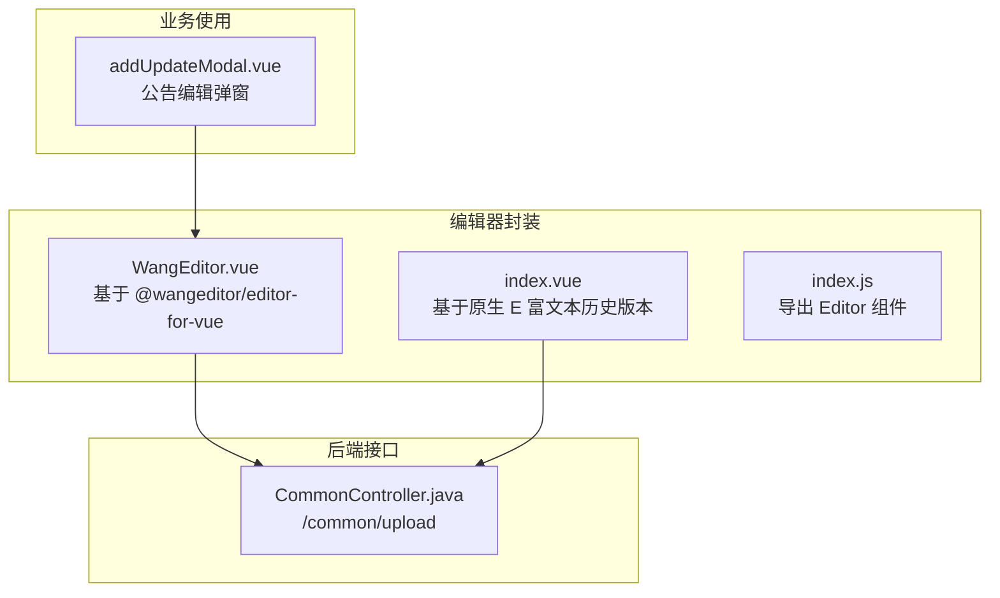
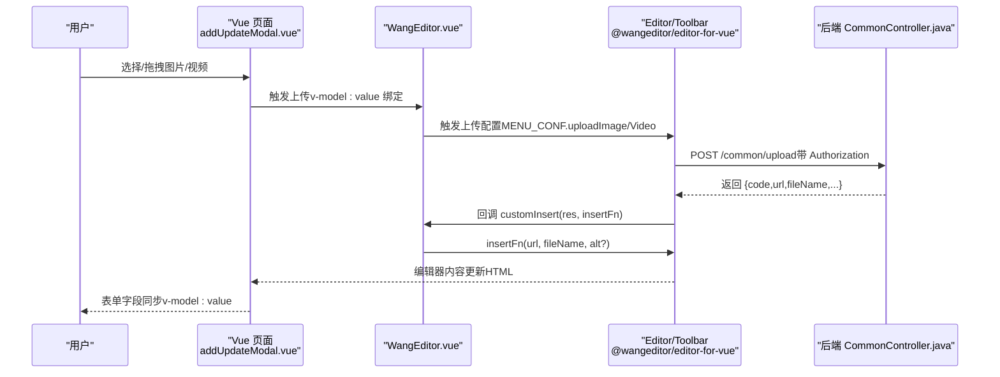
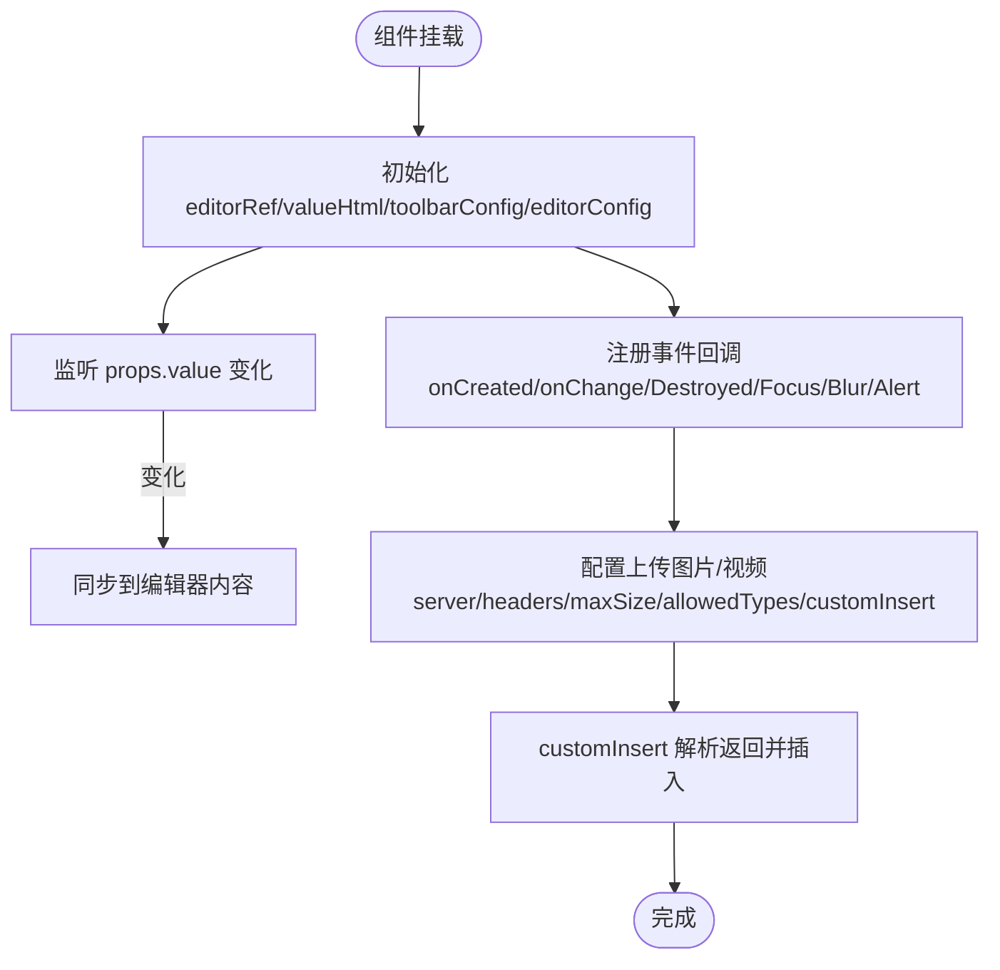
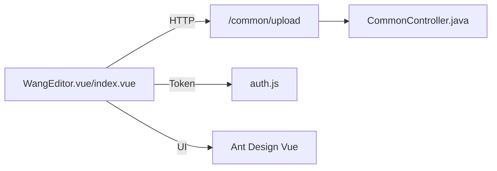

# WangEditor富文本编辑器

<cite>
**本文引用的文件**
- [WangEditor.vue](file://bear-jia-vue3/src/components/editor/WangEditor.vue)
- [index.vue](file://bear-jia-vue3/src/components/editor/index.vue)
- [index.js](file://bear-jia-vue3/src/components/editor/index.js)
- [addUpdateModal.vue](file://bear-jia-vue3/src/views/system/notice/addUpdateModal.vue)
- [CommonController.java](file://bear-jia-vue3/bearjia-admin-backend/src/main/java/com/avaxiaobear/module/common/CommonController.java)
- [package.json](file://bear-jia-vue3/package.json)
- [auth.js](file://bear-jia-vue3/src/utils/auth.js)
</cite>

## 目录
1. [简介](#简介)
2. [项目结构](#项目结构)
3. [核心组件](#核心组件)
4. [架构总览](#架构总览)
5. [详细组件分析](#详细组件分析)
6. [依赖关系分析](#依赖关系分析)
7. [性能与可用性考量](#性能与可用性考量)
8. [故障排查指南](#故障排查指南)
9. [结论](#结论)
10. [附录：配置参数、事件与API](#附录配置参数事件与api)

## 简介
本文件面向前端与后端开发者，系统性解析本仓库中对 WangEditor 富文本编辑器的封装与扩展实践，重点覆盖：
- 编辑器初始化与动态更新机制（工具栏、上传接口、占位符、只读模式等）
- 图片/视频等多媒体上传处理流程（含与后端通用上传接口的对接）
- 内容校验规则与表单验证协同工作模式
- 自定义插件、命令扩展、事件监听等高级能力的开发指引
- 完整配置参数说明、事件列表、方法API与典型应用场景示例

## 项目结构
围绕 WangEditor 的前端封装位于 bear-jia-vue3/src/components/editor 下，包含两个版本的封装组件与导出入口；同时在业务页面中通过表单进行集成与校验。

图表来源
- [WangEditor.vue](file://bear-jia-vue3/src/components/editor/WangEditor.vue#L1-L273)
- [index.vue](file://bear-jia-vue3/src/components/editor/index.vue#L1-L293)
- [index.js](file://bear-jia-vue3/src/components/editor/index.js#L1-L4)
- [addUpdateModal.vue](file://bear-jia-vue3/src/views/system/notice/addUpdateModal.vue#L1-L129)
- [CommonController.java](file://bear-jia-vue3/bearjia-admin-backend/src/main/java/com/avaxiaobear/module/common/CommonController.java#L1-L110)

章节来源
- [WangEditor.vue](file://bear-jia-vue3/src/components/editor/WangEditor.vue#L1-L273)
- [index.vue](file://bear-jia-vue3/src/components/editor/index.vue#L1-L293)
- [index.js](file://bear-jia-vue3/src/components/editor/index.js#L1-L4)
- [addUpdateModal.vue](file://bear-jia-vue3/src/views/system/notice/addUpdateModal.vue#L1-L129)
- [CommonController.java](file://bear-jia-vue3/bearjia-admin-backend/src/main/java/com/avaxiaobear/module/common/CommonController.java#L1-L110)

## 核心组件
- WangEditor.vue：基于 @wangeditor/editor-for-vue 的 Vue3 封装，支持工具栏、编辑器配置、事件回调、上传图片/视频、只读模式、占位符等。
- index.vue：基于原生 E 富文本的历史封装，保留了部分配置与上传钩子，便于对比与迁移。
- index.js：统一导出 Editor 组件，便于按需引入。

章节来源
- [WangEditor.vue](file://bear-jia-vue3/src/components/editor/WangEditor.vue#L1-L273)
- [index.vue](file://bear-jia-vue3/src/components/editor/index.vue#L1-L293)
- [index.js](file://bear-jia-vue3/src/components/editor/index.js#L1-L4)

## 架构总览
WangEditor 在前端以组件形式提供，业务页面通过表单字段绑定 v-model:value 与校验规则，编辑器内部通过 @wangeditor/editor-for-vue 的 Editor/Toolbar 组件渲染，上传接口指向后端通用上传接口 /common/upload，后端返回统一结构，前端在 customInsert 中解析并插入到编辑器内容中。

图表来源
- [addUpdateModal.vue](file://bear-jia-vue3/src/views/system/notice/addUpdateModal.vue#L1-L129)
- [WangEditor.vue](file://bear-jia-vue3/src/components/editor/WangEditor.vue#L1-L273)
- [CommonController.java](file://bear-jia-vue3/bearjia-admin-backend/src/main/java/com/avaxiaobear/module/common/CommonController.java#L1-L110)

## 详细组件分析

### WangEditor.vue 组件
- 初始化与动态更新
  - 通过 props 接收 value、height、readOnly、placeholder、imageSize、videoSize 等配置，内部以响应式 ref/shallowRef 管理编辑器实例与内容。
  - 使用 watch 监听外部传入的 value，确保双向绑定一致。
  - 工具栏配置 toolbarConfig 支持只读模式下排除工具集。
- 编辑器配置 editorConfig
  - 设置 placeholder、readOnly。
  - 通过 MENU_CONF.uploadImage 与 uploadVideo 配置上传服务器、字段名、最大文件大小、允许类型、请求头（含 Authorization），以及 customInsert 插入逻辑。
- 事件与生命周期
  - onCreated/onDestroyed/onFocus/onBlur/customAlert 等事件回调，统一通过 Ant Design Vue 的 message 进行提示。
  - 组件卸载时主动 destroy 编辑器实例，避免内存泄漏。
- 样式与主题
  - 深度作用选择器覆盖工具栏与内容区默认样式，提升可读性与一致性。

图表来源
- [WangEditor.vue](file://bear-jia-vue3/src/components/editor/WangEditor.vue#L1-L273)

章节来源
- [WangEditor.vue](file://bear-jia-vue3/src/components/editor/WangEditor.vue#L1-L273)

### index.vue（历史封装）
- 初始化流程
  - 通过 new E(...) 创建实例，设置高度、z-index、代码高亮、提示框等。
  - 配置图片/视频上传：uploadImgMaxSize、uploadImgServer、uploadImgHeaders、uploadFileName、uploadImgHooks.customInsert；视频同理。
  - 注册 onchange 回调，实现 v-model:value 双向绑定。
- 只读模式
  - 通过 props.readOnly 切换 editor.disable()。
- 样式覆盖
  - 深度作用选择器覆盖工具栏与内容区样式。

章节来源
- [index.vue](file://bear-jia-vue3/src/components/editor/index.vue#L1-L293)

### index.js 导出
- 提供 Editor 组件的统一导出入口，便于按需引入与打包优化。

章节来源
- [index.js](file://bear-jia-vue3/src/components/editor/index.js#L1-L4)

### 业务页面集成（addUpdateModal.vue）
- 在表单中使用 WangEditor 作为 noticeContent 字段的输入控件，绑定 v-model:value 并设置高度、占位符、图片/视频大小限制。
- 表单校验规则对 noticeContent 字段进行必填校验，结合 Ant Design Vue 的表单验证体系完成提交前检查。

章节来源
- [addUpdateModal.vue](file://bear-jia-vue3/src/views/system/notice/addUpdateModal.vue#L1-L129)

## 依赖关系分析
- 前端依赖
  - @wangeditor/editor 与 @wangeditor/editor-for-vue：编辑器内核与 Vue 组件封装。
  - highlight.js：代码高亮（WangEditor.vue 中未启用，index.vue 启用了 highlight）。
  - axios：请求封装（用于通用上传接口）。
  - js-cookie：Token 管理（用于 Authorization 头部）。
- 后端依赖
  - Spring Boot：通用上传接口 /common/upload，接收 MultipartFile，返回统一结构（包含 url、fileName 等）。

图表来源
- [WangEditor.vue](file://bear-jia-vue3/src/components/editor/WangEditor.vue#L1-L273)
- [index.vue](file://bear-jia-vue3/src/components/editor/index.vue#L1-L293)
- [CommonController.java](file://bear-jia-vue3/bearjia-admin-backend/src/main/java/com/avaxiaobear/module/common/CommonController.java#L1-L110)
- [auth.js](file://bear-jia-vue3/src/utils/auth.js#L1-L16)
- [package.json](file://bear-jia-vue3/package.json#L1-L64)

章节来源
- [package.json](file://bear-jia-vue3/package.json#L1-L64)
- [auth.js](file://bear-jia-vue3/src/utils/auth.js#L1-L16)
- [CommonController.java](file://bear-jia-vue3/bearjia-admin-backend/src/main/java/com/avaxiaobear/module/common/CommonController.java#L1-L110)

## 性能与可用性考量
- 上传体积限制
  - 图片默认 5MB，视频默认 50MB，可通过 props.imageSize/videoSize 动态调整。
- 并发与并发数
  - 图片最多 10 张，视频最多 3 个，避免一次性上传过多资源导致阻塞。
- 请求头与鉴权
  - 通过 Authorization: Bearer + Token 注入，确保上传安全。
- 销毁与内存
  - 组件卸载时 destroy 编辑器实例，降低内存占用与事件泄漏风险。
- 样式覆盖
  - 使用 :deep 选择器覆盖工具栏与内容区样式，保证主题一致性与可读性。

章节来源
- [WangEditor.vue](file://bear-jia-vue3/src/components/editor/WangEditor.vue#L1-L273)
- [index.vue](file://bear-jia-vue3/src/components/editor/index.vue#L1-L293)

## 故障排查指南
- 上传失败
  - 检查后端 /common/upload 是否可达，返回结构是否包含 url/fileName 等关键字段。
  - 确认 Authorization 头是否正确注入（Token 是否有效）。
- 内容不更新
  - 确认 v-model:value 是否正确绑定，且外部 value 发生变化时被 watch 同步。
- 只读模式无效
  - 确认 props.readOnly 传入为 true，且对应组件逻辑生效（WangEditor.vue 未直接处理只读，index.vue 有 disable()）。
- 事件未触发
  - 确认 @onCreated/@onChange/@onDestroyed/@onFocus/@onBlur/@customAlert 是否正确绑定。

章节来源
- [WangEditor.vue](file://bear-jia-vue3/src/components/editor/WangEditor.vue#L1-L273)
- [index.vue](file://bear-jia-vue3/src/components/editor/index.vue#L1-L293)
- [CommonController.java](file://bear-jia-vue3/bearjia-admin-backend/src/main/java/com/avaxiaobear/module/common/CommonController.java#L1-L110)

## 结论
本仓库对 WangEditor 的封装提供了清晰的配置入口与上传集成方案，结合业务表单实现了内容校验与提交流程。通过 props 与事件回调，能够灵活地控制编辑器行为；通过后端通用上传接口，实现了图片/视频的标准化处理。建议在生产环境中进一步完善错误提示、上传进度反馈与安全策略（如白名单校验、文件类型二次校验）。

## 附录：配置参数、事件与API

### 配置参数（WangEditor.vue）
- 基础属性
  - value：编辑器内容（HTML 字符串），支持 v-model:value 双向绑定
  - height：编辑器高度（像素）
  - readOnly：是否只读
  - placeholder：占位符文本
  - imageSize：图片最大大小（MB）
  - videoSize：视频最大大小（MB）
- 编辑器配置（editorConfig/MENU_CONF）
  - placeholder、readOnly
  - uploadImage：server、fieldName、maxFileSize、maxNumberOfFiles、allowedFileTypes、headers、customInsert
  - uploadVideo：server、fieldName、maxFileSize、maxNumberOfFiles、allowedFileTypes、headers、customInsert

章节来源
- [WangEditor.vue](file://bear-jia-vue3/src/components/editor/WangEditor.vue#L1-L273)

### 事件列表（WangEditor.vue）
- onCreated：编辑器创建完成
- onChange：内容变更
- onDestroyed：编辑器销毁
- onFocus：编辑器聚焦
- onBlur：编辑器失焦
- customAlert：自定义提示（info/warning/error）

章节来源
- [WangEditor.vue](file://bear-jia-vue3/src/components/editor/WangEditor.vue#L1-L273)

### 方法API（WangEditor.vue）
- getHtml()：获取当前编辑器 HTML 内容（在 onChange 中使用）
- destroy()：销毁编辑器实例（在组件卸载时使用）

章节来源
- [WangEditor.vue](file://bear-jia-vue3/src/components/editor/WangEditor.vue#L1-L273)

### 典型应用场景示例
- 公告编辑弹窗
  - 使用 WangEditor 作为 noticeContent 字段的输入控件，设置高度、占位符、图片/视频大小限制，并在表单中进行必填校验。
  - 提交时，表单校验通过后将编辑器内容随其他字段一并提交至后端。

章节来源
- [addUpdateModal.vue](file://bear-jia-vue3/src/views/system/notice/addUpdateModal.vue#L1-L129)

### 后端上传接口（/common/upload）
- 接口：POST /common/upload
- 输入：multipart/form-data，字段名为 file
- 输出：统一结构，包含 url、fileName 等关键字段
- 鉴权：Authorization 头部（Bearer Token）

章节来源
- [CommonController.java](file://bear-jia-vue3/bearjia-admin-backend/src/main/java/com/avaxiaobear/module/common/CommonController.java#L1-L110)