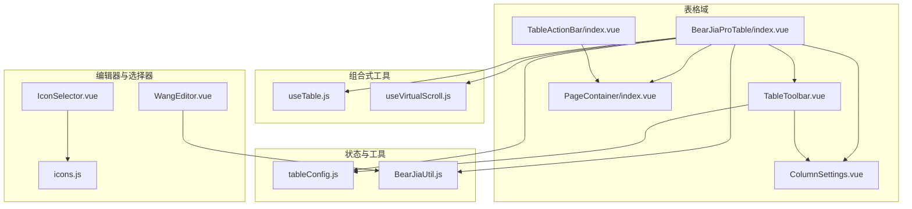
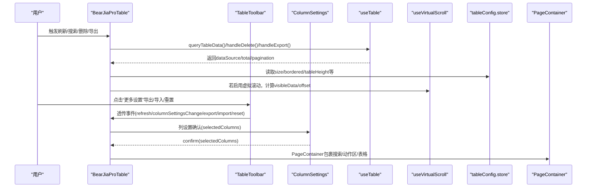
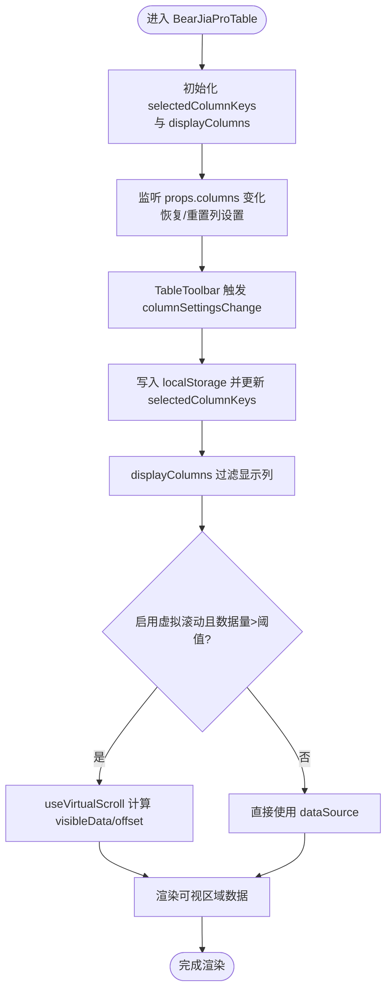
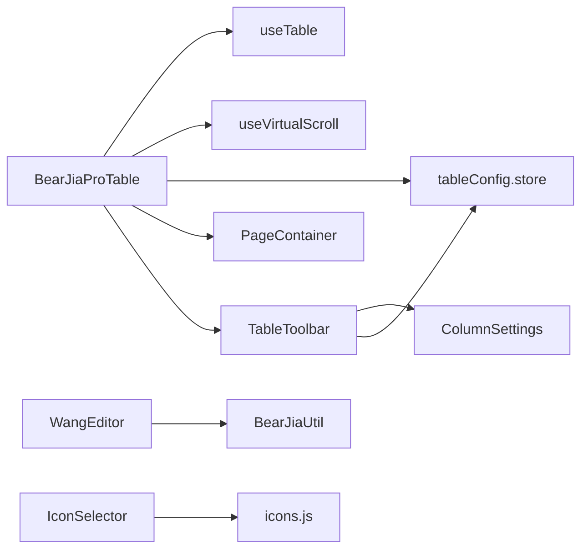

# 业务组件

<cite>
**本文引用的文件**
- [BearJiaProTable/index.vue](file://bear-jia-vue3/src/components/BearJiaProTable/index.vue)
- [TableToolbar.vue](file://bear-jia-vue3/src/components/BearJiaProTable/TableToolbar.vue)
- [ColumnSettings.vue](file://bear-jia-vue3/src/components/BearJiaProTable/ColumnSettings.vue)
- [VirtualScrollExample.md](file://bear-jia-vue3/src/components/BearJiaProTable/VirtualScrollExample.md)
- [useVirtualScroll.js](file://bear-jia-vue3/src/composables/useVirtualScroll.js)
- [useTable.js](file://bear-jia-vue3/src/composables/useTable.js)
- [tableConfig.js](file://bear-jia-vue3/src/stores/tableConfig.js)
- [TableActionBar/index.vue](file://bear-jia-vue3/src/components/TableActionBar/index.vue)
- [PageContainer/index.vue](file://bear-jia-vue3/src/components/PageContainer/index.vue)
- [IconSelector.vue](file://bear-jia-vue3/src/components/IconSelector/IconSelector.vue)
- [icons.js](file://bear-jia-vue3/src/components/IconSelector/icons.js)
- [README.md](file://bear-jia-vue3/src/components/IconSelector/README.md)
- [WangEditor.vue](file://bear-jia-vue3/src/components/editor/WangEditor.vue)
- [BearJiaUtil.js](file://bear-jia-vue3/src/utils/BearJiaUtil.js)
</cite>

## 目录
1. [简介](#简介)
2. [项目结构](#项目结构)
3. [核心组件](#核心组件)
4. [架构总览](#架构总览)
5. [详细组件分析](#详细组件分析)
6. [依赖关系分析](#依赖关系分析)
7. [性能考量](#性能考量)
8. [故障排查指南](#故障排查指南)
9. [结论](#结论)
10. [附录](#附录)

## 简介
本文件面向业务开发者，系统化梳理 BearJiaProTable 高级表格组件的设计理念与实现细节，覆盖：
- TableToolbar 工具栏的批量操作、刷新、导出、导入、重置等能力集成
- ColumnSettings 列设置的显隐控制与顺序调整机制
- 虚拟滚动在大数据量下的性能优化策略与最佳实践
- TableActionBar 表格操作栏的标准按钮布局与权限控制集成
- PageContainer 页面容器组件的标题、面包屑与操作区配置方法
- IconSelector 图标选择器的图标库管理、搜索过滤与选中回调机制
- WangEditor 富文本编辑器的配置项、图片/视频上传处理、内容校验与自定义扩展方法

## 项目结构
围绕 BearJiaProTable 及其周边组件，项目采用“按功能域分层”的组织方式：
- 组件层：BearJiaProTable、TableToolbar、ColumnSettings、TableActionBar、PageContainer、IconSelector、WangEditor
- 组合式工具层：useTable、useVirtualScroll
- 状态层：Pinia 表格配置 store（tableConfig）
- 工具层：BearJiaUtil（下载、消息、字典等）

图表来源
- [BearJiaProTable/index.vue](file://bear-jia-vue3/src/components/BearJiaProTable/index.vue#L1-L120)
- [TableToolbar.vue](file://bear-jia-vue3/src/components/BearJiaProTable/TableToolbar.vue#L1-L120)
- [ColumnSettings.vue](file://bear-jia-vue3/src/components/BearJiaProTable/ColumnSettings.vue#L1-L90)
- [useTable.js](file://bear-jia-vue3/src/composables/useTable.js#L1-L120)
- [useVirtualScroll.js](file://bear-jia-vue3/src/composables/useVirtualScroll.js#L1-L120)
- [tableConfig.js](file://bear-jia-vue3/src/stores/tableConfig.js#L1-L80)
- [PageContainer/index.vue](file://bear-jia-vue3/src/components/PageContainer/index.vue#L1-L60)
- [WangEditor.vue](file://bear-jia-vue3/src/components/editor/WangEditor.vue#L1-L120)
- [IconSelector.vue](file://bear-jia-vue3/src/components/IconSelector/IconSelector.vue#L1-L60)
- [icons.js](file://bear-jia-vue3/src/components/IconSelector/icons.js#L1-L37)
- [BearJiaUtil.js](file://bear-jia-vue3/src/utils/BearJiaUtil.js#L370-L400)

章节来源
- [BearJiaProTable/index.vue](file://bear-jia-vue3/src/components/BearJiaProTable/index.vue#L1-L120)
- [useTable.js](file://bear-jia-vue3/src/composables/useTable.js#L1-L120)
- [useVirtualScroll.js](file://bear-jia-vue3/src/composables/useVirtualScroll.js#L1-L120)
- [tableConfig.js](file://bear-jia-vue3/src/stores/tableConfig.js#L1-L80)
- [PageContainer/index.vue](file://bear-jia-vue3/src/components/PageContainer/index.vue#L1-L60)
- [WangEditor.vue](file://bear-jia-vue3/src/components/editor/WangEditor.vue#L1-L120)
- [IconSelector.vue](file://bear-jia-vue3/src/components/IconSelector/IconSelector.vue#L1-L60)
- [icons.js](file://bear-jia-vue3/src/components/IconSelector/icons.js#L1-L37)

## 核心组件
- BearJiaProTable：封装查询表单、工具栏、表格主体、空态与错误态、树形/展开行、虚拟滚动、列设置、自动横向滚动、行选择等能力，统一对外暴露刷新、删除、导出、搜索表单、虚拟滚动 API 等方法。
- TableToolbar：提供刷新、密度设置、全屏、列设置、更多设置（导出、导入、重置）等工具栏能力，并与 BearJiaProTable 的列设置联动。
- ColumnSettings：提供列显隐勾选、重置、确认回调，支持本地持久化恢复。
- TableActionBar：标准操作列按钮布局（查看/编辑/删除），支持权限指令与自定义插槽。
- PageContainer：页面容器，支持搜索区、操作区插槽与卡片包裹，统一滚动与暗色主题适配。
- IconSelector：图标选择器，内置图标库与自定义 SVG 图标，支持标签页浏览与选中回调。
- WangEditor：富文本编辑器，内置图片/视频上传、只读模式、占位符、高度控制、内容变更回调与销毁清理。

章节来源
- [BearJiaProTable/index.vue](file://bear-jia-vue3/src/components/BearJiaProTable/index.vue#L1-L120)
- [TableToolbar.vue](file://bear-jia-vue3/src/components/BearJiaProTable/TableToolbar.vue#L1-L120)
- [ColumnSettings.vue](file://bear-jia-vue3/src/components/BearJiaProTable/ColumnSettings.vue#L1-L90)
- [TableActionBar/index.vue](file://bear-jia-vue3/src/components/TableActionBar/index.vue#L1-L120)
- [PageContainer/index.vue](file://bear-jia-vue3/src/components/PageContainer/index.vue#L1-L60)
- [IconSelector.vue](file://bear-jia-vue3/src/components/IconSelector/IconSelector.vue#L1-L60)
- [WangEditor.vue](file://bear-jia-vue3/src/components/editor/WangEditor.vue#L1-L120)

## 架构总览
BearJiaProTable 通过 useTable 抽象通用表格逻辑（查询、分页、排序、删除、导出），通过 useVirtualScroll 提供虚拟滚动能力，通过 tableConfig store 统一表格尺寸、边框、高度、分页等全局配置；TableToolbar 作为工具栏入口，与 ColumnSettings 协作完成列显隐与顺序控制；PageContainer 提供页面级布局与滚动条美化；IconSelector 与 WangEditor 作为通用编辑与选择组件融入业务页面。

图表来源
- [BearJiaProTable/index.vue](file://bear-jia-vue3/src/components/BearJiaProTable/index.vue#L1-L120)
- [TableToolbar.vue](file://bear-jia-vue3/src/components/BearJiaProTable/TableToolbar.vue#L1-L120)
- [ColumnSettings.vue](file://bear-jia-vue3/src/components/BearJiaProTable/ColumnSettings.vue#L1-L90)
- [useTable.js](file://bear-jia-vue3/src/composables/useTable.js#L1-L120)
- [useVirtualScroll.js](file://bear-jia-vue3/src/composables/useVirtualScroll.js#L1-L120)
- [tableConfig.js](file://bear-jia-vue3/src/stores/tableConfig.js#L1-L80)
- [PageContainer/index.vue](file://bear-jia-vue3/src/components/PageContainer/index.vue#L1-L60)

## 详细组件分析

### BearJiaProTable 高级表格
- 功能要点
  - 查询表单区：通过 SearchForm 插槽注入，支持重置与搜索事件
  - 操作按钮区：支持左右布局，右侧集成 TableToolbar
  - 表格主体：支持树形表格、展开行、行选择、空态与错误态
  - 列设置：通过 selectedColumnKeys 控制显示列，支持本地持久化恢复与重置
  - 虚拟滚动：根据数据量阈值与容器高度动态启用，支持滚动到顶部/底部/指定索引与性能统计
  - 自动横向滚动：根据列宽总和与容器宽度决定是否开启 x 滚动
  - 错误处理：增强查询方法捕获异常并提供重试
  - 暴露 API：refresh/delete/export/searchFormData/tableState/virtualScroll/stats/retry 等

- 关键流程图（列设置与虚拟滚动）

图表来源
- [BearJiaProTable/index.vue](file://bear-jia-vue3/src/components/BearJiaProTable/index.vue#L228-L399)
- [useVirtualScroll.js](file://bear-jia-vue3/src/composables/useVirtualScroll.js#L1-L120)

章节来源
- [BearJiaProTable/index.vue](file://bear-jia-vue3/src/components/BearJiaProTable/index.vue#L1-L200)
- [useVirtualScroll.js](file://bear-jia-vue3/src/composables/useVirtualScroll.js#L1-L120)

### TableToolbar 工具栏
- 能力清单
  - 刷新：触发父组件刷新数据
  - 密度设置：通过 tableConfig.store 切换 size
  - 全屏：切换 isFullscreen 并向上抛出事件
  - 列设置：集成 ColumnSettings，透传 selectedColumns
  - 更多设置：导出、导入、重置（对应 export/import/reset 事件）
- 事件流
  - 子组件通过 emit 向上冒泡，父组件 BearJiaProTable 接收并处理
  - 导出/导入按钮受 exportConfig/importConfig.enabled 控制

章节来源
- [TableToolbar.vue](file://bear-jia-vue3/src/components/BearJiaProTable/TableToolbar.vue#L1-L120)
- [tableConfig.js](file://bear-jia-vue3/src/stores/tableConfig.js#L1-L80)

### ColumnSettings 列设置
- 显隐控制
  - 通过 checkbox group 维护 localSelectedColumns
  - 支持重置为全部列
  - 确认后同时触发 update:selectedColumns 与 confirm 两个事件
- 顺序调整
  - 当前实现为勾选控制显隐，未提供拖拽排序；若需顺序调整，可在业务侧扩展为可拖拽列表并回传新顺序
- 本地持久化
  - BearJiaProTable 在初始化与重置时读取/清除 localStorage 中的列设置

章节来源
- [ColumnSettings.vue](file://bear-jia-vue3/src/components/BearJiaProTable/ColumnSettings.vue#L1-L90)
- [BearJiaProTable/index.vue](file://bear-jia-vue3/src/components/BearJiaProTable/index.vue#L326-L367)

### 虚拟滚动（useVirtualScroll + BearJiaProTable）
- 启用条件
  - props.virtualScroll 为 true 且数据量大于 threshold
  - 容器高度来自 tableConfig.store.tableHeight 或默认值
- 核心算法
  - 计算可见行数、起止索引、偏移量，仅渲染可视区域+缓冲区
  - 提供 scrollToIndex/Top/Bottom 与性能统计 stats
- 最佳实践
  - 固定列宽、合理 buffer、避免复杂单元格内容、谨慎使用展开行/树形表格
  - 结合固定表头时，确保容器高度 y 生效
- 示例参考
  - VirtualScrollExample.md 提供阈值、缓冲区、响应式行高、滚动 API、性能统计等完整示例

章节来源
- [useVirtualScroll.js](file://bear-jia-vue3/src/composables/useVirtualScroll.js#L1-L120)
- [VirtualScrollExample.md](file://bear-jia-vue3/src/components/BearJiaProTable/VirtualScrollExample.md#L1-L120)

### TableActionBar 表格操作栏
- 布局与按钮
  - 查看/编辑/删除三类按钮，支持插槽与自定义按钮
  - 按钮文本、图标、权限可通过对象配置或布尔开关控制
- 权限控制
  - 通过 v-hasPermi 指令与 permissions 字段集成权限校验
- 事件与兼容
  - 默认 emit(view/edit/delete)，支持 onClick 回调或默认事件
  - 向后兼容 hasView/hasEdit/hasDelete、icons/texts 等旧参数

章节来源
- [TableActionBar/index.vue](file://bear-jia-vue3/src/components/TableActionBar/index.vue#L1-L120)

### PageContainer 页面容器
- 插槽
  - search/actions/default 三个插槽，支持搜索区与操作区
- 样式与滚动
  - 统一高度、滚动条美化、暗色主题适配
  - 表格滚动条与页面滚动条风格一致
- 与 BearJiaProTable 的配合
  - BearJiaProTable 将查询表单与操作区放入 PageContainer 的对应插槽

章节来源
- [PageContainer/index.vue](file://bear-jia-vue3/src/components/PageContainer/index.vue#L1-L60)

### IconSelector 图标选择器
- 图标库管理
  - 内置分类（方向性、提示建议性、编辑类、数据类、品牌/通用、应用标识）
  - 支持自定义 SVG 图标集合，自动拼接至 tabs
- 交互与回调
  - 选中图标后触发 change 事件，支持自动切换标签页定位
- 使用方式
  - README 提供基础用法与事件说明

章节来源
- [IconSelector.vue](file://bear-jia-vue3/src/components/IconSelector/IconSelector.vue#L1-L60)
- [icons.js](file://bear-jia-vue3/src/components/IconSelector/icons.js#L1-L37)
- [README.md](file://bear-jia-vue3/src/components/IconSelector/README.md#L1-L49)

### WangEditor 富文本编辑器
- 配置项
  - value/height/readOnly/placeholder/imageSize/videoSize
  - 工具栏默认配置（只读模式下排除工具）
- 上传处理
  - 图片/视频上传：服务端地址、字段名、最大文件大小、允许类型、鉴权头、自定义插入
  - 成功/失败消息提示
- 内容校验与扩展
  - onChange 回调同步 v-model，支持自定义 alert 提示
  - 组件销毁时主动 destroy 编辑器实例，避免内存泄漏
- 与 BearJiaUtil 的协作
  - BearJiaUtil.download 用于通用下载（非编辑器上传），编辑器上传走自定义配置

章节来源
- [WangEditor.vue](file://bear-jia-vue3/src/components/editor/WangEditor.vue#L1-L120)
- [BearJiaUtil.js](file://bear-jia-vue3/src/utils/BearJiaUtil.js#L370-L400)

## 依赖关系分析
- BearJiaProTable 依赖
  - useTable：统一查询、分页、排序、删除、导出
  - useVirtualScroll：虚拟滚动
  - tableConfig.store：表格尺寸、边框、高度、分页等全局配置
  - PageContainer：页面容器
  - TableToolbar/ColumnSettings：工具栏与列设置
- TableToolbar 依赖
  - ColumnSettings：列设置弹窗
  - tableConfig.store：密度设置
- WangEditor 依赖
  - BearJiaUtil：上传/下载工具（编辑器上传走自定义配置）
  - 鉴权工具：Authorization 头
- IconSelector 依赖
  - icons.js：内置图标库
  - 组件内部维护 tabs 与选中状态

图表来源
- [BearJiaProTable/index.vue](file://bear-jia-vue3/src/components/BearJiaProTable/index.vue#L1-L120)
- [useTable.js](file://bear-jia-vue3/src/composables/useTable.js#L1-L120)
- [useVirtualScroll.js](file://bear-jia-vue3/src/composables/useVirtualScroll.js#L1-L120)
- [tableConfig.js](file://bear-jia-vue3/src/stores/tableConfig.js#L1-L80)
- [PageContainer/index.vue](file://bear-jia-vue3/src/components/PageContainer/index.vue#L1-L60)
- [TableToolbar.vue](file://bear-jia-vue3/src/components/BearJiaProTable/TableToolbar.vue#L1-L120)
- [ColumnSettings.vue](file://bear-jia-vue3/src/components/BearJiaProTable/ColumnSettings.vue#L1-L90)
- [WangEditor.vue](file://bear-jia-vue3/src/components/editor/WangEditor.vue#L1-L120)
- [IconSelector.vue](file://bear-jia-vue3/src/components/IconSelector/IconSelector.vue#L1-L60)
- [icons.js](file://bear-jia-vue3/src/components/IconSelector/icons.js#L1-L37)

## 性能考量
- 虚拟滚动
  - 仅渲染可视区域+缓冲区，显著降低 DOM 数量与内存占用
  - 建议固定列宽、合理 buffer、避免复杂单元格内容
  - 大数据量场景下结合固定表头与响应式行高
- 行选择与排序
  - useTable 自动为可排序列添加 sorter，避免重复配置
  - 删除采用二次确认，减少误操作
- 下载与上传
  - BearJiaUtil.download 使用 Blob 流式下载，避免阻塞主线程
  - WangEditor 上传支持并发限制与最大文件大小控制

章节来源
- [VirtualScrollExample.md](file://bear-jia-vue3/src/components/BearJiaProTable/VirtualScrollExample.md#L95-L120)
- [useVirtualScroll.js](file://bear-jia-vue3/src/composables/useVirtualScroll.js#L1-L120)
- [useTable.js](file://bear-jia-vue3/src/composables/useTable.js#L120-L200)
- [BearJiaUtil.js](file://bear-jia-vue3/src/utils/BearJiaUtil.js#L370-L400)
- [WangEditor.vue](file://bear-jia-vue3/src/components/editor/WangEditor.vue#L70-L130)

## 故障排查指南
- 虚拟滚动滚动错位
  - 可能原因：数据更新后未重置滚动位置
  - 解决：调用 virtualScroll.scrollToTop 或重新查询
- 列设置不生效
  - 可能原因：selectedColumnKeys 与列 dataIndex 不匹配
  - 解决：确认 props.columns 的 dataIndex 与本地存储一致，必要时重置
- 导出失败
  - 可能原因：缺少 exportUrl 或后端返回非 Blob
  - 解决：检查 BearJiaUtil.download 的 URL 与鉴权头，确认后端返回格式
- 图片/视频上传失败
  - 可能原因：鉴权头缺失、文件类型不被允许、大小超限
  - 解决：核对 headers.Authorization、allowedFileTypes、maxFileSize

章节来源
- [VirtualScrollExample.md](file://bear-jia-vue3/src/components/BearJiaProTable/VirtualScrollExample.md#L274-L312)
- [BearJiaProTable/index.vue](file://bear-jia-vue3/src/components/BearJiaProTable/index.vue#L326-L367)
- [useTable.js](file://bear-jia-vue3/src/composables/useTable.js#L190-L200)
- [WangEditor.vue](file://bear-jia-vue3/src/components/editor/WangEditor.vue#L80-L130)

## 结论
BearJiaProTable 通过模块化的组合式设计，将查询、分页、排序、删除、导出、列设置、虚拟滚动、工具栏、页面容器等能力解耦整合，既满足通用场景，又便于扩展定制。配合 TableActionBar 的权限控制、IconSelector 的图标库管理、WangEditor 的富文本上传与校验，形成完整的业务表格与内容编辑生态。

## 附录
- 虚拟滚动最佳实践参考：VirtualScrollExample.md
- 列设置与工具栏事件流参考：TableToolbar.vue、ColumnSettings.vue
- 表格通用逻辑参考：useTable.js
- 虚拟滚动算法与 API 参考：useVirtualScroll.js
- 表格全局配置参考：tableConfig.js
- 页面容器样式与滚动条参考：PageContainer/index.vue
- 图标选择器使用与事件参考：IconSelector.vue、icons.js、README.md
- 富文本编辑器配置与上传参考：WangEditor.vue、BearJiaUtil.js