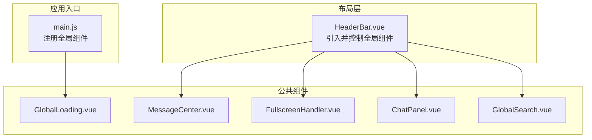
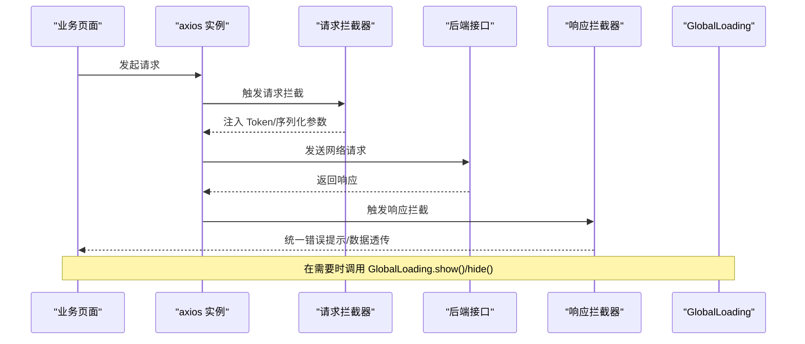
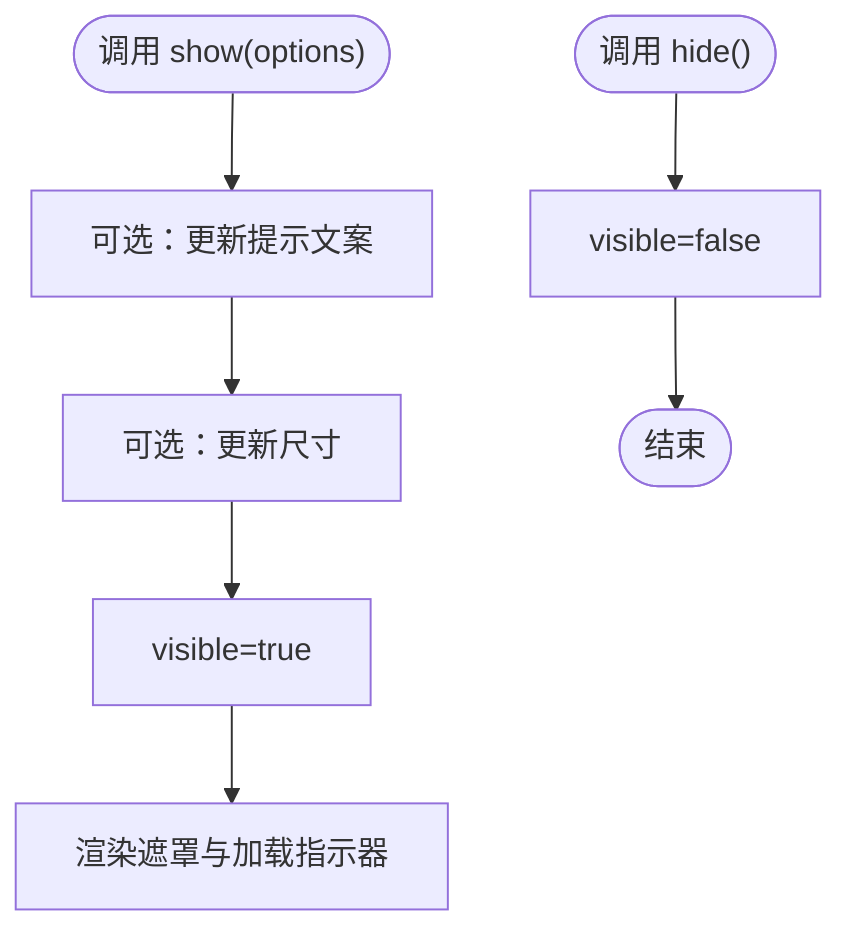
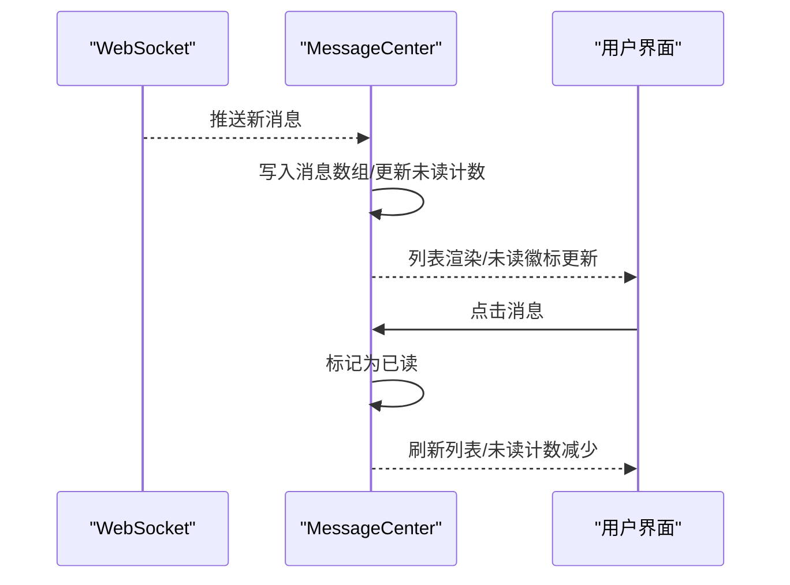
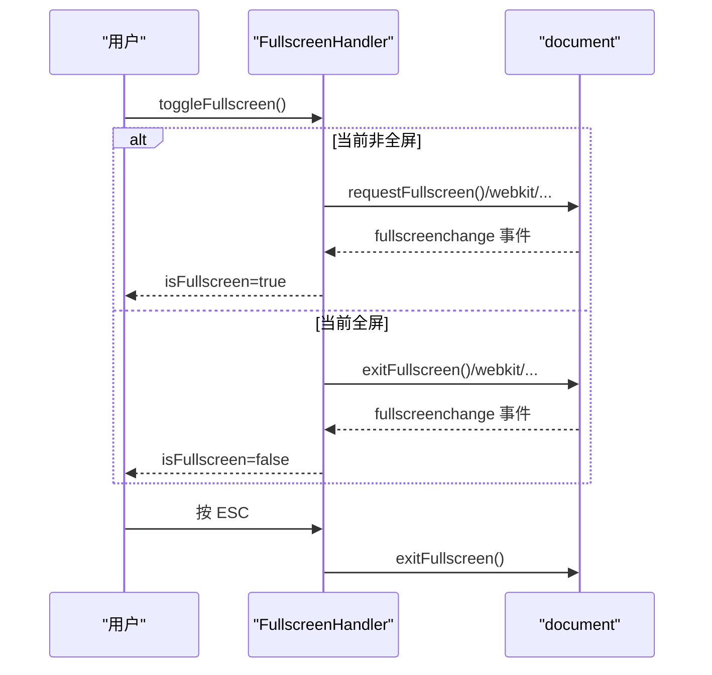
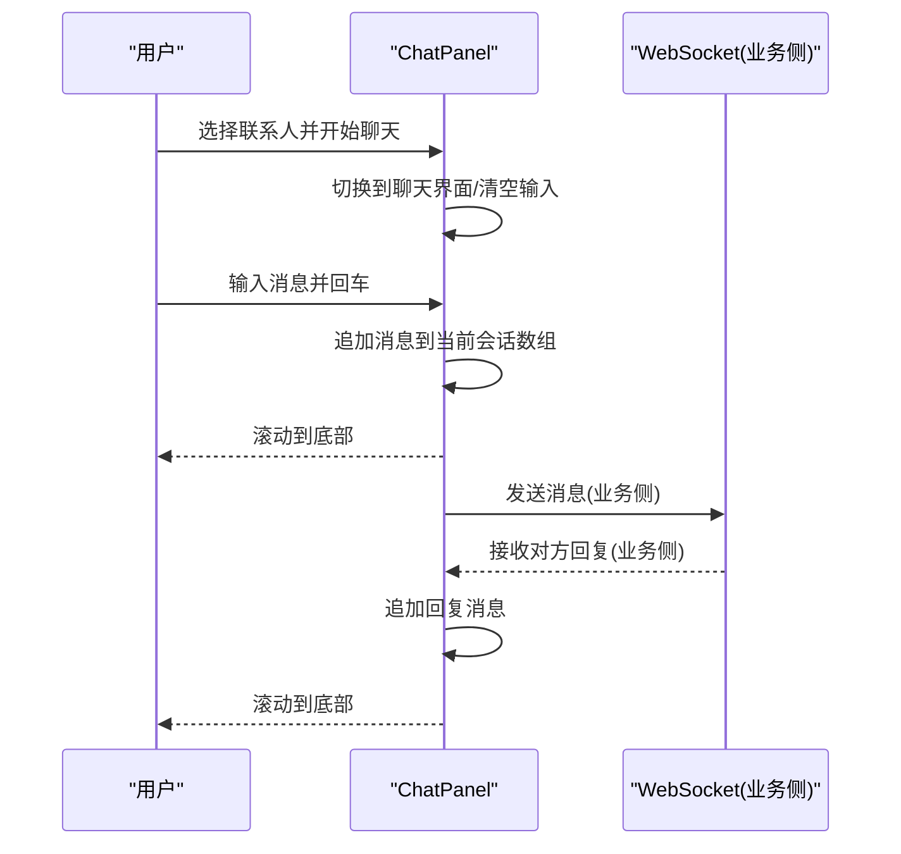
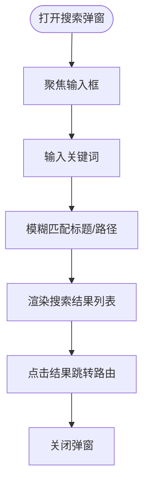
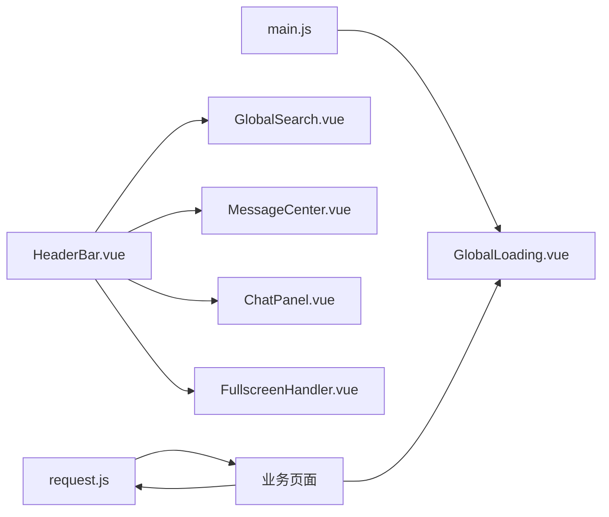

# 全局组件

<cite>
**本文引用的文件**
- [GlobalLoading.vue](file://bear-jia-vue3/src/components/common/GlobalLoading.vue)
- [MessageCenter.vue](file://bear-jia-vue3/src/components/common/MessageCenter.vue)
- [FullscreenHandler.vue](file://bear-jia-vue3/src/components/common/FullscreenHandler.vue)
- [ChatPanel.vue](file://bear-jia-vue3/src/components/common/ChatPanel.vue)
- [GlobalSearch.vue](file://bear-jia-vue3/src/components/common/GlobalSearch.vue)
- [HeaderBar.vue](file://bear-jia-vue3/src/layout/HeaderBar.vue)
- [main.js](file://bear-jia-vue3/src/main.js)
- [request.js](file://bear-jia-vue3/src/utils/request.js)
</cite>

## 目录
1. [简介](#简介)
2. [项目结构](#项目结构)
3. [核心组件](#核心组件)
4. [架构总览](#架构总览)
5. [详细组件分析](#详细组件分析)
6. [依赖关系分析](#依赖关系分析)
7. [性能与可用性考量](#性能与可用性考量)
8. [故障排查指南](#故障排查指南)
9. [结论](#结论)

## 简介
本指南聚焦于项目中的五大全局组件：GlobalLoading（全局加载）、MessageCenter（消息中心）、FullscreenHandler（全屏处理器）、ChatPanel（聊天面板）、GlobalSearch（全局搜索）。文档围绕以下目标展开：
- GlobalLoading 的请求拦截、加载状态管理与防抖策略
- MessageCenter 的 WebSocket 集成、消息推送、未读计数与消息类型分类处理
- FullscreenHandler 的浏览器兼容性处理、事件监听与状态反馈机制
- ChatPanel 的弹出控制、会话管理、消息历史存储与实时通信集成方式
- GlobalSearch 的快捷键触发、搜索建议、结果高亮与跨模块检索能力
- 各组件的注册方式、调用 API 与生命周期管理

## 项目结构
这些组件位于公共组件目录下，并在布局组件 HeaderBar 中被统一引入与控制；全局加载组件 GlobalLoading 在应用入口 main.js 中注册为全局组件，供任意页面直接使用。

图表来源
- [main.js](file://bear-jia-vue3/src/main.js#L57-L62)
- [HeaderBar.vue](file://bear-jia-vue3/src/layout/HeaderBar.vue#L150-L162)

章节来源
- [main.js](file://bear-jia-vue3/src/main.js#L57-L62)
- [HeaderBar.vue](file://bear-jia-vue3/src/layout/HeaderBar.vue#L150-L162)

## 核心组件
- GlobalLoading：提供全局遮罩式加载提示，支持动态提示语与尺寸，通过暴露的 show/hide 方法由业务逻辑控制显示与隐藏。
- MessageCenter：提供消息中心弹窗，支持未读计数、消息类型筛选、点击标记已读、外部点击关闭等交互。
- FullscreenHandler：封装浏览器全屏能力，兼容多厂商前缀，监听全屏状态变化与 ESC 键退出，提供状态反馈。
- ChatPanel：右侧抽屉式聊天面板，支持联系人搜索、会话切换、消息历史存储与模拟实时通信。
- GlobalSearch：全局搜索弹窗，支持快捷操作、搜索历史、模糊匹配与跨模块跳转。

章节来源
- [GlobalLoading.vue](file://bear-jia-vue3/src/components/common/GlobalLoading.vue#L1-L66)
- [MessageCenter.vue](file://bear-jia-vue3/src/components/common/MessageCenter.vue#L1-L236)
- [FullscreenHandler.vue](file://bear-jia-vue3/src/components/common/FullscreenHandler.vue#L1-L147)
- [ChatPanel.vue](file://bear-jia-vue3/src/components/common/ChatPanel.vue#L1-L302)
- [GlobalSearch.vue](file://bear-jia-vue3/src/components/common/GlobalSearch.vue#L1-L193)

## 架构总览
全局组件与业务层的交互路径如下：
- 请求拦截与加载：业务通过 axios 请求发起，请求拦截器注入 Token 并处理 GET 参数序列化；响应拦截器统一处理 401、500 等错误并提示；在需要时由 GlobalLoading 控制加载态。
- 消息中心：消息中心组件负责 UI 展示与交互，WebSocket 集成与消息推送由业务侧实现（组件内预留扩展点），未读计数与类型筛选在组件内部完成。
- 全屏处理：通过 FullscreenHandler 封装全屏 API，提供状态反馈与键盘事件处理。
- 聊天面板：通过抽屉控制弹出与收起，联系人与消息历史在组件内维护，模拟实时通信。
- 全局搜索：通过弹窗提供快捷操作与搜索历史，支持跨模块跳转。

图表来源
- [request.js](file://bear-jia-vue3/src/utils/request.js#L24-L66)
- [request.js](file://bear-jia-vue3/src/utils/request.js#L69-L123)
- [GlobalLoading.vue](file://bear-jia-vue3/src/components/common/GlobalLoading.vue#L21-L37)

章节来源
- [request.js](file://bear-jia-vue3/src/utils/request.js#L24-L66)
- [request.js](file://bear-jia-vue3/src/utils/request.js#L69-L123)
- [GlobalLoading.vue](file://bear-jia-vue3/src/components/common/GlobalLoading.vue#L21-L37)

## 详细组件分析

### GlobalLoading 全局加载组件
- 请求拦截与加载状态管理
  - 请求拦截器在发送前注入 Authorization 头与 GET 参数序列化；若未登录且非白名单接口，直接拒绝请求。
  - 响应拦截器统一处理 401、500 等错误并通过通知组件提示；业务侧可在关键流程中调用 GlobalLoading 的 show/hide 控制加载态。
- 防抖策略
  - 组件未内置防抖逻辑；如需防抖，可在业务侧对 show/hide 调用进行节流/防抖包装，避免频繁闪烁。
- 生命周期与注册
  - 在应用入口注册为全局组件，可在任意模板中直接使用。
- 调用 API
  - 暴露方法：show(options)、hide
  - options 支持 tip、size 等参数以定制提示文案与尺寸。

图表来源
- [GlobalLoading.vue](file://bear-jia-vue3/src/components/common/GlobalLoading.vue#L21-L37)

章节来源
- [GlobalLoading.vue](file://bear-jia-vue3/src/components/common/GlobalLoading.vue#L1-L66)
- [main.js](file://bear-jia-vue3/src/main.js#L57-L62)
- [request.js](file://bear-jia-vue3/src/utils/request.js#L24-L66)

### MessageCenter 消息中心
- WebSocket 集成与消息推送
  - 组件未内置 WebSocket 集成；可在业务侧通过 WebSocket 接收消息后，将消息写入组件内部的消息数组，从而驱动 UI 更新。
- 未读计数与消息类型分类
  - 未读计数基于内部数组过滤统计；支持“全部/未读/系统通知/任务提醒”四类标签筛选。
- 交互行为
  - 支持点击消息标记已读；支持“全部已读”批量标记；支持外部点击关闭面板。
- 生命周期与事件
  - 组件在 mounted 时监听 document 点击事件，unmounted 时移除监听，避免内存泄漏。

图表来源
- [MessageCenter.vue](file://bear-jia-vue3/src/components/common/MessageCenter.vue#L187-L236)

章节来源
- [MessageCenter.vue](file://bear-jia-vue3/src/components/common/MessageCenter.vue#L1-L236)

### FullscreenHandler 全屏处理器
- 浏览器兼容性处理
  - 统一检测并调用各厂商前缀的全屏 API（标准、webkit、moz、ms），确保在不同浏览器中可用。
- 事件监听与状态反馈
  - 监听 fullscreenchange、webkitfullscreenchange、mozfullscreenchange、MSFullscreenChange 等事件，实时更新 isFullscreen 状态。
  - 监听 ESC 键，当处于全屏状态时触发退出全屏。
- 调用 API
  - 暴露方法：isFullscreen、toggleFullscreen、enterFullscreen、exitFullscreen；布局 HeaderBar 通过 ref 调用 toggleFullscreen。

图表来源
- [FullscreenHandler.vue](file://bear-jia-vue3/src/components/common/FullscreenHandler.vue#L21-L108)
- [HeaderBar.vue](file://bear-jia-vue3/src/layout/HeaderBar.vue#L349-L358)

章节来源
- [FullscreenHandler.vue](file://bear-jia-vue3/src/components/common/FullscreenHandler.vue#L1-L147)
- [HeaderBar.vue](file://bear-jia-vue3/src/layout/HeaderBar.vue#L349-L358)

### ChatPanel 聊天面板
- 弹出控制与会话管理
  - 通过抽屉控制 visible 状态；进入会话时切换到聊天界面，离开会话返回联系人列表。
- 消息历史存储
  - 使用对象结构按联系人 ID 存储消息数组；首次发送时初始化对应数组。
- 实时通信集成方式
  - 组件内提供模拟实时通信：发送消息后延迟一秒自动追加一条“对方回复”，用于演示效果；真实场景可替换为 WebSocket 或轮询。
- 滚动与输入
  - 发送消息后自动滚动到底部；支持回车发送；输入为空时禁用发送按钮。

图表来源
- [ChatPanel.vue](file://bear-jia-vue3/src/components/common/ChatPanel.vue#L230-L292)

章节来源
- [ChatPanel.vue](file://bear-jia-vue3/src/components/common/ChatPanel.vue#L1-L302)

### GlobalSearch 全局搜索
- 快捷键触发
  - 组件未内置快捷键触发逻辑；可在布局 HeaderBar 中通过按键监听唤起搜索弹窗（例如 Ctrl+K/Cmd+K），并在弹窗打开时聚焦输入框。
- 搜索建议与结果高亮
  - 组件未内置高亮逻辑；可通过自定义指令或在渲染层对匹配字符进行包裹实现高亮。
- 跨模块检索能力
  - 组件内置模拟数据（菜单、页面、功能）；实际项目中可接入路由元信息或后端搜索接口，实现跨模块检索。

图表来源
- [GlobalSearch.vue](file://bear-jia-vue3/src/components/common/GlobalSearch.vue#L131-L163)
- [HeaderBar.vue](file://bear-jia-vue3/src/layout/HeaderBar.vue#L333-L346)

章节来源
- [GlobalSearch.vue](file://bear-jia-vue3/src/components/common/GlobalSearch.vue#L1-L193)
- [HeaderBar.vue](file://bear-jia-vue3/src/layout/HeaderBar.vue#L333-L346)

## 依赖关系分析
- 组件注册与使用
  - GlobalLoading 在 main.js 中注册为全局组件，可在任意模板中直接使用。
  - HeaderBar 引入并控制 GlobalSearch、MessageCenter、ChatPanel、FullscreenHandler 的可见性与状态。
- 请求拦截与加载
  - request.js 提供 axios 实例与拦截器，业务侧在关键流程中调用 GlobalLoading 控制加载态。
- 事件与生命周期
  - MessageCenter 在 mounted 时添加 document 点击监听，unmounted 时移除；FullscreenHandler 在 mounted 时添加全屏与键盘事件监听，unmounted 时移除。

图表来源
- [main.js](file://bear-jia-vue3/src/main.js#L57-L62)
- [HeaderBar.vue](file://bear-jia-vue3/src/layout/HeaderBar.vue#L150-L162)
- [request.js](file://bear-jia-vue3/src/utils/request.js#L24-L66)

章节来源
- [main.js](file://bear-jia-vue3/src/main.js#L57-L62)
- [HeaderBar.vue](file://bear-jia-vue3/src/layout/HeaderBar.vue#L150-L162)
- [request.js](file://bear-jia-vue3/src/utils/request.js#L24-L66)

## 性能与可用性考量
- GlobalLoading
  - 建议在高频请求场景中对 show/hide 进行节流/防抖，避免频繁闪烁影响用户体验。
  - 对于长耗时操作，结合响应拦截器统一提示，减少重复提示。
- MessageCenter
  - 未读计数与筛选在前端完成，建议在消息量较大时考虑分页或虚拟滚动优化。
  - WebSocket 推送频率过高时，建议在业务侧做去重与合并策略。
- FullscreenHandler
  - 事件监听在组件生命周期内绑定与解绑，避免内存泄漏；注意在移动端 Safari 等浏览器的全屏限制与权限提示。
- ChatPanel
  - 消息数组按联系人 ID 存储，建议在长时间会话后清理历史消息，避免内存占用过高。
  - 模拟实时通信仅用于演示，生产环境务必替换为真实 WebSocket。
- GlobalSearch
  - 模糊匹配在前端完成，建议在数据量大时采用索引或后端检索；对输入进行防抖处理，降低匹配频率。

[本节为通用指导，不直接分析具体文件]

## 故障排查指南
- GlobalLoading
  - 现象：加载遮罩无法关闭
  - 排查：确认业务侧调用了 hide；检查是否存在多个并发 show/hide 导致状态错乱。
- MessageCenter
  - 现象：外部点击未关闭面板
  - 排查：确认 mounted 已添加 document 点击监听，unmounted 已移除；检查事件委托是否被阻止冒泡。
- FullscreenHandler
  - 现象：ESC 无法退出全屏
  - 排查：确认已监听 keydown 事件且 isFullscreen 为真；检查浏览器是否允许退出全屏。
- ChatPanel
  - 现象：消息不显示或无法滚动到底部
  - 排查：确认 nextTick 后执行滚动；检查当前会话是否正确切换。
- GlobalSearch
  - 现象：搜索无结果或无建议
  - 排查：确认输入事件触发了模糊匹配；检查模拟数据或后端接口是否返回数据。

章节来源
- [MessageCenter.vue](file://bear-jia-vue3/src/components/common/MessageCenter.vue#L228-L236)
- [FullscreenHandler.vue](file://bear-jia-vue3/src/components/common/FullscreenHandler.vue#L87-L108)
- [ChatPanel.vue](file://bear-jia-vue3/src/components/common/ChatPanel.vue#L287-L292)
- [GlobalSearch.vue](file://bear-jia-vue3/src/components/common/GlobalSearch.vue#L144-L156)

## 结论
本文梳理了五个全局组件的功能边界、交互流程与最佳实践，明确了它们与请求拦截、全屏处理、消息推送、实时通信及搜索建议的关系。建议在实际项目中：
- 将 GlobalLoading 的调用纳入统一的业务流程，配合请求拦截器提升一致性。
- 在 MessageCenter 中预留 WebSocket 集成点，完善消息推送与未读管理。
- 在 ChatPanel 中替换模拟通信为真实 WebSocket，并增加消息持久化策略。
- 在 GlobalSearch 中补充快捷键触发与高亮渲染，提升搜索体验。
- 严格遵循组件生命周期内的事件绑定与清理，确保内存安全与兼容性。