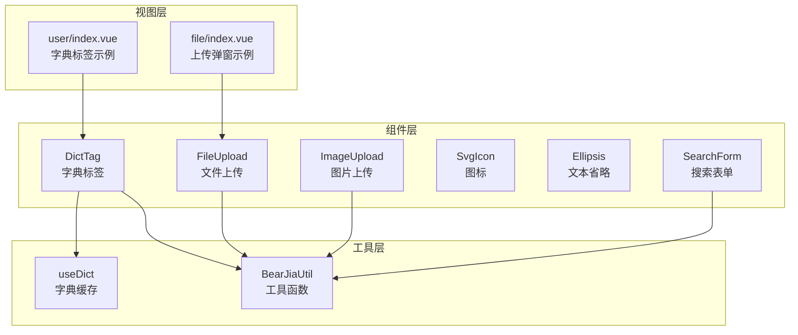
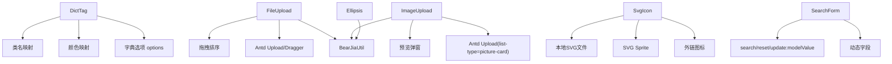
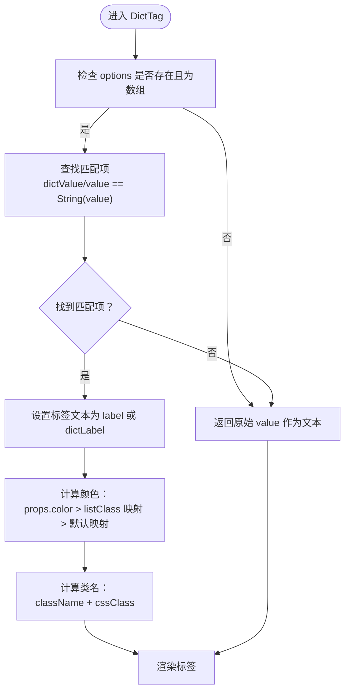
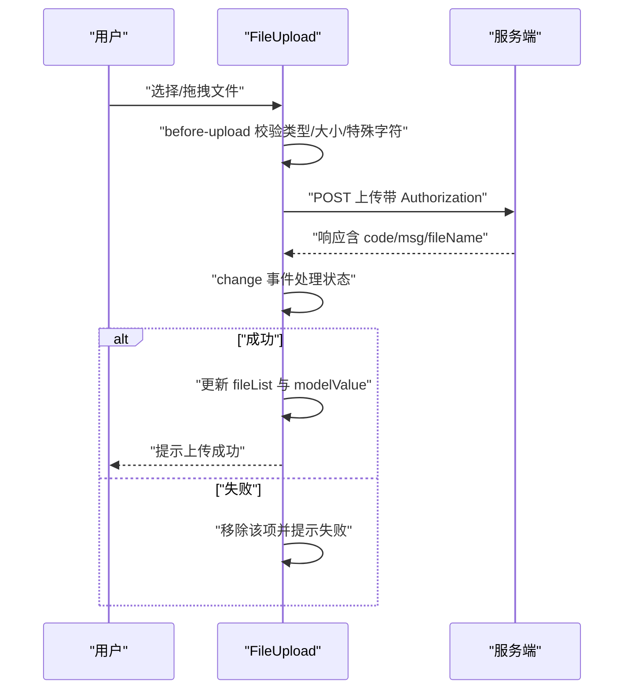
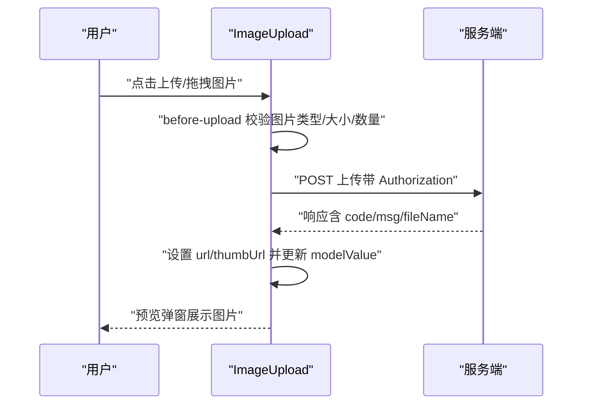
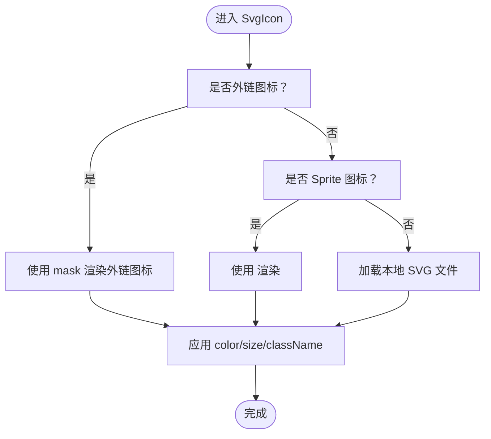
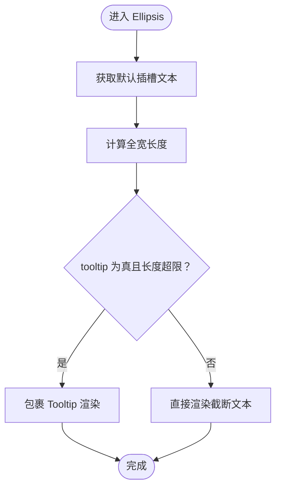
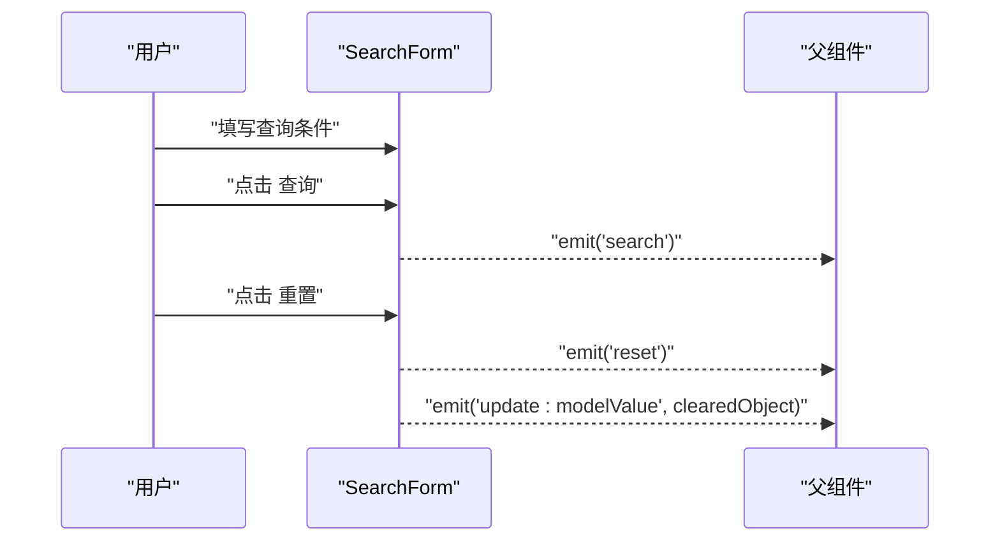
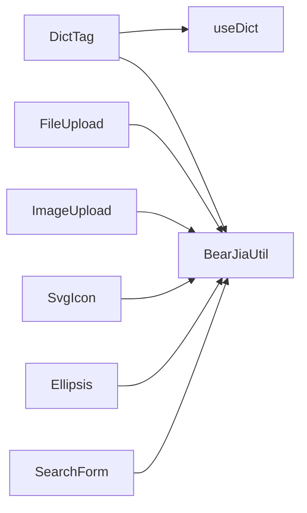

# 基础组件

<cite>
**本文档引用的文件**
- [DictTag/index.vue](file://bear-jia-vue3/src/components/DictTag/index.vue)
- [useDict.js](file://bear-jia-vue3/src/composables/useDict.js)
- [BearJiaUtil.js](file://bear-jia-vue3/src/utils/BearJiaUtil.js)
- [FileUpload/index.vue](file://bear-jia-vue3/src/components/FileUpload/index.vue)
- [ImageUpload/index.vue](file://bear-jia-vue3/src/components/ImageUpload/index.vue)
- [SvgIcon/index.vue](file://bear-jia-vue3/src/components/SvgIcon/index.vue)
- [Ellipsis/Ellipsis.vue](file://bear-jia-vue3/src/components/Ellipsis/Ellipsis.vue)
- [SearchForm/index.vue](file://bear-jia-vue3/src/components/SearchForm/index.vue)
- [user/index.vue](file://bear-jia-vue3/src/views/system/user/index.vue)
- [file/index.vue](file://bear-jia-vue3/src/views/system/file/index.vue)
- [file.js](file://bear-jia-vue3/src/api/system/file.js)
</cite>

## 目录
1. [简介](#简介)
2. [项目结构](#项目结构)
3. [核心组件](#核心组件)
4. [架构总览](#架构总览)
5. [详细组件分析](#详细组件分析)
6. [依赖关系分析](#依赖关系分析)
7. [性能考量](#性能考量)
8. [故障排查指南](#故障排查指南)
9. [结论](#结论)
10. [附录](#附录)

## 简介
本文件聚焦于基础组件库中的六大组件：DictTag、FileUpload、ImageUpload、SvgIcon、Ellipsis、SearchForm。文档围绕以下目标展开：
- DictTag：字典数据绑定、标签样式渲染、字典缓存策略
- FileUpload 与 ImageUpload：文件上传流程、上传配置、进度显示、错误处理、OSS 集成思路
- SvgIcon：图标管理方案，支持动态加载与颜色定制
- Ellipsis：文本溢出处理，支持按行数与字符长度两种截断模式
- SearchForm：表单布局、条件重置与查询提交规范
- 提供使用示例、属性说明与事件回调机制

## 项目结构
基础组件位于 bear-jia-vue3/src/components 下，配合工具函数与组合式函数共同实现数据与交互能力。典型目录组织如下：
- 组件层：DictTag、FileUpload、ImageUpload、SvgIcon、Ellipsis、SearchForm
- 工具层：BearJiaUtil（字符串处理、字典加载等）、useDict（字典缓存与刷新）
- 视图层：示例页面 user/index.vue、file/index.vue 展示组件的实际使用

图表来源
- [DictTag/index.vue](file://bear-jia-vue3/src/components/DictTag/index.vue#L1-L143)
- [useDict.js](file://bear-jia-vue3/src/composables/useDict.js#L1-L185)
- [BearJiaUtil.js](file://bear-jia-vue3/src/utils/BearJiaUtil.js#L1-L452)
- [FileUpload/index.vue](file://bear-jia-vue3/src/components/FileUpload/index.vue#L1-L477)
- [ImageUpload/index.vue](file://bear-jia-vue3/src/components/ImageUpload/index.vue#L1-L387)
- [SvgIcon/index.vue](file://bear-jia-vue3/src/components/SvgIcon/index.vue#L1-L154)
- [Ellipsis/Ellipsis.vue](file://bear-jia-vue3/src/components/Ellipsis/Ellipsis.vue#L1-L50)
- [SearchForm/index.vue](file://bear-jia-vue3/src/components/SearchForm/index.vue#L1-L232)
- [user/index.vue](file://bear-jia-vue3/src/views/system/user/index.vue#L35-L68)
- [file/index.vue](file://bear-jia-vue3/src/views/system/file/index.vue#L1-L200)

章节来源
- [DictTag/index.vue](file://bear-jia-vue3/src/components/DictTag/index.vue#L1-L143)
- [useDict.js](file://bear-jia-vue3/src/composables/useDict.js#L1-L185)
- [BearJiaUtil.js](file://bear-jia-vue3/src/utils/BearJiaUtil.js#L1-L452)
- [FileUpload/index.vue](file://bear-jia-vue3/src/components/FileUpload/index.vue#L1-L477)
- [ImageUpload/index.vue](file://bear-jia-vue3/src/components/ImageUpload/index.vue#L1-L387)
- [SvgIcon/index.vue](file://bear-jia-vue3/src/components/SvgIcon/index.vue#L1-L154)
- [Ellipsis/Ellipsis.vue](file://bear-jia-vue3/src/components/Ellipsis/Ellipsis.vue#L1-L50)
- [SearchForm/index.vue](file://bear-jia-vue3/src/components/SearchForm/index.vue#L1-L232)
- [user/index.vue](file://bear-jia-vue3/src/views/system/user/index.vue#L35-L68)
- [file/index.vue](file://bear-jia-vue3/src/views/system/file/index.vue#L1-L200)

## 核心组件
- DictTag：基于字典 options 与 value 计算标签文本、颜色与类名，支持自定义 color 与 className
- FileUpload：拖拽/多文件上传，带进度与状态标签，支持拖拽排序、禁用、提示显示
- ImageUpload：图片上传，支持预览、拖拽排序、禁用、提示显示
- SvgIcon：支持外链图标、SVG Sprite、本地 SVG 文件三种加载方式，支持 color、size、className 定制
- Ellipsis：文本省略，支持按字符长度与按行数两种模式，可选 Tooltip
- SearchForm：动态表单布局，支持默认可见字段数、展开/收起、查询与重置事件

章节来源
- [DictTag/index.vue](file://bear-jia-vue3/src/components/DictTag/index.vue#L1-L143)
- [FileUpload/index.vue](file://bear-jia-vue3/src/components/FileUpload/index.vue#L1-L477)
- [ImageUpload/index.vue](file://bear-jia-vue3/src/components/ImageUpload/index.vue#L1-L387)
- [SvgIcon/index.vue](file://bear-jia-vue3/src/components/SvgIcon/index.vue#L1-L154)
- [Ellipsis/Ellipsis.vue](file://bear-jia-vue3/src/components/Ellipsis/Ellipsis.vue#L1-L50)
- [SearchForm/index.vue](file://bear-jia-vue3/src/components/SearchForm/index.vue#L1-L232)

## 架构总览
组件间协作关系：
- DictTag 依赖字典数据（options），可通过 useDict 提供的响应式字典数据注入
- FileUpload/ImageUpload 依赖 BearJiaUtil 的工具能力（如获取 Token、URL 拼接）与 Ant Design Vue 组件
- SvgIcon 通过 isExternal、Sprite 或本地资源加载图标，并支持颜色与尺寸定制
- Ellipsis 依赖 BearJiaUtil 的字符串长度与截取工具
- SearchForm 通过 props 与 emits 规范化查询与重置行为

图表来源
- [DictTag/index.vue](file://bear-jia-vue3/src/components/DictTag/index.vue#L1-L143)
- [useDict.js](file://bear-jia-vue3/src/composables/useDict.js#L1-L185)
- [BearJiaUtil.js](file://bear-jia-vue3/src/utils/BearJiaUtil.js#L1-L452)
- [FileUpload/index.vue](file://bear-jia-vue3/src/components/FileUpload/index.vue#L1-L477)
- [ImageUpload/index.vue](file://bear-jia-vue3/src/components/ImageUpload/index.vue#L1-L387)
- [SvgIcon/index.vue](file://bear-jia-vue3/src/components/SvgIcon/index.vue#L1-L154)
- [Ellipsis/Ellipsis.vue](file://bear-jia-vue3/src/components/Ellipsis/Ellipsis.vue#L1-L50)
- [SearchForm/index.vue](file://bear-jia-vue3/src/components/SearchForm/index.vue#L1-L232)

## 详细组件分析

### DictTag 字典标签组件
- 数据绑定
  - 接收 options（字典选项数组）与 value（字典值）
  - 兼容两种数据结构：{ value, label } 与 { dictValue, dictLabel }
  - 通过 find 匹配 dictValue 或 value，返回对应 label 或原值
- 样式渲染
  - tagText：计算标签文本
  - tagColor：优先使用 props.color；否则根据 listClass 映射颜色；最后按 value 做默认映射
  - tagClass：合并 props.className 与选项中的 cssClass
- 缓存策略
  - 字典数据通过 useDict 提供响应式字典，内部维护 dictCache，避免重复请求
  - 支持 clearDictCache 与 refreshDict 主动清理与刷新

图表来源
- [DictTag/index.vue](file://bear-jia-vue3/src/components/DictTag/index.vue#L1-L143)
- [useDict.js](file://bear-jia-vue3/src/composables/useDict.js#L1-L185)

章节来源
- [DictTag/index.vue](file://bear-jia-vue3/src/components/DictTag/index.vue#L1-L143)
- [useDict.js](file://bear-jia-vue3/src/composables/useDict.js#L1-L185)
- [BearJiaUtil.js](file://bear-jia-vue3/src/utils/BearJiaUtil.js#L1-L452)
- [user/index.vue](file://bear-jia-vue3/src/views/system/user/index.vue#L35-L68)

### FileUpload 文件上传组件
- 上传流程
  - 拖拽/多文件上传，before-upload 校验类型、大小、特殊字符
  - change 事件处理上传状态变化（uploading/done/error/removed），更新 fileList 并触发 change
  - 删除文件时从 fileList 移除并更新 modelValue
  - 支持拖拽排序（Sortable），拖动结束后更新 modelValue
- 上传配置
  - action：上传接口地址（拼接 VITE_APP_BASE_API）
  - data：上传附加参数
  - limit：数量限制
  - fileSize：大小限制（MB）
  - fileType：允许的扩展名数组
  - disabled：禁用组件
  - drag：是否启用拖拽排序
- 进度与状态
  - 上传中显示进度条与“上传中”标签
  - 成功/失败分别提示并处理列表项
- 错误处理
  - 校验失败直接阻止上传并提示
  - 服务端响应非 200 时移除该项并提示
- OSS 集成
  - 通过 action 与 headers（Authorization: Bearer token）对接后端上传接口
  - 服务端可统一接入 OSS 签名直传或代理上传

图表来源
- [FileUpload/index.vue](file://bear-jia-vue3/src/components/FileUpload/index.vue#L1-L477)

章节来源
- [FileUpload/index.vue](file://bear-jia-vue3/src/components/FileUpload/index.vue#L1-L477)
- [file.js](file://bear-jia-vue3/src/api/system/file.js#L232-L286)
- [file/index.vue](file://bear-jia-vue3/src/views/system/file/index.vue#L1-L200)

### ImageUpload 图片上传组件
- 上传流程
  - picture-card 列表，before-upload 校验图片类型、大小、数量
  - change 事件处理 done/error/remove，设置 url/thumbUrl 并更新 modelValue
  - 支持预览弹窗，展示图片与标题
  - 支持拖拽排序（Sortable），拖动结束后更新 modelValue
- 上传配置
  - action：上传接口地址（拼接 VITE_APP_BASE_API）
  - data：上传附加参数
  - limit：数量限制
  - fileSize：大小限制（MB）
  - fileType：允许的图片扩展名数组
  - disabled：禁用组件
  - drag：是否启用拖拽排序
- 错误处理
  - 校验失败阻止上传并提示
  - 服务端响应非 200 时移除该项并提示
- OSS 集成
  - 通过 action 与 headers（Authorization: Bearer token）对接后端上传接口
  - 服务端可统一接入 OSS 签名直传或代理上传

图表来源
- [ImageUpload/index.vue](file://bear-jia-vue3/src/components/ImageUpload/index.vue#L1-L387)

章节来源
- [ImageUpload/index.vue](file://bear-jia-vue3/src/components/ImageUpload/index.vue#L1-L387)
- [file.js](file://bear-jia-vue3/src/api/system/file.js#L232-L286)

### SvgIcon 图标组件
- 图标加载方案
  - 外链图标：isExternal(iconClass) 为真时，使用 mask 方案渲染外链图标
  - SVG Sprite：iconClass 以 # 开头或 DOM 中存在对应 symbol 时，使用 <use xlink:href>
  - 本地 SVG：通过 new URL 动态解析本地 SVG 文件路径
- 颜色与尺寸定制
  - color：支持 currentColor 与自定义颜色
  - size：支持数字 px 或字符串（如 em）
  - className：追加自定义类名
- 颜色过滤
  - 非 Sprite 且 color 非 currentColor 时，通过预设 filter 将颜色应用到 img 标签

图表来源
- [SvgIcon/index.vue](file://bear-jia-vue3/src/components/SvgIcon/index.vue#L1-L154)

章节来源
- [SvgIcon/index.vue](file://bear-jia-vue3/src/components/SvgIcon/index.vue#L1-L154)

### Ellipsis 文本省略组件
- 截断模式
  - 字符长度截断：基于 BearJiaUtil.getStrFullLength 与 cutStrByFullLength 实现
  - 行数截断：通过 Tooltip 包裹，鼠标悬停显示完整文本
- 性能优化
  - 仅在需要时计算 fullLength 与截断结果
  - 使用 computed 缓存 renderContent，减少重复渲染
  - 支持全宽识别（fullWidthRecognition）以更准确的字符长度统计

图表来源
- [Ellipsis/Ellipsis.vue](file://bear-jia-vue3/src/components/Ellipsis/Ellipsis.vue#L1-L50)
- [BearJiaUtil.js](file://bear-jia-vue3/src/utils/BearJiaUtil.js#L415-L449)

章节来源
- [Ellipsis/Ellipsis.vue](file://bear-jia-vue3/src/components/Ellipsis/Ellipsis.vue#L1-L50)
- [BearJiaUtil.js](file://bear-jia-vue3/src/utils/BearJiaUtil.js#L415-L449)

### SearchForm 搜索表单组件
- 表单布局
  - 动态渲染字段：input/select/date/daterange
  - 默认可见字段数 defaultVisibleCount，超出部分支持展开/收起
  - 按钮区域自适应占位，保证查询/重置/展开按钮在同一行
- 条件重置
  - handleReset 将 modelValue 中所有键置为 undefined，并触发 reset 事件
- 查询提交规范
  - handleSearch 触发 search 事件，父组件据此发起查询
- 样式与宽度
  - 统一控件最小宽度与 100% 宽度，避免下拉框选择后宽度异常

图表来源
- [SearchForm/index.vue](file://bear-jia-vue3/src/components/SearchForm/index.vue#L1-L232)

章节来源
- [SearchForm/index.vue](file://bear-jia-vue3/src/components/SearchForm/index.vue#L1-L232)

## 依赖关系分析
- DictTag 依赖 useDict 提供的字典数据与 BearJiaUtil 的工具函数
- FileUpload/ImageUpload 依赖 BearJiaUtil 的 Token 获取与 URL 拼接、Ant Design Vue 组件
- SvgIcon 依赖 isExternal 判定与本地资源解析
- Ellipsis 依赖 BearJiaUtil 的字符串长度与截取工具
- SearchForm 依赖 BearJiaUtil 的样式与布局约束

图表来源
- [useDict.js](file://bear-jia-vue3/src/composables/useDict.js#L1-L185)
- [BearJiaUtil.js](file://bear-jia-vue3/src/utils/BearJiaUtil.js#L1-L452)
- [DictTag/index.vue](file://bear-jia-vue3/src/components/DictTag/index.vue#L1-L143)
- [FileUpload/index.vue](file://bear-jia-vue3/src/components/FileUpload/index.vue#L1-L477)
- [ImageUpload/index.vue](file://bear-jia-vue3/src/components/ImageUpload/index.vue#L1-L387)
- [SvgIcon/index.vue](file://bear-jia-vue3/src/components/SvgIcon/index.vue#L1-L154)
- [Ellipsis/Ellipsis.vue](file://bear-jia-vue3/src/components/Ellipsis/Ellipsis.vue#L1-L50)
- [SearchForm/index.vue](file://bear-jia-vue3/src/components/SearchForm/index.vue#L1-L232)

章节来源
- [useDict.js](file://bear-jia-vue3/src/composables/useDict.js#L1-L185)
- [BearJiaUtil.js](file://bear-jia-vue3/src/utils/BearJiaUtil.js#L1-L452)

## 性能考量
- DictTag
  - 通过 useDict 缓存字典数据，避免重复请求
  - 计算属性 tagText/tagColor/tagClass 在 props 变化时重新计算，建议在上层控制 options 的稳定性
- FileUpload/ImageUpload
  - 上传前严格校验类型与大小，减少无效请求
  - 拖拽排序使用 nextTick + setTimeout 确保 DOM 渲染完成后再初始化 Sortable，避免不必要的重排
  - 成功/失败后及时更新 modelValue，避免冗余状态
- SvgIcon
  - 外链图标使用 mask，避免额外资源加载
  - Sprite 与本地 SVG 采用 computed 缓存，减少重复解析
- Ellipsis
  - 仅在 tooltip 且超限时包裹 Tooltip，避免无谓的 Tooltip 渲染
  - 使用 BearJiaUtil 的全宽长度计算，兼顾中英文字符长度差异
- SearchForm
  - 按钮区域使用动态 span 计算，避免 flex 导致的换行问题
  - 统一控件最小宽度，减少布局抖动

[本节为通用指导，无需特定文件来源]

## 故障排查指南
- DictTag
  - 若标签未显示文本：检查 options 是否为数组且包含匹配的 dictValue/value
  - 颜色不生效：确认 listClass 映射或 props.color 是否正确
- FileUpload/ImageUpload
  - 上传失败：检查服务端响应 code 与 msg；确认 headers 中 Authorization 是否正确
  - 文件名包含逗号：before-upload 会阻止上传，需修正文件命名
  - 拖拽排序无效：确认 drag=true 且 DOM 已渲染完成
- SvgIcon
  - 外链图标不显示：确认 isExternal 判定与 mask 样式
  - Sprite 图标不显示：确认 DOM 中存在对应 symbol 或 iconClass 以 # 开头
- Ellipsis
  - 文本未省略：检查 length 与 lines 参数，确认文本长度计算符合预期
- SearchForm
  - 重置无效：确认 handleReset 是否正确将 modelValue 置空并触发 reset
  - 按钮换行：检查按钮区域样式与 :deep 选择器是否生效

章节来源
- [DictTag/index.vue](file://bear-jia-vue3/src/components/DictTag/index.vue#L1-L143)
- [FileUpload/index.vue](file://bear-jia-vue3/src/components/FileUpload/index.vue#L1-L477)
- [ImageUpload/index.vue](file://bear-jia-vue3/src/components/ImageUpload/index.vue#L1-L387)
- [SvgIcon/index.vue](file://bear-jia-vue3/src/components/SvgIcon/index.vue#L1-L154)
- [Ellipsis/Ellipsis.vue](file://bear-jia-vue3/src/components/Ellipsis/Ellipsis.vue#L1-L50)
- [SearchForm/index.vue](file://bear-jia-vue3/src/components/SearchForm/index.vue#L1-L232)

## 结论
上述组件围绕“数据绑定 + 样式渲染 + 交互流程”的设计原则构建，配合 useDict 与 BearJiaUtil 提供的字典与工具能力，形成稳定、可复用的基础组件体系。FileUpload 与 ImageUpload 在上传流程、错误处理与 OSS 集成方面具备清晰的扩展点；SvgIcon、Ellipsis、SearchForm 分别在图标管理、文本处理与表单布局方面提供了良好的开发体验。

[本节为总结性内容，无需特定文件来源]

## 附录

### 使用示例与属性说明

- DictTag
  - 使用示例：在表格列中使用 dict-tag 绑定字典 options 与 record.status
  - 属性
    - options：字典选项数组
    - value：字典值
    - color：自定义颜色
    - className：自定义类名
  - 事件：无
  - 示例参考：views/system/user/index.vue

章节来源
- [user/index.vue](file://bear-jia-vue3/src/views/system/user/index.vue#L35-L68)
- [DictTag/index.vue](file://bear-jia-vue3/src/components/DictTag/index.vue#L1-L143)

- FileUpload
  - 使用示例：在弹窗中使用 a-upload-dragger 进行文件上传
  - 属性
    - modelValue：双向绑定的文件标识串（逗号分隔）
    - action：上传接口地址
    - data：上传附加参数
    - limit：数量限制
    - fileSize：大小限制（MB）
    - fileType：允许的扩展名数组
    - isShowTip：是否显示提示
    - disabled：禁用组件
    - drag：是否启用拖拽排序
  - 事件
    - update:modelValue：值变更
    - change：上传状态变化
  - 示例参考：views/system/file/index.vue

章节来源
- [file/index.vue](file://bear-jia-vue3/src/views/system/file/index.vue#L1-L200)
- [FileUpload/index.vue](file://bear-jia-vue3/src/components/FileUpload/index.vue#L1-L477)

- ImageUpload
  - 使用示例：在表单或详情中使用图片上传组件
  - 属性
    - modelValue：双向绑定的文件标识串（逗号分隔）
    - action：上传接口地址
    - data：上传附加参数
    - limit：数量限制
    - fileSize：大小限制（MB）
    - fileType：允许的图片扩展名数组
    - isShowTip：是否显示提示
    - disabled：禁用组件
    - drag：是否启用拖拽排序
  - 事件
    - update:modelValue：值变更
    - change：上传状态变化
  - 示例参考：views/system/file/index.vue

章节来源
- [ImageUpload/index.vue](file://bear-jia-vue3/src/components/ImageUpload/index.vue#L1-L387)
- [file/index.vue](file://bear-jia-vue3/src/views/system/file/index.vue#L1-L200)

- SvgIcon
  - 使用示例：在按钮、菜单等处使用图标
  - 属性
    - iconClass：图标标识（外链、Sprite 或本地文件名）
    - className：自定义类名
    - color：颜色
    - size：尺寸
  - 事件：透传原生事件（如 click 等）
  - 示例参考：views/system/user/index.vue 中的 BearJiaIcon 使用

章节来源
- [SvgIcon/index.vue](file://bear-jia-vue3/src/components/SvgIcon/index.vue#L1-L154)
- [user/index.vue](file://bear-jia-vue3/src/views/system/user/index.vue#L35-L68)

- Ellipsis
  - 使用示例：对长文本进行省略与 Tooltip 提示
  - 属性
    - length：按字符长度截断的最大长度
    - lines：按行数截断的最大行数
    - tooltip：是否启用 Tooltip
    - fullWidthRecognition：是否启用全宽识别
  - 事件：无
  - 示例参考：views/system/user/index.vue 中的列渲染

章节来源
- [Ellipsis/Ellipsis.vue](file://bear-jia-vue3/src/components/Ellipsis/Ellipsis.vue#L1-L50)
- [user/index.vue](file://bear-jia-vue3/src/views/system/user/index.vue#L35-L68)

- SearchForm
  - 使用示例：在页面顶部放置查询表单
  - 属性
    - modelValue：表单数据对象
    - fields：字段定义数组（name/label/type/placeholder/options/span/width/props）
    - defaultVisibleCount：默认可见字段数
  - 事件
    - update:modelValue：重置时触发
    - search：点击查询时触发
    - reset：点击重置时触发
  - 示例参考：views/system/user/index.vue 中的搜索字段与按钮

章节来源
- [SearchForm/index.vue](file://bear-jia-vue3/src/components/SearchForm/index.vue#L1-L232)
- [user/index.vue](file://bear-jia-vue3/src/views/system/user/index.vue#L35-L68)