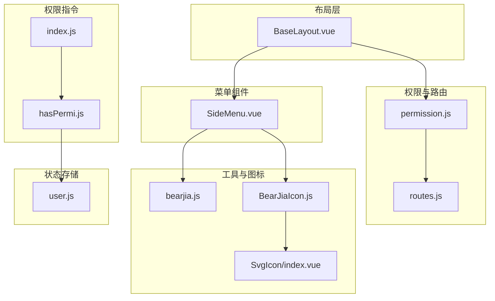
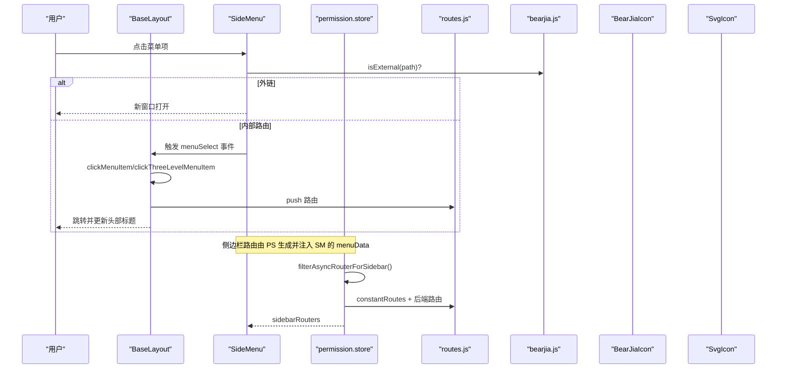
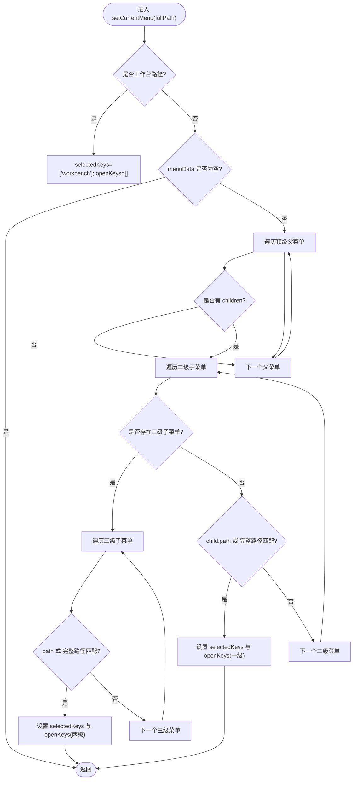
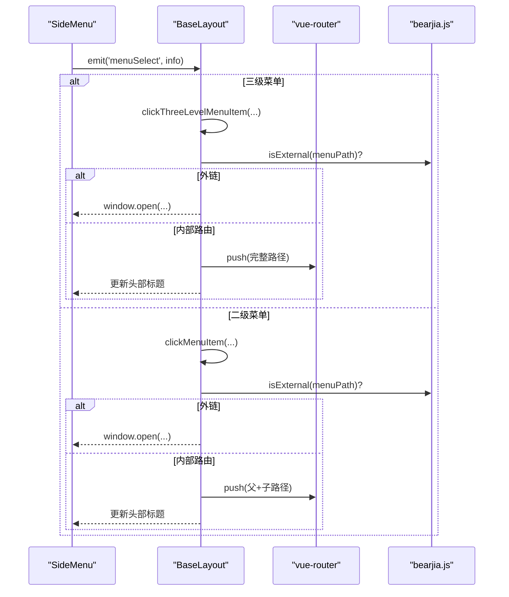
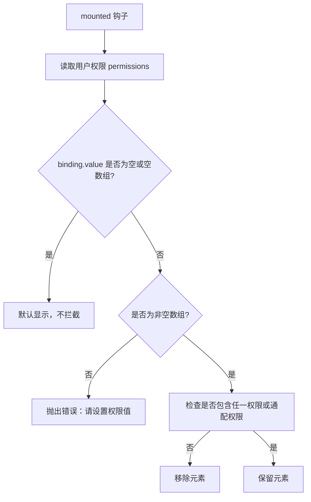
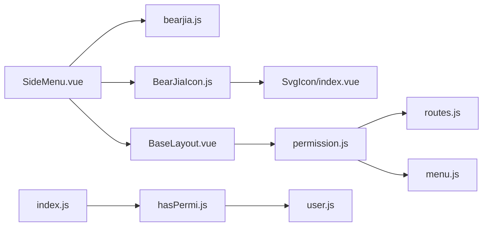

# 侧边栏菜单

<cite>
**本文引用的文件**
- [SideMenu.vue](file://bear-jia-vue3/src/components/layout/SideMenu.vue)
- [BaseLayout.vue](file://bear-jia-vue3/src/layout/BaseLayout.vue)
- [permission.js](file://bear-jia-vue3/src/stores/permission.js)
- [routes.js](file://bear-jia-vue3/src/router/routes.js)
- [hasPermi.js](file://bear-jia-vue3/src/directive/permission/hasPermi.js)
- [index.js](file://bear-jia-vue3/src/directive/index.js)
- [user.js](file://bear-jia-vue3/src/stores/user.js)
- [SvgIcon/index.vue](file://bear-jia-vue3/src/components/SvgIcon/index.vue)
- [BearJiaIcon.js](file://bear-jia-vue3/src/utils/BearJiaIcon.js)
- [bearjia.js](file://bear-jia-vue3/src/utils/bearjia.js)
- [useVirtualScroll.js](file://bear-jia-vue3/src/composables/useVirtualScroll.js)
- [auth.js](file://bear-jia-vue3/src/plugins/auth.js)
- [menu.js](file://bear-jia-vue3/src/api/system/menu.js)
</cite>

## 目录
1. [简介](#简介)
2. [项目结构](#项目结构)
3. [核心组件](#核心组件)
4. [架构总览](#架构总览)
5. [详细组件分析](#详细组件分析)
6. [依赖关系分析](#依赖关系分析)
7. [性能考量](#性能考量)
8. [故障排查指南](#故障排查指南)
9. [结论](#结论)
10. [附录](#附录)

## 简介
本文件面向希望深入理解“侧边栏菜单（SideMenu）”实现机制的开发者，围绕 Vue3 组合式 API 的实现、菜单数据的路由解析、递归渲染多级菜单、折叠/展开交互与动画、权限过滤、高亮与当前路由匹配策略、图标渲染机制、性能优化（含虚拟滚动）、以及自定义菜单项扩展方法等方面进行全面技术说明。文档同时给出关键流程的可视化图示与来源标注，便于快速定位到具体实现位置。

## 项目结构
SideMenu 作为布局系统的一部分，位于组件层；其菜单数据来源于权限状态管理；路由解析与外链识别由工具函数与路由配置共同支撑；图标渲染通过 SvgIcon 与 BearJiaIcon 组合实现；权限过滤通过 hasPermi 指令与用户角色/权限状态联动。

图表来源
- [BaseLayout.vue](file://bear-jia-vue3/src/layout/BaseLayout.vue#L1-L120)
- [SideMenu.vue](file://bear-jia-vue3/src/components/layout/SideMenu.vue#L1-L120)
- [permission.js](file://bear-jia-vue3/src/stores/permission.js#L1-L120)
- [routes.js](file://bear-jia-vue3/src/router/routes.js#L1-L100)
- [bearjia.js](file://bear-jia-vue3/src/utils/bearjia.js#L1-L20)
- [BearJiaIcon.js](file://bear-jia-vue3/src/utils/BearJiaIcon.js#L1-L91)
- [SvgIcon/index.vue](file://bear-jia-vue3/src/components/SvgIcon/index.vue#L1-L154)
- [hasPermi.js](file://bear-jia-vue3/src/directive/permission/hasPermi.js#L1-L35)
- [index.js](file://bear-jia-vue3/src/directive/index.js#L1-L24)
- [user.js](file://bear-jia-vue3/src/stores/user.js#L1-L83)

章节来源
- [BaseLayout.vue](file://bear-jia-vue3/src/layout/BaseLayout.vue#L1-L120)
- [SideMenu.vue](file://bear-jia-vue3/src/components/layout/SideMenu.vue#L1-L120)
- [permission.js](file://bear-jia-vue3/src/stores/permission.js#L1-L120)
- [routes.js](file://bear-jia-vue3/src/router/routes.js#L1-L100)

## 核心组件
- SideMenu：负责渲染侧边栏菜单、处理折叠/展开、菜单点击与高亮、外链识别与跳转、图标渲染。
- BaseLayout：承载 SideMenu 并协调菜单选择、路由跳转、头部标题同步等。
- permission store：负责从后端获取路由树、过滤外链、生成侧边栏路由与默认路由。
- bearjia.js：提供 isExternal 外链判断等通用工具。
- BearJiaIcon + SvgIcon：统一图标渲染入口，支持 Ant Design 图标与 SVG Sprite/文件图标。
- hasPermi 指令：基于用户权限动态控制 DOM 元素可见性。

章节来源
- [SideMenu.vue](file://bear-jia-vue3/src/components/layout/SideMenu.vue#L1-L120)
- [BaseLayout.vue](file://bear-jia-vue3/src/layout/BaseLayout.vue#L590-L730)
- [permission.js](file://bear-jia-vue3/src/stores/permission.js#L234-L263)
- [bearjia.js](file://bear-jia-vue3/src/utils/bearjia.js#L1-L20)
- [BearJiaIcon.js](file://bear-jia-vue3/src/utils/BearJiaIcon.js#L1-L91)
- [SvgIcon/index.vue](file://bear-jia-vue3/src/components/SvgIcon/index.vue#L1-L154)
- [hasPermi.js](file://bear-jia-vue3/src/directive/permission/hasPermi.js#L1-L35)

## 架构总览
SideMenu 的数据来源与交互流程如下：

图表来源
- [SideMenu.vue](file://bear-jia-vue3/src/components/layout/SideMenu.vue#L140-L214)
- [BaseLayout.vue](file://bear-jia-vue3/src/layout/BaseLayout.vue#L592-L730)
- [permission.js](file://bear-jia-vue3/src/stores/permission.js#L234-L263)
- [routes.js](file://bear-jia-vue3/src/router/routes.js#L1-L100)
- [bearjia.js](file://bear-jia-vue3/src/utils/bearjia.js#L1-L20)
- [BearJiaIcon.js](file://bear-jia-vue3/src/utils/BearJiaIcon.js#L1-L91)
- [SvgIcon/index.vue](file://bear-jia-vue3/src/components/SvgIcon/index.vue#L1-L154)

## 详细组件分析

### SideMenu：菜单数据解析与递归渲染
- 菜单数据来源：通过 props 接收 menuData（来自 permission.store.sidebarRouters），该数据由后端路由树经过滤与扁平化处理后提供。
- 递归渲染策略：
  - 顶级父菜单：若 children 数量 > 1 或设置了 alwaysShow 且仅有一个子菜单，则渲染为可折叠的 SubMenu；否则直接渲染为 MenuItem。
  - 二级菜单：若存在三级子菜单，则渲染为 SubMenu；否则渲染为 MenuItem。
  - 三级菜单：直接渲染为 MenuItem。
- 外链识别：通过 isExternal(path) 判断，外链点击时直接 window.open，不触发路由跳转。
- 高亮与展开：
  - selectedKeys/openKeys 通过 v-model 绑定，点击菜单时根据父子路径构造 key 并设置选中与展开。
  - setCurrentMenu(fullPath) 提供外部调用以根据当前路由路径设置选中与展开状态。
- 图标渲染：统一使用 BearJiaIcon，内部根据图标名映射 Ant Design 图标，最终由 SvgIcon 渲染。

图表来源
- [SideMenu.vue](file://bear-jia-vue3/src/components/layout/SideMenu.vue#L216-L305)

章节来源
- [SideMenu.vue](file://bear-jia-vue3/src/components/layout/SideMenu.vue#L1-L120)
- [SideMenu.vue](file://bear-jia-vue3/src/components/layout/SideMenu.vue#L140-L214)
- [SideMenu.vue](file://bear-jia-vue3/src/components/layout/SideMenu.vue#L216-L305)

### BaseLayout：菜单选择与路由跳转
- 菜单选择事件：SideMenu 发出 menuSelect，BaseLayout 统一处理点击逻辑。
- 二级菜单点击：clickMenuItem(fatherName, fatherPath, fatherTitle, name, path, title, component)。
- 三级菜单点击：clickThreeLevelMenuItem(greatFatherMenuPath, fatherMenuName, fatherMenuPath, fatherTitle, menuName, menuPath, menuTitle, menuComponent)。
- 外链处理：同样通过 isExternal 判断，外链直接 window.open。
- 路由跳转：根据父路径与子路径拼接完整路径，调用 vueRouter.push。
- 头部标题同步：更新 headerInfo.currentFatherMenuTitle 与 currentMenuTitle。

图表来源
- [BaseLayout.vue](file://bear-jia-vue3/src/layout/BaseLayout.vue#L592-L730)
- [bearjia.js](file://bear-jia-vue3/src/utils/bearjia.js#L1-L20)

章节来源
- [BaseLayout.vue](file://bear-jia-vue3/src/layout/BaseLayout.vue#L592-L730)

### 权限过滤与菜单可见性
- hasPermi 指令：在 mounted 钩子中读取用户权限集合，若绑定值为空或非数组则默认显示；否则检查是否包含任意权限或通配权限，若无权限则移除元素。
- 用户权限来源：user store 中的 permissions 字段，由后端返回并持久化。
- 指令注册：index.js 中安装 hasPermi 指令，可在模板中直接使用 v-hasPermi。

图表来源
- [hasPermi.js](file://bear-jia-vue3/src/directive/permission/hasPermi.js#L1-L35)
- [user.js](file://bear-jia-vue3/src/stores/user.js#L1-L83)
- [index.js](file://bear-jia-vue3/src/directive/index.js#L1-L24)

章节来源
- [hasPermi.js](file://bear-jia-vue3/src/directive/permission/hasPermi.js#L1-L35)
- [user.js](file://bear-jia-vue3/src/stores/user.js#L1-L83)
- [index.js](file://bear-jia-vue3/src/directive/index.js#L1-L24)

### 菜单高亮与当前路由匹配
- SideMenu 内部提供 setCurrentMenu(fullPath) 以根据当前路由设置选中与展开状态。
- 匹配策略：
  - 优先匹配三级菜单的完整路径与相对路径；
  - 若未命中，再匹配二级菜单的完整路径与相对路径；
  - 若仍未命中，检查“仅有一个子菜单”的顶级父菜单；
  - 匹配成功后设置 selectedKeys 与 openKeys。
- BaseLayout 也维护了 headerInfo 的标题同步，确保菜单高亮与头部标题一致。

章节来源
- [SideMenu.vue](file://bear-jia-vue3/src/components/layout/SideMenu.vue#L216-L305)
- [BaseLayout.vue](file://bear-jia-vue3/src/layout/BaseLayout.vue#L796-L800)

### 图标渲染机制与 SvgIcon 集成
- BearJiaIcon：根据传入的 icon 名称进行 Ant Design 图标名称映射，若无法匹配则回退到默认图标。
- SvgIcon：支持三种图标来源：
  - 外链图标：通过 mask 方式渲染；
  - Sprite 图标：通过 <use xlink:href="#icon-xxx"> 渲染；
  - 直接 SVG 文件：通过  加载 assets/icons 下的 SVG 文件。
- SideMenu 中的图标均通过 BearJiaIcon 包装，最终由 SvgIcon 渲染。

章节来源
- [BearJiaIcon.js](file://bear-jia-vue3/src/utils/BearJiaIcon.js#L1-L91)
- [SvgIcon/index.vue](file://bear-jia-vue3/src/components/SvgIcon/index.vue#L1-L154)
- [SideMenu.vue](file://bear-jia-vue3/src/components/layout/SideMenu.vue#L34-L120)

### 菜单折叠/展开交互与动画
- 折叠/展开：
  - SideMenu 通过 v-model:openKeys 控制展开状态；
  - handleOpenChange(keys) 限制同一时间最多仅保留最新一次展开的顶级父键，避免多层展开导致的混乱。
- 动画与主题：
  - 通过 :theme 与暗色主题开关控制菜单主题；
  - 样式中针对暗色主题与普通主题分别设置背景与文本颜色，保证视觉一致性。

章节来源
- [SideMenu.vue](file://bear-jia-vue3/src/components/layout/SideMenu.vue#L140-L159)
- [SideMenu.vue](file://bear-jia-vue3/src/components/layout/SideMenu.vue#L308-L386)

### 路由解析与外链处理
- 路由来源：permission.store.generateRoutes() 从后端获取路由树，经 filterAsyncRouterForSidebar 与 filterAsyncRouter 处理，生成 sidebarRouters 与 rewriteRoutes。
- 外链识别：isExternal(path) 通过正则判断 http/https/mailto/tel 等协议，用于菜单显示与点击行为区分。
- 路由拼接：BaseLayout 在三级菜单点击时，根据父路径与子路径拼接完整路径，确保与后端扁平化路由一致。

章节来源
- [permission.js](file://bear-jia-vue3/src/stores/permission.js#L234-L263)
- [routes.js](file://bear-jia-vue3/src/router/routes.js#L1-L100)
- [bearjia.js](file://bear-jia-vue3/src/utils/bearjia.js#L1-L20)
- [BaseLayout.vue](file://bear-jia-vue3/src/layout/BaseLayout.vue#L658-L730)

## 依赖关系分析
- SideMenu 依赖：
  - bearjia.js 的 isExternal；
  - BearJiaIcon 的图标映射；
  - SvgIcon 的图标渲染；
  - BaseLayout 的 menuSelect 事件处理。
- permission.store 依赖：
  - 后端接口 menu.js 的 getRouters；
  - routes.js 的 constantRoutes；
  - bearjia.js 的 isExternalLink 辅助过滤外链。
- hasPermi 指令依赖：
  - user.store 的 permissions；
  - index.js 注册指令。

图表来源
- [SideMenu.vue](file://bear-jia-vue3/src/components/layout/SideMenu.vue#L1-L120)
- [BaseLayout.vue](file://bear-jia-vue3/src/layout/BaseLayout.vue#L1-L120)
- [permission.js](file://bear-jia-vue3/src/stores/permission.js#L1-L120)
- [routes.js](file://bear-jia-vue3/src/router/routes.js#L1-L100)
- [menu.js](file://bear-jia-vue3/src/api/system/menu.js#L1-L68)
- [hasPermi.js](file://bear-jia-vue3/src/directive/permission/hasPermi.js#L1-L35)
- [index.js](file://bear-jia-vue3/src/directive/index.js#L1-L24)
- [user.js](file://bear-jia-vue3/src/stores/user.js#L1-L83)

章节来源
- [permission.js](file://bear-jia-vue3/src/stores/permission.js#L1-L120)
- [menu.js](file://bear-jia-vue3/src/api/system/menu.js#L1-L68)

## 性能考量
- 虚拟滚动在超长菜单中的应用：
  - useVirtualScroll 提供通用虚拟滚动 Composable，支持按阈值启用、缓冲区、可见区间计算与滚动事件处理。
  - 适用于大量菜单项的场景，通过只渲染可视区域内的节点降低 DOM 节点数量与重排成本。
  - 使用建议：
    - 当菜单项数量超过阈值（默认 100）时启用；
    - 根据菜单项高度调整 itemHeight；
    - 结合容器高度 containerHeight 与缓冲区 buffer 优化渲染性能。
- 其他优化点：
  - 递归渲染时尽量减少不必要的 v-if/v-for 层级；
  - 外链判断 isExternal 仅在点击时执行，避免重复计算；
  - 图标渲染统一入口，减少重复创建 VNode 的开销。

章节来源
- [useVirtualScroll.js](file://bear-jia-vue3/src/composables/useVirtualScroll.js#L1-L219)

## 故障排查指南
- 菜单不显示或不生效：
  - 检查 permission.store.sidebarRouters 是否正确生成；
  - 确认 hasPermi 指令绑定值是否为空或非数组；
  - 检查用户权限 permissions 是否包含所需权限。
- 路由跳转失败：
  - 检查 BaseLayout.clickMenuItem/clickThreeLevelMenuItem 的路径拼接逻辑；
  - 确认 isExternal 判断是否误判；
  - 查看路由表 routes.js 与后端返回的路由树是否一致。
- 图标不显示或异常：
  - BearJiaIcon 是否正确映射到 Ant Design 图标；
  - SvgIcon 的图标来源（外链/Sprite/文件）是否匹配；
  - 图标颜色与大小参数是否正确传递。

章节来源
- [permission.js](file://bear-jia-vue3/src/stores/permission.js#L234-L263)
- [hasPermi.js](file://bear-jia-vue3/src/directive/permission/hasPermi.js#L1-L35)
- [BaseLayout.vue](file://bear-jia-vue3/src/layout/BaseLayout.vue#L592-L730)
- [SvgIcon/index.vue](file://bear-jia-vue3/src/components/SvgIcon/index.vue#L1-L154)

## 结论
SideMenu 通过组合式 API 与 Pinia 状态管理，实现了灵活的多级菜单渲染、外链识别、高亮与路由联动、权限过滤与图标统一渲染。配合 BaseLayout 的路由跳转与标题同步，形成完整的侧边栏交互闭环。对于超长菜单，可采用 useVirtualScroll 进行性能优化。整体架构清晰、职责分离明确，便于扩展与维护。

## 附录

### 自定义菜单项扩展方法
- 在菜单数据中新增 meta 字段（如 title、icon、alwaysShow 等），由 permission.store 生成的 sidebarRouters 传入 SideMenu。
- 通过 BearJiaIcon 的图标映射规则，为新菜单项配置合适的图标名。
- 如需对外链菜单进行特殊处理，可在 SideMenu 的点击回调中增加条件分支，或在 BaseLayout 的点击处理中补充逻辑。

章节来源
- [permission.js](file://bear-jia-vue3/src/stores/permission.js#L234-L263)
- [SideMenu.vue](file://bear-jia-vue3/src/components/layout/SideMenu.vue#L34-L120)
- [BearJiaIcon.js](file://bear-jia-vue3/src/utils/BearJiaIcon.js#L1-L91)