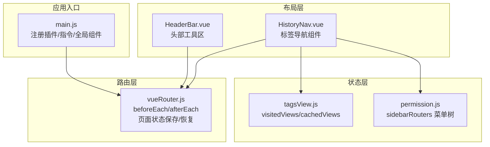
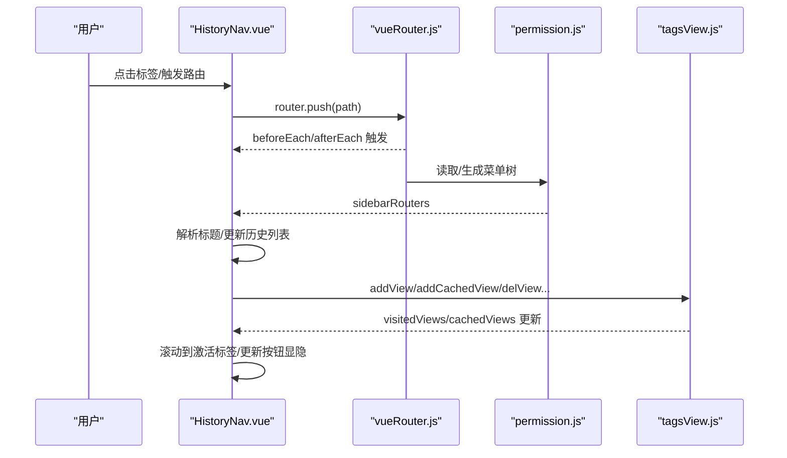
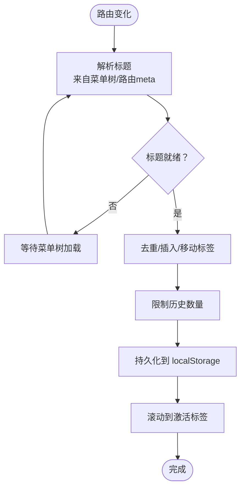
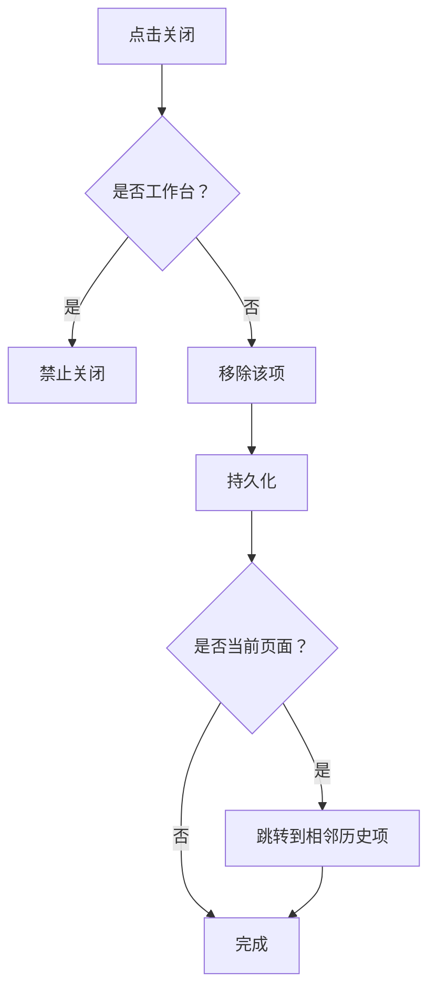
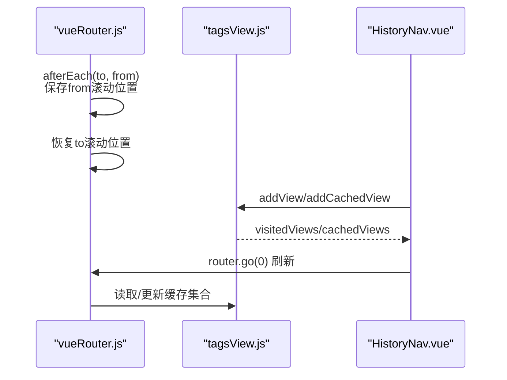
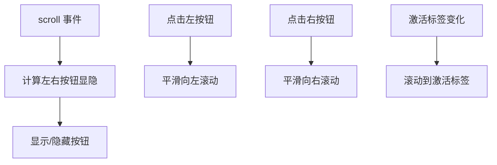
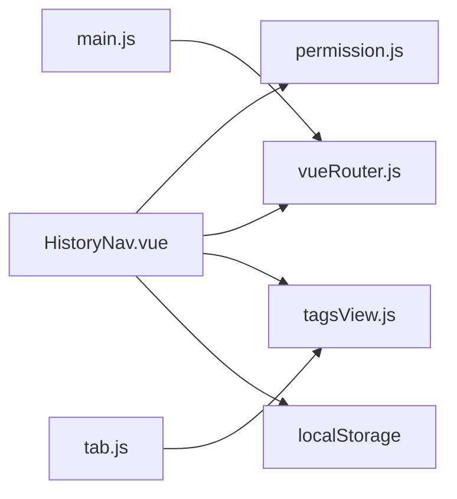

# 历史导航

<cite>
**本文引用的文件**
- [HistoryNav.vue](file://bear-jia-vue3/src/components/layout/HistoryNav.vue)
- [tagsView.js](file://bear-jia-vue3/src/stores/tagsView.js)
- [tab.js](file://bear-jia-vue3/src/plugins/tab.js)
- [vueRouter.js](file://bear-jia-vue3/src/router/vueRouter.js)
- [permission.js](file://bear-jia-vue3/src/stores/permission.js)
- [main.js](file://bear-jia-vue3/src/main.js)
- [HeaderBar.vue](file://bear-jia-vue3/src/components/layout/HeaderBar.vue)
</cite>

## 目录
1. [简介](#简介)
2. [项目结构](#项目结构)
3. [核心组件](#核心组件)
4. [架构总览](#架构总览)
5. [详细组件分析](#详细组件分析)
6. [依赖关系分析](#依赖关系分析)
7. [性能考量](#性能考量)
8. [故障排查指南](#故障排查指南)
9. [结论](#结论)

## 简介
本文件面向“历史导航（HistoryNav）”组件，系统阐述其标签页管理机制与实现细节，覆盖以下关键主题：
- 如何监听路由变化并动态维护标签页列表（添加、激活、缓存状态）
- 标签页关闭策略：关闭当前、关闭其他、关闭所有、关闭左侧/右侧（结合 Pinia Store 的动作）
- 与 Vue Router 的 keep-alive 缓存协同工作原理（通过 tagsView Store 的 visitedViews/cachedViews）
- 标签页拖拽排序能力（基于 HTML5 Drag API 或第三方库 SortableJS 的集成思路）
- 标签页溢出时的滚动导航与下拉菜单展示逻辑
- 性能优化建议：标签页数量限制与自动清理策略，防止内存泄漏

## 项目结构
HistoryNav 组件位于布局层，负责顶部标签导航；其行为与 Pinia Store 中的标签页缓存模型、路由守卫及权限生成紧密耦合。

图表来源
- [HistoryNav.vue](file://bear-jia-vue3/src/components/layout/HistoryNav.vue#L1-L120)
- [tagsView.js](file://bear-jia-vue3/src/stores/tagsView.js#L1-L106)
- [permission.js](file://bear-jia-vue3/src/stores/permission.js#L1-L120)
- [vueRouter.js](file://bear-jia-vue3/src/router/vueRouter.js#L1-L120)
- [main.js](file://bear-jia-vue3/src/main.js#L1-L62)

章节来源
- [HistoryNav.vue](file://bear-jia-vue3/src/components/layout/HistoryNav.vue#L1-L120)
- [tagsView.js](file://bear-jia-vue3/src/stores/tagsView.js#L1-L106)
- [permission.js](file://bear-jia-vue3/src/stores/permission.js#L1-L120)
- [vueRouter.js](file://bear-jia-vue3/src/router/vueRouter.js#L1-L120)
- [main.js](file://bear-jia-vue3/src/main.js#L1-L62)

## 核心组件
- HistoryNav.vue：负责标签页列表的渲染、滚动控制、按钮显隐、点击跳转、关闭操作以及本地持久化。
- tagsView.js：Pinia Store，维护 visitedViews（访问历史）与 cachedViews（keep-alive 缓存集合），并提供增删改与“关闭其他/全部/左侧/右侧”的动作。
- tab.js：插件封装，统一对外暴露刷新、关闭、打开、更新等标签页操作，内部调用 tagsView Store 的动作。
- vueRouter.js：路由守卫中保存/恢复页面滚动位置，影响标签页激活态与滚动定位体验。
- permission.js：提供菜单树 sidebarRouters，HistoryNav 通过该树解析标签标题。
- main.js：应用启动，注册路由、Ant Design Vue、Pinia 等，为 HistoryNav 提供运行环境。

章节来源
- [HistoryNav.vue](file://bear-jia-vue3/src/components/layout/HistoryNav.vue#L1-L120)
- [tagsView.js](file://bear-jia-vue3/src/stores/tagsView.js#L1-L106)
- [tab.js](file://bear-jia-vue3/src/plugins/tab.js#L1-L69)
- [vueRouter.js](file://bear-jia-vue3/src/router/vueRouter.js#L1-L120)
- [permission.js](file://bear-jia-vue3/src/stores/permission.js#L1-L120)
- [main.js](file://bear-jia-vue3/src/main.js#L1-L62)

## 架构总览
HistoryNav 与路由、状态、权限三者协同：
- 路由变化触发 HistoryNav 的标签列表更新与激活态同步；
- 标题解析依赖 permission.store.sidebarRouters；
- 标签页关闭与缓存管理由 tagsView Store 承担；
- 页面状态保存/恢复由路由守卫负责，间接影响标签激活与滚动定位。

图表来源
- [HistoryNav.vue](file://bear-jia-vue3/src/components/layout/HistoryNav.vue#L120-L390)
- [vueRouter.js](file://bear-jia-vue3/src/router/vueRouter.js#L37-L126)
- [permission.js](file://bear-jia-vue3/src/stores/permission.js#L210-L264)
- [tagsView.js](file://bear-jia-vue3/src/stores/tagsView.js#L1-L106)

## 详细组件分析

### 标签页管理机制与路由联动
- 路由监听：HistoryNav 监听路由 path 变化，解析标题并调用 addHistory 添加或移动标签，同时更新 currentPath 与 activeIndex。
- 标题解析：优先从 permission.store.sidebarRouters 中查找匹配项的 meta.title/name，若未就绪则返回“加载中...”，待菜单树就绪后自动更新。
- 激活态与滚动：每次路由变化后，通过 scrollToActiveTag 将当前激活标签滚动至可视区域中央，保证用户体验。

图表来源
- [HistoryNav.vue](file://bear-jia-vue3/src/components/layout/HistoryNav.vue#L120-L238)

章节来源
- [HistoryNav.vue](file://bear-jia-vue3/src/components/layout/HistoryNav.vue#L120-L238)

### 标签页的添加、激活与缓存状态管理
- 添加与去重：addHistory 会先查找相同 path 的旧项并移除，再按规则插入（工作台始终在首位，其余页面插入到工作台之后）。
- 数量限制：MAX_HISTORY 默认 20，超出时仅保留工作台与最近若干项。
- 激活态：activeIndex 基于当前路由 path 计算，配合 scrollIntoView 保证可见。
- 缓存协同：HistoryNav 自身不直接管理 keep-alive 缓存，而是通过 tagsView Store 的 visitedViews/cachedViews 与路由守卫共同实现页面状态持久化与缓存命中。

章节来源
- [HistoryNav.vue](file://bear-jia-vue3/src/components/layout/HistoryNav.vue#L191-L238)
- [tagsView.js](file://bear-jia-vue3/src/stores/tagsView.js#L1-L106)
- [vueRouter.js](file://bear-jia-vue3/src/router/vueRouter.js#L21-L35)

### 标签页关闭策略
- 关闭当前：removeHistory 删除当前索引项，若删除的是当前页面则跳转到相邻历史项。
- 关闭其他：保留工作台与当前项，其余清空。
- 关闭所有：仅保留工作台，必要时跳转至工作台。
- 关闭左侧/右侧：通过插件 tab.js 调用 tagsView.Store 的 delLeftTags/delRightTags（需在 Store 中实现对应动作）。

图表来源
- [HistoryNav.vue](file://bear-jia-vue3/src/components/layout/HistoryNav.vue#L285-L312)
- [tab.js](file://bear-jia-vue3/src/plugins/tab.js#L46-L57)
- [tagsView.js](file://bear-jia-vue3/src/stores/tagsView.js#L54-L106)

章节来源
- [HistoryNav.vue](file://bear-jia-vue3/src/components/layout/HistoryNav.vue#L285-L349)
- [tab.js](file://bear-jia-vue3/src/plugins/tab.js#L1-L69)
- [tagsView.js](file://bear-jia-vue3/src/stores/tagsView.js#L54-L106)

### 与 Vue Router 的 keep-alive 缓存协同
- 页面状态保存/恢复：afterEach 中保存 from 的滚动位置，进入 to 时恢复，提升标签切换时的连续性。
- 标签页缓存：tagsView.Store 维护 visitedViews/cachedViews，其中 cachedViews 与 keep-alive 的 include 对齐，避免重复渲染。
- 刷新策略：HistoryNav 的“刷新页面”通过 router.go(0) 实现，结合 tagsView 的缓存策略可实现快速刷新。

图表来源
- [vueRouter.js](file://bear-jia-vue3/src/router/vueRouter.js#L21-L35)
- [vueRouter.js](file://bear-jia-vue3/src/router/vueRouter.js#L111-L126)
- [tagsView.js](file://bear-jia-vue3/src/stores/tagsView.js#L1-L106)
- [HistoryNav.vue](file://bear-jia-vue3/src/components/layout/HistoryNav.vue#L314-L318)

章节来源
- [vueRouter.js](file://bear-jia-vue3/src/router/vueRouter.js#L21-L35)
- [vueRouter.js](file://bear-jia-vue3/src/router/vueRouter.js#L111-L126)
- [tagsView.js](file://bear-jia-vue3/src/stores/tagsView.js#L1-L106)
- [HistoryNav.vue](file://bear-jia-vue3/src/components/layout/HistoryNav.vue#L314-L318)

### 拖拽排序功能实现（基于 HTML5 Drag API 或第三方库）
- 现状：HistoryNav.vue 未内置拖拽排序逻辑。
- 方案一：使用 HTML5 Drag API
  - 在标签元素上启用 draggable 属性，实现 dragstart/dragover/drop 事件，交换 historyList 中的顺序，完成后持久化。
- 方案二：集成 SortableJS（仓库存在依赖）
  - 在标签容器上初始化 Sortable，监听 onEnd 回调，更新 historyList 并持久化。
- 建议：与现有本地存储策略一致，排序后立即写入 localStorage，避免刷新丢失。

[本节为实现建议，不直接分析具体源码文件]

### 标签页溢出时的滚动导航与下拉菜单
- 滚动导航：history-tags 容器支持横向滚动，左右按钮根据 scrollLeft/scrollWidth/clientWidth 动态显示。
- 激活标签定位：scrollToActiveTag 将当前激活标签居中显示，提升可发现性。
- 下拉菜单：激活标签的下拉菜单提供“刷新页面/关闭页面/关闭其他/关闭所有”。

图表来源
- [HistoryNav.vue](file://bear-jia-vue3/src/components/layout/HistoryNav.vue#L131-L184)
- [HistoryNav.vue](file://bear-jia-vue3/src/components/layout/HistoryNav.vue#L141-L164)
- [HistoryNav.vue](file://bear-jia-vue3/src/components/layout/HistoryNav.vue#L166-L184)

章节来源
- [HistoryNav.vue](file://bear-jia-vue3/src/components/layout/HistoryNav.vue#L131-L184)
- [HistoryNav.vue](file://bear-jia-vue3/src/components/layout/HistoryNav.vue#L141-L164)
- [HistoryNav.vue](file://bear-jia-vue3/src/components/layout/HistoryNav.vue#L166-L184)

## 依赖关系分析
- HistoryNav 依赖：
  - permission.store.sidebarRouters：解析菜单标题
  - vueRouter：监听路由变化、页面状态保存/恢复
  - tagsView.Store：维护 visitedViews/cachedViews
  - localStorage：持久化历史列表
- 插件 tab.js 作为外部接口，内部仍依赖 tagsView.Store 的动作。
- main.js 注册了路由、Pinia、Ant Design Vue 等，为 HistoryNav 提供运行时环境。

图表来源
- [HistoryNav.vue](file://bear-jia-vue3/src/components/layout/HistoryNav.vue#L1-L120)
- [permission.js](file://bear-jia-vue3/src/stores/permission.js#L210-L264)
- [vueRouter.js](file://bear-jia-vue3/src/router/vueRouter.js#L1-L120)
- [tagsView.js](file://bear-jia-vue3/src/stores/tagsView.js#L1-L106)
- [tab.js](file://bear-jia-vue3/src/plugins/tab.js#L1-L69)
- [main.js](file://bear-jia-vue3/src/main.js#L1-L62)

章节来源
- [HistoryNav.vue](file://bear-jia-vue3/src/components/layout/HistoryNav.vue#L1-L120)
- [permission.js](file://bear-jia-vue3/src/stores/permission.js#L210-L264)
- [vueRouter.js](file://bear-jia-vue3/src/router/vueRouter.js#L1-L120)
- [tagsView.js](file://bear-jia-vue3/src/stores/tagsView.js#L1-L106)
- [tab.js](file://bear-jia-vue3/src/plugins/tab.js#L1-L69)
- [main.js](file://bear-jia-vue3/src/main.js#L1-L62)

## 性能考量
- 标签页数量限制：HistoryNav 内部已限制 MAX_HISTORY，默认 20，避免过多标签导致 DOM 与内存压力。
- 自动清理策略：
  - 关闭其他/关闭所有：通过 tagsView.Store 的 delOthersViews/delAllViews 清理缓存集合，减少 keep-alive 压力。
  - 关闭左侧/右侧：需在 tagsView.Store 中补充 delLeftTags/delRightTags 动作，以配合插件 tab.js 的调用。
- 滚动与渲染：
  - 横向滚动容器使用 smooth scroll-behavior，避免频繁重排。
  - 标签宽度与 ellipsis 控制，减少长标题造成的布局抖动。
- 页面状态保存：
  - afterEach 中保存/恢复滚动位置，减少滚动回退带来的重绘成本。

章节来源
- [HistoryNav.vue](file://bear-jia-vue3/src/components/layout/HistoryNav.vue#L76-L83)
- [HistoryNav.vue](file://bear-jia-vue3/src/components/layout/HistoryNav.vue#L220-L228)
- [tagsView.js](file://bear-jia-vue3/src/stores/tagsView.js#L54-L106)
- [vueRouter.js](file://bear-jia-vue3/src/router/vueRouter.js#L21-L35)
- [vueRouter.js](file://bear-jia-vue3/src/router/vueRouter.js#L111-L126)

## 故障排查指南
- 标题显示“加载中...”
  - 可能原因：菜单树尚未加载完成。组件内已做重试逻辑，等待后会自动更新。
  - 排查要点：确认 permission.store.sidebarRouters 是否正确生成。
- 关闭工作台无效
  - 行为预期：工作台不可关闭。检查 HistoryNav 的关闭逻辑是否阻止了工作台路径。
- 刷新后标签丢失
  - 可能原因：未持久化历史列表或持久化失败。
  - 排查要点：确认 localStorage 中的 historyList 是否存在；检查 addHistory/removeHistory 的持久化调用。
- 滚动按钮不显示
  - 可能原因：DOM 尚未渲染或容器尺寸异常。
  - 排查要点：确认 nextTick 与 resize 事件监听是否生效；检查样式中隐藏滚动条的兼容性。
- 关闭左侧/右侧无效
  - 可能原因：tagsView.Store 未实现 delLeftTags/delRightTags 动作。
  - 排查要点：在 Store 中补充相应动作，或在插件 tab.js 中调整调用。

章节来源
- [HistoryNav.vue](file://bear-jia-vue3/src/components/layout/HistoryNav.vue#L88-L129)
- [HistoryNav.vue](file://bear-jia-vue3/src/components/layout/HistoryNav.vue#L285-L312)
- [HistoryNav.vue](file://bear-jia-vue3/src/components/layout/HistoryNav.vue#L131-L164)
- [tab.js](file://bear-jia-vue3/src/plugins/tab.js#L46-L57)
- [tagsView.js](file://bear-jia-vue3/src/stores/tagsView.js#L54-L106)

## 结论
HistoryNav 通过路由监听与菜单树解析实现了标签页的动态维护，结合 localStorage 与 tagsView Store 的 visitedViews/cachedViews，形成了较为完整的标签页生命周期管理。当前实现覆盖了添加、激活、关闭与滚动导航等核心需求；若要完善拖拽排序与“关闭左侧/右侧”能力，可在 Store 中补充相应动作并在插件中统一调用。整体架构清晰、职责分离明确，具备良好的扩展性与可维护性。