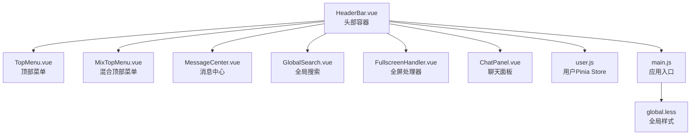
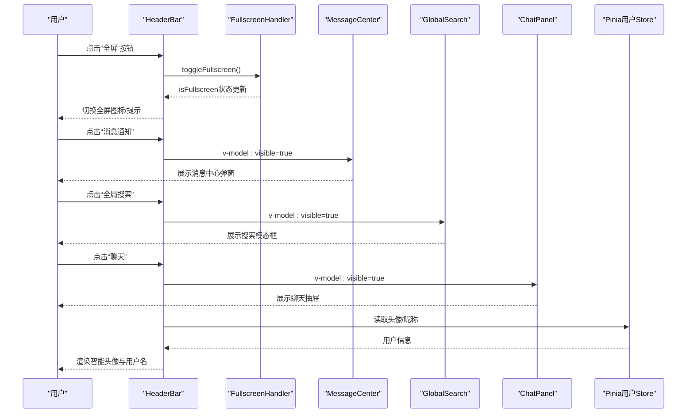
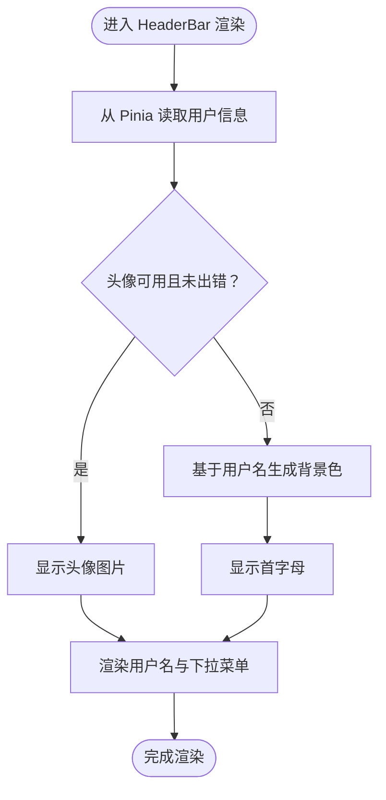
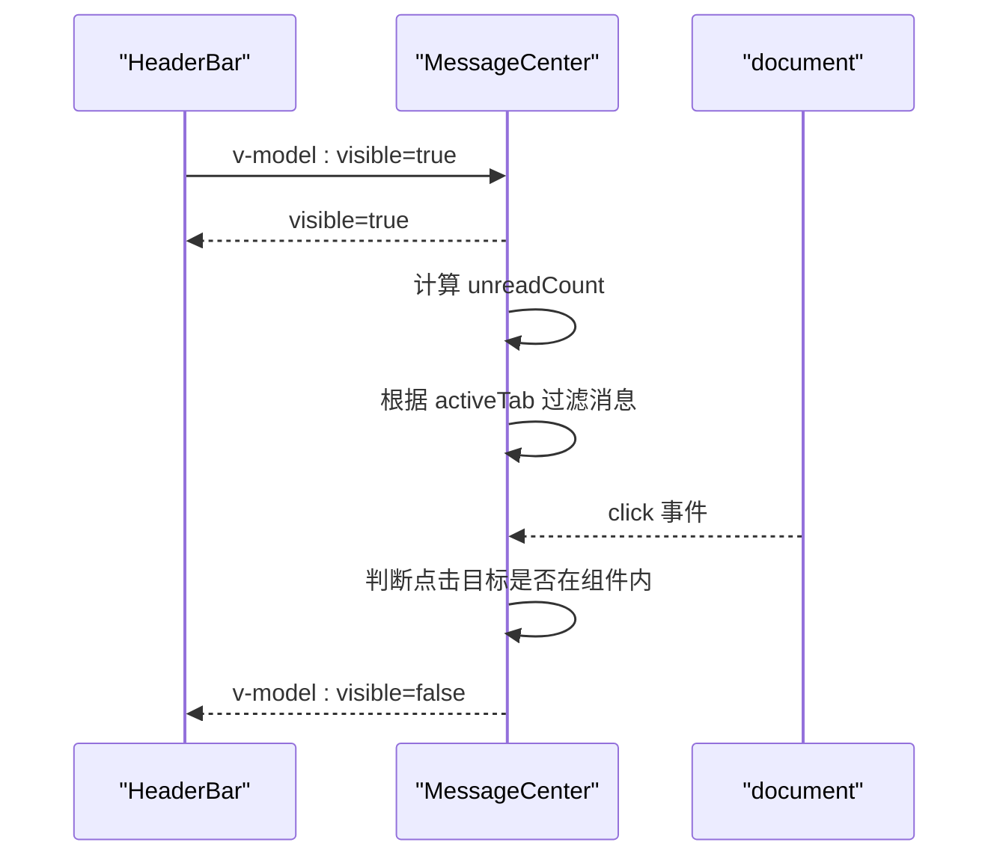
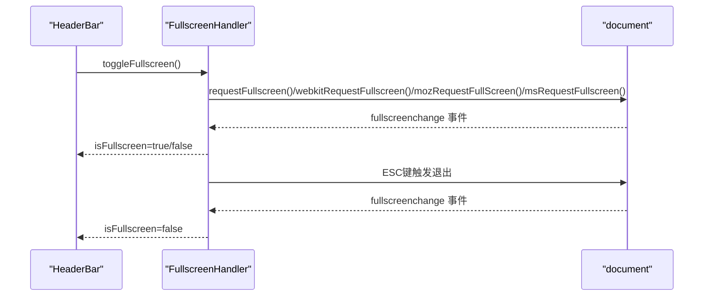
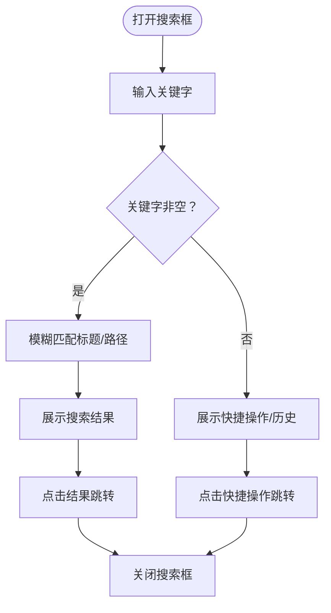
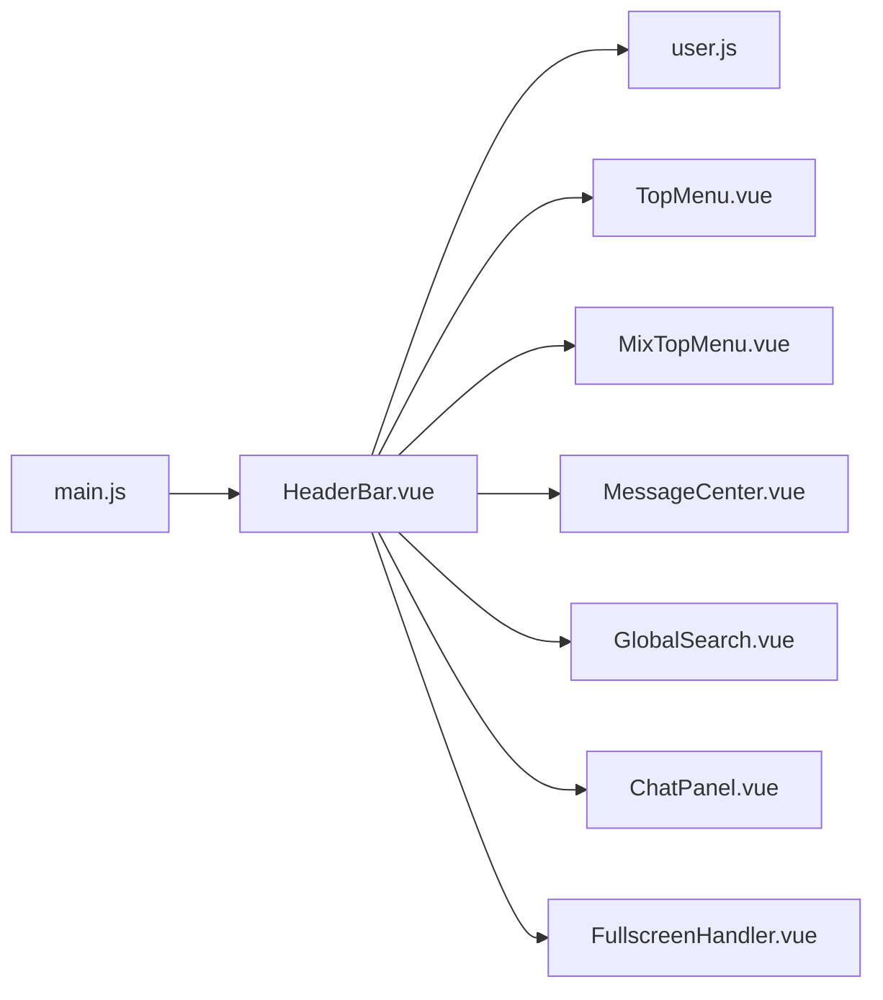

# 头部组件

<cite>
**本文档引用的文件**
- [HeaderBar.vue](file://bear-jia-vue3/src/components/layout/HeaderBar.vue)
- [MessageCenter.vue](file://bear-jia-vue3/src/components/common/MessageCenter.vue)
- [GlobalSearch.vue](file://bear-jia-vue3/src/components/common/GlobalSearch.vue)
- [FullscreenHandler.vue](file://bear-jia-vue3/src/components/common/FullscreenHandler.vue)
- [ChatPanel.vue](file://bear-jia-vue3/src/components/common/ChatPanel.vue)
- [TopMenu.vue](file://bear-jia-vue3/src/components/layout/TopMenu.vue)
- [MixTopMenu.vue](file://bear-jia-vue3/src/components/layout/MixTopMenu.vue)
- [user.js](file://bear-jia-vue3/src/stores/user.js)
- [main.js](file://bear-jia-vue3/src/main.js)
- [global.less](file://bear-jia-vue3/src/style/global.less)
- [SettingDrawer.vue](file://bear-jia-vue3/src/components/layout/SettingDrawer.vue)
</cite>

## 目录
1. [简介](#简介)
2. [项目结构](#项目结构)
3. [核心组件](#核心组件)
4. [架构总览](#架构总览)
5. [详细组件分析](#详细组件分析)
6. [依赖关系分析](#依赖关系分析)
7. [性能考量](#性能考量)
8. [故障排查指南](#故障排查指南)
9. [结论](#结论)
10. [附录](#附录)

## 简介
本文件面向“头部组件（HeaderBar）”的全面技术文档，聚焦于其模块化设计结构与关键能力：
- 用户信息区域的展示逻辑（头像、用户名、角色标签渲染）
- 消息中心集成机制（通过组件状态与事件驱动）
- 全屏切换功能（浏览器API调用与状态管理、兼容性处理）
- 系统搜索框的快捷键绑定与模糊匹配实现
- 多语言切换下拉框的实现方案与全局i18n实例交互
- 头部组件的扩展接口与自定义按钮/信息区域接入
- 响应式设计细节与不同屏幕尺寸下的折叠策略

## 项目结构
HeaderBar位于布局组件目录，作为页面顶部导航与用户操作入口，配合顶部菜单、消息中心、全局搜索、全屏处理器、聊天面板等子组件协同工作。

图表来源
- [HeaderBar.vue](file://bear-jia-vue3/src/components/layout/HeaderBar.vue#L1-L160)
- [TopMenu.vue](file://bear-jia-vue3/src/components/layout/TopMenu.vue#L1-L80)
- [MixTopMenu.vue](file://bear-jia-vue3/src/components/layout/MixTopMenu.vue#L1-L60)
- [MessageCenter.vue](file://bear-jia-vue3/src/components/common/MessageCenter.vue#L1-L80)
- [GlobalSearch.vue](file://bear-jia-vue3/src/components/common/GlobalSearch.vue#L1-L60)
- [FullscreenHandler.vue](file://bear-jia-vue3/src/components/common/FullscreenHandler.vue#L1-L40)
- [ChatPanel.vue](file://bear-jia-vue3/src/components/common/ChatPanel.vue#L1-L40)
- [user.js](file://bear-jia-vue3/src/stores/user.js#L1-L40)
- [main.js](file://bear-jia-vue3/src/main.js#L1-L40)
- [global.less](file://bear-jia-vue3/src/style/global.less#L1-L60)

章节来源
- [HeaderBar.vue](file://bear-jia-vue3/src/components/layout/HeaderBar.vue#L1-L160)
- [main.js](file://bear-jia-vue3/src/main.js#L1-L40)

## 核心组件
- HeaderBar：负责头部布局、用户信息渲染、功能按钮区、顶部/混合菜单区、以及与子组件的通信。
- MessageCenter：消息中心弹窗与未读计数展示，支持标签筛选与一键已读。
- GlobalSearch：全局搜索模态框，支持模糊匹配、快捷操作与搜索历史。
- FullscreenHandler：封装浏览器全屏API，提供进入/退出/切换与状态暴露。
- ChatPanel：右侧抽屉式聊天面板，支持联系人列表、消息列表与发送。
- TopMenu/MixTopMenu：顶部菜单与混合模式菜单，负责菜单选择与高亮。
- user.js：Pinia用户状态存储，提供头像、昵称、角色等信息。

章节来源
- [HeaderBar.vue](file://bear-jia-vue3/src/components/layout/HeaderBar.vue#L1-L120)
- [MessageCenter.vue](file://bear-jia-vue3/src/components/common/MessageCenter.vue#L1-L120)
- [GlobalSearch.vue](file://bear-jia-vue3/src/components/common/GlobalSearch.vue#L1-L120)
- [FullscreenHandler.vue](file://bear-jia-vue3/src/components/common/FullscreenHandler.vue#L1-L80)
- [ChatPanel.vue](file://bear-jia-vue3/src/components/common/ChatPanel.vue#L1-L120)
- [TopMenu.vue](file://bear-jia-vue3/src/components/layout/TopMenu.vue#L1-L120)
- [MixTopMenu.vue](file://bear-jia-vue3/src/components/layout/MixTopMenu.vue#L1-L120)
- [user.js](file://bear-jia-vue3/src/stores/user.js#L1-L40)

## 架构总览
HeaderBar通过props与emits与父组件交互，内部组合多个功能组件并通过Pinia与浏览器API完成状态管理与行为控制。

图表来源
- [HeaderBar.vue](file://bear-jia-vue3/src/components/layout/HeaderBar.vue#L340-L360)
- [FullscreenHandler.vue](file://bear-jia-vue3/src/components/common/FullscreenHandler.vue#L60-L90)
- [MessageCenter.vue](file://bear-jia-vue3/src/components/common/MessageCenter.vue#L1-L60)
- [GlobalSearch.vue](file://bear-jia-vue3/src/components/common/GlobalSearch.vue#L1-L60)
- [ChatPanel.vue](file://bear-jia-vue3/src/components/common/ChatPanel.vue#L1-L60)
- [user.js](file://bear-jia-vue3/src/stores/user.js#L1-L40)

## 详细组件分析

### 用户信息区域渲染逻辑
- 数据来源：Pinia用户Store（头像、昵称、用户名、角色等）。
- 智能头像：当用户头像URL可用且未发生错误时优先显示图片；否则根据用户名生成首字母与背景色。
- 用户名截断：用户名最大宽度限制，超出部分省略。
- 角色标签：当前代码未直接渲染角色标签，如需可扩展在模板中添加角色徽章或标签。

图表来源
- [HeaderBar.vue](file://bear-jia-vue3/src/components/layout/HeaderBar.vue#L270-L310)
- [user.js](file://bear-jia-vue3/src/stores/user.js#L1-L40)

章节来源
- [HeaderBar.vue](file://bear-jia-vue3/src/components/layout/HeaderBar.vue#L100-L160)
- [user.js](file://bear-jia-vue3/src/stores/user.js#L1-L40)

### 消息中心集成机制
- 未读消息计数：通过计算属性统计未读消息数量。
- 标签筛选：支持“全部/未读/系统通知/任务提醒”四类标签切换。
- 一键已读：遍历消息列表将未读标记置为已读。
- 外部点击关闭：监听document点击事件，点击外部区域自动关闭面板。
- 与HeaderBar协作：HeaderBar通过v-model:visible控制消息中心弹窗显隐。

图表来源
- [HeaderBar.vue](file://bear-jia-vue3/src/components/layout/HeaderBar.vue#L70-L90)
- [MessageCenter.vue](file://bear-jia-vue3/src/components/common/MessageCenter.vue#L1-L120)
- [MessageCenter.vue](file://bear-jia-vue3/src/components/common/MessageCenter.vue#L180-L236)

章节来源
- [MessageCenter.vue](file://bear-jia-vue3/src/components/common/MessageCenter.vue#L1-L236)

### 全屏切换功能（浏览器API与状态管理）
- 浏览器API：封装requestFullscreen/exitFullscreen，并兼容webkit/moz/ms前缀。
- 状态管理：通过FullscreenHandler暴露isFullscreen与toggleFullscreen，HeaderBar读取状态并切换图标。
- 兼容性处理：监听多套事件名称（fullscreenchange、webkitfullscreenchange、mozfullscreenchange、MSFullscreenChange），按键ESC退出全屏。
- 提示信息：全屏时显示淡入淡出提示，告知退出方式。

图表来源
- [HeaderBar.vue](file://bear-jia-vue3/src/components/layout/HeaderBar.vue#L348-L359)
- [FullscreenHandler.vue](file://bear-jia-vue3/src/components/common/FullscreenHandler.vue#L40-L108)

章节来源
- [FullscreenHandler.vue](file://bear-jia-vue3/src/components/common/FullscreenHandler.vue#L1-L147)
- [HeaderBar.vue](file://bear-jia-vue3/src/components/layout/HeaderBar.vue#L348-L359)

### 系统搜索框的快捷键绑定与模糊匹配
- 快捷键：通过全局搜索模态框的输入框事件实现输入即搜索。
- 模糊匹配：对标题与路径进行大小写无关的包含匹配。
- 搜索历史：输入非空时加入历史队列，最多保留5条。
- 快捷操作：无输入时展示常用功能入口（用户管理、角色管理、系统设置、操作日志）。

图表来源
- [GlobalSearch.vue](file://bear-jia-vue3/src/components/common/GlobalSearch.vue#L120-L193)

章节来源
- [GlobalSearch.vue](file://bear-jia-vue3/src/components/common/GlobalSearch.vue#L1-L193)

### 多语言切换下拉框与全局i18n实例交互
- 当前仓库前端未发现多语言切换下拉框的实现文件。
- 若需实现，可在HeaderBar中新增语言切换下拉菜单，结合全局i18n实例（如Vue I18n）动态切换语言，并持久化用户选择。
- 该部分为概念性扩展说明，不对应具体源码文件。

[本节为概念性内容，不附带章节来源]

### 头部组件扩展接口
- 自定义操作按钮：在HeaderBar右侧区域预留插槽或新增按钮，通过事件向上派发（如自定义事件名）。
- 自定义信息展示区域：在用户信息区右侧插入自定义节点，使用下拉菜单承载更多操作入口。
- 顶部/混合菜单扩展：通过传入menuData与currentFirstLevelMenu，结合TopMenu/MixTopMenu实现多级菜单扩展。

章节来源
- [HeaderBar.vue](file://bear-jia-vue3/src/components/layout/HeaderBar.vue#L40-L120)
- [TopMenu.vue](file://bear-jia-vue3/src/components/layout/TopMenu.vue#L1-L120)
- [MixTopMenu.vue](file://bear-jia-vue3/src/components/layout/MixTopMenu.vue#L1-L120)

### 响应式设计细节
- 头部高度固定为56px，左右区域采用flex布局，右侧按钮区使用gap控制间距。
- 不同布局模式（顶部/混合/侧边/抽屉）下，左侧Logo/面包屑与菜单区域布局调整。
- 用户信息区域用户名最大宽度与省略处理，避免溢出。
- 全局样式通过CSS变量统一主题色与背景色，便于暗色模式适配。

章节来源
- [HeaderBar.vue](file://bear-jia-vue3/src/components/layout/HeaderBar.vue#L360-L533)
- [global.less](file://bear-jia-vue3/src/style/global.less#L1-L120)

## 依赖关系分析
- HeaderBar依赖：
  - Pinia用户Store（读取头像/昵称）
  - TopMenu/MixTopMenu（顶部菜单）
  - MessageCenter/GlobalSearch/ChatPanel（功能面板）
  - FullscreenHandler（全屏API）
- 应用入口main.js注册Ant Design Vue、Pinia、路由等，确保组件运行环境。

图表来源
- [main.js](file://bear-jia-vue3/src/main.js#L1-L40)
- [HeaderBar.vue](file://bear-jia-vue3/src/components/layout/HeaderBar.vue#L160-L220)
- [user.js](file://bear-jia-vue3/src/stores/user.js#L1-L40)

章节来源
- [main.js](file://bear-jia-vue3/src/main.js#L1-L40)
- [HeaderBar.vue](file://bear-jia-vue3/src/components/layout/HeaderBar.vue#L160-L220)

## 性能考量
- 头像渲染：优先使用图片，失败回退到首字母与背景色，减少额外请求与计算。
- 消息中心：未读计数与过滤均基于内存数组，建议在实际业务中接入后端分页与缓存。
- 全屏切换：仅在切换时触发DOM变更，避免频繁监听导致性能损耗。
- 搜索框：模糊匹配在小规模数据集上开销可控，大数据量建议引入索引或服务端检索。

[本节为通用建议，不附带章节来源]

## 故障排查指南
- 全屏无法退出：确认浏览器是否允许全屏API，检查事件监听是否正确清理。
- 头像不显示：检查用户头像URL是否有效，错误回调会触发回退逻辑。
- 消息中心点击外部不关闭：确认document事件监听是否生效，组件可见性状态是否正确绑定。
- 聊天面板无法打开：确认v-model:visible双向绑定是否正确，抽屉组件是否正常挂载。

章节来源
- [FullscreenHandler.vue](file://bear-jia-vue3/src/components/common/FullscreenHandler.vue#L80-L108)
- [HeaderBar.vue](file://bear-jia-vue3/src/components/layout/HeaderBar.vue#L280-L310)
- [MessageCenter.vue](file://bear-jia-vue3/src/components/common/MessageCenter.vue#L210-L236)
- [ChatPanel.vue](file://bear-jia-vue3/src/components/common/ChatPanel.vue#L1-L60)

## 结论
HeaderBar以模块化方式整合用户信息、顶部菜单、消息中心、全局搜索、全屏切换与聊天面板，通过Pinia与浏览器API实现状态与行为控制。其布局与样式采用CSS变量与响应式策略，具备良好的可扩展性与跨模式适配能力。若需进一步增强，可在消息中心接入实时推送、在搜索框集成快捷键与历史记录持久化、在用户信息区扩展角色标签与更多操作入口。

[本节为总结性内容，不附带章节来源]

## 附录
- 布局设置与模式：通过设置抽屉（SettingDrawer）切换导航模式与固定头部等布局选项，影响HeaderBar的左侧Logo/面包屑与菜单区域布局。
- 主题与样式：全局样式通过CSS变量统一主题色与背景色，HeaderBar使用var(--component-background)、var(--text-primary)等变量，便于暗色模式适配。

章节来源
- [SettingDrawer.vue](file://bear-jia-vue3/src/components/layout/SettingDrawer.vue#L86-L120)
- [global.less](file://bear-jia-vue3/src/style/global.less#L1-L120)