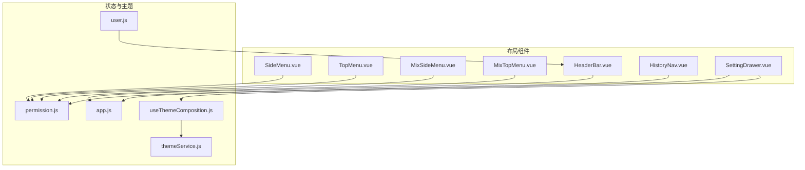
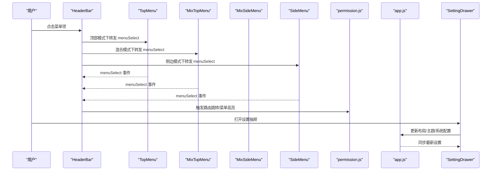
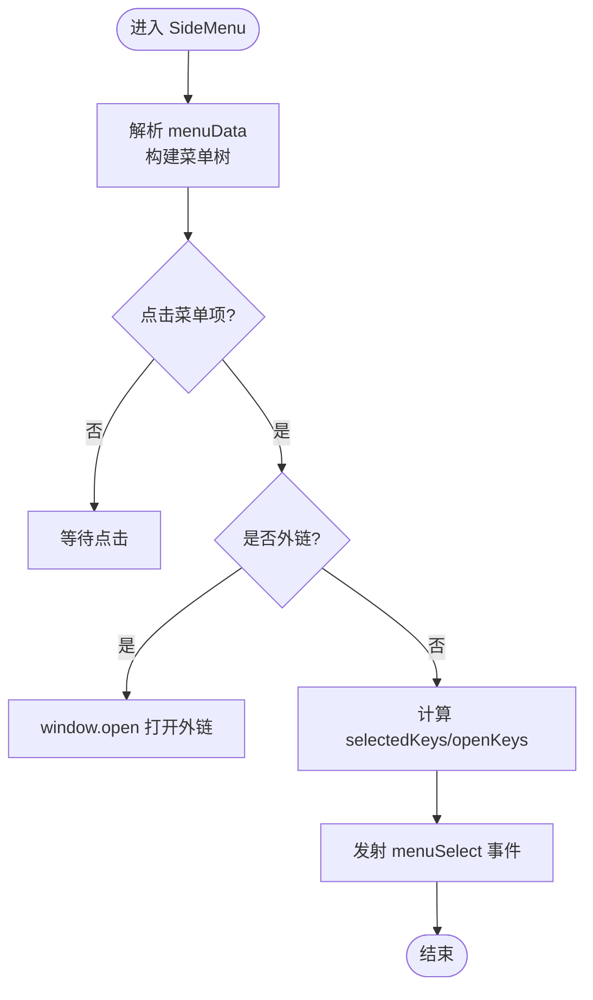
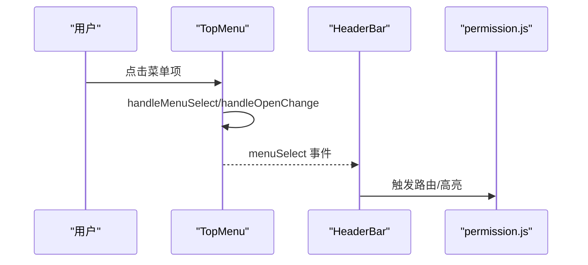
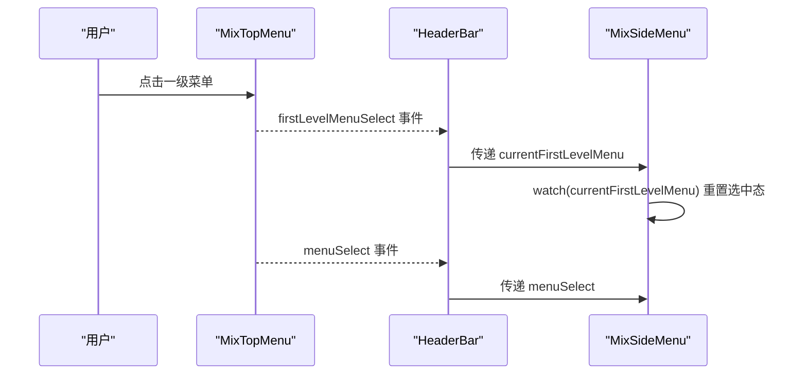
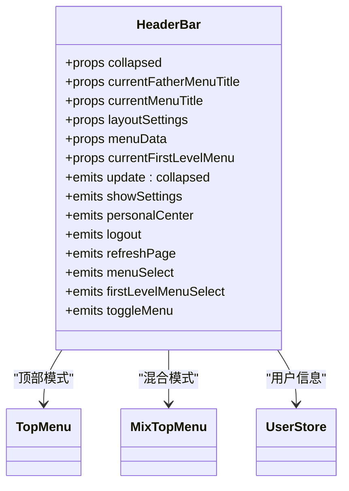
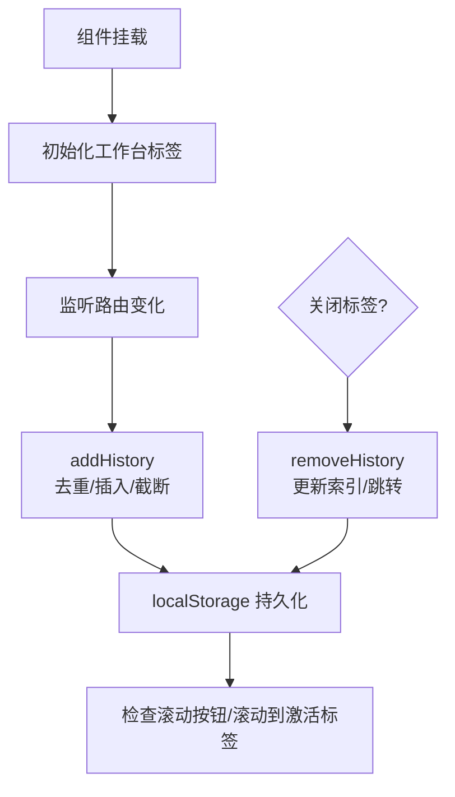
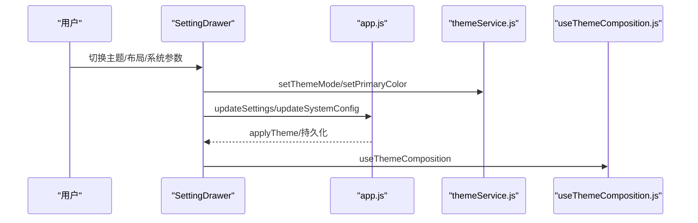
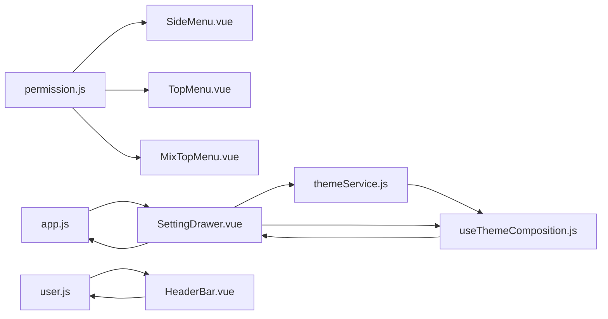

# 布局组件

<cite>
**本文引用的文件**
- [SideMenu.vue](file://bear-jia-vue3/src/components/layout/SideMenu.vue)
- [TopMenu.vue](file://bear-jia-vue3/src/components/layout/TopMenu.vue)
- [MixSideMenu.vue](file://bear-jia-vue3/src/components/layout/MixSideMenu.vue)
- [MixTopMenu.vue](file://bear-jia-vue3/src/components/layout/MixTopMenu.vue)
- [HeaderBar.vue](file://bear-jia-vue3/src/components/layout/HeaderBar.vue)
- [HistoryNav.vue](file://bear-jia-vue3/src/components/layout/HistoryNav.vue)
- [SettingDrawer.vue](file://bear-jia-vue3/src/components/layout/SettingDrawer.vue)
- [app.js](file://bear-jia-vue3/src/stores/app.js)
- [permission.js](file://bear-jia-vue3/src/stores/permission.js)
- [user.js](file://bear-jia-vue3/src/stores/user.js)
- [tableConfig.js](file://bear-jia-vue3/src/stores/tableConfig.js)
- [useThemeComposition.js](file://bear-jia-vue3/src/utils/theme/composables/useThemeComposition.js)
- [themeService.js](file://bear-jia-vue3/src/utils/theme/themeService.js)
- [bearjia.js](file://bear-jia-vue3/src/utils/bearjia.js)
</cite>

## 目录
1. [简介](#简介)
2. [项目结构](#项目结构)
3. [核心组件](#核心组件)
4. [架构总览](#架构总览)
5. [详细组件分析](#详细组件分析)
6. [依赖关系分析](#依赖关系分析)
7. [性能与优化建议](#性能与优化建议)
8. [故障排查指南](#故障排查指南)
9. [结论](#结论)
10. [附录](#附录)

## 简介
本文件系统化梳理了前端布局组件体系，重点覆盖：
- SideMenu 侧边栏菜单的路由解析、菜单折叠、权限过滤实现逻辑
- TopMenu 顶部菜单的水平布局、多级菜单展示与响应式适配
- MixSideMenu 与 MixTopMenu 混合布局模式的切换机制，支持侧边+顶部、纯顶部等多种组合
- HeaderBar 头部组件的用户信息展示、消息中心集成与全屏切换
- HistoryNav 历史导航的标签页管理、缓存策略与关闭行为
- SettingDrawer 设置抽屉的主题切换、布局配置与系统参数持久化
- 布局组件间的通信机制与状态同步方案

## 项目结构
布局组件位于 src/components/layout 目录，配合 Pinia Store 与主题服务实现状态持久化与主题切换；路由与菜单数据通过 permission store 生成并注入到各菜单组件。

图表来源
- [SideMenu.vue](file://bear-jia-vue3/src/components/layout/SideMenu.vue#L1-L120)
- [TopMenu.vue](file://bear-jia-vue3/src/components/layout/TopMenu.vue#L1-L120)
- [MixSideMenu.vue](file://bear-jia-vue3/src/components/layout/MixSideMenu.vue#L1-L120)
- [MixTopMenu.vue](file://bear-jia-vue3/src/components/layout/MixTopMenu.vue#L1-L120)
- [HeaderBar.vue](file://bear-jia-vue3/src/components/layout/HeaderBar.vue#L1-L120)
- [HistoryNav.vue](file://bear-jia-vue3/src/components/layout/HistoryNav.vue#L1-L120)
- [SettingDrawer.vue](file://bear-jia-vue3/src/components/layout/SettingDrawer.vue#L1-L120)
- [app.js](file://bear-jia-vue3/src/stores/app.js#L1-L80)
- [permission.js](file://bear-jia-vue3/src/stores/permission.js#L200-L264)
- [useThemeComposition.js](file://bear-jia-vue3/src/utils/theme/composables/useThemeComposition.js#L1-L80)
- [themeService.js](file://bear-jia-vue3/src/utils/theme/themeService.js#L1-L120)

章节来源
- [SideMenu.vue](file://bear-jia-vue3/src/components/layout/SideMenu.vue#L1-L120)
- [TopMenu.vue](file://bear-jia-vue3/src/components/layout/TopMenu.vue#L1-L120)
- [MixSideMenu.vue](file://bear-jia-vue3/src/components/layout/MixSideMenu.vue#L1-L120)
- [MixTopMenu.vue](file://bear-jia-vue3/src/components/layout/MixTopMenu.vue#L1-L120)
- [HeaderBar.vue](file://bear-jia-vue3/src/components/layout/HeaderBar.vue#L1-L120)
- [HistoryNav.vue](file://bear-jia-vue3/src/components/layout/HistoryNav.vue#L1-L120)
- [SettingDrawer.vue](file://bear-jia-vue3/src/components/layout/SettingDrawer.vue#L1-L120)
- [app.js](file://bear-jia-vue3/src/stores/app.js#L1-L80)
- [permission.js](file://bear-jia-vue3/src/stores/permission.js#L200-L264)
- [useThemeComposition.js](file://bear-jia-vue3/src/utils/theme/composables/useThemeComposition.js#L1-L80)
- [themeService.js](file://bear-jia-vue3/src/utils/theme/themeService.js#L1-L120)

## 核心组件
- SideMenu：基于 Ant Design Menu 的内联侧边栏，支持三级菜单、外链识别、折叠与选中态同步
- TopMenu：顶部水平导航，支持二级/三级菜单、下拉展开、选中态同步
- MixSideMenu：混合模式下的侧边栏，仅展示当前一级菜单的子菜单
- MixTopMenu：混合模式顶部导航，仅展示一级菜单项，负责切换当前一级菜单
- HeaderBar：头部区域，集成 Logo、面包屑、顶部/混合菜单、用户信息、消息中心、全屏、设置等
- HistoryNav：标签页导航，支持滚动、右键菜单、关闭行为与本地缓存
- SettingDrawer：设置抽屉，主题切换、布局配置、系统参数与表格配置持久化

章节来源
- [SideMenu.vue](file://bear-jia-vue3/src/components/layout/SideMenu.vue#L1-L120)
- [TopMenu.vue](file://bear-jia-vue3/src/components/layout/TopMenu.vue#L1-L120)
- [MixSideMenu.vue](file://bear-jia-vue3/src/components/layout/MixSideMenu.vue#L1-L120)
- [MixTopMenu.vue](file://bear-jia-vue3/src/components/layout/MixTopMenu.vue#L1-L120)
- [HeaderBar.vue](file://bear-jia-vue3/src/components/layout/HeaderBar.vue#L1-L120)
- [HistoryNav.vue](file://bear-jia-vue3/src/components/layout/HistoryNav.vue#L1-L120)
- [SettingDrawer.vue](file://bear-jia-vue3/src/components/layout/SettingDrawer.vue#L1-L120)

## 架构总览
布局组件通过 Pinia Store 与主题服务协同工作，菜单数据来源于 permission store 的动态路由生成，HeaderBar 作为中枢协调菜单与抽屉交互，HistoryNav 独立维护标签页状态，SettingDrawer 负责主题与布局配置的持久化与同步。

图表来源
- [HeaderBar.vue](file://bear-jia-vue3/src/components/layout/HeaderBar.vue#L1-L120)
- [TopMenu.vue](file://bear-jia-vue3/src/components/layout/TopMenu.vue#L1-L120)
- [MixTopMenu.vue](file://bear-jia-vue3/src/components/layout/MixTopMenu.vue#L1-L120)
- [MixSideMenu.vue](file://bear-jia-vue3/src/components/layout/MixSideMenu.vue#L1-L120)
- [SideMenu.vue](file://bear-jia-vue3/src/components/layout/SideMenu.vue#L1-L120)
- [permission.js](file://bear-jia-vue3/src/stores/permission.js#L200-L264)
- [app.js](file://bear-jia-vue3/src/stores/app.js#L60-L120)
- [SettingDrawer.vue](file://bear-jia-vue3/src/components/layout/SettingDrawer.vue#L550-L720)

## 详细组件分析

### SideMenu 侧边栏菜单
- 路由解析与菜单折叠
  - 通过 props 接收 menuData，按“一级-二级-三级”层级渲染
  - openKeys 控制展开层级，handleOpenChange 限制仅保留最近一次顶层展开
  - 选中态 selectedKeys 与 openKeys 通过 setCurrentMenu 与点击事件同步
- 外链处理
  - isExternal 判断外链，点击时直接 window.open，不触发路由跳转
- 路由跳转与高亮
  - handleMenuClick/handleThreeLevelMenuClick 发射 menuSelect 事件，携带父子级元信息
  - setCurrentMenu 支持根据当前 fullPath 自动定位选中项与展开层级

图表来源
- [SideMenu.vue](file://bear-jia-vue3/src/components/layout/SideMenu.vue#L140-L214)
- [SideMenu.vue](file://bear-jia-vue3/src/components/layout/SideMenu.vue#L216-L306)
- [bearjia.js](file://bear-jia-vue3/src/utils/bearjia.js#L1-L10)

章节来源
- [SideMenu.vue](file://bear-jia-vue3/src/components/layout/SideMenu.vue#L1-L120)
- [SideMenu.vue](file://bear-jia-vue3/src/components/layout/SideMenu.vue#L140-L214)
- [SideMenu.vue](file://bear-jia-vue3/src/components/layout/SideMenu.vue#L216-L306)
- [bearjia.js](file://bear-jia-vue3/src/utils/bearjia.js#L1-L10)

### TopMenu 顶部菜单
- 水平布局与多级菜单
  - mode="horizontal"，支持二级/三级菜单，alwaysShow 控制单子菜单是否下拉
- 选中态与展开态
  - selectedKeys/openKeys 由 handleMenuSelect/handleOpenChange 管理
  - setCurrentMenu 根据 fullPath 定位选中项与展开层级
- 工作台入口
  - workbench 项独立处理，点击后发射 menuSelect

图表来源
- [TopMenu.vue](file://bear-jia-vue3/src/components/layout/TopMenu.vue#L1-L120)
- [TopMenu.vue](file://bear-jia-vue3/src/components/layout/TopMenu.vue#L112-L164)
- [permission.js](file://bear-jia-vue3/src/stores/permission.js#L200-L264)

章节来源
- [TopMenu.vue](file://bear-jia-vue3/src/components/layout/TopMenu.vue#L1-L120)
- [TopMenu.vue](file://bear-jia-vue3/src/components/layout/TopMenu.vue#L112-L164)

### MixSideMenu 与 MixTopMenu 混合布局
- MixTopMenu
  - 仅展示一级菜单，点击后通过 firstLevelMenuSelect 通知父组件切换当前一级菜单
  - setCurrentMenu 根据 fullPath 定位到对应一级菜单并激活
- MixSideMenu
  - 仅展示 currentFirstLevelMenu 的子菜单（二级/三级）
  - 通过 watch 监听 currentFirstLevelMenu 变化重置选中态
  - 外链处理与点击事件与 SideMenu 类似

图表来源
- [MixTopMenu.vue](file://bear-jia-vue3/src/components/layout/MixTopMenu.vue#L1-L120)
- [MixTopMenu.vue](file://bear-jia-vue3/src/components/layout/MixTopMenu.vue#L120-L182)
- [MixSideMenu.vue](file://bear-jia-vue3/src/components/layout/MixSideMenu.vue#L1-L120)
- [MixSideMenu.vue](file://bear-jia-vue3/src/components/layout/MixSideMenu.vue#L116-L165)

章节来源
- [MixTopMenu.vue](file://bear-jia-vue3/src/components/layout/MixTopMenu.vue#L1-L120)
- [MixTopMenu.vue](file://bear-jia-vue3/src/components/layout/MixTopMenu.vue#L120-L182)
- [MixSideMenu.vue](file://bear-jia-vue3/src/components/layout/MixSideMenu.vue#L1-L120)
- [MixSideMenu.vue](file://bear-jia-vue3/src/components/layout/MixSideMenu.vue#L116-L165)

### HeaderBar 头部组件
- 头像与用户信息
  - 智能头像：根据用户名哈希生成背景色与首字母，支持头像加载失败回退
  - 下拉菜单包含个人中心、布局设置、退出登录
- 功能区
  - 全局搜索、消息中心、在线聊天、全屏切换、刷新页面、布局设置
- 菜单区域
  - 顶部模式：渲染 TopMenu
  - 混合模式：渲染 MixTopMenu，并通过 firstLevelMenuSelect 与 MixSideMenu 协同
- 布局模式判定
  - 通过 layoutSettings.navMode 切换不同布局样式类

图表来源
- [HeaderBar.vue](file://bear-jia-vue3/src/components/layout/HeaderBar.vue#L1-L120)
- [HeaderBar.vue](file://bear-jia-vue3/src/components/layout/HeaderBar.vue#L165-L360)
- [user.js](file://bear-jia-vue3/src/stores/user.js#L1-L83)

章节来源
- [HeaderBar.vue](file://bear-jia-vue3/src/components/layout/HeaderBar.vue#L1-L120)
- [HeaderBar.vue](file://bear-jia-vue3/src/components/layout/HeaderBar.vue#L165-L360)
- [user.js](file://bear-jia-vue3/src/stores/user.js#L1-L83)

### HistoryNav 历史导航
- 标签页管理
  - 基于 localStorage 缓存历史列表，最多保留 20 条记录
  - 工作台始终在首位，其余页面按访问顺序插入
- 关闭行为
  - 不允许关闭工作台；删除当前页时自动跳转到相邻页
  - 支持关闭当前、关闭其他、关闭全部
- 滚动与响应式
  - 标签容器横向滚动，左右按钮根据滚动位置显示
  - 响应式样式在窄屏下缩小标签宽度与字号

图表来源
- [HistoryNav.vue](file://bear-jia-vue3/src/components/layout/HistoryNav.vue#L191-L398)
- [HistoryNav.vue](file://bear-jia-vue3/src/components/layout/HistoryNav.vue#L399-L548)

章节来源
- [HistoryNav.vue](file://bear-jia-vue3/src/components/layout/HistoryNav.vue#L191-L398)
- [HistoryNav.vue](file://bear-jia-vue3/src/components/layout/HistoryNav.vue#L399-L548)

### SettingDrawer 设置抽屉
- 主题切换
  - 使用 useThemeComposition 与 themeService 实现主题模式与主色切换
  - 支持色弱模式开关与预设颜色选择
- 布局配置
  - 导航模式（side/top/mix/column/drawer）、内容宽度、固定 Header/Sidebar、隐藏 Footer、多页签、表格样式等
- 系统参数与表格配置
  - 系统标题、版权、版本等；表格尺寸、边框、固定表头、列宽、分页等
- 持久化与导入导出
  - 通过 app.store 与 localStorage 同步；支持导出/导入配置文件

图表来源
- [SettingDrawer.vue](file://bear-jia-vue3/src/components/layout/SettingDrawer.vue#L550-L720)
- [SettingDrawer.vue](file://bear-jia-vue3/src/components/layout/SettingDrawer.vue#L720-L999)
- [app.js](file://bear-jia-vue3/src/stores/app.js#L60-L120)
- [useThemeComposition.js](file://bear-jia-vue3/src/utils/theme/composables/useThemeComposition.js#L1-L120)
- [themeService.js](file://bear-jia-vue3/src/utils/theme/themeService.js#L180-L260)

章节来源
- [SettingDrawer.vue](file://bear-jia-vue3/src/components/layout/SettingDrawer.vue#L550-L720)
- [SettingDrawer.vue](file://bear-jia-vue3/src/components/layout/SettingDrawer.vue#L720-L999)
- [app.js](file://bear-jia-vue3/src/stores/app.js#L60-L120)
- [useThemeComposition.js](file://bear-jia-vue3/src/utils/theme/composables/useThemeComposition.js#L1-L120)
- [themeService.js](file://bear-jia-vue3/src/utils/theme/themeService.js#L180-L260)

## 依赖关系分析
- 菜单数据来源
  - permission.store 生成 sidebarRouters/topbarRouters/defaultRoutes，SideMenu/TopMenu/Mix* 组件消费
- 主题与布局
  - app.store 维护 layoutSettings，SettingDrawer 与 useThemeComposition/ themeService 协同
- 用户信息
  - user.store 提供头像、昵称等，HeaderBar 智能头像与下拉菜单使用
- 表格配置
  - tableConfig.store 管理表格通用样式，SettingDrawer 提供编辑与持久化

图表来源
- [permission.js](file://bear-jia-vue3/src/stores/permission.js#L200-L264)
- [app.js](file://bear-jia-vue3/src/stores/app.js#L1-L80)
- [useThemeComposition.js](file://bear-jia-vue3/src/utils/theme/composables/useThemeComposition.js#L1-L80)
- [themeService.js](file://bear-jia-vue3/src/utils/theme/themeService.js#L1-L120)
- [user.js](file://bear-jia-vue3/src/stores/user.js#L1-L83)
- [HeaderBar.vue](file://bear-jia-vue3/src/components/layout/HeaderBar.vue#L165-L360)
- [SettingDrawer.vue](file://bear-jia-vue3/src/components/layout/SettingDrawer.vue#L550-L720)

章节来源
- [permission.js](file://bear-jia-vue3/src/stores/permission.js#L200-L264)
- [app.js](file://bear-jia-vue3/src/stores/app.js#L1-L80)
- [useThemeComposition.js](file://bear-jia-vue3/src/utils/theme/composables/useThemeComposition.js#L1-L80)
- [themeService.js](file://bear-jia-vue3/src/utils/theme/themeService.js#L1-L120)
- [user.js](file://bear-jia-vue3/src/stores/user.js#L1-L83)
- [HeaderBar.vue](file://bear-jia-vue3/src/components/layout/HeaderBar.vue#L165-L360)
- [SettingDrawer.vue](file://bear-jia-vue3/src/components/layout/SettingDrawer.vue#L550-L720)

## 性能与优化建议
- 菜单渲染
  - 采用 v-model:selectedKeys/v-model:openKeys 减少不必要的重渲染
  - 外链判断 isExternal 使用正则，建议缓存结果以减少重复计算
- 标签页
  - localStorage 读写建议节流，避免频繁 IO
  - 标签滚动与可视区域检测可在 resize 时批量处理
- 主题切换
  - 主题服务使用事件驱动，避免全局强制刷新
  - CSS 变量批量应用，减少多次 DOM 操作

[本节为通用建议，无需代码引用]

## 故障排查指南
- 菜单无法选中或展开异常
  - 检查 menuData 结构与路径拼接规则，确认 fullPath 与 children.path 匹配
  - 确认 handleOpenChange 中仅保留最近一次顶层 key
- 外链点击无效
  - 确认 isExternal 正确识别协议前缀
- 标签页关闭后跳转异常
  - 检查 removeHistory 的目标路径选择逻辑
- 设置抽屉主题切换失败
  - 检查 themeService.setThemeMode/setPrimaryColor 调用链与持久化键
- 头像加载失败
  - 检查 handleAvatarError 与智能头像计算逻辑

章节来源
- [SideMenu.vue](file://bear-jia-vue3/src/components/layout/SideMenu.vue#L140-L214)
- [TopMenu.vue](file://bear-jia-vue3/src/components/layout/TopMenu.vue#L112-L164)
- [MixSideMenu.vue](file://bear-jia-vue3/src/components/layout/MixSideMenu.vue#L164-L223)
- [MixTopMenu.vue](file://bear-jia-vue3/src/components/layout/MixTopMenu.vue#L120-L182)
- [HistoryNav.vue](file://bear-jia-vue3/src/components/layout/HistoryNav.vue#L285-L349)
- [SettingDrawer.vue](file://bear-jia-vue3/src/components/layout/SettingDrawer.vue#L550-L720)
- [HeaderBar.vue](file://bear-jia-vue3/src/components/layout/HeaderBar.vue#L294-L320)

## 结论
该布局组件体系通过清晰的职责划分与 Pinia 主题服务协同，实现了灵活的菜单渲染、混合布局切换、标签页管理与主题配置持久化。组件间通过事件与 store 解耦，便于扩展与维护。建议在实际项目中结合业务场景进一步优化外链识别、标签页性能与主题切换体验。

[本节为总结，无需代码引用]

## 附录
- 路由与菜单数据生成
  - permission.store 生成 sidebarRouters/topbarRouters/defaultRoutes，SideMenu/TopMenu/Mix* 组件消费
- 主题服务
  - themeService 提供主题模式、主色、色弱模式与事件订阅
- 工具方法
  - isExternal 用于外链识别

章节来源
- [permission.js](file://bear-jia-vue3/src/stores/permission.js#L200-L264)
- [themeService.js](file://bear-jia-vue3/src/utils/theme/themeService.js#L180-L260)
- [bearjia.js](file://bear-jia-vue3/src/utils/bearjia.js#L1-L10)