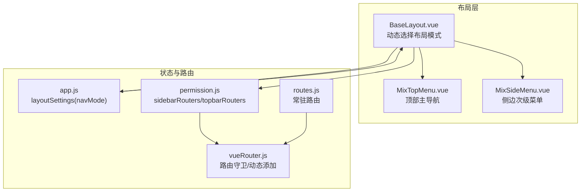
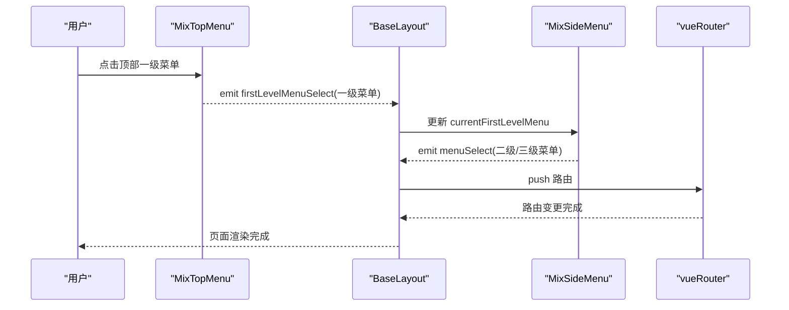
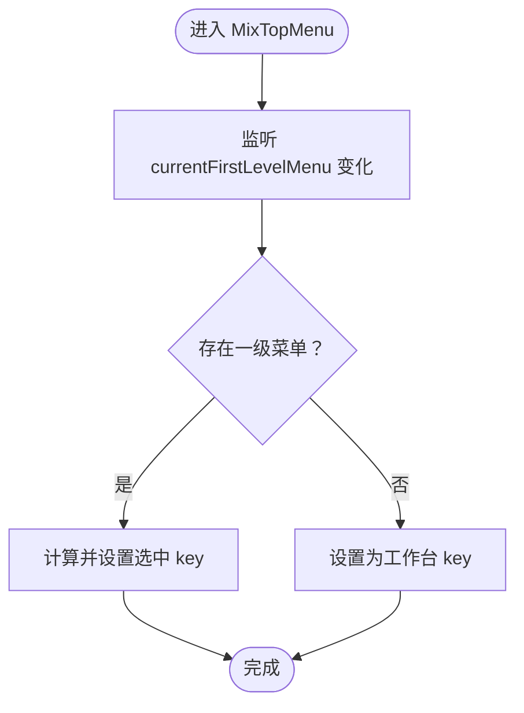
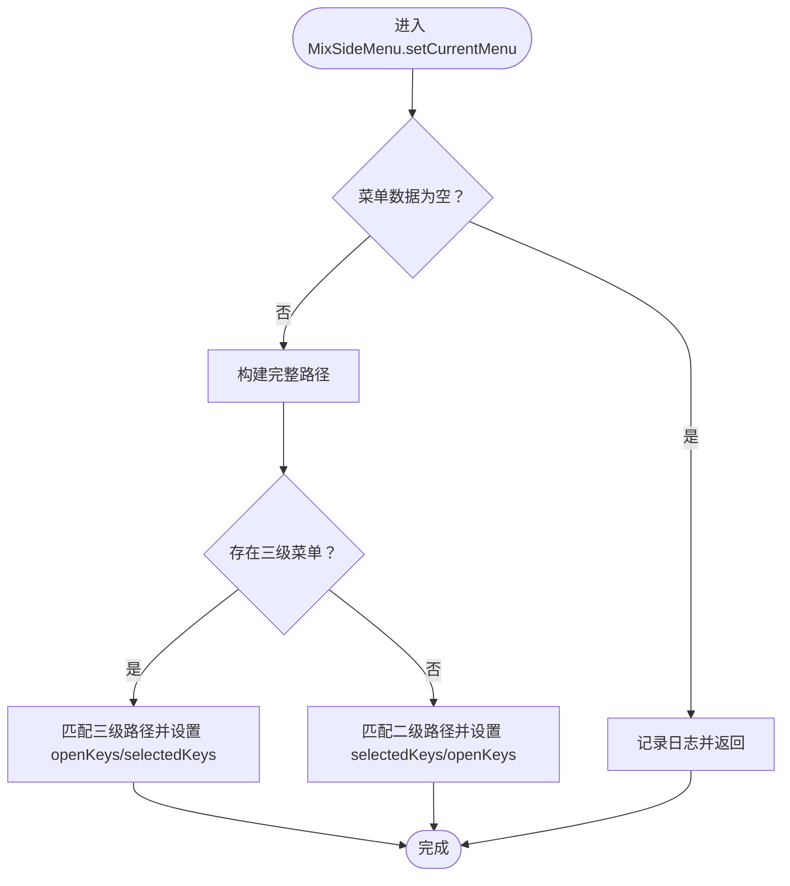
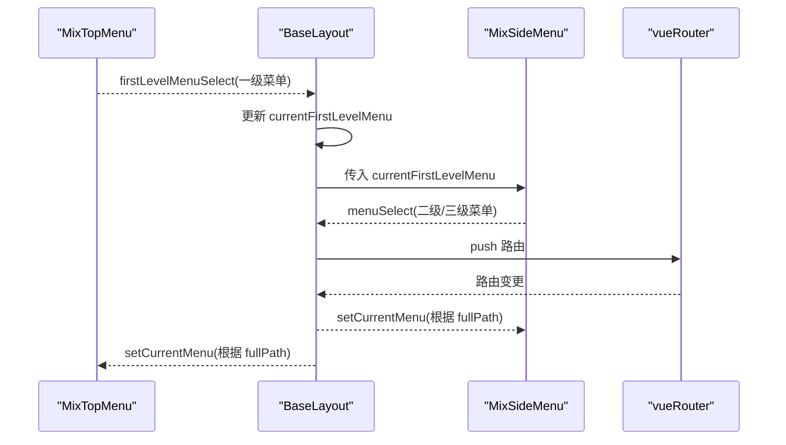
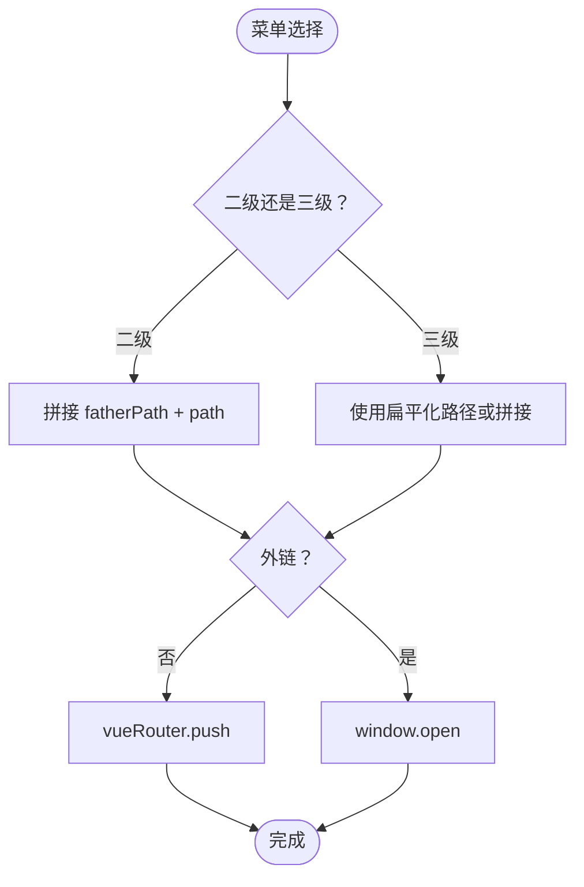
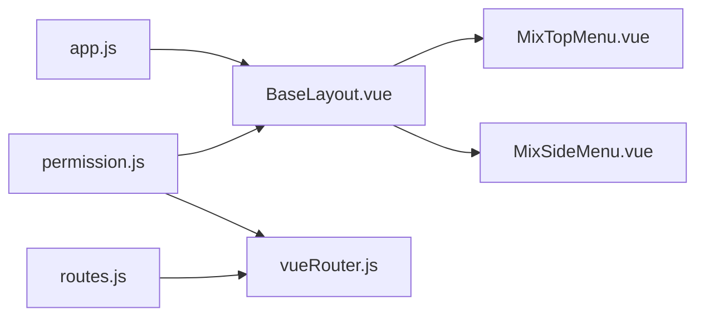

# 混合布局模式

<cite>
**本文引用的文件**
- [MixSideMenu.vue](file://bear-jia-vue3/src/components/layout/MixSideMenu.vue)
- [MixTopMenu.vue](file://bear-jia-vue3/src/components/layout/MixTopMenu.vue)
- [BaseLayout.vue](file://bear-jia-vue3/src/layout/BaseLayout.vue)
- [app.js](file://bear-jia-vue3/src/stores/app.js)
- [permission.js](file://bear-jia-vue3/src/stores/permission.js)
- [vueRouter.js](file://bear-jia-vue3/src/router/vueRouter.js)
- [routes.js](file://bear-jia-vue3/src/router/routes.js)
- [bearjia.js](file://bear-jia-vue3/src/utils/bearjia.js)
</cite>

## 目录
1. [简介](#简介)
2. [项目结构](#项目结构)
3. [核心组件](#核心组件)
4. [架构总览](#架构总览)
5. [详细组件分析](#详细组件分析)
6. [依赖关系分析](#依赖关系分析)
7. [性能考量](#性能考量)
8. [故障排查指南](#故障排查指南)
9. [结论](#结论)
10. [附录](#附录)

## 简介
本文件面向开发者，系统性解析“混合布局模式”（MixSideMenu 与 MixTopMenu）的实现与集成方式，涵盖：
- MixSideMenu 如何在侧边栏中集成顶部一级菜单的展示逻辑，包括菜单数据重组与渲染策略
- MixTopMenu 如何实现顶部主导航与侧边次级菜单的联动机制
- 布局切换器如何通过全局状态管理动态加载不同布局组件
- 混合布局下的路由导航、菜单高亮与权限控制的统一处理方案
- 性能对比分析，说明在大型菜单场景下的渲染效率差异
- 实际配置示例，帮助开发者按业务需求选择合适的混合布局方案

## 项目结构
混合布局位于基础布局组件中，通过全局布局设置决定渲染哪一种布局组合，并在混合模式下同时挂载顶部主导航与侧边次级菜单。

图表来源
- [BaseLayout.vue](file://bear-jia-vue3/src/layout/BaseLayout.vue#L55-L86)
- [MixTopMenu.vue](file://bear-jia-vue3/src/components/layout/MixTopMenu.vue#L1-L182)
- [MixSideMenu.vue](file://bear-jia-vue3/src/components/layout/MixSideMenu.vue#L1-L275)
- [app.js](file://bear-jia-vue3/src/stores/app.js#L1-L180)
- [permission.js](file://bear-jia-vue3/src/stores/permission.js#L210-L263)
- [vueRouter.js](file://bear-jia-vue3/src/router/vueRouter.js#L1-L130)
- [routes.js](file://bear-jia-vue3/src/router/routes.js#L1-L100)

章节来源
- [BaseLayout.vue](file://bear-jia-vue3/src/layout/BaseLayout.vue#L55-L86)
- [app.js](file://bear-jia-vue3/src/stores/app.js#L1-L180)

## 核心组件
- 混合顶部主导航（MixTopMenu）：仅展示一级菜单，负责将当前选中的一级菜单传递给侧边菜单，同时负责工作台与一级菜单的高亮同步。
- 混合侧边次级菜单（MixSideMenu）：接收来自顶部主导航的一级菜单，渲染其子菜单（二级/三级），并处理点击事件与外链跳转。
- 基础布局（BaseLayout）：根据全局布局设置动态渲染侧边/顶部/混合/分栏/抽屉等布局；在混合模式下同时挂载顶部主导航与侧边次级菜单，并协调菜单选择事件。
- 全局状态（Pinia）：app.js 提供 layoutSettings（含 navMode），permission.js 提供 sidebarRouters/topbarRouters，用于菜单数据与路由生成。
- 路由系统：vueRouter.js 负责路由守卫、动态添加路由与页面状态保存恢复；routes.js 定义常驻路由（如登录、工作台）。

章节来源
- [MixTopMenu.vue](file://bear-jia-vue3/src/components/layout/MixTopMenu.vue#L1-L182)
- [MixSideMenu.vue](file://bear-jia-vue3/src/components/layout/MixSideMenu.vue#L1-L275)
- [BaseLayout.vue](file://bear-jia-vue3/src/layout/BaseLayout.vue#L55-L86)
- [app.js](file://bear-jia-vue3/src/stores/app.js#L1-L180)
- [permission.js](file://bear-jia-vue3/src/stores/permission.js#L210-L263)
- [vueRouter.js](file://bear-jia-vue3/src/router/vueRouter.js#L1-L130)
- [routes.js](file://bear-jia-vue3/src/router/routes.js#L1-L100)

## 架构总览
混合布局的核心在于“顶部主导航 + 侧边次级菜单”的双向联动：顶部主导航负责一级菜单的高亮与选择，侧边次级菜单基于当前一级菜单渲染其子树并维护自身的展开/选中状态。两者通过 BaseLayout 的事件桥接与全局状态协同工作。

图表来源
- [MixTopMenu.vue](file://bear-jia-vue3/src/components/layout/MixTopMenu.vue#L137-L150)
- [BaseLayout.vue](file://bear-jia-vue3/src/layout/BaseLayout.vue#L472-L489)
- [MixSideMenu.vue](file://bear-jia-vue3/src/components/layout/MixSideMenu.vue#L176-L222)
- [vueRouter.js](file://bear-jia-vue3/src/router/vueRouter.js#L1-L130)

## 详细组件分析

### MixTopMenu 组件分析
- 职责
  - 仅展示一级菜单，不显示下拉
  - 监听 currentFirstLevelMenu 的变化，同步顶部主导航的选中状态
  - 接收顶部点击事件，向父组件发出 firstLevelMenuSelect 与 menuSelect
- 关键点
  - 选中态：通过 selectedKeys 与 key 的组合（包含 path 与索引）确保唯一性
  - 工作台：单独 key，点击后清空一级菜单选择
  - 与侧边联动：点击一级菜单时，通过 firstLevelMenuSelect 通知 BaseLayout 更新 currentFirstLevelMenu

图表来源
- [MixTopMenu.vue](file://bear-jia-vue3/src/components/layout/MixTopMenu.vue#L52-L62)

章节来源
- [MixTopMenu.vue](file://bear-jia-vue3/src/components/layout/MixTopMenu.vue#L1-L182)

### MixSideMenu 组件分析
- 职责
  - 基于 currentFirstLevelMenu 渲染其子菜单（二级/三级）
  - 维护自身 openKeys/selectedKeys，支持 inline 模式
  - 处理二级/三级菜单点击，区分外链与内部路由
- 关键点
  - 数据重组：currentMenuChildren 直接取 currentFirstLevelMenu.children
  - 渲染策略：二级菜单存在 children 时作为子菜单展示；否则作为普通菜单项；三级菜单逐项渲染
  - 高亮恢复：setCurrentMenu 根据 fullPath 匹配二级/三级路径，设置 openKeys/selectedKeys
  - 外链处理：isExternal 判断，外链直接新开窗口

图表来源
- [MixSideMenu.vue](file://bear-jia-vue3/src/components/layout/MixSideMenu.vue#L124-L161)

章节来源
- [MixSideMenu.vue](file://bear-jia-vue3/src/components/layout/MixSideMenu.vue#L1-L275)
- [bearjia.js](file://bear-jia-vue3/src/utils/bearjia.js#L6-L9)

### BaseLayout 中的混合布局联动
- 混合模式挂载
  - HeaderBar + MixTopMenu + MixSideMenu + 内容区
  - 通过 @first-level-menu-select 与 @menu-select 事件桥接
- 一级菜单选择
  - handleFirstLevelMenuSelect 更新 currentFirstLevelMenu，并同步分栏布局选中态
- 菜单选择
  - handleMenuSelect 统一分发二级/三级菜单点击，分别调用 clickMenuItem/clickThreeLevelMenuItem
  - 外链判断与跳转
  - 路由跳转与标题更新

图表来源
- [BaseLayout.vue](file://bear-jia-vue3/src/layout/BaseLayout.vue#L472-L506)
- [BaseLayout.vue](file://bear-jia-vue3/src/layout/BaseLayout.vue#L592-L730)
- [MixTopMenu.vue](file://bear-jia-vue3/src/components/layout/MixTopMenu.vue#L112-L150)
- [MixSideMenu.vue](file://bear-jia-vue3/src/components/layout/MixSideMenu.vue#L124-L161)

章节来源
- [BaseLayout.vue](file://bear-jia-vue3/src/layout/BaseLayout.vue#L55-L86)
- [BaseLayout.vue](file://bear-jia-vue3/src/layout/BaseLayout.vue#L472-L506)
- [BaseLayout.vue](file://bear-jia-vue3/src/layout/BaseLayout.vue#L592-L730)

### 路由导航、菜单高亮与权限控制
- 路由导航
  - 二级菜单：拼接 fatherPath + path 后 push
  - 三级菜单：优先使用扁平化完整路径，若传入的是相对路径则拼接
  - 外链：isExternal 判断，直接 window.open
- 菜单高亮
  - MixTopMenu：setCurrentMenu 根据 fullPath 匹配一级菜单
  - MixSideMenu：setCurrentMenu 根据 fullPath 匹配二级/三级菜单
- 权限控制
  - permission.js 生成路由时，侧边栏保留外链用于菜单显示，但不加入 Vue Router，避免路由错误
  - 动态路由过滤与懒加载，结合后端返回的权限标识进行筛选

图表来源
- [BaseLayout.vue](file://bear-jia-vue3/src/layout/BaseLayout.vue#L617-L730)
- [permission.js](file://bear-jia-vue3/src/stores/permission.js#L242-L261)
- [bearjia.js](file://bear-jia-vue3/src/utils/bearjia.js#L6-L9)

章节来源
- [BaseLayout.vue](file://bear-jia-vue3/src/layout/BaseLayout.vue#L617-L730)
- [permission.js](file://bear-jia-vue3/src/stores/permission.js#L242-L261)
- [vueRouter.js](file://bear-jia-vue3/src/router/vueRouter.js#L37-L109)
- [routes.js](file://bear-jia-vue3/src/router/routes.js#L1-L100)

## 依赖关系分析
- 组件依赖
  - MixTopMenu 依赖 BearJiaIcon 与 isExternal
  - MixSideMenu 依赖 BearJiaIcon 与 isExternal
  - BaseLayout 依赖 MixTopMenu、MixSideMenu、HeaderBar、HistoryNav、SettingDrawer
- 状态依赖
  - app.js 提供 layoutSettings（navMode），决定渲染哪种布局
  - permission.js 提供 sidebarRouters/topbarRouters，作为菜单数据源
- 路由依赖
  - vueRouter.js 负责动态添加路由与守卫
  - routes.js 定义常驻路由（登录、工作台等）

图表来源
- [app.js](file://bear-jia-vue3/src/stores/app.js#L1-L180)
- [permission.js](file://bear-jia-vue3/src/stores/permission.js#L210-L263)
- [BaseLayout.vue](file://bear-jia-vue3/src/layout/BaseLayout.vue#L55-L86)
- [vueRouter.js](file://bear-jia-vue3/src/router/vueRouter.js#L1-L130)
- [routes.js](file://bear-jia-vue3/src/router/routes.js#L1-L100)

章节来源
- [app.js](file://bear-jia-vue3/src/stores/app.js#L1-L180)
- [permission.js](file://bear-jia-vue3/src/stores/permission.js#L210-L263)
- [BaseLayout.vue](file://bear-jia-vue3/src/layout/BaseLayout.vue#L55-L86)

## 性能考量
- 渲染复杂度
  - MixTopMenu：仅渲染一级菜单，渲染节点数与一级菜单数量线性相关，适合大型菜单场景
  - MixSideMenu：渲染当前一级菜单的子树（二级/三级），在大型菜单场景下，若某一级菜单子树庞大，渲染成本会增加
- 选择策略
  - 通过 currentFirstLevelMenu 限定渲染范围，避免全量渲染
  - 采用 v-if/v-for 控制分支，减少不必要的虚拟DOM
- 外链处理
  - isExternal 判断在点击时执行，避免路由跳转带来的额外开销
- 高亮恢复
  - setCurrentMenu 通过 fullPath 匹配，避免全量遍历，提升刷新后恢复状态的效率

章节来源
- [MixTopMenu.vue](file://bear-jia-vue3/src/components/layout/MixTopMenu.vue#L1-L182)
- [MixSideMenu.vue](file://bear-jia-vue3/src/components/layout/MixSideMenu.vue#L1-L275)
- [bearjia.js](file://bear-jia-vue3/src/utils/bearjia.js#L6-L9)

## 故障排查指南
- 问题：点击菜单无响应
  - 检查是否为外链，外链不会触发路由跳转
  - 检查路由是否已动态添加，必要时触发重新生成
- 问题：菜单高亮不正确
  - MixTopMenu/MixSideMenu 的 setCurrentMenu 依赖 fullPath，确认传入路径与菜单路径一致
- 问题：三级菜单路径异常
  - BaseLayout 在处理三级菜单时优先使用扁平化路径，若传入相对路径需拼接
- 问题：刷新后菜单状态丢失
  - BaseLayout 在 mounted 时调用 updateMenuActiveState 并通过 nextTick 触发，确保 DOM 更新后再设置高亮

章节来源
- [BaseLayout.vue](file://bear-jia-vue3/src/layout/BaseLayout.vue#L757-L800)
- [BaseLayout.vue](file://bear-jia-vue3/src/layout/BaseLayout.vue#L592-L730)
- [vueRouter.js](file://bear-jia-vue3/src/router/vueRouter.js#L37-L109)

## 结论
混合布局模式通过“顶部主导航 + 侧边次级菜单”的协作，在大型菜单场景下实现了清晰的导航层级与高效的渲染策略。顶部主导航仅展示一级菜单，侧边菜单基于当前一级菜单渲染子树，配合全局状态与路由系统，形成统一的导航、高亮与权限控制闭环。开发者可根据业务复杂度与用户体验需求选择合适的布局模式，并通过全局设置灵活切换。

## 附录

### 实际配置示例（按业务需求选择）
- 选择混合布局
  - 在全局设置中将 navMode 设为 mix，即可启用混合布局
  - 示例路径：[app.js](file://bear-jia-vue3/src/stores/app.js#L1-L180)
- 一级菜单联动
  - 顶部主导航点击一级菜单后，BaseLayout 通过 firstLevelMenuSelect 事件更新 currentFirstLevelMenu
  - 示例路径：[MixTopMenu.vue](file://bear-jia-vue3/src/components/layout/MixTopMenu.vue#L137-L150)、[BaseLayout.vue](file://bear-jia-vue3/src/layout/BaseLayout.vue#L472-L489)
- 菜单高亮恢复
  - 页面刷新后，BaseLayout 调用 setCurrentMenu 恢复顶部与侧边的高亮状态
  - 示例路径：[MixTopMenu.vue](file://bear-jia-vue3/src/components/layout/MixTopMenu.vue#L65-L110)、[MixSideMenu.vue](file://bear-jia-vue3/src/components/layout/MixSideMenu.vue#L124-L161)
- 路由导航与权限
  - 二级/三级菜单点击后，BaseLayout 统一处理外链与路由跳转，并更新页面标题
  - 示例路径：[BaseLayout.vue](file://bear-jia-vue3/src/layout/BaseLayout.vue#L617-L730)、[permission.js](file://bear-jia-vue3/src/stores/permission.js#L242-L261)