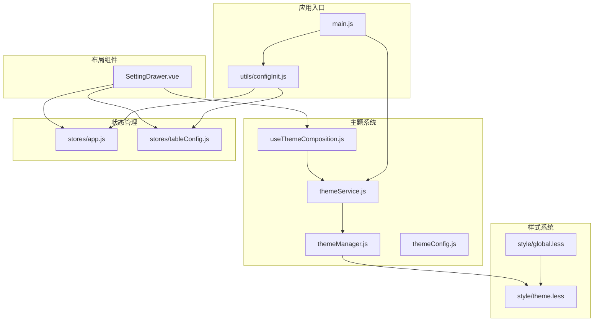
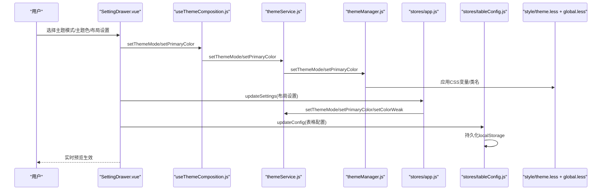
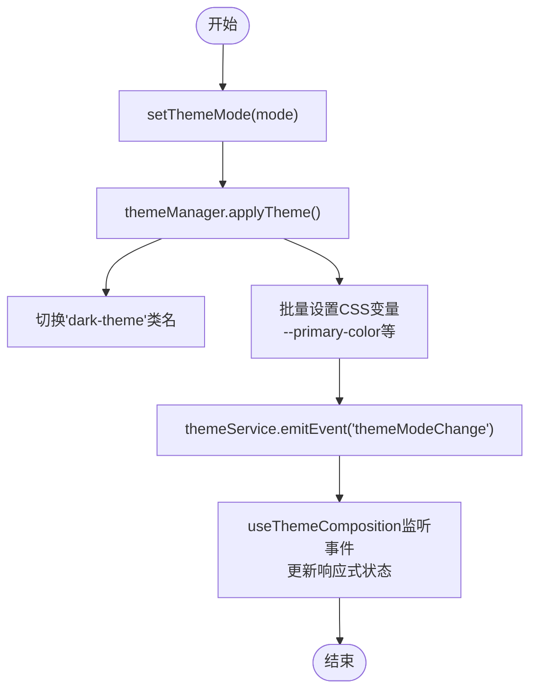
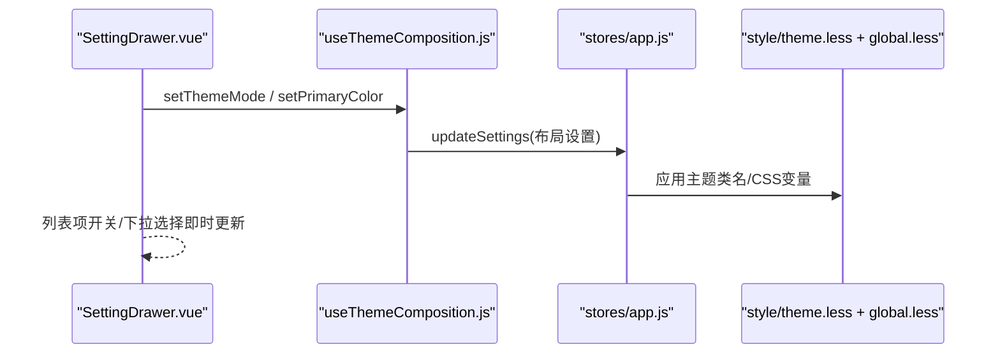
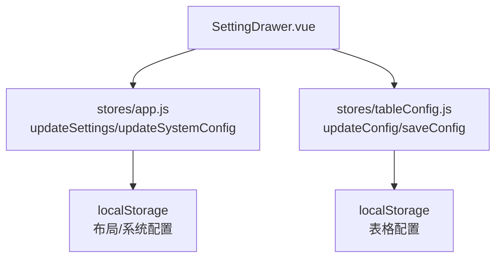
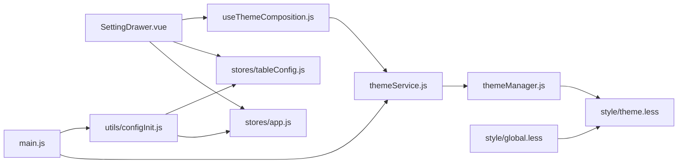

# 设置抽屉

<cite>
**本文引用的文件**
- [SettingDrawer.vue](file://bear-jia-vue3/src/components/layout/SettingDrawer.vue)
- [themeService.js](file://bear-jia-vue3/src/utils/theme/themeService.js)
- [themeManager.js](file://bear-jia-vue3/src/utils/theme/themeManager.js)
- [useThemeComposition.js](file://bear-jia-vue3/src/utils/theme/composables/useThemeComposition.js)
- [themeConfig.js](file://bear-jia-vue3/src/utils/theme/themeConfig.js)
- [app.js](file://bear-jia-vue3/src/stores/app.js)
- [tableConfig.js](file://bear-jia-vue3/src/stores/tableConfig.js)
- [global.less](file://bear-jia-vue3/src/style/global.less)
- [theme.less](file://bear-jia-vue3/src/style/theme.less)
- [configInit.js](file://bear-jia-vue3/src/utils/configInit.js)
- [main.js](file://bear-jia-vue3/src/main.js)
</cite>

## 目录
1. [简介](#简介)
2. [项目结构](#项目结构)
3. [核心组件](#核心组件)
4. [架构总览](#架构总览)
5. [详细组件分析](#详细组件分析)
6. [依赖关系分析](#依赖关系分析)
7. [性能考虑](#性能考虑)
8. [故障排查指南](#故障排查指南)
9. [结论](#结论)
10. [附录](#附录)

## 简介
本文件面向“设置抽屉（SettingDrawer）”的完整功能文档，聚焦其作为系统配置中心的实现。内容涵盖：
- 主题切换机制：暗黑/亮色模式与主题色的CSS变量动态注入
- 布局配置选项：侧边栏、顶部栏、混合布局、分栏、抽屉布局及多页签、固定Header/Sidebar等
- 系统参数持久化：localStorage与Pinia Store的协同策略
- 实时预览机制：用户调整设置时界面的即时响应
- 抽屉展开/收起动画与遮罩层交互
- 扩展接口：如何注册自定义配置项
- 与themeService.js的集成：确保主题变更的全局一致性

## 项目结构
设置抽屉位于布局组件目录，配合主题服务、Pinia Store、样式系统与全局初始化流程共同工作。

图表来源
- [SettingDrawer.vue](file://bear-jia-vue3/src/components/layout/SettingDrawer.vue#L1-L120)
- [themeService.js](file://bear-jia-vue3/src/utils/theme/themeService.js#L1-L120)
- [themeManager.js](file://bear-jia-vue3/src/utils/theme/themeManager.js#L1-L120)
- [useThemeComposition.js](file://bear-jia-vue3/src/utils/theme/composables/useThemeComposition.js#L1-L120)
- [themeConfig.js](file://bear-jia-vue3/src/utils/theme/themeConfig.js#L1-L120)
- [app.js](file://bear-jia-vue3/src/stores/app.js#L1-L120)
- [tableConfig.js](file://bear-jia-vue3/src/stores/tableConfig.js#L1-L120)
- [global.less](file://bear-jia-vue3/src/style/global.less#L1-L120)
- [theme.less](file://bear-jia-vue3/src/style/theme.less#L1-L120)
- [main.js](file://bear-jia-vue3/src/main.js#L1-L62)
- [configInit.js](file://bear-jia-vue3/src/utils/configInit.js#L1-L120)

章节来源
- [SettingDrawer.vue](file://bear-jia-vue3/src/components/layout/SettingDrawer.vue#L1-L120)
- [main.js](file://bear-jia-vue3/src/main.js#L1-L62)

## 核心组件
- SettingDrawer.vue：提供主题模式、主题色、导航模式、布局设置、系统配置、表格通用样式、配置管理等配置项的可视化编辑与持久化。
- themeService.js：主题服务的统一入口，负责主题模式、主题色、色弱模式、预设颜色、事件派发与持久化。
- themeManager.js：主题管理器，负责响应式主题状态、CSS变量应用、颜色变体生成与事件广播。
- useThemeComposition.js：Vue组合式API，封装主题服务能力，便于在组件中使用。
- app.js（Pinia）：布局设置与系统配置的持久化与应用，负责与主题服务联动。
- tableConfig.js（Pinia）：表格通用样式的持久化与同步。
- global.less、theme.less：基于CSS变量的主题样式体系，支撑暗黑/亮色模式与组件色彩。
- configInit.js：应用启动时的配置初始化与监听，保证主题与系统配置的一致性。

章节来源
- [SettingDrawer.vue](file://bear-jia-vue3/src/components/layout/SettingDrawer.vue#L1-L200)
- [themeService.js](file://bear-jia-vue3/src/utils/theme/themeService.js#L1-L200)
- [themeManager.js](file://bear-jia-vue3/src/utils/theme/themeManager.js#L1-L200)
- [useThemeComposition.js](file://bear-jia-vue3/src/utils/theme/composables/useThemeComposition.js#L1-L200)
- [app.js](file://bear-jia-vue3/src/stores/app.js#L1-L180)
- [tableConfig.js](file://bear-jia-vue3/src/stores/tableConfig.js#L1-L154)
- [global.less](file://bear-jia-vue3/src/style/global.less#L1-L260)
- [theme.less](file://bear-jia-vue3/src/style/theme.less#L1-L148)
- [configInit.js](file://bear-jia-vue3/src/utils/configInit.js#L1-L246)

## 架构总览
设置抽屉通过组合式主题API与Pinia Store协同工作，主题服务负责主题模式与颜色的全局一致性，样式系统通过CSS变量实现暗黑/亮色模式与组件色彩的动态切换。

图表来源
- [SettingDrawer.vue](file://bear-jia-vue3/src/components/layout/SettingDrawer.vue#L480-L780)
- [useThemeComposition.js](file://bear-jia-vue3/src/utils/theme/composables/useThemeComposition.js#L56-L110)
- [themeService.js](file://bear-jia-vue3/src/utils/theme/themeService.js#L188-L243)
- [themeManager.js](file://bear-jia-vue3/src/utils/theme/themeManager.js#L103-L142)
- [app.js](file://bear-jia-vue3/src/stores/app.js#L66-L118)
- [tableConfig.js](file://bear-jia-vue3/src/stores/tableConfig.js#L33-L124)
- [theme.less](file://bear-jia-vue3/src/style/theme.less#L1-L148)
- [global.less](file://bear-jia-vue3/src/style/global.less#L1-L260)

## 详细组件分析

### 主题切换与CSS变量动态注入
- 主题模式切换：通过useThemeComposition封装的setThemeMode，委托themeService.setThemeMode，最终由themeManager.applyTheme应用到DOM（添加/移除dark-theme类名），同时批量设置CSS变量。
- 主题色切换：通过setPrimaryColor，生成颜色变体（hover/active/透明度变体），并通过themeManager.applyPrimaryColor写入documentElement.style.setProperty。
- CSS变量体系：theme.less定义基础变量；global.less在暗色模式下覆盖组件背景、边框、文本颜色等，确保整体视觉一致。
- 事件与消息：themeService在主题变更时触发事件，并提供消息防抖提示；useThemeComposition监听事件以保持组件内状态同步。

图表来源
- [themeManager.js](file://bear-jia-vue3/src/utils/theme/themeManager.js#L103-L142)
- [themeService.js](file://bear-jia-vue3/src/utils/theme/themeService.js#L188-L209)
- [useThemeComposition.js](file://bear-jia-vue3/src/utils/theme/composables/useThemeComposition.js#L118-L138)
- [theme.less](file://bear-jia-vue3/src/style/theme.less#L1-L148)

章节来源
- [themeService.js](file://bear-jia-vue3/src/utils/theme/themeService.js#L188-L243)
- [themeManager.js](file://bear-jia-vue3/src/utils/theme/themeManager.js#L103-L142)
- [useThemeComposition.js](file://bear-jia-vue3/src/utils/theme/composables/useThemeComposition.js#L56-L110)
- [theme.less](file://bear-jia-vue3/src/style/theme.less#L1-L148)
- [global.less](file://bear-jia-vue3/src/style/global.less#L1-L260)

### 布局配置选项与实时预览
- 主题模式：暗黑/亮色模式切换，立即应用到根节点类名与CSS变量。
- 主题色：预设颜色列表，点击即刻应用到CSS变量，组件内即时生效。
- 导航模式：side/top/mix/column/drawer五种模式，切换时自动处理固定侧边栏等联动。
- 布局设置：内容宽度、固定Header、固定Sidebar、隐藏Footer、多页签模式、表格条纹与表头显示等。
- 实时预览：通过Pinia Store与useThemeComposition的双向绑定，设置变更后立即触发主题应用与样式更新。

图表来源
- [SettingDrawer.vue](file://bear-jia-vue3/src/components/layout/SettingDrawer.vue#L520-L780)
- [app.js](file://bear-jia-vue3/src/stores/app.js#L66-L118)
- [useThemeComposition.js](file://bear-jia-vue3/src/utils/theme/composables/useThemeComposition.js#L56-L110)
- [theme.less](file://bear-jia-vue3/src/style/theme.less#L1-L148)
- [global.less](file://bear-jia-vue3/src/style/global.less#L1-L260)

章节来源
- [SettingDrawer.vue](file://bear-jia-vue3/src/components/layout/SettingDrawer.vue#L480-L780)
- [app.js](file://bear-jia-vue3/src/stores/app.js#L66-L118)

### 系统参数与表格配置的持久化
- 布局设置持久化：SettingDrawer.vue在用户操作时通过Pinia Store的updateSettings进行持久化；app.js对主题相关字段采用themeService进行统一设置，其余字段写入localStorage。
- 系统配置持久化：app.js的updateSystemConfig将系统标题、版权、版本等写入localStorage，并同步更新document.title与meta信息。
- 表格配置持久化：SettingDrawer.vue与tableConfig.js共同维护，localStorage保存表格通用样式，Pinia Store提供默认值与重置逻辑。

图表来源
- [SettingDrawer.vue](file://bear-jia-vue3/src/components/layout/SettingDrawer.vue#L674-L780)
- [app.js](file://bear-jia-vue3/src/stores/app.js#L66-L118)
- [tableConfig.js](file://bear-jia-vue3/src/stores/tableConfig.js#L33-L124)

章节来源
- [SettingDrawer.vue](file://bear-jia-vue3/src/components/layout/SettingDrawer.vue#L392-L473)
- [app.js](file://bear-jia-vue3/src/stores/app.js#L66-L118)
- [tableConfig.js](file://bear-jia-vue3/src/stores/tableConfig.js#L33-L124)

### 实时预览与交互反馈
- 实时预览：useThemeComposition监听themeService事件，更新响应式状态；SettingDrawer.vue通过watch与emit将设置变更回传给父组件，父组件可据此更新路由/布局。
- 交互反馈：themeService提供消息防抖提示；SettingDrawer.vue在关键操作（如保存、导入、重置）后给出消息反馈。

章节来源
- [useThemeComposition.js](file://bear-jia-vue3/src/utils/theme/composables/useThemeComposition.js#L118-L138)
- [themeService.js](file://bear-jia-vue3/src/utils/theme/themeService.js#L160-L185)
- [SettingDrawer.vue](file://bear-jia-vue3/src/components/layout/SettingDrawer.vue#L588-L780)

### 抽屉展开/收起动画与遮罩层交互
- 抽屉组件：SettingDrawer.vue使用Ant Design Vue的Drawer组件，placement为右侧，宽度300，支持可选的遮罩层与关闭事件。
- 动画与过渡：theme.less定义了主题切换过渡类theme-transition，global.less定义了组件级过渡，抽屉本身由Antd Drawer提供动画效果。
- 交互逻辑：关闭事件通过@update:visible同步到父组件，父组件控制visible状态；抽屉内容区使用CSS变量实现暗色模式下的统一视觉。

章节来源
- [SettingDrawer.vue](file://bear-jia-vue3/src/components/layout/SettingDrawer.vue#L1-L40)
- [theme.less](file://bear-jia-vue3/src/style/theme.less#L127-L131)
- [global.less](file://bear-jia-vue3/src/style/global.less#L568-L580)

### 扩展接口与自定义配置项
- 注册自定义配置项：在SettingDrawer.vue中新增配置项（如开关、下拉、输入框），通过v-model绑定到localSettings或独立ref，然后在handleSettingChange中统一emit更新。
- 与Pinia Store集成：对于需要持久化的配置，优先写入app.js的updateSettings或tableConfig.js的updateConfig；对于仅内存使用的配置，直接在组件内维护。
- 与主题服务集成：若涉及主题色或模式，务必通过useThemeComposition或themeService进行设置，确保全局一致性。

章节来源
- [SettingDrawer.vue](file://bear-jia-vue3/src/components/layout/SettingDrawer.vue#L588-L780)
- [app.js](file://bear-jia-vue3/src/stores/app.js#L66-L118)
- [tableConfig.js](file://bear-jia-vue3/src/stores/tableConfig.js#L33-L124)

### 与themeService.js的集成细节
- 初始化：main.js在应用挂载后异步初始化themeService，并开启followSystem以跟随系统主题。
- 应用主题：configInit.js与app.js在启动时调用applyTheme，通过themeService.setPrimaryColor、setThemeMode、setColorWeak静默应用主题，避免初始化时的消息提示。
- 事件监听：useThemeComposition在组件挂载时订阅themeService事件，确保组件内主题状态与全局一致。

章节来源
- [main.js](file://bear-jia-vue3/src/main.js#L45-L56)
- [configInit.js](file://bear-jia-vue3/src/utils/configInit.js#L192-L236)
- [app.js](file://bear-jia-vue3/src/stores/app.js#L105-L118)
- [useThemeComposition.js](file://bear-jia-vue3/src/utils/theme/composables/useThemeComposition.js#L118-L138)

## 依赖关系分析
- SettingDrawer.vue依赖：
  - Pinia Store：app.js（布局/系统配置）、tableConfig.js（表格配置）
  - 主题组合式API：useThemeComposition.js
  - 主题服务：themeService.js
- 主题服务依赖：
  - 主题管理器：themeManager.js
  - 主题配置：themeConfig.js
- 样式系统：
  - theme.less定义CSS变量与暗色模式变量
  - global.less在暗色模式下覆盖组件背景、边框、文本颜色等
- 应用初始化：
  - main.js初始化themeService与configInit
  - configInit.js负责从localStorage加载配置并应用

图表来源
- [SettingDrawer.vue](file://bear-jia-vue3/src/components/layout/SettingDrawer.vue#L1-L120)
- [app.js](file://bear-jia-vue3/src/stores/app.js#L1-L120)
- [tableConfig.js](file://bear-jia-vue3/src/stores/tableConfig.js#L1-L120)
- [useThemeComposition.js](file://bear-jia-vue3/src/utils/theme/composables/useThemeComposition.js#L1-L120)
- [themeService.js](file://bear-jia-vue3/src/utils/theme/themeService.js#L1-L120)
- [themeManager.js](file://bear-jia-vue3/src/utils/theme/themeManager.js#L1-L120)
- [theme.less](file://bear-jia-vue3/src/style/theme.less#L1-L120)
- [global.less](file://bear-jia-vue3/src/style/global.less#L1-L120)
- [main.js](file://bear-jia-vue3/src/main.js#L1-L62)
- [configInit.js](file://bear-jia-vue3/src/utils/configInit.js#L1-L120)

章节来源
- [SettingDrawer.vue](file://bear-jia-vue3/src/components/layout/SettingDrawer.vue#L1-L120)
- [app.js](file://bear-jia-vue3/src/stores/app.js#L1-L120)
- [tableConfig.js](file://bear-jia-vue3/src/stores/tableConfig.js#L1-L120)
- [useThemeComposition.js](file://bear-jia-vue3/src/utils/theme/composables/useThemeComposition.js#L1-L120)
- [themeService.js](file://bear-jia-vue3/src/utils/theme/themeService.js#L1-L120)
- [themeManager.js](file://bear-jia-vue3/src/utils/theme/themeManager.js#L1-L120)
- [theme.less](file://bear-jia-vue3/src/style/theme.less#L1-L120)
- [global.less](file://bear-jia-vue3/src/style/global.less#L1-L120)
- [main.js](file://bear-jia-vue3/src/main.js#L1-L62)
- [configInit.js](file://bear-jia-vue3/src/utils/configInit.js#L1-L120)

## 性能考虑
- 主题切换：通过CSS变量与类名切换实现，避免频繁重排重绘；建议减少不必要的主题变更频率，合并多次变更。
- 存储策略：localStorage写入集中在关键操作（保存、导入、重置），避免高频写入导致阻塞。
- 组件渲染：SettingDrawer.vue使用watch监听设置变化，建议在批量更新时使用一次性赋值，减少重复渲染。
- 样式覆盖：global.less对大量组件进行覆盖，建议在主题切换时集中应用，避免逐个组件修改。

## 故障排查指南
- 主题切换无效：
  - 检查themeService是否初始化成功（main.js）。
  - 确认useThemeComposition是否正确监听事件（useThemeComposition.js）。
  - 查看themeManager.applyTheme是否执行（themeManager.js）。
- 样式未生效：
  - 检查theme.less与global.less是否正确引入（main.js与global.less）。
  - 确认documentElement上是否存在dark-theme类名。
- 配置未持久化：
  - SettingDrawer.vue中检查handleSettingChange与emit路径。
  - app.js中检查updateSettings与localStorage写入逻辑。
- 表格配置异常：
  - 确认tableConfig.js的updateConfig与loadConfig逻辑。
  - 检查SettingDrawer.vue中tableConfig的watch与localStorage写入。

章节来源
- [main.js](file://bear-jia-vue3/src/main.js#L45-L56)
- [useThemeComposition.js](file://bear-jia-vue3/src/utils/theme/composables/useThemeComposition.js#L118-L138)
- [themeManager.js](file://bear-jia-vue3/src/utils/theme/themeManager.js#L103-L142)
- [global.less](file://bear-jia-vue3/src/style/global.less#L1-L260)
- [SettingDrawer.vue](file://bear-jia-vue3/src/components/layout/SettingDrawer.vue#L588-L780)
- [app.js](file://bear-jia-vue3/src/stores/app.js#L66-L118)
- [tableConfig.js](file://bear-jia-vue3/src/stores/tableConfig.js#L33-L124)

## 结论
设置抽屉通过主题服务与Pinia Store实现了主题切换、布局配置与系统参数的统一管理与持久化，结合CSS变量与暗黑模式样式体系，提供了良好的实时预览体验。开发者可通过扩展配置项与事件监听机制，灵活地注册自定义配置，确保主题变更的全局一致性。

## 附录
- 关键实现路径参考：
  - 主题切换与CSS变量：[themeManager.js](file://bear-jia-vue3/src/utils/theme/themeManager.js#L103-L142)、[theme.less](file://bear-jia-vue3/src/style/theme.less#L1-L148)
  - 主题服务与事件：[themeService.js](file://bear-jia-vue3/src/utils/theme/themeService.js#L188-L243)、[useThemeComposition.js](file://bear-jia-vue3/src/utils/theme/composables/useThemeComposition.js#L118-L138)
  - 布局与系统配置持久化：[SettingDrawer.vue](file://bear-jia-vue3/src/components/layout/SettingDrawer.vue#L588-L780)、[app.js](file://bear-jia-vue3/src/stores/app.js#L66-L118)
  - 表格配置持久化：[tableConfig.js](file://bear-jia-vue3/src/stores/tableConfig.js#L33-L124)
  - 样式体系：[global.less](file://bear-jia-vue3/src/style/global.less#L1-L260)、[theme.less](file://bear-jia-vue3/src/style/theme.less#L1-L148)
  - 应用初始化：[main.js](file://bear-jia-vue3/src/main.js#L45-L56)、[configInit.js](file://bear-jia-vue3/src/utils/configInit.js#L192-L236)