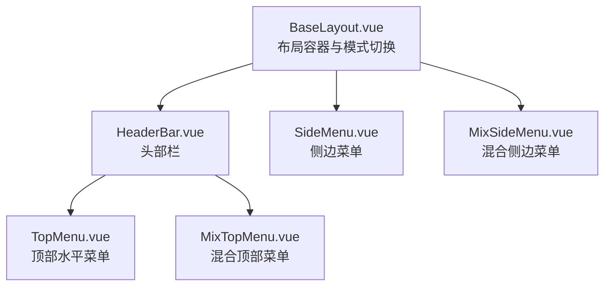
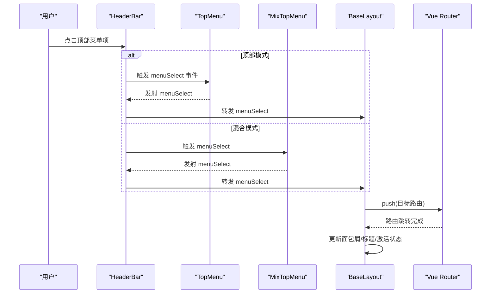
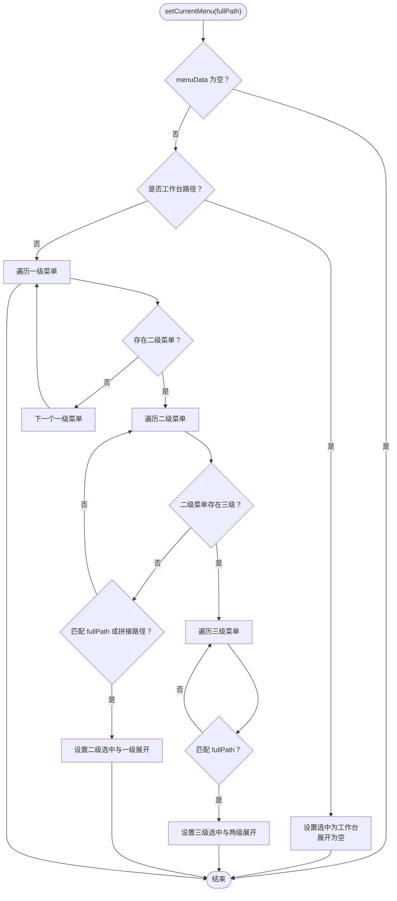
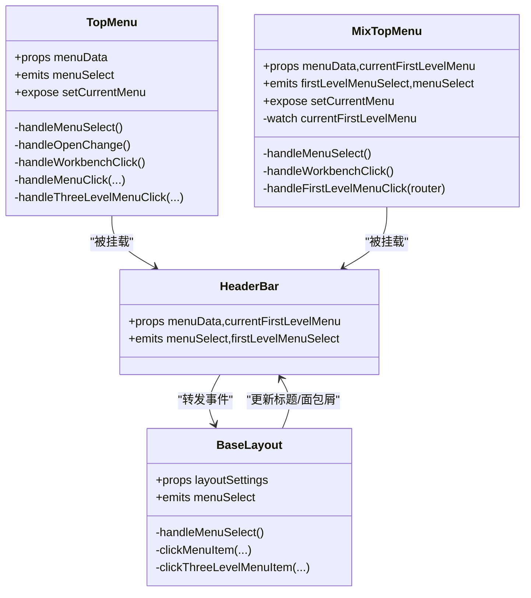

# 顶部菜单

<cite>
**本文引用的文件**
- [TopMenu.vue](file://bear-jia-vue3/src/components/layout/TopMenu.vue)
- [MixTopMenu.vue](file://bear-jia-vue3/src/components/layout/MixTopMenu.vue)
- [SideMenu.vue](file://bear-jia-vue3/src/components/layout/SideMenu.vue)
- [MixSideMenu.vue](file://bear-jia-vue3/src/components/layout/MixSideMenu.vue)
- [BaseLayout.vue](file://bear-jia-vue3/src/layout/BaseLayout.vue)
- [HeaderBar.vue](file://bear-jia-vue3/src/components/layout/HeaderBar.vue)
- [BearJiaIcon.js](file://bear-jia-vue3/src/utils/BearJiaIcon.js)
- [system.config.js](file://bear-jia-vue3/src/config/system.config.js)
- [menu.less](file://bear-jia-vue3/src/style/components/menu.less)
- [theme.less](file://bear-jia-vue3/src/style/theme.less)
- [mixins.less](file://bear-jia-vue3/src/style/mixins.less)
</cite>

## 目录
1. [简介](#简介)
2. [项目结构](#项目结构)
3. [核心组件](#核心组件)
4. [架构总览](#架构总览)
5. [详细组件分析](#详细组件分析)
6. [依赖关系分析](#依赖关系分析)
7. [性能考量](#性能考量)
8. [故障排查指南](#故障排查指南)
9. [结论](#结论)
10. [附录](#附录)

## 简介
本文件面向“顶部菜单（TopMenu）”的完整技术文档，围绕水平布局的CSS实现、Flexbox与响应式断点、多级下拉菜单的展示逻辑与层级管理、路由绑定与激活状态判断、国际化支持、高分辨率下的自动换行与滚动导航、与侧边菜单（SideMenu）的互斥显示逻辑以及不同布局模式的适配策略进行系统化阐述，并提供可操作的使用示例与最佳实践。

## 项目结构
顶部菜单位于布局组件体系中，作为头部栏的一部分，在不同布局模式下呈现：
- 顶部模式：HeaderBar 直接挂载 TopMenu
- 混合模式：HeaderBar 挂载 MixTopMenu，同时右侧为 MixSideMenu
- 侧边模式：顶部菜单由 SideMenu 提供，TopMenu 不参与

图表来源
- [BaseLayout.vue](file://bear-jia-vue3/src/layout/BaseLayout.vue#L1-L120)
- [HeaderBar.vue](file://bear-jia-vue3/src/components/layout/HeaderBar.vue#L1-L120)
- [TopMenu.vue](file://bear-jia-vue3/src/components/layout/TopMenu.vue#L1-L80)
- [MixTopMenu.vue](file://bear-jia-vue3/src/components/layout/MixTopMenu.vue#L1-L60)
- [SideMenu.vue](file://bear-jia-vue3/src/components/layout/SideMenu.vue#L1-L60)
- [MixSideMenu.vue](file://bear-jia-vue3/src/components/layout/MixSideMenu.vue#L1-L60)

章节来源
- [BaseLayout.vue](file://bear-jia-vue3/src/layout/BaseLayout.vue#L1-L120)
- [HeaderBar.vue](file://bear-jia-vue3/src/components/layout/HeaderBar.vue#L1-L120)

## 核心组件
- TopMenu：水平顶部菜单，支持工作台入口、多级下拉、图标与标题、选中与展开状态管理、事件透传。
- MixTopMenu：混合模式顶部菜单，仅显示一级菜单，配合 MixSideMenu 展示二级/三级菜单。
- SideMenu：侧边菜单，提供完整的父子/三级菜单渲染与外链处理。
- MixSideMenu：混合模式侧边菜单，基于当前选中一级菜单渲染其子菜单。
- HeaderBar：头部栏容器，按布局模式挂载 TopMenu 或 MixTopMenu，并转发菜单选择事件。
- BaseLayout：布局容器，根据 layoutSettings.navMode 控制渲染模式。

章节来源
- [TopMenu.vue](file://bear-jia-vue3/src/components/layout/TopMenu.vue#L1-L80)
- [MixTopMenu.vue](file://bear-jia-vue3/src/components/layout/MixTopMenu.vue#L1-L60)
- [SideMenu.vue](file://bear-jia-vue3/src/components/layout/SideMenu.vue#L1-L60)
- [MixSideMenu.vue](file://bear-jia-vue3/src/components/layout/MixSideMenu.vue#L1-L60)
- [HeaderBar.vue](file://bear-jia-vue3/src/components/layout/HeaderBar.vue#L1-L120)
- [BaseLayout.vue](file://bear-jia-vue3/src/layout/BaseLayout.vue#L1-L120)

## 架构总览
顶部菜单在不同布局模式下的交互流程如下：

图表来源
- [HeaderBar.vue](file://bear-jia-vue3/src/components/layout/HeaderBar.vue#L1-L120)
- [TopMenu.vue](file://bear-jia-vue3/src/components/layout/TopMenu.vue#L1-L120)
- [MixTopMenu.vue](file://bear-jia-vue3/src/components/layout/MixTopMenu.vue#L1-L120)
- [BaseLayout.vue](file://bear-jia-vue3/src/layout/BaseLayout.vue#L590-L760)

## 详细组件分析

### TopMenu 组件
- 水平布局与 Flexbox
  - 外层容器采用 Flex 布局，水平居中，菜单容器高度与行高固定，保证水平对齐与视觉一致性。
  - 菜单项与子菜单项均设置固定高度与行高，确保在不同分辨率下保持一致的视觉高度。
- 多级下拉与层级管理
  - 通过条件渲染生成二级/三级菜单；当二级菜单存在子项或满足“alwaysShow”时，渲染为 SubMenu；否则直接渲染为 MenuItem。
  - 三级菜单在二级 SubMenu 内部逐项渲染，形成清晰的层级关系。
- 悬停与选中状态
  - 通过 Ant Design 菜单组件的 selectedKeys/openKeys 管理选中与展开状态；Hover 时使用 CSS 变量切换主色。
- 路由绑定与激活状态
  - 通过 handleMenuSelect 与 handleOpenChange 维护选中与展开；setCurrentMenu 根据 fullPath 匹配路由，设置 selectedKeys 与 openKeys。
  - 对工作台路径进行特殊处理，确保工作台激活时清空展开状态。
- 事件与对外暴露
  - 暴露 setCurrentMenu 供外部刷新后恢复激活状态；发出 menuSelect 事件，携带父子菜单信息。
- 国际化支持
  - 菜单标题来源于 router.meta.title，国际化能力取决于上游路由元信息与 i18n 配置；当前仓库未发现前端 i18n 字段映射，建议在路由 meta 中维护多语言字段并在渲染处使用相应语言值。
- 响应式与高分辨率
  - 顶部菜单容器未内置响应式断点；建议在业务侧通过容器宽度与 CSS Grid/Flex 布局实现自动换行与滚动导航。

图表来源
- [TopMenu.vue](file://bear-jia-vue3/src/components/layout/TopMenu.vue#L112-L161)

章节来源
- [TopMenu.vue](file://bear-jia-vue3/src/components/layout/TopMenu.vue#L1-L250)

### MixTopMenu 组件
- 仅显示一级菜单，不展开下拉；点击一级菜单时，通过 firstLevelMenuSelect 事件通知父组件，以便右侧 MixSideMenu 渲染其子菜单。
- 选中状态通过 watch 监听 currentFirstLevelMenu，动态设置 selectedKeys。
- setCurrentMenu 逻辑与 TopMenu 类似，但仅匹配到一级菜单即视为激活。

章节来源
- [MixTopMenu.vue](file://bear-jia-vue3/src/components/layout/MixTopMenu.vue#L1-L182)

### SideMenu 与 MixSideMenu 组件
- SideMenu：完整渲染父子/三级菜单，支持外链检测与新窗口打开；展开层级控制确保只保留最近一层展开。
- MixSideMenu：基于当前一级菜单 children 渲染二级/三级菜单，未选中一级菜单时显示提示。

章节来源
- [SideMenu.vue](file://bear-jia-vue3/src/components/layout/SideMenu.vue#L1-L386)
- [MixSideMenu.vue](file://bear-jia-vue3/src/components/layout/MixSideMenu.vue#L1-L275)

### HeaderBar 与 BaseLayout 的互斥与适配
- HeaderBar 在不同模式下挂载 TopMenu 或 MixTopMenu，并将菜单选择事件透传至 BaseLayout。
- BaseLayout 根据 layoutSettings.navMode 切换布局，分别渲染侧边模式、顶部模式、混合模式与分栏/抽屉等布局。

章节来源
- [HeaderBar.vue](file://bear-jia-vue3/src/components/layout/HeaderBar.vue#L1-L120)
- [BaseLayout.vue](file://bear-jia-vue3/src/layout/BaseLayout.vue#L1-L120)

## 依赖关系分析

图表来源
- [TopMenu.vue](file://bear-jia-vue3/src/components/layout/TopMenu.vue#L1-L213)
- [MixTopMenu.vue](file://bear-jia-vue3/src/components/layout/MixTopMenu.vue#L1-L151)
- [HeaderBar.vue](file://bear-jia-vue3/src/components/layout/HeaderBar.vue#L1-L120)
- [BaseLayout.vue](file://bear-jia-vue3/src/layout/BaseLayout.vue#L590-L760)

## 性能考量
- 渲染复杂度
  - TopMenu 与 MixTopMenu 均使用 v-for 渲染多级菜单，建议在 menuData 数据量较大时，采用虚拟滚动或懒加载策略（如按需渲染可见区域）。
- 事件与状态
  - 通过 selectedKeys/openKeys 管理状态，避免不必要的重渲染；在 setCurrentMenu 中尽量一次性计算并赋值，减少多次变更。
- 图标与主题
  - BearJiaIcon 统一图标加载，减少运行时开销；主题变量集中于 CSS 变量，切换主题时避免全量重绘。

[本节为通用指导，无需列出具体文件来源]

## 故障排查指南
- 菜单未激活
  - 检查 setCurrentMenu 的 fullPath 是否与路由路径一致；确认路由 meta.title 是否正确；在侧边模式下，TopMenu 不参与激活状态管理。
- 外链无法跳转
  - 检查 isExternal 判定逻辑；在 SideMenu/MixSideMenu 中外链会直接新开窗口，TopMenu/MixTopMenu 不具备该能力。
- 混合模式二级菜单不显示
  - 确认 HeaderBar 已将 firstLevelMenuSelect 事件转发至 BaseLayout，并设置 currentFirstLevelMenu；MixSideMenu 仅在存在 children 时渲染。
- 国际化标题不生效
  - 确认路由 meta.title 为当前语言的值；若需要多语言字段，建议在渲染处读取对应语言字段。

章节来源
- [SideMenu.vue](file://bear-jia-vue3/src/components/layout/SideMenu.vue#L160-L214)
- [MixSideMenu.vue](file://bear-jia-vue3/src/components/layout/MixSideMenu.vue#L124-L161)
- [HeaderBar.vue](file://bear-jia-vue3/src/components/layout/HeaderBar.vue#L1-L120)
- [BaseLayout.vue](file://bear-jia-vue3/src/layout/BaseLayout.vue#L472-L590)

## 结论
TopMenu 与 MixTopMenu 在当前实现中提供了清晰的水平菜单与混合模式支持，结合 HeaderBar 与 BaseLayout 实现了跨布局模式的统一交互。对于响应式与国际化，建议在业务侧补充容器宽度监听与路由 meta 的多语言字段映射；对于高分辨率下的自动换行与滚动导航，可在容器层引入 CSS Grid/Flex 布局与滚动容器实现。

[本节为总结性内容，无需列出具体文件来源]

## 附录

### CSS 实现要点与建议
- Flexbox 与水平布局
  - 外层容器使用 Flex 居中，菜单容器固定高度与行高，确保视觉一致性。
- 响应式断点
  - 当前组件未内置断点；建议在业务容器上使用 CSS Grid/Flex 布局，结合媒体查询实现自动换行与滚动导航。
- 主题与颜色
  - 使用 CSS 变量统一管理主色与状态色，确保明暗主题一致的视觉效果。

章节来源
- [TopMenu.vue](file://bear-jia-vue3/src/components/layout/TopMenu.vue#L215-L249)
- [MixTopMenu.vue](file://bear-jia-vue3/src/components/layout/MixTopMenu.vue#L153-L181)
- [menu.less](file://bear-jia-vue3/src/style/components/menu.less#L1-L172)
- [theme.less](file://bear-jia-vue3/src/style/theme.less#L1-L148)
- [mixins.less](file://bear-jia-vue3/src/style/mixins.less#L1-L200)

### 多级下拉与层级管理
- 二级菜单：当存在子项或满足“alwaysShow”时渲染为 SubMenu；否则渲染为 MenuItem。
- 三级菜单：在二级 SubMenu 内部逐项渲染，形成清晰层级。
- 展开控制：TopMenu 通过 openKeys 管理展开；SideMenu/MixSideMenu 限制最多保留最近一层展开，避免层级过深。

章节来源
- [TopMenu.vue](file://bear-jia-vue3/src/components/layout/TopMenu.vue#L19-L80)
- [SideMenu.vue](file://bear-jia-vue3/src/components/layout/SideMenu.vue#L144-L158)
- [MixSideMenu.vue](file://bear-jia-vue3/src/components/layout/MixSideMenu.vue#L171-L175)

### 路由绑定与激活状态
- 路由跳转：BaseLayout.handleMenuSelect 统一处理菜单选择，支持外链与工作台路径。
- 激活状态：TopMenu/MixTopMenu.setCurrentMenu 通过 fullPath 匹配路由，设置 selectedKeys/openKeys；SideMenu/MixSideMenu 同理。

章节来源
- [BaseLayout.vue](file://bear-jia-vue3/src/layout/BaseLayout.vue#L592-L730)
- [TopMenu.vue](file://bear-jia-vue3/src/components/layout/TopMenu.vue#L112-L161)
- [MixTopMenu.vue](file://bear-jia-vue3/src/components/layout/MixTopMenu.vue#L64-L111)
- [SideMenu.vue](file://bear-jia-vue3/src/components/layout/SideMenu.vue#L216-L305)
- [MixSideMenu.vue](file://bear-jia-vue3/src/components/layout/MixSideMenu.vue#L124-L161)

### 国际化支持方案
- 当前实现：菜单标题来源于 router.meta.title，国际化能力取决于上游路由元信息。
- 建议：在路由 meta 中维护多语言字段（如 title_zh、title_en 等），在渲染处根据当前语言选择对应字段。

章节来源
- [system.config.js](file://bear-jia-vue3/src/config/system.config.js#L130-L142)

### 与 SideMenu 的互斥显示逻辑
- 顶部模式：TopMenu 与 SideMenu 并存，但激活状态由各自组件管理。
- 混合模式：TopMenu 仅显示一级菜单，右侧 MixSideMenu 渲染二级/三级菜单；二者通过 HeaderBar 的 firstLevelMenuSelect 事件协同。
- 侧边模式：TopMenu 不参与激活状态管理，激活由 SideMenu 负责。

章节来源
- [HeaderBar.vue](file://bear-jia-vue3/src/components/layout/HeaderBar.vue#L1-L120)
- [BaseLayout.vue](file://bear-jia-vue3/src/layout/BaseLayout.vue#L1-L120)

### 高分辨率下的自动换行与滚动导航
- 当前组件未内置自动换行与滚动导航；建议在业务容器层引入：
  - CSS Grid/Flex 布局：根据容器宽度自动换行。
  - 滚动容器：超出容器宽度时启用横向滚动。
  - 媒体查询：在不同断点下调整列数与间距。

[本节为通用指导，无需列出具体文件来源]

### 实际使用示例（配置项与行为定制）
- 自定义菜单样式
  - 通过 CSS 变量覆盖主色与状态色，参考 theme.less 与 menu.less。
  - 在组件作用域样式中微调菜单项高度、行高与 hover 效果。
- 自定义行为
  - 通过 expose 的 setCurrentMenu 在页面刷新后恢复激活状态。
  - 在 HeaderBar 中监听 menuSelect，执行业务逻辑（如埋点、权限校验）。
- 国际化
  - 在路由 meta 中提供多语言标题字段，渲染时根据当前语言选择对应值。

章节来源
- [TopMenu.vue](file://bear-jia-vue3/src/components/layout/TopMenu.vue#L112-L161)
- [MixTopMenu.vue](file://bear-jia-vue3/src/components/layout/MixTopMenu.vue#L64-L111)
- [HeaderBar.vue](file://bear-jia-vue3/src/components/layout/HeaderBar.vue#L1-L120)
- [theme.less](file://bear-jia-vue3/src/style/theme.less#L1-L148)
- [menu.less](file://bear-jia-vue3/src/style/components/menu.less#L1-L172)