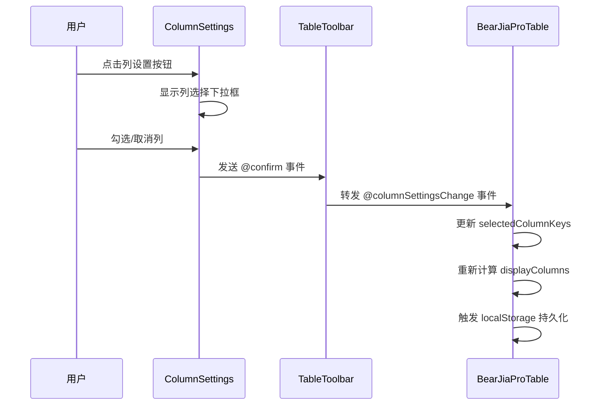
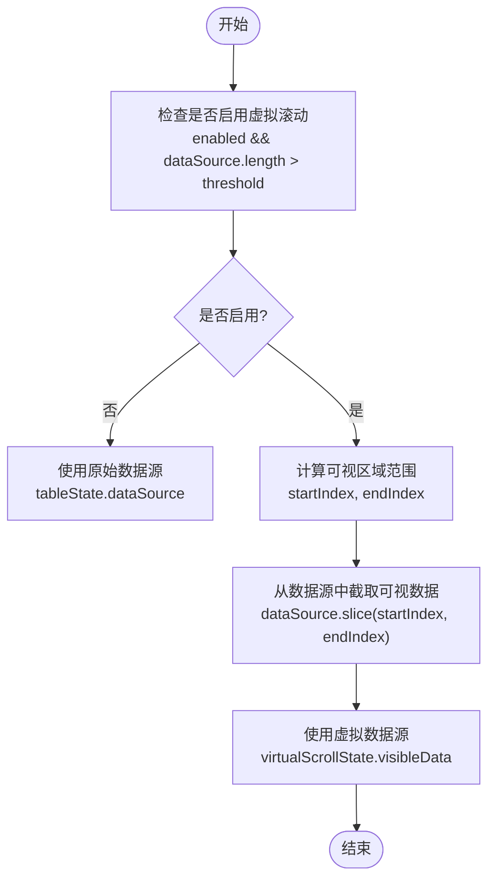
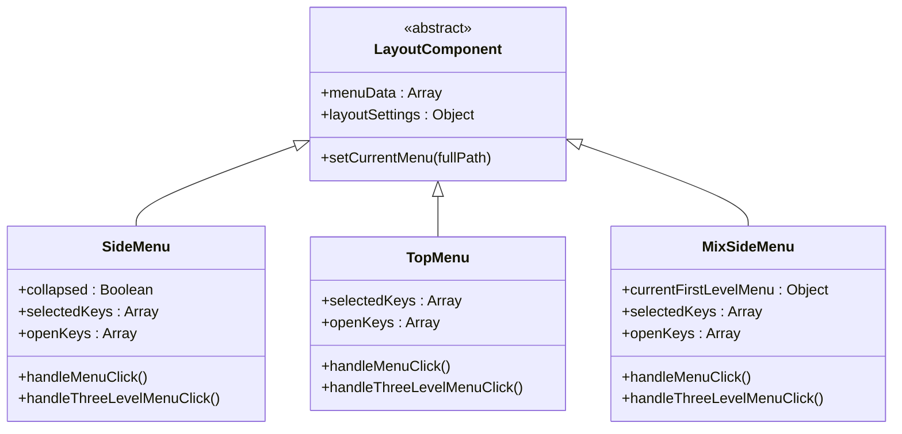
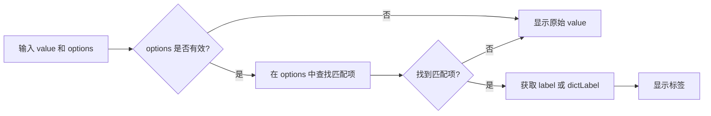
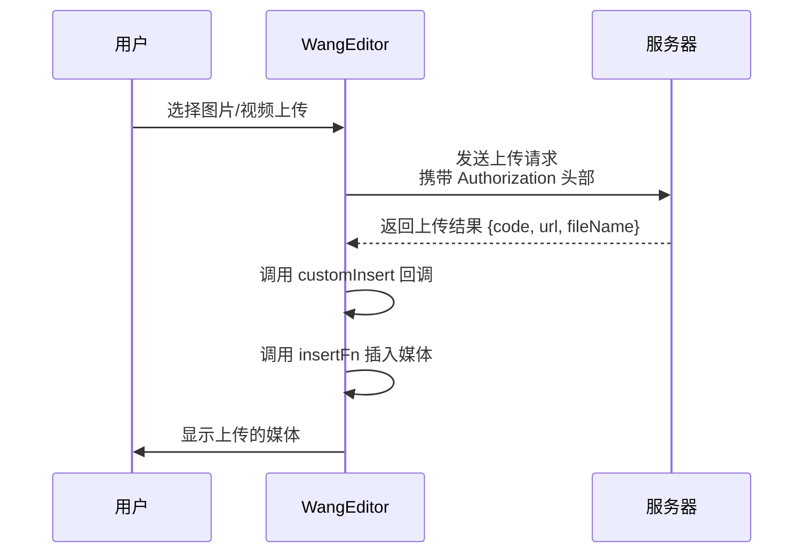
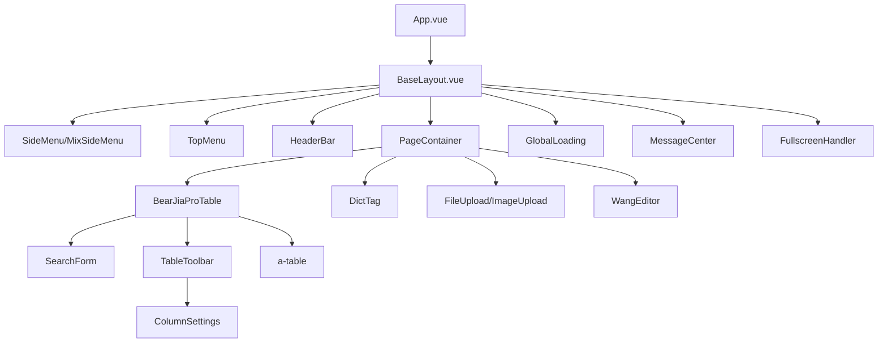

# 组件架构

<cite>
**本文档引用的文件**
- [index.vue](file://bear-jia-vue3/src/components/BearJiaProTable/index.vue)
- [TableToolbar.vue](file://bear-jia-vue3/src/components/BearJiaProTable/TableToolbar.vue)
- [ColumnSettings.vue](file://bear-jia-vue3/src/components/BearJiaProTable/ColumnSettings.vue)
- [useVirtualScroll.js](file://bear-jia-vue3/src/composables/useVirtualScroll.js)
- [useTable.js](file://bear-jia-vue3/src/composables/useTable.js)
- [SideMenu.vue](file://bear-jia-vue3/src/components/layout/SideMenu.vue)
- [TopMenu.vue](file://bear-jia-vue3/src/components/layout/TopMenu.vue)
- [MixSideMenu.vue](file://bear-jia-vue3/src/components/layout/MixSideMenu.vue)
- [DictTag.vue](file://bear-jia-vue3/src/components/DictTag/index.vue)
- [FileUpload.vue](file://bear-jia-vue3/src/components/FileUpload/index.vue)
- [ImageUpload.vue](file://bear-jia-vue3/src/components/ImageUpload/index.vue)
- [WangEditor.vue](file://bear-jia-vue3/src/components/editor/WangEditor.vue)
- [GlobalLoading.vue](file://bear-jia-vue3/src/components/common/GlobalLoading.vue)
- [MessageCenter.vue](file://bear-jia-vue3/src/components/common/MessageCenter.vue)
- [FullscreenHandler.vue](file://bear-jia-vue3/src/components/common/FullscreenHandler.vue)
</cite>

## 目录
1. [统一表格组件](#统一表格组件)
2. [布局组件](#布局组件)
3. [常用业务组件](#常用业务组件)
4. [富文本编辑器](#富文本编辑器)
5. [全局组件](#全局组件)
6. [组件层级关系](#组件层级关系)

## 统一表格组件

BearJiaProTable 是一个功能丰富的统一表格组件，集成了查询表单、操作按钮、工具栏和虚拟滚动等特性。该组件通过组合式API（Composable）的方式，将表格的通用逻辑封装在 `useTable` 和 `useVirtualScroll` 中，实现了高内聚、低耦合的设计。

组件通过 `props` 接收 `api` 配置，包含 `list`、`delete` 等方法，实现了与后端服务的解耦。同时，通过 `searchFields` 和 `columns` 配置项，支持动态生成查询表单和表格列，提高了组件的灵活性和复用性。

**组件来源**
- [index.vue](file://bear-jia-vue3/src/components/BearJiaProTable/index.vue)
- [useTable.js](file://bear-jia-vue3/src/composables/useTable.js)

### TableToolbar与ColumnSettings集成机制

TableToolbar 组件作为 BearJiaProTable 的工具栏，提供了刷新、密度设置、全屏、列设置和更多操作等功能。它通过 `props` 接收 `columns` 和 `selectedColumns`，并将其传递给 ColumnSettings 组件。

ColumnSettings 组件通过 `a-dropdown` 实现下拉菜单，内部使用 `a-checkbox-group` 提供列的显隐控制。用户在 ColumnSettings 中选择列后，通过 `@confirm` 事件将选中的列键数组传递给父组件，从而实现列的动态显示与隐藏。

**图表来源**
- [TableToolbar.vue](file://bear-jia-vue3/src/components/BearJiaProTable/TableToolbar.vue)
- [ColumnSettings.vue](file://bear-jia-vue3/src/components/BearJiaProTable/ColumnSettings.vue)

**组件来源**
- [TableToolbar.vue](file://bear-jia-vue3/src/components/BearJiaProTable/TableToolbar.vue)
- [ColumnSettings.vue](file://bear-jia-vue3/src/components/BearJiaProTable/ColumnSettings.vue)

### 虚拟滚动性能优化方案

虚拟滚动方案通过 `useVirtualScroll` Composable 实现，核心思想是只渲染可视区域内的行，从而大幅提升大数据量下的渲染性能。该方案通过监听滚动事件，动态计算可视区域的起始和结束索引，然后从完整数据源中截取对应范围的数据进行渲染。

`useVirtualScroll` 计算了 `visibleData`、`startIndex`、`endIndex` 等关键状态，并提供了 `scrollToIndex`、`scrollToTop` 等方法。在 BearJiaProTable 中，当数据量超过阈值时，`finalDataSource` 会使用 `virtualScrollState.visibleData.value` 作为数据源，从而实现虚拟滚动。

**图表来源**
- [useVirtualScroll.js](file://bear-jia-vue3/src/composables/useVirtualScroll.js)
- [index.vue](file://bear-jia-vue3/src/components/BearJiaProTable/index.vue)

**组件来源**
- [useVirtualScroll.js](file://bear-jia-vue3/src/composables/useVirtualScroll.js)
- [index.vue](file://bear-jia-vue3/src/components/BearJiaProTable/index.vue)

## 布局组件

系统提供了 SideMenu、TopMenu 和 MixSideMenu 三种布局模式，支持侧边栏、顶部菜单和混合布局的切换。这些组件通过 `menuData` prop 接收菜单数据，并根据路由配置动态生成菜单项。

### 多布局模式实现

三种布局组件共享相似的菜单渲染逻辑，都支持多级菜单、外链和图标显示。它们通过 `v-for` 循环遍历 `menuData`，根据 `children` 的数量和 `alwaysShow` 配置决定是否渲染为可折叠的 `a-sub-menu`。

**图表来源**
- [SideMenu.vue](file://bear-jia-vue3/src/components/layout/SideMenu.vue)
- [TopMenu.vue](file://bear-jia-vue3/src/components/layout/TopMenu.vue)
- [MixSideMenu.vue](file://bear-jia-vue3/src/components/layout/MixSideMenu.vue)

**组件来源**
- [SideMenu.vue](file://bear-jia-vue3/src/components/layout/SideMenu.vue)
- [TopMenu.vue](file://bear-jia-vue3/src/components/layout/TopMenu.vue)
- [MixSideMenu.vue](file://bear-jia-vue3/src/components/layout/MixSideMenu.vue)

### 切换逻辑

布局切换逻辑主要通过 `setCurrentMenu` 方法实现，该方法接收当前路由的完整路径，遍历菜单数据查找匹配的菜单项，并更新 `selectedKeys` 和 `openKeys` 状态，从而高亮当前菜单。对于 MixSideMenu，还需要通过 `currentFirstLevelMenu` prop 接收当前选中的一级菜单，以确定侧边栏应显示的子菜单。

## 常用业务组件

### DictTag封装方式和使用规范

DictTag 组件用于将字典值转换为标签显示。它接收 `options`（字典选项数组）和 `value`（当前值），通过 `computed` 属性 `tagText` 查找对应的标签文本。同时，它支持通过 `listClass` 或 `value` 映射颜色，实现了语义化标签显示。

**图表来源**
- [DictTag.vue](file://bear-jia-vue3/src/components/DictTag/index.vue)

**组件来源**
- [DictTag.vue](file://bear-jia-vue3/src/components/DictTag/index.vue)

### FileUpload和ImageUpload封装方式

FileUpload 和 ImageUpload 组件都基于 Ant Design Vue 的 `a-upload` 组件进行封装，提供了文件上传、列表显示、删除、拖拽排序等功能。它们通过 `modelValue` 实现 v-model 双向绑定，通过 `action` 指定上传接口。

两个组件都实现了文件类型和大小校验，并通过 `handleBeforeUpload` 钩子阻止不符合条件的文件上传。上传成功后，通过 `handleChange` 事件更新文件列表，并调用 `updateModelValue` 方法将文件路径同步到 `modelValue`。

**组件来源**
- [FileUpload.vue](file://bear-jia-vue3/src/components/FileUpload/index.vue)
- [ImageUpload.vue](file://bear-jia-vue3/src/components/ImageUpload/index.vue)

## 富文本编辑器

### WangEditor集成方案

WangEditor 组件通过 `@wangeditor/editor-for-vue` 封装，提供了完整的富文本编辑功能。组件通过 `v-model` 绑定内容，通过 `props` 配置高度、只读状态、占位符等。

图片和视频上传处理通过 `editorConfig.MENU_CONF.uploadImage` 和 `uploadVideo` 配置实现。上传时，组件会自动添加 `Authorization` 头部，并设置文件大小限制。上传成功后，通过 `customInsert` 回调函数将返回的 URL 插入编辑器。

**图表来源**
- [WangEditor.vue](file://bear-jia-vue3/src/components/editor/WangEditor.vue)

**组件来源**
- [WangEditor.vue](file://bear-jia-vue3/src/components/editor/WangEditor.vue)

## 全局组件

### 跨页面复用机制

全局组件如 GlobalLoading、MessageCenter、FullscreenHandler 通过 `defineExpose` 暴露内部方法，供父组件或全局调用。

- **GlobalLoading**：通过 `show()` 和 `hide()` 方法控制加载状态的显示与隐藏，可在任何需要加载提示的地方调用。
- **MessageCenter**：通过 `v-model:visible` 控制弹窗的显示与隐藏，通过 `props` 配置是否显示按钮和提示。
- **FullscreenHandler**：通过 `toggleFullscreen()`、`enterFullscreen()`、`exitFullscreen()` 方法控制全屏状态，并通过 `isFullscreen` 状态响应式更新。

这些组件通常作为应用布局的一部分，通过状态管理或事件总线实现跨页面的统一控制。

**组件来源**
- [GlobalLoading.vue](file://bear-jia-vue3/src/components/common/GlobalLoading.vue)
- [MessageCenter.vue](file://bear-jia-vue3/src/components/common/MessageCenter.vue)
- [FullscreenHandler.vue](file://bear-jia-vue3/src/components/common/FullscreenHandler.vue)

## 组件层级关系

**图表来源**
- [index.vue](file://bear-jia-vue3/src/components/BearJiaProTable/index.vue)
- [SideMenu.vue](file://bear-jia-vue3/src/components/layout/SideMenu.vue)
- [TopMenu.vue](file://bear-jia-vue3/src/components/layout/TopMenu.vue)
- [MixSideMenu.vue](file://bear-jia-vue3/src/components/layout/MixSideMenu.vue)
- [GlobalLoading.vue](file://bear-jia-vue3/src/components/common/GlobalLoading.vue)
- [MessageCenter.vue](file://bear-jia-vue3/src/components/common/MessageCenter.vue)
- [FullscreenHandler.vue](file://bear-jia-vue3/src/components/common/FullscreenHandler.vue)

**组件来源**
- [App.vue](file://bear-jia-vue3/src/App.vue)
- [BaseLayout.vue](file://bear-jia-vue3/src/layout/BaseLayout.vue)