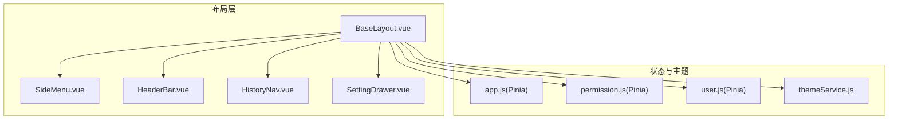
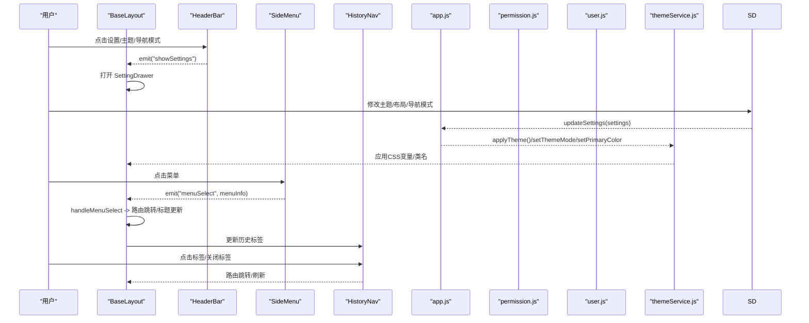
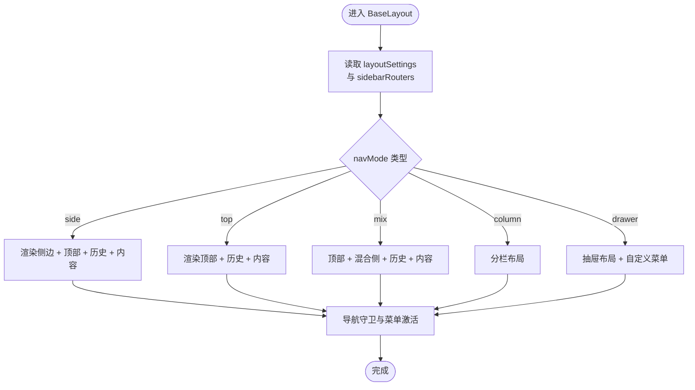
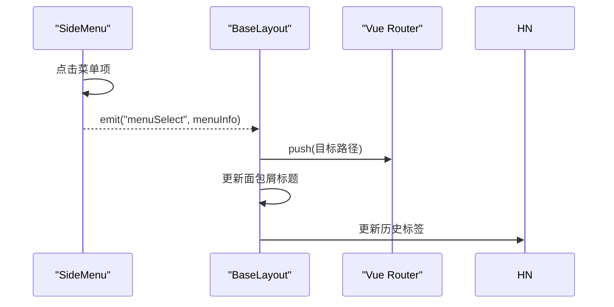
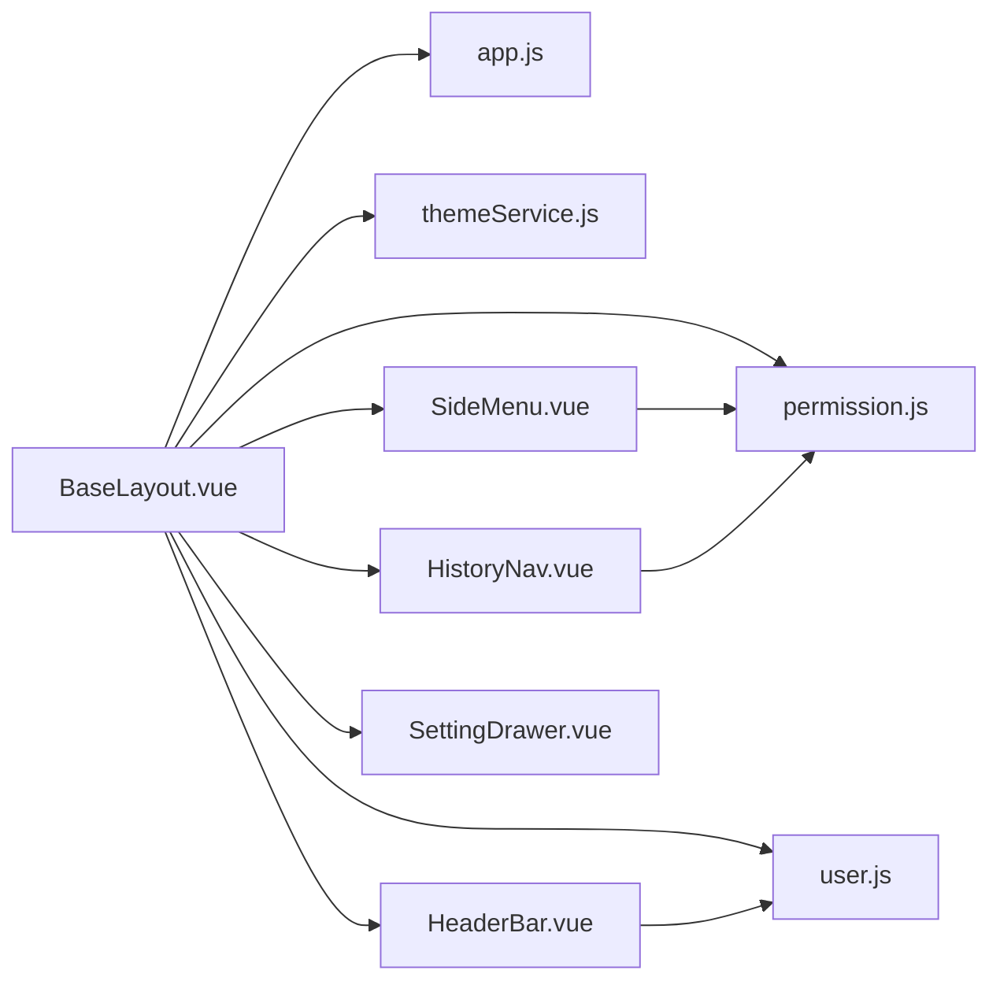

# 主布局

<cite>
**本文引用的文件**
- [BaseLayout.vue](file://bear-jia-vue3/src/layout/BaseLayout.vue)
- [SideMenu.vue](file://bear-jia-vue3/src/components/layout/SideMenu.vue)
- [HeaderBar.vue](file://bear-jia-vue3/src/components/layout/HeaderBar.vue)
- [HistoryNav.vue](file://bear-jia-vue3/src/components/layout/HistoryNav.vue)
- [SettingDrawer.vue](file://bear-jia-vue3/src/components/layout/SettingDrawer.vue)
- [app.js](file://bear-jia-vue3/src/stores/app.js)
- [permission.js](file://bear-jia-vue3/src/stores/permission.js)
- [user.js](file://bear-jia-vue3/src/stores/user.js)
- [themeService.js](file://bear-jia-vue3/src/utils/theme/themeService.js)
- [index.js](file://bear-jia-vue3/src/utils/theme/index.js)
</cite>

## 目录
1. [简介](#简介)
2. [项目结构](#项目结构)
3. [核心组件](#核心组件)
4. [架构总览](#架构总览)
5. [详细组件分析](#详细组件分析)
6. [依赖关系分析](#依赖关系分析)
7. [性能考量](#性能考量)
8. [故障排查指南](#故障排查指南)
9. [结论](#结论)
10. [附录](#附录)

## 简介
本文件深入解析后台管理系统的核心布局组件 BaseLayout.vue，围绕其整体结构与交互机制展开，重点涵盖：
- 侧边栏菜单（SideMenu）、顶部导航栏（HeaderBar）、标签页（HistoryNav）与内容区域的布局关系
- 通过 Vuex/Pinia 状态管理控制菜单折叠、主题切换、布局模式
- 权限控制在布局中的实现，以及如何根据用户角色动态渲染菜单项
- 响应式设计与移动端适配策略
- 自定义布局的扩展方法与建议

## 项目结构
BaseLayout 位于布局层，作为顶层容器协调各子组件；侧边栏、顶部栏、历史标签等均为独立组件，通过 Pinia Store 与主题服务协同工作。

图表来源
- [BaseLayout.vue](file://bear-jia-vue3/src/layout/BaseLayout.vue#L1-L120)
- [SideMenu.vue](file://bear-jia-vue3/src/components/layout/SideMenu.vue#L1-L60)
- [HeaderBar.vue](file://bear-jia-vue3/src/components/layout/HeaderBar.vue#L1-L60)
- [HistoryNav.vue](file://bear-jia-vue3/src/components/layout/HistoryNav.vue#L1-L60)
- [SettingDrawer.vue](file://bear-jia-vue3/src/components/layout/SettingDrawer.vue#L1-L60)
- [app.js](file://bear-jia-vue3/src/stores/app.js#L1-L60)
- [permission.js](file://bear-jia-vue3/src/stores/permission.js#L1-L60)
- [user.js](file://bear-jia-vue3/src/stores/user.js#L1-L40)
- [themeService.js](file://bear-jia-vue3/src/utils/theme/themeService.js#L1-L60)

章节来源
- [BaseLayout.vue](file://bear-jia-vue3/src/layout/BaseLayout.vue#L1-L120)
- [app.js](file://bear-jia-vue3/src/stores/app.js#L1-L60)

## 核心组件
- BaseLayout：统一布局容器，按导航模式（侧边/顶部/混合/分栏/抽屉）渲染不同子布局，并承载菜单、头部、历史标签与内容区域。
- SideMenu：侧边菜单，支持多级菜单、外链识别、菜单激活状态同步。
- HeaderBar：顶部导航栏，支持折叠按钮、面包屑、用户下拉菜单、全屏、刷新、设置等。
- HistoryNav：多页签标签导航，支持滚动、关闭、刷新、批量关闭等。
- SettingDrawer：布局设置抽屉，支持主题模式、主题色、导航模式、布局开关、系统配置、表格配置与导入导出。

章节来源
- [BaseLayout.vue](file://bear-jia-vue3/src/layout/BaseLayout.vue#L1-L120)
- [SideMenu.vue](file://bear-jia-vue3/src/components/layout/SideMenu.vue#L1-L60)
- [HeaderBar.vue](file://bear-jia-vue3/src/components/layout/HeaderBar.vue#L1-L60)
- [HistoryNav.vue](file://bear-jia-vue3/src/components/layout/HistoryNav.vue#L1-L60)
- [SettingDrawer.vue](file://bear-jia-vue3/src/components/layout/SettingDrawer.vue#L1-L60)

## 架构总览
BaseLayout 通过 Pinia Store 读取布局设置与菜单数据，结合主题服务实现主题与布局的动态切换；通过路由守卫与菜单选择事件驱动页面跳转与激活状态更新。

图表来源
- [BaseLayout.vue](file://bear-jia-vue3/src/layout/BaseLayout.vue#L590-L730)
- [HeaderBar.vue](file://bear-jia-vue3/src/components/layout/HeaderBar.vue#L1-L120)
- [SideMenu.vue](file://bear-jia-vue3/src/components/layout/SideMenu.vue#L150-L215)
- [HistoryNav.vue](file://bear-jia-vue3/src/components/layout/HistoryNav.vue#L240-L320)
- [SettingDrawer.vue](file://bear-jia-vue3/src/components/layout/SettingDrawer.vue#L588-L620)
- [app.js](file://bear-jia-vue3/src/stores/app.js#L66-L118)
- [themeService.js](file://bear-jia-vue3/src/utils/theme/themeService.js#L187-L274)

## 详细组件分析

### BaseLayout 布局容器
- 布局模式分支：根据 layoutSettings.navMode 渲染 side/top/mix/column/drawer 五种布局形态，分别组合 SideMenu/HeaderBar/HistoryNav/内容区。
- 菜单数据来源：computed 从 permissionStore.sidebarRouters 获取菜单树，供侧边栏与顶部菜单使用。
- 主题与布局设置：computed layoutSettings 与 layoutClasses 控制类名与固定头/侧栏等开关；onMounted 中调用 appStore.applyTheme() 应用主题。
- 菜单选择与路由跳转：handleMenuSelect/handleRouteChange 等方法负责外链判断、路由校验、面包屑标题更新与标签页维护。
- 抽屉模式样式修复：fixDrawerLayoutStyles 通过 nextTick 修正抽屉模式背景色一致性。

图表来源
- [BaseLayout.vue](file://bear-jia-vue3/src/layout/BaseLayout.vue#L1-L120)
- [BaseLayout.vue](file://bear-jia-vue3/src/layout/BaseLayout.vue#L758-L794)
- [permission.js](file://bear-jia-vue3/src/stores/permission.js#L234-L261)

章节来源
- [BaseLayout.vue](file://bear-jia-vue3/src/layout/BaseLayout.vue#L1-L260)
- [BaseLayout.vue](file://bear-jia-vue3/src/layout/BaseLayout.vue#L758-L800)

### 侧边栏菜单 SideMenu
- 菜单渲染：支持工作台、父菜单多子菜单、二级/三级菜单、外链识别与图标显示。
- 激活状态：setCurrentMenu 根据当前路由路径匹配并设置 selectedKeys/openKeys。
- 事件通信：emit("menuSelect") 向父组件传递菜单信息，触发 BaseLayout 路由跳转与标题更新。

图表来源
- [SideMenu.vue](file://bear-jia-vue3/src/components/layout/SideMenu.vue#L150-L215)
- [BaseLayout.vue](file://bear-jia-vue3/src/layout/BaseLayout.vue#L590-L730)
- [HistoryNav.vue](file://bear-jia-vue3/src/components/layout/HistoryNav.vue#L240-L320)

章节来源
- [SideMenu.vue](file://bear-jia-vue3/src/components/layout/SideMenu.vue#L1-L120)
- [SideMenu.vue](file://bear-jia-vue3/src/components/layout/SideMenu.vue#L216-L306)

### 顶部导航栏 HeaderBar
- 模式感知：根据 layoutSettings.navMode 切换侧边/顶部/混合模式，决定左侧折叠按钮、Logo/面包屑与顶部菜单区域。
- 功能区：全局搜索、消息中心、聊天、全屏、刷新、设置、用户下拉菜单（个人中心、布局设置、退出登录）。
- 事件透传：向上抛出 logout/personalCenter/showSettings/refreshPage/menuSelect 等事件，由 BaseLayout 统一处理。

章节来源
- [HeaderBar.vue](file://bear-jia-vue3/src/components/layout/HeaderBar.vue#L1-L120)
- [HeaderBar.vue](file://bear-jia-vue3/src/components/layout/HeaderBar.vue#L325-L359)

### 历史标签 HistoryNav
- 标签管理：监听路由变化，动态添加/移除标签，限制最大数量，支持关闭当前/关闭其他/关闭全部/刷新。
- 可视化：左右滚动按钮、激活态高亮、下拉菜单提供操作入口。
- 响应式：在小屏设备上缩小标签宽度与字号，保证可读性。

章节来源
- [HistoryNav.vue](file://bear-jia-vue3/src/components/layout/HistoryNav.vue#L1-L120)
- [HistoryNav.vue](file://bear-jia-vue3/src/components/layout/HistoryNav.vue#L131-L200)
- [HistoryNav.vue](file://bear-jia-vue3/src/components/layout/HistoryNav.vue#L351-L398)

### 设置抽屉 SettingDrawer
- 主题与布局：主题模式（亮/暗）、主题色、导航模式（侧边/顶部/混合/分栏/抽屉）、内容宽度、固定头/侧栏、隐藏 Footer、多页签、表格通用样式、系统配置、配置导入导出与重置。
- 与 Store 协同：通过 appStore.updateSettings 与 themeService 应用主题变化，同时持久化到 localStorage。

章节来源
- [SettingDrawer.vue](file://bear-jia-vue3/src/components/layout/SettingDrawer.vue#L1-L120)
- [SettingDrawer.vue](file://bear-jia-vue3/src/components/layout/SettingDrawer.vue#L588-L620)
- [app.js](file://bear-jia-vue3/src/stores/app.js#L66-L118)
- [themeService.js](file://bear-jia-vue3/src/utils/theme/themeService.js#L187-L274)

## 依赖关系分析
- BaseLayout 依赖：
  - Pinia：app.js（布局设置、主题应用）、permission.js（菜单数据）、user.js（登出）
  - 主题服务：themeService.js（主题模式/色弱/颜色变更）
  - 组件：SideMenu/HeaderBar/HistoryNav/SettingDrawer
- SideMenu 依赖：
  - 外链判断工具、系统信息常量、菜单数据来自 permission.sidebarRouters
- HeaderBar 依赖：
  - 用户信息 store、全屏处理器、下拉菜单
- HistoryNav 依赖：
  - 路由与菜单标题映射、localStorage

图表来源
- [BaseLayout.vue](file://bear-jia-vue3/src/layout/BaseLayout.vue#L260-L320)
- [permission.js](file://bear-jia-vue3/src/stores/permission.js#L234-L261)
- [app.js](file://bear-jia-vue3/src/stores/app.js#L66-L118)
- [user.js](file://bear-jia-vue3/src/stores/user.js#L1-L40)
- [themeService.js](file://bear-jia-vue3/src/utils/theme/themeService.js#L187-L274)

章节来源
- [BaseLayout.vue](file://bear-jia-vue3/src/layout/BaseLayout.vue#L260-L320)
- [permission.js](file://bear-jia-vue3/src/stores/permission.js#L234-L261)

## 性能考量
- 菜单渲染优化：SideMenu 采用按需渲染与外链识别，减少无效路由跳转与组件加载。
- 主题应用：appStore.applyTheme 与 themeService.setPrimaryColor/setThemeMode 采用批量应用与事件通知，避免频繁 DOM 操作。
- 历史标签：限制最大历史数量与惰性滚动，降低 DOM 负担。
- 路由守卫：BaseLayout.beforeEach 校验路由有效性，减少无效跳转带来的资源浪费。

[本节为通用指导，无需特定文件引用]

## 故障排查指南
- 菜单不显示或空白
  - 检查 permissionStore.sidebarRouters 是否正确生成与注入
  - 确认外链路由未被加入 Vue Router（仅在菜单显示）
- 路由跳转失败
  - 查看 BaseLayout.handleRouteChange 与 clickMenuItem/clickThreeLevelMenuItem 的错误分支
  - 确认 isExternal 判断与路径拼接逻辑
- 主题切换无效
  - 检查 appStore.updateSettings 与 themeService.applyCurrentTheme 的调用链
  - 确认 CSS 变量是否正确写入 documentElement
- 历史标签异常
  - 检查 HistoryNav.addHistory/removeHistory 的逻辑与 localStorage 同步
  - 确认菜单标题解析顺序（菜单 > 路由 meta > 默认）

章节来源
- [permission.js](file://bear-jia-vue3/src/stores/permission.js#L234-L261)
- [BaseLayout.vue](file://bear-jia-vue3/src/layout/BaseLayout.vue#L590-L730)
- [app.js](file://bear-jia-vue3/src/stores/app.js#L66-L118)
- [themeService.js](file://bear-jia-vue3/src/utils/theme/themeService.js#L187-L274)
- [HistoryNav.vue](file://bear-jia-vue3/src/components/layout/HistoryNav.vue#L191-L240)

## 结论
BaseLayout 以 Pinia 为核心协调布局设置、菜单数据与主题服务，通过多种导航模式满足不同业务场景；配合 SideMenu/HeaderBar/HistoryNav/SettingDrawer 实现了完整的后台管理体验。权限控制与响应式设计贯穿其中，便于扩展与维护。

[本节为总结性内容，无需特定文件引用]

## 附录

### 权限控制在布局中的实现
- 菜单过滤：permission.generateRoutes 从后端获取路由树，区分外链与普通路由，生成 sidebarRouters 与 rewriteRoutes。
- 角色/权限判断：hasPermission/filterDynamicRoutes 依据 route.meta.roles 或 route.permissions 进行过滤。
- 菜单渲染：BaseLayout 通过 computed 读取 sidebarRouters，SideMenu 根据菜单层级与外链标识渲染。

章节来源
- [permission.js](file://bear-jia-vue3/src/stores/permission.js#L1-L60)
- [permission.js](file://bear-jia-vue3/src/stores/permission.js#L234-L261)
- [BaseLayout.vue](file://bear-jia-vue3/src/layout/BaseLayout.vue#L337-L346)
- [SideMenu.vue](file://bear-jia-vue3/src/components/layout/SideMenu.vue#L1-L60)

### 响应式设计与移动端适配
- HistoryNav 在小屏设备上缩小标签宽度与字号，保证可读性与交互体验。
- HeaderBar 根据 navMode 调整布局占比与元素排列，适配不同屏幕尺寸。
- SettingDrawer 作为右侧抽屉，适合桌面端配置；移动端可通过手势或按钮触发。

章节来源
- [HistoryNav.vue](file://bear-jia-vue3/src/components/layout/HistoryNav.vue#L534-L548)
- [HeaderBar.vue](file://bear-jia-vue3/src/components/layout/HeaderBar.vue#L406-L433)
- [SettingDrawer.vue](file://bear-jia-vue3/src/components/layout/SettingDrawer.vue#L1-L60)

### 自定义布局扩展方法
- 新增导航模式：在 BaseLayout 的 navMode 分支中新增一种布局分支，组合对应组件（如 HeaderBar、SideMenu、HistoryNav）。
- 调整布局开关：在 app.js 的 layoutSettings 中新增开关项，并在 SettingDrawer 中增加对应控件。
- 主题扩展：通过 themeService 提供的 setPrimaryColor/setThemeMode/setColorWeak 接口，统一管理主题色与模式切换。
- 菜单扩展：在 permission.generateRoutes 中扩展菜单生成逻辑，或在 BaseLayout 中引入新的菜单组件。

章节来源
- [BaseLayout.vue](file://bear-jia-vue3/src/layout/BaseLayout.vue#L1-L120)
- [app.js](file://bear-jia-vue3/src/stores/app.js#L13-L40)
- [SettingDrawer.vue](file://bear-jia-vue3/src/components/layout/SettingDrawer.vue#L588-L620)
- [themeService.js](file://bear-jia-vue3/src/utils/theme/themeService.js#L187-L274)
- [permission.js](file://bear-jia-vue3/src/stores/permission.js#L234-L261)