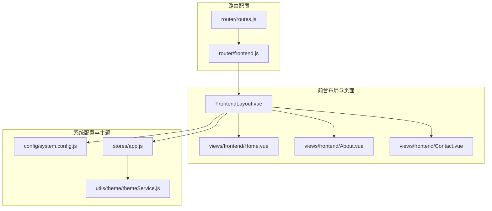
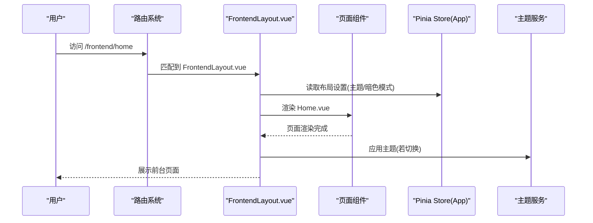
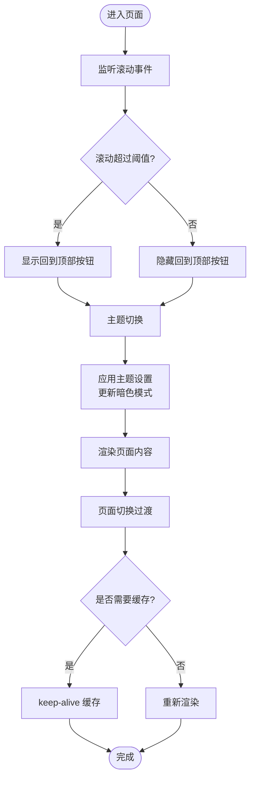
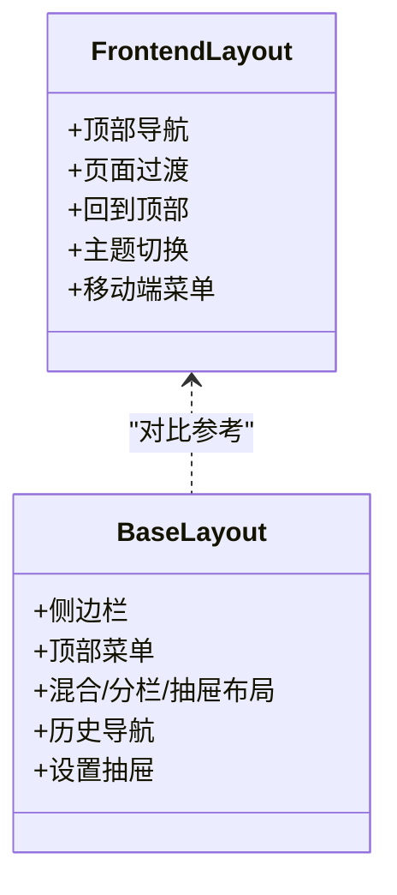
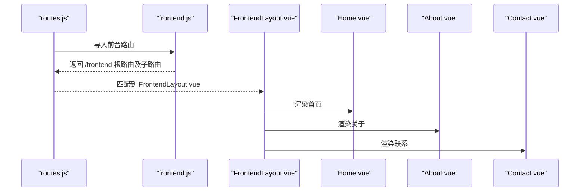
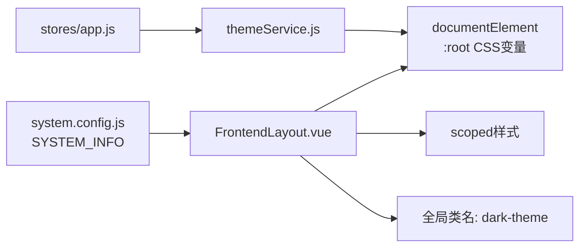
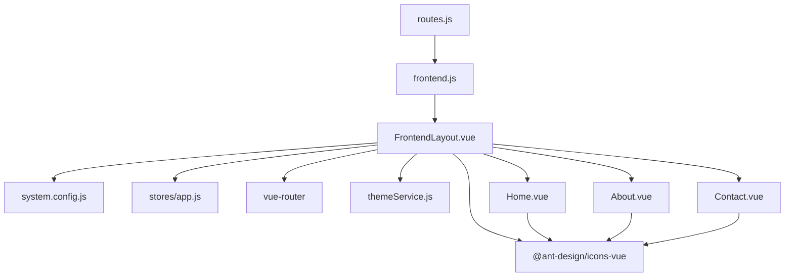

# 前台布局

<cite>
**本文引用的文件**
- [FrontendLayout.vue](file://bear-jia-vue3/src/layout/FrontendLayout.vue)
- [BaseLayout.vue](file://bear-jia-vue3/src/layout/BaseLayout.vue)
- [frontend.js](file://bear-jia-vue3/src/router/frontend.js)
- [routes.js](file://bear-jia-vue3/src/router/routes.js)
- [Home.vue](file://bear-jia-vue3/src/views/frontend/Home.vue)
- [About.vue](file://bear-jia-vue3/src/views/frontend/About.vue)
- [Contact.vue](file://bear-jia-vue3/src/views/frontend/Contact.vue)
- [system.config.js](file://bear-jia-vue3/src/config/system.config.js)
- [app.js](file://bear-jia-vue3/src/stores/app.js)
- [themeService.js](file://bear-jia-vue3/src/utils/theme/themeService.js)
- [README.md](file://bear-jia-vue3/src/style/README.md)
</cite>

## 目录
1. [引言](#引言)
2. [项目结构](#项目结构)
3. [核心组件](#核心组件)
4. [架构总览](#架构总览)
5. [详细组件分析](#详细组件分析)
6. [依赖分析](#依赖分析)
7. [性能考量](#性能考量)
8. [故障排查指南](#故障排查指南)
9. [结论](#结论)
10. [附录](#附录)

## 引言
本文件围绕 FrontendLayout.vue 作为前台页面布局的设计理念与实现细节进行全面解析，重点对比其与后台主布局 BaseLayout.vue 的差异，阐述其“简洁化导航 + 内容展示”的特点，并给出适用场景、路由绑定方式、样式隔离机制以及定制化方案（头部导航个性化与页面过渡动画设置）。文档同时提供可视化图示与可操作的实践建议，帮助读者快速理解并高效使用该布局。

## 项目结构
前台布局位于 src/layout 目录下，配套的前台页面位于 src/views/frontend，路由配置位于 src/router。整体结构清晰，采用“布局 + 页面 + 路由”的分层组织方式，便于扩展与维护。

**图表来源**
- [FrontendLayout.vue](file://bear-jia-vue3/src/layout/FrontendLayout.vue#L1-L145)
- [frontend.js](file://bear-jia-vue3/src/router/frontend.js#L1-L80)
- [routes.js](file://bear-jia-vue3/src/router/routes.js#L1-L100)
- [Home.vue](file://bear-jia-vue3/src/views/frontend/Home.vue#L1-L140)
- [About.vue](file://bear-jia-vue3/src/views/frontend/About.vue#L1-L122)
- [Contact.vue](file://bear-jia-vue3/src/views/frontend/Contact.vue#L1-L196)
- [system.config.js](file://bear-jia-vue3/src/config/system.config.js#L1-L30)
- [app.js](file://bear-jia-vue3/src/stores/app.js#L1-L180)
- [themeService.js](file://bear-jia-vue3/src/utils/theme/themeService.js#L1-L120)

**章节来源**
- [FrontendLayout.vue](file://bear-jia-vue3/src/layout/FrontendLayout.vue#L1-L145)
- [frontend.js](file://bear-jia-vue3/src/router/frontend.js#L1-L80)
- [routes.js](file://bear-jia-vue3/src/router/routes.js#L1-L100)

## 核心组件
- 前台布局 FrontendLayout.vue：提供简洁的顶部导航、主要内容区、底部信息与回到顶部按钮；内置页面切换过渡与组件缓存策略；支持主题切换与移动端菜单。
- 后台主布局 BaseLayout.vue：提供侧边栏、顶部菜单、混合布局、分栏布局、抽屉布局等丰富布局形态，适合后台管理的复杂导航与功能组织。
- 前台页面 Home/About/Contact：分别承担门户首页、公司介绍与联系页面的内容展示。
- 路由配置 frontend.js 与 routes.js：将前台页面挂载到 /frontend 路由树，实现与后台路由的分离。
- 系统配置 system.config.js：集中管理系统名称、描述、版权等信息，供布局与页面复用。
- 主题服务 themeService.js 与 Pinia Store app.js：统一管理主题色、暗色模式、色弱模式等，驱动布局与页面的视觉一致性。

**章节来源**
- [FrontendLayout.vue](file://bear-jia-vue3/src/layout/FrontendLayout.vue#L1-L238)
- [BaseLayout.vue](file://bear-jia-vue3/src/layout/BaseLayout.vue#L1-L120)
- [Home.vue](file://bear-jia-vue3/src/views/frontend/Home.vue#L1-L140)
- [About.vue](file://bear-jia-vue3/src/views/frontend/About.vue#L1-L122)
- [Contact.vue](file://bear-jia-vue3/src/views/frontend/Contact.vue#L1-L196)
- [system.config.js](file://bear-jia-vue3/src/config/system.config.js#L1-L30)
- [app.js](file://bear-jia-vue3/src/stores/app.js#L1-L180)
- [themeService.js](file://bear-jia-vue3/src/utils/theme/themeService.js#L1-L120)

## 架构总览
前台布局采用“路由 -> 布局 -> 页面”的三层结构：
- 路由层：通过 routes.js 合并 frontend.js，将 /frontend 路由树挂载到根路由，实现前台页面与后台页面的物理隔离。
- 布局层：FrontendLayout.vue 作为前台统一入口，负责头部导航、内容区过渡、底部信息与回到顶部等。
- 页面层：Home/About/Contact 等页面专注内容展示，样式与交互相对简洁。

**图表来源**
- [routes.js](file://bear-jia-vue3/src/router/routes.js#L1-L100)
- [frontend.js](file://bear-jia-vue3/src/router/frontend.js#L1-L80)
- [FrontendLayout.vue](file://bear-jia-vue3/src/layout/FrontendLayout.vue#L1-L238)
- [app.js](file://bear-jia-vue3/src/stores/app.js#L1-L180)
- [themeService.js](file://bear-jia-vue3/src/utils/theme/themeService.js#L1-L120)

## 详细组件分析

### 前台布局 FrontendLayout.vue 设计与实现
- 结构组成
  - 顶部导航栏：包含 Logo、主导航菜单、右侧操作区（主题切换、管理后台入口、移动端菜单按钮）。
  - 主要内容区：通过 router-view + transition + keep-alive 实现页面切换动画与缓存。
  - 底部：公司信息、快速链接、联系信息与版权信息。
  - 回到顶部按钮：滚动至一定阈值后显示，点击平滑回到顶部。
- 交互与行为
  - 滚动监听：根据滚动距离动态切换头部样式与显示回到顶部按钮。
  - 主题切换：通过 Pinia Store 更新布局设置，联动主题服务应用暗色模式。
  - 移动端菜单：移动端显示汉堡菜单，点击切换展开状态。
  - 管理后台入口：点击跳转至后台根路径，便于前后台切换。
- 样式隔离
  - 使用 scoped 样式与 :global(.dark-theme) 适配暗色主题，避免污染后台样式。
  - 通过固定头部、内容区 margin-top 等布局策略，保证内容不被遮挡。
- 页面过渡与缓存
  - 使用 transition name="page-fade" 实现页面淡入淡出过渡。
  - 通过 keep-alive 与 route.meta.keepAlive 控制页面缓存，减少重复渲染。

**图表来源**
- [FrontendLayout.vue](file://bear-jia-vue3/src/layout/FrontendLayout.vue#L1-L238)

**章节来源**
- [FrontendLayout.vue](file://bear-jia-vue3/src/layout/FrontendLayout.vue#L1-L238)

### 与后台主布局 BaseLayout.vue 的差异
- 导航复杂度
  - 前台布局：仅包含顶部主导航与移动端菜单，导航项精简，适合门户与展示型页面。
  - 后台布局：支持侧边栏、顶部菜单、混合布局、分栏布局、抽屉布局等多种形态，适合后台管理的复杂导航与功能组织。
- 交互与功能
  - 前台布局：提供回到顶部、主题切换、移动端菜单等轻量交互。
  - 后台布局：提供菜单选择、历史导航、多标签页、设置抽屉等复杂交互。
- 样式与主题
  - 前台布局：通过 :global(.dark-theme) 与 scoped 样式隔离，主题切换对全局影响有限。
  - 后台布局：主题系统更复杂，涉及多种布局模式与组件主题适配。

**图表来源**
- [FrontendLayout.vue](file://bear-jia-vue3/src/layout/FrontendLayout.vue#L1-L238)
- [BaseLayout.vue](file://bear-jia-vue3/src/layout/BaseLayout.vue#L1-L120)

**章节来源**
- [FrontendLayout.vue](file://bear-jia-vue3/src/layout/FrontendLayout.vue#L1-L238)
- [BaseLayout.vue](file://bear-jia-vue3/src/layout/BaseLayout.vue#L1-L120)

### 适用场景
- 门户站点：首页、产品介绍、新闻资讯、公司介绍等静态或半静态内容展示。
- 产品展示页面：突出产品特性、优势与价值主张，配合过渡动画与视觉元素增强体验。
- 联系与支持页面：提供联系方式、FAQ、在线表单等，便于用户沟通与转化。

**章节来源**
- [Home.vue](file://bear-jia-vue3/src/views/frontend/Home.vue#L1-L140)
- [About.vue](file://bear-jia-vue3/src/views/frontend/About.vue#L1-L122)
- [Contact.vue](file://bear-jia-vue3/src/views/frontend/Contact.vue#L1-L196)

### 路由配置与前台布局绑定
- 前台路由树
  - 在 frontend.js 中定义 /frontend 根路由，子路由包含 home、about、contact 等页面，并设置 keepAlive 等元信息。
  - 在 routes.js 中通过扩展运算符将 frontend.js 合并到常量路由中，使前台路由成为全局路由的一部分。
- 页面与布局绑定
  - 前台页面通过懒加载组件与 meta.keepAlive 控制缓存策略，FrontendLayout.vue 作为父级布局统一承载页面切换与过渡。

**图表来源**
- [routes.js](file://bear-jia-vue3/src/router/routes.js#L1-L100)
- [frontend.js](file://bear-jia-vue3/src/router/frontend.js#L1-L80)
- [FrontendLayout.vue](file://bear-jia-vue3/src/layout/FrontendLayout.vue#L1-L145)

**章节来源**
- [frontend.js](file://bear-jia-vue3/src/router/frontend.js#L1-L80)
- [routes.js](file://bear-jia-vue3/src/router/routes.js#L1-L100)

### 样式隔离机制
- scoped 样式：FrontendLayout.vue 使用 scoped 样式限定作用域，避免与后台组件样式冲突。
- :global(.dark-theme)：通过全局类名适配暗色主题，仅影响前台布局与页面的暗色样式，不影响后台布局。
- 系统配置：system.config.js 提供 SYSTEM_INFO，FrontendLayout.vue 读取系统名称、描述等信息，确保品牌一致性。
- 主题服务：app.js 与 themeService.js 协同工作，FrontendLayout.vue 通过 Store 更新主题设置，主题服务应用到根节点，实现主题切换。

**图表来源**
- [system.config.js](file://bear-jia-vue3/src/config/system.config.js#L1-L30)
- [app.js](file://bear-jia-vue3/src/stores/app.js#L1-L180)
- [themeService.js](file://bear-jia-vue3/src/utils/theme/themeService.js#L1-L120)
- [FrontendLayout.vue](file://bear-jia-vue3/src/layout/FrontendLayout.vue#L1-L238)

**章节来源**
- [FrontendLayout.vue](file://bear-jia-vue3/src/layout/FrontendLayout.vue#L1-L238)
- [system.config.js](file://bear-jia-vue3/src/config/system.config.js#L1-L30)
- [app.js](file://bear-jia-vue3/src/stores/app.js#L1-L180)
- [themeService.js](file://bear-jia-vue3/src/utils/theme/themeService.js#L1-L120)

### 定制化方案
- 头部导航个性化
  - 导航菜单项：在 FrontendLayout.vue 的 menuItems 中增删改导航项，支持动态标题与路径。
  - Logo 与标题：通过 SYSTEM_INFO.name 与 logo 图片路径进行品牌化定制。
  - 右侧操作区：可增加更多操作按钮（如搜索、语言切换等），并结合 Store 更新布局设置。
- 页面过渡动画
  - 过渡名称：FrontendLayout.vue 使用 transition name="page-fade"，可在 less 中自定义进入/离开动画时序与效果。
  - 缓存策略：通过 route.meta.keepAlive 控制页面缓存，减少重复渲染与资源消耗。
- 主题与暗色模式
  - 主题切换：FrontendLayout.vue 调用 appStore.updateSettings({ darkMode })，主题服务应用到根节点，实现全局暗色模式。
  - 色弱模式：可通过 Store 更新 colorWeak，主题服务应用色弱模式类名，提升无障碍体验。
- 页面内容定制
  - Home/About/Contact 等页面各自维护 scoped 样式，可按需扩展区块与视觉元素，同时通过 :global(.dark-theme) 适配暗色主题。

**章节来源**
- [FrontendLayout.vue](file://bear-jia-vue3/src/layout/FrontendLayout.vue#L1-L238)
- [Home.vue](file://bear-jia-vue3/src/views/frontend/Home.vue#L1-L140)
- [About.vue](file://bear-jia-vue3/src/views/frontend/About.vue#L1-L122)
- [Contact.vue](file://bear-jia-vue3/src/views/frontend/Contact.vue#L1-L196)
- [app.js](file://bear-jia-vue3/src/stores/app.js#L1-L180)
- [themeService.js](file://bear-jia-vue3/src/utils/theme/themeService.js#L1-L120)

## 依赖分析
- 组件耦合
  - FrontendLayout.vue 依赖系统配置（SYSTEM_INFO）、Pinia Store（appStore）、Ant Design Icons、Vue Router。
  - 页面组件（Home/About/Contact）依赖 Ant Design Vue 组件与图标集，样式采用 scoped 与 :global 适配。
- 外部依赖
  - 主题服务 themeService.js 提供主题切换、色弱模式、CSS变量应用等能力，FrontendLayout.vue 通过 Store 间接使用。
- 路由依赖
  - routes.js 合并 frontend.js，FrontendLayout.vue 作为父级布局承载子页面，形成清晰的路由与布局映射关系。

**图表来源**
- [FrontendLayout.vue](file://bear-jia-vue3/src/layout/FrontendLayout.vue#L1-L238)
- [routes.js](file://bear-jia-vue3/src/router/routes.js#L1-L100)
- [frontend.js](file://bear-jia-vue3/src/router/frontend.js#L1-L80)
- [Home.vue](file://bear-jia-vue3/src/views/frontend/Home.vue#L1-L140)
- [About.vue](file://bear-jia-vue3/src/views/frontend/About.vue#L1-L122)
- [Contact.vue](file://bear-jia-vue3/src/views/frontend/Contact.vue#L1-L196)
- [system.config.js](file://bear-jia-vue3/src/config/system.config.js#L1-L30)
- [app.js](file://bear-jia-vue3/src/stores/app.js#L1-L180)
- [themeService.js](file://bear-jia-vue3/src/utils/theme/themeService.js#L1-L120)

**章节来源**
- [FrontendLayout.vue](file://bear-jia-vue3/src/layout/FrontendLayout.vue#L1-L238)
- [routes.js](file://bear-jia-vue3/src/router/routes.js#L1-L100)
- [frontend.js](file://bear-jia-vue3/src/router/frontend.js#L1-L80)

## 性能考量
- 页面缓存：通过 keep-alive 与 route.meta.keepAlive 控制页面缓存，减少重复渲染与资源加载。
- 过渡动画：使用轻量的 transition 与 opacity 动画，避免重型动画导致卡顿。
- 滚动监听：在 mounted 中注册滚动事件，在 unmounted 中移除，防止内存泄漏。
- 主题切换：主题服务统一管理，避免频繁 DOM 操作与样式重排。

[本节为通用指导，无需列出具体文件来源]

## 故障排查指南
- 页面无法切换或缓存异常
  - 检查路由 meta.keepAlive 配置与页面 key 是否正确。
  - 确认 transition name 与页面切换逻辑一致。
- 主题切换无效
  - 检查 appStore.updateSettings 是否被调用，确认 themeService 是否初始化。
  - 确认 :global(.dark-theme) 类名是否正确应用到根节点。
- 移动端菜单不显示
  - 检查移动端断点与样式类名 nav-open 的切换逻辑。
- 回到顶部按钮不出现
  - 检查滚动阈值与 showBackTop 的赋值逻辑。

**章节来源**
- [FrontendLayout.vue](file://bear-jia-vue3/src/layout/FrontendLayout.vue#L1-L238)
- [app.js](file://bear-jia-vue3/src/stores/app.js#L1-L180)
- [themeService.js](file://bear-jia-vue3/src/utils/theme/themeService.js#L1-L120)

## 结论
FrontendLayout.vue 以“简洁导航 + 内容展示”为核心设计理念，通过路由与布局的清晰分离、主题与样式隔离机制、页面过渡与缓存策略，实现了前台门户与产品展示场景下的高性能与易维护性。相比后台主布局 BaseLayout.vue，前台布局在复杂度与交互上更为克制，更适合对外展示与用户引导场景。通过合理的路由配置、主题服务与样式规范，可进一步扩展与定制，满足多样化的前台需求。

[本节为总结性内容，无需列出具体文件来源]

## 附录
- 样式系统规范：建议遵循 src/style/README.md 的变量命名、mixins 使用与注释规范，确保主题适配与样式一致性。
- 主题变量与类名：参考 themeService.js 中的主题常量与类名定义，统一主题切换与暗色模式适配。

**章节来源**
- [README.md](file://bear-jia-vue3/src/style/README.md#L1-L200)
- [themeService.js](file://bear-jia-vue3/src/utils/theme/themeService.js#L1-L120)