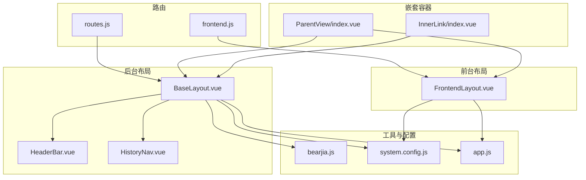
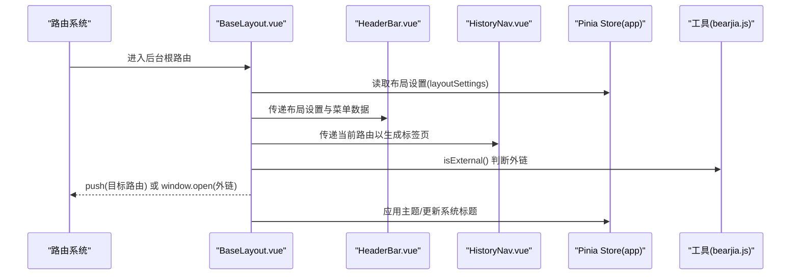
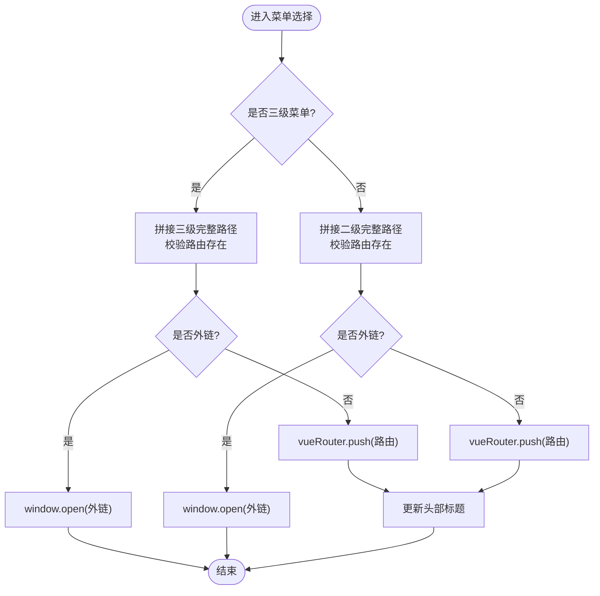
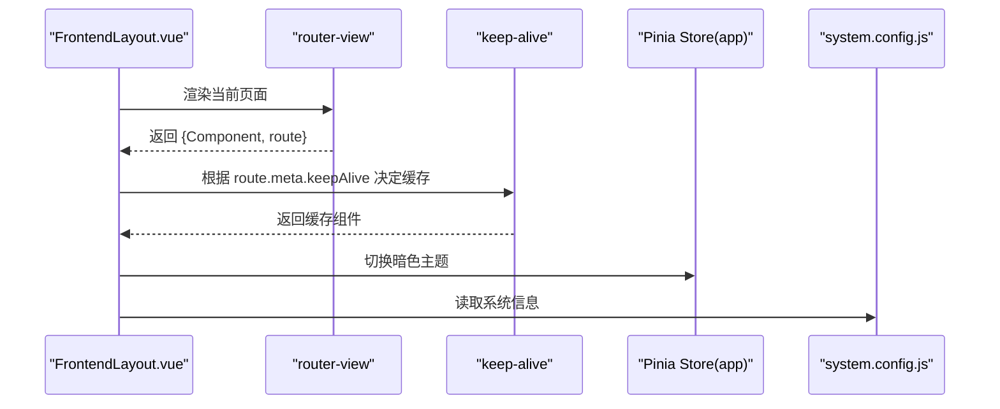
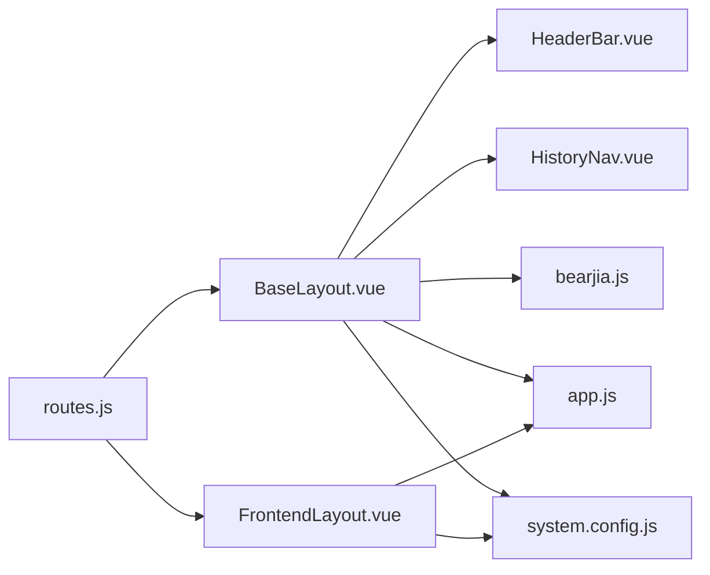

# 布局适配

<cite>
**本文档引用的文件**
- [BaseLayout.vue](file://bear-jia-vue3/src/layout/BaseLayout.vue)
- [FrontendLayout.vue](file://bear-jia-vue3/src/layout/FrontendLayout.vue)
- [ParentView/index.vue](file://bear-jia-vue3/src/layout/ParentView/index.vue)
- [InnerLink/index.vue](file://bear-jia-vue3/src/layout/InnerLink/index.vue)
- [routes.js](file://bear-jia-vue3/src/router/routes.js)
- [frontend.js](file://bear-jia-vue3/src/router/frontend.js)
- [HeaderBar.vue](file://bear-jia-vue3/src/components/layout/HeaderBar.vue)
- [HistoryNav.vue](file://bear-jia-vue3/src/components/layout/HistoryNav.vue)
- [bearjia.js](file://bear-jia-vue3/src/utils/bearjia.js)
- [app.js](file://bear-jia-vue3/src/stores/app.js)
- [system.config.js](file://bear-jia-vue3/src/config/system.config.js)
</cite>

## 目录
1. [简介](#简介)
2. [项目结构](#项目结构)
3. [核心组件](#核心组件)
4. [架构总览](#架构总览)
5. [详细组件分析](#详细组件分析)
6. [依赖关系分析](#依赖关系分析)
7. [性能考量](#性能考量)
8. [故障排查指南](#故障排查指南)
9. [结论](#结论)
10. [附录](#附录)

## 简介
本文件围绕后台与前台两类布局组件，系统性解析布局适配机制：
- 后台主布局 BaseLayout.vue：支持侧边栏、顶部菜单、混合布局、分栏布局、抽屉布局五种导航模式，集成顶部导航、历史标签页、设置抽屉等模块，并通过路由元信息驱动页面标题与标签页标题。
- 前台布局 FrontendLayout.vue：面向对外网站场景，提供简洁的顶部导航、可缓存页面切换、回到顶部等特性。
- 父级路由容器 ParentView/index.vue：用于多级嵌套路由的父级容器，承载子路由视图。
- 外链容器 InnerLink/index.vue：通过 iframe 或动态组件方式嵌入外部链接页面。
- 路由与配置：通过路由配置与系统配置，实现按需选择布局、动态标题与主题。

## 项目结构
后台与前台布局位于 src/layout 下，配套组件位于 src/components/layout；路由配置位于 src/router；系统配置与主题配置位于 src/config 与 src/stores。

图表来源
- [BaseLayout.vue](file://bear-jia-vue3/src/layout/BaseLayout.vue#L1-L260)
- [FrontendLayout.vue](file://bear-jia-vue3/src/layout/FrontendLayout.vue#L1-L145)
- [routes.js](file://bear-jia-vue3/src/router/routes.js#L1-L100)
- [frontend.js](file://bear-jia-vue3/src/router/frontend.js#L1-L80)
- [HeaderBar.vue](file://bear-jia-vue3/src/components/layout/HeaderBar.vue#L1-L163)
- [HistoryNav.vue](file://bear-jia-vue3/src/components/layout/HistoryNav.vue#L1-L120)
- [bearjia.js](file://bear-jia-vue3/src/utils/bearjia.js#L1-L10)
- [system.config.js](file://bear-jia-vue3/src/config/system.config.js#L1-L150)
- [app.js](file://bear-jia-vue3/src/stores/app.js#L1-L120)
- [ParentView/index.vue](file://bear-jia-vue3/src/layout/ParentView/index.vue#L1-L4)
- [InnerLink/index.vue](file://bear-jia-vue3/src/layout/InnerLink/index.vue#L1-L25)

章节来源
- [routes.js](file://bear-jia-vue3/src/router/routes.js#L1-L100)
- [frontend.js](file://bear-jia-vue3/src/router/frontend.js#L1-L80)

## 核心组件
- BaseLayout.vue：后台主布局，负责根据布局设置切换多种导航模式，集成顶部导航、历史标签页、设置抽屉、国际化与主题应用、导航守卫与菜单跳转逻辑。
- FrontendLayout.vue：前台布局，提供顶部导航、页面切换过渡与缓存、回到顶部、暗色主题切换与后台入口。
- ParentView/index.vue：父级路由容器，仅透传 router-view，便于多级嵌套路由。
- InnerLink/index.vue：外链容器，通过 iframe 嵌入外部链接，支持动态高度计算。

章节来源
- [BaseLayout.vue](file://bear-jia-vue3/src/layout/BaseLayout.vue#L1-L260)
- [FrontendLayout.vue](file://bear-jia-vue3/src/layout/FrontendLayout.vue#L1-L145)
- [ParentView/index.vue](file://bear-jia-vue3/src/layout/ParentView/index.vue#L1-L4)
- [InnerLink/index.vue](file://bear-jia-vue3/src/layout/InnerLink/index.vue#L1-L25)

## 架构总览
后台布局采用“布局容器 + 多种导航模式 + 顶部导航 + 历史标签页”的组合，通过 store 管理布局设置与主题，通过路由元信息驱动页面标题与标签页标题。前台布局采用“顶部导航 + 页面切换 + 缓存 + 回到顶部”的轻量结构。

图表来源
- [BaseLayout.vue](file://bear-jia-vue3/src/layout/BaseLayout.vue#L260-L800)
- [HeaderBar.vue](file://bear-jia-vue3/src/components/layout/HeaderBar.vue#L1-L163)
- [HistoryNav.vue](file://bear-jia-vue3/src/components/layout/HistoryNav.vue#L1-L120)
- [bearjia.js](file://bear-jia-vue3/src/utils/bearjia.js#L1-L10)
- [app.js](file://bear-jia-vue3/src/stores/app.js#L1-L120)

## 详细组件分析

### BaseLayout.vue：后台主布局
- 结构与模式
  - 通过布局设置决定渲染侧边栏、顶部菜单、混合布局、分栏布局、抽屉布局五种模式，分别挂载不同的菜单组件与头部组件。
  - 在每种模式下，均包含顶部导航 HeaderBar 与历史标签 HistoryNav，保证一致的顶部交互体验。
- 顶部导航 HeaderBar
  - 根据布局设置切换侧边栏折叠按钮、抽屉菜单按钮、顶部菜单或混合顶部菜单。
  - 提供搜索、消息、聊天、全屏、刷新、设置、用户下拉等能力。
- 历史标签 HistoryNav
  - 监听路由变化，动态生成标签页列表，支持滚动、刷新、关闭当前、关闭其他、关闭全部等操作。
  - 标题优先从菜单树匹配，其次从路由 meta.title，最后回退为“未知页面”。
- 菜单与跳转
  - 支持二级与三级菜单点击，自动拼接完整路径并校验路由是否存在。
  - 对外链使用 window.open 新窗口打开；对内页使用 vue-router.push。
- 导航守卫与错误处理
  - beforeEach 校验目标路由是否存在于已注册路由中，不存在则跳转 404。
  - 错误统一弹窗提示，避免白屏。
- 主题与国际化
  - 应用 store 中的主题设置，设置页面标题，支持暗色主题与色弱模式。
- 抽屉布局样式修复
  - 在抽屉模式下，通过 nextTick 修正主容器与内容区域背景色，确保视觉一致性。

图表来源
- [BaseLayout.vue](file://bear-jia-vue3/src/layout/BaseLayout.vue#L592-L730)
- [bearjia.js](file://bear-jia-vue3/src/utils/bearjia.js#L1-L10)

章节来源
- [BaseLayout.vue](file://bear-jia-vue3/src/layout/BaseLayout.vue#L1-L260)
- [BaseLayout.vue](file://bear-jia-vue3/src/layout/BaseLayout.vue#L260-L800)
- [HeaderBar.vue](file://bear-jia-vue3/src/components/layout/HeaderBar.vue#L1-L163)
- [HistoryNav.vue](file://bear-jia-vue3/src/components/layout/HistoryNav.vue#L1-L120)
- [bearjia.js](file://bear-jia-vue3/src/utils/bearjia.js#L1-L10)
- [app.js](file://bear-jia-vue3/src/stores/app.js#L1-L120)
- [system.config.js](file://bear-jia-vue3/src/config/system.config.js#L1-L150)

### FrontendLayout.vue：前台页面布局
- 顶部导航
  - 固定头部，支持主题切换、后台入口跳转、移动端菜单。
  - 导航菜单项来源于静态配置，支持移动端折叠与展开。
- 页面切换与缓存
  - 使用 <router-view> slot 与 <keep-alive> 结合 route.meta.keepAlive 控制页面缓存。
  - 通过过渡动画 page-fade 实现页面切换效果。
- 底部与回到顶部
  - 底部包含公司信息、快速链接与联系信息，支持回到顶部按钮。
- 主题与系统信息
  - 通过 app.store 更新暗色主题设置，读取系统配置 SYSTEM_INFO。

图表来源
- [FrontendLayout.vue](file://bear-jia-vue3/src/layout/FrontendLayout.vue#L1-L145)
- [system.config.js](file://bear-jia-vue3/src/config/system.config.js#L1-L150)
- [app.js](file://bear-jia-vue3/src/stores/app.js#L1-L120)

章节来源
- [FrontendLayout.vue](file://bear-jia-vue3/src/layout/FrontendLayout.vue#L1-L145)
- [system.config.js](file://bear-jia-vue3/src/config/system.config.js#L1-L150)
- [app.js](file://bear-jia-vue3/src/stores/app.js#L1-L120)

### ParentView/index.vue：父级路由容器
- 作用
  - 作为多级嵌套路由的父级容器，内部仅包含一个 router-view，用于承载子路由页面。
- 适用场景
  - 当某路由下包含多级子路由时，使用 ParentView 作为中间层，简化路由层级与命名空间。

章节来源
- [ParentView/index.vue](file://bear-jia-vue3/src/layout/ParentView/index.vue#L1-L4)

### InnerLink/index.vue：外链容器
- 作用
  - 通过 iframe 嵌入外部链接页面，支持动态高度计算，适配不同屏幕尺寸。
- 实现要点
  - 接收 src 与 iframeId 两个 props，动态计算高度为窗口可视高度减去固定偏移。
  - 适合在后台布局中作为子路由组件使用，承载第三方页面。

章节来源
- [InnerLink/index.vue](file://bear-jia-vue3/src/layout/InnerLink/index.vue#L1-L25)

## 依赖关系分析
- 路由与布局
  - 后台根路由 /home 指向 BaseLayout.vue，其 children 中的页面均在 BaseLayout 内渲染。
  - 前台路由 /frontend 指向 FrontendLayout.vue，其 children 中的页面在前台布局内渲染。
- 组件依赖
  - BaseLayout 依赖 HeaderBar、HistoryNav、SettingDrawer、图标组件与工具函数 isExternal。
  - FrontendLayout 依赖 app.store 与 system.config。
- 配置与主题
  - app.store 管理 layoutSettings 与 systemConfig，影响 BaseLayout 与 FrontendLayout 的外观与行为。
  - system.config 提供系统信息与默认配置，FrontendLayout 读取 SYSTEM_INFO。

图表来源
- [routes.js](file://bear-jia-vue3/src/router/routes.js#L1-L100)
- [frontend.js](file://bear-jia-vue3/src/router/frontend.js#L1-L80)
- [BaseLayout.vue](file://bear-jia-vue3/src/layout/BaseLayout.vue#L1-L260)
- [FrontendLayout.vue](file://bear-jia-vue3/src/layout/FrontendLayout.vue#L1-L145)
- [HeaderBar.vue](file://bear-jia-vue3/src/components/layout/HeaderBar.vue#L1-L163)
- [HistoryNav.vue](file://bear-jia-vue3/src/components/layout/HistoryNav.vue#L1-L120)
- [bearjia.js](file://bear-jia-vue3/src/utils/bearjia.js#L1-L10)
- [app.js](file://bear-jia-vue3/src/stores/app.js#L1-L120)
- [system.config.js](file://bear-jia-vue3/src/config/system.config.js#L1-L150)

章节来源
- [routes.js](file://bear-jia-vue3/src/router/routes.js#L1-L100)
- [frontend.js](file://bear-jia-vue3/src/router/frontend.js#L1-L80)
- [app.js](file://bear-jia-vue3/src/stores/app.js#L1-L120)

## 性能考量
- 路由懒加载
  - 路由与页面组件均采用动态导入，减少首屏体积，提升加载速度。
- 页面缓存
  - FrontendLayout 使用 keep-alive 与 route.meta.keepAlive 控制缓存，减少重复渲染。
- 标签页管理
  - HistoryNav 限制历史记录数量，避免内存占用过高；滚动到激活标签，减少 DOM 操作。
- 主题与样式
  - 通过 store 应用主题，避免频繁 DOM 操作；抽屉模式下通过 nextTick 一次性修正背景色，降低重排风险。

[本节为通用建议，无需列出具体文件来源]

## 故障排查指南
- 路由跳转失败
  - 现象：点击菜单无反应或报错。
  - 排查：确认目标路由是否存在于已注册路由表；检查 isExternal 判断是否误判为外链；查看导航守卫是否拦截。
  - 参考
    - [BaseLayout.vue](file://bear-jia-vue3/src/layout/BaseLayout.vue#L449-L470)
    - [BaseLayout.vue](file://bear-jia-vue3/src/layout/BaseLayout.vue#L617-L730)
    - [bearjia.js](file://bear-jia-vue3/src/utils/bearjia.js#L1-L10)
- 标题不显示或显示“未知页面”
  - 现象：标签页标题异常。
  - 排查：确认菜单树是否正确；确认路由 meta.title 是否设置；等待菜单加载完成后再生成标题。
  - 参考
    - [HistoryNav.vue](file://bear-jia-vue3/src/components/layout/HistoryNav.vue#L88-L129)
- 抽屉布局背景色异常
  - 现象：抽屉模式下内容区域背景色不正确。
  - 排查：确认是否触发 fixDrawerLayoutStyles；检查暗色主题类是否正确应用。
  - 参考
    - [BaseLayout.vue](file://bear-jia-vue3/src/layout/BaseLayout.vue#L508-L535)
- 前台页面未缓存
  - 现象：切换页面后重新渲染。
  - 排查：确认 route.meta.keepAlive 是否为 true；确认 keep-alive include 是否包含当前页面 name。
  - 参考
    - [FrontendLayout.vue](file://bear-jia-vue3/src/layout/FrontendLayout.vue#L178-L190)

章节来源
- [BaseLayout.vue](file://bear-jia-vue3/src/layout/BaseLayout.vue#L449-L470)
- [BaseLayout.vue](file://bear-jia-vue3/src/layout/BaseLayout.vue#L508-L535)
- [BaseLayout.vue](file://bear-jia-vue3/src/layout/BaseLayout.vue#L617-L730)
- [HistoryNav.vue](file://bear-jia-vue3/src/components/layout/HistoryNav.vue#L88-L129)
- [FrontendLayout.vue](file://bear-jia-vue3/src/layout/FrontendLayout.vue#L178-L190)
- [bearjia.js](file://bear-jia-vue3/src/utils/bearjia.js#L1-L10)

## 结论
该布局体系通过“后台主布局 + 前台布局 + 父级容器 + 外链容器”的组合，实现了灵活的导航模式与页面承载能力。后台布局以 store 与路由元信息为核心，统一管理标题、标签页与主题；前台布局强调简洁与可缓存的页面切换。ParentView 与 InnerLink 则分别满足多级嵌套与外链嵌入的场景需求。整体具备良好的扩展性与维护性。

[本节为总结，无需列出具体文件来源]

## 附录

### 布局切换最佳实践
- 动态选择布局组件
  - 通过路由 meta 指定布局类型（如 layout: 'frontend'），在路由守卫或顶层布局中根据 meta 切换 BaseLayout 或 FrontendLayout。
  - 参考
    - [routes.js](file://bear-jia-vue3/src/router/routes.js#L1-L100)
    - [frontend.js](file://bear-jia-vue3/src/router/frontend.js#L1-L80)
- 样式隔离方案
  - 使用 CSS 变量与主题服务统一管理颜色与字体；在抽屉模式下通过 nextTick 修正背景色，避免跨组件污染。
  - 参考
    - [BaseLayout.vue](file://bear-jia-vue3/src/layout/BaseLayout.vue#L358-L390)
    - [app.js](file://bear-jia-vue3/src/stores/app.js#L66-L118)

章节来源
- [routes.js](file://bear-jia-vue3/src/router/routes.js#L1-L100)
- [frontend.js](file://bear-jia-vue3/src/router/frontend.js#L1-L80)
- [BaseLayout.vue](file://bear-jia-vue3/src/layout/BaseLayout.vue#L358-L390)
- [app.js](file://bear-jia-vue3/src/stores/app.js#L66-L118)