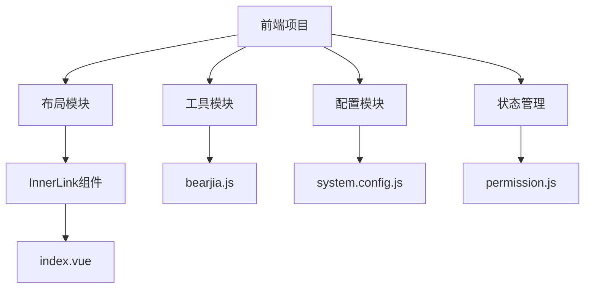
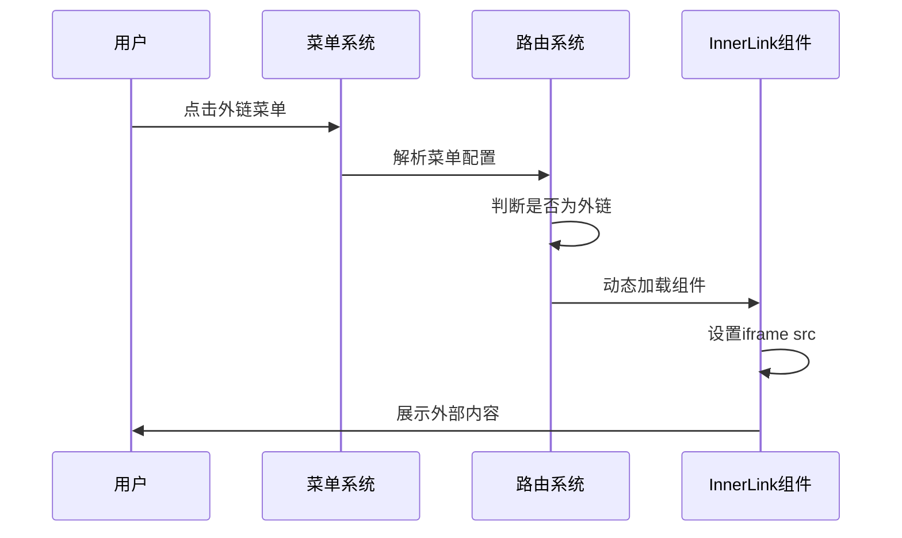
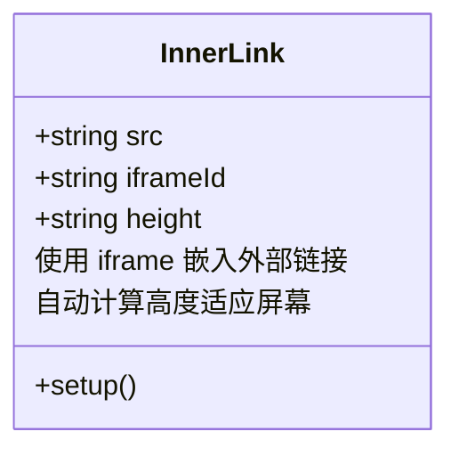
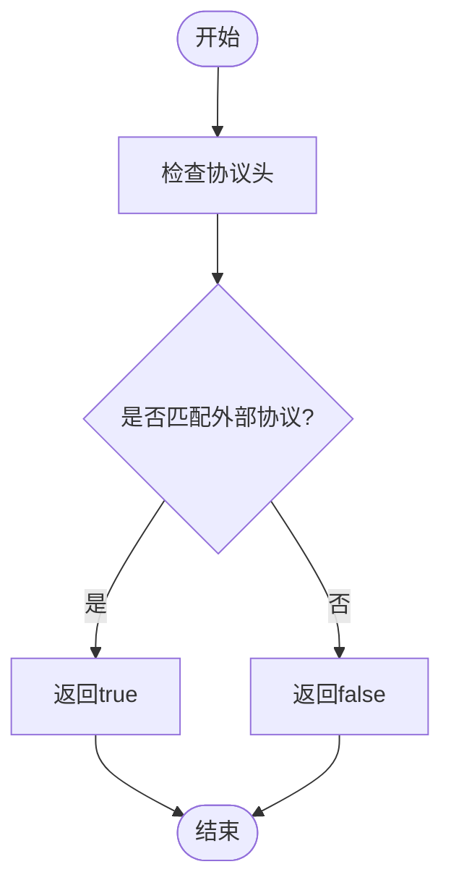
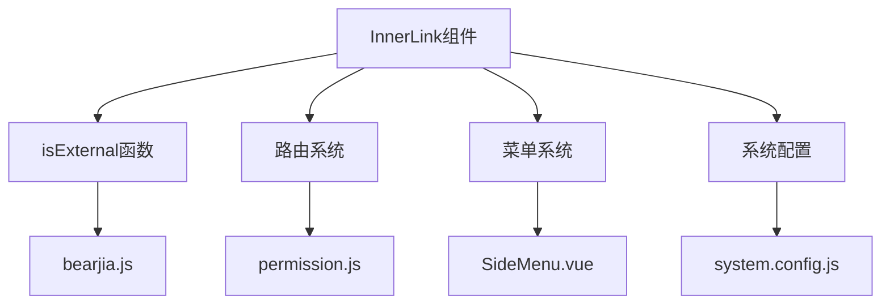

# InnerLink组件

<cite>
**本文档引用的文件**   
- [index.vue](file://bear-jia-vue3\src\layout\InnerLink\index.vue)
- [bearjia.js](file://bear-jia-vue3\src\utils\bearjia.js)
- [system.config.js](file://bear-jia-vue3\src\config\system.config.js)
- [permission.js](file://bear-jia-vue3\src\stores\permission.js)
- [SideMenu.vue](file://bear-jia-vue3\src\components\layout\SideMenu.vue)
- [UserConstants.java](file://bearjia-admin-backend\src\main\java\com\javaxiaobear\base\common\constant\UserConstants.java)
- [SysMenuServiceImpl.java](file://bearjia-admin-backend\src\main\java\com\javaxiaobear\module\system\service\impl\SysMenuServiceImpl.java)
</cite>

## 目录
1. [简介](#简介)
2. [项目结构](#项目结构)
3. [核心组件](#核心组件)
4. [架构概述](#架构概述)
5. [详细组件分析](#详细组件分析)
6. [依赖分析](#依赖分析)
7. [性能考虑](#性能考虑)
8. [故障排除指南](#故障排除指南)
9. [结论](#结论)

## 简介
InnerLink组件是BearJia管理系统中的一个重要功能组件，用于在系统内部安全地嵌入外部链接页面。该组件通过iframe方式实现外部内容的展示，支持灵活的配置和高度的安全性控制。组件主要用于集成第三方应用、文档预览、外部系统对接等场景，为用户提供无缝的跨系统访问体验。通过与后端菜单系统的紧密配合，InnerLink实现了外链页面的统一管理和安全访问控制。

## 项目结构
InnerLink组件位于系统的布局模块中，作为独立的布局组件被路由系统动态加载。该组件的实现遵循Vue3的组合式API规范，采用简洁的单文件组件结构。

**图示来源**
- [index.vue](file://bear-jia-vue3\src\layout\InnerLink\index.vue)
- [bearjia.js](file://bear-jia-vue3\src\utils\bearjia.js)
- [system.config.js](file://bear-jia-vue3\src\config\system.config.js)

**本节来源**
- [index.vue](file://bear-jia-vue3\src\layout\InnerLink\index.vue)
- [bearjia.js](file://bear-jia-vue3\src\utils\bearjia.js)

## 核心组件
InnerLink组件的核心功能是通过iframe嵌入外部链接页面，实现外部内容在系统内部的安全展示。组件接收src属性作为外部链接地址，自动计算高度以适应不同屏幕尺寸。该组件不包含动态组件加载模式，仅通过iframe方式实现外部链接的嵌入。组件的设计重点在于安全性和兼容性，通过与系统的外链判断机制配合，确保只有合法的外部链接才能被加载。

**本节来源**
- [index.vue](file://bear-jia-vue3\src\layout\InnerLink\index.vue)
- [bearjia.js](file://bear-jia-vue3\src\utils\bearjia.js)

## 架构概述
InnerLink组件在整个系统架构中扮演着外部内容集成的角色。当用户访问配置为外链的菜单项时，系统会动态加载InnerLink组件，并将外部链接地址传递给该组件进行展示。

**图示来源**
- [index.vue](file://bear-jia-vue3\src\layout\InnerLink\index.vue)
- [permission.js](file://bear-jia-vue3\src\stores\permission.js)
- [SideMenu.vue](file://bear-jia-vue3\src\components\layout\SideMenu.vue)

## 详细组件分析

### InnerLink组件分析
InnerLink组件是一个简单的布局组件，其主要功能是创建一个全屏的iframe容器来展示外部链接内容。组件通过props接收src属性作为外部链接地址，并自动计算高度以适应当前视口。

#### 组件实现

**图示来源**
- [index.vue](file://bear-jia-vue3\src\layout\InnerLink\index.vue)

**本节来源**
- [index.vue](file://bear-jia-vue3\src\layout\InnerLink\index.vue)

### 外链判断机制
系统通过isExternal函数判断链接是否为外部链接，该函数使用正则表达式检测链接是否以http:、https:、mailto:或tel:开头。

**图示来源**
- [bearjia.js](file://bear-jia-vue3\src\utils\bearjia.js)

**本节来源**
- [bearjia.js](file://bear-jia-vue3\src\utils\bearjia.js)

## 依赖分析
InnerLink组件与其他系统模块存在紧密的依赖关系，这些依赖确保了组件能够正确地集成到整个系统中。

**图示来源**
- [index.vue](file://bear-jia-vue3\src\layout\InnerLink\index.vue)
- [bearjia.js](file://bear-jia-vue3\src\utils\bearjia.js)
- [permission.js](file://bear-jia-vue3\src\stores\permission.js)

**本节来源**
- [index.vue](file://bear-jia-vue3\src\layout\InnerLink\index.vue)
- [bearjia.js](file://bear-jia-vue3\src\utils\bearjia.js)
- [permission.js](file://bear-jia-vue3\src\stores\permission.js)

## 性能考虑
InnerLink组件的性能主要受iframe加载的外部内容影响。由于组件本身非常轻量，性能优化的重点在于外部链接的选择和加载策略。建议优先选择响应速度快、资源占用少的外部服务。对于大型外部应用，可以考虑添加加载状态提示，提升用户体验。同时，应避免在同一页面中嵌入多个InnerLink组件，以防止页面性能下降。

## 故障排除指南
当InnerLink组件无法正常工作时，可以从以下几个方面进行排查：首先检查外部链接地址是否正确，确保链接以http:、https:等协议开头；其次确认浏览器是否阻止了iframe的加载，特别是当外部链接与当前系统跨域时；最后检查网络连接是否正常，确保能够访问外部链接。对于CORS问题，需要外部服务端配置正确的跨域策略。

**本节来源**
- [index.vue](file://bear-jia-vue3\src\layout\InnerLink\index.vue)
- [bearjia.js](file://bear-jia-vue3\src\utils\bearjia.js)

## 结论
InnerLink组件通过简单的iframe机制实现了外部链接的安全嵌入，为系统集成第三方服务提供了便利。组件设计简洁，依赖清晰，与系统的菜单和路由系统紧密配合，实现了外链页面的统一管理。虽然目前仅支持iframe嵌入模式，但其稳定性和兼容性表现良好。未来可以考虑增加动态组件加载模式，提供更多样化的集成方式。同时，加强安全策略，如CSP配置和沙箱隔离，将进一步提升组件的安全性。