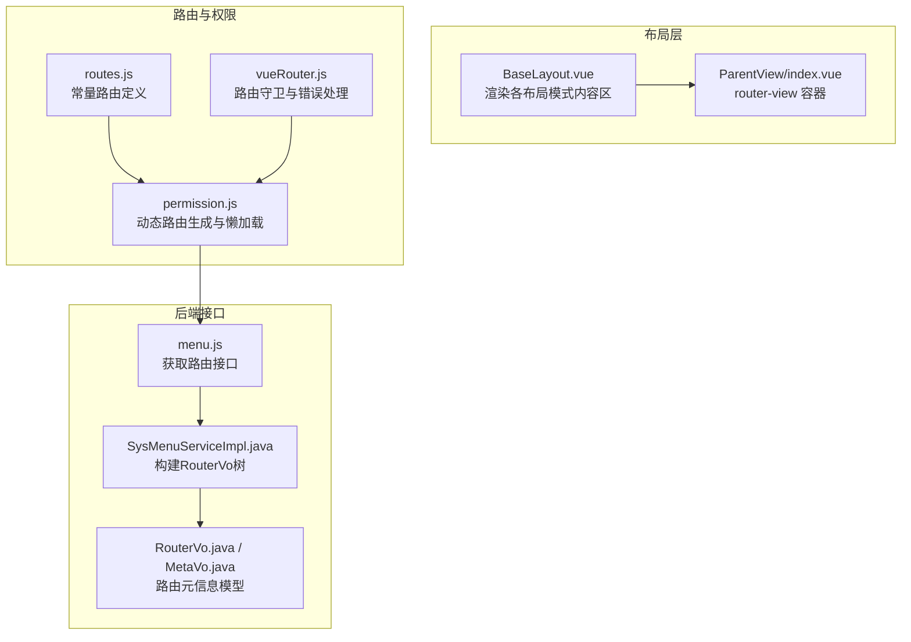
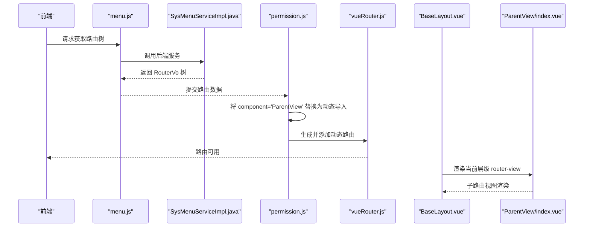
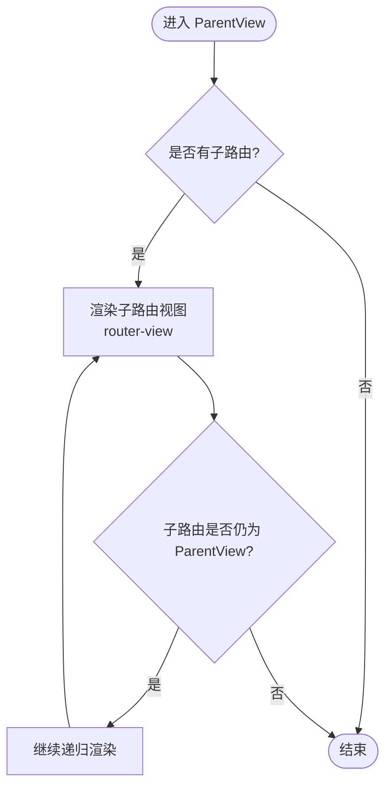
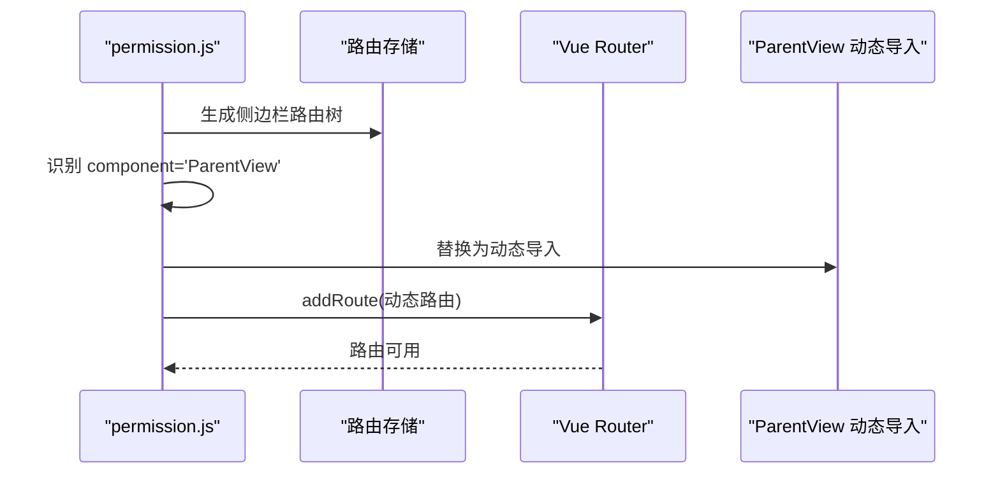
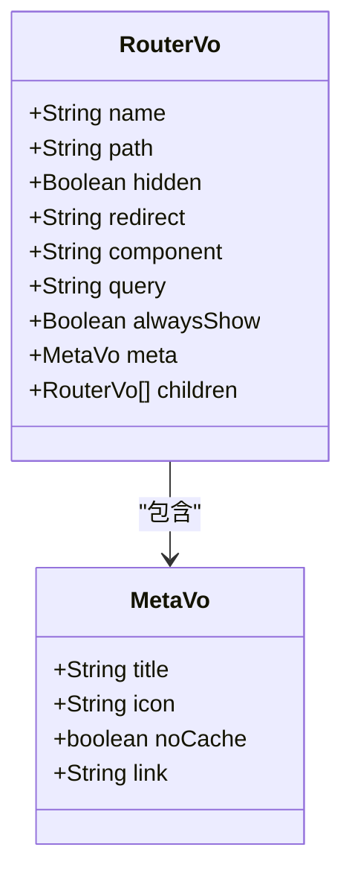
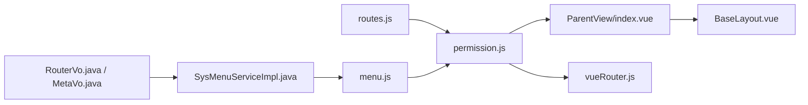

# ParentView组件

<cite>
**本文引用的文件**
- [index.vue](file://bear-jia-vue3/src/layout/ParentView/index.vue)
- [permission.js](file://bear-jia-vue3/src/stores/permission.js)
- [BaseLayout.vue](file://bear-jia-vue3/src/layout/BaseLayout.vue)
- [routes.js](file://bear-jia-vue3/src/router/routes.js)
- [vueRouter.js](file://bear-jia-vue3/src/router/vueRouter.js)
- [menu.js](file://bear-jia-vue3/src/api/system/menu.js)
- [SysMenuServiceImpl.java](file://bearjia-admin-backend/src/main/java/com/javaxiaobear/module/system/service/impl/SysMenuServiceImpl.java)
- [RouterVo.java](file://bearjia-admin-backend/src/main/java/com/javaxiaobear/module/system/domain/vo/RouterVo.java)
- [MetaVo.java](file://bearjia-admin-backend/src/main/java/com/javaxiaobear/module/system/domain/vo/MetaVo.java)
- [performance.js](file://bear-jia-vue3/src/utils/performance.js)
- [tagsView.js](file://bear-jia-vue3/src/stores/tagsView.js)
</cite>

## 目录
1. [简介](#简介)
2. [项目结构](#项目结构)
3. [核心组件](#核心组件)
4. [架构总览](#架构总览)
5. [详细组件分析](#详细组件分析)
6. [依赖关系分析](#依赖关系分析)
7. [性能考量](#性能考量)
8. [故障排查指南](#故障排查指南)
9. [结论](#结论)
10. [附录](#附录)

## 简介
ParentView 是一个极简的多级嵌套路由容器组件，仅包含一个 router-view 插槽，用于承载当前路由层级的视图内容。它本身不直接渲染任何 UI，而是作为“占位容器”配合 BaseLayout 和动态路由体系，实现无限层级菜单的嵌套渲染与导航。其核心价值在于：
- 以递归方式承接子路由，天然支持任意深度的嵌套。
- 与动态路由加载机制结合，实现按需加载与路径拼接。
- 通过路由元信息（meta）驱动菜单标题、图标、缓存策略等行为。

## 项目结构
ParentView 位于布局层，通常作为某一层路由的“父容器”，由 BaseLayout 在不同布局模式下注入到内容区；同时，权限与路由生成模块会将 ParentView 组件名映射为动态导入，从而实现懒加载与递归渲染。

图表来源
- [BaseLayout.vue](file://bear-jia-vue3/src/layout/BaseLayout.vue#L1-L120)
- [index.vue](file://bear-jia-vue3/src/layout/ParentView/index.vue#L1-L4)
- [routes.js](file://bear-jia-vue3/src/router/routes.js#L1-L100)
- [vueRouter.js](file://bear-jia-vue3/src/router/vueRouter.js#L73-L129)
- [permission.js](file://bear-jia-vue3/src/stores/permission.js#L80-L179)
- [menu.js](file://bear-jia-vue3/src/api/system/menu.js#L1-L10)
- [SysMenuServiceImpl.java](file://bearjia-admin-backend/src/main/java/com/javaxiaobear/module/system/service/impl/SysMenuServiceImpl.java#L173-L214)
- [RouterVo.java](file://bearjia-admin-backend/src/main/java/com/javaxiaobear/module/system/domain/vo/RouterVo.java#L60-L148)
- [MetaVo.java](file://bearjia-admin-backend/src/main/java/com/javaxiaobear/module/system/domain/vo/MetaVo.java#L1-L62)

章节来源
- [BaseLayout.vue](file://bear-jia-vue3/src/layout/BaseLayout.vue#L1-L120)
- [index.vue](file://bear-jia-vue3/src/layout/ParentView/index.vue#L1-L4)
- [routes.js](file://bear-jia-vue3/src/router/routes.js#L1-L100)
- [permission.js](file://bear-jia-vue3/src/stores/permission.js#L80-L179)
- [menu.js](file://bear-jia-vue3/src/api/system/menu.js#L1-L10)
- [SysMenuServiceImpl.java](file://bearjia-admin-backend/src/main/java/com/javaxiaobear/module/system/service/impl/SysMenuServiceImpl.java#L173-L214)
- [RouterVo.java](file://bearjia-admin-backend/src/main/java/com/javaxiaobear/module/system/domain/vo/RouterVo.java#L60-L148)
- [MetaVo.java](file://bearjia-admin-backend/src/main/java/com/javaxiaobear/module/system/domain/vo/MetaVo.java#L1-L62)

## 核心组件
- ParentView/index.vue：仅包含一个 router-view，作为当前路由层级的渲染出口。
- BaseLayout.vue：在不同布局模式下渲染内容区，内部包含 router-view，ParentView 作为其子路由容器出现。
- permission.js：负责将后端返回的路由树转换为前端可加载的路由表，并对 ParentView 组件名进行动态导入。
- routes.js：定义常量路由，部分路由指向 BaseLayout，其 children 中可包含 ParentView 作为父容器。
- vueRouter.js：路由守卫与错误处理，确保动态路由生成后正确挂载。
- menu.js：前端调用后端接口获取路由树。
- SysMenuServiceImpl.java：将数据库菜单树转换为 RouterVo 树，其中包含 component、meta、children 等字段。
- RouterVo.java / MetaVo.java：后端路由元信息模型，前端通过 permission.js 读取并消费。

章节来源
- [index.vue](file://bear-jia-vue3/src/layout/ParentView/index.vue#L1-L4)
- [BaseLayout.vue](file://bear-jia-vue3/src/layout/BaseLayout.vue#L1-L120)
- [permission.js](file://bear-jia-vue3/src/stores/permission.js#L80-L179)
- [routes.js](file://bear-jia-vue3/src/router/routes.js#L1-L100)
- [vueRouter.js](file://bear-jia-vue3/src/router/vueRouter.js#L73-L129)
- [menu.js](file://bear-jia-vue3/src/api/system/menu.js#L1-L10)
- [SysMenuServiceImpl.java](file://bearjia-admin-backend/src/main/java/com/javaxiaobear/module/system/service/impl/SysMenuServiceImpl.java#L173-L214)
- [RouterVo.java](file://bearjia-admin-backend/src/main/java/com/javaxiaobear/module/system/domain/vo/RouterVo.java#L60-L148)
- [MetaVo.java](file://bearjia-admin-backend/src/main/java/com/javaxiaobear/module/system/domain/vo/MetaVo.java#L1-L62)

## 架构总览
ParentView 的作用是“容器+递归入口”。当后端返回的路由树中某个节点的 component 字段为 ParentView 时，permission.js 会将其替换为动态导入，从而实现懒加载。随后，BaseLayout 在不同布局模式下渲染内容区，ParentView 作为 router-view 的父容器，承载当前层级的子路由视图，形成无限层级嵌套。

图表来源
- [menu.js](file://bear-jia-vue3/src/api/system/menu.js#L1-L10)
- [SysMenuServiceImpl.java](file://bearjia-admin-backend/src/main/java/com/javaxiaobear/module/system/service/impl/SysMenuServiceImpl.java#L173-L214)
- [permission.js](file://bear-jia-vue3/src/stores/permission.js#L80-L179)
- [vueRouter.js](file://bear-jia-vue3/src/router/vueRouter.js#L73-L129)
- [BaseLayout.vue](file://bear-jia-vue3/src/layout/BaseLayout.vue#L1-L120)
- [index.vue](file://bear-jia-vue3/src/layout/ParentView/index.vue#L1-L4)

## 详细组件分析

### ParentView 组件分析
- 组件职责：作为当前路由层级的渲染容器，仅包含一个 router-view，用于承载子路由视图。
- 递归机制：由于 ParentView 本身不改变路由层级，它天然支持无限层级嵌套。当某一层的 children 中再次出现 ParentView 时，即可继续向下递归。
- 与 BaseLayout 的关系：BaseLayout 在不同布局模式下渲染内容区，ParentView 作为其子路由容器出现，承载当前层级视图。
- 与动态路由的关系：permission.js 将后端 component='ParentView' 的节点替换为动态导入，从而实现懒加载与递归渲染。

图表来源
- [index.vue](file://bear-jia-vue3/src/layout/ParentView/index.vue#L1-L4)
- [BaseLayout.vue](file://bear-jia-vue3/src/layout/BaseLayout.vue#L1-L120)
- [permission.js](file://bear-jia-vue3/src/stores/permission.js#L80-L179)

章节来源
- [index.vue](file://bear-jia-vue3/src/layout/ParentView/index.vue#L1-L4)
- [BaseLayout.vue](file://bear-jia-vue3/src/layout/BaseLayout.vue#L1-L120)
- [permission.js](file://bear-jia-vue3/src/stores/permission.js#L80-L179)

### 动态路由加载与 ParentView 的关键作用
- ParentView 组件名在 permission.js 中被识别并替换为动态导入，实现按需加载。
- 路由树扁平化与路径拼接：当某节点 component='ParentView' 且存在 children 时，permission.js 会对 children 的 path 进行拼接，确保最终生成的路由路径正确。
- 路由懒加载：permission.js 提供 loadView 函数，结合动态导入实现组件懒加载。

图表来源
- [permission.js](file://bear-jia-vue3/src/stores/permission.js#L80-L179)
- [permission.js](file://bear-jia-vue3/src/stores/permission.js#L170-L264)

章节来源
- [permission.js](file://bear-jia-vue3/src/stores/permission.js#L80-L179)
- [permission.js](file://bear-jia-vue3/src/stores/permission.js#L170-L264)

### 路由元信息传递与处理
- 后端 RouterVo 包含 meta 字段，包含 title、icon、noCache、link 等信息。
- 前端 permission.js 在生成路由时读取 meta 并传递给路由配置。
- BaseLayout 在不同布局模式下使用 meta.title 与 meta.icon 渲染菜单标题与图标。

图表来源
- [RouterVo.java](file://bearjia-admin-backend/src/main/java/com/javaxiaobear/module/system/domain/vo/RouterVo.java#L60-L148)
- [MetaVo.java](file://bearjia-admin-backend/src/main/java/com/javaxiaobear/module/system/domain/vo/MetaVo.java#L1-L62)

章节来源
- [SysMenuServiceImpl.java](file://bearjia-admin-backend/src/main/java/com/javaxiaobear/module/system/service/impl/SysMenuServiceImpl.java#L173-L214)
- [RouterVo.java](file://bearjia-admin-backend/src/main/java/com/javaxiaobear/module/system/domain/vo/RouterVo.java#L60-L148)
- [MetaVo.java](file://bearjia-admin-backend/src/main/java/com/javaxiaobear/module/system/domain/vo/MetaVo.java#L1-L62)
- [BaseLayout.vue](file://bear-jia-vue3/src/layout/BaseLayout.vue#L1-L120)

### API 与使用要点
- 组件无 props：ParentView 仅包含一个 router-view，无需额外 props。
- 插槽：无具名插槽，仅使用默认插槽（router-view）。
- 事件：无自定义事件。
- 实际应用示例（路径参考）：
  - 在常量路由中，ParentView 作为某路由的 children 容器，承载后续子路由视图。
  - 在动态路由生成时，component='ParentView' 的节点会被替换为动态导入，实现懒加载与递归渲染。
  - 在 BaseLayout 的不同布局模式下，内容区会渲染当前层级的 router-view，ParentView 作为其父容器出现。

章节来源
- [index.vue](file://bear-jia-vue3/src/layout/ParentView/index.vue#L1-L4)
- [routes.js](file://bear-jia-vue3/src/router/routes.js#L1-L100)
- [permission.js](file://bear-jia-vue3/src/stores/permission.js#L80-L179)
- [BaseLayout.vue](file://bear-jia-vue3/src/layout/BaseLayout.vue#L1-L120)

## 依赖关系分析
- ParentView 依赖于 Vue Router 的 router-view，作为当前层级的渲染出口。
- BaseLayout 依赖 ParentView 作为内容区的父容器，配合不同布局模式渲染。
- permission.js 依赖后端返回的 RouterVo 树，将 ParentView 组件名替换为动态导入。
- vueRouter.js 依赖 permission.js 生成的动态路由，负责路由挂载与守卫。
- menu.js 依赖后端服务，提供路由树数据。
- SysMenuServiceImpl.java 依赖数据库菜单数据，构建 RouterVo 树并填充 meta 信息。

图表来源
- [index.vue](file://bear-jia-vue3/src/layout/ParentView/index.vue#L1-L4)
- [BaseLayout.vue](file://bear-jia-vue3/src/layout/BaseLayout.vue#L1-L120)
- [permission.js](file://bear-jia-vue3/src/stores/permission.js#L80-L179)
- [routes.js](file://bear-jia-vue3/src/router/routes.js#L1-L100)
- [vueRouter.js](file://bear-jia-vue3/src/router/vueRouter.js#L73-L129)
- [menu.js](file://bear-jia-vue3/src/api/system/menu.js#L1-L10)
- [SysMenuServiceImpl.java](file://bearjia-admin-backend/src/main/java/com/javaxiaobear/module/system/service/impl/SysMenuServiceImpl.java#L173-L214)
- [RouterVo.java](file://bearjia-admin-backend/src/main/java/com/javaxiaobear/module/system/domain/vo/RouterVo.java#L60-L148)
- [MetaVo.java](file://bearjia-admin-backend/src/main/java/com/javaxiaobear/module/system/domain/vo/MetaVo.java#L1-L62)

章节来源
- [index.vue](file://bear-jia-vue3/src/layout/ParentView/index.vue#L1-L4)
- [BaseLayout.vue](file://bear-jia-vue3/src/layout/BaseLayout.vue#L1-L120)
- [permission.js](file://bear-jia-vue3/src/stores/permission.js#L80-L179)
- [routes.js](file://bear-jia-vue3/src/router/routes.js#L1-L100)
- [vueRouter.js](file://bear-jia-vue3/src/router/vueRouter.js#L73-L129)
- [menu.js](file://bear-jia-vue3/src/api/system/menu.js#L1-L10)
- [SysMenuServiceImpl.java](file://bearjia-admin-backend/src/main/java/com/javaxiaobear/module/system/service/impl/SysMenuServiceImpl.java#L173-L214)
- [RouterVo.java](file://bearjia-admin-backend/src/main/java/com/javaxiaobear/module/system/domain/vo/RouterVo.java#L60-L148)
- [MetaVo.java](file://bearjia-admin-backend/src/main/java/com/javaxiaobear/module/system/domain/vo/MetaVo.java#L1-L62)

## 性能考量
- 路由懒加载：通过动态导入实现 ParentView 的按需加载，减少首屏体积。
- 组件懒加载：permission.js 的 loadView 与动态导入结合，进一步降低初始包体。
- 虚拟滚动与防抖节流：performance.js 提供虚拟滚动与防抖节流工具，可用于页面内复杂列表的性能优化。
- 资源预加载：performance.js 提供资源预加载能力，可在路由切换前预热关键资源。
- 标签页缓存：tagsView.js 提供标签页缓存与清理策略，避免不必要的组件重建。
- 内存泄漏检测：performance.js 提供内存泄漏检测工具，在开发环境定期监测内存增长。

章节来源
- [permission.js](file://bear-jia-vue3/src/stores/permission.js#L170-L264)
- [performance.js](file://bear-jia-vue3/src/utils/performance.js#L1-L179)
- [tagsView.js](file://bear-jia-vue3/src/stores/tabsView.js#L51-L106)

## 故障排查指南
- 路由无法匹配：检查 permission.js 中的路径拼接逻辑，确认 ParentView 的 children 路径是否正确拼接。
- 外链无法打开：确认 isExternal 判断逻辑与 BaseLayout 的外链处理分支。
- 路由错误：查看 vueRouter.js 的错误处理与通知提示。
- 菜单标题/图标不显示：确认后端 RouterVo.meta 是否正确填充，以及 BaseLayout 是否正确读取 meta.title 与 meta.icon。
- 页面刷新异常：检查 BaseLayout 中的刷新逻辑与 tagsView 缓存策略。

章节来源
- [permission.js](file://bear-jia-vue3/src/stores/permission.js#L142-L248)
- [BaseLayout.vue](file://bear-jia-vue3/src/layout/BaseLayout.vue#L592-L730)
- [vueRouter.js](file://bear-jia-vue3/src/router/vueRouter.js#L101-L129)
- [SysMenuServiceImpl.java](file://bearjia-admin-backend/src/main/java/com/javaxiaobear/module/system/service/impl/SysMenuServiceImpl.java#L173-L214)

## 结论
ParentView 通过极简的设计实现了多级嵌套路由容器的核心功能：以 router-view 为载体，承接子路由视图，天然支持无限层级嵌套。配合 permission.js 的动态导入与路径拼接、BaseLayout 的布局渲染、以及后端 RouterVo 的元信息模型，ParentView 成为系统菜单与路由体系的关键一环。在性能方面，通过懒加载、缓存与预加载等策略，能够在保证用户体验的同时控制资源消耗。

## 附录
- ParentView 组件文件路径：[index.vue](file://bear-jia-vue3/src/layout/ParentView/index.vue#L1-L4)
- 动态路由生成与 ParentView 替换：[permission.js](file://bear-jia-vue3/src/stores/permission.js#L80-L179)
- 路由懒加载与路径拼接：[permission.js](file://bear-jia-vue3/src/stores/permission.js#L142-L248)
- 常量路由定义（包含 ParentView 的使用场景）：[routes.js](file://bear-jia-vue3/src/router/routes.js#L1-L100)
- 路由守卫与错误处理：[vueRouter.js](file://bear-jia-vue3/src/router/vueRouter.js#L73-L129)
- 获取路由树接口：[menu.js](file://bear-jia-vue3/src/api/system/menu.js#L1-L10)
- 后端路由元信息模型：[RouterVo.java](file://bearjia-admin-backend/src/main/java/com/javaxiaobear/module/system/domain/vo/RouterVo.java#L60-L148)、[MetaVo.java](file://bearjia-admin-backend/src/main/java/com/javaxiaobear/module/system/domain/vo/MetaVo.java#L1-L62)
- 菜单树构建与 meta 填充：[SysMenuServiceImpl.java](file://bearjia-admin-backend/src/main/java/com/javaxiaobear/module/system/service/impl/SysMenuServiceImpl.java#L173-L214)
- 性能优化工具：[performance.js](file://bear-jia-vue3/src/utils/performance.js#L1-L179)
- 标签页缓存策略：[tagsView.js](file://bear-jia-vue3/src/stores/tabsView.js#L51-L106)