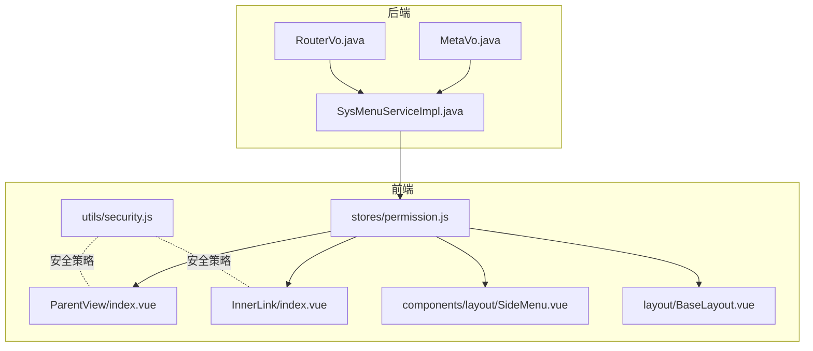
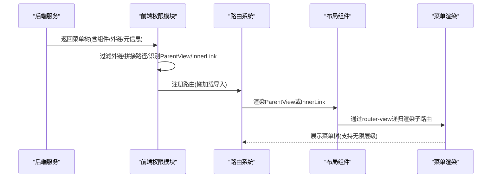
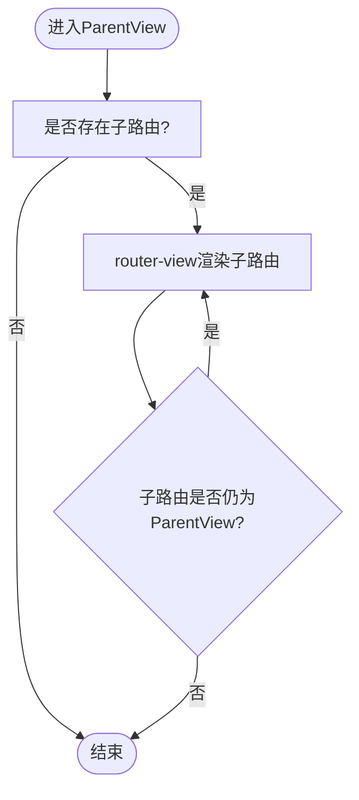
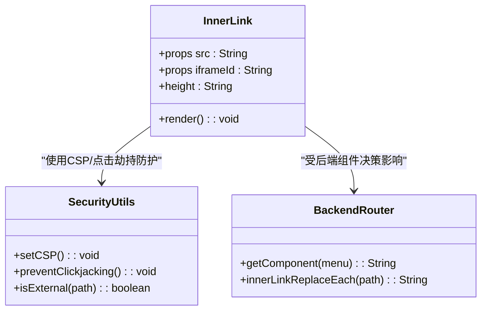
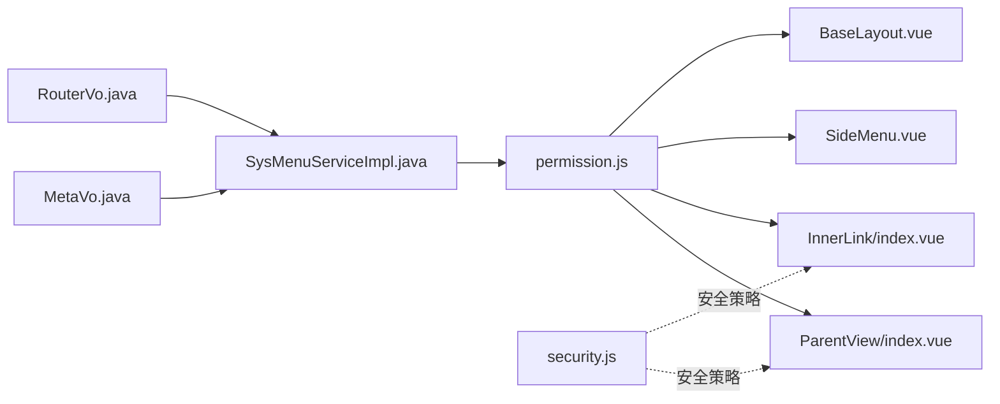

# 特殊布局组件

<cite>
**本文引用的文件**
- [ParentView/index.vue](file://bear-jia-vue3/src/layout/ParentView/index.vue)
- [InnerLink/index.vue](file://bear-jia-vue3/src/layout/InnerLink/index.vue)
- [permission.js](file://bear-jia-vue3/src/stores/permission.js)
- [routes.js](file://bear-jia-vue3/src/router/routes.js)
- [SideMenu.vue](file://bear-jia-vue3/src/components/layout/SideMenu.vue)
- [BaseLayout.vue](file://bear-jia-vue3/src/layout/BaseLayout.vue)
- [security.js](file://bear-jia-vue3/src/utils/security.js)
- [SysMenuServiceImpl.java](file://bearjia-admin-backend/src/main/java/com/javaxiaobear/module/system/service/impl/SysMenuServiceImpl.java)
- [MetaVo.java](file://bearjia-admin-backend/src/main/java/com/javaxiaobear/module/system/domain/vo/MetaVo.java)
- [RouterVo.java](file://bearjia-admin-backend/src/main/java/com/javaxiaobear/module/system/domain/vo/RouterVo.java)
</cite>

## 目录
1. [引言](#引言)
2. [项目结构](#项目结构)
3. [核心组件](#核心组件)
4. [架构总览](#架构总览)
5. [组件深度解析](#组件深度解析)
6. [依赖关系分析](#依赖关系分析)
7. [性能考量](#性能考量)
8. [故障排查指南](#故障排查指南)
9. [结论](#结论)

## 引言
本文件聚焦于两个特殊布局组件：ParentView.vue 与 InnerLink.vue。前者作为多级嵌套路由容器，通过递归渲染实现无限层级菜单嵌套；后者用于嵌入外部链接页面，支持 iframe 与动态组件两种模式，并提供安全策略与最佳实践。本文将从系统架构、数据流、处理逻辑、集成点、错误处理与性能特性等方面进行深入剖析，并给出实际使用案例与排障建议。

## 项目结构
- ParentView 与 InnerLink 均位于前端工程的 layout 目录下，作为路由容器与外部链接承载组件。
- 路由与权限过滤逻辑集中在 stores/permission.js 中，负责将后端返回的菜单树转换为前端可用的路由表，并对 ParentView 与 InnerLink 进行特殊处理。
- 菜单渲染组件 SideMenu.vue 与 BaseLayout.vue 负责菜单树的可视化与布局承载。
- 后端服务 SysMenuServiceImpl.java 根据菜单类型与属性决定组件与路由路径，MetaVo.java 与 RouterVo.java 提供路由元信息的数据模型。

图表来源
- [ParentView/index.vue](file://bear-jia-vue3/src/layout/ParentView/index.vue#L1-L4)
- [InnerLink/index.vue](file://bear-jia-vue3/src/layout/InnerLink/index.vue#L1-L25)
- [permission.js](file://bear-jia-vue3/src/stores/permission.js#L80-L103)
- [SideMenu.vue](file://bear-jia-vue3/src/components/layout/SideMenu.vue#L37-L111)
- [BaseLayout.vue](file://bear-jia-vue3/src/layout/BaseLayout.vue#L134-L157)
- [SysMenuServiceImpl.java](file://bearjia-admin-backend/src/main/java/com/javaxiaobear/module/system/service/impl/SysMenuServiceImpl.java#L375-L415)
- [MetaVo.java](file://bearjia-admin-backend/src/main/java/com/javaxiaobear/module/system/domain/vo/MetaVo.java#L1-L106)
- [RouterVo.java](file://bearjia-admin-backend/src/main/java/com/javaxiaobear/module/system/domain/vo/RouterVo.java#L60-L148)

章节来源
- [routes.js](file://bear-jia-vue3/src/router/routes.js#L1-L100)
- [permission.js](file://bear-jia-vue3/src/stores/permission.js#L80-L103)

## 核心组件
- ParentView：作为多级嵌套路由容器，仅负责渲染当前层级的子路由视图，配合权限过滤与路径拼接实现无限层级菜单嵌套。
- InnerLink：用于嵌入外部链接页面，支持 iframe 与动态组件两种模式，提供高度自适应与安全策略。

章节来源
- [ParentView/index.vue](file://bear-jia-vue3/src/layout/ParentView/index.vue#L1-L4)
- [InnerLink/index.vue](file://bear-jia-vue3/src/layout/InnerLink/index.vue#L1-L25)

## 架构总览
前端通过 stores/permission.js 将后端菜单树转换为前端路由表，ParentView 与 InnerLink 在此过程中被识别并以懒加载方式导入。菜单渲染由 SideMenu.vue 与 BaseLayout.vue 完成，MetaVo.java 与 RouterVo.java 提供元信息模型，SysMenuServiceImpl.java 决定组件与路由路径。

图表来源
- [permission.js](file://bear-jia-vue3/src/stores/permission.js#L80-L103)
- [routes.js](file://bear-jia-vue3/src/router/routes.js#L1-L100)
- [ParentView/index.vue](file://bear-jia-vue3/src/layout/ParentView/index.vue#L1-L4)
- [SideMenu.vue](file://bear-jia-vue3/src/components/layout/SideMenu.vue#L37-L111)
- [BaseLayout.vue](file://bear-jia-vue3/src/layout/BaseLayout.vue#L134-L157)
- [SysMenuServiceImpl.java](file://bearjia-admin-backend/src/main/java/com/javaxiaobear/module/system/service/impl/SysMenuServiceImpl.java#L375-L415)
- [MetaVo.java](file://bearjia-admin-backend/src/main/java/com/javaxiaobear/module/system/domain/vo/MetaVo.java#L1-L106)
- [RouterVo.java](file://bearjia-admin-backend/src/main/java/com/javaxiaobear/module/system/domain/vo/RouterVo.java#L60-L148)

## 组件深度解析

### ParentView.vue：多级嵌套路由容器与无限层级菜单
- 作用定位
  - 作为多级嵌套路由的容器，通过 router-view 递归渲染当前层级的子路由视图，实现无限层级菜单嵌套。
  - 在权限过滤阶段，ParentView 会被识别并以懒加载方式导入，确保按需加载。
- 递归渲染机制
  - 由于 ParentView 仅包含一个 router-view，子路由会自动在其内部渲染，形成天然的递归结构。
  - 路由路径拼接与外链过滤由 stores/permission.js 完成，避免无效路径与外链进入路由表。
- 动态路由加载与元信息传递
  - stores/permission.js 在构建路由时，对 component 字段进行映射：'ParentView' -> '@/layout/ParentView/index.vue，从而实现动态懒加载。
  - 菜单元信息（如 title、icon、noCache、link）来自后端 MetaVo.java 与 RouterVo.java，经 SysMenuServiceImpl.java 决策后传入前端路由 meta 字段，供菜单与标签页使用。
- 实际使用场景
  - 适用于目录型菜单的无限层级嵌套，例如“工作台”下的多级子菜单。
  - 与 BaseLayout.vue、SideMenu.vue 协作，完成菜单树的可视化与导航。

图表来源
- [ParentView/index.vue](file://bear-jia-vue3/src/layout/ParentView/index.vue#L1-L4)
- [permission.js](file://bear-jia-vue3/src/stores/permission.js#L80-L103)
- [BaseLayout.vue](file://bear-jia-vue3/src/layout/BaseLayout.vue#L134-L157)

章节来源
- [ParentView/index.vue](file://bear-jia-vue3/src/layout/ParentView/index.vue#L1-L4)
- [permission.js](file://bear-jia-vue3/src/stores/permission.js#L80-L103)
- [routes.js](file://bear-jia-vue3/src/router/routes.js#L1-L100)
- [SysMenuServiceImpl.java](file://bearjia-admin-backend/src/main/java/com/javaxiaobear/module/system/service/impl/SysMenuServiceImpl.java#L375-L415)
- [MetaVo.java](file://bearjia-admin-backend/src/main/java/com/javaxiaobear/module/system/domain/vo/MetaVo.java#L1-L106)
- [RouterVo.java](file://bearjia-admin-backend/src/main/java/com/javaxiaobear/module/system/domain/vo/RouterVo.java#L60-L148)

### InnerLink.vue：外部链接嵌入与两种模式对比
- 作用定位
  - 用于嵌入外部链接页面，支持两种模式：
    - iframe 模式：通过 iframe 直接加载外部 URL，适合第三方站点或文档。
    - 动态组件模式：通过动态组件加载指定组件路径，适合内嵌业务页面。
- 属性与行为
  - 支持 src 与 iframeId 属性，默认 src 为根路径。
  - 计算高度为浏览器可视区域高度减去固定值，保证全屏适配。
- 两种模式对比
  - iframe 模式
    - 优点：简单直接，可快速接入任意外部站点。
    - 缺点：跨域限制、样式隔离弱、SEO 不友好、性能开销较大。
  - 动态组件模式
    - 优点：与主应用同源，样式与交互一致，性能更好，利于 SEO。
    - 缺点：需遵循主应用组件规范，无法直接加载任意外部站点。
- 安全策略
  - CSP：前端通过 utils/security.js 设置 Content-Security-Policy，限制 frame-ancestors、script-src、style-src 等，降低 XSS 与点击劫持风险。
  - 点击劫持防护：通过 preventClickjacking 防止页面被嵌入到其他站点。
  - 外链识别：isExternalLink 与 isExternal 用于识别外链，避免将外链路由注册到前端路由表中。
  - 后端决策：SysMenuServiceImpl.java 根据菜单类型与 isInnerLink/isMenuFrame 决定组件为 LAYOUT/INNER_LINK/PARENT_VIEW，确保外链与内嵌页面正确分流。
- 实际使用案例
  - 集成第三方应用：当菜单类型为外链且 isFrame 为是时，后端返回组件为 INNER_LINK，前端通过 InnerLink 渲染 iframe 加载外部站点。
  - 集成文档：当菜单类型为目录且 isFrame 为否时，后端返回组件为 LAYOUT，前端通过 BaseLayout 渲染菜单与页面；若为菜单且 isFrame 为是，则返回根路径，由前端统一处理。

图表来源
- [InnerLink/index.vue](file://bear-jia-vue3/src/layout/InnerLink/index.vue#L1-L25)
- [security.js](file://bear-jia-vue3/src/utils/security.js#L129-L144)
- [SysMenuServiceImpl.java](file://bearjia-admin-backend/src/main/java/com/javaxiaobear/module/system/service/impl/SysMenuServiceImpl.java#L375-L415)

章节来源
- [InnerLink/index.vue](file://bear-jia-vue3/src/layout/InnerLink/index.vue#L1-L25)
- [security.js](file://bear-jia-vue3/src/utils/security.js#L129-L144)
- [SysMenuServiceImpl.java](file://bearjia-admin-backend/src/main/java/com/javaxiaobear/module/system/service/impl/SysMenuServiceImpl.java#L375-L415)

## 依赖关系分析
- 组件耦合与协作
  - ParentView 与 InnerLink 均依赖 stores/permission.js 的路由懒加载与外链过滤逻辑。
  - 菜单渲染组件 SideMenu.vue 与 BaseLayout.vue 依赖路由表与元信息，实现无限层级菜单可视化。
  - 后端服务 SysMenuServiceImpl.java 决定组件类型与路由路径，MetaVo.java 与 RouterVo.java 提供元信息模型。
- 外链识别与路径拼接
  - isExternalLink 与 isExternal 用于识别外链，避免外链进入前端路由表。
  - stores/permission.js 在构建路由时对 ParentView 子节点进行路径拼接，去除多余斜杠，保证路由层级正确。
- 潜在循环依赖
  - 前端路由与菜单渲染相互依赖，但通过 stores/permission.js 的集中处理避免了循环引用问题。
- 外部依赖与集成点
  - CSP、点击劫持防护等安全策略由 utils/security.js 提供。
  - 后端菜单树与组件决策由 Java 服务层提供。

图表来源
- [permission.js](file://bear-jia-vue3/src/stores/permission.js#L80-L103)
- [ParentView/index.vue](file://bear-jia-vue3/src/layout/ParentView/index.vue#L1-L4)
- [InnerLink/index.vue](file://bear-jia-vue3/src/layout/InnerLink/index.vue#L1-L25)
- [SideMenu.vue](file://bear-jia-vue3/src/components/layout/SideMenu.vue#L37-L111)
- [BaseLayout.vue](file://bear-jia-vue3/src/layout/BaseLayout.vue#L134-L157)
- [SysMenuServiceImpl.java](file://bearjia-admin-backend/src/main/java/com/javaxiaobear/module/system/service/impl/SysMenuServiceImpl.java#L375-L415)
- [MetaVo.java](file://bearjia-admin-backend/src/main/java/com/javaxiaobear/module/system/domain/vo/MetaVo.java#L1-L106)
- [RouterVo.java](file://bearjia-admin-backend/src/main/java/com/javaxiaobear/module/system/domain/vo/RouterVo.java#L60-L148)
- [security.js](file://bear-jia-vue3/src/utils/security.js#L129-L144)

章节来源
- [permission.js](file://bear-jia-vue3/src/stores/permission.js#L80-L103)
- [security.js](file://bear-jia-vue3/src/utils/security.js#L129-L144)

## 性能考量
- 路由懒加载
  - stores/permission.js 使用 import.meta.glob 预加载视图组件，并通过 loadView 动态映射组件路径，减少首屏体积，提升加载速度。
- 组件缓存与标签页
  - tagsView.js 提供访问历史与缓存视图的管理，支持删除其他/全部视图，避免缓存膨胀导致内存压力。
- 虚拟滚动与防抖节流
  - utils/performance.js 提供虚拟滚动与防抖节流工具，可在复杂列表场景中优化渲染性能。
- iframe 性能
  - iframe 模式存在额外的上下文切换与资源开销，建议在必要时使用动态组件模式以获得更佳性能。

章节来源
- [permission.js](file://bear-jia-vue3/src/stores/permission.js#L178-L191)
- [tagsView.js](file://bear-jia-vue3/src/stores/tagsView.js#L51-L106)
- [performance.js](file://bear-jia-vue3/src/utils/performance.js#L1-L178)

## 故障排查指南
- 外链未生效
  - 检查 isExternalLink 与 isExternal 是否正确识别外链路径。
  - 确认后端 SysMenuServiceImpl.java 的 getComponent 逻辑是否返回 INNER_LINK 或 LAYOUT。
- 路由层级异常
  - 检查 stores/permission.js 的路径拼接逻辑，确保去除多余斜杠且 ParentView 子节点路径正确拼接。
- iframe 嵌入失败
  - 检查 CSP 策略与 frame-ancestors 设置，确认目标站点允许被嵌入。
  - 使用 preventClickjacking 防护，避免被其他站点嵌入。
- 菜单渲染不正确
  - 检查 SideMenu.vue 与 BaseLayout.vue 的菜单渲染逻辑，确认 alwaysShow 与 children.length 的分支处理。

章节来源
- [permission.js](file://bear-jia-vue3/src/stores/permission.js#L76-L103)
- [SysMenuServiceImpl.java](file://bearjia-admin-backend/src/main/java/com/javaxiaobear/module/system/service/impl/SysMenuServiceImpl.java#L375-L415)
- [security.js](file://bear-jia-vue3/src/utils/security.js#L129-L144)
- [SideMenu.vue](file://bear-jia-vue3/src/components/layout/SideMenu.vue#L37-L111)
- [BaseLayout.vue](file://bear-jia-vue3/src/layout/BaseLayout.vue#L134-L157)

## 结论
ParentView 与 InnerLink 分别承担了“无限层级嵌套容器”与“外部链接嵌入”的职责。通过 stores/permission.js 的集中路由处理、后端 SysMenuServiceImpl.java 的组件决策与元信息模型，系统实现了灵活的菜单体系与安全的外链集成。在实际使用中，应优先采用动态组件模式以获得更好的性能与安全性，必要时再使用 iframe 模式，并严格遵循 CSP 与点击劫持防护策略。