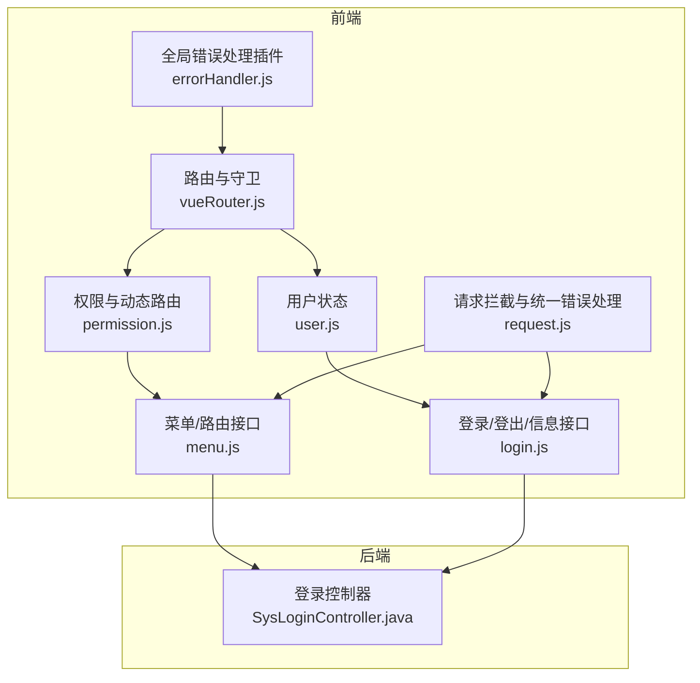
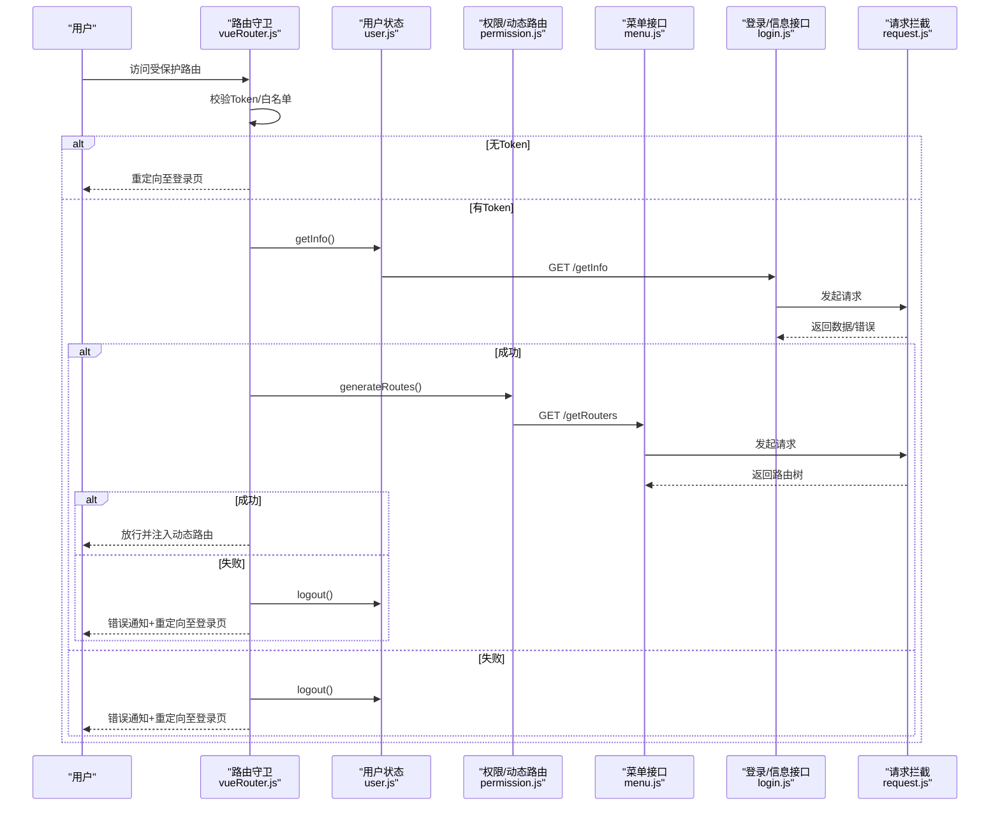
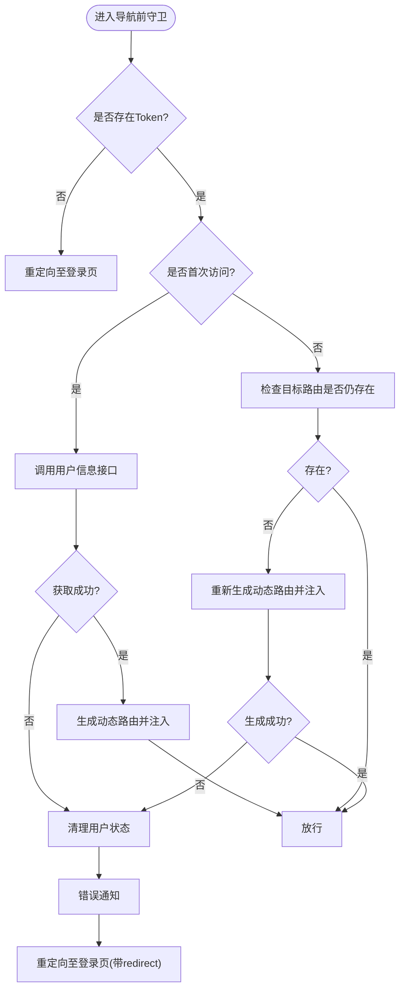
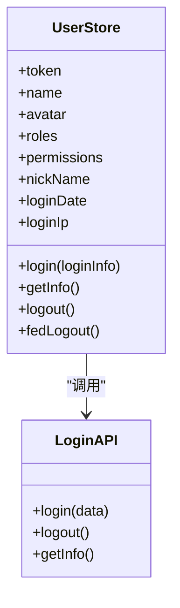
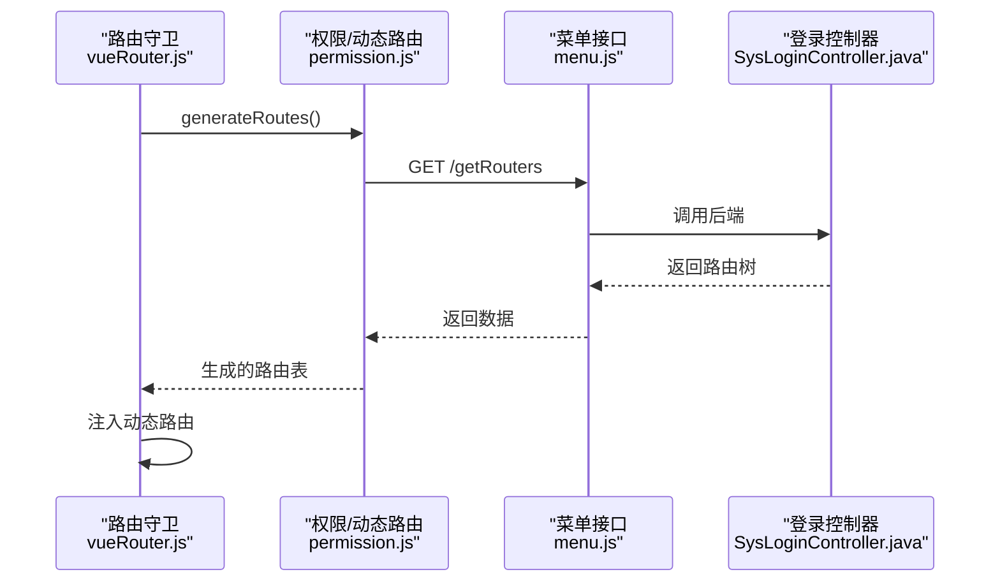
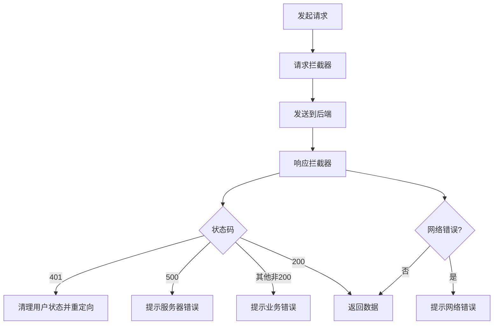
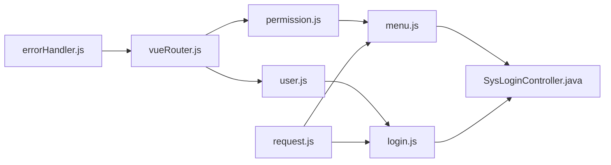

# 异常处理

<cite>
**本文引用的文件**
- [vueRouter.js](file://bear-jia-vue3/src/router/vueRouter.js)
- [user.js](file://bear-jia-vue3/src/stores/user.js)
- [permission.js](file://bear-jia-vue3/src/stores/permission.js)
- [menu.js](file://bear-jia-vue3/src/api/system/menu.js)
- [login.js](file://bear-jia-vue3/src/api/login.js)
- [request.js](file://bear-jia-vue3/src/utils/request.js)
- [errorHandler.js](file://bear-jia-vue3/src/plugins/errorHandler.js)
- [SysLoginController.java](file://bearjia-admin-backend/src/main/java/com/avaxiaobear/module/system/controller/SysLoginController.java)
</cite>

## 目录
1. [简介](#简介)
2. [项目结构](#项目结构)
3. [核心组件](#核心组件)
4. [架构总览](#架构总览)
5. [详细组件分析](#详细组件分析)
6. [依赖关系分析](#依赖关系分析)
7. [性能考量](#性能考量)
8. [故障排查指南](#故障排查指南)
9. [结论](#结论)

## 简介
本文件系统性阐述前端路由守卫中的异常处理机制，覆盖以下关键点：
- 在获取用户信息失败或生成路由出错时的错误捕获流程
- 错误发生后调用 userStore.logout() 清理用户状态、显示错误通知（notification.error）并重定向至登录页的处理逻辑
- router.onError() 全局错误监听器对路由加载失败的处理方式
- 页面状态保存与恢复机制（savePageState/restorePageState）在路由跳转中的应用
- 针对路由循环重定向、守卫执行阻塞等常见异常问题的解决方案

## 项目结构
围绕路由守卫与异常处理的关键文件组织如下：
- 路由与守卫：bear-jia-vue3/src/router/vueRouter.js
- 用户状态与登出：bear-jia-vue3/src/stores/user.js
- 动态路由生成：bear-jia-vue3/src/stores/permission.js
- 路由数据接口：bear-jia-vue3/src/api/system/menu.js
- 用户信息与登出接口：bear-jia-vue3/src/api/login.js
- 请求拦截与统一错误处理：bear-jia-vue3/src/utils/request.js
- 全局错误处理插件：bear-jia-vue3/src/plugins/errorHandler.js
- 后端登录与路由接口：bearjia-admin-backend/src/main/java/com/avaxiaobear/module/system/controller/SysLoginController.java

图表来源
- [vueRouter.js](file://bear-jia-vue3/src/router/vueRouter.js#L1-L129)
- [user.js](file://bear-jia-vue3/src/stores/user.js#L1-L83)
- [permission.js](file://bear-jia-vue3/src/stores/permission.js#L1-L264)
- [menu.js](file://bear-jia-vue3/src/api/system/menu.js#L1-L68)
- [login.js](file://bear-jia-vue3/src/api/login.js#L1-L56)
- [request.js](file://bear-jia-vue3/src/utils/request.js#L1-L165)
- [errorHandler.js](file://bear-jia-vue3/src/plugins/errorHandler.js#L1-L194)
- [SysLoginController.java](file://bearjia-admin-backend/src/main/java/com/avaxiaobear/module/system/controller/SysLoginController.java#L36-L86)

章节来源
- [vueRouter.js](file://bear-jia-vue3/src/router/vueRouter.js#L1-L129)

## 核心组件
- 路由守卫与全局错误监听：负责拦截导航、生成动态路由、处理异常并引导用户回到登录页
- 用户状态管理：封装登录、获取用户信息、登出等动作，并在异常时清理本地状态
- 权限与动态路由：从后端获取路由树，过滤并注入到路由器
- 请求拦截与统一错误处理：在接口层统一处理 401、500、网络错误等场景
- 全局错误处理插件：提供运行时错误、网络错误、API错误、表单验证错误的统一处理入口

章节来源
- [vueRouter.js](file://bear-jia-vue3/src/router/vueRouter.js#L1-L129)
- [user.js](file://bear-jia-vue3/src/stores/user.js#L1-L83)
- [permission.js](file://bear-jia-vue3/src/stores/permission.js#L1-L264)
- [request.js](file://bear-jia-vue3/src/utils/request.js#L1-L165)
- [errorHandler.js](file://bear-jia-vue3/src/plugins/errorHandler.js#L1-L194)

## 架构总览
路由守卫异常处理的整体流程如下：
- 导航前守卫根据是否存在 Token 决定放行或重定向
- 若无 Token，直接重定向至登录页；若有 Token，尝试获取用户信息并生成动态路由
- 若获取用户信息或生成路由失败，清理用户状态、弹出错误通知并重定向至登录页
- 路由加载失败时，router.onError() 全局监听器弹出错误通知
- 路由后置守卫负责保存/恢复页面状态（主要是滚动位置）

图表来源
- [vueRouter.js](file://bear-jia-vue3/src/router/vueRouter.js#L37-L99)
- [user.js](file://bear-jia-vue3/src/stores/user.js#L46-L81)
- [permission.js](file://bear-jia-vue3/src/stores/permission.js#L234-L261)
- [menu.js](file://bear-jia-vue3/src/api/system/menu.js#L1-L9)
- [login.js](file://bear-jia-vue3/src/api/login.js#L30-L44)
- [request.js](file://bear-jia-vue3/src/utils/request.js#L1-L165)

## 详细组件分析

### 路由守卫与全局错误监听
- 导航前守卫
  - 白名单放行，否则检查 Token
  - 若无 Token，重定向至登录页
  - 若有 Token：
    - 首次进入：调用用户信息接口，生成动态路由并注入
    - 后续进入：检测目标路由是否仍存在于路由器中，若缺失则重新生成
  - 异常处理：捕获异常后调用 userStore.logout() 清理状态，弹出错误通知，重定向至登录页（携带 redirect 参数）
- 全局错误监听
  - router.onError() 监听路由加载失败，弹出“页面加载失败”通知
- 页面状态保存与恢复
  - afterEach 中保存 from 页面滚动位置
  - 进入 to 页面时恢复滚动位置

图表来源
- [vueRouter.js](file://bear-jia-vue3/src/router/vueRouter.js#L37-L99)

章节来源
- [vueRouter.js](file://bear-jia-vue3/src/router/vueRouter.js#L1-L129)

### 用户状态与登出
- 用户信息接口
  - getInfo()：获取用户信息（包含角色、权限等），成功后写入 Pinia 状态
  - 异常时抛出错误，供守卫捕获
- 登出
  - logout()：调用后端登出接口，清除本地 token 与状态
  - fedLogout()：仅前端清理 token
- 登录
  - login()：调用后端登录接口，成功后写入 token

图表来源
- [user.js](file://bear-jia-vue3/src/stores/user.js#L1-L83)
- [login.js](file://bear-jia-vue3/src/api/login.js#L1-L56)

章节来源
- [user.js](file://bear-jia-vue3/src/stores/user.js#L1-L83)
- [login.js](file://bear-jia-vue3/src/api/login.js#L1-L56)

### 动态路由生成与后端接口
- 动态路由生成
  - generateRoutes()：从后端获取路由树，过滤外链，构建可注入的路由表
  - 将生成的路由注入到路由器
- 路由数据接口
  - getRouters()：GET /getRouters
- 后端登录与路由接口
  - SysLoginController 提供 /login、/getInfo、/getRouters 等接口

图表来源
- [permission.js](file://bear-jia-vue3/src/stores/permission.js#L234-L261)
- [menu.js](file://bear-jia-vue3/src/api/system/menu.js#L1-L9)
- [SysLoginController.java](file://bearjia-admin-backend/src/main/java/com/avaxiaobear/module/system/controller/SysLoginController.java#L36-L86)

章节来源
- [permission.js](file://bear-jia-vue3/src/stores/permission.js#L1-L264)
- [menu.js](file://bear-jia-vue3/src/api/system/menu.js#L1-L68)
- [SysLoginController.java](file://bearjia-admin-backend/src/main/java/com/avaxiaobear/module/system/controller/SysLoginController.java#L36-L86)

### 请求拦截与统一错误处理
- 请求拦截
  - 自动附加 Authorization 头
  - 白名单接口无需 Token
- 响应拦截
  - 401：触发用户登出、通知提示、中断请求
  - 500：提示服务器错误
  - 其他非 200：提示业务错误
  - 网络错误：统一提示并中断请求
- 全局错误处理插件
  - 提供网络错误、API 错误、运行时错误、表单验证错误的统一处理入口
  - 可配置是否输出日志、是否向用户展示、是否收集错误

图表来源
- [request.js](file://bear-jia-vue3/src/utils/request.js#L1-L165)
- [errorHandler.js](file://bear-jia-vue3/src/plugins/errorHandler.js#L1-L194)

章节来源
- [request.js](file://bear-jia-vue3/src/utils/request.js#L1-L165)
- [errorHandler.js](file://bear-jia-vue3/src/plugins/errorHandler.js#L1-L194)

## 依赖关系分析
- 路由守卫依赖用户状态与权限模块，权限模块依赖菜单接口，菜单接口依赖后端控制器
- 请求拦截器贯穿所有 API 调用，统一处理错误
- 全局错误处理插件提供运行时错误兜底

图表来源
- [vueRouter.js](file://bear-jia-vue3/src/router/vueRouter.js#L1-L129)
- [user.js](file://bear-jia-vue3/src/stores/user.js#L1-L83)
- [permission.js](file://bear-jia-vue3/src/stores/permission.js#L1-L264)
- [menu.js](file://bear-jia-vue3/src/api/system/menu.js#L1-L68)
- [login.js](file://bear-jia-vue3/src/api/login.js#L1-L56)
- [request.js](file://bear-jia-vue3/src/utils/request.js#L1-L165)
- [errorHandler.js](file://bear-jia-vue3/src/plugins/errorHandler.js#L1-L194)
- [SysLoginController.java](file://bearjia-admin-backend/src/main/java/com/avaxiaobear/module/system/controller/SysLoginController.java#L36-L86)

章节来源
- [vueRouter.js](file://bear-jia-vue3/src/router/vueRouter.js#L1-L129)
- [permission.js](file://bear-jia-vue3/src/stores/permission.js#L1-L264)
- [request.js](file://bear-jia-vue3/src/utils/request.js#L1-L165)

## 性能考量
- 动态路由生成仅在必要时进行，避免重复注入
- 路由后置守卫仅保存/恢复滚动位置，开销较小
- 请求拦截器对 GET 参数进行 URL 化，减少不必要的请求体构造
- 全局错误处理插件支持按需开启日志与收集，避免生产环境冗余输出

## 故障排查指南
- 获取用户信息失败
  - 现象：导航前守卫捕获异常，清理用户状态并重定向登录
  - 排查要点：确认 /getInfo 接口可达、Token 有效、后端返回格式正确
  - 参考路径：[vueRouter.js](file://bear-jia-vue3/src/router/vueRouter.js#L50-L66)、[login.js](file://bear-jia-vue3/src/api/login.js#L30-L44)
- 生成路由失败
  - 现象：导航前守卫捕获异常，清理用户状态并重定向登录
  - 排查要点：确认 /getRouters 接口可达、后端返回路由树结构正确
  - 参考路径：[vueRouter.js](file://bear-jia-vue3/src/router/vueRouter.js#L68-L89)、[permission.js](file://bear-jia-vue3/src/stores/permission.js#L234-L261)、[menu.js](file://bear-jia-vue3/src/api/system/menu.js#L1-L9)
- 路由加载失败
  - 现象：router.onError() 弹出“页面加载失败”通知
  - 排查要点：检查网络连通性、静态资源加载情况、路由懒加载组件是否存在
  - 参考路径：[vueRouter.js](file://bear-jia-vue3/src/router/vueRouter.js#L101-L108)
- 页面状态未恢复
  - 现象：切换页面后滚动位置未恢复
  - 排查要点：确认 sessionStorage 中存在对应键值、路由名称一致
  - 参考路径：[vueRouter.js](file://bear-jia-vue3/src/router/vueRouter.js#L20-L35)
- 路由循环重定向
  - 现象：登录页与目标页之间反复跳转
  - 排查要点：检查白名单、Token 有效性、重定向参数 redirect 是否正确传递
  - 参考路径：[vueRouter.js](file://bear-jia-vue3/src/router/vueRouter.js#L46-L49)
- 守卫执行阻塞
  - 现象：页面长时间卡住，NProgress 不结束
  - 排查要点：确认 getInfo/generateRoutes 未被无限等待、异常分支已调用 NProgress.done()
  - 参考路径：[vueRouter.js](file://bear-jia-vue3/src/router/vueRouter.js#L37-L99)

章节来源
- [vueRouter.js](file://bear-jia-vue3/src/router/vueRouter.js#L20-L35)
- [vueRouter.js](file://bear-jia-vue3/src/router/vueRouter.js#L37-L99)
- [vueRouter.js](file://bear-jia-vue3/src/router/vueRouter.js#L101-L108)
- [login.js](file://bear-jia-vue3/src/api/login.js#L30-L44)
- [menu.js](file://bear-jia-vue3/src/api/system/menu.js#L1-L9)
- [permission.js](file://bear-jia-vue3/src/stores/permission.js#L234-L261)

## 结论
该系统的路由守卫异常处理机制通过“导航前守卫 + 全局错误监听 + 请求拦截统一错误处理”的组合，实现了对用户信息获取失败、动态路由生成失败以及路由加载失败的闭环处理。异常发生时，系统会清理用户状态、提示错误并引导用户回到登录页，保证用户体验与系统稳定性。页面状态保存与恢复机制进一步提升了用户体验。针对常见异常问题，建议优先检查接口可达性、Token 有效性与路由注入时机，确保守卫流程正常结束。