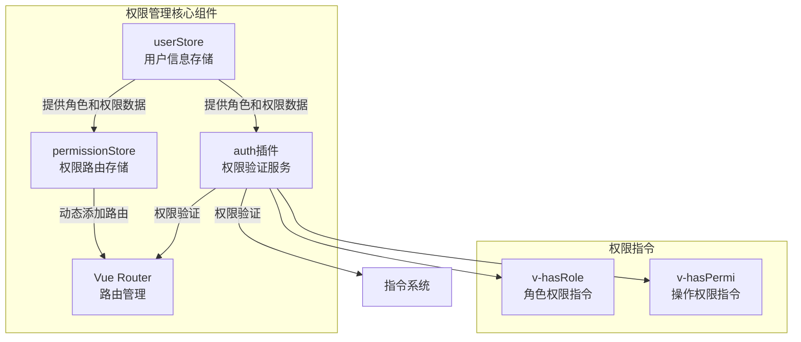
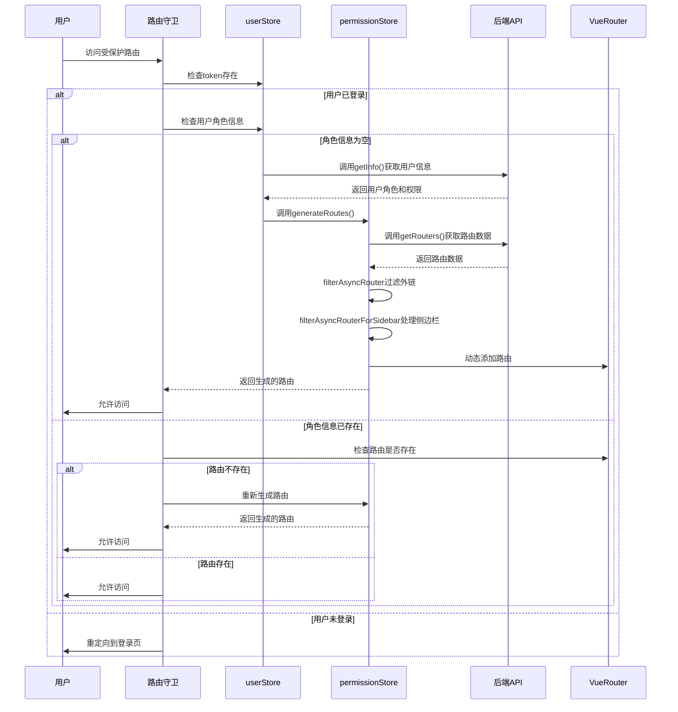
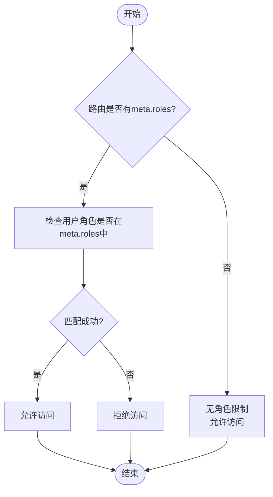
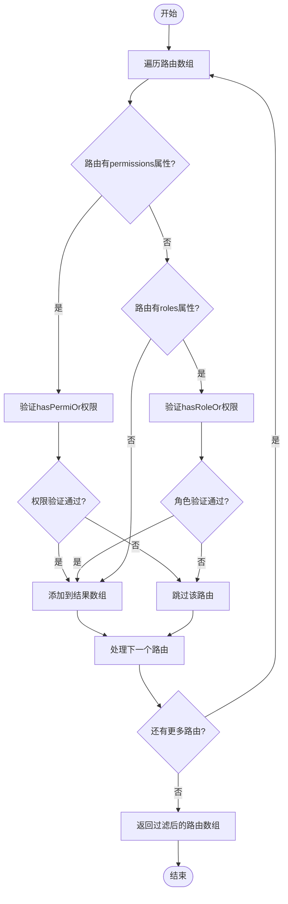
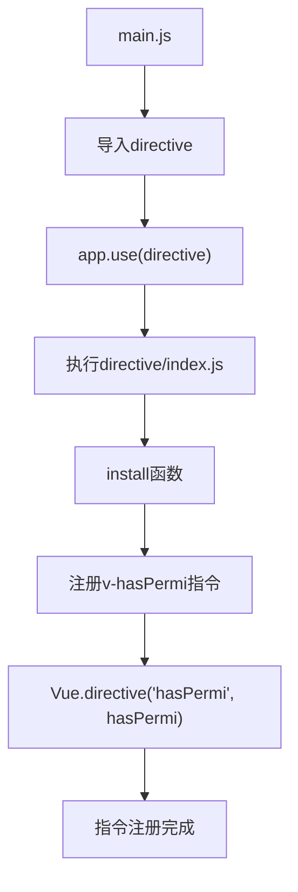
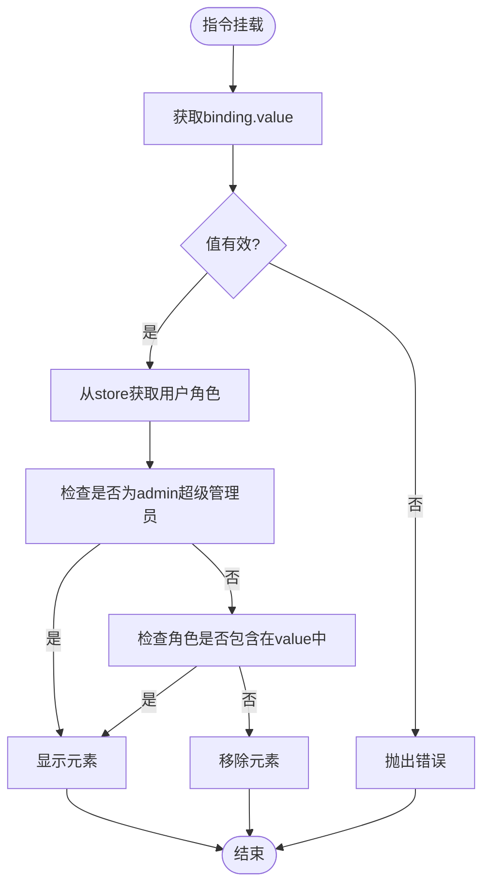
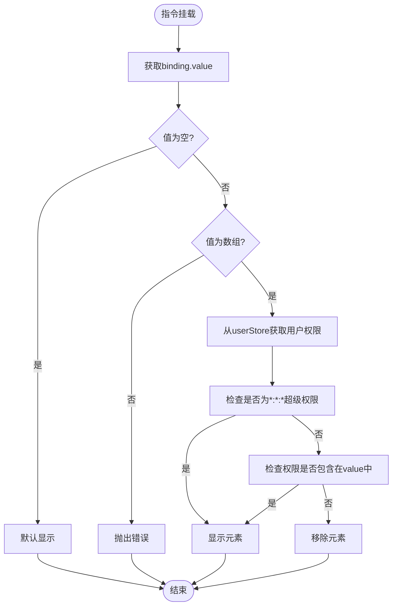
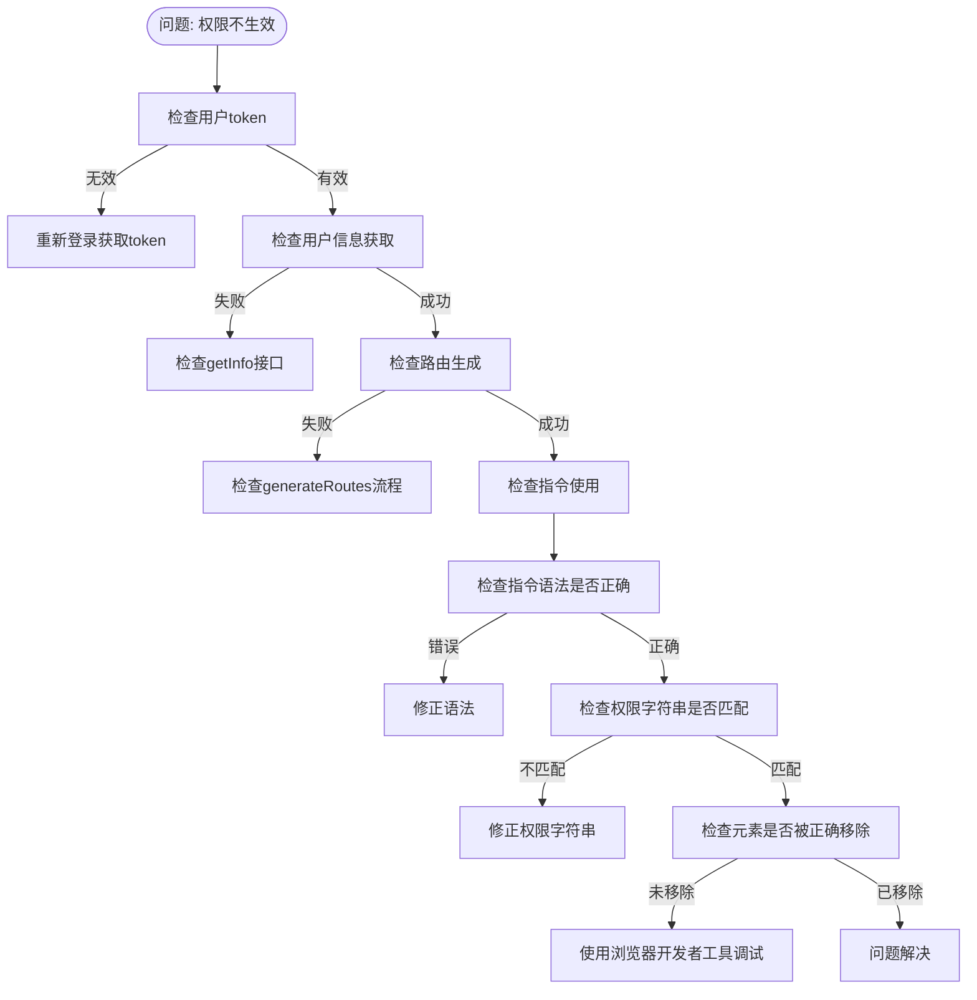

# 权限检查

<cite>
**本文档引用的文件**   
- [hasRole.js](file://bear-jia-vue3/src/directive/permission/hasRole.js)
- [hasPermi.js](file://bear-jia-vue3/src/directive/permission/hasPermi.js)
- [permission.js](file://bear-jia-vue3/src/stores/permission.js)
- [user.js](file://bear-jia-vue3/src/stores/user.js)
- [vueRouter.js](file://bear-jia-vue3/src/router/vueRouter.js)
- [routes.js](file://bear-jia-vue3/src/router/routes.js)
- [auth.js](file://bear-jia-vue3/src/plugins/auth.js)
- [index.js](file://bear-jia-vue3/src/directive/index.js)
</cite>

## 目录
1. [权限检查机制概述](#权限检查机制概述)
2. [核心组件分析](#核心组件分析)
3. [路由守卫与动态路由生成](#路由守卫与动态路由生成)
4. [权限验证逻辑](#权限验证逻辑)
5. [权限指令实现](#权限指令实现)
6. [权限配置与使用示例](#权限配置与使用示例)
7. [常见问题排查](#常见问题排查)

## 权限检查机制概述

本系统采用基于角色（Role-Based）和操作权限（Permission-Based）的双重权限控制机制，通过Vue Router路由守卫、Pinia状态管理、自定义指令等技术实现完整的权限管理体系。系统在用户登录后获取角色和权限信息，动态生成路由表，并在路由跳转和元素渲染时进行权限验证。

**Section sources**
- [vueRouter.js](file://bear-jia-vue3/src/router/vueRouter.js#L1-L130)
- [permission.js](file://bear-jia-vue3/src/stores/permission.js#L1-L264)

## 核心组件分析

系统权限管理由多个核心组件协同工作，包括用户存储（userStore）、权限存储（permissionStore）、路由管理器和权限验证服务。



**Diagram sources **
- [user.js](file://bear-jia-vue3/src/stores/user.js#L1-L83)
- [permission.js](file://bear-jia-vue3/src/stores/permission.js#L1-L264)
- [auth.js](file://bear-jia-vue3/src/plugins/auth.js#L1-L61)

**Section sources**
- [user.js](file://bear-jia-vue3/src/stores/user.js#L1-L83)
- [permission.js](file://bear-jia-vue3/src/stores/permission.js#L1-L264)

## 路由守卫与动态路由生成

系统通过路由守卫实现权限控制，结合userStore和permissionStore实现动态路由权限控制。当用户访问受保护的路由时，系统会检查用户身份和权限，并动态生成相应的路由表。

### generateRoutes() 方法流程

`generateRoutes()` 方法负责从后端获取路由数据、过滤异步路由并动态添加到Vue Router的完整流程：



**Diagram sources **
- [vueRouter.js](file://bear-jia-vue3/src/router/vueRouter.js#L38-L97)
- [permission.js](file://bear-jia-vue3/src/stores/permission.js#L234-L259)

**Section sources**
- [vueRouter.js](file://bear-jia-vue3/src/router/vueRouter.js#L38-L97)
- [permission.js](file://bear-jia-vue3/src/stores/permission.js#L234-L259)

## 权限验证逻辑

系统实现了基于角色和操作权限的双重验证机制，确保不同层级的访问控制需求。

### hasPermission() 函数

`hasPermission()` 函数基于角色（roles）实现路由访问控制逻辑：



**Diagram sources **
- [permission.js](file://bear-jia-vue3/src/stores/permission.js#L10-L15)

### filterDynamicRoutes() 函数

`filterDynamicRoutes()` 函数基于操作权限（permissions）实现验证机制：



**Diagram sources **
- [permission.js](file://bear-jia-vue3/src/stores/permission.js#L194-L207)

**Section sources**
- [permission.js](file://bear-jia-vue3/src/stores/permission.js#L10-L36)
- [permission.js](file://bear-jia-vue3/src/stores/permission.js#L194-L207)

## 权限指令实现

系统提供了两种权限指令：`v-hasRole` 和 `v-hasPermi`，用于在模板中直接控制元素的显示权限。

### 指令注册流程



**Diagram sources **
- [main.js](file://bear-jia-vue3/src/main.js#L6-L7)
- [index.js](file://bear-jia-vue3/src/directive/index.js#L8-L11)

### v-hasRole 指令实现

`v-hasRole` 指令的实现原理：



**Diagram sources **
- [hasRole.js](file://bear-jia-vue3/src/directive/permission/hasRole.js#L9-L28)

### v-hasPermi 指令实现

`v-hasPermi` 指令的实现原理：



**Diagram sources **
- [hasPermi.js](file://bear-jia-vue3/src/directive/permission/hasPermi.js#L9-L34)

**Section sources**
- [hasRole.js](file://bear-jia-vue3/src/directive/permission/hasRole.js#L1-L28)
- [hasPermi.js](file://bear-jia-vue3/src/directive/permission/hasPermi.js#L1-L34)

## 权限配置与使用示例

### 使用场景

| 指令 | 使用场景 | 示例 |
|------|--------|------|
| **v-hasRole** | 基于用户角色的访问控制 | 只有管理员角色才能看到系统设置菜单 |
| **v-hasPermi** | 基于具体操作权限的访问控制 | 只有拥有"system:user:add"权限的用户才能看到新增按钮 |

### 实际使用示例

```vue
<template>
  <!-- 基于操作权限的按钮控制 -->
  <a-button 
    v-hasPermi="['monitor:job:add']" 
    type="primary" 
    @click="openJobAddModal">
    新增任务
  </a-button>
  
  <!-- 基于角色的菜单项控制 -->
  <a-menu-item 
    v-hasRole="['admin', 'system']" 
    key="system-config">
    系统配置
  </a-menu-item>
  
  <!-- 多权限"或"关系控制 -->
  <a-button 
    v-hasPermi="['system:user:edit', 'system:user:add']" 
    type="primary">
    编辑/新增用户
  </a-button>
</template>
```

**Section sources**
- [index.vue](file://bear-jia-vue3/src/views/monitor/job/index.vue#L13-L20)
- [index.vue](file://bear-jia-vue3/src/views/system/config/index.vue#L13-L20)

## 常见问题排查

### 权限配置错误排查



### 路由无法访问问题排查

1. **检查token有效性**：确保用户已登录且token未过期
2. **检查用户角色**：确认用户角色是否包含访问该路由所需的角色
3. **检查路由配置**：确认路由的meta.roles配置是否正确
4. **检查网络请求**：查看getRouters接口是否成功返回路由数据
5. **检查控制台错误**：查看是否有JavaScript错误影响权限判断

**Section sources**
- [vueRouter.js](file://bear-jia-vue3/src/router/vueRouter.js#L58-L66)
- [permission.js](file://bear-jia-vue3/src/stores/permission.js#L253-L255)