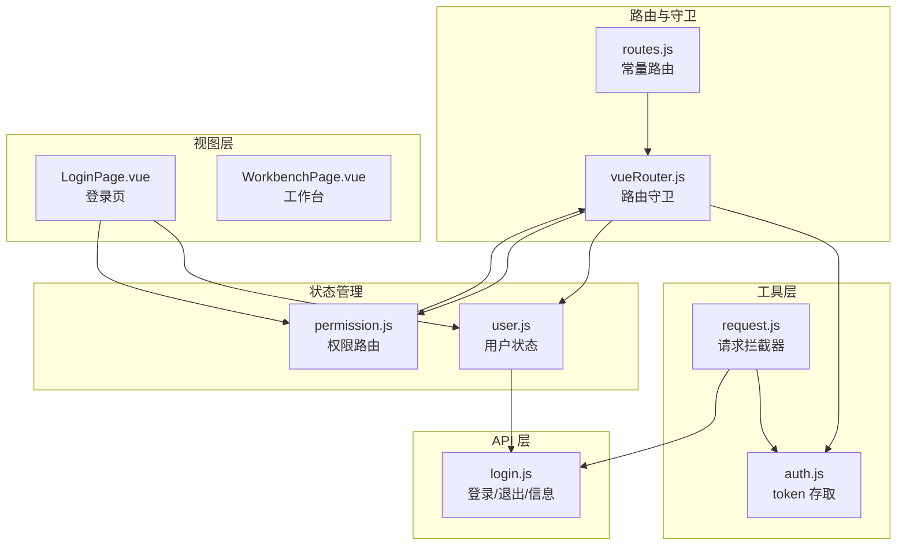
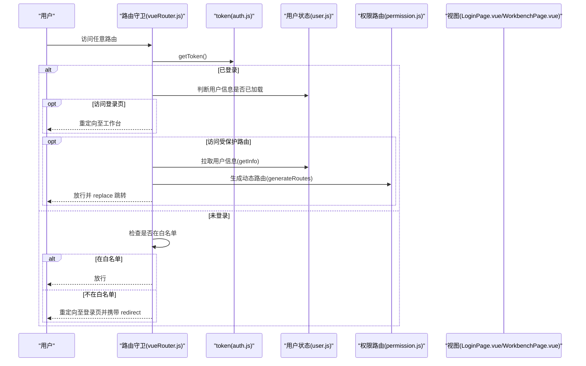
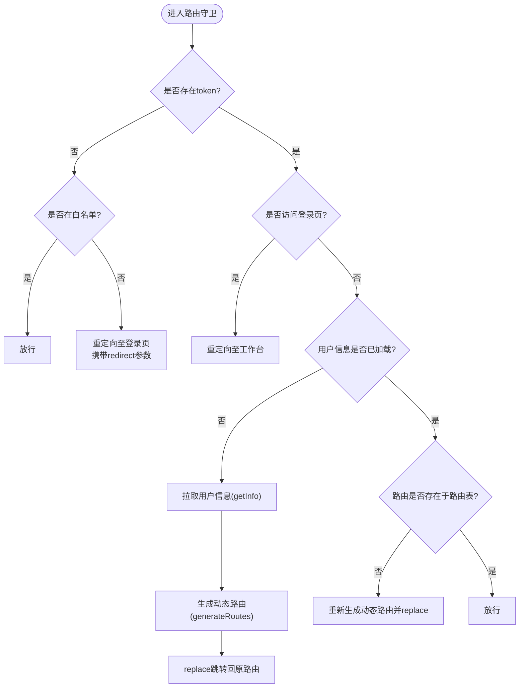
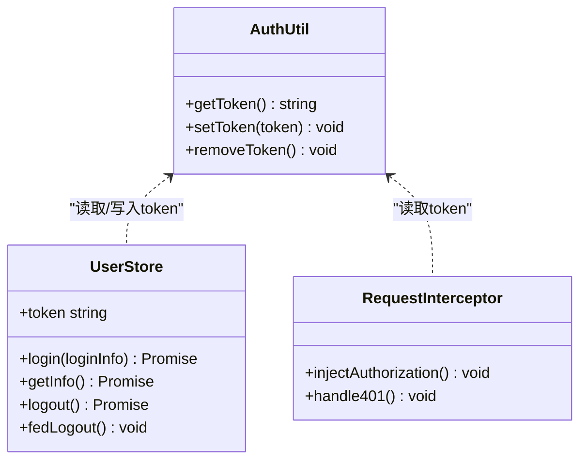
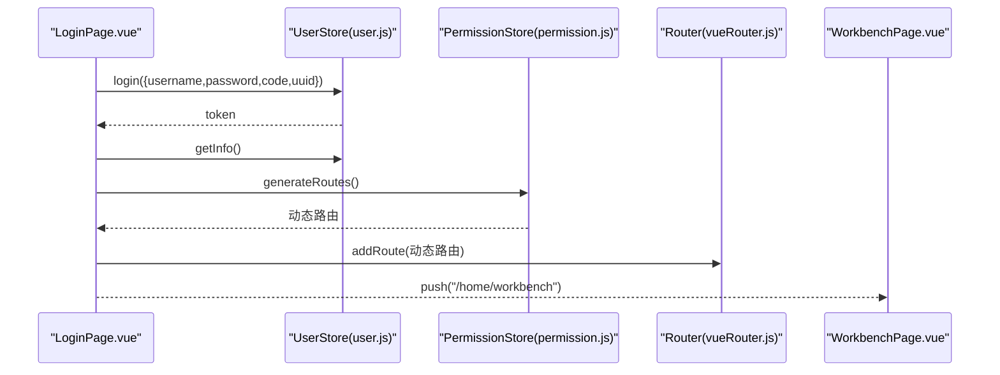
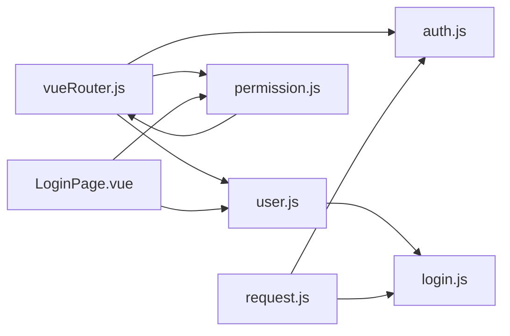

# 登录验证

<cite>
**本文引用的文件**
- [vueRouter.js](file://bear-jia-vue3/src/router/vueRouter.js)
- [auth.js](file://bear-jia-vue3/src/utils/auth.js)
- [user.js](file://bear-jia-vue3/src/stores/user.js)
- [permission.js](file://bear-jia-vue3/src/stores/permission.js)
- [login.js](file://bear-jia-vue3/src/api/login.js)
- [request.js](file://bear-jia-vue3/src/utils/request.js)
- [routes.js](file://bear-jia-vue3/src/router/routes.js)
- [LoginPage.vue](file://bear-jia-vue3/src/views/LoginPage.vue)
- [WorkbenchPage.vue](file://bear-jia-vue3/src/views/workbench/WorkbenchPage.vue)
- [main.js](file://bear-jia-vue3/src/main.js)
</cite>

## 目录
1. [引言](#引言)
2. [项目结构](#项目结构)
3. [核心组件](#核心组件)
4. [架构总览](#架构总览)
5. [详细组件分析](#详细组件分析)
6. [依赖关系分析](#依赖关系分析)
7. [性能考量](#性能考量)
8. [故障排查指南](#故障排查指南)
9. [结论](#结论)

## 引言
本文件围绕登录验证机制进行深入分析，重点说明：
- 路由守卫如何通过 getToken() 检查用户认证状态
- 白名单机制（whiteList）在未登录状态下的放行逻辑
- 未认证用户访问受保护路由时的重定向处理（携带 redirect 参数）
- 已登录用户访问登录页时的拦截逻辑（重定向至工作台）
- token 的存储、读取和清除流程
- 用户登出后的状态清理机制
- 登录验证过程中的常见问题与解决方案（如 token 失效、自动登录失败）

## 项目结构
该登录验证体系主要分布在以下模块：
- 路由与守卫：路由定义、白名单、前置守卫
- 工具层：token 存取工具
- 状态管理：用户信息、权限路由生成
- API 层：登录、获取用户信息、退出
- 请求拦截器：统一注入 Authorization、处理 401
- 视图层：登录页、工作台页

图表来源
- [vueRouter.js](file://bear-jia-vue3/src/router/vueRouter.js#L1-L130)
- [auth.js](file://bear-jia-vue3/src/utils/auth.js#L1-L16)
- [user.js](file://bear-jia-vue3/src/stores/user.js#L1-L83)
- [permission.js](file://bear-jia-vue3/src/stores/permission.js#L1-L264)
- [login.js](file://bear-jia-vue3/src/api/login.js#L1-L57)
- [request.js](file://bear-jia-vue3/src/utils/request.js#L1-L165)
- [routes.js](file://bear-jia-vue3/src/router/routes.js#L1-L100)
- [LoginPage.vue](file://bear-jia-vue3/src/views/LoginPage.vue#L1-L342)
- [WorkbenchPage.vue](file://bear-jia-vue3/src/views/workbench/WorkbenchPage.vue#L1-L300)

章节来源
- [vueRouter.js](file://bear-jia-vue3/src/router/vueRouter.js#L1-L130)
- [auth.js](file://bear-jia-vue3/src/utils/auth.js#L1-L16)
- [user.js](file://bear-jia-vue3/src/stores/user.js#L1-L83)
- [permission.js](file://bear-jia-vue3/src/stores/permission.js#L1-L264)
- [login.js](file://bear-jia-vue3/src/api/login.js#L1-L57)
- [request.js](file://bear-jia-vue3/src/utils/request.js#L1-L165)
- [routes.js](file://bear-jia-vue3/src/router/routes.js#L1-L100)
- [LoginPage.vue](file://bear-jia-vue3/src/views/LoginPage.vue#L1-L342)
- [WorkbenchPage.vue](file://bear-jia-vue3/src/views/workbench/WorkbenchPage.vue#L1-L300)

## 核心组件
- 路由守卫（vueRouter.js）
  - 白名单：包含登录页及注册页等无需认证即可访问的路由
  - 前置守卫：根据是否存在 token 决定放行、重定向或拉取用户信息并生成动态路由
- token 工具（auth.js）
  - 提供 getToken/setToken/removeToken，基于 Cookie 存储
- 用户状态（user.js）
  - 登录写入 token；退出清空 token 并清理用户信息
- 权限路由（permission.js）
  - 从后端拉取路由，过滤并注入到路由表
- 请求拦截器（request.js）
  - 自动注入 Authorization 头；对 401 做统一处理并触发登出
- 登录页（LoginPage.vue）
  - 表单提交后调用 store.login/getInfo/generateRoutes，并跳转工作台
- 工作台（WorkbenchPage.vue）
  - 已登录用户的默认工作入口

章节来源
- [vueRouter.js](file://bear-jia-vue3/src/router/vueRouter.js#L1-L130)
- [auth.js](file://bear-jia-vue3/src/utils/auth.js#L1-L16)
- [user.js](file://bear-jia-vue3/src/stores/user.js#L1-L83)
- [permission.js](file://bear-jia-vue3/src/stores/permission.js#L1-L264)
- [login.js](file://bear-jia-vue3/src/api/login.js#L1-L57)
- [request.js](file://bear-jia-vue3/src/utils/request.js#L1-L165)
- [LoginPage.vue](file://bear-jia-vue3/src/views/LoginPage.vue#L1-L342)
- [WorkbenchPage.vue](file://bear-jia-vue3/src/views/workbench/WorkbenchPage.vue#L1-L300)

## 架构总览
登录验证的整体流程如下：
- 用户访问任意路由
- 路由守卫读取 token（Cookie），判断是否已登录
- 若已登录：
  - 若访问登录页，则重定向至工作台
  - 若访问受保护路由：
    - 若用户信息为空，拉取用户信息并生成动态路由
    - 若路由表中不存在目标路由，重新生成并 replace 跳转
- 若未登录：
  - 若在白名单内则直接放行
  - 否则重定向至登录页并附带 redirect 参数

图表来源
- [vueRouter.js](file://bear-jia-vue3/src/router/vueRouter.js#L1-L130)
- [auth.js](file://bear-jia-vue3/src/utils/auth.js#L1-L16)
- [user.js](file://bear-jia-vue3/src/stores/user.js#L1-L83)
- [permission.js](file://bear-jia-vue3/src/stores/permission.js#L1-L264)
- [LoginPage.vue](file://bear-jia-vue3/src/views/LoginPage.vue#L1-L342)
- [WorkbenchPage.vue](file://bear-jia-vue3/src/views/workbench/WorkbenchPage.vue#L1-L300)

## 详细组件分析

### 路由守卫与白名单机制
- 白名单：包含登录页、登录页变体、注册页等
- 未登录访问受保护路由：
  - 重定向至登录页并携带 redirect 参数，便于登录后回到原页面
- 已登录访问登录页：
  - 直接重定向至工作台，避免重复登录
- 已登录访问受保护路由：
  - 若用户信息为空，先拉取用户信息并生成动态路由，再 replace 跳转
  - 若刷新后动态路由丢失，检测并重新生成

图表来源
- [vueRouter.js](file://bear-jia-vue3/src/router/vueRouter.js#L1-L130)
- [permission.js](file://bear-jia-vue3/src/stores/permission.js#L1-L264)
- [user.js](file://bear-jia-vue3/src/stores/user.js#L1-L83)

章节来源
- [vueRouter.js](file://bear-jia-vue3/src/router/vueRouter.js#L1-L130)
- [routes.js](file://bear-jia-vue3/src/router/routes.js#L1-L100)

### token 的存储、读取与清除
- 存储与读取：通过 Cookie 中的键值对存储 token，提供 getToken/setToken/removeToken
- 清除：登出时同时清空用户状态与 Cookie 中的 token

图表来源
- [auth.js](file://bear-jia-vue3/src/utils/auth.js#L1-L16)
- [user.js](file://bear-jia-vue3/src/stores/user.js#L1-L83)
- [request.js](file://bear-jia-vue3/src/utils/request.js#L1-L165)

章节来源
- [auth.js](file://bear-jia-vue3/src/utils/auth.js#L1-L16)
- [user.js](file://bear-jia-vue3/src/stores/user.js#L1-L83)
- [request.js](file://bear-jia-vue3/src/utils/request.js#L1-L165)

### 登录流程与工作台重定向
- 登录页提交表单后：
  - 调用 store.login 写入 token
  - 调用 store.getInfo 拉取用户信息
  - 生成动态路由并注入
  - 跳转至工作台
- 登录页路由定义包含多个登录页变体，便于切换

图表来源
- [LoginPage.vue](file://bear-jia-vue3/src/views/LoginPage.vue#L1-L342)
- [user.js](file://bear-jia-vue3/src/stores/user.js#L1-L83)
- [permission.js](file://bear-jia-vue3/src/stores/permission.js#L1-L264)
- [vueRouter.js](file://bear-jia-vue3/src/router/vueRouter.js#L1-L130)
- [routes.js](file://bear-jia-vue3/src/router/routes.js#L1-L100)

章节来源
- [LoginPage.vue](file://bear-jia-vue3/src/views/LoginPage.vue#L1-L342)
- [routes.js](file://bear-jia-vue3/src/router/routes.js#L1-L100)

### 退出与状态清理
- 前端登出：清空用户状态与 token
- 后端登出：调用后端 logout 接口，后端删除缓存中的 token 并返回成功
- 请求拦截器对 401 的统一处理：弹出提示、触发用户登出并跳转登录页

章节来源
- [user.js](file://bear-jia-vue3/src/stores/user.js#L1-L83)
- [login.js](file://bear-jia-vue3/src/api/login.js#L1-L57)
- [request.js](file://bear-jia-vue3/src/utils/request.js#L1-L165)

## 依赖关系分析
- 路由守卫依赖 token 工具、用户状态、权限路由
- 用户状态依赖 API 层的登录/退出/信息接口
- 请求拦截器依赖 token 工具与用户状态，统一处理 401
- 登录页依赖用户状态与权限路由，完成登录后跳转工作台

图表来源
- [vueRouter.js](file://bear-jia-vue3/src/router/vueRouter.js#L1-L130)
- [auth.js](file://bear-jia-vue3/src/utils/auth.js#L1-L16)
- [user.js](file://bear-jia-vue3/src/stores/user.js#L1-L83)
- [permission.js](file://bear-jia-vue3/src/stores/permission.js#L1-L264)
- [login.js](file://bear-jia-vue3/src/api/login.js#L1-L57)
- [request.js](file://bear-jia-vue3/src/utils/request.js#L1-L165)
- [LoginPage.vue](file://bear-jia-vue3/src/views/LoginPage.vue#L1-L342)

章节来源
- [main.js](file://bear-jia-vue3/src/main.js#L1-L62)
- [vueRouter.js](file://bear-jia-vue3/src/router/vueRouter.js#L1-L130)
- [request.js](file://bear-jia-vue3/src/utils/request.js#L1-L165)

## 性能考量
- 路由守卫仅在必要时拉取用户信息与生成动态路由，避免重复请求
- 请求拦截器对 GET 参数进行 URL 化，减少不必要的请求体
- 登录页在提交失败时重置验证码图片，避免无效请求

[本节为通用建议，不直接分析具体文件]

## 故障排查指南
- token 失效或过期
  - 现象：接口返回 401，自动触发登出并跳转登录页
  - 处理：确认后端 token 有效期与刷新策略；前端收到 401 后会自动清理状态并跳转
- 自动登录失败
  - 现象：刷新页面后动态路由丢失，再次访问受保护路由被重定向
  - 处理：路由守卫会在检测到路由缺失时重新生成并 replace 跳转
- 无法访问登录页
  - 现象：已登录用户访问登录页被重定向至工作台
  - 处理：这是预期行为，确保登录页在白名单中
- 登录后未跳转工作台
  - 现象：登录成功但停留在登录页
  - 处理：检查登录页提交流程是否正确调用 store.login/getInfo/generateRoutes 并 push 工作台

章节来源
- [request.js](file://bear-jia-vue3/src/utils/request.js#L1-L165)
- [vueRouter.js](file://bear-jia-vue3/src/router/vueRouter.js#L1-L130)
- [LoginPage.vue](file://bear-jia-vue3/src/views/LoginPage.vue#L1-L342)

## 结论
该登录验证体系通过“路由守卫 + token 工具 + 状态管理 + 请求拦截器”的组合，实现了：
- 明确的白名单放行与受保护路由重定向
- 已登录用户访问登录页的拦截
- 动态路由按需生成与刷新后的恢复
- 统一的 token 存取与 401 处理
- 登录成功后的完整工作流与工作台重定向

上述机制共同保证了登录验证的可靠性与用户体验。