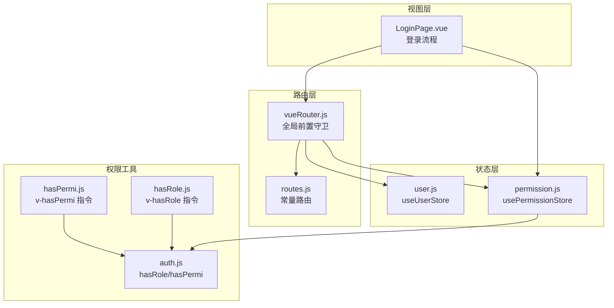
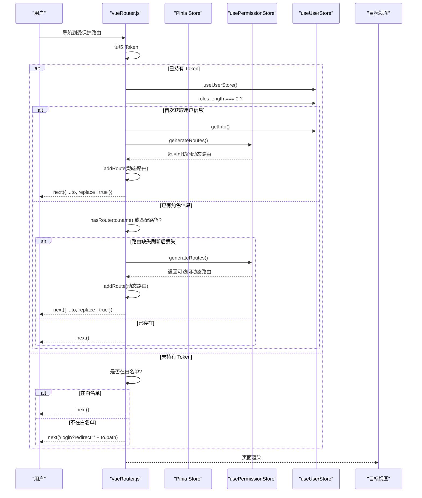
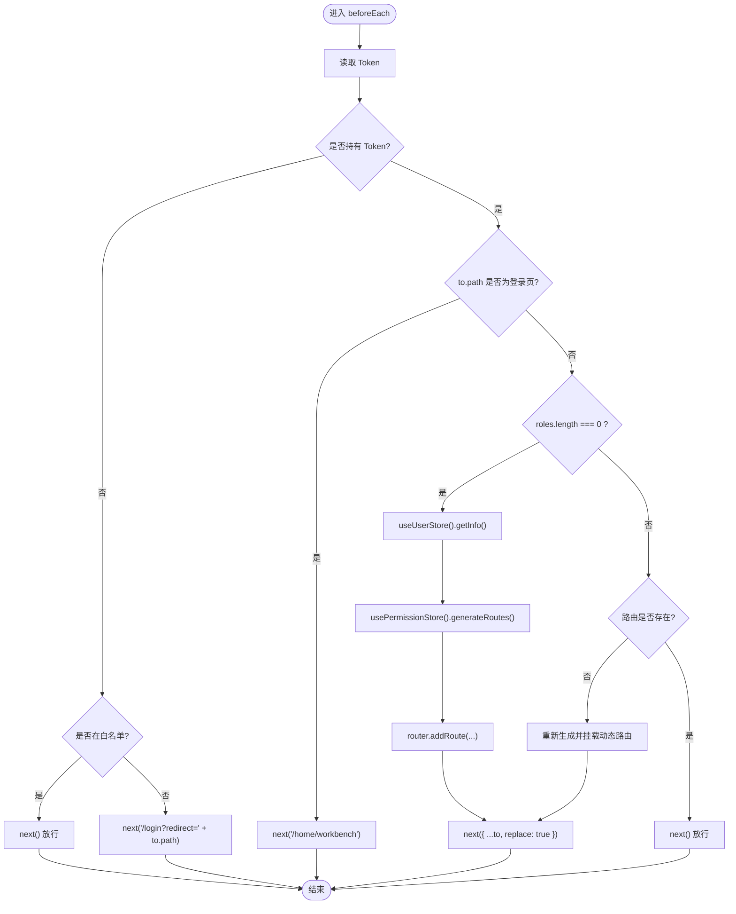
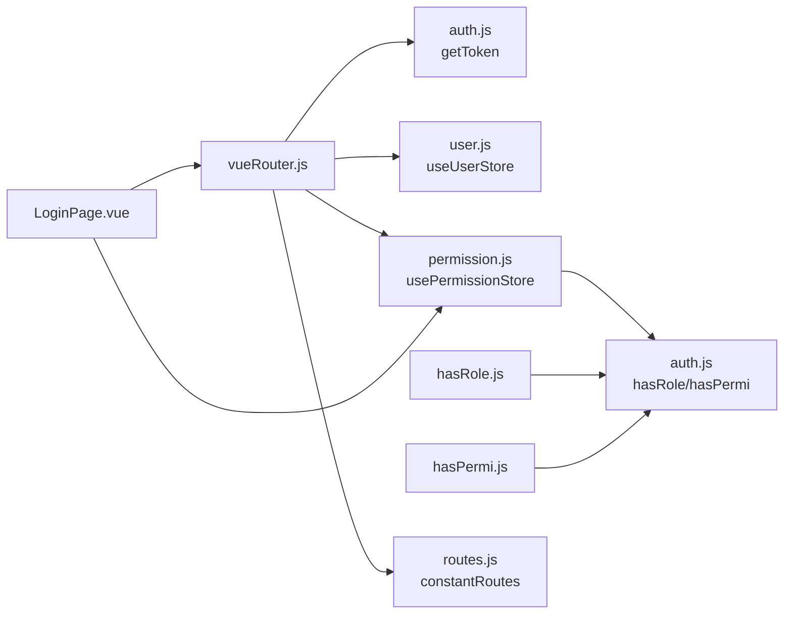

# 路由守卫

<cite>
**本文引用的文件**
- [vueRouter.js](file://bear-jia-vue3/src/router/vueRouter.js)
- [user.js](file://bear-jia-vue3/src/stores/user.js)
- [permission.js](file://bear-jia-vue3/src/stores/permission.js)
- [auth.js](file://bear-jia-vue3/src/plugins/auth.js)
- [hasRole.js](file://bear-jia-vue3/src/directive/permission/hasRole.js)
- [hasPermi.js](file://bear-jia-vue3/src/directive/permission/hasPermi.js)
- [auth.js](file://bear-jia-vue3/src/utils/auth.js)
- [routes.js](file://bear-jia-vue3/src/router/routes.js)
- [LoginPage.vue](file://bear-jia-vue3/src/views/LoginPage.vue)
</cite>

## 目录
1. [引言](#引言)
2. [项目结构](#项目结构)
3. [核心组件](#核心组件)
4. [架构总览](#架构总览)
5. [详细组件分析](#详细组件分析)
6. [依赖关系分析](#依赖关系分析)
7. [性能考虑](#性能考虑)
8. [故障排查指南](#故障排查指南)
9. [结论](#结论)

## 引言
本文件围绕路由守卫展开，重点解析 bear-jia-vue3 项目中 vueRouter.js 的 beforeEach 全局前置守卫工作机制，阐明其如何结合 userStore 和 permissionStore 实现访问控制与权限验证；并给出未登录用户重定向至登录页、已登录用户访问登录页时的重定向处理策略，以及角色权限 hasRole 与操作权限 hasPermi 的检查机制。同时提供性能优化建议与常见问题排查方案。

## 项目结构
与路由守卫直接相关的核心文件分布如下：
- 路由定义与守卫：src/router/vueRouter.js
- 用户状态管理：src/stores/user.js
- 权限状态管理：src/stores/permission.js
- 权限工具函数：src/plugins/auth.js
- 角色/权限指令：src/directive/permission/hasRole.js、src/directive/permission/hasPermi.js
- 常量路由：src/router/routes.js
- 登录页：src/views/LoginPage.vue
- Token 工具：src/utils/auth.js

图表来源
- [vueRouter.js](file://bear-jia-vue3/src/router/vueRouter.js#L1-L130)
- [user.js](file://bear-jia-vue3/src/stores/user.js#L1-L83)
- [permission.js](file://bear-jia-vue3/src/stores/permission.js#L1-L264)
- [auth.js](file://bear-jia-vue3/src/plugins/auth.js#L1-L61)
- [hasRole.js](file://bear-jia-vue3/src/directive/permission/hasRole.js#L1-L29)
- [hasPermi.js](file://bear-jia-vue3/src/directive/permission/hasPermi.js#L1-L35)
- [routes.js](file://bear-jia-vue3/src/router/routes.js#L1-L100)
- [LoginPage.vue](file://bear-jia-vue3/src/views/LoginPage.vue#L1-L170)

章节来源
- [vueRouter.js](file://bear-jia-vue3/src/router/vueRouter.js#L1-L130)
- [routes.js](file://bear-jia-vue3/src/router/routes.js#L1-L100)

## 核心组件
- 全局前置守卫：在导航开始时统一拦截，依据 Token、白名单、用户信息与动态路由生成情况决定放行或重定向。
- 用户状态仓库：维护 token、角色、权限等用户信息，并提供登录、获取用户信息、登出等动作。
- 权限状态仓库：负责从后端拉取路由树，过滤并生成可访问的动态路由，供路由实例动态挂载。
- 权限工具：提供 hasRole/hasPermi 等权限判断能力，既可在路由层使用，也可在指令层使用。
- 登录页：完成登录、获取用户信息、生成并挂载动态路由，然后跳转首页。

章节来源
- [vueRouter.js](file://bear-jia-vue3/src/router/vueRouter.js#L37-L100)
- [user.js](file://bear-jia-vue3/src/stores/user.js#L1-L83)
- [permission.js](file://bear-jia-vue3/src/stores/permission.js#L1-L264)
- [auth.js](file://bear-jia-vue3/src/plugins/auth.js#L1-L61)
- [LoginPage.vue](file://bear-jia-vue3/src/views/LoginPage.vue#L120-L160)

## 架构总览
以下序列图展示 beforeEach 的典型执行流程：从进入受保护路由到最终放行或重定向。

图表来源
- [vueRouter.js](file://bear-jia-vue3/src/router/vueRouter.js#L37-L100)
- [permission.js](file://bear-jia-vue3/src/stores/permission.js#L234-L261)
- [user.js](file://bear-jia-vue3/src/stores/user.js#L48-L62)

## 详细组件分析

### 全局前置守卫 beforeEach 工作流
- Token 检测：通过工具函数读取 Cookie 中的 Token，作为是否已登录的判定依据。
- 白名单策略：对登录页、注册页等白名单路径直接放行。
- 已登录场景：
  - 若用户角色为空，则先拉取用户信息并生成动态路由，再以 replace 方式重新进入目标路由，确保路由表完整。
  - 若用户角色非空，检测目标路由是否存在于当前路由表中；若不存在（例如页面刷新后丢失），则重新生成并挂载，再 replace 重新进入。
  - 若路由存在，直接放行。
- 未登录场景：不在白名单则重定向到登录页，并附带 redirect 参数以便登录后自动回到原路径。
- 错误处理：在获取用户信息或重新生成路由失败时，触发登出并提示错误，随后重定向到登录页。

图表来源
- [vueRouter.js](file://bear-jia-vue3/src/router/vueRouter.js#L37-L100)

章节来源
- [vueRouter.js](file://bear-jia-vue3/src/router/vueRouter.js#L37-L100)
- [auth.js](file://bear-jia-vue3/src/utils/auth.js#L1-L16)
- [routes.js](file://bear-jia-vue3/src/router/routes.js#L1-L40)

### 用户状态仓库 userStore
- 关键字段：token、roles、permissions 等。
- 关键动作：
  - login：调用后端接口获取 Token 并写入 Cookie。
  - getInfo：拉取用户信息并填充 roles、permissions 等。
  - logout/fedLogout：清理本地 token 与状态。
- 与守卫协作：守卫在已登录场景下首次进入会调用 getInfo，后续仅在路由缺失时触发重新生成。

章节来源
- [user.js](file://bear-jia-vue3/src/stores/user.js#L1-L83)

### 权限状态仓库 permissionStore
- generateRoutes：从后端拉取路由树，经过过滤与组件懒加载处理，生成可访问的动态路由集合，并更新内部状态。
- 与守卫协作：守卫在首次进入或路由缺失时调用 generateRoutes，随后将返回的动态路由逐条 addRoute 到路由实例。

章节来源
- [permission.js](file://bear-jia-vue3/src/stores/permission.js#L234-L261)

### 角色权限 hasRole 与操作权限 hasPermi
- 权限工具 auth.js 提供 hasRole/hasPermi 系列方法，支持“任一满足”和“全部满足”的组合判断。
- 指令层实现：
  - v-hasRole：在 mounted 阶段根据用户角色集合判断是否移除 DOM。
  - v-hasPermi：在 mounted 阶段根据用户权限集合判断是否移除 DOM。
- 与守卫的区别：指令用于页面级的 UI 层权限控制；守卫用于导航级的访问控制。

章节来源
- [auth.js](file://bear-jia-vue3/src/plugins/auth.js#L1-L61)
- [hasRole.js](file://bear-jia-vue3/src/directive/permission/hasRole.js#L1-L29)
- [hasPermi.js](file://bear-jia-vue3/src/directive/permission/hasPermi.js#L1-L35)

### 登录页 LoginPage.vue 的配合流程
- 登录成功后，调用 userStore.getInfo 获取用户信息。
- 调用 permissionStore.generateRoutes 生成动态路由并逐条 addRoute。
- 最终 push 到首页，完成从登录到首页的导航闭环。

章节来源
- [LoginPage.vue](file://bear-jia-vue3/src/views/LoginPage.vue#L120-L160)

## 依赖关系分析
- 路由守卫依赖：
  - Token 工具：用于判断是否已登录。
  - userStore：用于获取用户信息与角色/权限。
  - permissionStore：用于生成动态路由并挂载。
  - 常量路由：作为基础路由集合，与动态路由合并。
- 权限指令依赖：
  - auth 工具：提供 hasRole/hasPermi 判断。
  - userStore：在指令中读取当前用户的 roles/permissions。

图表来源
- [vueRouter.js](file://bear-jia-vue3/src/router/vueRouter.js#L1-L130)
- [auth.js](file://bear-jia-vue3/src/utils/auth.js#L1-L16)
- [user.js](file://bear-jia-vue3/src/stores/user.js#L1-L83)
- [permission.js](file://bear-jia-vue3/src/stores/permission.js#L1-L264)
- [hasRole.js](file://bear-jia-vue3/src/directive/permission/hasRole.js#L1-L29)
- [hasPermi.js](file://bear-jia-vue3/src/directive/permission/hasPermi.js#L1-L35)
- [routes.js](file://bear-jia-vue3/src/router/routes.js#L1-L100)
- [LoginPage.vue](file://bear-jia-vue3/src/views/LoginPage.vue#L120-L160)

## 性能考虑
- 避免重复权限检查
  - 首次进入时通过 userStore.getInfo 获取用户信息并生成动态路由，后续在 roles 非空且路由存在的情况下直接放行，减少不必要的 generateRoutes 调用。
  - 在路由刷新后丢失时才重新生成，避免每次导航都生成。
- 合理使用 next()
  - 当需要替换当前历史记录时使用 replace，避免产生多余的历史项。
  - 在已知放行时直接 next()，避免无意义的对象构造。
- 动态路由懒加载
  - permissionStore 内部对视图组件采用 import.meta.glob 预加载与按需懒加载，降低首屏压力。
- 进度条与页面状态
  - NProgress 在守卫前后正确开启/关闭，避免阻塞 UI。
  - 页面滚动位置保存/恢复，提升用户体验。

章节来源
- [vueRouter.js](file://bear-jia-vue3/src/router/vueRouter.js#L37-L100)
- [permission.js](file://bear-jia-vue3/src/stores/permission.js#L1-L264)

## 故障排查指南
- 路由循环重定向
  - 现象：频繁在登录页与目标页之间来回跳转。
  - 排查要点：
    - 确认白名单配置是否包含当前路径。
    - 确认 Token 是否有效且未被提前清除。
    - 确认守卫中对登录页的重定向逻辑是否被触发（to.path === '/login'）。
  - 相关代码参考：
    - [vueRouter.js](file://bear-jia-vue3/src/router/vueRouter.js#L37-L100)
    - [auth.js](file://bear-jia-vue3/src/utils/auth.js#L1-L16)

- 未登录访问受限页面
  - 现象：被重定向到登录页但 redirect 参数缺失。
  - 排查要点：
    - 确认守卫对非白名单路径调用了 next('/login?redirect=' + to.path)。
    - 确认登录页在登录成功后 push 到首页或携带 redirect 的目标路径。
  - 相关代码参考：
    - [vueRouter.js](file://bear-jia-vue3/src/router/vueRouter.js#L90-L100)
    - [LoginPage.vue](file://bear-jia-vue3/src/views/LoginPage.vue#L120-L160)

- 登录后无法进入目标页面
  - 现象：登录成功后仍停留在登录页或出现 404。
  - 排查要点：
    - 确认 permissionStore.generateRoutes 成功返回并 addRoute 到路由实例。
    - 确认 replace 进入目标路由，避免历史栈污染。
  - 相关代码参考：
    - [permission.js](file://bear-jia-vue3/src/stores/permission.js#L234-L261)
    - [LoginPage.vue](file://bear-jia-vue3/src/views/LoginPage.vue#L120-L160)

- 角色/权限指令不生效
  - 现象：按钮或菜单项未按预期隐藏。
  - 排查要点：
    - 确认 v-hasRole/v-hasPermi 的值为非空数组。
    - 确认 userStore.permissions/roles 已正确填充。
  - 相关代码参考：
    - [hasRole.js](file://bear-jia-vue3/src/directive/permission/hasRole.js#L1-L29)
    - [hasPermi.js](file://bear-jia-vue3/src/directive/permission/hasPermi.js#L1-L35)
    - [auth.js](file://bear-jia-vue3/src/plugins/auth.js#L1-L61)

## 结论
本项目的路由守卫通过 Token 判定、白名单放行、用户信息与动态路由的协同，实现了可靠的访问控制。配合 Pinia 状态管理与权限工具，既能保证导航层面的安全性，也能在 UI 层通过指令实现细粒度的权限控制。遵循本文提供的优化建议与排障清单，可进一步提升性能与稳定性。