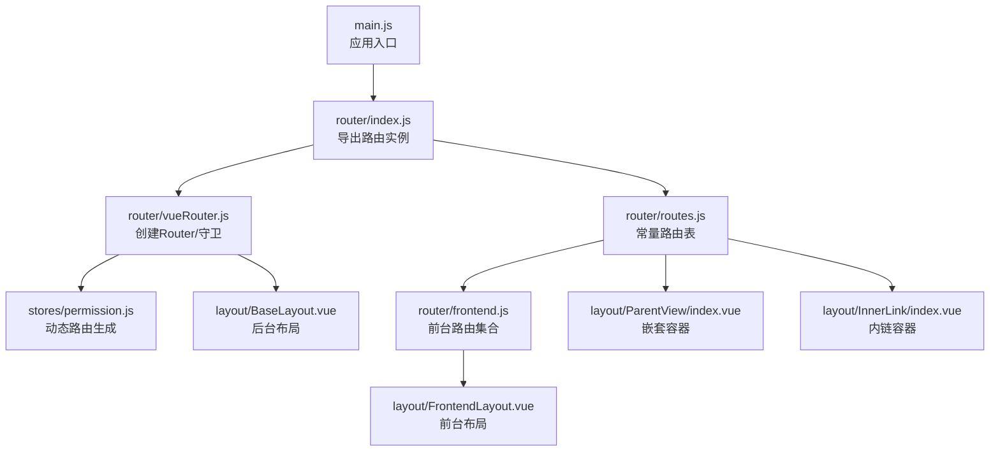
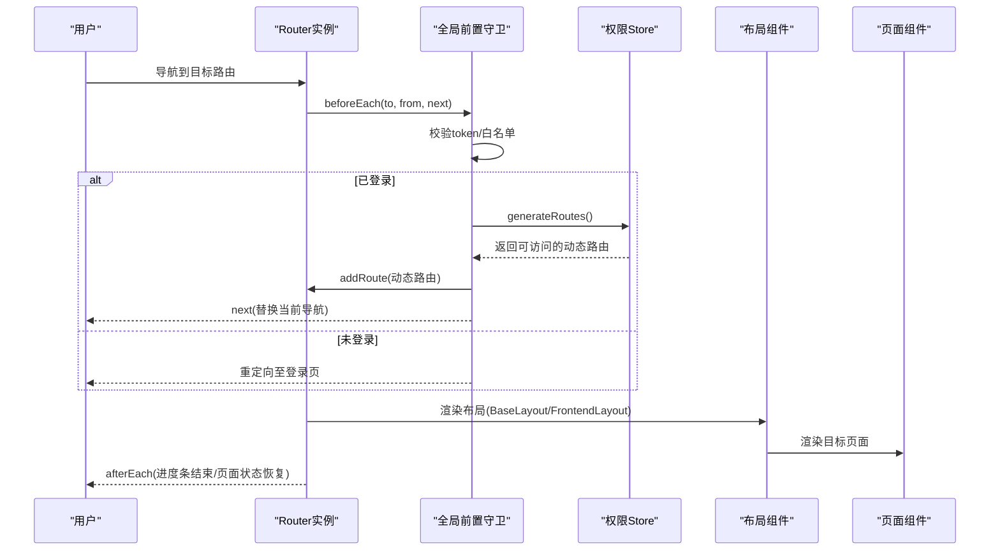
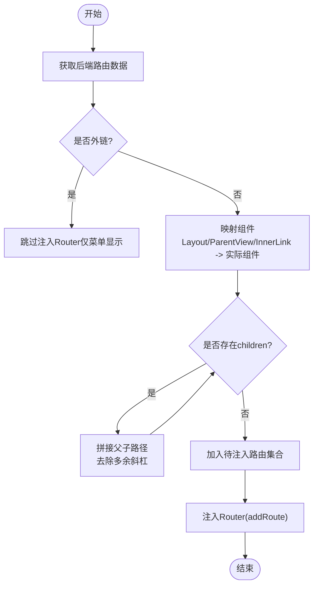
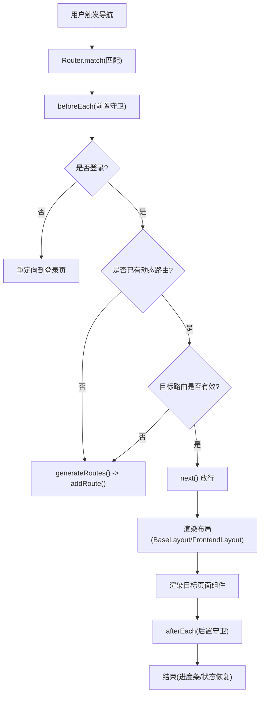
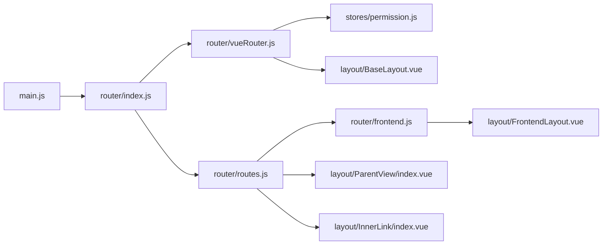

# 路由系统

<cite>
**本文引用的文件**
- [main.js](file://bear-jia-vue3/src/main.js)
- [vueRouter.js](file://bear-jia-vue3/src/router/vueRouter.js)
- [routes.js](file://bear-jia-vue3/src/router/routes.js)
- [frontend.js](file://bear-jia-vue3/src/router/frontend.js)
- [index.js](file://bear-jia-vue3/src/router/index.js)
- [BaseLayout.vue](file://bear-jia-vue3/src/layout/BaseLayout.vue)
- [FrontendLayout.vue](file://bear-jia-vue3/src/layout/FrontendLayout.vue)
- [ParentView/index.vue](file://bear-jia-vue3/src/layout/ParentView/index.vue)
- [InnerLink/index.vue](file://bear-jia-vue3/src/layout/InnerLink/index.vue)
- [permission.js](file://bear-jia-vue3/src/stores/permission.js)
- [user/index.vue](file://bear-jia-vue3/src/views/system/user/index.vue)
- [operlog/index.vue](file://bear-jia-vue3/src/views/monitor/operlog/index.vue)
- [gen/index.vue](file://bear-jia-vue3/src/views/tool/gen/index.vue)
</cite>

## 目录
1. [简介](#简介)
2. [项目结构](#项目结构)
3. [核心组件](#核心组件)
4. [架构总览](#架构总览)
5. [详细组件分析](#详细组件分析)
6. [依赖关系分析](#依赖关系分析)
7. [性能考量](#性能考量)
8. [故障排查指南](#故障排查指南)
9. [结论](#结论)

## 简介
本文件系统性梳理前端路由设计与实现，围绕以下目标展开：
- Vue Router 4 初始化与 history 模式
- 路由表 routes.js 的模块化组织（系统管理、监控、工具等）
- 前台路由 frontend.js 的独立配置
- 路由守卫的权限校验与登录状态检查
- 动态路由加载机制（通过 ParentView 与 InnerLink 实现嵌套与内链）
- BaseLayout 与 FrontendLayout 两种布局模式的路由适配
- 路由流程图：匹配、守卫执行、组件加载全过程

## 项目结构
路由相关代码集中在 src/router 下，并通过 src/main.js 完成全局挂载；布局组件位于 src/layout，动态路由生成逻辑位于 src/stores/permission.js。

图表来源
- [main.js](file://bear-jia-vue3/src/main.js#L1-L62)
- [index.js](file://bear-jia-vue3/src/router/index.js#L1-L2)
- [vueRouter.js](file://bear-jia-vue3/src/router/vueRouter.js#L1-L130)
- [routes.js](file://bear-jia-vue3/src/router/routes.js#L1-L100)
- [frontend.js](file://bear-jia-vue3/src/router/frontend.js#L1-L80)
- [permission.js](file://bear-jia-vue3/src/stores/permission.js#L1-L264)
- [BaseLayout.vue](file://bear-jia-vue3/src/layout/BaseLayout.vue#L1-L260)
- [FrontendLayout.vue](file://bear-jia-vue3/src/layout/FrontendLayout.vue#L1-L145)
- [ParentView/index.vue](file://bear-jia-vue3/src/layout/ParentView/index.vue#L1-L4)
- [InnerLink/index.vue](file://bear-jia-vue3/src/layout/InnerLink/index.vue#L1-L25)

章节来源
- [main.js](file://bear-jia-vue3/src/main.js#L1-L62)
- [index.js](file://bear-jia-vue3/src/router/index.js#L1-L2)

## 核心组件
- 路由实例与守卫：在 vueRouter.js 中创建 Router，配置 history 模式、白名单、前置/后置守卫、错误处理与页面状态恢复。
- 常量路由表：routes.js 定义登录页、404、工作台、系统用户资料等基础路由，并引入前台路由集合。
- 前台路由：frontend.js 单独组织前台首页、关于、联系等页面，采用 FrontendLayout 作为根布局。
- 动态路由：permission.js 从后端拉取路由数据，过滤外链，将 Layout/ParentView/InnerLink 映射为对应组件，生成可注入的路由集合。
- 布局适配：BaseLayout.vue 适配多布局模式（侧边/顶部/混合/分栏/抽屉），FrontendLayout.vue 提供前台导航与过渡动画。

章节来源
- [vueRouter.js](file://bear-jia-vue3/src/router/vueRouter.js#L1-L130)
- [routes.js](file://bear-jia-vue3/src/router/routes.js#L1-L100)
- [frontend.js](file://bear-jia-vue3/src/router/frontend.js#L1-L80)
- [permission.js](file://bear-jia-vue3/src/stores/permission.js#L1-L264)
- [BaseLayout.vue](file://bear-jia-vue3/src/layout/BaseLayout.vue#L1-L260)
- [FrontendLayout.vue](file://bear-jia-vue3/src/layout/FrontendLayout.vue#L1-L145)

## 架构总览
Vue Router 4 在浏览器端以 history 模式运行，结合 Pinia 动态生成路由，配合布局组件实现后台与前台两类界面的路由适配。

图表来源
- [vueRouter.js](file://bear-jia-vue3/src/router/vueRouter.js#L1-L130)
- [permission.js](file://bear-jia-vue3/src/stores/permission.js#L234-L261)
- [BaseLayout.vue](file://bear-jia-vue3/src/layout/BaseLayout.vue#L1-L260)
- [FrontendLayout.vue](file://bear-jia-vue3/src/layout/FrontendLayout.vue#L1-L145)

## 详细组件分析

### Vue Router 4 初始化与 history 模式
- 创建 Router 实例，使用 createWebHistory 并传入 BASE_URL，确保部署路径正确。
- 配置滚动行为，保证每次路由切换回到顶部。
- 白名单包含登录、注册等无需鉴权的页面。
- 前置守卫：
  - 若存在 token，尝试拉取用户信息与动态路由，若失败则登出并重定向登录。
  - 若刷新后路由丢失，重新生成并注入。
  - 未登录且不在白名单则重定向登录。
- 错误处理：捕获路由错误并提示。
- 后置守卫：保存/恢复页面状态，移除过渡类名，结束进度条。

章节来源
- [vueRouter.js](file://bear-jia-vue3/src/router/vueRouter.js#L1-L130)

### 路由表 routes.js 的模块化组织
- 登录/注册/404 等公共路由集中定义，便于统一管理与懒加载。
- 根路径重定向至工作台，工作台采用 BaseLayout 作为父容器，内部 children 定义具体页面。
- 系统用户资料页采用 BaseLayout，children 为空时渲染资料页面。
- 角色授权用户页同样采用 BaseLayout，children 定义授权页面。
- 前台路由通过扩展运算符引入 frontend.js，形成“后台+前台”的双轨路由体系。

章节来源
- [routes.js](file://bear-jia-vue3/src/router/routes.js#L1-L100)
- [frontend.js](file://bear-jia-vue3/src/router/frontend.js#L1-L80)

### 前台路由 frontend.js 的独立配置
- 以 /frontend 为根路径，FrontendLayout 作为父容器，children 定义 home、about、contact 等页面。
- 每个页面可配置 meta（如 keepAlive 控制缓存）。
- FrontendLayout 内部使用 router-view，并对 keep-alive 与过渡动画进行封装。

章节来源
- [frontend.js](file://bear-jia-vue3/src/router/frontend.js#L1-L80)
- [FrontendLayout.vue](file://bear-jia-vue3/src/layout/FrontendLayout.vue#L1-L145)

### 路由守卫：权限验证与登录检查
- 白名单策略：登录、注册等页面无需登录即可访问。
- 登录态校验：无 token 直接重定向登录；有 token 时拉取用户信息与动态路由，失败则登出并提示。
- 刷新保护：检测目标路由是否仍存在于路由表，否则重新生成并注入。
- 前置守卫负责鉴权与动态路由注入，后置守卫负责页面状态与进度条。

章节来源
- [vueRouter.js](file://bear-jia-vue3/src/router/vueRouter.js#L1-L130)

### 动态路由加载机制：ParentView 与 InnerLink
- permission.js 从后端获取路由数据，过滤外链（外链仅用于菜单显示，不注入 Router）。
- 将 component 字段映射为实际组件：
  - Layout -> BaseLayout.vue
  - ParentView -> ParentView/index.vue（用于嵌套子路由）
  - InnerLink -> InnerLink/index.vue（用于内链 iframe）
- 递归处理 children，拼接路径，去除多余斜杠，确保父子路由路径正确。
- 最终生成 addRoutes，注入 Router，并同时维护侧边栏/顶部菜单的路由快照。

图表来源
- [permission.js](file://bear-jia-vue3/src/stores/permission.js#L1-L264)
- [ParentView/index.vue](file://bear-jia-vue3/src/layout/ParentView/index.vue#L1-L4)
- [InnerLink/index.vue](file://bear-jia-vue3/src/layout/InnerLink/index.vue#L1-L25)

章节来源
- [permission.js](file://bear-jia-vue3/src/stores/permission.js#L1-L264)

### BaseLayout 与 FrontendLayout 的路由适配
- BaseLayout.vue：
  - 支持多种布局模式（侧边/顶部/混合/分栏/抽屉），统一通过 router-view 渲染当前路由。
  - 内置全局导航守卫，校验路由有效性，无效时跳转 404。
  - 提供菜单选择与外链处理，支持工作台快捷跳转。
- FrontendLayout.vue：
  - 提供前台导航菜单与页面切换过渡动画，使用 keep-alive 缓存页面（根据 meta.keepAlive）。
  - 顶部导航包含主题切换与后台入口跳转。

章节来源
- [BaseLayout.vue](file://bear-jia-vue3/src/layout/BaseLayout.vue#L1-L260)
- [FrontendLayout.vue](file://bear-jia-vue3/src/layout/FrontendLayout.vue#L1-L145)

### 路由流程图：匹配、守卫执行与组件加载

图表来源
- [vueRouter.js](file://bear-jia-vue3/src/router/vueRouter.js#L1-L130)
- [BaseLayout.vue](file://bear-jia-vue3/src/layout/BaseLayout.vue#L1-L260)
- [FrontendLayout.vue](file://bear-jia-vue3/src/layout/FrontendLayout.vue#L1-L145)

## 依赖关系分析
- main.js 通过 app.use(router) 完成路由挂载。
- vueRouter.js 依赖 permission.js 生成动态路由，依赖 stores/user 与 stores/permission 进行权限判定。
- routes.js 与 frontend.js 作为常量路由表，分别定义后台与前台路由集合。
- BaseLayout.vue 与 FrontendLayout.vue 作为布局容器，承载页面组件渲染。
- permission.js 依赖 import.meta.glob 预加载视图组件，实现按需懒加载与 fallback。

图表来源
- [main.js](file://bear-jia-vue3/src/main.js#L1-L62)
- [index.js](file://bear-jia-vue3/src/router/index.js#L1-L2)
- [vueRouter.js](file://bear-jia-vue3/src/router/vueRouter.js#L1-L130)
- [routes.js](file://bear-jia-vue3/src/router/routes.js#L1-L100)
- [frontend.js](file://bear-jia-vue3/src/router/frontend.js#L1-L80)
- [permission.js](file://bear-jia-vue3/src/stores/permission.js#L1-L264)
- [BaseLayout.vue](file://bear-jia-vue3/src/layout/BaseLayout.vue#L1-L260)
- [FrontendLayout.vue](file://bear-jia-vue3/src/layout/FrontendLayout.vue#L1-L145)
- [ParentView/index.vue](file://bear-jia-vue3/src/layout/ParentView/index.vue#L1-L4)
- [InnerLink/index.vue](file://bear-jia-vue3/src/layout/InnerLink/index.vue#L1-L25)

章节来源
- [main.js](file://bear-jia-vue3/src/main.js#L1-L62)
- [index.js](file://bear-jia-vue3/src/router/index.js#L1-L2)

## 性能考量
- 路由懒加载：通过 import() 与 webpackChunkName 实现按需加载，减少首屏体积。
- 动态路由预加载：permission.js 使用 import.meta.glob 预加载视图组件，提升后续导航性能。
- keep-alive 缓存：FrontendLayout.vue 基于 meta.keepAlive 控制页面缓存，降低重复渲染成本。
- 页面状态恢复：前置/后置守卫保存/恢复滚动位置，改善用户体验。
- 进度条与过渡：NProgress 与页面过渡类名，提升导航反馈。

## 故障排查指南
- 登录后无法进入后台：
  - 检查 token 是否存在与有效；确认前置守卫是否成功拉取用户信息与动态路由。
  - 若刷新后路由丢失，确认 hasRoute/getRoutes 判定逻辑与重新生成流程。
- 动态路由不生效：
  - 检查 permission.js 的 generateRoutes 是否返回了预期路由；确认 addRoute 是否被调用。
  - 排查外链过滤逻辑，确保外链不会被注入 Router。
- 嵌套路由路径异常：
  - 检查 ParentView 与 filterChildren 的路径拼接逻辑，确保去除多余斜杠。
- 内链页面空白：
  - 检查 InnerLink 的 src 与高度计算，确认 iframe 加载地址正确。
- 前台页面缓存问题：
  - 检查 FrontendLayout.vue 的 keepAlive 与 meta.keepAlive 配置。

章节来源
- [vueRouter.js](file://bear-jia-vue3/src/router/vueRouter.js#L1-L130)
- [permission.js](file://bear-jia-vue3/src/stores/permission.js#L1-L264)
- [FrontendLayout.vue](file://bear-jia-vue3/src/layout/FrontendLayout.vue#L1-L145)
- [InnerLink/index.vue](file://bear-jia-vue3/src/layout/InnerLink/index.vue#L1-L25)

## 结论
该路由系统以 Vue Router 4 为基础，结合 Pinia 动态路由生成与多布局适配，实现了后台与前台两条清晰的路由主线。通过白名单、前置/后置守卫与动态路由注入，保障了权限控制与导航体验；通过 ParentView/InnerLink 与布局容器，提供了灵活的嵌套与内链能力。整体架构清晰、职责分离明确，适合在中大型后台与前台场景中复用与扩展。