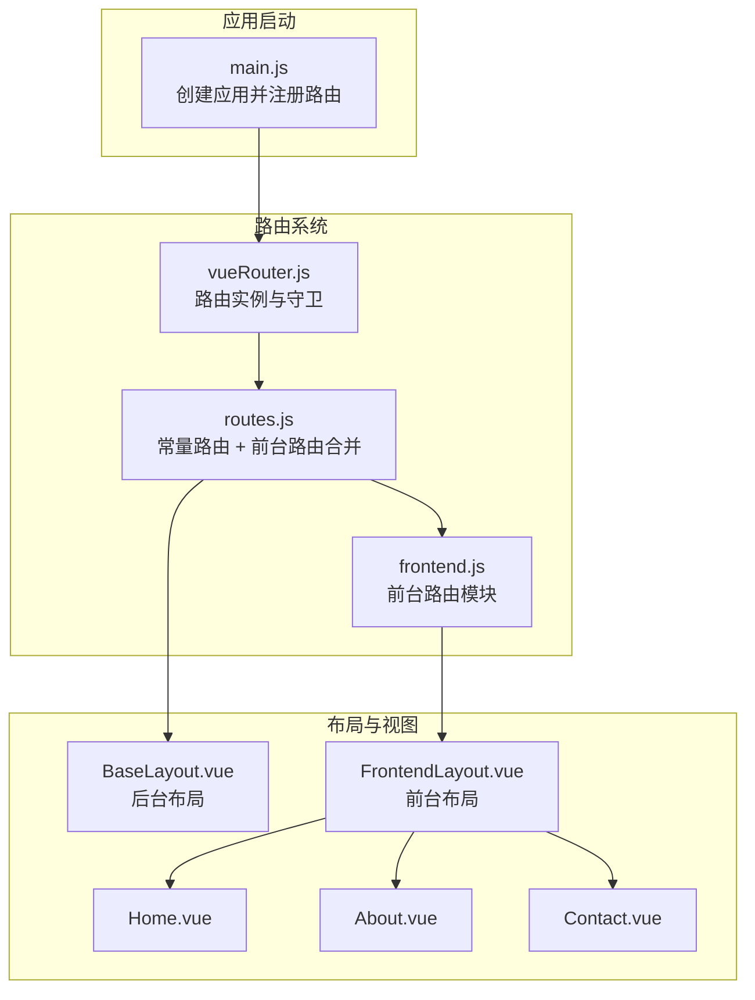
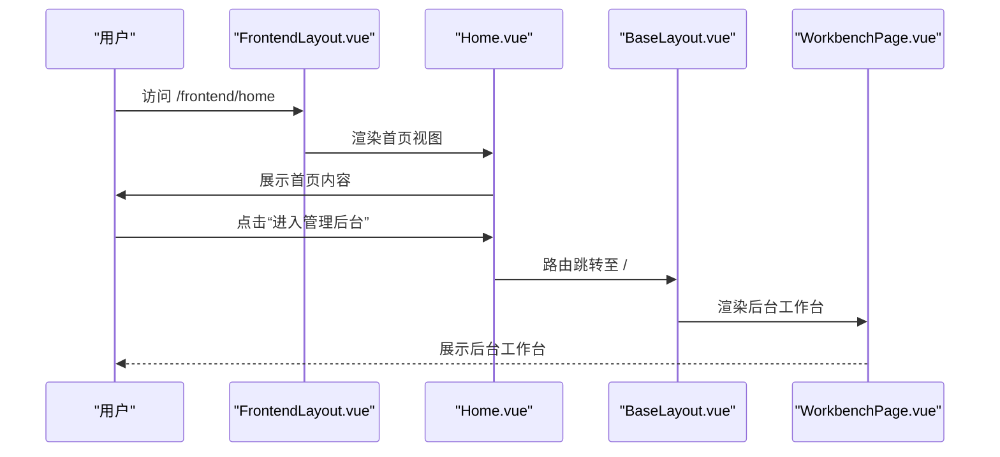
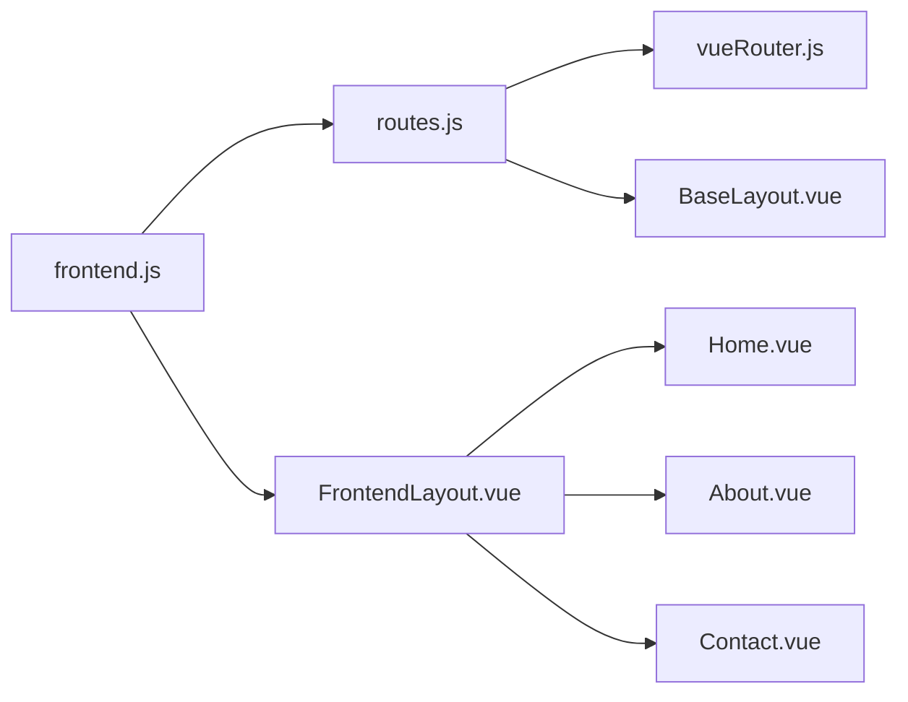

# 前台路由

<cite>
**本文引用的文件**
- [frontend.js](file://bear-jia-vue3/src/router/frontend.js)
- [routes.js](file://bear-jia-vue3/src/router/routes.js)
- [vueRouter.js](file://bear-jia-vue3/src/router/vueRouter.js)
- [FrontendLayout.vue](file://bear-jia-vue3/src/layout/FrontendLayout.vue)
- [BaseLayout.vue](file://bear-jia-vue3/src/layout/BaseLayout.vue)
- [Home.vue](file://bear-jia-vue3/src/views/frontend/Home.vue)
- [About.vue](file://bear-jia-vue3/src/views/frontend/About.vue)
- [Contact.vue](file://bear-jia-vue3/src/views/frontend/Contact.vue)
- [main.js](file://bear-jia-vue3/src/main.js)
</cite>

## 目录
1. [引言](#引言)
2. [项目结构](#项目结构)
3. [核心组件](#核心组件)
4. [架构总览](#架构总览)
5. [详细组件分析](#详细组件分析)
6. [依赖关系分析](#依赖关系分析)
7. [性能考量](#性能考量)
8. [故障排查指南](#故障排查指南)
9. [结论](#结论)
10. [附录](#附录)

## 引言
本文件聚焦于前台路由的独立配置方案，系统性解析 bear-jia-vue3 中 frontend.js 定义的前台路由模块，并阐明其与后台管理路由的隔离机制、布局组件差异、视图组件组织方式及最佳实践。目标读者既包括前端开发者，也包括对路由架构感兴趣的非技术用户。

## 项目结构
前台路由采用“模块化 + 子路由”的方式组织，核心文件如下：
- 路由入口与合并：routes.js 将常量路由与前台路由模块合并，形成最终的路由表
- 前台路由模块：frontend.js 定义了以 /frontend 为前缀的前台路由树
- 前台布局：FrontendLayout.vue 提供前台专属的头部导航、页脚、回到顶部、主题切换与页面缓存能力
- 视图组件：Home.vue、About.vue、Contact.vue 分别对应首页、关于、联系页面
- 后台布局：BaseLayout.vue 提供后台管理的多布局模式（侧边/顶部/混合/分栏/抽屉）
- 路由守卫：vueRouter.js 实现鉴权、动态路由注入、页面状态保存与恢复、错误处理
- 应用挂载：main.js 将路由注册到应用实例

图表来源
- [main.js](file://bear-jia-vue3/src/main.js#L1-L62)
- [vueRouter.js](file://bear-jia-vue3/src/router/vueRouter.js#L1-L130)
- [routes.js](file://bear-jia-vue3/src/router/routes.js#L1-L100)
- [frontend.js](file://bear-jia-vue3/src/router/frontend.js#L1-L79)
- [FrontendLayout.vue](file://bear-jia-vue3/src/layout/FrontendLayout.vue#L1-L145)
- [BaseLayout.vue](file://bear-jia-vue3/src/layout/BaseLayout.vue#L1-L120)
- [Home.vue](file://bear-jia-vue3/src/views/frontend/Home.vue#L1-L140)
- [About.vue](file://bear-jia-vue3/src/views/frontend/About.vue#L1-L122)
- [Contact.vue](file://bear-jia-vue3/src/views/frontend/Contact.vue#L1-L196)

章节来源
- [main.js](file://bear-jia-vue3/src/main.js#L1-L62)
- [routes.js](file://bear-jia-vue3/src/router/routes.js#L1-L100)
- [frontend.js](file://bear-jia-vue3/src/router/frontend.js#L1-L79)

## 核心组件
- 前台路由模块（frontend.js）
  - 定义根路径 /frontend，重定向至 /frontend/home
  - 子路由包含首页 home、关于 about、联系 contact
  - 每个子路由均携带 meta.title 与 keepAlive 控制页面缓存策略
- 前台布局（FrontendLayout.vue）
  - 顶部导航：Logo、主导航菜单、主题切换、管理后台入口、移动端菜单
  - 主体内容：router-view + transition + keep-alive，按路由 meta.keepAlive 动态缓存
  - 页脚：公司信息、快速链接、联系方式、版权信息
  - 交互：滚动监听、回到顶部、暗色主题切换
- 视图组件（Home/About/Contact）
  - Home.vue：首页展示、统计动画、客户评价轮播、CTA 区域
  - About.vue：公司使命、团队介绍、发展历程、联系引导
  - Contact.vue：联系方式、在线表单、FAQ、地图占位
- 后台布局（BaseLayout.vue）
  - 支持 side/top/mix/column/drawer 多种导航布局
  - 顶部 HeaderBar、侧边菜单、历史导航、内容区 router-view
  - 菜单选择、外链处理、路由校验、主题与设置抽屉
- 路由守卫（vueRouter.js）
  - 登录态校验、白名单放行、动态路由注入、页面状态保存/恢复、错误提示

章节来源
- [frontend.js](file://bear-jia-vue3/src/router/frontend.js#L1-L79)
- [FrontendLayout.vue](file://bear-jia-vue3/src/layout/FrontendLayout.vue#L1-L238)
- [Home.vue](file://bear-jia-vue3/src/views/frontend/Home.vue#L1-L320)
- [About.vue](file://bear-jia-vue3/src/views/frontend/About.vue#L1-L208)
- [Contact.vue](file://bear-jia-vue3/src/views/frontend/Contact.vue#L1-L292)
- [BaseLayout.vue](file://bear-jia-vue3/src/layout/BaseLayout.vue#L1-L215)
- [vueRouter.js](file://bear-jia-vue3/src/router/vueRouter.js#L1-L130)

## 架构总览
前台路由与后台路由通过“命名空间”与“布局组件”实现物理隔离：
- 路由层面：后台路由位于 /home 下，前台路由位于 /frontend 下，互不冲突
- 布局层面：后台使用 BaseLayout.vue，前台使用 FrontendLayout.vue，职责与风格明显区分
- 跳转衔接：前台首页可跳转至后台工作台；前台联系页可跳转至后台登录页或工作台

图表来源
- [Home.vue](file://bear-jia-vue3/src/views/frontend/Home.vue#L282-L295)
- [routes.js](file://bear-jia-vue3/src/router/routes.js#L41-L69)
- [BaseLayout.vue](file://bear-jia-vue3/src/layout/BaseLayout.vue#L1-L120)

## 详细组件分析

### 前台路由模块（frontend.js）
- 结构要点
  - 根路由：/frontend，redirect 到 /frontend/home
  - 子路由：home、about、contact，分别映射到 Home.vue、About.vue、Contact.vue
  - meta 字段：title 用于页面标题与面包屑；keepAlive 控制页面缓存
- 设计动机
  - 将前台页面与后台页面解耦，避免后台路由污染前台导航
  - 便于扩展产品中心、新闻资讯等页面，保持路径清晰
- 代码片段路径
  - [前台路由定义](file://bear-jia-vue3/src/router/frontend.js#L1-L79)

章节来源
- [frontend.js](file://bear-jia-vue3/src/router/frontend.js#L1-L79)

### 前台布局（FrontendLayout.vue）
- 布局组成
  - 头部：Logo、导航菜单、主题切换、管理后台入口、移动端菜单
  - 主体：router-view + transition + keep-alive，按路由 meta.keepAlive 缓存
  - 页脚：公司信息、快速链接、联系方式、版权
  - 交互：滚动监听、回到顶部、暗色主题切换
- 页面缓存策略
  - 通过 computed keepAliveComponents 读取 route.meta.keepAlive，决定是否缓存当前路由组件
  - 首页（home）开启缓存，其余页面默认不缓存
- 代码片段路径
  - [前台布局模板与脚本](file://bear-jia-vue3/src/layout/FrontendLayout.vue#L1-L238)
  - [前台布局样式](file://bear-jia-vue3/src/layout/FrontendLayout.vue#L239-L571)

章节来源
- [FrontendLayout.vue](file://bear-jia-vue3/src/layout/FrontendLayout.vue#L1-L238)

### 视图组件组织（views/frontend/）
- Home.vue
  - 展示企业级解决方案，包含特性卡片、统计数据动画、客户评价轮播、CTA 区域
  - 提供“查看演示”、“进入管理后台”、“联系”等跳转逻辑
  - 代码片段路径：[首页视图](file://bear-jia-vue3/src/views/frontend/Home.vue#L1-L320)
- About.vue
  - 展示公司使命、团队介绍、发展历程，底部提供“联系我们”跳转
  - 代码片段路径：[关于视图](file://bear-jia-vue3/src/views/frontend/About.vue#L1-L208)
- Contact.vue
  - 提供联系方式、在线表单（含校验）、FAQ、地图占位
  - 代码片段路径：[联系视图](file://bear-jia-vue3/src/views/frontend/Contact.vue#L1-L292)

章节来源
- [Home.vue](file://bear-jia-vue3/src/views/frontend/Home.vue#L1-L320)
- [About.vue](file://bear-jia-vue3/src/views/frontend/About.vue#L1-L208)
- [Contact.vue](file://bear-jia-vue3/src/views/frontend/Contact.vue#L1-L292)

### 后台布局（BaseLayout.vue）对比
- 布局模式
  - side/top/mix/column/drawer 多种导航布局，支持主题、固定头/侧边、分栏、抽屉等设置
- 菜单与路由
  - 顶部 HeaderBar + 侧边菜单 + 历史导航 + 内容区 router-view
  - 菜单选择后根据后端扁平化路由拼接完整路径并跳转
- 代码片段路径
  - [后台布局模板与脚本](file://bear-jia-vue3/src/layout/BaseLayout.vue#L1-L215)

章节来源
- [BaseLayout.vue](file://bear-jia-vue3/src/layout/BaseLayout.vue#L1-L215)

### 路由合并与守卫（routes.js、vueRouter.js）
- 路由合并
  - routes.js 将 constantRoutes 与 frontendRoutes 合并，形成最终路由表
  - 后台路由位于 /home 下，前台路由位于 /frontend 下，互不干扰
- 路由守卫
  - 登录态校验、白名单放行、动态路由注入、页面状态保存/恢复、错误提示
  - 代码片段路径：
    - [路由合并](file://bear-jia-vue3/src/router/routes.js#L1-L100)
    - [路由守卫](file://bear-jia-vue3/src/router/vueRouter.js#L1-L130)

章节来源
- [routes.js](file://bear-jia-vue3/src/router/routes.js#L1-L100)
- [vueRouter.js](file://bear-jia-vue3/src/router/vueRouter.js#L1-L130)

### 跳转衔接流程（前台到后台）
- 首页跳转后台工作台
  - Home.vue 提供“进入管理后台”按钮，跳转至 /home/workbench
- 联系页跳转后台登录
  - Home.vue 提供“联系我们”按钮，跳转至 /frontend/contact
  - Contact.vue 提供“提交咨询”按钮，提交成功后可重置表单
- 代码片段路径
  - [首页跳转逻辑](file://bear-jia-vue3/src/views/frontend/Home.vue#L282-L295)
  - [联系页表单提交](file://bear-jia-vue3/src/views/frontend/Contact.vue#L274-L291)

章节来源
- [Home.vue](file://bear-jia-vue3/src/views/frontend/Home.vue#L282-L295)
- [Contact.vue](file://bear-jia-vue3/src/views/frontend/Contact.vue#L274-L291)

## 依赖关系分析
- 模块化依赖
  - frontend.js 作为独立模块被 routes.js 引入并合并
  - FrontendLayout.vue 作为 /frontend 根路由的组件，承载子路由视图
  - BaseLayout.vue 作为后台路由的布局组件，与前台布局解耦
- 路由依赖
  - routes.js 将 constantRoutes 与 frontendRoutes 合并，形成最终路由表
  - vueRouter.js 在应用启动时创建路由实例并注册守卫
- 视图依赖
  - Home.vue、About.vue、Contact.vue 依赖 FrontendLayout.vue 的布局与缓存能力

图表来源
- [frontend.js](file://bear-jia-vue3/src/router/frontend.js#L1-L79)
- [routes.js](file://bear-jia-vue3/src/router/routes.js#L1-L100)
- [vueRouter.js](file://bear-jia-vue3/src/router/vueRouter.js#L1-L130)
- [FrontendLayout.vue](file://bear-jia-vue3/src/layout/FrontendLayout.vue#L1-L145)
- [BaseLayout.vue](file://bear-jia-vue3/src/layout/BaseLayout.vue#L1-L120)
- [Home.vue](file://bear-jia-vue3/src/views/frontend/Home.vue#L1-L140)
- [About.vue](file://bear-jia-vue3/src/views/frontend/About.vue#L1-L122)
- [Contact.vue](file://bear-jia-vue3/src/views/frontend/Contact.vue#L1-L196)

章节来源
- [frontend.js](file://bear-jia-vue3/src/router/frontend.js#L1-L79)
- [routes.js](file://bear-jia-vue3/src/router/routes.js#L1-L100)
- [vueRouter.js](file://bear-jia-vue3/src/router/vueRouter.js#L1-L130)

## 性能考量
- 路由懒加载
  - routes.js 中使用动态导入与 webpackChunkName，减少首屏体积
- 页面缓存
  - FrontendLayout.vue 基于 keep-alive 与 meta.keepAlive 控制缓存，首页缓存可提升二次访问性能
- 页面状态保持
  - vueRouter.js 在路由切换前后保存/恢复滚动位置，改善用户体验
- 代码片段路径
  - [路由懒加载与合并](file://bear-jia-vue3/src/router/routes.js#L1-L100)
  - [页面缓存与滚动恢复](file://bear-jia-vue3/src/router/vueRouter.js#L1-L130)
  - [FrontendLayout 缓存逻辑](file://bear-jia-vue3/src/layout/FrontendLayout.vue#L178-L190)

章节来源
- [routes.js](file://bear-jia-vue3/src/router/routes.js#L1-L100)
- [vueRouter.js](file://bear-jia-vue3/src/router/vueRouter.js#L1-L130)
- [FrontendLayout.vue](file://bear-jia-vue3/src/layout/FrontendLayout.vue#L178-L190)

## 故障排查指南
- 路由无法访问
  - 检查 routes.js 是否正确合并 frontendRoutes
  - 检查 vueRouter.js 是否存在白名单放行逻辑
  - 代码片段路径：
    - [路由合并](file://bear-jia-vue3/src/router/routes.js#L96-L98)
    - [白名单与守卫](file://bear-jia-vue3/src/router/vueRouter.js#L18-L26)
- 页面不缓存或缓存异常
  - 检查 FrontendLayout.vue 的 keepAliveComponents 计算逻辑与 meta.keepAlive
  - 代码片段路径：
    - [缓存计算逻辑](file://bear-jia-vue3/src/layout/FrontendLayout.vue#L178-L190)
- 跳转到后台失败
  - 检查 /home/workbench 路由是否存在，确认 BaseLayout.vue 路由配置
  - 代码片段路径：
    - [后台路由配置](file://bear-jia-vue3/src/router/routes.js#L41-L69)
    - [BaseLayout.vue 路由结构](file://bear-jia-vue3/src/layout/BaseLayout.vue#L1-L120)
- 登录态问题
  - 检查 vueRouter.js 的登录态校验与白名单
  - 代码片段路径：
    - [登录态与白名单](file://bear-jia-vue3/src/router/vueRouter.js#L38-L98)

章节来源
- [routes.js](file://bear-jia-vue3/src/router/routes.js#L41-L69)
- [vueRouter.js](file://bear-jia-vue3/src/router/vueRouter.js#L38-L98)
- [FrontendLayout.vue](file://bear-jia-vue3/src/layout/FrontendLayout.vue#L178-L190)
- [BaseLayout.vue](file://bear-jia-vue3/src/layout/BaseLayout.vue#L1-L120)

## 结论
前台路由通过独立模块化配置与专用布局组件实现了与后台管理路由的清晰隔离。frontend.js 以 /frontend 为命名空间组织首页、关于、联系等页面，FrontendLayout.vue 提供前台专属的导航、页脚与缓存能力；后台路由则由 BaseLayout.vue 提供多布局模式与菜单体系。该方案具备良好的扩展性与维护性，适合企业级前台展示与后台管理并存的场景。

## 附录
- 最佳实践清单
  - 路由层级设计
    - 前台：/frontend 作为根命名空间，子路由按页面语义划分（如 /frontend/home、/frontend/about、/frontend/contact）
    - 后台：/home 作为根命名空间，子路由按模块划分（如 /home/workbench）
  - 布局组件选择
    - 前台使用 FrontendLayout.vue，强调简洁导航与品牌展示
    - 后台使用 BaseLayout.vue，强调多布局模式与菜单体系
  - 页面缓存策略
    - 首页（home）开启缓存（keepAlive: true），其余页面默认不缓存
  - 跳转衔接
    - 首页提供“进入管理后台”跳转至 /home/workbench
    - 联系页提供“联系我们”跳转至 /frontend/contact
  - 代码片段路径
    - [前台路由定义](file://bear-jia-vue3/src/router/frontend.js#L1-L79)
    - [后台路由配置](file://bear-jia-vue3/src/router/routes.js#L41-L69)
    - [首页跳转逻辑](file://bear-jia-vue3/src/views/frontend/Home.vue#L282-L295)
    - [联系页表单提交](file://bear-jia-vue3/src/views/frontend/Contact.vue#L274-L291)