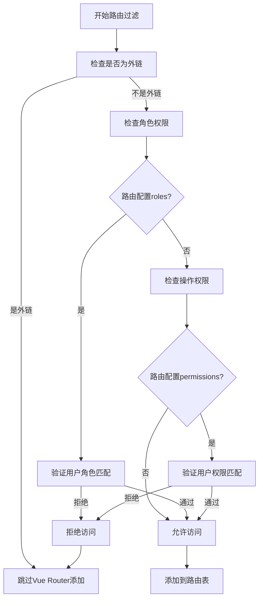
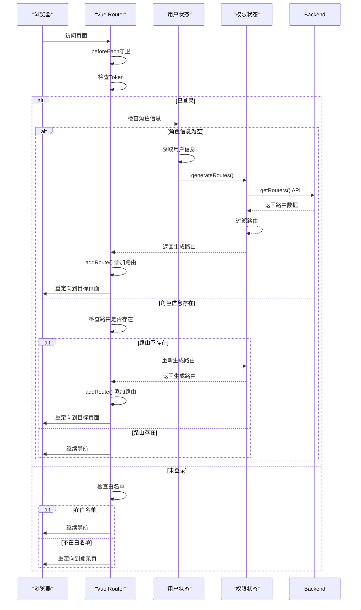

# 动态路由

<cite>
**本文档引用文件**   
- [permission.js](file://bear-jia-vue3\src\stores\permission.js)
- [vueRouter.js](file://bear-jia-vue3\src\router\vueRouter.js)
- [routes.js](file://bear-jia-vue3\src\router\routes.js)
- [menu.js](file://bear-jia-vue3\src\api\system\menu.js)
- [user.js](file://bear-jia-vue3\src\stores\user.js)
- [hasPermi.js](file://bear-jia-vue3\src\directive\permission\hasPermi.js)
- [hasRole.js](file://bear-jia-vue3\src\directive\permission\hasRole.js)
- [auth.js](file://bear-jia-vue3\src\plugins\auth.js)
- [security.js](file://bear-jia-vue3\src\utils\security.js)
- [SideMenu.vue](file://bear-jia-vue3\src\components\layout\SideMenu.vue)
</cite>

## 目录
1. [动态路由生成机制](#动态路由生成机制)
2. [路由过滤与权限验证](#路由过滤与权限验证)
3. [动态路由加载流程](#动态路由加载流程)
4. [路由元信息权限控制](#路由元信息权限控制)
5. [菜单显示逻辑](#菜单显示逻辑)
6. [安全最佳实践](#安全最佳实践)

## 动态路由生成机制

动态路由的生成始于用户登录成功后，系统通过`permissionStore.generateRoutes()`方法从后端获取用户权限路由。该方法首先调用`getRouters()` API 接口，向后端请求用户的路由配置数据。获取到路由数据后，系统会进行两次独立的过滤处理：一次用于生成Vue Router的路由表，另一次用于生成侧边栏菜单。

在生成过程中，系统会预加载所有视图组件，通过`import.meta.glob('../views/**/*.vue')`实现路由组件的懒加载。对于特殊布局组件如`Layout`、`ParentView`和`InnerLink`，会进行特殊处理并映射到具体的布局组件文件。这种分离处理确保了外链路由（以http://、https://等开头的URL）在Vue Router中被过滤掉，避免路由错误，同时在侧边栏菜单中保留显示。

**Section sources**
- [permission.js](file://bear-jia-vue3\src\stores\permission.js#L234-L263)
- [menu.js](file://bear-jia-vue3\src\api\system\menu.js#L4-L8)

## 路由过滤与权限验证

系统实现了双重路由过滤机制，分别处理角色权限(roles)和操作权限(perms)。在`filterAsyncRoutes`函数中，通过`hasPermission`方法验证用户角色是否匹配路由元信息中的roles字段。如果路由配置了meta.roles，则检查用户角色数组中是否包含至少一个匹配的角色，否则默认允许访问。

对于操作权限的过滤，`filterDynamicRoutes`函数遍历路由并检查permissions字段。通过`auth.hasPermiOr`方法验证用户是否具备任一所需权限。权限验证遵循"超级权限"原则：当用户权限包含`*:*:*`通配符时，自动获得所有权限；当用户角色为`admin`时，自动获得所有角色权限。



**Diagram sources**
- [permission.js](file://bear-jia-vue3\src\stores\permission.js#L10-L35)
- [permission.js](file://bear-jia-vue3\src\stores\permission.js#L194-L208)

**Section sources**
- [permission.js](file://bear-jia-vue3\src\stores\permission.js#L10-L35)
- [permission.js](file://bear-jia-vue3\src\stores\permission.js#L194-L208)
- [auth.js](file://bear-jia-vue3\src\plugins\auth.js#L3-L25)

## 动态路由加载流程

动态路由的加载由Vue Router的导航守卫控制。在`router.beforeEach`守卫中，系统首先检查用户是否已登录（通过`getToken()`验证）。对于已登录用户，如果用户角色信息为空，则调用`userStore.getInfo()`获取用户信息，并执行`permissionStore.generateRoutes()`生成动态路由。

生成的路由通过`router.addRoute(route)`方法安全地添加到现有路由系统中。系统会遍历生成的路由数组，逐个添加。为防止重复添加，系统在添加前会检查路由是否已存在。在页面刷新等场景下，如果当前访问的路由不在路由表中，系统会重新生成路由并重定向，确保路由系统的完整性。



**Diagram sources**
- [vueRouter.js](file://bear-jia-vue3\src\router\vueRouter.js#L38-L88)
- [user.js](file://bear-jia-vue3\src\stores\user.js#L48-L58)

**Section sources**
- [vueRouter.js](file://bear-jia-vue3\src\router\vueRouter.js#L38-L88)
- [user.js](file://bear-jia-vue3\src\stores\user.js#L48-L58)

## 路由元信息权限控制

路由的权限控制主要通过路由元信息(meta)中的特定字段实现。`roles`字段定义了访问该路由所需的角色，`permissions`字段定义了所需的操作权限。这两个字段共同构成了细粒度的权限控制体系。

除了权限控制字段，路由配置还包含多个显示控制字段。`hidden`字段决定路由是否在侧边栏菜单中显示，`alwaysShow`字段控制当父菜单只有一个子菜单时是否始终显示父菜单。这些字段为菜单的灵活展示提供了支持，允许开发者根据业务需求定制菜单结构。

```mermaid
classDiagram
class RouteMeta {
+string title
+string icon
+boolean affix
+boolean hidden
+boolean alwaysShow
+string[] roles
+string[] permissions
}
class RouteConfig {
+string path
+string name
+function component
+string redirect
+RouteMeta meta
+RouteConfig[] children
}
class UserRole {
+string[] roles
+string[] permissions
}
RouteConfig --> RouteMeta : "包含"
RouteConfig --> RouteConfig : "父子关系"
UserRole --> RouteMeta : "权限匹配"
note right of RouteMeta
权限控制字段 :
- roles : 角色权限数组
- permissions : 操作权限数组
显示控制字段 :
- hidden : 是否隐藏
- alwaysShow : 是否始终显示
- affix : 是否固定标签
end note
```

**Diagram sources**
- [routes.js](file://bear-jia-vue3\src\router\routes.js#L48-L67)
- [permission.js](file://bear-jia-vue3\src\stores\permission.js#L10-L15)

**Section sources**
- [routes.js](file://bear-jia-vue3\src\router\routes.js#L48-L67)
- [permission.js](file://bear-jia-vue3\src\stores\permission.js#L10-L15)

## 菜单显示逻辑

侧边栏菜单的显示逻辑在`SideMenu.vue`组件中实现，该组件接收`menuData`属性作为菜单数据源。菜单渲染采用三种不同的情况处理：当父菜单有多个子菜单或设置了`alwaysShow`时，渲染为可折叠的子菜单；当父菜单只有一个子菜单且未设置`alwaysShow`时，直接渲染为单个菜单项；当菜单没有子菜单时，渲染为顶级菜单项。

系统通过`isExternal`函数识别外链路由，并在外链菜单项旁边显示链接图标。点击外链菜单时，系统会在新窗口打开目标URL，而不是进行路由跳转。对于普通路由，点击菜单会触发`handleMenuClick`事件，更新选中状态并触发路由导航。菜单的激活状态通过`setCurrentMenu`方法与当前路由路径同步，确保用户导航时菜单状态正确更新。

**Section sources**
- [SideMenu.vue](file://bear-jia-vue3\src\components\layout\SideMenu.vue#L35-L122)
- [SideMenu.vue](file://bear-jia-vue3\src\components\layout\SideMenu.vue#L160-L214)

## 安全最佳实践

系统实现了多层次的安全防护机制。在路由劫持防护方面，通过`preventClickjacking`函数防止点击劫持攻击，确保应用在iframe中运行时能自动跳出。CSRF防护通过`CSRFTokenManager`类实现，为每个会话生成唯一的CSRF令牌并注入到页面meta标签中。

权限更新机制确保了权限的实时性。当用户权限发生变化时，系统会清除现有路由并重新调用`generateRoutes()`方法获取最新路由配置。敏感信息通过`maskSensitiveInfo`函数进行脱敏处理，防止个人信息泄露。内容安全策略(CSP)通过`setCSP`函数设置，限制了脚本的执行来源，有效防范XSS攻击。

在权限验证方面，系统提供了指令级控制，通过`v-hasPermi`和`v-hasRole`指令实现DOM元素级别的权限控制。这些指令在挂载时验证用户权限，如果权限不足则直接移除DOM元素，从源头上防止未授权访问。

**Section sources**
- [security.js](file://bear-jia-vue3\src\utils\security.js#L178-L182)
- [security.js](file://bear-jia-vue3\src\utils\security.js#L95-L126)
- [hasPermi.js](file://bear-jia-vue3\src\directive\permission\hasPermi.js#L8-L34)
- [hasRole.js](file://bear-jia-vue3\src\directive\permission\hasRole.js#L8-L28)