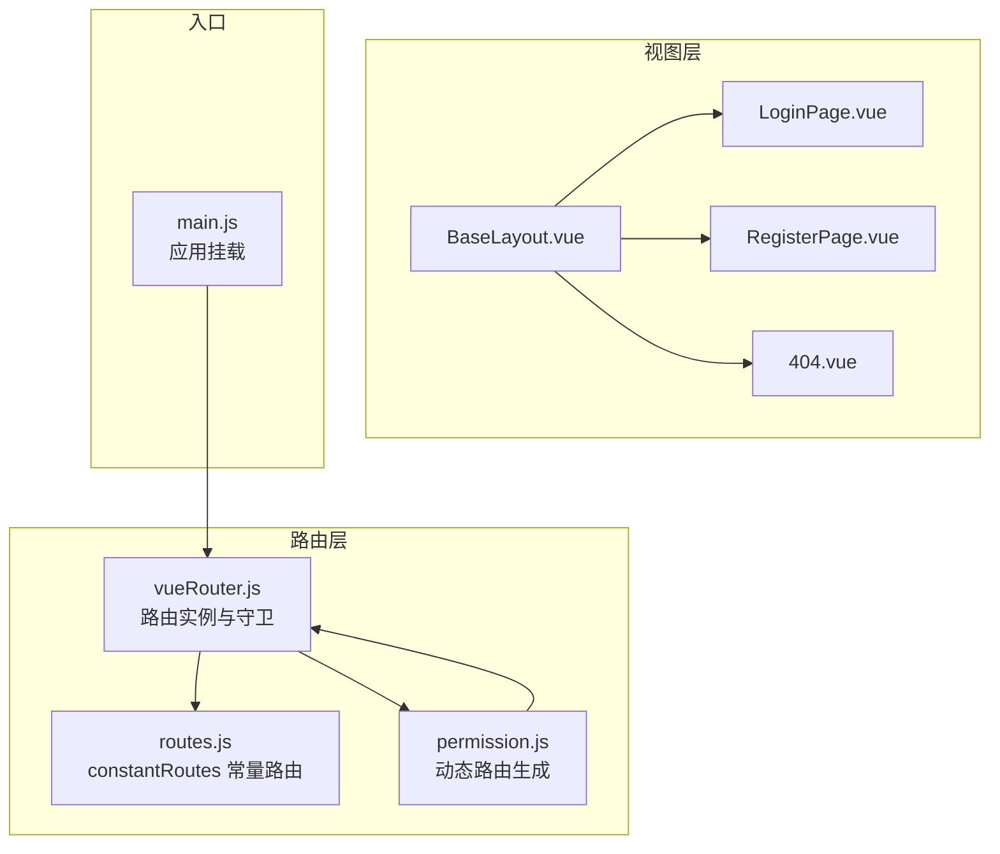
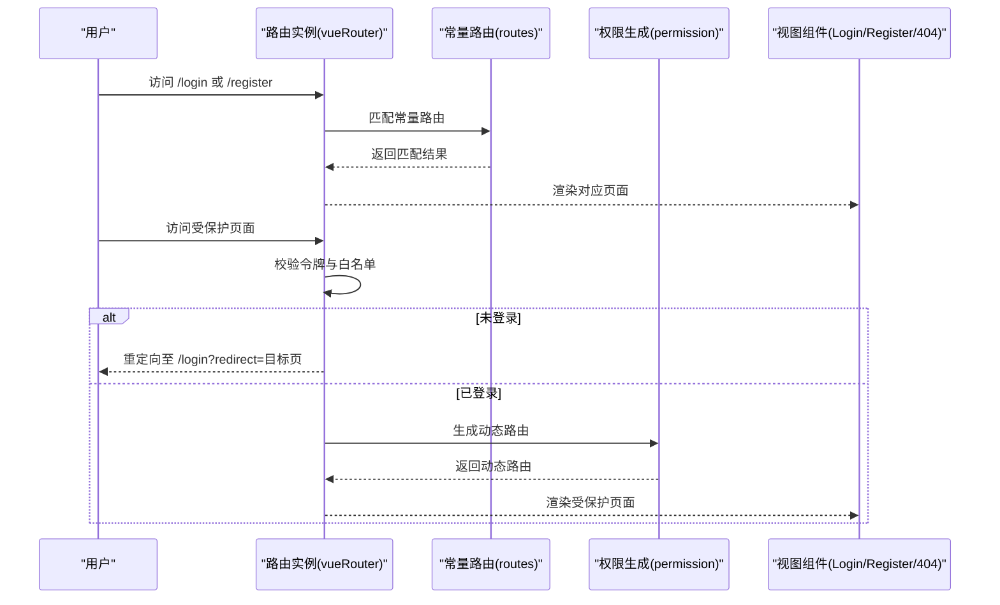
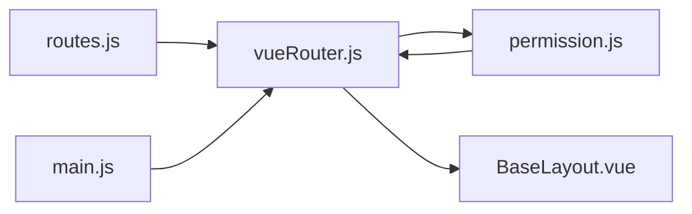

# 常量路由

<cite>
**本文引用的文件**
- [routes.js](file://bear-jia-vue3/src/router/routes.js)
- [vueRouter.js](file://bear-jia-vue3/src/router/vueRouter.js)
- [frontend.js](file://bear-jia-vue3/src/router/frontend.js)
- [permission.js](file://bear-jia-vue3/src/stores/permission.js)
- [router.d.ts](file://bear-jia-vue3/src/types/router.d.ts)
- [BaseLayout.vue](file://bear-jia-vue3/src/layout/BaseLayout.vue)
- [404.vue](file://bear-jia-vue3/src/views/error/404.vue)
- [LoginPage.vue](file://bear-jia-vue3/src/views/LoginPage.vue)
- [RegisterPage.vue](file://bear-jia-vue3/src/views/RegisterPage.vue)
- [main.js](file://bear-jia-vue3/src/main.js)
</cite>

## 目录
1. [引言](#引言)
2. [项目结构](#项目结构)
3. [核心组件](#核心组件)
4. [架构总览](#架构总览)
5. [详细组件分析](#详细组件分析)
6. [依赖关系分析](#依赖关系分析)
7. [性能考量](#性能考量)
8. [故障排查指南](#故障排查指南)
9. [结论](#结论)
10. [附录](#附录)

## 引言
本篇文档聚焦“常量路由”的配置机制与实现细节，围绕 routes.js 中定义的 constantRoutes 常量路由数组展开，系统性解析登录页、注册页、404 页面等基础路由的配置方式，阐明路由元信息（meta）中 title、icon、hidden 等字段的用途与实现逻辑，并解释这些路由为何被设计为常量路由及其在整个路由系统中的特殊地位。最后给出常量路由配置的最佳实践，包括组件懒加载的正确写法、路由命名规范和路径别名设置。

## 项目结构
常量路由位于前端路由配置目录，配合路由守卫、权限生成与布局组件共同构成完整的前端路由体系：
- 路由定义：routes.js 定义 constantRoutes 常量路由数组，包含登录、注册、404、首页工作台、系统个人资料、角色授权用户等基础路由。
- 路由实例：vueRouter.js 创建并导出路由实例，注入 constantRoutes，并在登录态下动态挂载后端生成的动态路由。
- 权限生成：permission.js 从后端拉取路由树，经过过滤与懒加载处理，最终与常量路由合并供应用使用。
- 布局渲染：BaseLayout.vue 作为主布局容器，承载菜单、头部、历史导航与内容区，负责根据路由 meta 渲染标题与图标。
- 视图组件：LoginPage.vue、RegisterPage.vue、404.vue 等基础页面按需懒加载，减少首屏体积。

图表来源
- [routes.js](file://bear-jia-vue3/src/router/routes.js#L1-L100)
- [vueRouter.js](file://bear-jia-vue3/src/router/vueRouter.js#L1-L130)
- [permission.js](file://bear-jia-vue3/src/stores/permission.js#L1-L264)
- [BaseLayout.vue](file://bear-jia-vue3/src/layout/BaseLayout.vue#L1-L260)
- [LoginPage.vue](file://bear-jia-vue3/src/views/LoginPage.vue#L1-L170)
- [RegisterPage.vue](file://bear-jia-vue3/src/views/RegisterPage.vue#L1-L176)
- [404.vue](file://bear-jia-vue3/src/views/error/404.vue#L1-L64)
- [main.js](file://bear-jia-vue3/src/main.js#L1-L62)

章节来源
- [routes.js](file://bear-jia-vue3/src/router/routes.js#L1-L100)
- [vueRouter.js](file://bear-jia-vue3/src/router/vueRouter.js#L1-L130)
- [permission.js](file://bear-jia-vue3/src/stores/permission.js#L1-L264)
- [BaseLayout.vue](file://bear-jia-vue3/src/layout/BaseLayout.vue#L1-L260)
- [main.js](file://bear-jia-vue3/src/main.js#L1-L62)

## 核心组件
- constantRoutes 常量路由数组：包含登录页、注册页、404 页面、首页工作台、系统个人资料、角色授权用户等基础路由；这些路由在应用启动时即被注册，不受登录态影响。
- 路由守卫：在未登录时仅允许访问白名单内的常量路由；登录后首次进入或刷新后丢失动态路由时，从后端生成动态路由并挂载到路由实例。
- 动态路由生成：permission.store 从后端获取路由树，过滤外链、处理组件懒加载、扁平化子路由，最终与常量路由合并。
- 布局与菜单：BaseLayout.vue 读取路由 meta 渲染标题与图标，支持多布局模式与菜单联动。

章节来源
- [routes.js](file://bear-jia-vue3/src/router/routes.js#L1-L100)
- [vueRouter.js](file://bear-jia-vue3/src/router/vueRouter.js#L1-L130)
- [permission.js](file://bear-jia-vue3/src/stores/permission.js#L1-L264)
- [BaseLayout.vue](file://bear-jia-vue3/src/layout/BaseLayout.vue#L1-L260)

## 架构总览
常量路由与动态路由协同工作：应用启动时先注册常量路由，随后在登录态下通过权限生成器拉取后端路由树，过滤并懒加载后挂载到路由实例，形成最终可访问的路由集合。未登录时仅能访问白名单内的常量路由；登录后根据用户权限动态扩展路由。

图表来源
- [vueRouter.js](file://bear-jia-vue3/src/router/vueRouter.js#L1-L130)
- [routes.js](file://bear-jia-vue3/src/router/routes.js#L1-L100)
- [permission.js](file://bear-jia-vue3/src/stores/permission.js#L1-L264)
- [LoginPage.vue](file://bear-jia-vue3/src/views/LoginPage.vue#L1-L170)
- [RegisterPage.vue](file://bear-jia-vue3/src/views/RegisterPage.vue#L1-L176)
- [404.vue](file://bear-jia-vue3/src/views/error/404.vue#L1-L64)

## 详细组件分析

### 常量路由数组（routes.js）
- 登录页与注册页：path、name、component、hidden 字段明确配置，其中 component 使用路由懒加载，chunk 名称统一为 login，便于打包优化与调试。
- 404 页面：path 为 /404，component 使用 error chunk，hidden 为 true，表示不在菜单中显示。
- 首页工作台：path 为 /home，component 为 BaseLayout，children 包含工作台与空路径重定向，meta 中包含 title、icon、affix 等字段。
- 系统个人资料与角色授权用户：均采用 BaseLayout 作为父容器，children 中定义具体页面，meta 中包含 title、icon 等字段。

章节来源
- [routes.js](file://bear-jia-vue3/src/router/routes.js#L1-L100)

### 路由元信息（meta）详解
- title：用于菜单标题与页面标题显示，BaseLayout.vue 在不同布局模式下读取 meta.title 渲染头部与面包屑。
- icon：用于菜单图标显示，BaseLayout.vue 通过 BearJiaIcon 组件渲染 meta.icon。
- hidden：控制路由是否在菜单中显示，常量路由中部分页面 hidden 为 true，表示仅作为页面访问入口而非菜单项。
- affix：固定标签页，工作台 meta 中设置 affix 为 true，确保标签页常驻。
- keepAlive：前台路由中部分页面设置 keepAlive 控制页面缓存行为。

章节来源
- [router.d.ts](file://bear-jia-vue3/src/types/router.d.ts#L1-L34)
- [BaseLayout.vue](file://bear-jia-vue3/src/layout/BaseLayout.vue#L1-L260)
- [frontend.js](file://bear-jia-vue3/src/router/frontend.js#L1-L80)

### 登录页与注册页（LoginPage.vue、RegisterPage.vue）
- 登录页：包含表单校验、验证码获取、提交登录、成功后拉取用户信息与动态路由并跳转工作台。
- 注册页：包含表单校验、验证码获取、提交注册、成功后提示并跳转登录页。
- 两者均通过路由 push 访问常量路由，体现常量路由的可直接访问特性。

章节来源
- [LoginPage.vue](file://bear-jia-vue3/src/views/LoginPage.vue#L1-L170)
- [RegisterPage.vue](file://bear-jia-vue3/src/views/RegisterPage.vue#L1-L176)

### 404 页面（404.vue）
- 作为兜底页面，当路由不存在或刷新后丢失动态路由时，通过路由守卫或布局校验跳转至 /404。
- 页面提供返回首页按钮，提升用户体验。

章节来源
- [404.vue](file://bear-jia-vue3/src/views/error/404.vue#L1-L64)
- [vueRouter.js](file://bear-jia-vue3/src/router/vueRouter.js#L1-L130)
- [BaseLayout.vue](file://bear-jia-vue3/src/layout/BaseLayout.vue#L700-L790)

### 路由守卫与动态路由生成
- 路由守卫：未登录时仅放行白名单内的常量路由；已登录时首次进入或刷新后丢失动态路由时，从后端生成动态路由并挂载。
- 动态路由生成：permission.store 从后端获取路由树，过滤外链、处理组件懒加载、扁平化子路由，最终与常量路由合并。

章节来源
- [vueRouter.js](file://bear-jia-vue3/src/router/vueRouter.js#L1-L130)
- [permission.js](file://bear-jia-vue3/src/stores/permission.js#L1-L264)

### 常量路由的设计意图与特殊地位
- 不受登录态影响：常量路由在应用启动时即注册，无需登录即可访问，保证用户在未登录状态下仍可完成登录、注册等关键流程。
- 作为系统“基础设施”：登录、注册、404 等页面属于系统基础设施，应与业务路由解耦，便于维护与扩展。
- 与动态路由解耦：动态路由由后端下发并按权限过滤，常量路由保持稳定，降低前端复杂度。

章节来源
- [routes.js](file://bear-jia-vue3/src/router/routes.js#L1-L100)
- [vueRouter.js](file://bear-jia-vue3/src/router/vueRouter.js#L1-L130)
- [permission.js](file://bear-jia-vue3/src/stores/permission.js#L1-L264)

### 组件懒加载与打包优化
- 路由懒加载：使用 import() 形式并指定 webpackChunkName，便于代码分割与缓存命中。
- 常量路由中登录页、注册页、404 页面分别使用 login、error 等 chunk 名称，有助于构建阶段的分包策略。
- 动态路由懒加载：permission.store 使用 import.meta.glob 预加载视图模块，loadView 函数按需懒加载组件，缺失时回退至 404 页面。

章节来源
- [routes.js](file://bear-jia-vue3/src/router/routes.js#L1-L100)
- [permission.js](file://bear-jia-vue3/src/stores/permission.js#L1-L264)

### 路由命名规范与路径别名建议
- 命名规范：常量路由的 name 字段采用语义化命名，如 LoginPage、RegisterPage、Workbench 等，便于调试与日志追踪。
- 路径别名：根路径 / 重定向至 /home/workbench，简化默认访问路径；系统个人资料与角色授权用户采用 BaseLayout + children 的嵌套路由结构，清晰表达父子关系。
- 路由层级：常量路由尽量保持扁平化，复杂业务通过 BaseLayout + children 组织，避免路由层级过深。

章节来源
- [routes.js](file://bear-jia-vue3/src/router/routes.js#L1-L100)
- [BaseLayout.vue](file://bear-jia-vue3/src/layout/BaseLayout.vue#L1-L260)

## 依赖关系分析
- routes.js 与 vueRouter.js：路由实例在创建时直接注入 constantRoutes，确保常量路由在应用启动时可用。
- vueRouter.js 与 permission.js：登录后通过 permission.store.generateRoutes 拉取后端路由树并挂载，形成最终路由集合。
- BaseLayout.vue 与路由 meta：读取 meta.title、meta.icon 渲染菜单与头部标题，体现常量路由 meta 的作用范围。
- main.js：应用入口挂载 router，确保路由系统在应用启动时生效。

图表来源
- [routes.js](file://bear-jia-vue3/src/router/routes.js#L1-L100)
- [vueRouter.js](file://bear-jia-vue3/src/router/vueRouter.js#L1-L130)
- [permission.js](file://bear-jia-vue3/src/stores/permission.js#L1-L264)
- [BaseLayout.vue](file://bear-jia-vue3/src/layout/BaseLayout.vue#L1-L260)
- [main.js](file://bear-jia-vue3/src/main.js#L1-L62)

章节来源
- [routes.js](file://bear-jia-vue3/src/router/routes.js#L1-L100)
- [vueRouter.js](file://bear-jia-vue3/src/router/vueRouter.js#L1-L130)
- [permission.js](file://bear-jia-vue3/src/stores/permission.js#L1-L264)
- [BaseLayout.vue](file://bear-jia-vue3/src/layout/BaseLayout.vue#L1-L260)
- [main.js](file://bear-jia-vue3/src/main.js#L1-L62)

## 性能考量
- 代码分割：常量路由与动态路由均采用 import() 懒加载，结合 webpackChunkName 实现按需加载与缓存复用。
- 首屏优化：登录页、注册页、404 页面使用懒加载，减少首屏体积；工作台等高频页面可结合 keepAlive 缓存提升交互体验。
- 动态路由过滤：permission.store 在生成动态路由时过滤外链，避免路由错误与无效加载。
- 路由守卫：在未登录时仅放行白名单内的常量路由，避免不必要的动态路由生成与网络请求。

章节来源
- [routes.js](file://bear-jia-vue3/src/router/routes.js#L1-L100)
- [permission.js](file://bear-jia-vue3/src/stores/permission.js#L1-L264)
- [vueRouter.js](file://bear-jia-vue3/src/router/vueRouter.js#L1-L130)

## 故障排查指南
- 登录后无法访问受保护页面
  - 检查路由守卫是否正确生成动态路由并挂载。
  - 查看 permission.store.generateRoutes 是否成功返回路由树。
  - 确认白名单是否包含目标路径。
- 刷新后页面空白或 404
  - 检查路由守卫中对刷新后丢失动态路由的处理逻辑。
  - 确认 permission.store.generateRoutes 是否再次执行并挂载。
- 菜单标题或图标不显示
  - 检查路由 meta.title 与 meta.icon 是否正确设置。
  - 确认 BaseLayout.vue 是否读取到 meta 并渲染 BearJiaIcon。
- 组件懒加载失败
  - 检查 import.meta.glob 预加载的视图路径是否正确。
  - 确认 loadView 函数是否能匹配到对应组件，缺失时回退至 404 页面。

章节来源
- [vueRouter.js](file://bear-jia-vue3/src/router/vueRouter.js#L1-L130)
- [permission.js](file://bear-jia-vue3/src/stores/permission.js#L1-L264)
- [BaseLayout.vue](file://bear-jia-vue3/src/layout/BaseLayout.vue#L1-L260)
- [404.vue](file://bear-jia-vue3/src/views/error/404.vue#L1-L64)

## 结论
常量路由作为系统基础设施，承担了登录、注册、404 等关键页面的路由职责，其配置简洁、稳定且与动态路由解耦。通过合理的 meta 字段与懒加载策略，既能保证首屏性能，又能灵活扩展业务路由。遵循命名规范与路径别名建议，可进一步提升路由系统的可维护性与可扩展性。

## 附录
- 常量路由最佳实践
  - 使用 import() + webpackChunkName 实现组件懒加载，合理命名 chunk 名称（如 login、error、layout、workbench）。
  - meta 字段仅包含必要信息（title、icon、hidden、affix、keepAlive），避免冗余。
  - 常量路由尽量扁平化，复杂业务通过 BaseLayout + children 组织。
  - 根路径 / 重定向至常用入口（如 /home/workbench），简化默认访问路径。
  - 白名单仅包含必要的常量路由，避免过度放行。

章节来源
- [routes.js](file://bear-jia-vue3/src/router/routes.js#L1-L100)
- [frontend.js](file://bear-jia-vue3/src/router/frontend.js#L1-L80)
- [router.d.ts](file://bear-jia-vue3/src/types/router.d.ts#L1-L34)