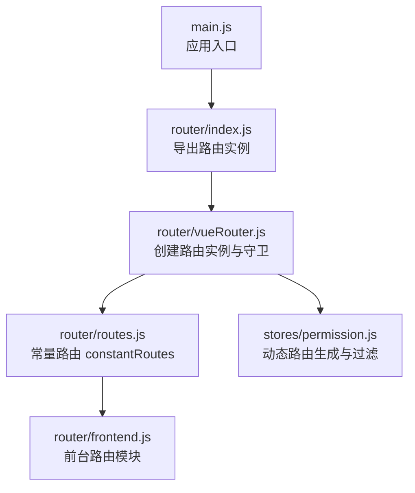
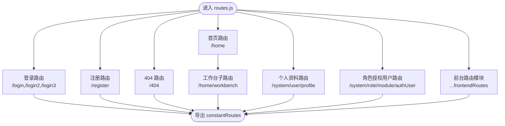
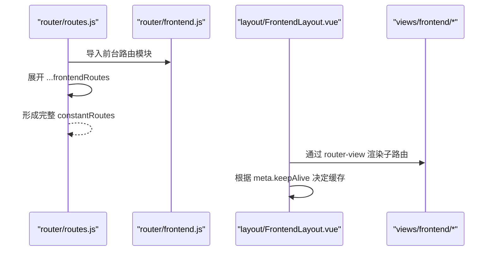
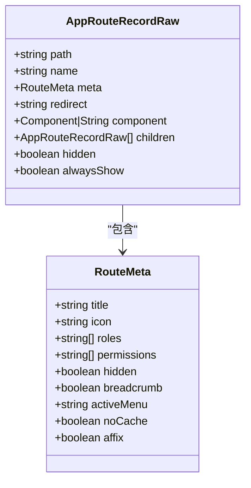
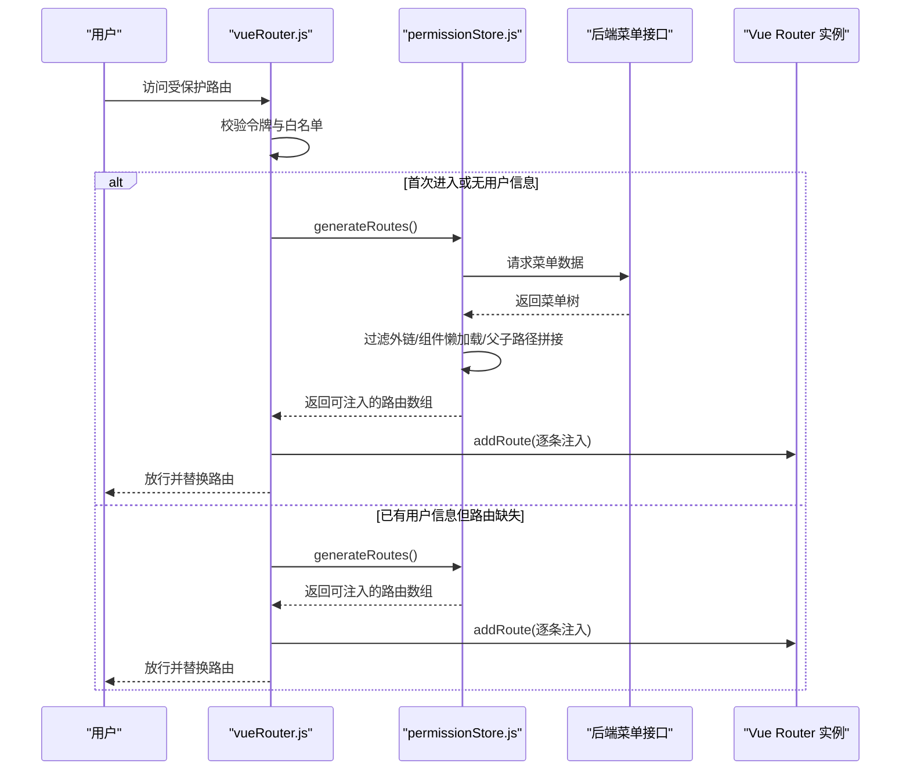
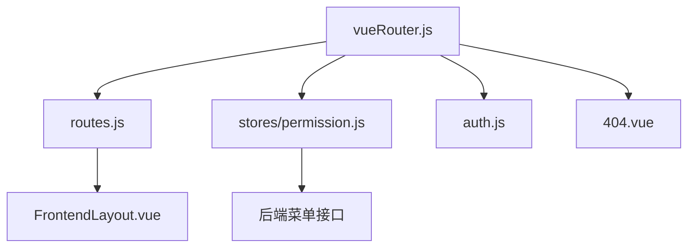

# 路由配置

<cite>
**本文引用的文件列表**
- [routes.js](file://bear-jia-vue3/src/router/routes.js)
- [frontend.js](file://bear-jia-vue3/src/router/frontend.js)
- [vueRouter.js](file://bear-jia-vue3/src/router/vueRouter.js)
- [permission.js](file://bear-jia-vue3/src/stores/permission.js)
- [router.d.ts](file://bear-jia-vue3/src/types/router.d.ts)
- [404.vue](file://bear-jia-vue3/src/views/404.vue)
- [FrontendLayout.vue](file://bear-jia-vue3/src/layout/FrontendLayout.vue)
- [auth.js](file://bear-jia-vue3/src/utils/auth.js)
- [main.js](file://bear-jia-vue3/src/main.js)
</cite>

## 目录
1. [简介](#简介)
2. [项目结构与入口](#项目结构与入口)
3. [核心路由与常量路由](#核心路由与常量路由)
4. [前台路由模块化配置](#前台路由模块化配置)
5. [路由元信息（meta）结构与用途](#路由元信息meta结构与用途)
6. [动态路由加载流程](#动态路由加载流程)
7. [最佳实践与建议](#最佳实践与建议)
8. [依赖关系与架构概览](#依赖关系与架构概览)
9. [故障排查指南](#故障排查指南)
10. [结论](#结论)

## 简介
本文件围绕前端路由配置机制展开，重点解析以下内容：
- routes.js 中定义的常量路由（登录、注册、404、工作台、系统个人资料、角色授权用户等），以及这些路由的配置方式与特点。
- frontend.js 中前台路由的独立模块化组织方式，如何通过模块化拆分不同业务场景的路由。
- 路由元信息（meta）的完整结构与字段用途，包括 title、icon、roles、permissions、affix、keepAlive 等。
- 动态路由的加载流程，如何通过 permissionStore.generateRoutes() 从后端获取用户权限路由并进行过滤与注入。
- 路由配置的最佳实践：命名规范、懒加载策略、路径别名与模块化组织。

## 项目结构与入口
- 路由入口导出统一从 router/index.js 导出，实际路由实例在 vueRouter.js 中创建，并以 constantRoutes 作为初始路由集合。
- main.js 中完成应用挂载与插件注册，其中包含 router 的安装。

**图表来源**
- [main.js](file://bear-jia-vue3/src/main.js#L1-L62)
- [index.js](file://bear-jia-vue3/src/router/index.js#L1-L2)
- [vueRouter.js](file://bear-jia-vue3/src/router/vueRouter.js#L1-L130)
- [routes.js](file://bear-jia-vue3/src/router/routes.js#L1-L100)
- [frontend.js](file://bear-jia-vue3/src/router/frontend.js#L1-L80)
- [permission.js](file://bear-jia-vue3/src/stores/permission.js#L1-L264)

**章节来源**
- [main.js](file://bear-jia-vue3/src/main.js#L1-L62)
- [index.js](file://bear-jia-vue3/src/router/index.js#L1-L2)

## 核心路由与常量路由
- 登录与注册路由：提供多个登录页与注册页路由，均标记为隐藏，便于白名单放行与跳转。
- 404 路由：隐藏路由，作为兜底页面，配合路由守卫与错误处理。
- 工作台路由：根布局 BaseLayout 下的子路由，包含工作台与空路径重定向，meta 中包含标题、图标与固定标签（affix）。
- 系统个人资料路由：嵌套 BaseLayout，子路由指向用户资料页面。
- 角色授权用户路由：嵌套 BaseLayout，子路由指向角色授权用户页面，meta 中包含标题与图标。
- 前台路由：通过扩展运算符引入 frontend.js 中的前台路由模块，形成完整的常量路由集合。

**图表来源**
- [routes.js](file://bear-jia-vue3/src/router/routes.js#L1-L100)

**章节来源**
- [routes.js](file://bear-jia-vue3/src/router/routes.js#L1-L100)

## 前台路由模块化配置
- 前台路由独立定义在 frontend.js 中，采用嵌套路由结构，顶层 component 指向 FrontendLayout.vue，内部 children 定义首页、关于、联系等页面。
- 前台路由通过扩展运算符合并进 constantRoutes，实现模块化组织与可维护性。
- FrontendLayout.vue 中使用 keep-alive 与 router-view 结合，根据 meta.keepAlive 控制页面缓存；同时提供导航菜单与回到顶部等交互。

**图表来源**
- [routes.js](file://bear-jia-vue3/src/router/routes.js#L1-L100)
- [frontend.js](file://bear-jia-vue3/src/router/frontend.js#L1-L80)
- [FrontendLayout.vue](file://bear-jia-vue3/src/layout/FrontendLayout.vue#L1-L238)

**章节来源**
- [frontend.js](file://bear-jia-vue3/src/router/frontend.js#L1-L80)
- [FrontendLayout.vue](file://bear-jia-vue3/src/layout/FrontendLayout.vue#L1-L238)

## 路由元信息（meta）结构与用途
- 类型声明：在 router.d.ts 中定义了 RouteMeta 接口，包含 title、icon、roles、permissions、hidden、breadcrumb、activeMenu、noCache、affix 等字段。
- 实际使用：
  - title：用于菜单与面包屑显示名称。
  - icon：用于菜单图标。
  - roles：基于角色的权限控制（permission.js 中 hasPermission 与 filterAsyncRoutes 使用）。
  - permissions：基于权限字符串的控制（permission.js 中 filterDynamicRoutes 使用）。
  - hidden：隐藏路由，不参与菜单渲染。
  - affix：固定标签页。
  - keepAlive：FrontendLayout.vue 中用于控制页面缓存。

**图表来源**
- [router.d.ts](file://bear-jia-vue3/src/types/router.d.ts#L1-L34)

**章节来源**
- [router.d.ts](file://bear-jia-vue3/src/types/router.d.ts#L1-L34)
- [permission.js](file://bear-jia-vue3/src/stores/permission.js#L1-L264)
- [FrontendLayout.vue](file://bear-jia-vue3/src/layout/FrontendLayout.vue#L178-L190)

## 动态路由加载流程
- 路由守卫：在 vueRouter.js 的 beforeEach 中，当存在令牌且用户信息为空时，调用 permissionStore.generateRoutes() 获取后端路由数据。
- 动态生成：permissionStore.generateRoutes() 会请求后端菜单接口，复制数据后分别生成侧边栏路由与 Vue Router 路由（侧边栏保留外链，Vue 路由过滤外链），并将结果写入 store 并注入到路由实例中。
- 注入与刷新：每次进入受保护路由时，若检测到目标路由不在当前路由表中（可能因刷新丢失），会重新生成并注入一次，保证路由完整性。

**图表来源**
- [vueRouter.js](file://bear-jia-vue3/src/router/vueRouter.js#L37-L99)
- [permission.js](file://bear-jia-vue3/src/stores/permission.js#L234-L261)

**章节来源**
- [vueRouter.js](file://bear-jia-vue3/src/router/vueRouter.js#L37-L99)
- [permission.js](file://bear-jia-vue3/src/stores/permission.js#L1-L264)

## 最佳实践与建议
- 路由命名规范
  - 使用语义化 name，如 LoginPage、RegisterPage、FrontendHome、Workbench 等，便于调试与菜单匹配。
  - 子路由与父路由保持层级清晰，避免深层嵌套导致路径冗长。
- 懒加载配置
  - 所有路由组件均采用动态导入（路由懒加载），结合 webpackChunkName 优化打包分包，减少首屏体积。
  - 前台路由同样采用动态导入，确保按需加载。
- 路径别名与模块化
  - 将前台路由抽离为独立模块（frontend.js），通过扩展运算符合并进常量路由，提升可维护性。
  - 常量路由集中管理登录、注册、404、工作台、系统个人资料、角色授权用户等基础路由。
- 权限控制
  - meta.roles 与 meta.permissions 字段用于前端权限校验，permission.js 中 hasPermission 与 filterDynamicRoutes 提供过滤逻辑。
  - 外链路由在 Vue Router 中会被过滤，仅在菜单中显示，避免路由错误。
- 页面缓存
  - 前台路由 meta.keepAlive 控制页面缓存，FrontendLayout.vue 中根据当前路由 meta.keepAlive 决定是否加入 keep-alive include。
- 错误兜底
  - 404 路由隐藏，配合路由守卫与 onError 处理，提升用户体验与稳定性。

**章节来源**
- [routes.js](file://bear-jia-vue3/src/router/routes.js#L1-L100)
- [frontend.js](file://bear-jia-vue3/src/router/frontend.js#L1-L80)
- [permission.js](file://bear-jia-vue3/src/stores/permission.js#L1-L264)
- [404.vue](file://bear-jia-vue3/src/views/404.vue#L1-L68)
- [FrontendLayout.vue](file://bear-jia-vue3/src/layout/FrontendLayout.vue#L178-L190)

## 依赖关系与架构概览
- 路由实例创建与守卫：vueRouter.js 负责创建路由实例、白名单与 beforeEach/afterEach 守卫。
- 常量路由：routes.js 定义登录、注册、404、工作台、系统个人资料、角色授权用户与前台路由模块。
- 动态路由：permission.js 负责从后端拉取菜单树，过滤外链、组件懒加载、父子路径拼接，并注入到路由实例。
- 元信息类型：router.d.ts 定义 RouteMeta 字段，确保类型安全。
- 前台布局：FrontendLayout.vue 提供前台页面的统一布局、导航与缓存控制。
- 认证工具：auth.js 提供令牌读取与设置，配合路由守卫实现登录拦截。

**图表来源**
- [vueRouter.js](file://bear-jia-vue3/src/router/vueRouter.js#L1-L130)
- [routes.js](file://bear-jia-vue3/src/router/routes.js#L1-L100)
- [permission.js](file://bear-jia-vue3/src/stores/permission.js#L1-L264)
- [FrontendLayout.vue](file://bear-jia-vue3/src/layout/FrontendLayout.vue#L1-L238)
- [auth.js](file://bear-jia-vue3/src/utils/auth.js#L1-L16)
- [404.vue](file://bear-jia-vue3/src/views/404.vue#L1-L68)

**章节来源**
- [vueRouter.js](file://bear-jia-vue3/src/router/vueRouter.js#L1-L130)
- [routes.js](file://bear-jia-vue3/src/router/routes.js#L1-L100)
- [permission.js](file://bear-jia-vue3/src/stores/permission.js#L1-L264)

## 故障排查指南
- 登录后仍被重定向至登录页
  - 检查白名单是否包含目标路径，确认 getToken 是否能正确读取令牌。
  - 确认 permissionStore.generateRoutes() 是否成功返回路由并被 addRoute 注入。
- 页面刷新后路由丢失
  - 路由守卫会在检测到目标路由不在当前表时重新生成并注入，若仍失败，检查后端菜单接口返回结构与过滤逻辑。
- 404 页面未显示
  - 确认 404 路由已加入 constantRoutes 且未被隐藏。
  - 检查路由守卫 onError 是否触发，必要时手动跳转至 404。
- 前台页面未缓存
  - 检查目标路由 meta.keepAlive 是否为 true，FrontendLayout.vue 中 keep-alive include 是否包含当前路由 name。

**章节来源**
- [vueRouter.js](file://bear-jia-vue3/src/router/vueRouter.js#L37-L99)
- [permission.js](file://bear-jia-vue3/src/stores/permission.js#L234-L261)
- [404.vue](file://bear-jia-vue3/src/views/404.vue#L1-L68)
- [FrontendLayout.vue](file://bear-jia-vue3/src/layout/FrontendLayout.vue#L178-L190)

## 结论
本项目通过 routes.js 统一管理常量路由，frontend.js 实现前台路由模块化，permissionStore 与路由守卫共同完成动态路由的拉取、过滤与注入。meta 元信息覆盖了标题、图标、权限、缓存等多个方面，配合懒加载与模块化组织，既保证了性能，也提升了可维护性。遵循本文的最佳实践，可在复杂业务场景下保持路由系统的清晰与稳定。